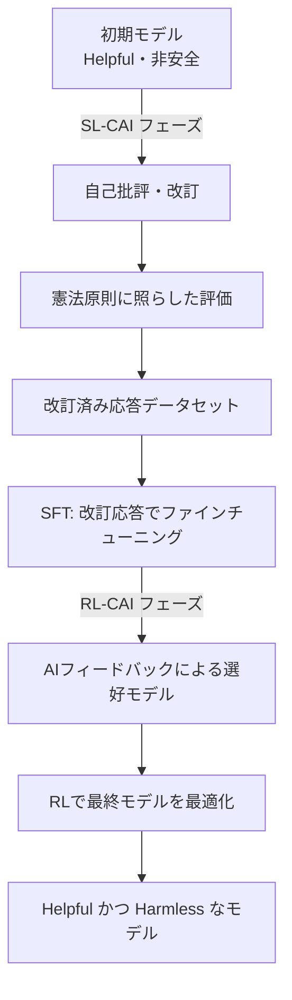

2026年1月22日、Anthropicは「Claude's Constitution（クロードの憲法）」と呼ばれる文書を公開した。約2万3,000語に及ぶこの文書は、Claudeの行動原則・価値観・判断基準を詳細に記述したものであり、**Creative Commons CC0 1.0**ライセンス、すなわちパブリックドメインに相当するライセンスで全文が公開された。

CC0公開は「誰でも無制限に使用・改変・採用できる」ことを意味する。AI企業が自社モデルの訓練に使用する中核的な憲法文書をパブリックドメインで公開するのは、業界初の試みだ。

## Constitutional AIとは何か

### 2022年の原論文から始まった技術

Constitutional AIの概念は、2022年12月にAnthropicが発表した論文「Constitutional AI: Harmlessness from AI Feedback」（arXiv:2212.08073）で初めて体系的に提示された。

従来のRLHF（Reinforcement Learning from Human Feedback）では、人間のフィードバックを大量に収集してモデルを安全な方向に誘導していた。しかしこのアプローチには根本的な課題があった——スケールしないという問題だ。モデルが強力になるほど、評価に必要な人間の専門性が上がり、コストは指数的に増大する。

Constitutional AIが提案した解決策は「AIフィードバックによるRLHF」、すなわち**RLAIF（Reinforcement Learning from AI Feedback）**だ。

### CAIの技術的フロー



**SL-CAIフェーズ（教師あり学習）**では、モデル自身が自分の有害な応答を憲法原則に照らして批評し、改訂する。例えば「この応答は人種差別的な前提を含んでいる。憲法原則X（平等な扱い）に反する」と自己評価し、改訂版を生成する。改訂済み応答でファインチューニングを行う。

**RL-CAIフェーズ（強化学習）**では、複数の候補応答のうちどちらが憲法原則により合致するかをAIが評価し、選好データセットを構築する。このデータで報酬モデルを訓練し、RLでメインモデルを最適化する。

この手法の核心は「ラベル付けに必要な人間の監督を、憲法というテキスト文書のみに圧縮した」点にある。人間が直接評価する代わりに、AIが憲法を参照して評価を行う。人件費のスケーリング問題を大幅に緩和できる。

## 2026年版「Claude's Constitution」が変えたもの

### ルールリストから原則ベースの推論へ

2023年に公開された初期の「Constitutional AI」文書は、おおむね「やってはいけないこと」のルールリストに近い形式だった。禁止事項を明記し、モデルがそのリストを参照してチェックする構造だ。

2026年版はアーキテクチャ的に異なる。4つの優先順位を持つ包括的な推論フレームワークとして設計されている。

| 優先順位 | 項目 |
|---------|------|
| 1 | **安全性（Broadly Safe）**: AIシステムへの適切な人間の監督を支持する |
| 2 | **倫理性（Generally Ethical）**: 誠実さと有害性の回避 |
| 3 | **ガイドライン遵守（Adherent to Anthropic's Principles）**: 社のポリシーに従う |
| 4 | **有用性（Genuinely Helpful）**: ユーザー・オペレーターへの真の支援 |

重要なのは優先順位の哲学的含意だ。安全性が有用性より優先されるのは「有用性のために安全性を犠牲にしてはならない」という原則を明示的に宣言している。しかし通常の業務では4番目の有用性が主要な評価軸になる——上位の原則を侵害しない範囲で最大限有用であれ、という設計だ。

### モデルに「なぜ」を教える

2026年版で最も注目すべき変化は、ルールの背景にある「なぜ」を詳細に説明している点だ。

例えば「暴力的なコンテンツを生成しない」というルールは、多くのAI安全性ガイドラインに含まれる。しかし2026年版のClaudeの憲法は、このルールの背後にある価値観——人の尊厳の尊重、現実世界での害の防止、表現の自由との緊張関係——まで丁寧に説明する。

Anthropicが目指すのは「ルールを暗記したモデル」ではなく「原則を理解して未知の状況にも適用できるモデル」だ。これはルールが想定していない新しい状況（新しい技術、新しい社会問題、新しいユースケース）が常に生まれる現実への対応だ。

```
【旧来のアプローチ】
IF 要求が禁止リストに一致 THEN 拒否
ELSE 応答

【原則ベースアプローチ】
1. この要求の意図と文脈は何か
2. 関連する原則はどれか
3. 各原則はこの状況でどのように適用されるか
4. 原則間のトレードオフをどう解決するか
5. 全体的に最も倫理的な応答は何か
```

### 大規模なドキュメント公開の意味

2万3,000語という規模も注目に値する。これは短編小説に相当するテキスト量だ。表面的なルールリストではなく、価値観・判断プロセス・判断が難しいケースへの対処方針まで、詳細に記述されている。

これほどの詳細さには副次的効果がある——企業の意思決定者やユーザーが「Claudeはなぜそのように振る舞うのか」を理解できる透明性の向上だ。AIシステムの「ブラックボックス」問題への一つの回答とも言える。

## CC0公開が業界に問いかけること

### AI安全性のオープンソース化という実験

Constitutional AIの憲法文書をCC0で公開することは、AI安全性研究のオープンソース化という観点から大きな意義を持つ。

**研究コミュニティへの恩恵**: 大学・研究機関がAnthropicのアプローチを検証・拡張・批判できる。安全性研究は「誰がより安全なAIを作るかを競う」ゲームである前に、「安全なAIとは何かを理解する」共同作業であるべきという思想の体現だ。

**他AI企業への波及**: OpenAI・Google・Metaなどの競合他社が同様の文書を参照・採用・改変できる。短期的に競争優位を失うように見えるが、業界全体のAI安全性水準が向上すれば、規制当局や社会からの信頼を業界全体で獲得できる。

**開発者コミュニティへの影響**: 中小のAI企業や個人開発者が、ゼロから安全性フレームワークを設計するコストを省ける。

### 「競争優位の放棄」か「标準を支配する戦略」か

CC0公開に対する批判的な視点も存在する。競合他社がClaudeの憲法を採用し、実質的に「Anthropicが設計した安全性フレームワーク」が業界標準になるとすれば、それはAnthropicにとって有利な状況でもある。

標準化とは「自分の設計思想を業界のデファクトにする」ことでもある。LinuxはIBMやSun Microsystemsの独自UNIXに対抗するためにオープンソース化されたが、その結果Linuxが支配的プラットフォームになった。Constitutional AI のCC0公開が同様の動学をAI安全性の世界で引き起こすとすれば、Anthropicは「安全性フレームワーク」の名前無きリーダーになる。

### 残る問いかけ

CC0公開でも解決されない問題がある。

**実装のギャップ**: 憲法文書を公開しても、それをどのように訓練プロセスに統合するかのノウハウは公開されていない。「憲法」を読んだ他社が同等の安全性を実現できるかは別問題だ。

**評価の難しさ**: Claudeの憲法に準拠しているかどうかを客観的に測定する指標は公開されていない。「原則ベースの推論」は定性的であり、ベンチマーク化が難しい。

**価値観の普遍性**: 2万3,000語の文書に込められた価値観は、主に英語圏・西洋的な文脈を前提としている。グローバルなAIシステムにこの価値観を適用することの適切さは、継続的な議論が必要だ。

## Anthropicのガバナンス戦略における位置付け

Constitutional AIのCC0公開は、Anthropicのより広い透明性戦略の一部だ。同社は「Long-Term Benefit Trust」と呼ばれるガバナンス機構を持ち、2026年1月にはカリフォルニア州最高裁判事経験者のMariano-Florentino Cuéllar氏を新メンバーとして迎えた。法律・国際問題の専門家をガバナンス体制に組み込む姿勢は、AI規制議論が本格化する中での戦略的選択だ。

Constitutional AI論文の発表（2022年）→ 初期憲法の公開（2023年）→ 改訂版憲法のCC0公開（2026年1月）という流れは、研究→実践→業界標準化という段階的な影響力拡大のシナリオを見せている。

## まとめ

Anthropicの「Claude's Constitution」CC0公開は、単なる情報公開以上の意味を持つ。

技術的には、ルールリストから原則ベースの推論フレームワークへの移行が、AI安全性の実装方法論そのものを更新する試みだ。Constitutional AIとRLAIFの組み合わせは、人間監督のコスト問題に対する現実的な回答を提供している。

戦略的には、AI安全性フレームワークのオープン化は、Anthropicが主導する形での業界標準形成を目指す動きと読める。CC0という最も制限の少ないライセンスを選んだことは、普及を最大化し、将来的なフォークや採用を促進する意図の表れだ。

そして社会的には、「AIとは何か・どう振る舞うべきか」という問いへの企業側からの公開回答として、研究者・政策立案者・一般市民との対話を促進する役割を担っている。

AI安全性の議論が「Anthropicだけの問題」から「業界・社会全体の問題」へと移行する過程で、Constitutional AIのCC0公開はその移行を象徴するマイルストーンになるだろう。
