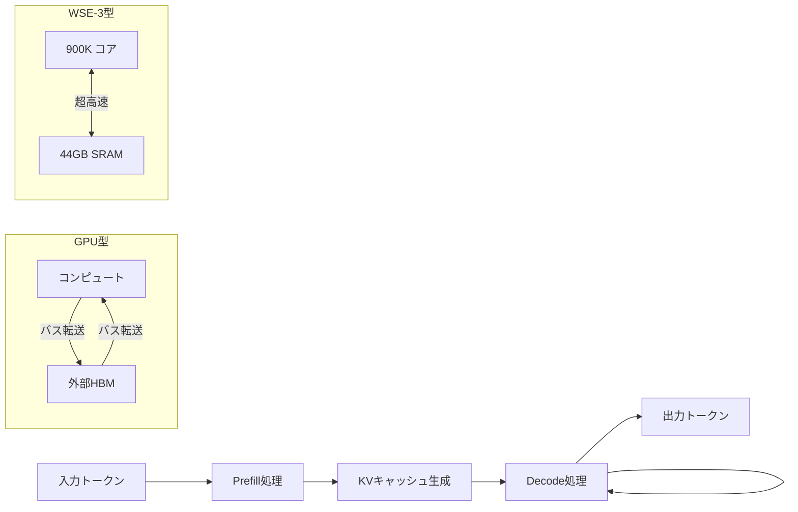

2026年1月14日、AI業界に衝撃が走った。OpenAIがCerebras Systemsと100億ドルを超える多年間契約を締結したことが明らかになったのだ。この発表は単なる調達契約にとどまらず、NVIDIA一強体制が続いてきたAIアクセラレーター市場に、初めて本格的な亀裂が生じたことを意味する。

2026年2月には、この提携の最初の成果として「GPT-5.3-Codex-Spark」が発表された。Cerebrasの最新チップWSE-3を搭載したこのモデルは、毎秒1,000トークンを超える推論速度を実現し、従来比約15倍の高速化を達成した。

本記事では、Cerebasの技術革新の本質、OpenAIとの提携の経緯と意義、そしてこの動きがAIインフラ全体に与える影響を詳しく解説する。

## CerebasとWSE-3：ウェーハスケールコンピューティングの革命

### 従来のGPUアーキテクチャの限界

AI推論において、GPUが長年にわたって支配的な地位を占めてきた背景には、並列計算能力の高さがある。しかし、GPUには根本的なアーキテクチャ上の制約がある。

GPUはもともとグラフィックス処理のために設計されており、コアはHBM（High Bandwidth Memory）という外部メモリとバスで接続されている。この「コンピュート ↔ メモリ間のデータ転送」がボトルネックになりやすい。大規模なLLMを推論する際、モデルのパラメータをメモリとコンピュートの間で頻繁にやり取りする必要があるため、帯域幅の制約が性能の天井を決定づける。

さらに、複数のGPUを連携させる場合は、GPU間の通信オーバーヘッドが加わる。NVIDIAのNVLinkは高速なGPU間接続を提供しているが、それでも同一チップ内のメモリ帯域幅には遠く及ばない。

### WSE-3のアーキテクチャ

Cerabras WSE-3（Wafer Scale Engine 3）は、このボトルネックを根本から解決するアプローチを取る。

その特徴は「ウェーハスケール」という設計思想だ。通常、半導体チップは一枚のシリコンウェーハから多数の小さなダイを切り出して製造する。WSE-3はこの常識を覆し、ウェーハ全体を一つのチップとして使用する。

```
通常のGPU（ダイサイズ比較）:
  NVIDIA H100: 約 814 mm²（チップ1つ）
  Cerebras WSE-3: 46,225 mm²（ウェーハ全体）
  → WSE-3 は H100 の約 56倍の面積
```

WSE-3の主要スペックは以下の通りだ。

| 仕様 | 数値 |
|------|------|
| コア数 | 900,000 |
| オンチップSRAM | 44 GB |
| 内部メモリ帯域幅 | 27 PB/秒 |
| FP16演算能力 | 12.5 PFLOPS |
| スパース演算能力 | 125 PFLOPS |

特筆すべきは内部メモリ帯域幅の27 PB/秒という数字だ。NVIDIAのNVLink相互接続が提供する帯域幅の200倍以上に相当する。LLMの推論では、パラメータをメモリから高速にフェッチする能力が直接的に速度を決定するため、この圧倒的な帯域幅が推論高速化の核心となる。

### なぜLLM推論に有利なのか

LLM推論の計算特性を考えると、ウェーハスケール設計がなぜ有効かが分かる。

LLMの推論は「デコード」フェーズで大量のメモリ読み書きが発生する。トークンを一つ生成するたびに、モデルのすべてのパラメータと、これまでのキーバリューキャッシュ（KVキャッシュ）にアクセスする必要がある。

GPUでこれを行うと、外部HBMへのアクセスが発生し、その都度、バス帯域幅の制約を受ける。WSE-3の場合、パラメータの多くをオンチップSRAMに保持できるため、外部メモリへのアクセスを最小化でき、大幅な高速化が実現する。



## OpenAI×Cerebras：100億ドル契約の全貌

### 契約の規模と内容

2026年1月14日に発表されたOpenAI-Cerebras契約は、AI業界史上最大規模のチップ調達契約の一つとして記録される。

主な内容は以下の通りだ。

- **契約金額**: 100億ドル超（報道各社）
- **期間**: 2026年〜2028年の多年間契約
- **規模**: CS-3マシン32,768台、計16,384ラック
- **電力容量**: 753.7 MW（約0.75 GW）
- **設置場所**: 米国内データセンター複数拠点（第1拠点は2026年Q1から稼働）

この規模が示す計算能力は膨大だ。1台のCS-3が12.5 PFLOPSの演算能力を持つことを考えると、32,768台で合計約40万PFLOPSとなる計算になる。

### なぜOpenAIがNVIDIA以外に目を向けたのか

OpenAIがNVIDIA H100に多くを依存してきたことは業界の常識だった。それでも、今回の大規模なCerebasとの提携に踏み切った背景には複数の要因がある。

**第一は、推論速度の要件**だ。AIアシスタントがリアルタイムで応答する用途では、単純なスループット（処理量）だけでなく、レイテンシ（応答遅延）が重要になる。Cerebasのシステムは、特にデコードフェーズの高速化において、NVIDIA GPUを大きく凌駕する。

**第二は、コスト効率**だ。AIサービスの拡大に伴い、推論コストがOpenAIの経営課題となっている。より少ないハードウェアで同等の推論能力を実現できれば、コスト構造を改善できる。

**第三は、供給チェーンの多様化**だ。NVIDIA一社への依存はサプライチェーンリスクを生む。代替サプライヤーとの関係構築は、ビジネス継続性の観点からも重要な戦略だ。

**第四は、用途特化の最適化**だ。コード生成のような特定のタスクでは、汎用GPUよりも特化型アーキテクチャが優れた費用対効果を示すことがある。

### GPT-5.3-Codex-Sparkの登場

2026年2月12日、この提携の最初の具体的成果が発表された。「GPT-5.3-Codex-Spark」だ。

Cerebras WSE-3チップを搭載したこのモデルは、毎秒1,000トークンを超える推論速度を実現した。OpenAIが従来のNVIDIA環境で運用していたCodexモデルと比較すると、約15倍の高速化だ。

ChatGPT Proユーザー向けにリサーチプレビューとして提供が開始され、特に「エージェント型コーディング」——AIがコードを自律的に書き、テストし、修正するフロー——で大きな効果を発揮した。

エージェント型タスクでは、LLMが複数ステップにわたって推論を行うため、一回あたりのレイテンシが積み重なる。推論速度が15倍になれば、エージェントが10ステップのタスクを完了するまでの時間が大幅に短縮される。これはユーザー体験に直結する改善だ。

## AIインフラ多様化の潮流

### NVIDIAの独占体制に生じた亀裂

NVIDIAは長年、AIアクセラレーター市場でほぼ独占的な地位を占めてきた。CUDA（Compute Unified Device Architecture）という独自のプログラミングモデルが、開発者の間で事実上の標準となったことが、その地位を盤石にしてきた。

しかし、2026年のCerebrasの台頭は、この構造に本格的な変化が生じている可能性を示す。

重要なのは、OpenAIの選択が市場に送るシグナルだ。OpenAIほどの規模と影響力を持つ企業がCerebasを採用したという事実は、他のAIサービス企業やクラウドプロバイダーにとって、代替アーキテクチャの評価を促す強力なインセンティブになる。

### AWS×Cerabrasの追加展開

OpenAIとの契約に続き、2026年3月にはAmazon Web Services（AWS）がCerebasとの提携を発表した。WSE-3チップをAmazon Bedrock経由でクラウドユーザーに提供する計画だ。

この提携の技術的アーキテクチャは注目に値する。AWSはPrefillフェーズ（入力を処理する段階）にTrainium（AWS独自チップ）を使い、DecodeフェーズにCerebasのCS-3を割り当てる分業構成を採用した。EFA（Elastic Fabric Adapter）ネットワークで両者を高速接続する。

```
[プロンプト入力]
      ↓
AWS Trainium (Prefill)
   → KVキャッシュ生成
      ↓ EFA高速転送
Cerebras CS-3 (Decode)
   → トークン生成（×5倍速）
      ↓
[レスポンス出力]
```

この分業設計により、各チップが得意な処理を担当し、全体として5倍の速度向上が期待されるという。

### 今後の競争構図

Cerebasの躍進はNVIDIAにとって脅威ではあるが、市場全体の構図はより複雑だ。

**NVIDIAの強み**: CUDA エコシステム、広範な開発者コミュニティ、訓練（Training）フェーズでの圧倒的な実績。推論特化のCerebasに対し、NVIDIAはトレーニングと推論の両方をカバーする汎用性を持つ。

**Cerebasの強み**: 推論レイテンシの極小化、エネルギー効率、コード生成等の特定タスクでの優位性。IPO準備中であり、OpenAIとの大型契約がその企業価値を大きく高めた。

**AWSのTrainium**: Amazonが独自設計するAI特化チップ。AWSクラウド内での推論コスト最適化を目指す。Cerebasとの提携は補完的な関係として機能している。

**Google TPU**: Googleが長年開発してきたTensor Processing Unit。Google Cloud上でのAI推論・訓練に活用されており、Cerebasとは直接競合する市場も存在する。

## 開発者・エンジニアへの実務的含意

### レイテンシ感受性の高い用途での優先評価

毎秒1,000トークンという速度は、ユーザーインターフェースのデザインを変える可能性がある。現在、多くのLLMインターフェースはストリーミング表示（生成しながら表示）を採用しているが、推論が十分に高速であれば、一括表示（全文生成後に表示）でも実用的なレスポンスタイムを実現できる。

エージェント型アプリケーション——複数のLLM呼び出しが連鎖するフロー——では、各ステップのレイテンシが直接ユーザー体験に影響する。高速推論インフラは、このような用途で最も大きな差異を生む。

### コード生成・エージェントコーディングへの影響

Spotifyのエンジニアが「一行もコードを書かなくなった」という事例が象徴するように、エージェント型コーディングは産業的な現実になりつつある。このフローにおいて、推論速度はエンジニアの生産性に直結する。

コード生成 → テスト実行 → エラー分析 → 修正の一サイクルが数秒で完了するならば、エンジニアはより迅速に反復を重ねられる。Cerebasの高速推論はこの反復サイクルを大幅に短縮する。

### インフラコスト管理の複雑化

一方で、複数のアクセラレーターアーキテクチャが共存する環境では、インフラ管理の複雑さが増す。CUDA向けに最適化されたコードはCerebasでそのまま動かない場合があり、移植コストが発生することもある。

APIベースでアクセスする場合（OpenAIやAWSのマネージドサービス）はこの問題を回避できるが、自社でインフラを構築する場合は、アーキテクチャ選定の判断がより重要になる。

## まとめ

Cerebras×OpenAIの提携は、AIインフラの多様化時代の到来を告げる出来事だ。100億ドル超の契約、GPT-5.3-Codex-Sparkでの毎秒1,000トークン超の速度実現、そしてAWS×Cerabrasへの展開は、NVIDIAが独占してきた市場に本格的な競争が生まれたことを示している。

技術的な核心は、WSE-3のウェーハスケール設計が実現する圧倒的なオンチップ帯域幅だ。この特性が、LLMの推論——特にデコードフェーズ——で圧倒的な速度優位を生み出している。

エージェント型AIが普及するにつれ、推論レイテンシの重要性はさらに高まる。複数のLLM呼び出しが連鎖するエージェントフローでは、一回あたりの推論速度が最終的なユーザー体験を決定するからだ。

AIインフラの選択肢が多様化することは、開発者・企業・社会全体にとって好ましい変化だ。競争が激化することで技術革新が加速し、コストが下がり、より多くの用途にAIが展開されるようになる。Cerebrasの挑戦は、そのような良性競争の一端を担う動きとして注目に値する。
