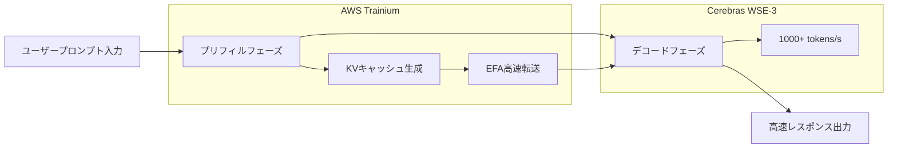

AIインフラの歴史において、2026年初頭は一つの転換点として記憶されることになるだろう。OpenAIがCerebrasとの100億ドル超の契約を締結し、NVIDIA製GPU以外の推論アクセラレーターを本番環境に初めて大規模導入したのだ。その象徴が「GPT-5.3-Codex-Spark」—毎秒1,000トークンを超える速度で動作するコーディング特化モデルである。

この動きは単なる調達先の変更ではない。長年にわたってAIハードウェア市場を独占してきたNVIDIAの牙城に、本質的な競争が持ち込まれたことを意味する。本稿では、Cerebras WSE-3アーキテクチャの技術的詳細、OpenAIとの契約の背景、そしてAIインフラの多様化がもたらす産業全体への影響を詳しく解説する。

## Cerebras WSE-3: ウェーハスケールエンジンの革新

### 従来のGPUアーキテクチャとの根本的な違い

現代のAI推論を支えるGPUの多くは、シリコンウェーハを個別チップに切り出し（ダイシング）、それを複数枚ネットワーク接続して並列処理を実現するアーキテクチャを採用している。NVIDIAのH100やB200はその典型例であり、NVLink等の高速インターコネクトで複数チップを接続することでスケールアウトを図る。

Cerebrasが選んだアプローチはこの常識を覆すものだ。WSE（Wafer Scale Engine）は、ウェーハ全体を一枚の巨大なチップとして動作させる。物理的なダイシングを行わないため、チップ間通信のオーバーヘッドが原理的に存在しない。

### WSE-3の主要スペック

WSE-3はTSMC 5nmプロセスで製造され、以下のスペックを誇る。

| 仕様項目 | WSE-3 | NVIDIA H100 | 比較倍率 |
|:---------|:------|:------------|:---------|
| トランジスタ数 | 4兆個 | 約800億個 | 約50倍 |
| AIコア数 | 900,000コア | 17,408コア | 約52倍 |
| オンチップSRAM | 44 GB | 50 MB | 約880倍 |
| メモリ帯域幅 | 21 PB/s | 3.35 TB/s | 約7,000倍 |
| チップ面積 | 46,255 mm² | 814 mm² | 約57倍 |
| ピーク演算性能 | 125 PFLOPS | 3.958 PFLOPS | 約32倍 |

特筆すべきはオンチップSRAMの容量だ。WSE-3の44 GBはH100の880倍に相当する。AI推論においてメモリ帯域幅はボトルネックになりやすく、オンチップに大容量メモリを搭載することでチップ外メモリへのアクセスを最小化できる。これが高速推論の根本的な要因となっている。

### ウェーハスケールが実現する推論速度

WSE-3の900,000コアはすべて2Dメッシュトポロジーで均一に接続されている。このアーキテクチャにより、トークン生成における「デコード」フェーズが劇的に高速化される。

通常のGPUクラスターがAI推論を行う場合、複数のGPU間でモデルの重みデータを転送する必要がある。WSE-3では全ての重みがオンチップSRAM上に展開されるため、外部メモリへのアクセスが不要となり、数千トークン/秒という高スループットが実現する。

## OpenAIとCerebrasの100億ドル契約

### 契約の概要

2026年1月、OpenAIとCerebrasは750メガワットの計算リソースを2028年まで提供する多年契約を締結した。契約総額は100億ドルを超え、Cerebrasのビジネス規模からすれば変革的な取引だ。

Cerebras CEOのAndrew Feldman氏によると、交渉のきっかけは前年8月にさかのぼる。CerebrasがOpenAIのオープンソースモデルを自社チップ上でGPUより効率的に動作させることを実証したのだ。この技術デモが大型契約への扉を開いた。

OpenAIにとってこの契約は、調達先多様化戦略の中核を担う。これまでOpenAIは既存のNVIDIA、AMD、Broadcomへの発注を維持しつつ、Cerebrasとの100億ドル規模の推論専用コンピュート調達を追加した。「AIインフラのリスク分散」という戦略的意思決定がここに反映されている。

### GPT-5.3-Codex-Spark: 最初の量産成果

2026年2月、OpenAIはこの提携の最初の成果として「GPT-5.3-Codex-Spark」を公開した。GPT-5.3-Codexの軽量版として設計されたこのモデルは、リアルタイムコーディングに最適化されており、以下の特徴を持つ。

- **推論速度**: 1,000トークン/秒以上（GPT-5.3-Codexの約15倍）
- **コンテキストウィンドウ**: 128k（テキストのみ）
- **対応環境**: ChatGPT Pro、Codexアプリ、CLI、VS Code拡張
- **提供形態**: リサーチプレビュー（段階的展開）

毎秒1,000トークンという数字は直感的に理解しにくいが、GPT-5.3-Codexが65〜70トークン/秒で動作することと比較すると、開発者がコードをタイプするよりも速くAIが補完・生成できることを意味する。これはコーディングの「インタラクティブ性」を根本的に変える速度だ。

### なぜコーディングが最初のユースケースなのか

OpenAIがCerebrasチップを最初に適用した領域がコーディング（エージェント型コーディング）であることは戦略的に理にかなっている。

コーディングアシスタントの生産性はレスポンス速度に強く依存する。開発者がコードを書きながらリアルタイムで補完を受け取る際、数百ミリ秒の遅延でも集中力が途切れる。AIエージェントがテストを実行し、バグを修正し、コードをリファクタリングするアジェンティックなワークフローでは、この速度の重要性はさらに高まる。

Cerebrasのウェーハスケールチップが提供する超高速推論は、この領域に最も直接的な価値をもたらすため、最初のユースケースとして選ばれた。

## NVIDIAの独占体制が崩れる構造的背景

### AIインフラにおけるNVIDIAの支配

過去5年間、AIの訓練・推論市場はNVIDIAがほぼ独占してきた。H100、A100を中心とするGPUは全主要クラウドプロバイダーと大型AIラボの標準インフラとなり、CUDAエコシステムへの強力なロックインが競合他社の参入を困難にしてきた。

この独占的地位はOpenAIにとっても制約だった。単一供給者への依存は以下のリスクをはらむ。

- **価格交渉力の消失**: NVIDIA側が価格設定に強い優位性を持つ
- **供給ボトルネック**: GPU不足がAIサービスの拡張を制約する
- **単一障害点**: NVIDIAの製造・供給問題がそのまま事業リスクになる

### OpenAIの多様化戦略

OpenAIは2025年から調達先の多様化を本格化させている。NVIDIAとの既存契約を維持しつつ、AMD、Broadcom、そしてCerebrasへの発注を拡大した。Cerebrasとの100億ドル契約は、その中でも特に推論ワークロードに特化した戦略的投資だ。

注目すべき点は、Cerebrasチップが「汎用コンピューティング」ではなく「推論の高速化」に特化した採用であることだ。Deloitteの予測では、2026年には推論がAI計算全体の約3分の2を占めるとされており（2025年時点では約50%）、推論アクセラレーターへの需要は今後さらに拡大する。

### AWSとCerebrasの提携: クラウドへの波及

OpenAIとの契約から約2ヶ月後の2026年3月13日、AWSとCerebrasが重要な提携を発表した。AWS BedrockにWSE-3チップを導入する「分離型推論アーキテクチャ（Disaggregated Inference Architecture）」の展開だ。

技術的には、AWSのTrainiumプロセッサがプリフィル（プロンプト処理）フェーズを担当し、Cerebras CS-3がデコード（出力生成）フェーズを担当するハイブリッド構成を採る。この分業により、同一ハードウェアフットプリントで5倍のトークンキャパシティを実現できるとされている。

この「分離型推論」アーキテクチャの考え方は、各フェーズの計算特性の違いを活かしたものだ。プリフィルは並列処理が得意なGPU系に、デコードは大容量オンチップメモリを持つWSE-3に担わせることで、全体のスループットを最大化する。

## Cerebrasの企業戦略とIPO

### \$22億バリュエーションへの成長

Cerebrasは2024年時点で80億ドルのバリュエーションだったが、OpenAI契約や複数の大型顧客獲得（IBM、米エネルギー省等）により、2026年初頭には220億ドル超の評価額が報告されている。2025年の推定売上は10億ドルを超え、単なる研究段階のスタートアップから実収益を持つインフラ企業へと成熟した。

### IPO計画とその経緯

Cerebrasは2025年末にIPOを申請したが、アブダビのG42との資本関係に関するCFIUS（米国外国投資委員会）審査により一時取り下げを余儀なくされた。その後、G42が投資家リストから外れCFIUS承認を取得し、2026年Q2を目標とした再申請を計画している。

OpenAIやAWSとの大型契約は、IPO前の事業実績として申し分ないバックグラウンドとなっている。

## AIインフラの多極化が示す未来

### 「最速推論」競争の勃発

GPT-5.3-Codex-SparkのリリースはAI業界に新たな競争軸を持ち込んだ。モデルの「賢さ」だけでなく、「速さ」が差別化要因として前面に出てきたのだ。

Cerebrasが主張する20倍の速度優位性（対NVIDIA GPU比）が実証されれば、AIサービス事業者は用途に応じてハードウェアを選択する時代に入る。

- **高精度が必要なタスク**: 従来型GPU（NVIDIA H100/B200等）
- **超低レイテンシーが必要なタスク**: Cerebras WSE-3
- **コスト効率最優先のタスク**: AMD MI300X、カスタムASIC等

### NVIDIAへの影響

NVIDIAの市場支配が揺らぐわけではないが、重要な変化が起きている。推論市場においてNVIDIAは強力な競合との真の競争に直面する最初の局面を迎えている。

特に注目すべきは、OpenAI・AWS・Cerebrasという組み合わせが示す「エコシステム構築」の動きだ。CUDAが長年GPUを選択する事実上の理由だったように、推論に特化した新たなエコシステムが形成されつつある。

### 開発者体験の変容

超高速推論がもたらす変化は、単なるパフォーマンス指標の改善にとどまらない。Spotifyでは、2025年12月以降にAIコーディングツールの普及により最高クラスのエンジニアが「コードを書かなくなった」という報告がある。Claude CodeやGPT-5.3-Codex-Sparkのような超高速AIコーディングツールが、この変容をさらに加速させる。

毎秒1,000トークンの推論速度は、開発者とAIの協働スタイルを根本的に変える閾値になりうる。リアルタイムの思考補完、即座のコードレビュー、瞬時のデバッグ提案—これらが待ち時間なく提供されれば、ソフトウェア開発の生産性は桁違いに向上する。

## まとめ

Cerebras WSE-3とOpenAIの提携は、AI推論インフラに三つの重要な転換をもたらした。

第一に、技術的転換として、ウェーハスケールアーキテクチャが「毎秒1,000トークン」という新しいパフォーマンス基準を打ち立てた。第二に、産業構造の転換として、NVIDIA一極集中から多極化へのシフトが本格的に始まった。第三に、競争軸の転換として、モデルの「賢さ」と並んで推論「速度」が主要な差別化要素として確立された。

AWSとの提携で示された「分離型推論アーキテクチャ」は、さらなる普及を示唆する。2026年中に一般のクラウドユーザーがAmazon Bedrock経由でWSE-3の恩恵を受けられるようになれば、高速推論は一部の大型ラボだけの特権から、標準的なAIサービスのコンポーネントへと変貌する。

NVIDIAが長年かけて構築したエコシステムの壁は高い。しかし、100億ドルの契約、AWSとの戦略的提携、そして開発者が実際に体験できる15倍の速度優位性—これらが重なるとき、AIインフラの競争地図は確実に塗り替えられている。

---

## 参考文献

| タイトル | 情報源 | 日付 | URL |
|:---------|:-------|:-----|:----|
| OpenAI deploys Cerebras chips for 15x faster code generation | VentureBeat | 2026年2月12日 | https://venturebeat.com/technology/openai-deploys-cerebras-chips-for-15x-faster-code-generation-in-first-major |
| Cerebras Inks Transformative \$10 Billion Inference Deal With OpenAI | NextPlatform | 2026年1月15日 | https://www.nextplatform.com/2026/01/15/cerebras-inks-transformative-10-billion-inference-deal-with-openai/ |
| OpenAI signs deal, worth \$10B, for compute from Cerebras | TechCrunch | 2026年1月14日 | https://techcrunch.com/2026/01/14/openai-signs-deal-reportedly-worth-10-billion-for-compute-from-cerebras/ |
| Introducing GPT-5.3-Codex-Spark | OpenAI Official | 2026年2月 | https://openai.com/index/introducing-gpt-5-3-codex-spark/ |
| OpenAI GPT-5.3-Codex-Spark Now Running at 1K Tokens Per Second | ServeTheHome | 2026年2月 | https://www.servethehome.com/openai-gpt-5-3-codex-spark-now-running-at-1k-tokens-per-second-on-big-cerebras-chips/ |
| Cerebras WSE-3 AI Chip Launched 56x Larger than NVIDIA H100 | ServeTheHome | 2024年3月 | https://www.servethehome.com/cerebras-wse-3-ai-chip-launched-56x-larger-than-nvidia-h100-vertiv-supermicro-hpe-qualcomm/ |
| AWS and Cerebras Collaboration Aims to Set a New Standard for AI Inference | BusinessWire | 2026年3月13日 | https://www.businesswire.com/news/home/20260313406341/en/AWS-and-Cerebras-Collaboration-Aims-to-Set-a-New-Standard-for-AI-Inference-Speed-and-Performance-in-the-Cloud |
| Cerebras scores OpenAI deal worth over \$10 billion ahead of IPO | CNBC | 2026年1月14日 | https://www.cnbc.com/2026/01/14/cerebras-scores-openai-deal-worth-over-10-billion.html |
| OpenAI chip deal with Cerebras adds to roster of Nvidia, AMD, Broadcom | CNBC | 2026年1月16日 | https://www.cnbc.com/2026/01/16/openai-chip-deal-with-cerebras-adds-to-roster-of-nvidia-amd-broadcom.html |
| OpenAI Partners with Cerebras to Bring High-Speed Inference to the Mainstream | Cerebras Blog | 2026年2月 | https://www.cerebras.ai/blog/openai-partners-with-cerebras-to-bring-high-speed-inference-to-the-mainstream |
| A Comparison of the Cerebras Wafer-Scale Integration Technology with Nvidia GPU-based Systems | arXiv | 2025年3月 | https://arxiv.org/html/2503.11698v1 |
| Cerebras is coming to AWS | Cerebras Blog | 2026年3月 | https://www.cerebras.ai/blog/cerebras-is-coming-to-aws |
| 2026 IPO Alert: Nvidia Rival Cerebras Systems Targets Debut in Q2 | TipRanks | 2026年1月 | https://www.tipranks.com/news/2026-ipo-alert-nvidia-rival-cerebras-targets-debut-in-q2 |
