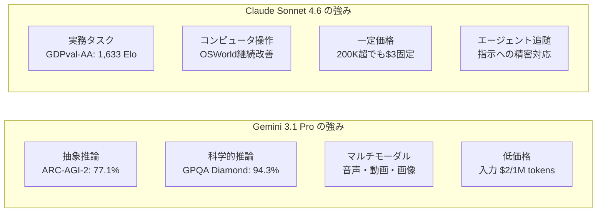

2026年2月の第3週、AI業界に2つの注目モデルがほぼ同時に登場した。Anthropicが2月17日にリリースした **Claude Sonnet 4.6** と、Google DeepMindが2月19日に公開した **Gemini 3.1 Pro** だ。どちらも「最先端のフロンティアモデル」を標榜し、100万トークンのコンテキストウィンドウ対応と汎用推論能力の大幅強化を打ち出した。

この2モデルの同時登場は偶然ではない。LLMの競争軸が「単一タスクの最高性能」から「エージェント利用・長文脈処理・コスト効率」へと移行しつつある中、双方が同一のターゲット層――エンタープライズ開発者とAIエージェント構築者――を狙い打ちにしている。本記事では両モデルの仕様、ベンチマーク数値、実用特性の差異を整理し、開発者が最適な選択をするための指針を示す。

## リリース背景：競争の文脈

### Anthropic の戦略

Claude Sonnet 4.6のリリースは、同年2月5日のClaude Opus 4.6からわずか12日後というスピード感が目を引く。Anthropicはコスト効率に優れる「Sonnet」ラインを全ユーザーのデフォルトモデルとして位置づけ、無料プランを含む全層へ展開した。価格はSonnet 4.5と同一の入力\$3/出力\$15（100万トークン当たり）を維持しながら、性能を大幅に引き上げるという戦略だ。

注目すべきはClaude Codeでの評価だ。開発者が70%の確率でSonnet 4.6を選好し、Opus 4.6と比較した場合でも59%のケースでSonnetが選ばれたという内部データが公開されている。価格対性能比で「Opusを超えるSonnet」というポジショニングは、API利用コストに敏感なプロダクション環境への訴求として有効に機能している。

同時期、AnthropicはInfosys（インドIT大手）との提携も発表した（2月17日）。ClaudeモデルをTopaz AIプラットフォームに統合し、銀行・通信・製造業などの複雑な業務ワークフロー自動化を目指す取り組みで、エンタープライズ展開の加速を示すシグナルでもある。

### Google DeepMind の戦略

Google DeepMindはGemini 3.1 Proで「史上最高スコア」を複数のベンチマークで達成したと発表した。特にARC-AGI-2（抽象推論ベンチマーク）における77.1%は、前世代Gemini 3 Proの約2倍という跳躍的な改善だ。同時期に競合したClaude Opus 4.6の68.8%、GPT-5.2の52.9%と比較しても、ARC-AGI-2においては明確なリードを示している。

また価格面でも攻勢をかけた。200Kトークン以下の通常使用では入力\$2/出力\$12（100万トークン当たり）と、Sonnet 4.6より33〜35%安価に設定している。「インテリジェンス × コスト効率」の両面で優位性を主張する姿勢が鮮明だ。

さらに1Mトークンのコンテキストウィンドウがウェイトリスト不要の本番環境で即日利用可能というのも差別化ポイントだ。Sonnet 4.6の1Mがベータ版扱いで段階的提供であるのと対照的に、大規模なコードベースや複数ファイルのリポジトリ分析をすぐ始めたい開発者にとってはGeminiのアドバンテージがある。

## 仕様比較

両モデルの基本仕様を整理する。

| 項目 | Claude Sonnet 4.6 | Gemini 3.1 Pro |
|:-----|:-----------------|:--------------|
| リリース日 | 2026年2月17日 | 2026年2月19日 |
| コンテキスト長 | 200K（ベータで1M） | 1M（デフォルト） |
| 入力価格（100万トークン） | \$3.00 | \$2.00（≤200K）/ \$4.00（超過） |
| 出力価格（100万トークン） | \$15.00 | \$12.00（≤200K）/ \$18.00（超過） |
| マルチモーダル対応 | テキスト・画像 | テキスト・画像・音声・動画 |
| 最大出力トークン | 64K | 64K |
| 提供形態 | API・Claude.ai・Claude Code | API・Gemini.google.com・Vertex AI |

価格の注意点を補足する。Gemini 3.1 Proは200Kトークン以下では安価だが、超過すると\$4/\$18に跳ね上がる。Sonnet 4.6は一律\$3/\$15で変動がないため、長文脈を多用するワークロードでは結果的にSonnetの方がコスト予測しやすいケースがある。バッチ処理のコスト見積もり段階でコンテキスト長の分布を把握しておくことが重要だ。

## ベンチマーク詳細比較

### 主要ベンチマーク数値

```
ベンチマーク比較（2026年2月時点の公開データ）

ARC-AGI-2（抽象推論）
  Gemini 3.1 Pro  : 77.1%  ← Claude Opus 4.6 (68.8%), GPT-5.2 (52.9%)
  Claude Sonnet 4.6: 58.3%
  差分: +18.8pt (Gemini優位)

GPQA Diamond（大学院レベル科学）
  Gemini 3.1 Pro  : 94.3%  ← 業界最高スコア
  Claude Sonnet 4.6: 74.1%
  差分: +20.2pt (Gemini優位)

SWE-Bench Pro（ソフトウェアエンジニアリング）
  Gemini 3.1 Pro  : 54.2%
  Claude Sonnet 4.6: 42.7%
  差分: +11.5pt (Gemini優位)

SWE-Bench Verified（Gemini公式ベンチマーク）
  Gemini 3.1 Pro  : 80.6%

Terminal-Bench 2.0（ターミナル操作）
  Gemini 3.1 Pro  : 68.5%

GDPval-AA Elo（経済的価値タスク）
  Claude Sonnet 4.6: 1,633 Elo  ← Opus 4.6さえ上回る水準
  Gemini 3.1 Pro  : 1,317 Elo
  差分: +316pt (Sonnet優位)

MMMLU（多言語理解）
  Gemini 3.1 Pro  : 92.6%

長文脈精度（128Kトークン時）
  Gemini 3.1 Pro  : 84.9%
```

数値を見ると、純粋な「推論ベンチマーク」ではGemini 3.1 Proが軒並み上回っている。一方、GDPval-AAはビジネス文書作成・財務モデリング・学術リサーチなど「経済的に価値のある実務タスク」のEloレーティングを測定するもので、ここではSonnet 4.6が1,633点と圧倒的な差をつけている。「ベンチマーク王者」と「実務王者」が異なるという構図は、両モデルの特性差を端的に示している。

### ベンチマークの読み方

**GPQA Diamond（Graduate-Level Google-Proof Q&A）** は大学院レベルの理系問題集で、物理・化学・生物の難問を解く能力を測る。94.3%という数値は業界最高スコアであり、「生物学者・化学者・物理学者と同等レベルで問題を解ける」に近い達成だ。

**ARC-AGI-2** はAI研究者が「暗記では解けない真の抽象推論を測定する」と設計したベンチマークだ。少数の例から全く新しいルールを抽象化する能力を問う。ここでの77.1%は業界全体で見ても顕著な水準で、同時期のClaude Opus 4.6が68.8%、GPT-5.2が52.9%にとどまる中での記録だ。

一方、**GDPval-AA** は「経済的価値を生む実務タスク」の総合評価で、レポート執筆・財務分析・プロジェクト計画など実際の業務に近い問題群で構成される。Sonnet 4.6の1,633 EloはOpus 4.6さえ上回る水準とされており、「使えるアウトプット」を生成する実用性においてSonnetが突出していることを示す。

## 実用的な特性差

### コーディング支援

コーディングタスクでは数値上はGeminiが有利だが、開発者の主観評価では異なる傾向が見られる。Sonnet 4.6は「ニュアンスのある指示への追随」と「段階的なコードレビュー」において高く評価されており、コードレビューのフォーマット指定やカスタムコーディング規約への適合では優位に立つ。

SWE-Bench系スコアで差がついているのは、エージェントが自律的にファイルを操作し大規模リファクタリングを行うシナリオが多いためであり、人間が細かな指示を出すペアプログラミング型用途ではSonnetの追随性能が強みになる。

```python
# Claude Sonnet 4.6 を使ったエージェントの例
import anthropic

client = anthropic.Anthropic()

# 100万トークン対応で大規模コードベースをまるごと解析
with open("large_codebase.txt", "r") as f:
    codebase_content = f.read()

message = client.messages.create(
    model="claude-sonnet-4-6-20260217",
    max_tokens=8192,
    messages=[
        {
            "role": "user",
            "content": (
                "以下のコードベースを解析し、"
                "セキュリティ脆弱性を列挙してください:\n\n"
                + codebase_content
            )
        }
    ]
)
print(message.content[0].text)
```

### 長文脈処理とマルチモーダル

Gemini 3.1 Proは128Kトークン時点の長文脈ベンチマークで84.9%の精度を記録しており、長文のPDF、音声文字起こし、動画トランスクリプトを含む複合コンテキストの処理にも対応する。音声・動画のネイティブサポートは現時点でSonnet 4.6にはない差別化要素だ。

Sonnet 4.6はコンピュータ操作（Computer Use）機能を実用レベルで提供しており、ブラウザや GUI アプリの操作を含むエージェントワークフローではAnthropicのエコシステムとの親和性が高い。OSWorldベンチマークでも継続的な改善が報告されており、自動化パイプライン構築において安定した実績がある。

### 知識業務での圧倒的な差

GDPval-AAの数値差（316 Eloポイント）は見過ごせない。財務報告書の要約・会議議事録の作成・複数文書を横断した分析レポート生成など、「知識を整理して実務成果に変換する」タスクではSonnet 4.6が明確に優位だ。これはAnthropicが「コンテキスト理解の深さとエージェントプランニング」を強化した設計方針が反映された結果と考えられる。

## アーキテクチャ設計思想の違い

公開されている情報から両モデルの設計思想の違いを読み解くと、いくつかの対比が浮かび上がる。

Gemini 3.1 Proは「スケーラブルな汎用推論エンジン」としての性格が強い。音声・動画・コードリポジトリを含むあらゆる入力モダリティを統一的に処理し、ARC-AGI-2型の純粋推論タスクで最高性能を目指すアーキテクチャ方向性が感じられる。Google DeepMindのモデルカードには「frontier safety」フレームワークに基づく安全評価が詳細に記述されており、グローバルスケールでのデプロイを前提とした設計姿勢が見える。

Claude Sonnet 4.6は「信頼できる実行エージェント」としての完成度を優先している。コンピュータ操作・長文脈推論・エージェントプランニングという組み合わせは、人間が介在する半自律ワークフローへの適合を意識した機能選択だ。Infosysとのエンタープライズパートナーシップで銀行・通信・製造業の複雑業務ワークフロー自動化への実績蓄積がAnthropicの事業戦略と連動している。



## 競争が示す2026年のLLMトレンド

Claude Sonnet 4.6とGemini 3.1 Proの同時登場は、LLM競争の現在地を示す良い観測点だ。

**長文脈処理の「前提化」**: 両モデルとも100万トークンコンテキストをデフォルトまたはベータで提供しており、これはもはや差別化要素ではなく前提条件になりつつある。1Mトークンがあれば、プロジェクト全体のコードベース＋関連ドキュメント＋過去バグレポートを一度に入力できる。

**エージェント向け最適化の加速**: エージェント向けツール使用、コンピュータ操作、複数ステップの推論――これらは双方が注力する共通領域だ。MCPの普及に合わせ、どちらのモデルがエージェントランタイムとして標準になるかも競争軸になっている。

**ベンチマーク競争の高度化**: 単一問題の正解率から、ARC-AGI-2のような「暗記不可能な推論」や、GDPval-AAのような「経済的価値」を測る指標への移行が起きている。「正確な回答」から「使える成果物」へのシフトだ。

**価格競争の継続**: Geminiの\$2/1Mという入力価格は、2023年のGPT-4クラス価格の10分の1以下だ。競争がモデルの民主化を加速させている一方、収益化への圧力も増している。

## 開発者向け使い分け指針

どちらを選ぶかは「タスクの性質」「コンテキスト長の分布」「既存スタックとの統合」の3点で決まる。

| ユースケース | 推奨モデル | 理由 |
|:-----------|:---------|:----|
| 科学的推論・数学的証明 | Gemini 3.1 Pro | GPQA Diamond 94.3%・ARC-AGI-2 77.1% |
| レポート執筆・財務分析 | Claude Sonnet 4.6 | GDPval-AA 1,633 Eloで実務タスク最強 |
| 大規模コードベース解析（即日1M） | Gemini 3.1 Pro | 1Mがウェイトリスト不要で本番利用可 |
| コンピュータ操作エージェント | Claude Sonnet 4.6 | Computer Use・OSWorld継続改善 |
| 音声・動画を含むマルチモーダル | Gemini 3.1 Pro | ネイティブ対応（Sonnetは非対応） |
| Google Workspace統合 | Gemini 3.1 Pro | ネイティブ統合 |
| 200K超の長文プロンプト多用 | Claude Sonnet 4.6 | 超過時のコスト変動なし（一律\$3） |
| 200K以下の中尺プロンプト中心 | Gemini 3.1 Pro | 入力\$2で33%安価 |

どちらが「勝ち」とは言い切れない。それが現在のLLM競争の正直な答えだ。特定タスクの要件、コスト構造、既存スタックとの統合難易度を考慮した上で、具体的なユースケースごとに評価する姿勢が開発者には求められる。

## 参考文献

| タイトル | 情報源 | 日付 | URL |
|:---------|:-------|:-----|:----|
| Claude Sonnet 4.6 リリース発表 | Anthropic | 2026/02/17 | https://www.anthropic.com/news/claude-sonnet-4-6 |
| Gemini 3.1 Pro リリース発表 | Google Blog | 2026/02/19 | https://blog.google/innovation-and-ai/models-and-research/gemini-models/gemini-3-1-pro/ |
| Gemini 3.1 Pro Model Card | Google DeepMind | 2026/02/19 | https://deepmind.google/models/model-cards/gemini-3-1-pro/ |
| Deep Comparison of Gemini 3.1 Pro and Claude Sonnet 4.6 | Apiyi.com Blog | 2026/03 | https://help.apiyi.com/en/gemini-3-1-pro-vs-claude-sonnet-4-6-comparison-en.html |
| Gemini 3.1 Pro vs Sonnet 4.6 vs Opus 4.6 vs GPT-5.2 (2026) | AceCloud AI | 2026/03 | https://acecloud.ai/blog/gemini-3-1-pro-vs-sonnet-4-6-vs-opus-4-6-vs-gpt-5-2/ |
| Gemini 3.1 Pro Complete Guide 2026: Benchmarks, Pricing, API | NxCode | 2026/02 | https://www.nxcode.io/en/resources/news/gemini-3-1-pro-complete-guide-benchmarks-pricing-api-2026 |
| Gemini 3.1 Pro Leads Most Benchmarks But Trails Claude Opus 4.6 in Some Tasks | Trending Topics EU | 2026/02 | https://www.trendingtopics.eu/gemini-3-1-pro-leads-most-benchmarks-but-trails-claude-opus-4-6-in-some-tasks/ |
| Gemini 3.1 Pro vs Claude Sonnet 4.6: 2026 Comparison, Benchmarks | AI.cc | 2026/02 | https://www.ai.cc/blogs/gemini-3-1-pro-vs-claude-sonnet-4-6-2026-comparison-benchmarks/ |
| Infosys × Anthropic エンタープライズAIエージェント提携 | TechCrunch | 2026/02/17 | https://techcrunch.com/2026/02/17/as-ai-jitters-rattle-it-stocks-infosys-partners-with-anthropic-to-build-enterprise-grade-ai-agents/ |
| AI週次ダイジェスト 2026年2月第3週 | Synapse AI Digest | 2026/02/21 | https://armes.ai/blog/frontier-model-explosion-february-2026 |
