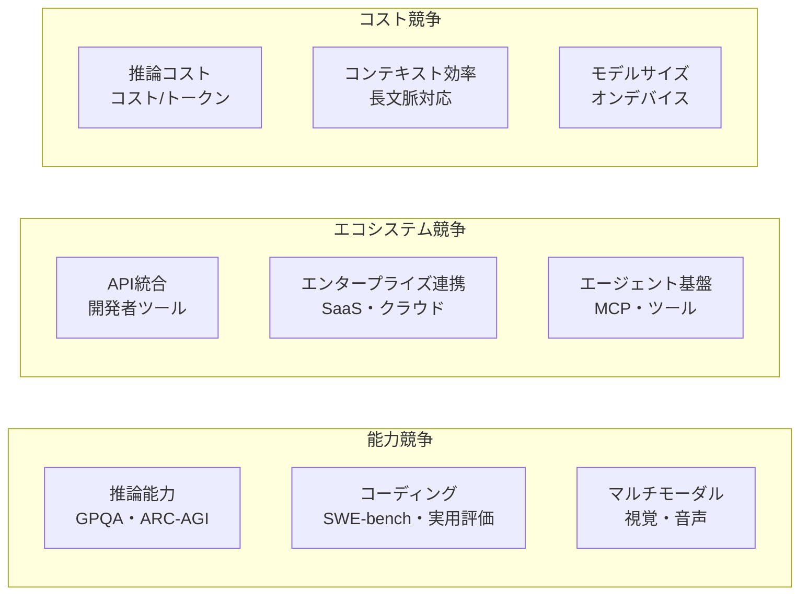

2026年2月17日にAnthropicが**Claude Sonnet 4.6**を、同月19日にGoogleが**Gemini 3.1 Pro**をリリースした。わずか2日の差で登場した2つのモデルは、それぞれ異なるベンチマークで「業界最高」を主張し、それぞれ異なる強みを持つ。

両モデルを単純に「どちらが優れているか」で比較することに大きな意味はない。重要なのは「それぞれが何を得意とし、開発者はどう使い分けるべきか」を理解することだ。本稿では、最新のベンチマーク結果と実用的な特性比較を通じて、現在のLLMモデル競争の構図を解説する。

## 2026年2月のリリース状況

### Claude Sonnet 4.6

AnthropicはClaude Opus 4.6（2月5日）に続き、Sonnet 4.6（2月17日）を投入した。Sonnet 4.6は以下を特徴とする。

- **100万トークンコンテキストウィンドウ**（ベータ版、後に標準提供）
- コーディング・コンピュータ使用・長文脈推論・エージェントプランニングの大幅強化
- 64Kトークン最大出力
- API価格：入力\$3/1Mトークン、出力\$15/1Mトークン
- 無料ユーザーを含む全ユーザーのデフォルトモデルとして提供

Anthropicは「早期アクセスした開発者の多くがSonnet 4.5より大幅に優れており、以前ならOpusクラスを必要とした性能に達している」とコメントしている。

### Gemini 3.1 Pro

GoogleのGemini 3.1 Proは2月19日にリリースされ、以下を特徴とする。

- **ARC-AGI-2で77.1%**（前バージョン比2倍以上の向上）
- **GPQA Diamondで94.3%**（業界最高スコアを達成）
- 100万トークンコンテキストウィンドウ対応
- エージェント向けツール使用、競技プログラミング、科学的推論での高性能

GoogleはGemini 3.1 Proが「16項目中13項目でライバルモデルに勝利した」と主張し、特に抽象推論と科学的推論での強みを強調した。

## ベンチマーク比較

### 主要ベンチマークの結果

| ベンチマーク | Claude Sonnet 4.6 | Gemini 3.1 Pro | 優位 |
|------------|-------------------|----------------|------|
| GPQA Diamond（大学院レベル科学） | 89.9% | 94.3% | Gemini +4.4pt |
| ARC-AGI-2（抽象パターン認識） | 58.3% | 77.1% | Gemini +18.8pt |
| コーディング（Replit評価） | 0%エラー率 | - | Claude |
| エージェント計画 | 高評価 | 高評価 | 拮抗 |
| 長文脈推論 | 高評価 | 高評価 | 拮抗 |

GDPval-AA（開発者の実用的評価指標）ではClaude Sonnet 4.6が1,633 Eloを記録し、コーディングタスクで特に高い評価を得ている。

### ベンチマークの読み方

ベンチマークスコアの解釈には注意が必要だ。

**GPQA Diamond（Graduate-Level Google-Proof Q&A）**は大学院レベルの科学問題集で、物理・化学・生物の難問を解く能力を測る。94.3%という数値は「生物学者・化学者・物理学者と同等レベルで問題を解ける」に近い達成だ。科学的推論を必要とするユースケースでGeminiが優位を持つことを示唆する。

**ARC-AGI-2**は「汎用人工知能の達成度」を測る設計のベンチマークで、単純なパターン認識ではなく、全く新しいルールを少数の例から抽象化する能力を測る。Geminiの77.1%は業界において突出したスコアで、抽象推論での強みを示している。

一方、Googleが公開した「16項目中13項目で勝利」というベンチマーク比較については批判的な分析も存在する。SmartScopeの分析によれば、Googleが選択したベンチマーク項目にはGeminiに有利なものが偏っており、実際の幅広い用途での差は小さい可能性がある。

## 実用的な特性の違い

### コーディングとエージェントタスク

Claude Sonnet 4.6はコーディング分野でのエコシステム構築が進んでいる。Repl.itの評価ではエラー率0%を記録しており、CursorやGitHub Copilotなど主要な開発者ツールとの統合も深い。

Anthropicが「長文脈推論・エージェントプランニング・コーディング・コンピュータ使用」を強化した点を強調していることから、Sonnet 4.6はAIエージェントの基盤として実装されることを強く意識した設計と見られる。

```python
# Claude Sonnet 4.6 を使ったエージェントの例
import anthropic

client = anthropic.Anthropic()

# 大規模コードベースの解析（100万トークン対応）
with open("large_codebase.txt", "r") as f:
    codebase_content = f.read()

message = client.messages.create(
    model="claude-sonnet-4-6-20260217",
    max_tokens=8192,
    messages=[
        {
            "role": "user",
            "content": f"以下のコードベースを解析し、セキュリティ脆弱性を列挙してください:\n\n{codebase_content}"
        }
    ]
)
print(message.content[0].text)
```

### 科学・研究タスク

Gemini 3.1 ProはGPQA Diamondでの高スコアに見られるように、専門的な科学的推論において強みを持つ。医療診断支援、材料科学研究、数学的証明の生成など、高度な専門知識を要するタスクで優位性が期待できる。

またGoogleはGemini 3.1 ProがMultimodal Agentic Search（マルチモーダルエージェント検索）での高性能を示すとしており、画像と テキストを組み合わせた複合的な推論タスクでも競争力を持つ。

### コンテキストウィンドウの実用的な意味

両モデルとも100万トークンのコンテキストウィンドウを提供する。これは実用的にどの程度の量か？

```
1トークン ≈ 0.75 英単語 ≈ 0.5 日本語文字

100万トークン ≈ 750,000 英単語 ≈ 500,000 日本語文字

参考：
- 一般的な長編小説    ≈ 100,000〜200,000 語
- 中規模コードベース  ≈ 100,000〜500,000 行（言語・密度による）
- 3時間の会議録      ≈ 30,000〜50,000 語
```

100万トークンがあれば、「プロジェクト全体のコードベース＋関連ドキュメント＋過去のバグレポート」を一度に入力できる。コードレビューや技術文書の生成において、「分割して複数回送信する」必要がなくなる点は実用上大きな価値を持つ。

ただし、コンテキスト長が長くなると推論精度が下がるケースがあることも知られており、単純に「長いほど良い」ではない。両社ともこの課題への対応を研究中だ。

## モデル競争の構図：何を争っているのか

### 3つの競争軸

現在のLLMトップ企業間の競争は、3つの軸で理解できる。



**能力競争**では、ベンチマークスコアの改善が続いている。ただし主要ベンチマークが飽和に近づく中、新しい難しいベンチマークの開発自体が競争の場になっている。ARC-AGI-2はその代表例だ。

**エコシステム競争**では、Claude（Cursor・Claude.ai）とGemini（Google Workspace・Vertex AI）が異なる方向で開発者・企業との統合を深めている。AIエージェントの標準プロトコルとしてMCPが普及する中、どちらのモデルがMCPエコシステムの中心になるかも競争軸になっている。

**コスト競争**では、「同等の性能をより安く提供できるか」が問われる。Anthropicが100万トークンを「長文脈プレミアムなし」で提供すると発表したことはコスト面でのシグナルだ。

### APIエコノミクスの変化

2025年以降のモデル競争で顕著なのは、トップモデルの価格が急速に低下していることだ。Claude Sonnet 4.6の入力価格\$3/1Mトークンは、GPT-4が登場した2023年時点の最上位モデル価格の約10分の1以下だ。

価格低下はモデルの「民主化」を意味するが、同時に収益化モデルへの圧力でもある。AnthropicもGoogleも、APIレベルでの競争だけでなく、Claude.aiやGemini Advancedといった直接消費者向けサービスで継続的な収益を確保しようとしている。

## エンタープライズ採用の動向

### Claude: エンタープライズとの連携

Infosys（インド最大級のIT企業）がAnthropicと提携し、ClaudeをTopaz AIプラットフォームに統合してエンタープライズAIエージェント開発を進めることを発表した（2026年2月）。銀行・通信・製造業の業務ワークフロー自動化が対象で、Claude Codeの内部活用も開始されている。

MicrosoftはAzure AI FoundryでClaude Sonnet 4.6を提供しており、Microsoft 365 CopilotとのClaudeの統合も進んでいる。

### Gemini: Google Workspaceの深化

GoogleはGemini 3.1 ProをGoogle Workspaceの全製品（Gmail・Docs・Sheets）に統合しており、企業ユーザーへのリーチではGoogleが最大の強みを持つ。Vertex AIでのGemini 3.1 Pro提供により、既存のGCPユーザーはシームレスに最新モデルを利用できる。

アフリカ・アジア新興市場への展開でも両社は積極的で、Anthropicはルワンダ政府とのMOU締結、インドでのバンガロールオフィス開設を発表した。

## 開発者はどう選ぶべきか

### ユースケース別の選択指針

| ユースケース | 推奨モデル | 理由 |
|------------|-----------|------|
| 大規模コードベース解析・生成 | Claude Sonnet 4.6 | コーディング特化の評価・エコシステム |
| 科学論文の解析・要約 | Gemini 3.1 Pro | GPQA Diamond高スコア |
| マルチステップエージェント | Claude Sonnet 4.6 | エージェントプランニング・MCP対応 |
| 抽象的推論・パズル | Gemini 3.1 Pro | ARC-AGI-2高スコア |
| Google Workspace統合 | Gemini 3.1 Pro | ネイティブ統合 |
| Microsoft 365統合 | Claude Sonnet 4.6 | Azure経由の統合が成熟 |
| コスト最適化 | 両者で比較 | タスクと量による |

### 実際のプロジェクトでの判断

「どちらのモデルが優れているか」ではなく「どちらのモデルが自分のユースケースに適しているか」が重要だ。現実的なアプローチは次のようになる。

1. **タスクを定義する**: コーディングか、推論か、文書生成か、マルチモーダルか
2. **サンプルで比較する**: 実際のタスクに近いプロンプトで両モデルを比較評価する
3. **コストを計算する**: 期待するトークン量で月間コストを試算する
4. **エコシステムを確認する**: 利用している開発ツール・クラウドとの統合状況を確認する
5. **定期的に再評価する**: モデルは数ヶ月ごとにアップデートされるため、判断は固定しない

## まとめ：競争がもたらす恩恵

Claude Sonnet 4.6とGemini 3.1 Proの競争は、開発者と企業にとって直接的な恩恵をもたらしている。

**性能の向上**: わずか1年前には不可能だったタスクが、今日の最新モデルでは実現できる。100万トークンのコンテキスト、ARC-AGI-2の77%達成、コーディングでのエラー率0%——これらは現実の開発体験を変える改善だ。

**価格の低下**: 競争により、最高性能のモデルのAPI価格は継続的に下がっている。2026年のSonnetクラスは、2023年のGPT-4クラスよりもはるかに安価だ。

**エコシステムの拡充**: 両社が積極的にツール・フレームワーク・APIを整備することで、開発者が選択できる統合の選択肢が増えている。

ただし、競争には副作用もある。「業界最高」を主張するベンチマーク選びの恣意性が増し、真の性能差を評価することが難しくなっている。開発者は各社の主張を批判的に検証する能力が求められる。

2026年のLLM競争の最前線は、単なるスコアの数字争いを超えて、「どのエコシステムにAIエージェント開発を賭けるか」という長期的な意思決定の次元に移行しつつある。その中でAnthropicのMCPとClaudeエコシステム、GoogleのWorkspaceとVertex AIエコシステム、それぞれの賭け金は年々大きくなっている。
