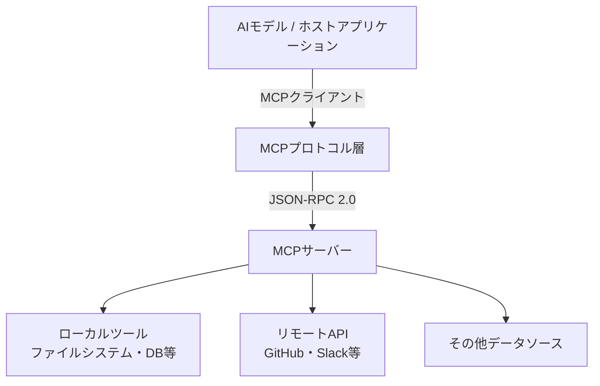

2024年11月にAnthropicが発表した**Model Context Protocol（MCP）**は、わずか1年余りでAIエージェントと外部ツールを繋ぐ業界標準プロトコルとして広く採用されるに至った。2026年1月時点で公開されているMCPサーバーは1万件を超え、月間SDKダウンロード数は9,700万を記録している。OpenAI、Google、Microsoft、そして多数のスタートアップが採用を表明した今、MCPは「AIのUSB-C」という比喩を現実のものとしつつある。

本稿では、MCPの技術的な仕組みから標準化プロセス、そして業界への影響までを体系的に解説する。

## MCPとは何か — 解決する問題

### AIエージェントが直面する「ツール連携問題」

現代のAIエージェントは、単にテキストを生成するだけでなく、外部ツールやデータソースと連携しながらタスクを遂行することが求められる。コードを書くエージェントはGitHubリポジトリにアクセスし、ビジネス分析エージェントはデータベースやSaaSを参照し、カスタマーサポートエージェントはCRMシステムに問い合わせる。

MCPが登場する以前、こうした連携はモデルごと、ツールごとにカスタムの統合コードを書く必要があった。100種類のツールと10種類のモデルがあれば、最大1,000通りの統合実装が必要になる——これがMCPが解決しようとした「M×N問題」だ。

```
【MCP以前の世界】
モデルA ──→ ツール1 (独自実装)
モデルA ──→ ツール2 (独自実装)
モデルB ──→ ツール1 (別の独自実装)
モデルB ──→ ツール2 (別の独自実装)
... M × N 通りの実装が必要

【MCPの世界】
モデルA ─┐
モデルB ─┤── MCP ──┬─ ツール1
モデルC ─┘         └─ ツール2
統一インターフェースで M + N の実装で済む
```

### MCPのアーキテクチャ

MCPはクライアント・サーバーモデルを採用している。



主要な構成要素は3つだ。

**MCP Host（ホスト）**: AIモデルを実行するアプリケーション。Claude Desktop、Cursor、VS Code などが該当する。ホストはMCPクライアントを内包し、サーバーとの通信を管理する。

**MCP Server（サーバー）**: 特定のツールやデータソースへのアクセスを提供するプロセス。GitHub用サーバー、PostgreSQL用サーバー、Slack用サーバーなど、用途別に独立して動作する。

**Transport Layer（トランスポート）**: クライアントとサーバー間の通信方式。ローカル通信にはStdio（標準入出力）、リモート通信にはServer-Sent Events（SSE）またはStreamable HTTPを使用する。

プロトコルのメッセージ形式はJSON-RPC 2.0を採用しており、プログラミング言語に依存しない。TypeScript・Python・Javaなど主要言語向けのSDKが公式に提供されている。

## MCPが提供する機能プリミティブ

MCPが定義するインターフェースは大きく3種類に分類される。

### Tools（ツール）

モデルが実行できる「関数」。検索、ファイル読み書き、API呼び出しなどのアクションを定義する。MCPサーバーはどのツールを提供するかをスキーマで宣言し、ホストはそれをモデルに伝える。

```json
{
  "name": "search_repository",
  "description": "GitHubリポジトリをキーワード検索する",
  "inputSchema": {
    "type": "object",
    "properties": {
      "query": { "type": "string", "description": "検索キーワード" },
      "repo": { "type": "string", "description": "リポジトリ名 (owner/repo)" }
    },
    "required": ["query", "repo"]
  }
}
```

### Resources（リソース）

モデルが読み取れるデータ。ファイル、データベースレコード、APIレスポンスなどを統一的なURIで参照できる。ツールが「実行」であるのに対し、リソースは「参照」という役割を担う。

### Prompts（プロンプト）

再利用可能なプロンプトテンプレート。よく使う指示パターンをサーバー側で定義し、クライアントが呼び出せる仕組みだ。

## Linux Foundation寄贈と業界の標準化

### Agentic AI Foundation（AAIF）の設立

2025年12月、AnthropicはMCPをLinux Foundation傘下の新組織「**Agentic AI Foundation（AAIF）**」に寄贈した。AAIF共同創設メンバーにはAnthropicのほか、**OpenAI**、**Block**が名を連ねる。さらにGitHub、Microsoft、Google DeepMindも支持を表明している。

特定企業の管理下に置かれていたプロトコルが、ベンダーニュートラルな組織の管理下に移ったことは、標準化プロセスにおける大きな転換点だ。Linux FoundationはNode.js、Kubernetes、OpenChain Projectなど多くの重要な標準・プロジェクトを管理しており、そのガバナンスモデルは業界から高い信頼を得ている。

### OpenAIの採用表明とエコシステムの加速

2025年3月にOpenAIが公式採用を発表したことで、MCPは「Anthropicのプロプライエタリ規格」から「業界共通規格」へと立場を変えた。ChatGPTデスクトップアプリへの統合に続き、OpenAI Agents SDKでもMCPサポートが提供されている。

GoogleはMCP対応サーバーの構築を進め、MicrosoftはSemantic KernelおよびAzure OpenAIサービスでのMCP統合を実装した。主要AIプラットフォームがすべてMCPに対応したことで、エコシステムの拡大は自己強化的なループに入った——MCPサーバーを作れば、すべての主要モデルから利用できるという事実が、開発者のMCPサーバー実装を促進している。

## MCP採用の実態

### サーバーエコシステムの急拡大

MCPサーバーの数は指数的に増加している。2026年初頭時点で公式に把握されている主な領域は次の通りだ。

- **開発ツール**: GitHub、GitLab、Jira、Linear
- **データベース**: PostgreSQL、MySQL、SQLite、MongoDB
- **コミュニケーション**: Slack、Microsoft Teams、Email
- **クラウド**: AWS、GCP、Azure
- **ドキュメント**: Notion、Confluence、Google Drive
- **ブラウザ**: Playwright、Puppeteer（Webスクレイピング）

### エンタープライズ採用の課題

一方で、エンタープライズ採用においては複数の課題が指摘されている。

**認証・認可**: MCPの初期仕様は認証メカニズムが限定的で、企業環境で必要なOAuth 2.0フローの実装がサーバーごとにばらついていた。2025年11月公開の最新仕様ではOAuth 2.1サポートが強化されたが、既存サーバーへの対応は進行中だ。

**セキュリティ**: AIモデルが外部ツールを自律的に実行する際のサンドボックス化、権限制御、監査ログの実装は、各ホストアプリケーションの責任に委ねられている。Solo.ioなどのインフラベンダーが「Secure MCP Gateway」的な製品を提供し始めているが、標準化はまだ発展途上だ。

**バージョン互換性**: MCP仕様は活発に更新されており、クライアントとサーバーのバージョン不一致によるトラブルが発生しやすい。AAIFによるガバナンス整備で長期的な安定性が期待される。

## AIエージェント時代における標準化の意義

### なぜプロトコル標準化が重要か

ソフトウェア産業の歴史を振り返ると、標準プロトコルの確立が市場を爆発的に拡大させた事例は多い。HTTPがWebブラウザと任意のWebサーバーの接続を可能にし、SMTPが電子メールの相互運用性を実現したように、MCPはAIエージェントとツールの世界に同様の変革をもたらす可能性を持つ。

標準化が実現する価値は3層に分けて考えられる。

1. **開発コストの削減**: ツールを一度MCPサーバーとして実装すれば、すべてのMCP対応モデルから利用可能になる
2. **エコシステムの拡大**: オープンな仕様により、コミュニティによるサーバー開発が活発化する
3. **競争の健全化**: ツール層での差別化ではなく、モデルの推論能力・特化性での競争が促進される

### AIエージェント連携の未来像

MCPが目指す最終的なビジョンは、AIエージェント同士が協調して作業する「マルチエージェント環境」の基盤となることだ。MCPのロードマップには、サーバーからクライアントへの通知機能（Sampling）の強化や、エージェント間通信のための仕様拡張が含まれている。

現時点では「ツールへのアクセス」が主要ユースケースだが、将来的にはAIエージェントがMCPを通じて他のAIエージェントのサービスを呼び出し、複雑なタスクを協調分散処理するシナリオが現実になるだろう。

## 実装してみる：最小構成のMCPサーバー

MCPサーバーの実装は、公式SDKを使えば驚くほど簡潔だ。以下はTypeScriptで「現在時刻を返すツール」を持つMCPサーバーの最小実装例だ。

```typescript
import { Server } from "@modelcontextprotocol/sdk/server/index.js";
import { StdioServerTransport } from "@modelcontextprotocol/sdk/server/stdio.js";
import {
  CallToolRequestSchema,
  ListToolsRequestSchema,
} from "@modelcontextprotocol/sdk/types.js";

const server = new Server(
  { name: "example-server", version: "1.0.0" },
  { capabilities: { tools: {} } }
);

// ツール一覧を返す
server.setRequestHandler(ListToolsRequestSchema, async () => ({
  tools: [
    {
      name: "get_current_time",
      description: "現在のUTC時刻を返す",
      inputSchema: { type: "object", properties: {}, required: [] },
    },
  ],
}));

// ツールを実行する
server.setRequestHandler(CallToolRequestSchema, async (request) => {
  if (request.params.name === "get_current_time") {
    return {
      content: [
        { type: "text", text: new Date().toISOString() },
      ],
    };
  }
  throw new Error(`Unknown tool: ${request.params.name}`);
});

// Stdioトランスポートで起動
const transport = new StdioServerTransport();
await server.connect(transport);
```

このサーバーをClaude DesktopやCursorの設定ファイルに登録するだけで、AIモデルが `get_current_time` ツールを呼び出せるようになる。実際の開発では、この骨格に業務ロジックを組み込んでいく。

## まとめ

MCPはAIエージェントとツールの連携における「共通語」として、急速に業界標準の地位を確立しつつある。AnthropicによるLinux Foundation寄贈とAAIFの設立は、特定企業の仕様からオープンな業界標準への移行を象徴するマイルストーンだ。

OpenAI・Microsoft・Googleといった競合他社を含む主要プレイヤーが採用に踏み切ったことは、MCPが「勝者なき競争」を経て自然に選ばれた標準であることを示している。1万件を超えるサーバーと月間9,700万ダウンロードというエコシステムの規模は、後発の対抗規格が追い越すことを困難にしている。

今後の課題はセキュリティ・ガバナンス・バージョン互換性の整備にあるが、AAIFによるオープンな議論プロセスがこれらを解決していくと期待される。MCPを理解し実装できるエンジニアの価値は、AIエージェント時代においてますます高まるだろう。
