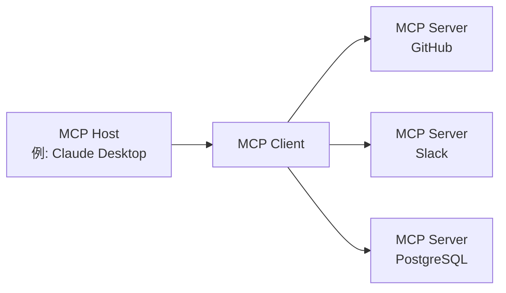

## はじめに

2024年11月、Anthropicが発表した**Model Context Protocol（MCP）**は、AIエージェントと外部ツール・データソースを接続するための新しいオープン標準として、1年余りで劇的な普及を果たした。月間SDKダウンロード数9,700万件超、公開MCPサーバー1万件超という数字は、単なる技術仕様の枠を超え、AIエージェント時代の基盤インフラとしての地位を確立しつつあることを示している。

本記事では、MCPの技術的な仕組みから、OpenAI・Google・Microsoftによる採用の経緯、Linux Foundation傘下への寄贈という重要な転換点、そして現在も議論が続くセキュリティ課題まで、包括的に解説する。

---

## MCPが解決する「N×M問題」

### AIシステムの情報孤立問題

MCPが登場する以前、AIアプリケーションと外部データソースの連携は深刻な非効率をはらんでいた。たとえばClaudeをSlack、GitHub、Google Drive、Postgresデータベース、それぞれと連携させようとすると、各データソースに対して独自のコネクターを実装する必要があった。

この状況をAnthropicは「**N×M問題**」と呼んだ。Nがデータソースの数、Mがこれを利用するAIアプリケーションの数だとすると、理論上N×M個の個別実装が必要になる。10種類のツールを5つのAIアプリで使うだけで50本のカスタム実装が必要になる計算だ。

```
【MCPなし】
Claude  ─── 独自実装A ──→ GitHub
Claude  ─── 独自実装B ──→ Slack
GPT-4   ─── 独自実装C ──→ GitHub  （Aとほぼ同じ）
GPT-4   ─── 独自実装D ──→ Slack   （Bとほぼ同じ）

【MCPあり】
Claude ─┐
GPT-4  ─┤── MCP Client ──→ MCP Server（GitHub）
Gemini ─┘                ──→ MCP Server（Slack）
```

MCPはこの問題を「1:N」構造で解決する。一度MCPサーバーとして実装されれば、MCPに対応するすべてのAIクライアントから利用できる。

---

## MCPの技術アーキテクチャ

### 3層の構成要素

MCPはクライアント-サーバーアーキテクチャを採用しており、3つの役割で構成される。

| 役割 | 説明 |
|:-----|:-----|
| **MCP Host** | AIアプリケーション本体。1つまたは複数のMCP Clientを管理・調整する |
| **MCP Client** | MCP Serverとの接続を維持し、コンテキストを取得してHostに提供する |
| **MCP Server** | 外部ツールやデータソースへのアクセスを提供するプログラム |



### プロトコル基盤：JSON-RPC 2.0

MCPのメッセージング層はJSON-RPC 2.0に基づいている。メッセージタイプは3種類に分類される。

- **Request**: レスポンスを必要とするリクエスト
- **Response**: リクエストに対する返答
- **Notification**: レスポンス不要の一方向通知

### トランスポート層

MCPは2つの主要なトランスポート方式をサポートする。

**stdio（標準入出力）**
ローカルリソースとの連携に最適。シンプルな入出力ストリームを通じて通信する。Claude DesktopのようなローカルAIアプリケーションとローカルMCPサーバーの接続に広く使われている。

**Streamable HTTP（旧称：SSE）**
HTTP上でServer-Sent Events（SSE）を用いてサーバーからクライアントへのストリーミングメッセージ送信を実現する。長時間実行タスクやインクリメンタルな更新に適している。2025年の仕様更新（2025-11-25版）でトランスポート名が「SSE」から「Streamable HTTP」に変更され、より柔軟な双方向通信が可能となった。

### 3つのプリミティブ

MCPサーバーが外部に公開する機能は3種類のプリミティブで定義される。

**Resources（リソース）**
データソースへの読み取りアクセスを提供する。ファイルシステム、データベース、APIレスポンスなどをAIが参照できる形で提供する。

**Tools（ツール）**
任意のコードの実行を可能にする。AIがファイルを作成したり、APIを呼び出したり、外部システムに変更を加える際に使用される。ツールの実行は副作用を伴うため、適切な権限管理が求められる。

**Prompts（プロンプト）**
事前定義されたプロンプトテンプレートを提供する。「GitHubにバグレポートのissueを作成して」という曖昧な指示ではなく、必要なフィールドを構造化した形でAIに伝えることができる。

---

## 爆発的な普及：公開から1年

### 数字で見るエコシステムの成長

MCPが公開された2024年11月時点では、公開MCPサーバーは約100件に過ぎなかった。しかし成長速度は驚異的だった。

| 時期 | 公開サーバー数 | 月間SDKダウンロード数 |
|:-----|:---------------|:----------------------|
| 2024年11月（公開時） | 約100件 | — |
| 2025年5月 | 4,000件超 | — |
| 2025年12月 | 10,000件超 | 9,700万件 |

AnthropicはMCP公開と同時に、GitHub、Slack、Google Drive、Git、PostgreSQL、Puppeteerなど主要な企業システム向けのリファレンスMCPサーバーを提供した。これが開発者の参入障壁を大きく下げ、エコシステムの急速な拡大につながった。

### 主要AI企業の採用

MCPは短期間で業界標準の地位を確立した。

**OpenAI（2025年3月）**
OpenAIはChatGPTおよびAPIでMCPの正式サポートを発表した。同社は長らく独自のFunction Calling機能を持っていたが、MCPというオープン標準を採用することで、広大なMCPエコシステムを取り込んだ。

**Google（2025年4月）**
GeminiモデルにMCPが統合された。Google AI StudioおよびVertex AI経由でMCPサーバーへのアクセスが可能になり、Googleの企業顧客はGeminiを介して既存の社内システムと接続できるようになった。

**Microsoft（2025年）**
Copilot StudioおよびAzure OpenAI ServiceでMCPサポートを追加。Visual Studio CodeにもMCPクライアント機能が組み込まれ、開発ワークフローとAIの統合が加速した。

---

## Linux Foundationへの寄贈とAgentic AI Foundation設立

### 重要な転換点

2025年12月、Anthropicはその最も重要な決断のひとつを発表した。MCPをLinux Foundation傘下の新設ファンド「**Agentic AI Foundation（AAIF）**」に寄贈したのだ。

この決断は単なるガバナンスの変更ではなかった。AnthropicはMCPを「自社製品の差別化要素」としてではなく、AIエージェント時代のオープンインフラとして位置づけることを選択したのである。

### Agentic AI Foundation（AAIF）の概要

AAIFはLinux Foundation傘下のDirected Fundとして設立された。

**共同創設メンバー**
- Anthropic（MCP寄贈）
- Block（goose寄贈）
- OpenAI（AGENTS.md寄贈）

**プラチナメンバー（ガバナンス参加）**
Amazon Web Services、Anthropic、Block、Bloomberg、Cloudflare、Google、Microsoft、OpenAI

**創設プロジェクト**
- Model Context Protocol（MCP）— Anthropic提供
- goose — Block提供のAIエージェントフレームワーク
- AGENTS.md — OpenAI提供のエージェント仕様記述標準

Linux Foundationの傘下に入ることで、MCPのガバナンスはベンダー中立・コミュニティ主導の形態となった。これはKubernetes（コンテナオーケストレーション）やNodeJSなどがLinux Foundation傘下で業界標準として定着したパターンと同様の戦略である。

---

## MCPとREST APIの比較

### 設計思想の違い

MCPとREST APIは競合関係ではなく、相補的な関係にある。それぞれの設計思想の違いを理解することが重要だ。

| 観点 | REST API | MCP |
|:-----|:---------|:----|
| 想定クライアント | 従来のソフトウェア | LLM・AIエージェント |
| セッション | ステートレス | ステートフル |
| ディスカバリー | OpenAPI等で別途記述 | サーバーが動的に公開 |
| マルチステップ | 各リクエストで認証 | セッション維持で効率化 |
| ストリーミング | WebSocket等が別途必要 | SSE/Streamable HTTPでネイティブ対応 |

### AIエージェントにMCPが適する理由

AIエージェントが複数のツールを連続して呼び出すシナリオを考えると、MCP設計の優位性が明確になる。

```
【AIエージェントによるコードレビュータスク】
1. GitHubからPRの差分を取得 → MCP Tools
2. 関連するコードファイルを読み込む → MCP Resources
3. セキュリティチェックのプロンプトを取得 → MCP Prompts
4. コードレビューコメントをGitHubに投稿 → MCP Tools
```

REST APIを使う場合、各ステップで認証ヘッダーの付与、コンテキストの再送信が必要になる。MCPではセッションが維持されるため、認証コストを最小化しながら多段階のタスクを効率よく実行できる。

また、AIエージェントはどのツールが利用可能かを事前に知らない場合がある。MCPサーバーは自身が提供するTools・Resources・Promptsを動的に公開するため、エージェントは実行時にディスカバリーを行い、適切なツールを選択・使用できる。

---

## セキュリティ課題

### MCPのセキュリティリスク

月間9,700万ダウンロードという普及速度に対し、セキュリティ研究者からはMCPの早急な普及への懸念も示されている。主要なセキュリティリスクは以下の通りだ。

**トークン漏洩リスク**
MCPはOAuth 2.1を認可フレームワークとして採用しているが、クライアントやサーバー側でキャッシュ・ログに記録されたアクセストークンが漏洩した場合、攻撃者は正当なリクエストとして保護リソースにアクセスできる。

**Confused Deputy攻撃**
MCPサーバーがOAuthプロキシとして動作する際、認可コンテキストの検証が不適切だと、攻撃者が別ユーザーの認証情報を悪用した操作をサーバーに実行させる可能性がある。

**動的クライアント登録の管理**
OAuthの動的クライアント登録を使うと、MCPクライアントはサーバー側にOAuthクライアント設定を動的に追加できる。しかし追加されたクライアント設定の管理・削除についてはRFCが広くサポートされておらず、未解決の管理課題が残る。

### 2025年6月仕様更新での対応

MCP仕様の2025年6月更新では、セキュリティ強化が主要テーマのひとつとなった。

- **PKCE（Proof Key for Code Exchange）の必須化**: OAuth 2.1のSection 7.5.2に従いPKCEを実装することが必須となった。認可コードの傍受・注入攻撃を防止する。
- **Resource Indicators（RFC 8707）の導入**: トークンが意図したMCPサーバーにのみ有効であることを保証するため、トークンリクエストにリソースインジケーターを含めることが必須化された。トークンの「目的外転用（token mis-redemption）」を防ぐ。
- **Token Passthrough禁止**: MCPサーバーは、自サーバー向けに明示的に発行されていないトークンを受け入れてはならないことが明記された。

---

## 現在のエコシステムと今後の展望

### 主要MCPサーバーの例

2026年現在、以下のようなカテゴリでMCPサーバーが広く提供されている。

**開発ツール**
- GitHub MCP Server（PR管理、コードレビュー）
- Git MCP Server（ローカルリポジトリ操作）
- VS Code統合MCPサーバー群

**データ・インフラ**
- PostgreSQL MCP Server
- SQLite MCP Server
- Cloudflare Workers MCP Server

**コミュニケーション・生産性**
- Slack MCP Server
- Google Drive MCP Server
- Notion MCP Server

**AI・リサーチ**
- Brave Search MCP Server
- Puppeteer MCP Server（Webスクレイピング）
- Fetch MCP Server

### 自律エージェント時代への布石

MCPが本質的に解決しようとしている問題は、AIエージェントが「道具を使いこなせる環境」を整えることだ。単一のAIモデルが独立して動くフェーズから、複数のAIエージェントがツールを共有し協調するマルチエージェントシステムへの移行が加速する中で、共通言語としてのMCPの重要性は増している。

AAIFの創設により、MCPはAnthropicの一製品という位置づけを脱し、業界共通のインフラへと進化する道を歩み始めた。Linux Foundationが擁するKubernetesやNodeJSが業界標準として定着したように、MCPがAIエージェント時代の「TCP/IP」になりうるかどうか——その答えは今後2〜3年で明らかになるだろう。

---

## まとめ

MCPは以下の3つの観点で重要な技術転換を示している。

**1. N×M問題の解決**
AIシステムと外部ツールの接続を標準化することで、開発コストを劇的に削減した。

**2. 業界全体のコンセンサス形成**
Anthropic発のプロトコルでありながら、OpenAI・Google・MicrosoftがAAIFのプラチナメンバーとして参加するという、競合他社を含む業界標準の形成に成功した。

**3. ガバナンスの中立化**
Linux Foundation傘下への寄贈により、特定ベンダーへの依存を排除したオープンガバナンス体制を確立した。

AIエージェントが実務に浸透する2026年以降、MCPはその基盤インフラとして機能し続けることになるだろう。開発者にとっては、MCPの仕組みを理解し、適切なMCPサーバーを活用することが、AI統合システム構築の出発点となりつつある。

---

## 参考文献

| タイトル | 情報源 | 日付 | URL |
|:---------|:-------|:-----|:----|
| Introducing the Model Context Protocol | Anthropic | 2024-11-25 | https://www.anthropic.com/news/model-context-protocol |
| Donating the Model Context Protocol and establishing the Agentic AI Foundation | Anthropic | 2025-12-09 | https://www.anthropic.com/news/donating-the-model-context-protocol-and-establishing-of-the-agentic-ai-foundation |
| MCP joins the Agentic AI Foundation | MCP Blog | 2025-12-09 | http://blog.modelcontextprotocol.io/posts/2025-12-09-mcp-joins-agentic-ai-foundation/ |
| Linux Foundation Announces the Formation of the Agentic AI Foundation (AAIF) | Linux Foundation | 2025-12-09 | https://www.linuxfoundation.org/press/linux-foundation-announces-the-formation-of-the-agentic-ai-foundation |
| Model Context Protocol Specification 2025-11-25 | modelcontextprotocol.io | 2025-11-25 | https://modelcontextprotocol.io/specification/2025-11-25 |
| MCP joins the Linux Foundation: What this means for developers | GitHub Blog | 2025-12-09 | https://github.blog/open-source/maintainers/mcp-joins-the-linux-foundation-what-this-means-for-developers-building-the-next-era-of-ai-tools-and-agents/ |
| Model Context Protocol (MCP): Understanding security risks and controls | Red Hat | 2025 | https://www.redhat.com/en/blog/model-context-protocol-mcp-understanding-security-risks-and-controls |
| MCP Specs Update — All About Auth | Auth0 | 2025-06 | https://auth0.com/blog/mcp-specs-update-all-about-auth/ |
| Why the Model Context Protocol Won | The New Stack | 2025 | https://thenewstack.io/why-the-model-context-protocol-won/ |
| A Year of MCP: From Internal Experiment to Industry Standard | Pento | 2025-12 | https://www.pento.ai/blog/a-year-of-mcp-2025-review |
| Model Context Protocol - Wikipedia | Wikipedia | 2026 | https://en.wikipedia.org/wiki/Model_Context_Protocol |
