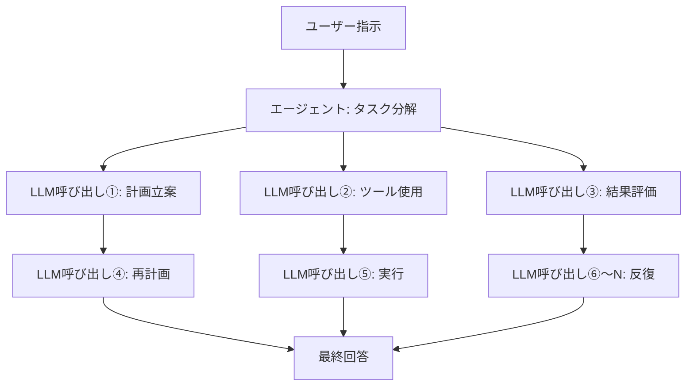

## はじめに：なぜ今、推論コストが問題なのか

2026年に入り、AIの議論は「モデルの賢さ」から「推論コストの経済性」へと急速にシフトしている。大規模言語モデル（LLM）の能力はもはや疑いの余地がないが、実際のビジネス展開において壁となっているのが「1トークンあたりの推論コスト」だ。

特にエージェント型AIは、一つのタスクを遂行するために何百〜何千ものLLM呼び出しを行う。単純な問い合わせへの回答とは桁が違うコストがかかるため、スケールアウトが難しかった。

そこにNVIDIAが打ち込んだ答えが、**Vera Rubin**プラットフォームだ。CES 2026（2026年1月）で発表されたこの次世代AIインフラは、推論コストを従来のBlackwellと比較して最大10分の1に削減すると謳い、業界の注目を集めた。

本記事では、Vera Rubinのアーキテクチャを技術的に掘り下げ、なぜこれほどのコスト削減が実現できるのか、そしてエージェント型AIの未来にどのような影響を与えるかを考察する。

---

## Vera Rubin とは何か：6チップ統合の「AIスーパーコンピュータ」

Vera Rubinは単一のGPUチップではなく、**6種類の専用チップを極度に協調設計（co-design）した統合AIプラットフォーム**だ。NVIDIAはこれを「Extreme Co-Design」と呼んでいる。

構成する6チップは以下の通りだ。

| チップ | 役割 |
|--------|------|
| **Vera CPU** | AI専用カスタムCPU |
| **Rubin GPU** | AI演算の中核 |
| **NVLink 6 Switch** | GPU間高速通信 |
| **ConnectX-9 SuperNIC** | ネットワーク処理 |
| **BlueField-4 DPU** | データ処理ユニット |
| **Spectrum-6 Ethernet Switch** | イーサネット通信 |

このシステム全体がラック単位で統合され、**Vera Rubin NVL72**というフォームファクターで提供される。72基のRubin GPUと36基のVera CPUを1ラックに集積した構成だ。

---

## Vera CPU：AI専用設計の独自プロセッサ

Vera Rubinが従来プラットフォームと大きく異なる点の一つが、**NVIDIAが独自設計したカスタムCPU「Vera」**の採用だ。

Veraは**88基のOlympusコア**を搭載する。OlympusはARM命令セットをベースとしたNVIDIA独自設計のコアで、AIデータセンターのワークロードに特化して最適化されている。各コアは「空間的マルチスレッディング（Spatial Multithreading）」技術により2スレッドを並列処理し、合計**176スレッド**の処理能力を持つ。

メモリ面では、最大**1.5TB のLPDDR5X**メモリを搭載し、**1.2 TB/s**のメモリ帯域幅を提供する。さらに重要なのが、Rubin GPUとの接続だ。**第2世代NVLink-C2C（Chip-to-Chip）**により、CPU-GPU間で**1.8 TB/s**のコヒーレントな帯域幅を実現している。

### なぜカスタムCPUが必要なのか

従来のAIサーバーでは汎用CPUを使ってきたが、LLM推論においてCPUはボトルネックになりやすい。ホストCPUのメモリ帯域幅や接続速度がGPUの処理能力に追いつかないためだ。

NVIDIAはGoogleの研究者Xiaou Maらが発表した論文（arXiv:2601.05047）が示すように、LLM推論はメモリ帯域幅と相互接続がコンピュートよりも制約要因であることを認識し、CPU側も独自設計することで組み合わせ全体を最適化した。

---

## Rubin GPU：推論に特化した第3世代Transformerエンジン

Rubin GPUは、AI推論に特化した数々の革新を詰め込んでいる。

### 主要スペック

- **NVFP4推論性能**: 50 PFLOPS（ペタFLOPS）
- **NVFP4訓練性能**: 35 PFLOPS
- **HBM4メモリ**: 1基あたり288GB
- **HBM4メモリ帯域幅**: 22 TB/s
- **NVLink 6帯域幅**: GPU1基あたり3.6 TB/s
- **トランジスタ数**: 3,360億

特に注目すべきは**HBM4**の採用だ。前世代のHBM3と比べてメモリ帯域幅が大幅に向上している。先述のLLM推論がメモリ帯域幅に制約されるという問題に直接対応している。

### 第3世代Transformerエンジン

Rubin GPUには**第3世代Transformerエンジン**が搭載されており、ハードウェアアクセラレーションによる適応的圧縮機能を持つ。NVFP4という新しい低精度数値形式を活用することで、精度を保ちながら大幅なスループット向上を実現している。

---

## NVLink 6：帯域幅の壁を突破する通信インフラ

LLMの推論、特にMixture-of-Experts（MoE）モデルやマルチGPU環境では、**GPU間の通信帯域幅**が性能を左右する。

NVLink 6は前世代（NVLink 5）と比較して**帯域幅を2倍**に向上させた。

| 指標 | NVLink 5 | NVLink 6 |
|------|----------|----------|
| スイッチあたり帯域幅 | 1,800 GB/s | 3,600 GB/s |
| GPU1基あたりの帯域幅 | — | 3.6 TB/s |
| NVL72ラック全体 | — | 260 TB/s |

NVIDIAは「NVL72ラックが提供する260 TB/sの帯域幅はインターネット全体のトラフィックを上回る」と説明している。この圧倒的な内部帯域幅が、大規模MoEモデルの効率的な推論を可能にする。

---

## 10倍コスト削減の仕組み：数値の正確な読み方

NVIDIAが主張する「推論コスト10分の1」という数値は、どのような条件で達成されるのかを正確に理解することが重要だ。

### ベンチマーク条件

10倍のコスト削減は、**Kimi-K2-Thinking モデル（32K入力 / 8K出力のシーケンス長）**でのベンチマーク結果に基づいている。これは長いコンテキストを扱うシナリオだ。

実際の改善要因を分解すると以下のようになる。

```
HBM4メモリ帯域幅の向上: 約 2.8倍
NVLink 6スループットの向上: 約 2倍
NVFP4 Tensor Core性能向上: 約 5倍
```

これらの複合効果が組み合わさることで、長コンテキスト推論での10倍改善が実現する。一方、**短いコンテキストの密なモデル（dense model）推論では2〜3倍の改善**が現実的な期待値だ。

### MoEモデルの訓練コスト削減

推論だけでなく、訓練面でも大幅な効率化が図られている。NVIDIAによれば、**Mixture-of-Experts（MoE）モデルの訓練に必要なGPU数をBlackwell比で4分の1に削減**できる。

MoEモデルはGPT-4やGeminiなど最新の大規模モデルが採用するアーキテクチャで、少ないGPUで訓練できることはコスト面で非常に重要だ。

---

## NVL72ラック：システム全体の性能

Vera Rubin NVL72は、これまで説明した各コンポーネントが統合されたラックスケールシステムだ。

### NVL72の仕様まとめ

- **GPU構成**: Rubin GPU × 72基
- **CPU構成**: Vera CPU × 36基
- **総NVFP4推論性能**: 3.6 エグザFLOPS
- **総HBM4容量**: 20.7 TB
- **総HBM4帯域幅**: 1.6 PB/s（ペタバイト毎秒）
- **NVLink 6総帯域幅**: 260 TB/s

1トレイあたり200 PFLOPS、1トレイあたり2TBの高速メモリという構成が積み重なって、このラックスケールの性能を実現している。

---

## エージェント型AIへの影響：なぜ「今」このプラットフォームなのか

Vera RubinはNVIDIAが明示的に「エージェント型AIのための基盤」と位置づけているのが特徴だ。

### エージェント型AIが抱えるコスト問題

エージェント型AIは、単純な問い合わせとは異なる計算パターンを持つ。



1つの指示に対して数十〜数百回のLLM呼び出しが発生し、しかもそれぞれのコンテキストが長い。これが従来のインフラでは高コストの原因となっていた。

Vera Rubinが提供する「長コンテキストでの10倍コスト削減」は、まさにこのユースケースに直撃する改善だ。

### Rubin CPX：超長コンテキスト推論への特化

NVIDIAはさらに、**Rubin CPX（Context Processing Extension）**という派生製品も発表している。これは「超長コンテキスト推論」に特化した新クラスのGPUで、数百万トークン規模のコンテキストを効率的に処理することを目的としている。

複雑な文書解析、長期的な会話履歴を持つエージェント、巨大なコードベースを扱う開発支援AIなど、長大なコンテキストが必要なユースケースに対応する。

---

## 展開タイムラインと主要パートナー

### 提供スケジュール

NVIDIAはVera Rubinの**量産・出荷を2026年下半期から開始**する計画だ。GTC 2026（2026年3月）でより詳細な技術情報が公開されている。

### 初期展開パートナー

最初にVera Rubinベースのクラウドサービスを提供するパートナーとして、以下の企業が発表されている。

- **ハイパースケーラー**: AWS、Google Cloud、Microsoft Azure、Oracle Cloud Infrastructure
- **専門クラウド**: CoreWeave、Lambda、Nebius、Nscale

これらのプロバイダーが2026年下半期からVera Rubinベースのインスタンスを提供し始めることで、エンタープライズ向けのエージェント型AI基盤が整備される見込みだ。

---

## Blackwellとの比較：世代間の進化

Vera RubinはNVIDIAのBlackwell（H100の後継）の次に位置づけられる。各世代の主要な改善点を整理する。

### Blackwell → Vera Rubin での主な変化

| 項目 | Blackwell | Vera Rubin | 改善倍率 |
|------|-----------|------------|---------|
| GPU間帯域幅 | 1,800 GB/s | 3,600 GB/s | **2倍** |
| HBM世代 | HBM3 | HBM4 | **〜2.8倍** |
| NVFP4推論 | — | 50 PFLOPS/GPU | — |
| 訓練GPU数（MoE） | 基準 | 1/4に削減 | **4倍** |
| トークンコスト | 基準 | 最大1/10 | **最大10倍** |

---

## 技術的課題と現実的な期待値

Vera Rubinは確かに革新的だが、現実的な評価も重要だ。

### 10倍削減の前提条件

前述の通り、10倍のコスト削減は「長コンテキスト・長出力」という特定条件でのベンチマークだ。短いコンテキストのシンプルな推論では2〜3倍の改善が現実的な期待値となる。

### 電力消費とデータセンター投資

NVL72ラックは膨大な演算能力を持つ一方で、電力消費も相応だ。2026年、ハイパースケーラーのデータセンター設備投資は合計650億ドルを超えると予測されており、Vera Rubinの導入にはそれなりの電力・冷却インフラが必要になる。

### ソフトウェアエコシステムの整備

ハードウェアが進化しても、それを最大限活用するためのソフトウェアスタック（CUDAライブラリ、推論フレームワーク）の整備も欠かせない。NVIDIAはこの点もNIM（NVIDIA Inference Microservices）などで対応を進めている。

---

## まとめ：AIインフラの次のステージへ

NVIDIA Vera Rubinは、単なる「より速いGPU」ではない。Vera CPUという独自プロセッサ、HBM4による大幅なメモリ帯域幅向上、NVLink 6による2倍のGPU間通信、そしてこれら全体を極度に協調設計した6チップ統合プラットフォームだ。

最大10倍の推論コスト削減（長コンテキスト条件）と、MoEモデル訓練に必要なGPU数4分の1という数値は、エージェント型AIの経済的実現可能性を大きく変える可能性がある。

McKinseyが「4万人の人間社員に対して2万体のAIエージェント」を運用し始めた2026年現在、AIエージェントの推論コストはビジネスの採算性に直結する課題だ。Vera Rubinが2026年下半期に量産を開始すれば、このコスト方程式は根本的に書き換えられるかもしれない。

AIの実用化を左右するのは、モデルの知能だけでなく、それを動かすインフラの経済性でもある。Vera Rubinはその文脈で、2026年を代表する重要なインフラ革新となるだろう。

---

## 参考情報

- [NVIDIA Newsroom: Vera Rubin Platform発表](https://nvidianews.nvidia.com/news/rubin-platform-ai-supercomputer)
- [NVIDIA Technical Blog: Vera Rubinプラットフォームの内側](https://developer.nvidia.com/blog/inside-the-nvidia-rubin-platform-six-new-chips-one-ai-supercomputer/)
- [Tom's Hardware: Vera Rubin NVL72詳細](https://www.tomshardware.com/pc-components/gpus/nvidia-launches-vera-rubin-nvl72-ai-supercomputer-at-ces-promises-up-to-5x-greater-inference-performance-and-10x-lower-cost-per-token-than-blackwell-coming-2h-2026)
- [NVIDIA: Rubin CPX発表](https://nvidianews.nvidia.com/news/nvidia-unveils-rubin-cpx-a-new-class-of-gpu-designed-for-massive-context-inference)
