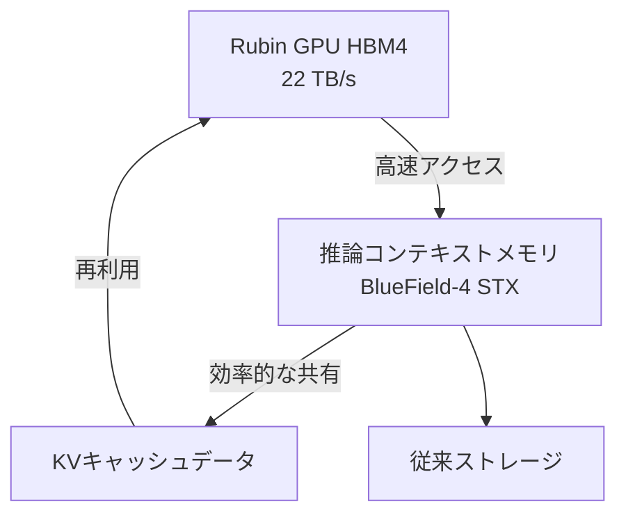
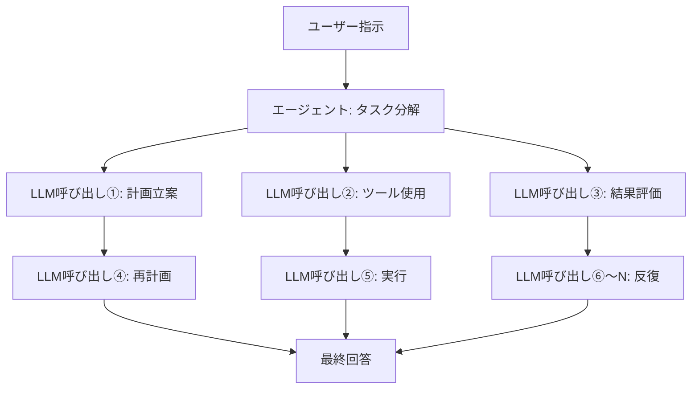

## はじめに：なぜ今、推論コストが問題なのか

2026年に入り、AIをめぐる議論は「モデルの性能」から「推論コストの経済性」へと急速にシフトしている。大規模言語モデル（LLM）の能力はもはや疑いの余地がないが、実際のビジネス展開で壁となっているのが「1トークンあたりの推論コスト」だ。

特にエージェント型AIは、一つのタスクを遂行するために何百〜何千ものLLM呼び出しを行う。単純な問い合わせとは桁が違うコストがかかるため、スケールアウトが難しかった。

NVIDIAのCEO Jensen Huangは2026年3月のGTC 2026基調講演で、この状況を端的に表現した。「もし彼らがより多くのキャパシティを持てば、より多くのトークンを生成でき、収益が上がる。エージェント型アプリが別のエージェントを生成して次々タスクをこなすようになった今、生成されるトークン数は爆発的に増加している」と述べ、高速・低コストの推論インフラの重要性を強調した。

そこにNVIDIAが打ち込んだ答えが **Vera Rubin** プラットフォームだ。CES 2026（2026年1月）で初公開され、GTC 2026（2026年3月）で詳細が明かされたこの次世代AIインフラは、推論コストを従来のBlackwellと比較して最大10分の1に削減すると謳い、業界の注目を集めている。

本記事では、Vera Rubinのアーキテクチャを技術的に掘り下げ、なぜこれほどのコスト削減が実現できるのか、そしてエージェント型AIの未来にどのような影響を与えるかを考察する。

---

## Vera Rubin とは何か：7チップ統合の「AIスーパーコンピュータ」

Vera Rubinは単一のGPUチップではなく、**7種類の専用チップを極度に協調設計（co-design）した統合AIプラットフォーム**だ。NVIDIAはこれを「Extreme Co-Design」と呼んでいる。GTC 2026でNVIDIAがGroqを2025年12月に約200億ドルで買収したことを公式に認め、Groq 3 LPUが7番目のチップとしてプラットフォームに加わった。

構成する7チップは以下の通りだ。

| チップ | 役割 |
|--------|------|
| **Vera CPU** | AI専用カスタムCPU（88基のOlympusコア） |
| **Rubin GPU** | AI演算の中核（50 PFLOPS NVFP4） |
| **NVLink 6 Switch** | GPU間高速通信（3.6 TB/s） |
| **ConnectX-9 SuperNIC** | ネットワーク処理 |
| **BlueField-4 DPU** | データ処理・推論コンテキストメモリ |
| **Spectrum-6 Ethernet Switch** | イーサネット通信 |
| **Groq 3 LPU** | 低遅延推論アクセラレータ（新規追加） |

このシステム全体がラック単位で統合され、**Vera Rubin NVL72** というフォームファクターで提供される。72基のRubin GPUと36基のVera CPUを1ラックに集積した構成だ。さらに大規模な展開では **Vera Rubin POD** という40ラック規模の構成も用意されており、60エクサFLOPSの演算能力を提供する。

---

## Vera CPU：AI専用設計の独自プロセッサ

Vera Rubinが従来プラットフォームと大きく異なる点の一つが、**NVIDIAが独自設計したカスタムCPU「Vera」**の採用だ。

Veraは **88基のOlympusコア** を搭載する。OlympusはARMv9.2命令セットをベースとしたNVIDIA独自設計のコアで、AIデータセンターのワークロードに特化して最適化されている。各コアは「空間的マルチスレッディング（Spatial Multithreading）」技術により2スレッドを並列処理し、合計 **176スレッド** の処理能力を持つ。L3キャッシュは40%増加し162MBとなり、トランジスタ数は前世代比2.2倍の2270億に達する。

注目すべきはFP8精度のサポートだ。Vera CPUはFP8をネイティブにサポートする業界初のCPUであり、AIワークロード全体を低精度数値形式で統一処理できる。

メモリ面では、最大 **1.5TB のSOCAMM LPDDR5X** メモリを搭載し、**1.2 TB/s** のメモリ帯域幅を提供する。メモリバス幅を1024ビットに拡幅し、速度を9600MT/sに向上させることで、前世代比2.5倍の帯域幅を実現している。さらに重要なのがRubin GPUとの接続だ。**第2世代NVLink-C2C（Chip-to-Chip）**により、CPU-GPU間で **1.8 TB/s** のコヒーレントな帯域幅を実現。これはPCIe Gen 6比で7倍の速度だ。

### なぜカスタムCPUが必要なのか

従来のAIサーバーでは汎用CPUを使ってきたが、LLM推論においてCPUはボトルネックになりやすい。ホストCPUのメモリ帯域幅や接続速度がGPUの処理能力に追いつかないためだ。

NVIDIAはLLM推論がメモリ帯域幅と相互接続によって制約されることを認識し、CPU側も独自設計することでシステム全体を最適化した。CPU-GPU間の高速コヒーレントリンクにより、データ転送のオーバーヘッドが最小化され、GPU稼働率が向上する。

---

## Rubin GPU：推論に特化した次世代演算エンジン

Rubin GPUは、AI推論に特化した数々の革新を詰め込んでいる。

### 主要スペック

| 項目 | 値 |
|------|-----|
| NVFP4推論性能 | **50 PFLOPS**（Blackwellの5倍） |
| NVFP4訓練性能 | **35 PFLOPS**（Blackwellの3.5倍） |
| HBM4メモリ | **288GB**（1基あたり） |
| HBM4メモリ帯域幅 | **22 TB/s** |
| NVLink 6帯域幅 | **3.6 TB/s**（GPU1基あたり） |
| トランジスタ数 | **3,360億** |

特に注目すべきは **HBM4** の採用だ。前世代のHBM3と比べてメモリ帯域幅が約2.8倍向上しており、LLM推論がメモリ帯域幅に制約されるという問題に直接対応している。

### NVFP4と第3世代Transformerエンジン

Rubin GPUには **第3世代Transformerエンジン** が搭載されており、NVFP4という新しい低精度数値形式を活用する。NVFP4はBlackwellが採用したNVFP8よりもさらに算術密度が高く、精度を保ちながら大幅なスループット向上を実現している。NVIDIAはこの低精度実行をアーキテクチャとソフトウェアスタックの両方に深く統合することで、単なるFLOPS増加を超えた実効スループットの向上を達成した。

---

## NVLink 6：帯域幅の壁を突破する通信インフラ

LLMの推論、特にMixture-of-Experts（MoE）モデルやマルチGPU環境では、**GPU間の通信帯域幅** が性能を左右する。

NVLink 6は前世代（NVLink 5）と比較して **帯域幅を2倍** に向上させた。

| 指標 | NVLink 5 | NVLink 6 |
|------|----------|----------|
| スイッチあたり帯域幅 | 1,800 GB/s | **3,600 GB/s** |
| GPU1基あたりの帯域幅 | 約1.8 TB/s | **3.6 TB/s** |
| NVL72ラック全体 | — | **260 TB/s** |

NVL72ラックが提供する260 TB/sの内部帯域幅は、大規模MoEモデルの効率的な推論を可能にする規模だ。

---

## Groq 3 LPU：低遅延推論アクセラレータ

GTC 2026での最大のサプライズの一つが、GroqのLPU（Language Processing Unit）技術のVera Rubinプラットフォームへの統合だ。NVIDIAは2025年12月24日にGroqを約200億ドルで買収し、上級スタッフの採用とGroqのLPU技術の非独占的ライセンスを取得した。

### GPUとLPUの役割分担

Vera Rubinシステムでは、RubinとGroqが推論プロセスを分担する。


- **Rubin GPU**: プリフィル処理とデコードアテンション処理を担当
- **Groq 3 LPU**: フィード・フォワード・ネットワーク（FFN）の実行を担当

この分業体制により、各チップが最も得意な処理に集中できる。

### Groq 3 LPX ラックの仕様

GTC 2026で発表された **Groq 3 LPX ラック** は、256基のLPUを搭載する。

| 項目 | 値 |
|------|-----|
| SRAM容量（チップあたり） | **500MB** |
| SRAMバンド幅（チップあたり） | **150 TB/s** |
| スケールアップ帯域幅（チップあたり） | **2.5 TB/s** |
| オンチップSRAM総容量（ラック） | **128GB** |
| スケールアップ帯域幅（ラック） | **640 TB/s** |

Groq 3はキャパシティよりも帯域幅を重視した設計で、チップあたり約80 TB/sの帯域幅を持つ。このSRAM中心の高帯域幅設計が、FFN処理における低遅延を実現する。

### 統合の効果

VeraRubinとGroq LPXの組み合わせにより、Rubin GPU単体と比較して **トリリオンパラメータモデルの推論スループットが最大35倍向上** し、**メガワットあたりのスループットが35倍増加** する。これはCUDAプラットフォームへの大幅な変更を必要とせず、LPUを高度に特化したデコードアクセラレータとして活用することで達成される。

---

## 推論コンテキストメモリストレージ：エージェント型AIへの特化

Vera Rubinが「エージェント型AIのための基盤」として設計されていることを示す重要な機能が、**推論コンテキストメモリストレージプラットフォーム**だ。

### 新しいメモリ階層

NVIDIAはBlueField-4 DPUを活用して、GPUと従来のストレージの間に新たなメモリ階層を構築した。



BlueField-4 STXストレージラックは、AIエージェントが大規模なマルチターン対話を維持する際のコンテキスト一貫性を保つための「専用コンテキストメモリ」として機能する。KVキャッシュデータをBlueField-4チップにオフロードすることで、AI推論インフラ全体でのキャッシュデータの共有・再利用が可能になり、推論スループットを **最大5倍向上** させる。

### エージェント型AIへの影響

エージェント型AIは、単純な問い合わせとは根本的に異なる計算パターンを持つ。



1つの指示に対して数十〜数百回のLLM呼び出しが発生し、それぞれが長いコンテキストを持つ。推論コンテキストメモリストレージはこのKVキャッシュを効率的に管理することで、エージェント型AIの総合的なスループットとコスト効率を改善する。

---

## 10倍コスト削減の仕組み：数値の正確な読み方

NVIDIAが主張する「推論コスト10分の1」という数値は、どのような条件で達成されるのかを正確に理解することが重要だ。

### 主要な改善要因

10倍のコスト削減は複数の技術革新の複合効果として実現される。

```
HBM4メモリ帯域幅の向上: 約 2.8倍
NVLink 6スループットの向上: 約 2倍
NVFP4 Tensor Core性能向上: 約 5倍
Groq LPU統合によるFNN処理効率化: 追加要因
```

### 電力効率の劇的な改善

Jensen Huangは基調講演で印象的な数値を示した。「Blackwell世代では1GWのデータセンターから毎秒2200万トークンを生成できた。Vera Rubinでは同じ電力で毎秒7億トークンを生成できる。これは2年間で350倍の改善だ」と述べた。

| 指標 | Blackwell | Vera Rubin | 改善倍率 |
|------|-----------|------------|---------|
| 1GWあたりトークン/秒 | 2,200万 | **7億** | **約32倍** |
| トークンコスト（長コンテキスト） | 基準 | 最大1/10 | **最大10倍** |
| 推論スループット/ワット | 基準 | 10倍 | **10倍** |
| MoE訓練GPU数 | 基準 | 1/4 | **4倍効率化** |

### 現実的な期待値

一方で、現実的な評価も重要だ。10倍のコスト削減は「長コンテキスト・長出力」という特定条件でのベンチマーク結果であり、**短いコンテキストの密なモデル（dense model）推論では2〜3倍の改善** が現実的な期待値となる。

---

## NVL72ラック：システム全体の性能

Vera Rubin NVL72は、各コンポーネントが統合されたラックスケールシステムだ。

### NVL72の仕様まとめ

| 項目 | 仕様 |
|------|------|
| GPU構成 | Rubin GPU × 72基 |
| CPU構成 | Vera CPU × 36基 |
| 総NVFP4推論性能 | **3.6 エグザFLOPS** |
| 総HBM4容量 | **20.7 TB** |
| 総HBM4帯域幅 | **1.6 PB/s**（ペタバイト毎秒） |
| NVLink 6総帯域幅 | **260 TB/s** |

### Vera Rubin POD：データセンター規模での展開

さらに大規模な構成として **Vera Rubin POD** が用意されており、40ラック規模で構成される。

| 項目 | 仕様 |
|------|------|
| 総GPU数 | 2,880基 |
| 総演算性能 | **60 エグザFLOPS** |
| 構成コンポーネント | 1,300,000点以上 |

PODはNVIDIA自身が「AIファクトリー」と呼ぶ次世代データセンターの基本単位となる。

---

## Blackwellとの比較：世代間の進化

Vera RubinはNVIDIAのBlackwellの次に位置づけられる。各世代の主要な改善点を整理する。

| 項目 | Blackwell | Vera Rubin | 改善倍率 |
|------|-----------|------------|---------|
| GPU推論性能（NVFP4） | 10 PFLOPS | **50 PFLOPS** | **5倍** |
| GPU訓練性能 | 10 PFLOPS | **35 PFLOPS** | **3.5倍** |
| GPU間帯域幅 | 1,800 GB/s | **3,600 GB/s** | **2倍** |
| HBM世代 | HBM3 | **HBM4** | **約2.8倍** |
| CPU | 汎用/Grace | **Vera（Olympus 88コア）** | — |
| 低遅延推論 | — | **Groq 3 LPU統合** | — |
| 訓練GPU数（MoE） | 基準 | **1/4に削減** | **4倍** |
| トークンコスト | 基準 | **最大1/10** | **最大10倍** |

---

## 展開タイムラインと主要パートナー

### 提供スケジュール

NVIDIAはVera Rubinの **量産・出荷を2026年下半期から開始** する計画だ。GTC 2026（2026年3月16〜19日）時点でVera Rubinは「フルプロダクション状態」であることが確認されている。

### 初期展開パートナー

最初にVera Rubinベースのクラウドサービスを提供するパートナーとして、以下の企業が発表されている。

- **ハイパースケーラー**: AWS、Google Cloud、Microsoft Azure、Oracle Cloud Infrastructure（OCI）
- **専門クラウド**: CoreWeave、Lambda、Nebius、Nscale

Jensen Huangは「2027年末までにBlackwellとRubinへの累計注文は1兆ドルを超えるだろう」と述べており、Vera Rubinがデータセンター投資の中核として位置づけられていることを示した。

---

## 技術的課題と今後の展望

### 電力消費とデータセンター投資

NVL72ラックは膨大な演算能力を持つ一方で、電力消費も相応だ。2026年、ハイパースケーラーのデータセンター設備投資は合計650億ドルを超えると予測されており、Vera Rubinの導入には電力・冷却インフラへの大規模投資が必要となる。

### ソフトウェアエコシステムの整備

Groq 3 LPUの統合はCUDAプラットフォームへの大幅な変更を必要としないとNVIDIAは説明しているが、ソフトウェアスタック（CUDAライブラリ、推論フレームワーク）の最適化も重要だ。NVIDIAはNIM（NVIDIA Inference Microservices）などで対応を進めている。

### 次世代「Vera Rubin Ultra」

GTC 2026ではさらに次世代の **Vera Rubin Ultra** も予告されており、NVIDIAが年次サイクルでのプラットフォーム進化を続けることが示唆されている。

---

## まとめ：AIインフラの次のステージへ

NVIDIA Vera Rubinは、単なる「より速いGPU」ではない。Vera CPUという独自プロセッサ、HBM4による大幅なメモリ帯域幅向上、NVLink 6による2倍のGPU間通信、Groq 3 LPUとの低遅延推論統合、推論コンテキストメモリストレージによるKVキャッシュ管理——これら7つのチップと関連システムが極度に協調設計された統合AIプラットフォームだ。

最大10倍の推論コスト削減（長コンテキスト条件）、MoEモデル訓練に必要なGPU数4分の1、そして同一電力での350倍のトークン生成能力は、エージェント型AIの経済的実現可能性を根本的に変える。

エージェント型AIが企業の業務自動化に本格的に展開されつつある2026年において、推論コストはビジネスの採算性に直結する課題だ。Vera Rubinが2026年下半期に量産を開始すれば、このコスト方程式は書き換えられる。AIの実用化を左右するのは、モデルの知能だけでなく、それを動かすインフラの経済性でもある。Vera Rubinはその文脈で、2026年を代表する重要なインフラ革新となるだろう。

---

## 参考文献

| タイトル | 情報源 | 日付 | URL |
|:---------|:-------|:-----|:----|
| NVIDIA Kicks Off the Next Generation of AI With Rubin — Six New Chips, One Incredible AI Supercomputer | NVIDIA Newsroom | 2026/03/16 | https://nvidianews.nvidia.com/news/rubin-platform-ai-supercomputer |
| NVIDIA Vera Rubin Opens Agentic AI Frontier | NVIDIA Newsroom | 2026/03/16 | https://nvidianews.nvidia.com/news/nvidia-vera-rubin-platform |
| Inside the NVIDIA Vera Rubin Platform: Six New Chips, One AI Supercomputer | NVIDIA Technical Blog | 2026/03/16 | https://developer.nvidia.com/blog/inside-the-nvidia-rubin-platform-six-new-chips-one-ai-supercomputer/ |
| Inside NVIDIA Groq 3 LPX: The Low-Latency Inference Accelerator for the NVIDIA Vera Rubin Platform | NVIDIA Technical Blog | 2026/03/16 | https://developer.nvidia.com/blog/inside-nvidia-groq-3-lpx-the-low-latency-inference-accelerator-for-the-nvidia-vera-rubin-platform/ |
| NVIDIA Vera Rubin POD: Seven Chips, Five Rack-Scale Systems, One AI Supercomputer | NVIDIA Technical Blog | 2026/03/16 | https://developer.nvidia.com/blog/nvidia-vera-rubin-pod-seven-chips-five-rack-scale-systems-one-ai-supercomputer/ |
| Infrastructure for Scalable AI Reasoning | NVIDIA公式 | 2026/03 | https://www.nvidia.com/en-us/data-center/technologies/rubin/ |
| Nvidia launches Vera Rubin NVL72 AI supercomputer at CES | Tom's Hardware | 2026/01/06 | https://www.tomshardware.com/pc-components/gpus/nvidia-launches-vera-rubin-nvl72-ai-supercomputer-at-ces-promises-up-to-5x-greater-inference-performance-and-10x-lower-cost-per-token-than-blackwell-coming-2h-2026 |
| GTC 2026: Nvidia Unveils Vera Rubin AI Platform, Eyes \$1T by 2027 | Data Center Knowledge | 2026/03/16 | https://www.datacenterknowledge.com/data-center-chips/gtc-2026-nvidia-unveils-vera-rubin-ai-platform-eyes-1t-by-2027 |
| Nvidia GTC 2026: CEO Jensen Huang sees \$1 trillion in orders for Blackwell and Vera Rubin through '27 | CNBC | 2026/03/16 | https://www.cnbc.com/2026/03/16/nvidia-gtc-2026-ceo-jensen-huang-keynote-blackwell-vera-rubin.html |
| Nvidia's Rubin platform aims to cut AI training, inference costs | CIO Dive | 2026/03 | https://www.ciodive.com/news/nvidia-rubin-cut-ai-training-inference-costs/808915/ |
| NVIDIA Vera Rubin NVL72 Detailed: 72 GPUs, 36 CPUs, 260 TB/s Scale-Up Bandwidth | VideoCardz | 2026/01 | https://videocardz.com/newz/nvidia-vera-rubin-nvl72-detailed-72-gpus-36-cpus-260-tb-s-scale-up-bandwidth |
| Decoding the Future of Inference At NVIDIA: Groq LPUs Join Vera Rubin Platform | ServeTheHome | 2026/03/16 | https://www.servethehome.com/decoding-the-future-of-inference-at-nvidia-groq-lpus-join-vera-rubin-platform-for-low-latency-inference/ |
| Nvidia Boasts 7 Chips in Production for Vera Rubin Platform, Including Groq 3 LPU | HPCwire | 2026/03/16 | https://www.hpcwire.com/2026/03/16/nvidia-boasts-7-chips-in-production-for-vera-rubin-platform-including-groq-3-lpu/ |
| NVIDIA Launches New Vera CPU: 88 Olympus Cores Designed From Scratch for AI | Knowledge Hub Media | 2026/01 | https://knowledgehubmedia.com/nvidia-launches-new-vera-cpu-88-olympus-cores-designed-from-scratch-for-ai/ |
| NVIDIA GTC 2026: Rubin GPUs, Groq LPUs, Vera CPUs, and What NVIDIA Is Building for Trillion-Parameter Inference | StorageReview | 2026/03/16 | https://www.storagereview.com/news/nvidia-gtc-2026-rubin-gpus-groq-lpus-vera-cpus-and-what-nvidia-is-building-for-trillion-parameter-inference |
