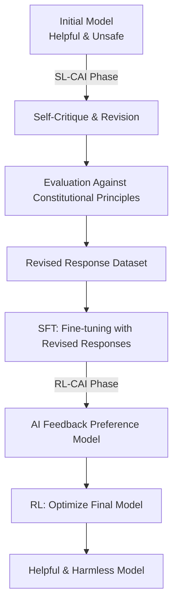

On January 22, 2026, Anthropic released a document known as "Claude's Constitution." This document, spanning approximately 23,000 words, details Claude's operational principles, values, and judgment criteria. It has been released in its entirety under the **Creative Commons CC0 1.0** license, equivalent to the public domain.

The CC0 release signifies that "anyone may use, modify, or adopt it without restriction." This is a first for an AI company to release a core constitutional document, used in training its models, into the public domain.

## What is Constitutional AI?

### A Technology Originating from a 2022 Paper

The concept of Constitutional AI was first systematically presented in the paper "Constitutional AI: Harmlessness from AI Feedback" (arXiv:2212.08073) by Anthropic in December 2022. The authors were Yuntao Bai and 50 other co-authors in a large-scale collaborative effort.

Traditional RLHF (Reinforcement Learning from Human Feedback) involved collecting vast amounts of human feedback to guide models toward safer behavior. However, this approach faced a fundamental challenge: it did not scale. As models become more powerful, the human expertise required for evaluation increases, leading to exponentially rising costs.

Constitutional AI proposed a solution: "RLHF from AI Feedback," or **RLAIF (Reinforcement Learning from AI Feedback)**.

### CAI's Technical Flow



In the **SL-CAI phase (Supervised Learning)**, the model itself critiques and revises its harmful responses based on constitutional principles. For example, it might self-evaluate as "This response contains a racist premise. It violates Constitutional Principle X (equal treatment)," and then generate a revised version. Fine-tuning is performed using these revised responses.

In the **RL-CAI phase (Reinforcement Learning)**, AI evaluates which of multiple candidate responses better aligns with constitutional principles, constructing a preference dataset. This data is used to train a reward model, which then optimizes the main model through RL.

The core innovation of this method is "compressing the human supervision needed for labeling into a single text document – the constitution." Instead of direct human evaluation, AI references the constitution to make assessments, significantly mitigating the human labor scaling problem.

### Challenges Solved by RLAIF

Experimental results in the original paper showed that models trained with Constitutional AI demonstrated safety levels equivalent to or exceeding those of traditional RLHF-based models. Notably, they exhibited characteristics of being "low in harmfulness yet not overly evasive."

Traditional safety filtering often employed a simple approach of "rejecting dangerous queries." This tended to result in either excessive rejection (high false positives) or insufficient filtering (high false negatives). Constitutional AI, by enabling the model to understand "why something is problematic," allows for more contextually appropriate judgments.

## What the 2026 "Claude's Constitution" Has Changed

### From Rule Lists to Principle-Based Reasoning

The initial "Constitutional AI" document released in 2023 was largely in the format of a rule list, specifying "what not to do." The structure involved the model referencing this list for checks.

The 2026 version represents an architectural shift. It is designed as a comprehensive reasoning framework with four tiers of priority.

| Priority | Item | Description |
|---------|------|------|
| 1 | **Broadly Safe** | Upholds appropriate human oversight of AI systems |
| 2 | **Generally Ethical** | Honesty and avoidance of harm |
| 3 | **Adherent to Anthropic's Principles** | Compliance with company policies |
| 4 | **Genuinely Helpful** | True assistance to users and operators |

The philosophical implication of these priorities is crucial. The fact that safety is prioritized over helpfulness explicitly declares the principle that "safety must not be sacrificed for helpfulness." However, in normal operations, helpfulness serves as the primary evaluation metric – the design ensures maximum helpfulness within the bounds of not violating higher-priority principles.

While hard constraints (absolute prohibitions, such as assisting in the production of biological weapons) are still explicitly stated, the majority of guidelines focus on "cultivating judgment."

### Teaching Models the "Why"

The most notable change in the 2026 version is the detailed explanation of the "why" behind the rules.

For instance, "do not generate violent content" is a rule found in many AI safety guidelines. However, the 2026 version of Claude's constitution meticulously explains the underlying values: respect for human dignity, prevention of real-world harm, and the tension with freedom of expression.

Anthropic aims not for models that "memorize rules," but for models that "understand principles and can apply them to novel situations." This is a response to the reality where new situations (new technologies, new societal problems, new use cases) constantly emerge that were not anticipated by the rules.

```
【Traditional Approach】
IF request matches prohibition list THEN Reject
ELSE Respond

【Principle-Based Approach】
1. What is the intent and context of this request?
2. Which principles are relevant?
3. How do these principles apply to this situation?
4. How to resolve trade-offs between principles?
5. What is the most ethical response overall?
```

### Significance of the Large-Scale Document Release

The 23,000-word length is also noteworthy. This is equivalent to a short novel. It details not just superficial rule lists, but also values, judgment processes, and approaches to difficult decision-making cases.

This level of detail has a secondary effect: enhanced transparency, allowing corporate decision-makers and users to understand "why Claude behaves the way it does." It can be seen as one answer to the "black box" problem of AI systems.

Anthropic candidly acknowledges in the document that "there is a gap between intended behavior and actual model behavior," and commits to ongoing evaluation and expansion of safety research.

## What the CC0 Release Asks of the Industry

### An Experiment in Open-Sourcing AI Safety

Releasing the Constitutional AI constitution document under CC0 holds significant implications from the perspective of open-sourcing AI safety research.

**Benefits to the Research Community**: Universities and research institutions can verify, extend, and critique Anthropic's approach. It embodies the philosophy that safety research should, before being a competition for "who builds safer AI," be a collaborative effort to "understand what safe AI is."

**Impact on Other AI Companies**: Competitors like OpenAI, Google, and Meta can reference, adopt, and modify similar documents. While it may appear to reduce short-term competitive advantage, it can lead to the industry as a whole achieving higher AI safety standards, thereby earning trust from regulators and society.

**Influence on the Developer Community**: Smaller AI companies and individual developers can save the cost of designing safety frameworks from scratch.

### "Abandoning Competitive Advantage" or "Strategy to Dominate the Standard"?

Critical perspectives on the CC0 release also exist. If competitors adopt Claude's constitution and it effectively becomes the industry standard for "Anthropic-designed safety frameworks," it would place Anthropic in an advantageous position.

Standardization also means "making one's design philosophy the de facto industry standard." Linux was open-sourced to counter proprietary UNIX systems from IBM and Sun Microsystems, and as a result, Linux became a dominant platform. If the CC0 release of Constitutional AI triggers similar dynamics in the world of AI safety, Anthropic could become the unacknowledged leader in "safety frameworks."

### Lingering Questions

There are issues that even the CC0 release does not resolve.

**Implementation Gap**: Even if the constitution document is released, the know-how for integrating it into the training process is not disclosed. Whether other companies can achieve equivalent safety after reading the "constitution" is a separate matter.

**Difficulty of Evaluation**: Objective metrics for measuring compliance with Claude's constitution have not been released. "Principle-based reasoning" is qualitative and difficult to benchmark.

**Universality of Values**: The values embedded in the 23,000-word document are primarily premised on English-speaking, Western contexts. The appropriateness of applying these values to global AI systems requires ongoing discussion.

## Position within Anthropic's Governance Strategy

The CC0 release of Constitutional AI is part of Anthropic's broader transparency strategy. The company has a governance mechanism called the "Long-Term Benefit Trust," and in January 2026, it welcomed Mariano-Florentino Cuéllar, a former California Supreme Court Justice, as a new member. The approach of incorporating legal and international affairs experts into the governance structure is a strategic choice amidst the burgeoning AI regulation discussions.

Anthropic pursues multiple safety research directions in parallel, with interpretability, scalable oversight, process-oriented learning, and generalized understanding as key pillars. Constitutional AI is positioned as the "most implementation-ready" aspect among these research areas.

The progression from the publication of the Constitutional AI paper (2022) → release of the initial constitution (2023) → CC0 release of the revised constitution (January 2026) demonstrates a scenario of phased influence expansion: research → practice → industry standardization.


## Conclusion

Anthropic's CC0 release of "Claude's Constitution" signifies more than just information disclosure.

Technically, the transition from rule lists to a principle-based reasoning framework is an attempt to update the very methodology of AI safety implementation. The combination of Constitutional AI and RLAIF offers a practical answer to the problem of human supervision costs.

Strategically, the open-sourcing of AI safety frameworks can be interpreted as a move to establish an industry standard, led by Anthropic. The choice of CC0, the most permissive license, reflects an intent to maximize adoption and encourage future forks and adaptations.

Socially, it serves as a public response from the company to the question of "what AI is and how it should behave," fostering dialogue among researchers, policymakers, and the general public.

As the discussion on AI safety transitions from "Anthropic's problem" to an "industry-wide and societal problem," the CC0 release of Constitutional AI will likely serve as a milestone symbolizing that transition.

## References

| Title | Source | Date | URL |
|:---------|:-------|:-----|:----|
| Constitutional AI: Harmlessness from AI Feedback | arXiv | 2022-12-15 | https://arxiv.org/abs/2212.08073 |
| Claude's new constitution | Anthropic | 2026-01-22 | https://www.anthropic.com/news/claude-new-constitution |
| Long-Term Benefit Trust New Member Appointment | Anthropic | 2026-01-21 | https://www.anthropic.com/news/mariano-florentino-long-term-benefit-trust |
| Constitutional AI: Anthropic's Safety Research | Anthropic Research | 2023 | https://www.anthropic.com/research/constitutional-ai-harmlessness-from-ai-feedback |
| Anthropic's core views on AI safety | Anthropic | 2023 | https://www.anthropic.com/news/core-views-on-ai-safety |
| Creative Commons CC0 1.0 Universal | Creative Commons | — | https://creativecommons.org/publicdomain/zero/1.0/ |
| Claude's Model Specification | Anthropic | 2024 | https://www.anthropic.com/news/anthropics-model-specification |

---

> This article was automatically generated by LLM. It may contain errors.
