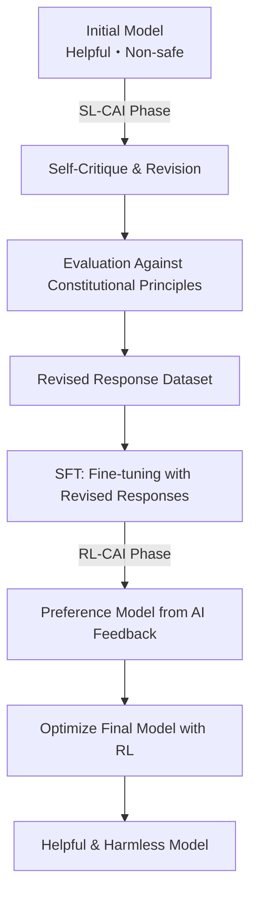
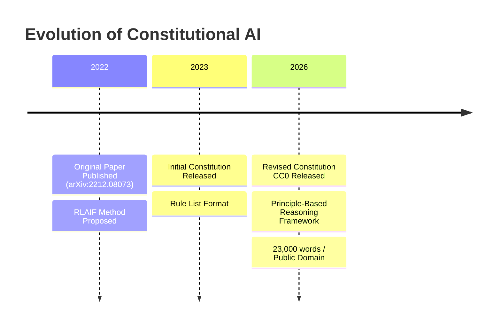

On January 22, 2026, Anthropic released a document known as "Claude's Constitution." This document, approximately 23,000 words long, details Claude's operational principles, values, and judgment criteria, and was released in its entirety under the **Creative Commons CC0 1.0** license, equivalent to the public domain.

The CC0 release signifies that "anyone can use, modify, and adopt it without restriction." This marks the first time an AI company has made a core constitutional document used for its model's training available in the public domain.

## What is Constitutional AI?

### A Technology Originating from the 2022 Original Paper

The concept of Constitutional AI was first systematically presented in the paper "Constitutional AI: Harmlessness from AI Feedback" (arXiv:2212.08073), published by Anthropic in December 2022. The authors were Yuntao Bai and 50 other co-authors in a large-scale collaborative effort.

Traditional RLHF (Reinforcement Learning from Human Feedback) involved collecting a vast amount of human feedback to steer models in a safe direction. However, this approach had a fundamental challenge: it did not scale. As models become more powerful, the human expertise required for evaluation increases, leading to exponentially growing costs.

The solution proposed by Constitutional AI is "RLHF from AI Feedback," or **RLAIF (Reinforcement Learning from AI Feedback)**.

### CAI Technical Flow



In the **SL-CAI Phase (Supervised Learning)**, the model itself critiques and revises its harmful responses based on constitutional principles. For example, it might self-evaluate: "This response contains racist assumptions. It violates Constitutional Principle X (equal treatment)," and generate a revised version. Fine-tuning is then performed with the revised responses.

In the **RL-CAI Phase (Reinforcement Learning)**, the AI evaluates which of several candidate responses better aligns with constitutional principles, building a preference dataset. This data is used to train a reward model, which then optimizes the main model through RL.

The core of this method is that "the human supervision required for labeling has been compressed into a single text document: the constitution." Instead of humans directly evaluating, the AI refers to the constitution to perform evaluations. This significantly alleviates the scaling problem associated with labor costs.

### Challenges Solved by RLAIF

The experimental results in the original paper showed that models adapted with Constitutional AI exhibited safety levels equal to or greater than those of traditional RLHF-based models. Notably, they demonstrated the characteristic of being "low in harmfulness while not being evasive."

Traditional safety filtering often relied on a simple approach of "rejecting dangerous queries." This tended to lead to either excessive rejections (high false positives) or too many passing through (high false negatives).
With Constitutional AI, the model understands "why something is problematic" before responding, enabling appropriate judgments based on context.

## What the 2026 Version of "Claude's Constitution" Has Changed

### From Rule Lists to Principle-Based Reasoning

The initial "Constitutional AI" document released in 2023 was largely in the form of a rule list of "things not to do." It specified prohibitions and the model checked against this list.

The 2026 version is architecturally different. It is designed as a comprehensive reasoning framework with four levels of priority.

| Priority | Item                   | Description                                          |
|----------|------------------------|------------------------------------------------------|
| 1        | **Broadly Safe**       | Supports appropriate human oversight of AI systems.    |
| 2        | **Generally Ethical**  | Honesty and avoidance of harmfulness.                |
| 3        | **Adherent to Anthropic's Principles** | Compliance with the company's policies.              |
| 4        | **Genuinely Helpful**  | Genuine assistance to users and operators.           |

The philosophical implications of the priority order are important. The prioritization of safety over helpfulness explicitly declares the principle that "safety should not be sacrificed for helpfulness." However, in normal operations, helpfulness (the fourth item) becomes the primary evaluation metric – it is designed to be as helpful as possible within the bounds of not violating higher-order principles.

Furthermore, while hard constraints (absolute prohibitions such as assisting in the creation of biological weapons) continue to be explicitly stated, the majority of guidelines focus on "fostering judgment capability."

### Teaching Models "Why"

The most noteworthy change in the 2026 version is the detailed explanation of the "why" behind the rules.

For example, "do not generate violent content" is a rule included in many AI safety guidelines. However, the 2026 version of Claude's constitution carefully explains the underlying values behind this rule – respect for human dignity, prevention of real-world harm, and the tension with freedom of expression.

Anthropic aims for "models that understand principles and can apply them to unknown situations," not just "models that memorize rules." This is a response to the reality that new situations (new technologies, new societal problems, new use cases) that rules do not anticipate are constantly emerging.

```
【Traditional Approach】
IF request matches a forbidden list THEN reject
ELSE respond

【Principle-Based Approach】
1. What is the intent and context of this request?
2. Which principles are relevant?
3. How does each principle apply to this situation?
4. How to resolve trade-offs between principles?
5. What is the most ethical response overall?
```

### Significance of the Large-Scale Document Release

The scale of 23,000 words is also noteworthy. This is a volume of text equivalent to a short novel. It details not just superficial rule lists, but also values, decision-making processes, and approaches to difficult cases.

Such detail has a secondary effect: improved transparency, allowing corporate decision-makers and users to understand "why Claude behaves the way it does." It can be seen as one answer to the "black box" problem of AI systems.

Anthropic frankly acknowledges in the document that "there is a gap between intended behavior and actual model behavior," and commits to ongoing evaluation and expanded safety research.

## What the CC0 Release Poses to the Industry

### An Experiment in Open-Sourcing AI Safety

Releasing the Constitutional AI constitution document under CC0 holds significant meaning from the perspective of open-sourcing AI safety research.

**Benefits to the Research Community**: Universities and research institutions can verify, extend, and critique Anthropic's approach. Safety research should be a collaborative effort to "understand what safe AI is," rather than a race to "see who can build safer AI." This release embodies that philosophy.

**Ripple Effect on Other AI Companies**: Competitors like OpenAI, Google, and Meta can reference, adopt, and modify similar documents. While it may seem like a short-term loss of competitive advantage, an improvement in the overall AI safety standard across the industry can lead to greater trust from regulators and society for the entire industry.

**Impact on the Developer Community**: Smaller AI companies and individual developers can save the cost of designing safety frameworks from scratch.

### "Abandoning Competitive Advantage" or "A Strategy to Dominate the Standard"?

There are also critical perspectives on the CC0 release. If competitors adopt Claude's constitution and it effectively becomes the industry standard "safety framework designed by Anthropic," it would put Anthropic in an advantageous position.

Standardization also means "making one's own design philosophy the de facto standard of the industry." Linux was open-sourced to counter proprietary UNIX systems from IBM and Sun Microsystems, and as a result, Linux became the dominant platform. If the CC0 release of Constitutional AI triggers a similar dynamic in the world of AI safety, Anthropic could become the unspoken leader of "safety frameworks."

### Remaining Questions

There are issues that the CC0 release does not resolve.

**Implementation Gap**: Even with the constitution document released, the know-how for integrating it into the training process is not disclosed. Whether other companies can achieve equivalent safety after reading the "constitution" is a separate question.

**Difficulty in Evaluation**: Metrics for objectively measuring compliance with Claude's constitution have not been disclosed. "Principle-based reasoning" is qualitative and difficult to benchmark.

**Universality of Values**: The values embedded in the 23,000-word document are primarily premised on an English-speaking, Western context. The appropriateness of applying these values to global AI systems requires ongoing discussion.

## Position within Anthropic's Governance Strategy

The CC0 release of Constitutional AI is part of Anthropic's broader transparency strategy. The company has a governance mechanism called the "Long-Term Benefit Trust," and in January 2026, it welcomed Mariano-Florentino Cuéllar, a former California Supreme Court Justice, as a new member. The incorporation of legal and international affairs experts into the governance structure is a strategic choice amidst the full-fledged AI regulation discussions.

Anthropic pursues multiple safety research directions in parallel, with interpretability, scalable oversight, process-oriented learning, and generalized understanding as key pillars. Constitutional AI is positioned as the "closest to implementation" among these research areas.

The progression from the publication of the Constitutional AI paper (2022) → release of the initial constitution (2023) → CC0 release of the revised constitution (January 2026) demonstrates a scenario of phased influence expansion: research → practice → industry standardization.



## Conclusion

Anthropic's CC0 release of "Claude's Constitution" signifies more than just information disclosure.

Technically, the shift from rule lists to a principle-based reasoning framework is an attempt to update the methodology for implementing AI safety itself. The combination of Constitutional AI and RLAIF offers a practical answer to the problem of human oversight costs.

Strategically, the open-sourcing of AI safety frameworks can be interpreted as a move to establish industry standards led by Anthropic. The choice of CC0, the most permissive license, indicates an intention to maximize adoption and encourage future forks and implementations.

Societally, as a public response from the corporate side to the question of "what AI is and how it should behave," it plays a role in promoting dialogue with researchers, policymakers, and the general public.

As the discussion on AI safety transitions from "just Anthropic's problem" to "an industry-wide and societal problem," the CC0 release of Constitutional AI will likely serve as a milestone symbolizing that transition.

## References

| Title                                               | Source         | Date       | URL                                                     |
|-----------------------------------------------------|----------------|------------|---------------------------------------------------------|
| Constitutional AI: Harmlessness from AI Feedback    | arXiv          | 2022-12-15 | https://arxiv.org/abs/2212.08073                        |
| Claude's new constitution                           | Anthropic      | 2026-01-22 | https://www.anthropic.com/news/claude-new-constitution  |
| Long-Term Benefit Trust welcomes new member         | Anthropic      | 2026-01-21 | https://www.anthropic.com/news/mariano-florentino-long-term-benefit-trust |
| Constitutional AI: Anthropic's safety research    | Anthropic Research | 2023       | https://www.anthropic.com/research/constitutional-ai-harmlessness-from-ai-feedback |
| Anthropic's core views on AI safety                 | Anthropic      | 2023       | https://www.anthropic.com/news/core-views-on-ai-safety  |
| Creative Commons CC0 1.0 Universal                  | Creative Commons | —          | https://creativecommons.org/publicdomain/zero/1.0/      |
| Claude's Model Specification                        | Anthropic      | 2024       | https://www.anthropic.com/news/anthropics-model-specification |

---

> This article was automatically generated by LLM. It may contain errors.
