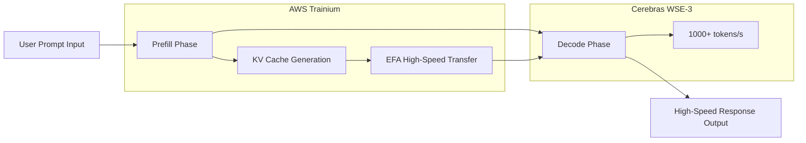

### Title
Cerebras×OpenAI: GPU独占からの脱却とAIインフラ多様化の現実

### Summary
OpenAIがCerebrasのWSE-3ウェーハスケールチップを採用し、毎秒1,000トークン超えの超高速推論を実現。100億ドル規模の契約はNVIDIA独占体制への挑戦であり、AIインフラの競争地図を塗り替える歴史的転換点となっている。

### Tags
["Cerebras","OpenAI","AI推論","AIインフラ","NVIDIA","GPUアーキテクチャ","ウェーハスケール"]

### Body

The early part of 2026 will likely be remembered as a turning point in the history of AI infrastructure. OpenAI entered into a contract with Cerebras exceeding $10 billion, marking the first large-scale adoption of inference accelerators other than NVIDIA GPUs in a production environment. The symbol of this is "GPT-5.3-Codex-Spark"—a coding-specialized model operating at speeds exceeding 1,000 tokens per second.

This move is more than just a change in procurement. It signifies the introduction of fundamental competition into the stronghold of NVIDIA, which has dominated the AI hardware market for years. This article will delve into the technical details of the Cerebras WSE-3 architecture, the background of the agreement with OpenAI, and the impact of AI infrastructure diversification on the entire industry.

## Cerebras WSE-3: Innovation in Wafer Scale Engines

### Fundamental Differences from Traditional GPU Architectures

Many of the GPUs supporting modern AI inference adopt an architecture where a silicon wafer is cut into individual chips (dicing), and multiple chips are then connected via a network for parallel processing. NVIDIA's H100 and B200 are typical examples, achieving scale-out by connecting multiple chips with high-speed interconnects like NVLink.

Cerebras' approach overturns this convention. The WSE (Wafer Scale Engine) operates the entire wafer as a single, massive chip. Since physical dicing is avoided, there is no inherent overhead from inter-chip communication.

### Key Specifications of WSE-3

The WSE-3 is manufactured using TSMC's 5nm process and boasts the following specifications:

| Specification Item | WSE-3 | NVIDIA H100 | Multiplication Factor |
|:-------------------|:------|:------------|:---------|
| Number of Transistors | 4 trillion | Approx. 80 billion | Approx. 50x |
| Number of AI Cores | 900,000 cores | 17,408 cores | Approx. 52x |
| On-chip SRAM | 44 GB | 50 MB | Approx. 880x |
| Memory Bandwidth | 21 PB/s | 3.35 TB/s | Approx. 7,000x |
| Chip Area | 46,255 mm² | 814 mm² | Approx. 57x |
| Peak Compute Performance | 125 PFLOPS | 3.958 PFLOPS | Approx. 32x |

Particularly noteworthy is the on-chip SRAM capacity. The WSE-3's 44 GB is equivalent to 880 times that of the H100. In AI inference, memory bandwidth often becomes a bottleneck, and by equipping the chip with a large amount of on-chip memory, access to off-chip memory can be minimized. This is the fundamental reason behind high-speed inference.

### Inference Speed Realized by Wafer Scale

The 900,000 cores of the WSE-3 are all uniformly connected in a 2D mesh topology. This architecture dramatically accelerates the "decoding" phase in token generation.

When a typical GPU cluster performs AI inference, model weight data needs to be transferred between multiple GPUs. With the WSE-3, all weights are deployed on the on-chip SRAM, eliminating the need for external memory access and enabling high throughput of several thousand tokens per second.

## OpenAI and Cerebras' $10 Billion Contract

### Contract Overview

In January 2026, OpenAI and Cerebras entered into a multi-year contract to provide 750 megawatts of compute resources until 2028. The total contract value exceeds $10 billion, a transformative deal given Cerebras' business scale.

According to Cerebras CEO Andrew Feldman, the negotiations began in August of the previous year. Cerebras demonstrated that it could run OpenAI's open-source models more efficiently on its chips than on GPUs. This technical demo opened the door to the large contract.

For OpenAI, this contract is central to its procurement diversification strategy. While maintaining existing orders with NVIDIA, AMD, and Broadcom, OpenAI has added $10 billion worth of inference-exclusive compute procurement from Cerebras. This reflects a strategic decision of "risk diversification of AI infrastructure."

### GPT-5.3-Codex-Spark: The First Mass Production Outcome

In February 2026, OpenAI unveiled "GPT-5.3-Codex-Spark" as the first outcome of this partnership. Designed as a lightweight version of GPT-5.3-Codex, this model is optimized for real-time coding and has the following features:

- **Inference Speed**: Over 1,000 tokens/sec (approx. 15x faster than GPT-5.3-Codex)
- **Context Window**: 128k (text only)
- **Supported Environments**: ChatGPT Pro, Codex app, CLI, VS Code extension
- **Availability**: Research preview (phased rollout)

While the figure of 1,000 tokens per second is difficult to grasp intuitively, comparing it to GPT-5.3-Codex's operation of 65-70 tokens/sec means that the AI can complete or generate code faster than a developer can type. This is a speed that fundamentally changes the "interactivity" of coding.

### Why Coding is the First Use Case

OpenAI's initial application of Cerebras chips to coding (agentic coding) is strategically sound.

The productivity of coding assistants is highly dependent on response speed. When developers receive real-time completions as they type code, even a delay of a few hundred milliseconds can break their concentration. The importance of this speed is further amplified in agentic workflows where AI agents execute tests, fix bugs, and refactor code.

The ultra-fast inference provided by Cerebras' wafer-scale chips brings the most direct value to this domain, making it the chosen first use case.

## Structural Background of NVIDIA's Monopolistic System Breaking Down

### NVIDIA's Dominance in AI Infrastructure

For the past five years, NVIDIA has almost exclusively dominated the AI training and inference market. Its GPUs, primarily the H100 and A100, have become standard infrastructure for all major cloud providers and large AI labs, with strong lock-in to the CUDA ecosystem making it difficult for competitors to enter.

This monopolistic position has also been a constraint for OpenAI. Dependence on a single supplier carries the following risks:

- **Loss of Pricing Power**: NVIDIA holds a strong advantage in price setting.
- **Supply Bottlenecks**: GPU shortages constrain the expansion of AI services.
- **Single Point of Failure**: NVIDIA's manufacturing or supply issues directly translate to business risk.

### OpenAI's Diversification Strategy

OpenAI began to seriously diversify its procurement sources from 2025. While maintaining its existing contracts with NVIDIA, it has expanded orders with AMD, Broadcom, and Cerebras. The $10 billion contract with Cerebras is a strategic investment specifically focused on inference workloads.

It is noteworthy that the adoption of Cerebras chips is not for "general-purpose computing" but specifically for "accelerating inference." According to Deloitte's projections, inference will account for about two-thirds of all AI computation by 2026 (around 50% as of 2025), and demand for inference accelerators will continue to grow.

### AWS and Cerebras Partnership: Ripple Effect on the Cloud

Approximately two months after the agreement with OpenAI, on March 13, 2026, AWS and Cerebras announced a significant partnership. The deployment of the "Disaggregated Inference Architecture" will introduce Cerebras WSE-3 chips into AWS Bedrock.

Technically, it adopts a hybrid configuration where AWS's Trainium processor handles the prefill (prompt processing) phase, and the Cerebras CS-3 handles the decoding (output generation) phase. This division of labor is said to achieve 5 times the token capacity on the same hardware footprint.

This concept of "disaggregated inference" architecture leverages the different computational characteristics of each phase. By assigning prefill, which is good at parallel processing, to GPU-like systems and decoding, which requires large on-chip memory, to the WSE-3, overall throughput is maximized.

## Cerebras' Corporate Strategy and IPO

### Growth to a $2.2 Billion Valuation

Cerebras' valuation was $8 billion as of 2024, but due to the OpenAI contract and the acquisition of multiple large customers (including IBM and the U.S. Department of Energy), its valuation exceeded $22 billion was reported in early 2026. With estimated sales surpassing $1 billion in 2025, it has matured from a research-stage startup to an infrastructure company with actual revenue.

### IPO Plans and Their Background

Cerebras filed for an IPO at the end of 2025, but was forced to withdraw it temporarily due to CFIUS (U.S. Committee on Foreign Investment in the United States) review regarding its capital relationship with G42 of Abu Dhabi. Subsequently, G42 was removed from the investor list, CFIUS approval was obtained, and a re-application targeting Q2 2026 is being planned.

Large contracts with OpenAI and AWS provide an excellent background for its pre-IPO business performance.

## The Future Indicated by the Multipolarization of AI Infrastructure

### The Dawn of the "Fastest Inference" Competition

The release of GPT-5.3-Codex-Spark has introduced a new dimension of competition to the AI industry. "Speed," in addition to model "intelligence," has emerged as a differentiating factor.

If Cerebras' claimed 20x speed advantage (compared to NVIDIA GPUs) is proven, AI service providers will enter an era of selecting hardware based on their intended use.

- **Tasks requiring high precision**: Conventional GPUs (NVIDIA H100/B200, etc.)
- **Tasks requiring ultra-low latency**: Cerebras WSE-3
- **Tasks prioritizing cost-effectiveness**: AMD MI300X, custom ASICs, etc.

### Impact on NVIDIA

While NVIDIA's market dominance is not being shaken, significant changes are occurring. In the inference market, NVIDIA is facing its first true competition with formidable rivals.

Particularly noteworthy is the "ecosystem building" movement indicated by the combination of OpenAI, AWS, and Cerebras. Just as CUDA has long been the de facto reason for choosing GPUs, a new ecosystem specialized for inference is taking shape.

### Transformation of Developer Experience

The changes brought about by ultra-fast inference go beyond mere improvements in performance metrics. At Spotify, there are reports that since December 2025, the proliferation of AI coding tools has led top-tier engineers to "stop writing code." Ultra-fast AI coding tools like Claude Code and GPT-5.3-Codex-Spark will further accelerate this transformation.

An inference speed of 1,000 tokens per second can be a threshold that fundamentally changes the collaborative style between developers and AI. Real-time thought completion, instant code reviews, and instantaneous debugging suggestions—if these are provided without waiting time, software development productivity will improve by orders of magnitude.

## Conclusion

The partnership between Cerebras WSE-3 and OpenAI has brought about three important transitions in AI inference infrastructure.

First, as a technological transition, the wafer-scale architecture has established a new performance standard of "1,000 tokens per second." Second, as an industrial structure transition, the shift from NVIDIA's unipolar concentration to multipolarization has officially begun. Third, as a competition axis transition, inference "speed," alongside model "intelligence," has been established as a primary differentiating factor.

The "disaggregated inference architecture" demonstrated by the partnership with AWS suggests further widespread adoption. If the general public can benefit from WSE-3 via Amazon Bedrock within 2026, high-speed inference will transform from a privilege of a few large labs into a component of standard AI services.

The ecosystem wall built by NVIDIA over many years is high. However, when a $10 billion contract, a strategic partnership with AWS, and a proven 15x speed advantage experienced by developers converge, the competitive landscape of AI infrastructure is undoubtedly being redrawn.

---

---

> This article was automatically generated by LLM. It may contain errors.
