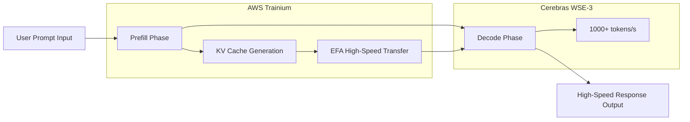

### Title
Cerebras×OpenAI: GPU独占からの脱却とAIインフラ多様化の現実

### Summary
OpenAIがCerebrasのWSE-3ウェーハスケールチップを採用し、毎秒1,000トークン超えの超高速推論を実現。100億ドル規模の契約はNVIDIA独占体制への挑戦であり、AIインフラの競争地図を塗り替える歴史的転換点となっている。

### Body

The early part of 2026 will likely be remembered as a turning point in the history of AI infrastructure. OpenAI has signed a contract exceeding $10 billion with Cerebras, marking the first large-scale deployment of inference accelerators other than NVIDIA GPUs in a production environment. The symbol of this is "GPT-5.3-Codex-Spark"—a coding-specific model operating at speeds exceeding 1,000 tokens per second.

This move is not merely a change in procurement source. It signifies the introduction of fundamental competition into the stronghold of NVIDIA, which has dominated the AI hardware market for many years. This article will delve into the technical details of the Cerebras WSE-3 architecture, the background of the agreement with OpenAI, and the impact of AI infrastructure diversification on the entire industry.

## Cerebras WSE-3: Innovation in Wafer-Scale Engines

### Fundamental Differences from Conventional GPU Architectures

Many of the GPUs that support modern AI inference employ an architecture where silicon wafers are cut into individual chips (diced) and then connected in a network for parallel processing. NVIDIA's H100 and B200 are typical examples, aiming for scale-out by connecting multiple chips via high-speed interconnects like NVLink.

Cerebras' chosen approach overturns this convention. The WSE (Wafer Scale Engine) operates the entire wafer as a single massive chip. Since physical dicing is not performed, there is fundamentally no overhead from inter-chip communication.

### Key Specifications of WSE-3

The WSE-3 is manufactured using TSMC's 5nm process and boasts the following specifications.

| Specification Item | WSE-3 | NVIDIA H100 | Magnification |
|:---------|:------|:------------|:---------|
| Number of Transistors | 4 trillion | Approximately 80 billion | Approximately 50x |
| Number of AI Cores | 900,000 cores | 17,408 cores | Approximately 52x |
| On-Chip SRAM | 44 GB | 50 MB | Approximately 880x |
| Memory Bandwidth | 21 PB/s | 3.35 TB/s | Approximately 7,000x |
| Chip Area | 46,255 mm² | 814 mm² | Approximately 57x |
| Peak Compute Performance | 125 PFLOPS | 3.958 PFLOPS | Approximately 32x |

Particularly noteworthy is the capacity of the on-chip SRAM. WSE-3's 44 GB is equivalent to 880 times that of the H100. In AI inference, memory bandwidth often becomes a bottleneck, and by placing a large amount of memory on-chip, access to off-chip memory can be minimized. This is the fundamental factor behind high-speed inference.

### Inference Speed Achieved by Wafer-Scale

All 900,000 cores of the WSE-3 are uniformly connected in a 2D mesh topology. This architecture dramatically speeds up the "decode" phase in token generation.

When a conventional GPU cluster performs AI inference, model weight data needs to be transferred between multiple GPUs. With WSE-3, all weights are deployed on the on-chip SRAM, eliminating the need for external memory access and achieving high throughput of several thousand tokens/sec.

## OpenAI and Cerebras' $10 Billion Contract

### Contract Overview

In January 2026, OpenAI and Cerebras signed a multi-year contract to provide 750 megawatts of compute resources until 2028. The total contract value exceeds $10 billion, a transformative deal for Cerebras' business scale.

According to Cerebras CEO Andrew Feldman, the negotiations began in August of the previous year when Cerebras demonstrated that OpenAI's open-source models could run more efficiently on its chips than on GPUs. This technology demo opened the door to the large-scale contract.

For OpenAI, this contract is central to its procurement diversification strategy. While maintaining existing orders with NVIDIA, AMD, and Broadcom, OpenAI has added $10 billion worth of inference-specific compute procurement with Cerebras. This reflects a strategic decision for "risk diversification of AI infrastructure."

### GPT-5.3-Codex-Spark: The First Mass Production Result

In February 2026, OpenAI unveiled "GPT-5.3-Codex-Spark" as the first outcome of this partnership. Designed as a lightweight version of GPT-5.3-Codex, this model is optimized for real-time coding and features:

*   **Inference Speed**: Over 1,000 tokens/sec (approximately 15x faster than GPT-5.3-Codex)
*   **Context Window**: 128k (text only)
*   **Supported Environments**: ChatGPT Pro, Codex app, CLI, VS Code extension
*   **Availability**: Research preview (phased rollout)

The figure of 1,000 tokens per second is difficult to grasp intuitively, but compared to GPT-5.3-Codex operating at 65-70 tokens/sec, it means the AI can complete and generate code faster than a developer can type. This is a speed that fundamentally changes the "interactivity" of coding.

### Why Coding is the First Use Case

It is strategically logical that OpenAI first applied Cerebras chips to coding (agent-based coding).

The productivity of coding assistants is highly dependent on response speed. When developers receive real-time completions while typing code, even a delay of a few hundred milliseconds can break their concentration. The importance of this speed further increases in agentic workflows where AI agents execute tests, fix bugs, and refactor code.

The ultra-fast inference provided by Cerebras' wafer-scale chips brings the most direct value to this domain, making it the chosen first use case.

## Structural Background Behind the Cracking of NVIDIA's Monopolistic System

### NVIDIA's Dominance in AI Infrastructure

For the past five years, NVIDIA has almost monopolized the AI training and inference market. GPUs centered around H100 and A100 have become the standard infrastructure for all major cloud providers and large AI labs, with the strong lock-in to the CUDA ecosystem making it difficult for competitors to enter.

This monopolistic position has also been a constraint for OpenAI. Dependence on a single supplier carries the following risks:

*   **Loss of Pricing Power**: NVIDIA holds a strong advantage in price setting.
*   **Supply Bottlenecks**: GPU shortages constrain the expansion of AI services.
*   **Single Point of Failure**: NVIDIA's manufacturing and supply issues directly become business risks.

### OpenAI's Diversification Strategy

OpenAI began seriously diversifying its procurement sources from 2025 onwards. While maintaining its existing contracts with NVIDIA, it has expanded orders with AMD, Broadcom, and Cerebras. The $10 billion contract with Cerebras is a strategic investment specifically for inference workloads.

What is noteworthy is that the adoption of Cerebras chips is specialized for "accelerating inference," rather than "general-purpose computing." Deloitte predicts that by 2026, inference will account for approximately two-thirds of all AI computation (around 50% as of 2025), and demand for inference accelerators will continue to grow.

### AWS and Cerebras Partnership: Ripple Effect into the Cloud

Approximately two months after the contract with OpenAI, on March 13, 2026, AWS and Cerebras announced a significant partnership. This involves the deployment of a "Disaggregated Inference Architecture" that introduces Cerebras CS-3 chips into AWS Bedrock.

Technically, it adopts a hybrid configuration where AWS's Trainium processor handles the prefill (prompt processing) phase, and the Cerebras CS-3 handles the decode (output generation) phase. This division of labor is said to achieve 5 times the token capacity with the same hardware footprint.

The concept of this "disaggregated inference" architecture leverages the different computational characteristics of each phase. By assigning the parallel processing-capable GPU to the prefill phase and the WSE-3 with its large on-chip memory to the decode phase, overall throughput is maximized.

## Cerebras' Corporate Strategy and IPO

### Growth to a \$2.2 Billion Valuation

While Cerebras had a valuation of $8 billion as of 2024, due to the OpenAI contract and the acquisition of several other major clients (including IBM and the U.S. Department of Energy), its valuation exceeded $22 billion was reported in early 2026. Estimated sales for 2025 surpassed $1 billion, and the company has matured from a mere research-stage startup to an infrastructure company with actual revenue.

### IPO Plans and Their Background

Cerebras filed for an IPO at the end of 2025 but was forced to withdraw it temporarily due to CFIUS (U.S. Committee on Foreign Investment in the United States) review concerning its capital relationship with Abu Dhabi's G42. Subsequently, G42 was removed from the investor list, CFIUS approval was obtained, and a re-application targeting Q2 2026 is planned.

The large contracts with OpenAI and AWS provide an excellent background as business achievements prior to the IPO.

## The Future Indicated by the Multipolarization of AI Infrastructure

### The Outbreak of the "Fastest Inference" Race

The release of GPT-5.3-Codex-Spark has introduced a new competitive axis in the AI industry. Not only the "intelligence" of the model but also its "speed" has emerged as a differentiating factor.

If Cerebras' claimed 20x speed advantage (compared to NVIDIA GPUs) is demonstrated, AI service providers will enter an era of selecting hardware based on application.

*   **Tasks requiring high accuracy**: Conventional GPUs (NVIDIA H100/B200, etc.)
*   **Tasks requiring ultra-low latency**: Cerebras WSE-3
*   **Tasks prioritizing cost efficiency**: AMD MI300X, custom ASICs, etc.

### Impact on NVIDIA

While NVIDIA's market dominance is not being shaken, significant changes are occurring. In the inference market, NVIDIA is facing its first true competition with a powerful rival.

Particularly noteworthy is the movement to "build ecosystems" demonstrated by the combination of OpenAI, AWS, and Cerebras. Just as CUDA has long been the de facto reason for choosing GPUs, a new ecosystem specialized for inference is being formed.

### Transformation of Developer Experience

The changes brought about by ultra-fast inference go beyond mere improvements in performance metrics. Spotify has reported that as of December 2025, top-tier engineers "no longer write code" due to the proliferation of AI coding tools. Ultra-fast AI coding tools like Claude Code and GPT-5.3-Codex-Spark will further accelerate this transformation.

Inference speeds of 1,000 tokens per second can become a threshold that fundamentally changes the collaborative style between developers and AI. If real-time thought completion, immediate code reviews, and instantaneous debugging suggestions are provided without waiting times, software development productivity will increase exponentially.

## Conclusion

The partnership between Cerebras WSE-3 and OpenAI has brought three significant transitions to AI inference infrastructure.

First, as a technical transition, the wafer-scale architecture has established a new performance standard of "1,000 tokens per second." Second, as an industrial structural transition, the shift from NVIDIA's unipolar concentration to multipolarization has genuinely begun. Third, as a competitive axis transition, inference "speed," alongside model "intelligence," has been established as a key differentiation element.

The "disaggregated inference architecture" demonstrated by the partnership with AWS suggests further proliferation. If WSE-3 becomes accessible to general cloud users via Amazon Bedrock within 2026, high-speed inference will transform from a privilege of a few large labs into a standard component of AI services.

The walls of the ecosystem that NVIDIA has spent years building are high. However, when a $10 billion contract, a strategic partnership with AWS, and a demonstrated 15x speed advantage that developers can actually experience converge, the competitive landscape of AI infrastructure is undeniably being redrawn.

---

---

> This article was automatically generated by LLM. It may contain errors.
