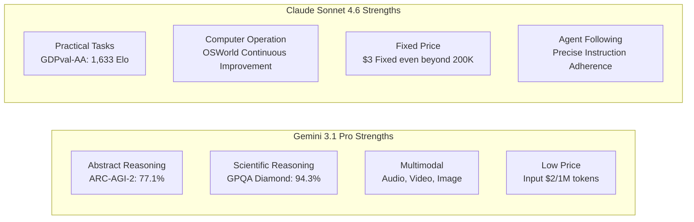

In the third week of February 2026, two highly anticipated models emerged almost simultaneously in the AI industry: Anthropic's **Claude Sonnet 4.6**, released on February 17th, and Google DeepMind's **Gemini 3.1 Pro**, unveiled on February 19th. Both models are positioned as "cutting-edge frontier models," boasting a 1 million token context window and significantly enhanced general reasoning capabilities.

The simultaneous release of these two models is no accident. As the competitive landscape of LLMs shifts from "peak performance on single tasks" to "agent utilization, long-context processing, and cost-efficiency," both companies are targeting the same audience: enterprise developers and AI agent builders. This article will organize the specifications, benchmark figures, and practical differences between the two models to provide developers with guidelines for making the optimal choice.

## Release Background: The Context of Competition

### Anthropic's Strategy

The release of Claude Sonnet 4.6, just 12 days after Claude Opus 4.6 on February 5th of the same year, highlights a remarkable pace. Anthropic has positioned its cost-effective "Sonnet" line as the default model for all users, deploying it across all tiers, including the free plan. Their strategy is to significantly enhance performance while maintaining the same input/output pricing as Sonnet 4.5: \$3/\$15 per 1 million tokens.

A noteworthy aspect is the evaluation on Claude Code. Internal data revealed that developers preferred Sonnet 4.6 70% of the time, and even when compared to Opus 4.6, Sonnet was chosen in 59% of cases. This positioning of "Sonnet surpassing Opus" in terms of price-performance ratio is effectively appealing to production environments sensitive to API usage costs.

Concurrently, Anthropic announced a partnership with Infosys (a major Indian IT company) on February 17th. This initiative aims to integrate Claude models into the Topaz AI platform to automate complex business workflows in sectors like banking, telecommunications, and manufacturing, signaling an acceleration in enterprise deployment.

### Google DeepMind's Strategy

Google DeepMind announced that Gemini 3.1 Pro achieved "the highest scores ever" on multiple benchmarks. Notably, its score of 77.1% on ARC-AGI-2 (Abstract Reasoning Challenge) represents a dramatic improvement, nearly doubling the performance of the previous generation, Gemini 3 Pro. Compared to its contemporaries, Claude Opus 4.6 at 68.8% and GPT-5.2 at 52.9%, Gemini shows a clear lead in ARC-AGI-2.

Furthermore, they made a strong play on pricing. For typical usage under 200K tokens, the price is set at \$2/\$12 per 1 million tokens (input/output), making it 33-35% cheaper than Sonnet 4.6. This clearly demonstrates their stance of asserting superiority in both "intelligence and cost efficiency."

Additionally, the 1 million token context window is available for immediate production use without a waitlist, a differentiating point. In contrast to Sonnet 4.6's 1 million token context being in beta and rolled out gradually, Gemini offers an advantage for developers who want to immediately start analyzing large codebases or multi-file repositories.

## Specification Comparison

Let's organize the basic specifications of both models:

| Item | Claude Sonnet 4.6 | Gemini 3.1 Pro |
|:-----|:-----------------|:--------------|
| Release Date | February 17, 2026 | February 19, 2026 |
| Context Length | 200K (1M in Beta) | 1M (Default) |
| Input Price (1M tokens) | \$3.00 | \$2.00 (≤200K) / \$4.00 (Exceeding) |
| Output Price (1M tokens) | \$15.00 | \$12.00 (≤200K) / \$18.00 (Exceeding) |
| Multimodal Support | Text, Image | Text, Image, Audio, Video |
| Max Output Tokens | 64K | 64K |
| Availability | API, Claude.ai, Claude Code | API, Gemini.google.com, Vertex AI |

A note on pricing: Gemini 3.1 Pro is cheaper for under 200K tokens, but the price jumps to \$4/\$18 when exceeding that. Sonnet 4.6 has a flat rate of \$3/\$15, making it easier to predict costs for workloads that heavily utilize long contexts. It is important to understand the distribution of context lengths during the cost estimation phase for batch processing.

## Detailed Benchmark Comparison

### Key Benchmark Figures

```
Benchmark Comparison (Public Data as of February 2026)

ARC-AGI-2 (Abstract Reasoning)
  Gemini 3.1 Pro  : 77.1%  ← Claude Opus 4.6 (68.8%), GPT-5.2 (52.9%)
  Claude Sonnet 4.6: 58.3%
  Difference: +18.8 pts (Gemini Advantage)

GPQA Diamond (Graduate-Level Science)
  Gemini 3.1 Pro  : 94.3%  ← Industry's Highest Score
  Claude Sonnet 4.6: 74.1%
  Difference: +20.2 pts (Gemini Advantage)

SWE-Bench Pro (Software Engineering)
  Gemini 3.1 Pro  : 54.2%
  Claude Sonnet 4.6: 42.7%
  Difference: +11.5 pts (Gemini Advantage)

SWE-Bench Verified (Gemini Official Benchmark)
  Gemini 3.1 Pro  : 80.6%

Terminal-Bench 2.0 (Terminal Operations)
  Gemini 3.1 Pro  : 68.5%

GDPval-AA Elo (Economic Value Tasks)
  Claude Sonnet 4.6: 1,633 Elo  ← Surpasses even Opus 4.6
  Gemini 3.1 Pro  : 1,317 Elo
  Difference: +316 pts (Sonnet Advantage)

MMMLU (Massive Multitask Language Understanding)
  Gemini 3.1 Pro  : 92.6%

Long Context Accuracy (at 128K tokens)
  Gemini 3.1 Pro  : 84.9%
```

The figures show that Gemini 3.1 Pro consistently outperforms in "pure reasoning benchmarks." On the other hand, GDPval-AA measures the Elo rating for "practical tasks that create economic value," such as business document creation, financial modeling, and academic research, where Sonnet 4.6 leads with an overwhelming margin. The "benchmark king" and "practical king" being different models clearly illustrates the disparity in their characteristics.

### How to Interpret Benchmarks

**GPQA Diamond (Graduate-Level Google-Proof Q&A)** is a set of graduate-level science problems designed to measure the ability to solve difficult questions in physics, chemistry, and biology. A score of 94.3% is the industry's highest, approaching the achievement of solving problems at the level of "biologists, chemists, and physicists."

**ARC-AGI-2** was designed by AI researchers to "measure true abstract reasoning that cannot be solved by memorization." It tests the ability to abstract entirely new rules from a few examples. The score of 77.1% is a remarkable level across the industry, achieved while Claude Opus 4.6 scored 68.8% and GPT-5.2 scored 52.9% in the same period.

In contrast, **GDPval-AA** is a comprehensive evaluation of "practical tasks that generate economic value," consisting of problem sets similar to actual work, such as report writing, financial analysis, and project planning. Sonnet 4.6's 1,633 Elo is considered to surpass even Opus 4.6, indicating Sonnet's outstanding practical utility in generating "usable output."

## Practical Differences

### Coding Assistance

While Gemini has a numerical advantage in coding tasks, developer subjective evaluations show different trends. Sonnet 4.6 is highly praised for "following nuanced instructions" and "stage-by-stage code review," demonstrating an advantage in specifying code review formats and adhering to custom coding conventions.

The difference in SWE-Bench scores is due to scenarios where agents autonomously manipulate files and perform large-scale refactoring. In pair-programming scenarios with fine-grained human instructions, Sonnet's responsiveness becomes a strength.

```python
# Example agent using Claude Sonnet 4.6
import anthropic

client = anthropic.Anthropic()

# Analyze the entire large codebase with 1 million token support
with open("large_codebase.txt", "r") as f:
    codebase_content = f.read()

message = client.messages.create(
    model="claude-sonnet-4-6-20260217",
    max_tokens=8192,
    messages=[
        {
            "role": "user",
            "content": (
                "Analyze the following codebase and list all security vulnerabilities:\n\n"
                + codebase_content
            )
        }
    ]
)
print(message.content[0].text)
```

### Long Context Processing and Multimodality

Gemini 3.1 Pro recorded an accuracy of 84.9% on long context benchmarks at 128K tokens, handling complex contexts including long PDFs, audio transcripts, and video transcripts. Native support for audio and video is a differentiating factor not currently present in Sonnet 4.6.

Sonnet 4.6 offers practical-level computer operation (Computer Use) functionality and has high affinity with Anthropic's ecosystem for agent workflows involving browser and GUI application control. Continuous improvements are reported in the OSWorld benchmark, demonstrating stable achievements in building automated pipelines.

### Overwhelming Difference in Knowledge Work

The GDPval-AA score difference (316 Elo points) cannot be overlooked. For tasks that "transform knowledge into practical outcomes," such as summarizing financial reports, creating meeting minutes, and generating analytical reports across multiple documents, Sonnet 4.6 has a clear advantage. This is likely a reflection of Anthropic's design philosophy, which has emphasized "depth of context understanding and agent planning."

## Differences in Architectural Design Philosophy

Analyzing the differences in the design philosophies of both models from publicly available information reveals several contrasts.

Gemini 3.1 Pro strongly embodies the nature of a "scalable general-purpose reasoning engine." Its architecture appears oriented towards uniformly processing all input modalities, including audio, video, and code repositories, aiming for peak performance on pure reasoning tasks like ARC-AGI-2. Google DeepMind's model cards detail safety evaluations based on the "frontier safety" framework, indicating a design approach intended for global-scale deployment.

Claude Sonnet 4.6 prioritizes the completion of a "reliable execution agent." The combination of computer operation, long-context reasoning, and agent planning suggests a feature selection consciously aware of suitability for semi-autonomous workflows involving human interaction. Anthropic's business strategy aligns with its accumulation of achievements in automating complex business workflows for banking, telecommunications, and manufacturing through its enterprise partnership with Infosys.



## 2026 LLM Trends Indicated by Competition

The simultaneous release of Claude Sonnet 4.6 and Gemini 3.1 Pro serves as a good observation point for the current state of LLM competition.

**"Normalization" of Long Context Processing**: Both models offer 1 million token contexts by default or in beta, making it no longer a differentiator but a prerequisite. With 1M tokens, one can input an entire project's codebase, related documentation, and past bug reports simultaneously.

**Acceleration of Agent Optimization**: Tool usage for agents, computer operation, and multi-step reasoning are common areas of focus for both. Aligned with the spread of MCP, competition is also centered on which model will become the standard agent runtime.

**Sophistication of Benchmark Competition**: The competition is shifting from single-problem accuracy to metrics measuring "unmemorizable reasoning" like ARC-AGI-2 and "economic value" like GDPval-AA. This is a shift from "accurate answers" to "usable deliverables."

**Continued Price Competition**: Gemini's \$2/1M input price is less than one-tenth of the GPT-4 class prices in 2023. While competition is accelerating the democratization of models, pressure on monetization is also increasing.

## Developer Guidelines for Usage

The choice between the two depends on three factors: "the nature of the task," "the distribution of context lengths," and "integration with existing stacks."

| Use Case | Recommended Model | Reason |
|:-----------|:---------|:----|
| Scientific Reasoning, Mathematical Proofs | Gemini 3.1 Pro | GPQA Diamond 94.3%, ARC-AGI-2 77.1% |
| Report Writing, Financial Analysis | Claude Sonnet 4.6 | Strongest for practical tasks with GDPval-AA 1,633 Elo |
| Large Codebase Analysis (Immediate 1M) | Gemini 3.1 Pro | 1M available for production use without waitlist |
| Computer Operation Agent | Claude Sonnet 4.6 | Computer Use, OSWorld Continuous Improvement |
| Multimodal including Audio/Video | Gemini 3.1 Pro | Native support (Sonnet does not support) |
| Google Workspace Integration | Gemini 3.1 Pro | Native integration |
| Frequent use of long prompts (>200K) | Claude Sonnet 4.6 | No cost fluctuation beyond 200K (flat \$3) |
| Primarily short prompts (<200K) | Gemini 3.1 Pro | 33% cheaper at \$2 input |

It's impossible to declare one as the "winner." That's the honest answer in today's LLM competition. Developers are required to evaluate based on specific use cases, considering task requirements, cost structures, and integration difficulties with existing stacks.

## References

| Title | Source | Date | URL |
|:---------|:-------|:-----|:----|
| Claude Sonnet 4.6 Release Announcement | Anthropic | 2026/02/17 | https://www.anthropic.com/news/claude-sonnet-4-6 |
| Gemini 3.1 Pro Release Announcement | Google Blog | 2026/02/19 | https://blog.google/innovation-and-ai/models-and-research/gemini-models/gemini-3-1-pro/ |
| Gemini 3.1 Pro Model Card | Google DeepMind | 2026/02/19 | https://deepmind.google/models/model-cards/gemini-3-1-pro/ |
| Deep Comparison of Gemini 3.1 Pro and Claude Sonnet 4.6 | Apiyi.com Blog | 2026/03 | https://help.apiyi.com/en/gemini-3-1-pro-vs-claude-sonnet-4-6-comparison-en.html |
| Gemini 3.1 Pro vs Sonnet 4.6 vs Opus 4.6 vs GPT-5.2 (2026) | AceCloud AI | 2026/03 | https://acecloud.ai/blog/gemini-3-1-pro-vs-sonnet-4-6-vs-opus-4-6-vs-gpt-5-2/ |
| Gemini 3.1 Pro Complete Guide 2026: Benchmarks, Pricing, API | NxCode | 2026/02 | https://www.nxcode.io/en/resources/news/gemini-3-1-pro-complete-guide-benchmarks-pricing-api-2026 |
| Gemini 3.1 Pro Leads Most Benchmarks But Trails Claude Opus 4.6 in Some Tasks | Trending Topics EU | 2026/02 | https://www.trendingtopics.eu/gemini-3-1-pro-leads-most-benchmarks-but-trails-claude-opus-4-6-in-some-tasks/ |
| Gemini 3.1 Pro vs Claude Sonnet 4.6: 2026 Comparison, Benchmarks | AI.cc | 2026/02 | https://www.ai.cc/blogs/gemini-3-1-pro-vs-claude-sonnet-4-6-2026-comparison-benchmarks/ |
| Infosys × Anthropic Enterprise AI Agent Partnership | TechCrunch | 2026/02/17 | https://techcrunch.com/2026/02/17/as-ai-jitters-rattle-it-stocks-infosys-partners-with-anthropic-to-build-enterprise-grade-ai-agents/ |
| AI Weekly Digest - 3rd Week of February 2026 | Synapse AI Digest | 2026/02/21 | https://armes.ai/blog/frontier-model-explosion-february-2026 |

---

> This article was automatically generated by LLM. It may contain errors.
