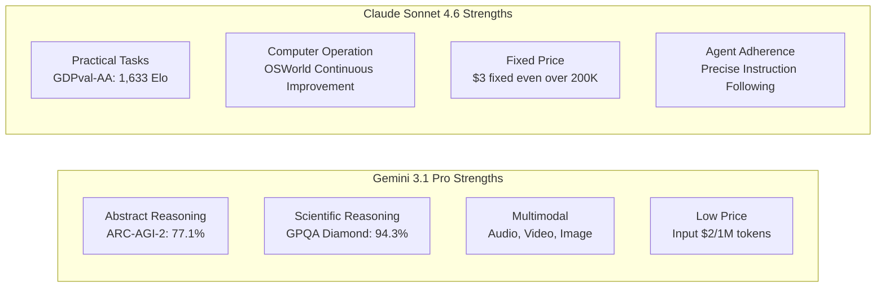

### Title
Claude Sonnet 4.6 vs. Gemini 3.1 Pro: The Forefront of LLM Model Competition

### Summary
Released almost simultaneously in February 2026, Claude Sonnet 4.6 and Gemini 3.1 Pro. This article thoroughly explains from a developer's perspective, covering benchmark comparisons like GPQA Diamond 94.3% to practical usage guidelines.

### Body

In the third week of February 2026, two notable models emerged in the AI industry almost simultaneously. **Claude Sonnet 4.6**, released by Anthropic on February 17th, and **Gemini 3.1 Pro**, unveiled by Google DeepMind on February 19th. Both models proclaim themselves as "state-of-the-art frontier models," highlighting their 1 million token context window support and significantly enhanced general reasoning capabilities.

The simultaneous release of these two models is no coincidence. As the competitive landscape of LLMs shifts from "peak performance on single tasks" to "agent utilization, long-context processing, and cost efficiency," both companies are targeting the same user base: enterprise developers and AI agent builders. This article will organize the differences in specifications, benchmark figures, and practical characteristics of both models to provide guidance for developers in making optimal choices.

## Release Background: The Competitive Context

### Anthropic's Strategy

The release of Claude Sonnet 4.6, just 12 days after Claude Opus 4.6 on February 5th of the same year, is striking in its speed. Anthropic has positioned the cost-effective "Sonnet" line as the default model for all users, rolling it out to all tiers, including the free plan. The strategy is to significantly improve performance while maintaining the same price as Sonnet 4.5: $3 for input and $15 for output (per million tokens).

What's noteworthy is the evaluation on Claude Code. Internal data revealed that developers preferred Sonnet 4.6 with 70% probability, and even compared to Opus 4.6, Sonnet was chosen in 59% of cases. This positioning of "Sonnet surpassing Opus" in terms of price-performance ratio effectively appeals to production environments sensitive to API usage costs.

Around the same time, Anthropic also announced a partnership with Infosys (a major Indian IT company) on February 17th. This initiative aims to integrate Claude models into the Topaz AI platform to achieve complex business workflow automation in sectors such as banking, telecommunications, and manufacturing, signaling an acceleration in enterprise deployment.

### Google DeepMind's Strategy

Google DeepMind announced that Gemini 3.1 Pro achieved "the highest scores ever" on multiple benchmarks. Notably, its 77.1% on ARC-AGI-2 (Abstract Reasoning Benchmark) represents a leapfrog improvement, approximately double that of the previous generation Gemini 3 Pro. Compared to its contemporary competitors, Claude Opus 4.6 at 68.8% and GPT-5.2 at 52.9%, Gemini shows a clear lead on ARC-AGI-2.

Furthermore, Google made a competitive move on pricing. For typical usage under 200K tokens, it's priced at $2 for input and $12 for output (per million tokens), set 33-35% cheaper than Sonnet 4.6. The stance of claiming superiority in both "intelligence × cost efficiency" is evident.

Additionally, the immediate availability of the 1 million token context window in production environments without a waitlist is a differentiating point. In contrast to Sonnet 4.6's 1 million token context window being in beta and provided in stages, Gemini offers an advantage for developers eager to start analyzing large codebases or multi-file repositories immediately.

## Specification Comparison

Here's a summary of the basic specifications for both models.

| Item              | Claude Sonnet 4.6       | Gemini 3.1 Pro          |
|:------------------|:------------------------|:------------------------|
| Release Date      | February 17, 2026       | February 19, 2026       |
| Context Length    | 200K (1M in beta)       | 1M (default)            |
| Input Price (1M tokens) | $3.00                   | $2.00 (≤200K) / $4.00 (exceeding) |
| Output Price (1M tokens)| $15.00                  | $12.00 (≤200K) / $18.00 (exceeding) |
| Multimodal Support | Text, Image             | Text, Image, Audio, Video |
| Max Output Tokens | 64K                     | 64K                     |
| Availability      | API, Claude.ai, Claude Code | API, Gemini.google.com, Vertex AI |

A note on pricing: Gemini 3.1 Pro is cheaper for under 200K tokens, but jumps to $4/$18 when exceeding this limit. Sonnet 4.6 has a uniform price of $3/$15 without fluctuations, so in workloads that heavily utilize long contexts, Sonnet may be more predictable in cost. It's important to understand the distribution of context lengths during the cost estimation phase for batch processing.

## Detailed Benchmark Comparison

### Major Benchmark Figures

```
Benchmark Comparison (Public Data as of February 2026)

ARC-AGI-2 (Abstract Reasoning)
  Gemini 3.1 Pro  : 77.1%  ← Claude Opus 4.6 (68.8%), GPT-5.2 (52.9%)
  Claude Sonnet 4.6: 58.3%
  Difference: +18.8 pts (Gemini Advantage)

GPQA Diamond (Graduate-Level Science)
  Gemini 3.1 Pro  : 94.3%  ← Industry's Highest Score
  Claude Sonnet 4.6: 74.1%
  Difference: +20.2 pts (Gemini Advantage)

SWE-Bench Pro (Software Engineering)
  Gemini 3.1 Pro  : 54.2%
  Claude Sonnet 4.6: 42.7%
  Difference: +11.5 pts (Gemini Advantage)

SWE-Bench Verified (Gemini Official Benchmark)
  Gemini 3.1 Pro  : 80.6%

Terminal-Bench 2.0 (Terminal Operation)
  Gemini 3.1 Pro  : 68.5%

GDPval-AA Elo (Economic Value Tasks)
  Claude Sonnet 4.6: 1,633 Elo  ← Level surpassing even Opus 4.6
  Gemini 3.1 Pro  : 1,317 Elo
  Difference: +316 pts (Sonnet Advantage)

MMMLU (Multilingual Understanding)
  Gemini 3.1 Pro  : 92.6%

Long Context Accuracy (at 128K tokens)
  Gemini 3.1 Pro  : 84.9%
```

The figures show that Gemini 3.1 Pro consistently outperforms in pure "reasoning benchmarks." On the other hand, GDPval-AA measures the Elo rating for "real-world tasks that generate economic value," such as business document creation, financial modeling, and academic research. Here, Sonnet 4.6 holds a significant lead. The emergence of a "benchmark king" and a "practical tasks king" highlights the distinct characteristics of both models.

### Reading the Benchmarks

**GPQA Diamond (Graduate-Level Google-Proof Q&A)** is a set of graduate-level science and engineering problems designed to measure the ability to solve difficult questions in physics, chemistry, and biology. A score of 94.3% is the industry's highest, approaching the achievement of solving problems at the same level as biologists, chemists, and physicists.

**ARC-AGI-2** is a benchmark designed by AI researchers to "measure true abstract reasoning that cannot be solved by memorization." It assesses the ability to abstract entirely new rules from a few examples. The 77.1% achieved here is a remarkable level across the industry, surpassing Claude Opus 4.6 at 68.8% and GPT-5.2 at 52.9% at the same time.

In contrast, **GDPval-AA** is a comprehensive evaluation of "real-world tasks that generate economic value," composed of problems closely resembling actual work, such as report writing, financial analysis, and project planning. Sonnet 4.6's 1,633 Elo is considered a level that even surpasses Opus 4.6, indicating Sonnet's prominence in practical utility for generating "usable output."

## Practical Characteristic Differences

### Coding Assistance

While Gemini has the numerical advantage in coding tasks, developer subjective evaluations show different trends. Sonnet 4.6 is highly regarded for its "adherence to nuanced instructions" and "step-by-step code review," holding an advantage in specifying code review formats and adapting to custom coding conventions.

The difference in SWE-Bench scores stems from scenarios involving agents autonomously manipulating files and performing large-scale refactoring. For pair programming use cases where humans provide detailed instructions, Sonnet's ability to follow precisely becomes a strength.

```python
# Example of an agent using Claude Sonnet 4.6
import anthropic

client = anthropic.Anthropic()

# Analyze the entire large codebase with 1 million token support
with open("large_codebase.txt", "r") as f:
    codebase_content = f.read()

message = client.messages.create(
    model="claude-sonnet-4-6-20260217",
    max_tokens=8192,
    messages=[
        {
            "role": "user",
            "content": (
                "Analyze the following codebase and list security vulnerabilities:\n\n"
                + codebase_content
            )
        }
    ]
)
print(message.content[0].text)
```

### Long Context Processing and Multimodality

Gemini 3.1 Pro achieved an accuracy of 84.9% on its long context benchmark at 128K tokens, capable of processing complex contexts including long PDFs, audio transcriptions, and video transcripts. Native support for audio and video is a differentiating factor not present in Sonnet 4.6 at this time.

Sonnet 4.6 offers "Computer Use" functionality at a practical level, showing high compatibility within the Anthropic ecosystem for agent workflows involving browser and GUI application manipulation. Continuous improvements are also reported on the OSWorld benchmark, demonstrating stable performance in building automated pipelines.

### Overwhelming Difference in Knowledge Work

The difference in GDPval-AA scores (316 Elo points) is significant. In tasks that "organize knowledge and convert it into practical outcomes," such as summarizing financial reports, creating meeting minutes, and generating analytical reports that cross-reference multiple documents, Sonnet 4.6 has a clear advantage. This is likely a reflection of Anthropic's design philosophy, which emphasizes "deep contextual understanding and agent planning."

## Differences in Architectural Design Philosophy

Reading between the lines of the publicly available information reveals several contrasts in the design philosophies of both models.

Gemini 3.1 Pro has a strong character as a "scalable general-purpose reasoning engine." Its architecture seems geared towards uniformly processing all input modalities, including audio, video, and code repositories, and aiming for peak performance on pure reasoning tasks like ARC-AGI-2. Google DeepMind's model card details safety evaluations based on its "frontier safety" framework, indicating a design posture geared towards global-scale deployment.

Claude Sonnet 4.6 prioritizes the completeness of a "reliable execution agent." The combination of computer use, long-context reasoning, and agent planning suggests a functional choice intended for compatibility with semi-autonomous workflows involving human intervention. Anthropic's business strategy aligns with accumulating expertise in complex enterprise workflow automation in banking, telecommunications, and manufacturing through its enterprise partnership with Infosys.



## 2026 LLM Trends Indicated by Competition

The simultaneous launch of Claude Sonnet 4.6 and Gemini 3.1 Pro serves as a good observation point for the current state of LLM competition.

**Long Context Processing as a "Prerequisite"**: Both models offer 1 million token context as default or in beta, meaning it's becoming less of a differentiator and more of a prerequisite. With 1M tokens, one can input an entire project's codebase, related documentation, and past bug reports at once.

**Accelerated Optimization for Agents**: Tool use for agents, computer operation, and multi-step reasoning are common areas of focus for both. Aligned with the proliferation of MCPs, which model will become the standard as an agent runtime is also a competitive axis.

**Advancement of Benchmark Competition**: There's a shift from single-problem accuracy to metrics that measure "unmemorizable reasoning" like ARC-AGI-2 and "economic value" like GDPval-AA. This is a move from "accurate answers" to "usable deliverables."

**Continued Price Competition**: Gemini's input price of $2/1M tokens is less than one-tenth of the GPT-4 class prices in 2023. While competition is accelerating the democratization of models, it also increases pressure on monetization.

## Developer's Usage Guidelines

The choice between them depends on "task nature," "context length distribution," and "integration with existing stacks."

| Use Case                          | Recommended Model     | Reason                                                                  |
|:----------------------------------|:----------------------|:------------------------------------------------------------------------|
| Scientific Reasoning, Mathematical Proof | Gemini 3.1 Pro        | GPQA Diamond 94.3%, ARC-AGI-2 77.1%                                     |
| Report Writing, Financial Analysis | Claude Sonnet 4.6     | Strongest for practical tasks with GDPval-AA 1,633 Elo                  |
| Large Codebase Analysis (Instant 1M) | Gemini 3.1 Pro        | 1M available for production use without waitlist                        |
| Computer Operation Agent          | Claude Sonnet 4.6     | Computer Use, OSWorld continuous improvement                            |
| Multimodal Including Audio/Video  | Gemini 3.1 Pro        | Native support (Sonnet 4.6 does not support)                            |
| Google Workspace Integration      | Gemini 3.1 Pro        | Native integration                                                      |
| Frequent use of long prompts (>200K) | Claude Sonnet 4.6     | No cost fluctuation above 200K (fixed $3)                               |
| Primarily short prompts (≤200K)  | Gemini 3.1 Pro        | 33% cheaper at $2 input                                                 |

It's impossible to declare one a definitive "winner." That is the honest answer to the current LLM competition. Developers are required to evaluate based on specific use cases, considering task requirements, cost structures, and integration difficulties with existing stacks.

## References

| Title                                                                     | Source          | Date         | URL                                                                                                                   |
|:--------------------------------------------------------------------------|:----------------|:-------------|:----------------------------------------------------------------------------------------------------------------------|
| Claude Sonnet 4.6 Release Announcement                                    | Anthropic       | 2026/02/17   | https://www.anthropic.com/news/claude-sonnet-4-6                                                                      |
| Gemini 3.1 Pro Release Announcement                                       | Google Blog     | 2026/02/19   | https://blog.google/innovation-and-ai/models-and-research/gemini-models/gemini-3-1-pro/                               |
| Gemini 3.1 Pro Model Card                                                 | Google DeepMind | 2026/02/19   | https://deepmind.google/models/model-cards/gemini-3-1-pro/                                                            |
| Deep Comparison of Gemini 3.1 Pro and Claude Sonnet 4.6                     | Apiyi.com Blog  | 2026/03      | https://help.apiyi.com/en/gemini-3-1-pro-vs-claude-sonnet-4-6-comparison-en.html                                        |
| Gemini 3.1 Pro vs Sonnet 4.6 vs Opus 4.6 vs GPT-5.2 (2026)                    | AceCloud AI     | 2026/03      | https://acecloud.ai/blog/gemini-3-1-pro-vs-sonnet-4-6-vs-opus-4-6-vs-gpt-5-2/                                          |
| Gemini 3.1 Pro Complete Guide 2026: Benchmarks, Pricing, API                | NxCode          | 2026/02      | https://www.nxcode.io/en/resources/news/gemini-3-1-pro-complete-guide-benchmarks-pricing-api-2026                      |
| Gemini 3.1 Pro Leads Most Benchmarks But Trails Claude Opus 4.6 in Some Tasks | Trending Topics EU| 2026/02      | https://www.trendingtopics.eu/gemini-3-1-pro-leads-most-benchmarks-but-trails-claude-opus-4-6-in-some-tasks/            |
| Gemini 3.1 Pro vs Claude Sonnet 4.6: 2026 Comparison, Benchmarks             | AI.cc           | 2026/02      | https://www.ai.cc/blogs/gemini-3-1-pro-vs-claude-sonnet-4-6-2026-comparison-benchmarks/                                |
| Infosys × Anthropic Enterprise AI Agent Partnership                         | TechCrunch      | 2026/02/17   | https://techcrunch.com/2026/02/17/as-ai-jitters-rattle-it-stocks-infosys-partners-with-anthropic-to-build-enterprise-grade-ai-agents/ |
| AI Weekly Digest February Week 3, 2026                                       | Synapse AI Digest | 2026/02/21   | https://armes.ai/blog/frontier-model-explosion-february-2026                                                          |

---

> This article was automatically generated by LLM. It may contain errors.
