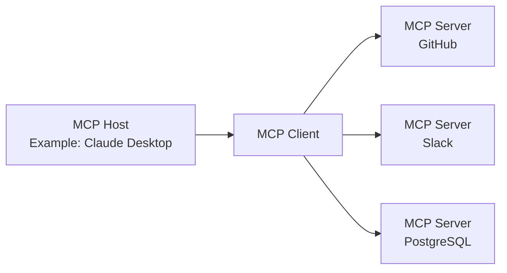

## Introduction

In November 2024, Anthropic announced the **Model Context Protocol (MCP)**, which has achieved dramatic adoption in just over a year as a new open standard for connecting AI agents with external tools and data sources. Figures like over 97 million SDK downloads per month and over 10,000 public MCP servers indicate that it is establishing itself not just as a technical specification, but as foundational infrastructure for the AI agent era.

This article comprehensively explains MCP, from its technical mechanisms and the adoption by OpenAI, Google, and Microsoft, to its pivotal transition under the Linux Foundation and the ongoing security discussions.

---

## MCP Solves the "N x M Problem"

### Information Silos in AI Systems

Before the advent of MCP, integrating AI applications with external data sources was severely inefficient. For instance, to connect Claude with Slack, GitHub, Google Drive, and a Postgres database, it was necessary to implement a unique connector for each data source.

Anthropic termed this the "**N x M problem**." If N is the number of data sources and M is the number of AI applications using them, then theoretically, N x M individual implementations are required. Simply using 10 tools with 5 AI apps would necessitate 50 custom implementations.

```
【Without MCP】
Claude  ─── Custom Implementation A ──→ GitHub
Claude  ─── Custom Implementation B ──→ Slack
GPT-4   ─── Custom Implementation C ──→ GitHub  （Similar to A）
GPT-4   ─── Custom Implementation D ──→ Slack   （Similar to B）

【With MCP】
Claude ─┐
GPT-4  ─┤── MCP Client ──→ MCP Server (GitHub)
Gemini ─┘                ──→ MCP Server (Slack)
```

MCP solves this problem with a "1:N" structure. Once implemented as an MCP server, it can be used by all MCP-compatible AI clients.

---

## MCP Technical Architecture

### Three-Layered Components

MCP employs a client-server architecture and consists of three roles:

| Role | Description |
|:-----|:-----|
| **MCP Host** | The AI application itself. Manages and orchestrates one or more MCP Clients. |
| **MCP Client** | Maintains the connection with MCP Servers, retrieves context, and provides it to the Host. |
| **MCP Server** | Provides access to external tools and data sources. |



### Protocol Foundation: JSON-RPC 2.0

The MCP messaging layer is based on JSON-RPC 2.0. Message types are classified into three categories:

- **Request**: A request that requires a response.
- **Response**: A reply to a request.
- **Notification**: A one-way notification that does not require a response.

### Transport Layer

MCP supports two primary transport methods:

**stdio (Standard Input/Output)**
Ideal for interacting with local resources. Communication occurs through simple input and output streams. Widely used for connections between local AI applications like Claude Desktop and local MCP servers.

**Streamable HTTP (formerly SSE)**
Enables streaming message transmission from server to client over HTTP using Server-Sent Events (SSE). Suitable for long-running tasks and incremental updates. In the 2025 specification update (version 2025-11-25), the transport name was changed from "SSE" to "Streamable HTTP," allowing for more flexible bidirectional communication.

### Three Primitives

Functions exposed by MCP servers to the outside world are defined by three types of primitives:

**Resources**
Provide read access to data sources. They are offered in a format that AI can reference, such as file systems, databases, or API responses.

**Tools**
Enable the execution of arbitrary code. Used when AI needs to create files, call APIs, or make changes to external systems. Tool execution involves side effects and thus requires appropriate permission management.

**Prompts**
Provide predefined prompt templates. Instead of vague instructions like "Create an issue for a bug report on GitHub," AI can be communicated with in a structured format containing necessary fields.

---

## Explosive Adoption: One Year After Public Release

### Ecosystem Growth by Numbers

At the time of MCP's public release in November 2024, there were only about 100 public MCP servers. However, the growth rate was astonishing.

| Period | Number of Public Servers | Monthly SDK Downloads |
|:-----|:---------------|:----------------------|
| November 2024 (Release) | Approx. 100 | — |
| May 2025 | Over 4,000 | — |
| December 2025 | Over 10,000 | 97 million |

Simultaneously with the MCP release, Anthropic provided reference MCP servers for major enterprise systems such as GitHub, Slack, Google Drive, Git, PostgreSQL, and Puppeteer. This significantly lowered the barrier to entry for developers, leading to the rapid expansion of the ecosystem.

### Adoption by Major AI Companies

MCP quickly established itself as an industry standard.

**OpenAI (March 2025)**
OpenAI announced official MCP support for ChatGPT and its API. While the company had its own Function Calling feature for a long time, adopting the open standard MCP allowed it to integrate with the vast MCP ecosystem.

**Google (April 2025)**
MCP was integrated into the Gemini models. Access to MCP servers became available through Google AI Studio and Vertex AI, enabling Google's enterprise clients to connect their existing internal systems via Gemini.

**Microsoft (2025)**
Added MCP support to Copilot Studio and Azure OpenAI Service. MCP client functionality was also incorporated into Visual Studio Code, accelerating the integration of development workflows and AI.

---

## Donation to the Linux Foundation and Establishment of the Agentic AI Foundation

### A Pivotal Turning Point

In December 2025, Anthropic announced one of its most significant decisions: donating MCP to a newly established fund under the Linux Foundation, the "**Agentic AI Foundation (AAIF)**."

This decision was more than just a governance change. Anthropic chose to position MCP not as a "differentiating element for its own products," but as open infrastructure for the AI agent era.

### Overview of the Agentic AI Foundation (AAIF)

AAIF was established as a Directed Fund under the Linux Foundation.

**Co-Founding Members**
- Anthropic (MCP Donation)
- Block (goose Donation)
- OpenAI (AGENTS.md Donation)

**Platinum Members (Governance Participation)**
Amazon Web Services, Anthropic, Block, Bloomberg, Cloudflare, Google, Microsoft, OpenAI

**Founding Projects**
- Model Context Protocol (MCP) — Provided by Anthropic
- goose — An AI agent framework provided by Block
- AGENTS.md — An agent specification description standard provided by OpenAI

By joining the Linux Foundation, MCP's governance transitioned to a vendor-neutral, community-driven model. This is a similar strategy to how Kubernetes (container orchestration) and NodeJS became industry standards under the Linux Foundation.

---

## MCP vs. REST API Comparison

### Differences in Design Philosophy

MCP and REST API are not competitors but complementary. Understanding their design differences is crucial.

| Aspect | REST API | MCP |
|:-----|:---------|:----|
| Target Client | Traditional Software | LLMs / AI Agents |
| Session | Stateless | Stateful |
| Discovery | Described separately via OpenAPI, etc. | Dynamically exposed by the server |
| Multi-step | Authentication for each request | Efficiency through session maintenance |
| Streaming | Requires WebSocket, etc. | Native support via SSE/Streamable HTTP |

### Why MCP is Suitable for AI Agents

When considering scenarios where AI agents call multiple tools consecutively, the superiority of MCP's design becomes clear.

```
【Code Review Task by AI Agent】
1. Get PR diff from GitHub → MCP Tools
2. Read relevant code files → MCP Resources
3. Get security check prompt → MCP Prompts
4. Post code review comments to GitHub → MCP Tools
```

Using REST APIs, each step requires appending authentication headers and re-sending context. In MCP, sessions are maintained, allowing for efficient execution of multi-step tasks with minimized authentication overhead.

Furthermore, AI agents may not know which tools are available beforehand. MCP servers dynamically expose the Tools, Resources, and Prompts they offer, allowing agents to perform discovery at runtime and select/use appropriate tools.

---

## Security Challenges

### MCP Security Risks

In response to its rapid adoption with 97 million monthly downloads, security researchers have expressed concerns about the swift proliferation of MCP.
The main security risks are as follows:

**Token Leakage Risk**
MCP adopts OAuth 2.1 as its authorization framework. However, if access tokens cached or logged by clients or servers are leaked, attackers can access protected resources as legitimate requests.

**Confused Deputy Attack**
When an MCP server acts as an OAuth proxy, inadequate verification of authorization context can allow attackers to execute operations on the server using another user's credentials.

**Management of Dynamic Client Registration**
Using OAuth's dynamic client registration, MCP clients can dynamically add OAuth client configurations to the server. However, there are unresolved management issues because the RFCs for managing and deleting added client configurations are not widely supported.

### Response in the June 2025 Specification Update

Security enhancement was a major theme in the June 2025 update of the MCP specification.

- **Mandatory PKCE (Proof Key for Code Exchange)**: Implementation of PKCE, in accordance with Section 7.5.2 of OAuth 2.1, is now mandatory. This prevents authorization code interception and injection attacks.
- **Introduction of Resource Indicators (RFC 8707)**: To ensure tokens are valid only for the intended MCP server, including resource indicators in token requests has become mandatory. This prevents "token mis-redemption."
- **Prohibition of Token Passthrough**: It is explicitly stated that MCP servers must not accept tokens that are not explicitly issued for their own server.

---

## Current Ecosystem and Future Outlook

### Examples of Major MCP Servers

As of 2026, MCP servers are widely offered in the following categories:

**Development Tools**
- GitHub MCP Server (PR management, code review)
- Git MCP Server (local repository operations)
- VS Code Integrated MCP Server Suite

**Data & Infrastructure**
- PostgreSQL MCP Server
- SQLite MCP Server
- Cloudflare Workers MCP Server

**Communication & Productivity**
- Slack MCP Server
- Google Drive MCP Server
- Notion MCP Server

**AI & Research**
- Brave Search MCP Server
- Puppeteer MCP Server (web scraping)
- Fetch MCP Server

### Paving the Way for Autonomous Agents

The fundamental problem MCP aims to solve is creating an environment where AI agents can "master their tools." As the transition from a phase of single AI models operating independently to multi-agent systems where multiple AI agents share and collaborate on tools accelerates, the importance of MCP as a common language is growing.

With the establishment of AAIF, MCP has shed its status as a single Anthropic product and embarked on a path to evolve into industry-wide infrastructure. Just as Kubernetes and NodeJS have become industry standards under the Linux Foundation, whether MCP can become the "TCP/IP" of the AI agent era will become clear in the next two to three years.

---

## Summary

MCP represents a significant technological shift in three key areas:

**1. Solving the N x M Problem**
Standardizing the connection between AI systems and external tools has dramatically reduced development costs.

**2. Building Industry Consensus**
While originating as a protocol from Anthropic, it has succeeded in forming an industry standard, including competitors, with OpenAI, Google, and Microsoft participating as Platinum members of AAIF.

**3. Neutralizing Governance**
Through its donation to the Linux Foundation, an open governance structure free from dependence on specific vendors has been established.

As AI agents become more integrated into practical work from 2026 onwards, MCP will continue to function as its foundational infrastructure. For developers, understanding MCP's mechanisms and utilizing appropriate MCP servers is becoming the starting point for building AI-integrated systems.

---

## References

| Title | Source | Date | URL |
|:-----|:-------|:-----|:----|
| Introducing the Model Context Protocol | Anthropic | 2024-11-25 | https://www.anthropic.com/news/model-context-protocol |
| Donating the Model Context Protocol and establishing the Agentic AI Foundation | Anthropic | 2025-12-09 | https://www.anthropic.com/news/donating-the-model-context-protocol-and-establishing-of-the-agentic-ai-foundation |
| MCP joins the Agentic AI Foundation | MCP Blog | 2025-12-09 | http://blog.modelcontextprotocol.io/posts/2025-12-09-mcp-joins-agentic-ai-foundation/ |
| Linux Foundation Announces the Formation of the Agentic AI Foundation (AAIF) | Linux Foundation | 2025-12-09 | https://www.linuxfoundation.org/press/linux-foundation-announces-the-formation-of-the-agentic-ai-foundation |
| Model Context Protocol Specification 2025-11-25 | modelcontextprotocol.io | 2025-11-25 | https://modelcontextprotocol.io/specification/2025-11-25 |
| MCP joins the Linux Foundation: What this means for developers | GitHub Blog | 2025-12-09 | https://github.blog/open-source/maintainers/mcp-joins-the-linux-foundation-what-this-means-for-developers-building-the-next-era-of-ai-tools-and-agents/ |
| Model Context Protocol (MCP): Understanding security risks and controls | Red Hat | 2025 | https://www.redhat.com/en/blog/model-context-protocol-mcp-understanding-security-risks-and-controls |
| MCP Specs Update — All About Auth | Auth0 | 2025-06 | https://auth0.com/blog/mcp-specs-update-all-about-auth/ |
| Why the Model Context Protocol Won | The New Stack | 2025 | https://thenewstack.io/why-the-model-context-protocol-won/ |
| A Year of MCP: From Internal Experiment to Industry Standard | Pento | 2025-12 | https://www.pento.ai/blog/a-year-of-mcp-2025-review |
| Model Context Protocol - Wikipedia | Wikipedia | 2026 | https://en.wikipedia.org/wiki/Model_Context_Protocol |

---

> This article was automatically generated by LLM. It may contain errors.
