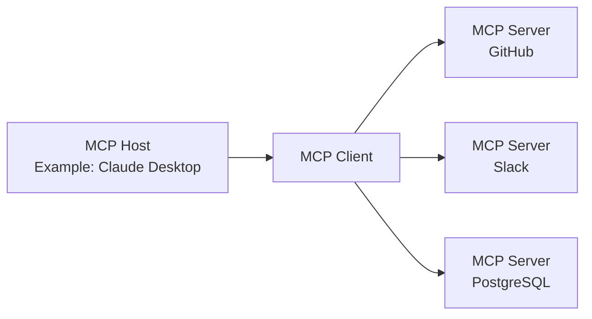

### Introduction

In November 2024, Anthropic announced the **Model Context Protocol (MCP)**, a new open standard for connecting AI agents with external tools and data sources. In just over a year, it has achieved dramatic adoption. With over 97 million SDK downloads per month and over 10,000 public MCP servers, it has transcended its role as a mere technical specification to establish itself as the foundational infrastructure of the AI agent era.

This article provides a comprehensive explanation of MCP, covering its technical mechanisms, the background of adoption by OpenAI, Google, and Microsoft, the pivotal transition to being under the Linux Foundation, and the security challenges that continue to be debated.

---

## MCP Solves the "N x M Problem"

### Information Silos in AI Systems

Before the advent of MCP, the integration of AI applications with external data sources suffered from severe inefficiencies. For example, connecting Claude to Slack, GitHub, Google Drive, and a Postgres database individually would require implementing custom connectors for each data source.

Anthropic termed this the "**N x M problem**." If N is the number of data sources and M is the number of AI applications utilizing them, then theoretically N x M individual implementations would be necessary. Simply using 10 types of tools with 5 AI applications would necessitate 50 custom implementations.

```
[Without MCP]
Claude  ─── Custom Implementation A ──→ GitHub
Claude  ─── Custom Implementation B ──→ Slack
GPT-4   ─── Custom Implementation C ──→ GitHub  (Nearly identical to A)
GPT-4   ─── Custom Implementation D ──→ Slack   (Nearly identical to B)

[With MCP]
Claude ─┐
GPT-4  ─┤── MCP Client ──→ MCP Server (GitHub)
Gemini ─┘                ──→ MCP Server (Slack)
```

MCP solves this problem with a "1:N" structure. Once implemented as an MCP server, it can be utilized by all MCP-compatible AI clients.

---

## MCP Technical Architecture

### Three-Tiered Components

MCP employs a client-server architecture, consisting of three roles:

| Role         | Description                                                         |
|--------------|---------------------------------------------------------------------|
| **MCP Host** | The AI application itself. Manages and coordinates one or more MCP Clients. |
| **MCP Client** | Maintains connection with MCP Server, retrieves context, and provides it to the Host. |
| **MCP Server** | A program that provides access to external tools and data sources. |



### Protocol Foundation: JSON-RPC 2.0

The messaging layer of MCP is based on JSON-RPC 2.0. Message types are categorized into three types:

- **Request**: A request requiring a response.
- **Response**: A reply to a request.
- **Notification**: A one-way notification that does not require a response.

### Transport Layer

MCP supports two primary transport methods:

**stdio (Standard Input/Output)**
Ideal for integration with local resources. Communication occurs via simple input and output streams. Widely used for connections between local AI applications like Claude Desktop and local MCP servers.

**Streamable HTTP (formerly SSE)**
Enables streaming message transmission from server to client over HTTP using Server-Sent Events (SSE). Suitable for long-running tasks and incremental updates. In the 2025 specification update (version 2025-11-25), the transport name was changed from "SSE" to "Streamable HTTP," allowing for more flexible bidirectional communication.

### Three Primitives

The functions exposed by MCP servers to the outside are defined by three types of primitives:

**Resources**
Provide read access to data sources. Data such as file systems, databases, and API responses are provided in a format that AI can reference.

**Tools**
Enable the execution of arbitrary code. Used when AI needs to create files, call APIs, or make changes to external systems. Tool execution involves side effects and requires appropriate permission management.

**Prompts**
Provide predefined prompt templates. This allows for structured communication to the AI, rather than ambiguous instructions like "Create a bug report issue on GitHub." The necessary fields can be conveyed in a structured manner.

---

## Explosive Growth: One Year After Public Release

### Ecosystem Growth by the Numbers

At the time of MCP's public release in November 2024, there were only about 100 public MCP servers. However, the growth rate was astonishing.

| Period                 | Number of Public Servers | Monthly SDK Downloads | 
|------------------------|--------------------------|-----------------------|
| November 2024 (Release) | Approx. 100              | —                     |
| May 2025               | Over 4,000               | —                     |
| December 2025          | Over 10,000              | 97 million            |

Concurrent with the release of MCP, Anthropic provided reference MCP servers for major enterprise systems such as GitHub, Slack, Google Drive, Git, PostgreSQL, and Puppeteer. This significantly lowered the barrier to entry for developers and led to the rapid expansion of the ecosystem.

### Adoption by Major AI Companies

MCP quickly established itself as an industry standard.

**OpenAI (March 2025)**
OpenAI announced official MCP support for ChatGPT and its API. While the company had long possessed its own Function Calling feature, adopting the open standard MCP allowed it to integrate with the vast MCP ecosystem.

**Google (April 2025)**
MCP was integrated into the Gemini models. Access to MCP servers became available via Google AI Studio and Vertex AI, enabling Google's enterprise customers to connect Gemini to their existing internal systems.

**Microsoft (2025)**
Added MCP support in Copilot Studio and Azure OpenAI Service. MCP client functionality was also incorporated into Visual Studio Code, accelerating the integration of development workflows and AI.

---

## Donation to Linux Foundation and Establishment of Agentic AI Foundation

### A Pivotal Turning Point

In December 2025, Anthropic announced one of its most significant decisions: donating MCP to a newly established fund under the Linux Foundation, the **Agentic AI Foundation (AAIF)**.

This decision was not merely a change in governance. Anthropic chose to position MCP not as a "differentiating element of its own product," but as open infrastructure for the AI agent era.

### Overview of Agentic AI Foundation (AAIF)

AAIF was established as a Directed Fund under the Linux Foundation.

**Co-Founding Members**
- Anthropic (MCP Donation)
- Block (goose Donation)
- OpenAI (AGENTS.md Donation)

**Platinum Members (Governance Participants)**
Amazon Web Services, Anthropic, Block, Bloomberg, Cloudflare, Google, Microsoft, OpenAI

**Founding Projects**
- Model Context Protocol (MCP) — Provided by Anthropic
- goose — An AI agent framework provided by Block
- AGENTS.md — An agent specification description standard provided by OpenAI

By joining the Linux Foundation, MCP's governance shifted to a vendor-neutral, community-driven model. This is a similar strategy to how Kubernetes (container orchestration) and NodeJS became industry standards under the Linux Foundation.

---

## MCP vs. REST API Comparison

### Differences in Design Philosophy

MCP and REST API are not competitors but complementary. Understanding their differing design philosophies is crucial.

| Aspect           | REST API                                   | MCP                                                    |
|------------------|--------------------------------------------|--------------------------------------------------------|
| Intended Client  | Traditional Software                       | LLMs / AI Agents                                       |
| Session          | Stateless                                  | Stateful                                               |
| Discovery        | Described separately (e.g., OpenAPI)       | Dynamically exposed by the server                      |
| Multi-step       | Authentication per request                 | Efficiency via session maintenance                     |
| Streaming        | Requires separate mechanisms (e.g., WebSocket) | Native support via SSE/Streamable HTTP                 |

### Why MCP is Suitable for AI Agents

Considering scenarios where AI agents call multiple tools in sequence highlights the advantages of MCP's design.

```
[Code Review Task by AI Agent]
1. Get PR diff from GitHub → MCP Tools
2. Read relevant code files → MCP Resources
3. Get security check prompt → MCP Prompts
4. Post code review comments to GitHub → MCP Tools
```

Using REST APIs would require appending authentication headers and re-sending context for each step. With MCP, sessions are maintained, minimizing authentication overhead and enabling efficient execution of multi-step tasks.

Furthermore, AI agents may not know which tools are available beforehand. MCP servers dynamically expose the Tools, Resources, and Prompts they provide, allowing agents to perform discovery at runtime and select/use appropriate tools.

---

## Security Challenges

### MCP Security Risks

In response to the rapid adoption, evidenced by 97 million monthly downloads, security researchers have raised concerns about MCP's swift proliferation. The primary security risks include:

**Token Leakage Risk**
MCP uses OAuth 2.1 as its authorization framework. If access tokens cached or logged by clients or servers are leaked, attackers can access protected resources as legitimate requests.

**Confused Deputy Attack**
When an MCP server acts as an OAuth proxy, inadequate validation of authorization context can allow an attacker to execute operations on the server using another user's credentials.

**Management of Dynamic Client Registration**
Using OAuth's dynamic client registration, MCP clients can dynamically add OAuth client configurations to the server. However, the RFC widely lacks support for managing and deleting added client configurations, leaving unresolved management issues.

### Response in the June 2025 Specification Update

Security enhancement was a primary theme in the June 2025 MCP specification update.

- **Mandatory PKCE (Proof Key for Code Exchange)**: Following Section 7.5.2 of OAuth 2.1, PKCE implementation became mandatory. This prevents authorization code interception and injection attacks.
- **Introduction of Resource Indicators (RFC 8707)**: To ensure tokens are only valid for their intended MCP server, resource indicators were made mandatory in token requests. This prevents "token mis-redemption."
- **Prohibition of Token Passthrough**: It was explicitly stated that MCP servers must not accept tokens not explicitly issued for their own server.

---

## Current Ecosystem and Future Outlook

### Examples of Major MCP Servers

As of 2026, MCP servers are widely available in the following categories:

**Development Tools**
- GitHub MCP Server (PR management, code review)
- Git MCP Server (Local repository operations)
- VS Code integrated MCP server suite

**Data & Infrastructure**
- PostgreSQL MCP Server
- SQLite MCP Server
- Cloudflare Workers MCP Server

**Communication & Productivity**
- Slack MCP Server
- Google Drive MCP Server
- Notion MCP Server

**AI & Research**
- Brave Search MCP Server
- Puppeteer MCP Server (Web scraping)
- Fetch MCP Server

### Paving the Way for the Autonomous Agent Era

The fundamental problem MCP seeks to solve is to create an environment where AI agents can "master their tools." As the transition accelerates from a phase of single AI models operating independently to multi-agent systems where multiple AI agents share tools and cooperate, the importance of MCP as a common language is growing.

With the establishment of AAIF, MCP has moved beyond being an Anthropic product to embark on a path of evolution into industry-common infrastructure. Just as Kubernetes and NodeJS became industry standards under the Linux Foundation's umbrella, the answer to whether MCP can become the "TCP/IP" of the AI agent era will become clear in the next 2-3 years.

---

## Conclusion

MCP represents a significant technological shift in three key aspects:

**1. Solving the N x M Problem**
By standardizing the connection between AI systems and external tools, it has dramatically reduced development costs.

**2. Industry-Wide Consensus Building**
Although originating from Anthropic, the protocol has successfully established an industry standard that includes competitors, with OpenAI, Google, and Microsoft participating as AAIF Platinum Members.

**3. Neutralizing Governance**
Through its donation to the Linux Foundation, it has established an open governance structure that eliminates dependency on any single vendor.

As AI agents become integrated into practical applications from 2026 onwards, MCP will continue to function as their foundational infrastructure. For developers, understanding MCP's mechanisms and effectively utilizing appropriate MCP servers is becoming the starting point for building AI-integrated systems.

---

## References

| Title                                                                                               | Source            | Date       | URL                                                                                                                            |
|-----------------------------------------------------------------------------------------------------|-------------------|------------|--------------------------------------------------------------------------------------------------------------------------------|
| Introducing the Model Context Protocol                                                              | Anthropic         | 2024-11-25 | https://www.anthropic.com/news/model-context-protocol                                                                            |
| Donating the Model Context Protocol and establishing the Agentic AI Foundation                        | Anthropic         | 2025-12-09 | https://www.anthropic.com/news/donating-the-model-context-protocol-and-establishing-of-the-agentic-ai-foundation                  |
| MCP joins the Agentic AI Foundation                                                                 | MCP Blog          | 2025-12-09 | http://blog.modelcontextprotocol.io/posts/2025-12-09-mcp-joins-agentic-ai-foundation/                                         |
| Linux Foundation Announces the Formation of the Agentic AI Foundation (AAIF)                        | Linux Foundation  | 2025-12-09 | https://www.linuxfoundation.org/press/linux-foundation-announces-the-formation-of-the-agentic-ai-foundation                      |
| Model Context Protocol Specification 2025-11-25                                                       | modelcontextprotocol.io | 2025-11-25 | https://modelcontextprotocol.io/specification/2025-11-25                                                                       |
| MCP joins the Linux Foundation: What this means for developers                                      | GitHub Blog       | 2025-12-09 | https://github.blog/open-source/maintainers/mcp-joins-the-linux-foundation-what-this-means-for-developers-building-the-next-era-of-ai-tools-and-agents/ |
| Model Context Protocol (MCP): Understanding security risks and controls                               | Red Hat           | 2025       | https://www.redhat.com/en/blog/model-context-protocol-mcp-understanding-security-risks-and-controls                                 |
| MCP Specs Update — All About Auth                                                                   | Auth0             | 2025-06    | https://auth0.com/blog/mcp-specs-update-all-about-auth/                                                                          |
| Why the Model Context Protocol Won                                                                  | The New Stack     | 2025       | https://thenewstack.io/why-the-model-context-protocol-won/                                                                       |
| A Year of MCP: From Internal Experiment to Industry Standard                                        | Pento             | 2025-12    | https://www.pento.ai/blog/a-year-of-mcp-2025-review                                                                            |
| Model Context Protocol - Wikipedia                                                                  | Wikipedia         | 2026       | https://en.wikipedia.org/wiki/Model_Context_Protocol                                                                           |

---

> This article was automatically generated by LLM. It may contain errors.
