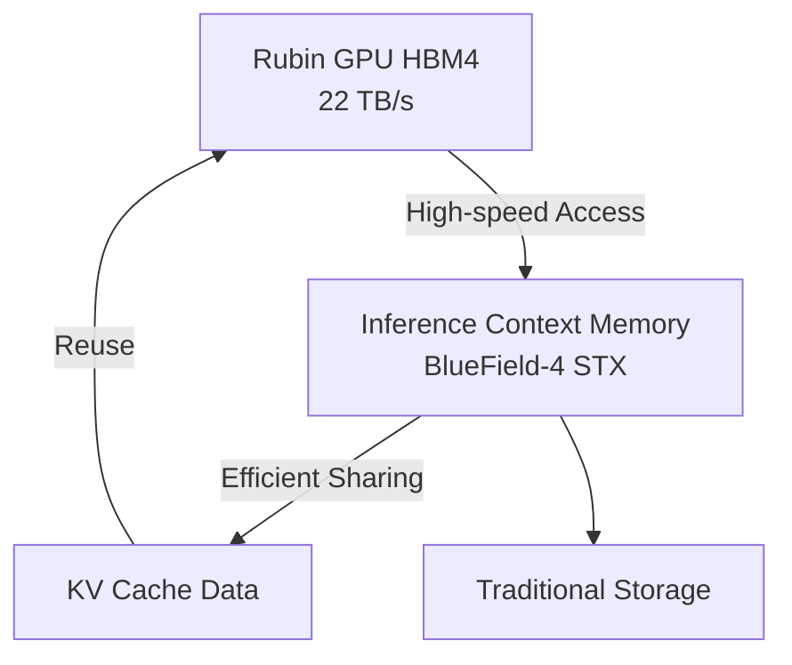
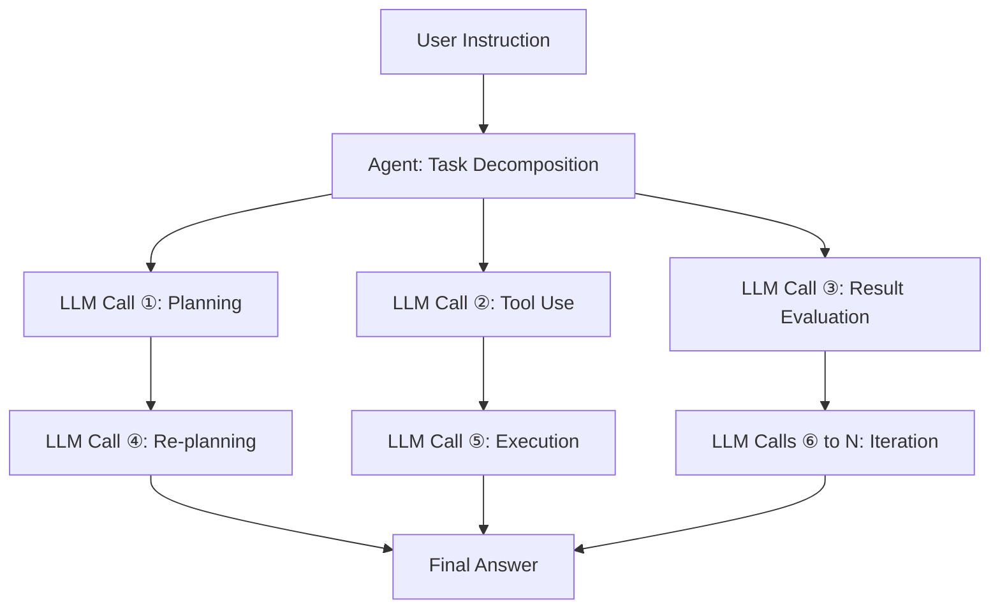

## Introduction: Why Inference Cost is a Problem Now

As 2026 begins, the discussion surrounding AI is rapidly shifting from "model performance" to "the economics of inference cost." The capabilities of Large Language Models (LLMs) are no longer in doubt, but the primary barrier to actual business deployment is the "inference cost per token."

Agent AI, in particular, requires hundreds to thousands of LLM calls to complete a single task. This incurs costs orders of magnitude higher than simple queries, making scaling difficult.

At GTC 2026 in March 2026, NVIDIA CEO Jensen Huang succinctly described this situation: "If they have more capacity, they can generate more tokens, and they make more revenue. As agentic applications begin to generate other agents, and then go off and do tasks, the number of tokens generated is exploding," he stated, emphasizing the importance of high-speed, low-cost inference infrastructure.

NVIDIA's answer to this challenge is the **Vera Rubin** platform. First unveiled at CES 2026 (January 2026) and detailed at GTC 2026 (March 2026), this next-generation AI infrastructure promises to reduce inference costs by up to 10x compared to the previous Blackwell generation, capturing industry attention.

This article will delve technically into Vera Rubin's architecture, exploring why such cost reductions are achievable and its potential impact on the future of agent AI.

---

## What is Vera Rubin: A "Supercomputer for AI" Integrating 7 Chips

Vera Rubin is not a single GPU chip, but rather an **integrated AI platform with 7 specialized chips designed with extreme co-design**. NVIDIA calls this "Extreme Co-Design." At GTC 2026, NVIDIA officially confirmed its acquisition of Groq in December 2025 for approximately $20 billion, with Groq's 3 LPU becoming the seventh chip integrated into the platform.

The 7 integrated chips are as follows:

| Chip | Role |
|--------|------|
| **Vera CPU** | Custom CPU for AI (88 Olympus cores) |
| **Rubin GPU** | Core of AI computation (50 PFLOPS NVFP4) |
| **NVLink 6 Switch** | High-speed GPU-to-GPU communication (3.6 TB/s) |
| **ConnectX-9 SuperNIC** | Network processing |
| **BlueField-4 DPU** | Data processing / Inference context memory |
| **Spectrum-6 Ethernet Switch** | Ethernet communication |
| **Groq 3 LPU** | Low-latency inference accelerator (newly added) |

This entire system is integrated on a rack-level basis, provided in the **Vera Rubin NVL72** form factor. This configuration integrates 72 Rubin GPUs and 36 Vera CPUs into a single rack. For even larger-scale deployments, a **Vera Rubin POD** configuration of 40 racks is also available, offering 60 exaFLOPS of compute power.

---

## Vera CPU: A Proprietary Processor Designed for AI

One of the most significant departures of Vera Rubin from previous platforms is the adoption of **NVIDIA's custom-designed "Vera" CPU**. 

The Vera CPU features **88 Olympus cores**. Olympus is a proprietary NVIDIA core based on the ARMv9.2 instruction set, specifically optimized for AI data center workloads. Each core can process 2 threads in parallel using "Spatial Multithreading" technology, providing a total processing capacity of **176 threads**. The L3 cache has been increased by 40% to 162MB, and the transistor count reaches 227 billion, a 2.2x increase over the previous generation.

A notable feature is its FP8 support. The Vera CPU is the industry's first CPU to natively support FP8, enabling the processing of entire AI workloads using low-precision numerical formats uniformly.

On the memory side, it supports up to **1.5TB of SOCAMM LPDDR5X** memory, offering a memory bandwidth of **1.2 TB/s**. By widening the memory bus to 1024 bits and increasing the speed to 9600MT/s, it achieves 2.5x the bandwidth of the previous generation. Even more critical is its connection to the Rubin GPU. The **2nd-generation NVLink-C2C (Chip-to-Chip)** provides a coherent bandwidth of **1.8 TB/s** between the CPU and GPU. This is 7x faster than PCIe Gen 6.

### Why a Custom CPU is Necessary

Traditional AI servers have used general-purpose CPUs, but these often become bottlenecks in LLM inference. The host CPU's memory bandwidth and connection speed cannot keep up with the GPU's processing power.

NVIDIA recognized that LLM inference is constrained by memory bandwidth and interconnects, and optimized the entire system by designing its own CPU. The high-speed coherent link between CPU and GPU minimizes data transfer overhead, improving GPU utilization.

---

## Rubin GPU: The Next-Generation Compute Engine Specialized for Inference

The Rubin GPU incorporates numerous innovations specifically for AI inference.

### Key Specifications

| Item | Value |
|------|-----|
| NVFP4 Inference Performance | **50 PFLOPS** (5x Blackwell) |
| NVFP4 Training Performance | **35 PFLOPS** (3.5x Blackwell) |
| HBM4 Memory | **288GB** (per GPU) |
| HBM4 Memory Bandwidth | **22 TB/s** |
| NVLink 6 Bandwidth | **3.6 TB/s** (per GPU) |
| Transistor Count | **336 billion** |

Particularly noteworthy is the adoption of **HBM4**. Compared to the previous generation HBM3, memory bandwidth is improved by approximately 2.8x, directly addressing the issue of LLM inference being constrained by memory bandwidth.

### NVFP4 and 3rd-Generation Transformer Engine

The Rubin GPU features the **3rd-generation Transformer Engine**, which utilizes a new low-precision numerical format called NVFP4. NVFP4 offers even higher arithmetic density than NVFP8 used in Blackwell, achieving significant throughput improvements while maintaining precision. NVIDIA has achieved a real-world throughput increase beyond mere FLOPS gains by deeply integrating this low-precision execution into both the architecture and the software stack.

---

## NVLink 6: Communication Infrastructure Breaking the Bandwidth Barrier

In LLM inference, especially with Mixture-of-Experts (MoE) models or in multi-GPU environments, **GPU-to-GPU communication bandwidth** is a key performance determinant.

NVLink 6 doubles the **bandwidth** compared to the previous generation (NVLink 5).

| Metric | NVLink 5 | NVLink 6 |
|----------|----------|----------|
| Bandwidth per Switch | 1,800 GB/s | **3,600 GB/s** |
| Bandwidth per GPU | Approx. 1.8 TB/s | **3.6 TB/s** |
| Total NVL72 Rack | — | **260 TB/s** |

The 260 TB/s internal bandwidth provided by the NVL72 rack enables efficient inference for large-scale MoE models.

---

## Groq 3 LPU: Low-Latency Inference Accelerator

One of the biggest surprises at GTC 2026 was the integration of Groq's LPU (Language Processing Unit) technology into the Vera Rubin platform. NVIDIA acquired Groq on December 24, 2025, for approximately $20 billion, securing key personnel and a non-exclusive license for Groq's LPU technology.

### Role Division Between GPU and LPU

In the Vera Rubin system, Rubin and Groq share the inference process.


- **Rubin GPU**: Handles prefill processing and decode attention.
- **Groq 3 LPU**: Executes the Feed-Forward Network (FFN).

This division of labor allows each chip to concentrate on its most proficient tasks.

### Groq 3 LPX Rack Specifications

The **Groq 3 LPX Rack**, announced at GTC 2026, features 256 LPUs.

| Item | Value |
|------|-----|
| SRAM Capacity (per chip) | **500MB** |
| SRAM Bandwidth (per chip) | **150 TB/s** |
| Scale-up Bandwidth (per chip) | **2.5 TB/s** |
| Total On-Chip SRAM Capacity (Rack) | **128GB** |
| Scale-up Bandwidth (Rack) | **640 TB/s** |

Groq 3 is designed with an emphasis on bandwidth over capacity, offering approximately 80 TB/s bandwidth per chip. This SRAM-centric, high-bandwidth design enables low latency in FFN processing.

### Integration Benefits

The combination of Vera Rubin and Groq LPX results in **up to 35x higher inference throughput for trillion-parameter models** and a **35x increase in throughput per megawatt** compared to Rubin GPU alone. This is achieved without significant changes to the CUDA platform, by leveraging the LPUs as highly specialized decode accelerators.

---

## Inference Context Memory List Storage: Specialization for Agent AI

A crucial feature indicating Vera Rubin's design as a "foundation for agent AI" is its **Inference Context Memory List Storage Platform**.

### New Memory Hierarchy

NVIDIA utilizes the BlueField-4 DPU to build a new memory tier between the GPU and traditional storage.



The BlueField-4 STX storage rack functions as "dedicated context memory" to maintain context consistency for AI agents handling large multi-turn conversations. By offloading KV cache data to the BlueField-4 chip, the sharing and reuse of cache data across the entire AI inference infrastructure become possible, improving inference throughput by **up to 5x**.

### Impact on Agent AI

Agent AI exhibits computational patterns fundamentally different from simple queries.



Dozens to hundreds of LLM calls occur for a single instruction, each with a long context. Inference Context Memory List Storage improves the overall throughput and cost-efficiency of agent AI by efficiently managing this KV cache.

---

## The Mechanism for 10x Cost Reduction: Understanding the Numbers Accurately

It is crucial to accurately understand the conditions under which NVIDIA's claim of "10x inference cost reduction" is achieved.

### Key Improvement Factors

The 10x cost reduction is realized through the combined effect of multiple technological innovations.

```
Improved HBM4 Memory Bandwidth: Approx. 2.8x
Improved NVLink 6 Throughput: Approx. 2x
NVFP4 Tensor Core Performance Improvement: Approx. 5x
FNN Processing Efficiency from Groq LPU Integration: Additional Factor
```

### Dramatic Improvement in Power Efficiency

Jensen Huang presented striking figures in his keynote address: "With the Blackwell generation, we could generate 22 million tokens per second from a 1GW data center. With Vera Rubin, we can generate 700 million tokens per second from the same power. That's a 350x improvement in two years."

| Metric | Blackwell | Vera Rubin | Improvement Factor |
|----------|-----------|------------|---------|
| Tokens/sec per 1GW | 22 million | **700 million** | **Approx. 32x** |
| Token Cost (Long Context) | Baseline | Up to 1/10 | **Up to 10x** |
| Inference Throughput/Watt | Baseline | 10x | **10x** |
| MoE Training GPU Count | Baseline | 1/4 | **4x Efficiency** |

### Realistic Expectations

On the other hand, realistic evaluation is also important. The 10x cost reduction is a benchmark result under specific conditions of "long context, long output." For dense model inference with shorter contexts, a **2-3x improvement** is a more realistic expectation.

---

## NVL72 Rack: System-Wide Performance

The Vera Rubin NVL72 is a rack-scale system integrating all components.

### NVL72 Specification Summary

| Item | Specification |
|------|------|
| GPU Configuration | 72 x Rubin GPUs |
| CPU Configuration | 36 x Vera CPUs |
| Total NVFP4 Inference Performance | **3.6 ExaFLOPS** |
| Total HBM4 Capacity | **20.7 TB** |
| Total HBM4 Bandwidth | **1.6 PB/s** (Petabytes per second) |
| Total NVLink 6 Bandwidth | **260 TB/s** |

### Vera Rubin POD: Data Center Scale Deployment

For even larger configurations, the **Vera Rubin POD** is available, comprising 40 racks.

| Item | Specification |
|------|------|
| Total GPUs | 2,880 |
| Total Compute Performance | **60 ExaFLOPS** |
| Configuration Components | Over 1,300,000 |

The POD serves as the fundamental unit for NVIDIA's next-generation data centers, which they refer to as "AI Factories."

---

## Comparison with Blackwell: Evolution Between Generations

Vera Rubin is positioned as NVIDIA's successor to Blackwell. Let's summarize the key improvements of each generation.

| Item | Blackwell | Vera Rubin | Improvement Factor |
|----------|-----------|------------|---------|
| GPU Inference Performance (NVFP4) | 10 PFLOPS | **50 PFLOPS** | **5x** |
| GPU Training Performance | 10 PFLOPS | **35 PFLOPS** | **3.5x** |
| GPU-to-GPU Bandwidth | 1,800 GB/s | **3,600 GB/s** | **2x** |
| HBM Generation | HBM3 | **HBM4** | **Approx. 2.8x** |
| CPU | General Purpose/Grace | **Vera (88 Olympus Cores)** | — |
| Low-Latency Inference | — | **Groq 3 LPU Integration** | — |
| MoE Training GPU Count | Baseline | **Reduced to 1/4** | **4x** |
| Token Cost | Baseline | **Up to 1/10** | **Up to 10x** |

---

## Deployment Timeline and Key Partners

### Availability Schedule

NVIDIA plans to begin **mass production and shipment of Vera Rubin in the second half of 2026**. At GTC 2026 (March 16-19, 2026), Vera Rubin was confirmed to be in "full production status."

### Initial Deployment Partners

The following companies have been announced as initial partners offering cloud services based on Vera Rubin:

- **Hyperscalers**: AWS, Google Cloud, Microsoft Azure, Oracle Cloud Infrastructure (OCI)
- **Specialized Clouds**: CoreWeave, Lambda, Nebius, Nscale

Jensen Huang stated, "Cumulative orders for Blackwell and Rubin will exceed $1 trillion by the end of 2027," indicating Vera Rubin's central role in data center investment.

---

## Technical Challenges and Future Outlook

### Power Consumption and Data Center Investment

While the NVL72 rack offers immense computational power, its power consumption is also substantial. In 2026, data center capital expenditures by hyperscalers are projected to exceed $65 billion in total, necessitating significant investment in power and cooling infrastructure for Vera Rubin deployment.

### Software Ecosystem Development

Although NVIDIA states that Groq 3 LPU integration does not require significant changes to the CUDA platform, optimization of the software stack (CUDA libraries, inference frameworks) is also crucial. NVIDIA is addressing this through initiatives like NIM (NVIDIA Inference Microservices).

### Next-Generation "Vera Rubin Ultra"

At GTC 2026, a further next-generation platform, **Vera Rubin Ultra**, was previewed, suggesting NVIDIA's commitment to annual platform evolution.

---

## Conclusion: Towards the Next Stage of AI Infrastructure

NVIDIA Vera Rubin is more than just a "faster GPU." It is an integrated AI platform where 7 chips and related systems are extremely co-designed: the proprietary Vera CPU, significantly improved memory bandwidth with HBM4, doubled GPU-to-GPU communication with NVLink 6, low-latency inference integration with Groq 3 LPU, and KV cache management through Inference Context Memory List Storage.

Up to 10x inference cost reduction (under long context conditions), a 4x reduction in GPU count for MoE model training, and 350x token generation capability for the same power fundamentally alter the economic viability of agent AI.

In 2026, as agent AI begins to be deployed for corporate automation, inference cost is a direct factor in business profitability. With Vera Rubin entering mass production in the second half of 2026, this cost equation will be rewritten. The practical realization of AI hinges not only on model intelligence but also on the economics of the infrastructure that powers it. In this context, Vera Rubin represents a significant infrastructure innovation defining 2026.

---

## References

| Title | Source | Date | URL |
|:---------|:-------|:-----|:----|
| NVIDIA Kicks Off the Next Generation of AI With Rubin — Six New Chips, One Incredible AI Supercomputer | NVIDIA Newsroom | 2026/03/16 | https://nvidianews.nvidia.com/news/rubin-platform-ai-supercomputer |
| NVIDIA Vera Rubin Opens Agentic AI Frontier | NVIDIA Newsroom | 2026/03/16 | https://nvidianews.nvidia.com/news/nvidia-vera-rubin-platform |
| Inside the NVIDIA Vera Rubin Platform: Six New Chips, One AI Supercomputer | NVIDIA Technical Blog | 2026/03/16 | https://developer.nvidia.com/blog/inside-the-nvidia-rubin-platform-six-new-chips-one-ai-supercomputer/ |
| Inside NVIDIA Groq 3 LPX: The Low-Latency Inference Accelerator for the NVIDIA Vera Rubin Platform | NVIDIA Technical Blog | 2026/03/16 | https://developer.nvidia.com/blog/inside-nvidia-groq-3-lpx-the-low-latency-inference-accelerator-for-the-nvidia-vera-rubin-platform/ |
| NVIDIA Vera Rubin POD: Seven Chips, Five Rack-Scale Systems, One AI Supercomputer | NVIDIA Technical Blog | 2026/03/16 | https://developer.nvidia.com/blog/nvidia-vera-rubin-pod-seven-chips-five-rack-scale-systems-one-ai-supercomputer/ |
| Infrastructure for Scalable AI Reasoning | NVIDIA Official | 2026/03 | https://www.nvidia.com/en-us/data-center/technologies/rubin/ |
| Nvidia launches Vera Rubin NVL72 AI supercomputer at CES | Tom's Hardware | 2026/01/06 | https://www.tomshardware.com/pc-components/gpus/nvidia-launches-vera-rubin-nvl72-ai-supercomputer-at-ces-promises-up-to-5x-greater-inference-performance-and-10x-lower-cost-per-token-than-blackwell-coming-2h-2026 |
| GTC 2026: Nvidia Unveils Vera Rubin AI Platform, Eyes \$1T by 2027 | Data Center Knowledge | 2026/03/16 | https://www.datacenterknowledge.com/data-center-chips/gtc-2026-nvidia-unveils-vera-rubin-ai-platform-eyes-1t-by-2027 |
| Nvidia GTC 2026: CEO Jensen Huang sees \$1 trillion in orders for Blackwell and Vera Rubin through '27 | CNBC | 2026/03/16 | https://www.cnbc.com/2026/03/16/nvidia-gtc-2026-ceo-jensen-huang-keynote-blackwell-vera-rubin.html |
| Nvidia's Rubin platform aims to cut AI training, inference costs | CIO Dive | 2026/03 | https://www.ciodive.com/news/nvidia-rubin-cut-ai-training-inference-costs/808915/ |
| NVIDIA Vera Rubin NVL72 Detailed: 72 GPUs, 36 CPUs, 260 TB/s Scale-Up Bandwidth | VideoCardz | 2026/01 | https://videocardz.com/newz/nvidia-vera-rubin-nvl72-detailed-72-gpus-36-cpus-260-tb-s-scale-up-bandwidth |
| Decoding the Future of Inference At NVIDIA: Groq LPUs Join Vera Rubin Platform | ServeTheHome | 2026/03/16 | https://www.servethehome.com/decoding-the-future-of-inference-at-nvidia-groq-lpus-join-vera-rubin-platform-for-low-latency-inference/ |
| Nvidia Boasts 7 Chips in Production for Vera Rubin Platform, Including Groq 3 LPU | HPCwire | 2026/03/16 | https://www.hpcwire.com/2026/03/16/nvidia-boasts-7-chips-in-production-for-vera-rubin-platform-including-groq-3-lpu/ |
| NVIDIA Launches New Vera CPU: 88 Olympus Cores Designed From Scratch for AI | Knowledge Hub Media | 2026/01 | https://knowledgehubmedia.com/nvidia-launches-new-vera-cpu-88-olympus-cores-designed-from-scratch-for-ai/ |
| NVIDIA GTC 2026: Rubin GPUs, Groq LPUs, Vera CPUs, and What NVIDIA Is Building for Trillion-Parameter Inference | StorageReview | 2026/03/16 | https://www.storagereview.com/news/nvidia-gtc-2026-rubin-gpus-groq-lpus-vera-cpus-and-what-nvidia-is-building-for-trillion-parameter-inference |

---

> This article was automatically generated by LLM. It may contain errors.
