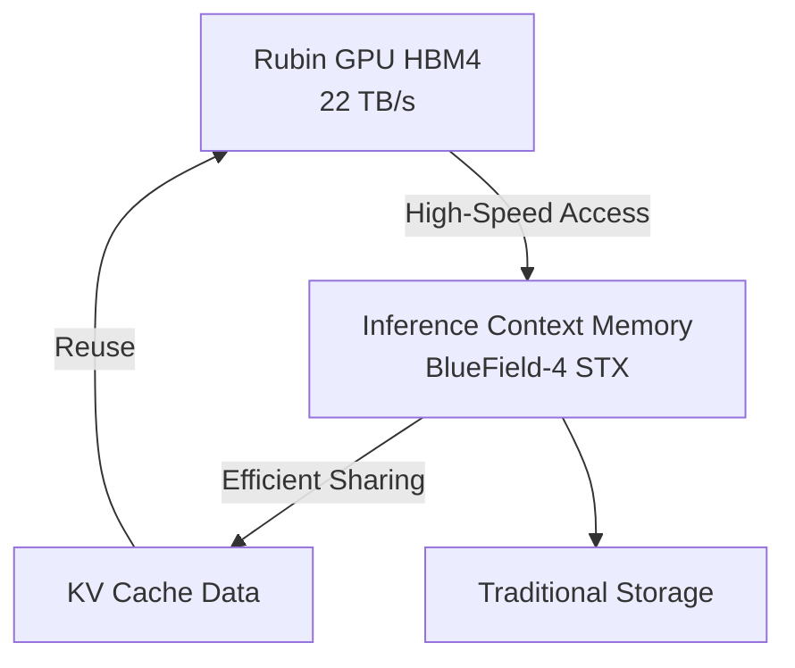
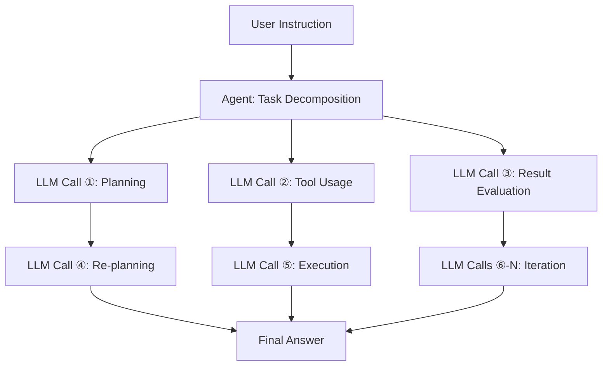

### Introduction: Why is Inference Cost an Issue Now?

In 2026, the discussion around AI is rapidly shifting from "model performance" to "inference cost economics." While the capabilities of Large Language Models (LLMs) are no longer in doubt, the "inference cost per token" is becoming a bottleneck for actual business deployment.

Especially for agent AI, which performs hundreds to thousands of LLM calls to complete a single task, the cost is orders of magnitude higher than simple queries, making scaling difficult.

NVIDIA CEO Jensen Huang succinctly captured this situation in his GTC 2026 keynote in March 2026: "If they had more capacity, they could generate more tokens and make more money. As agentic applications start generating other agents and doing task after task, the number of tokens generated is exploding." He emphasized the importance of fast, low-cost inference infrastructure.

NVIDIA's answer to this situation is the **Vera Rubin** platform. First unveiled at CES 2026 (January 2026) and detailed at GTC 2026 (March 2026), this next-generation AI infrastructure boasts up to a 10x reduction in inference costs compared to the previous Blackwell generation, attracting significant industry attention.

This article delves into the architecture of Vera Rubin, examining how such cost reductions are achieved and its potential impact on the future of agent AI.

---

## What is Vera Rubin: A "AI Supercomputer" with 7 Integrated Chips

Vera Rubin is not a single GPU chip, but an **integrated AI platform with extreme co-design of seven specialized chips**. NVIDIA calls this "Extreme Co-Design." At GTC 2026, NVIDIA officially confirmed its acquisition of Groq in December 2025 for approximately $20 billion, with the Groq 3 LPU becoming the seventh chip added to the platform.

The seven integrated chips are as follows:

| Chip | Role |
|---|---|
| **Vera CPU** | Custom AI-specific CPU (88 Olympus cores) |
| **Rubin GPU** | Core AI compute engine (50 PFLOPS NVFP4) |
| **NVLink 6 Switch** | High-speed GPU-to-GPU communication (3.6 TB/s) |
| **ConnectX-9 SuperNIC** | Network processing |
| **BlueField-4 DPU** | Data processing & inference context memory |
| **Spectrum-6 Ethernet Switch** | Ethernet communication |
| **Groq 3 LPU** | Low-latency inference accelerator (new addition) |

This entire system is integrated on a rack scale, provided in the **Vera Rubin NVL72** form factor. This configuration integrates 72 Rubin GPUs and 36 Vera CPUs per rack. For even larger deployments, a **Vera Rubin POD** configuration of 40 racks is available, offering 60 exaFLOPS of compute power.

---

## Vera CPU: A Custom Processor Designed for AI

One of the key differences between Vera Rubin and previous platforms is the adoption of **NVIDIA's custom-designed "Vera" CPU**. 

Vera is equipped with **88 Olympus cores**. Olympus is NVIDIA's proprietary core based on the ARMv9.2 instruction set, optimized specifically for AI data center workloads. Each core uses "Spatial Multithreading" technology to process two threads in parallel, providing a total processing capacity of **176 threads**. The L3 cache has been increased by 40% to 162MB, and the transistor count reaches 227 billion, a 2.2x increase over the previous generation.

Notably, it supports FP8 precision. Vera CPU is the industry's first CPU to natively support FP8, enabling unified processing of the entire AI workload using low-precision numerical formats.

In terms of memory, it supports up to **1.5TB of SOCAMM LPDDR5X** memory, providing **1.2 TB/s** of memory bandwidth. By expanding the memory bus width to 1024 bits and increasing the speed to 9600MT/s, it achieves 2.5x the bandwidth of the previous generation. Even more critical is its connection to the Rubin GPU. The **2nd Generation NVLink-C2C (Chip-to-Chip)** provides a coherent bandwidth of **1.8 TB/s** between the CPU and GPU. This is 7 times faster than PCIe Gen 6.

### Why is a Custom CPU Necessary?

Traditional AI servers have used general-purpose CPUs, but these can easily become a bottleneck for LLM inference. The host CPU's memory bandwidth and connection speed cannot keep up with the GPU's processing power.

NVIDIA recognized that LLM inference is constrained by memory bandwidth and interconnectivity, and optimized the entire system by designing the CPU side as well. The high-speed coherent link between CPU and GPU minimizes data transfer overhead, improving GPU utilization.

---

## Rubin GPU: The Next-Generation Compute Engine Specialized for Inference

The Rubin GPU incorporates numerous innovations specifically for AI inference.

### Key Specifications

| Item | Value |
|---|---|
| NVFP4 Inference Performance | **50 PFLOPS** (5x Blackwell) |
| NVFP4 Training Performance | **35 PFLOPS** (3.5x Blackwell) |
| HBM4 Memory | **288GB** (per chip) |
| HBM4 Memory Bandwidth | **22 TB/s** |
| NVLink 6 Bandwidth | **3.6 TB/s** (per GPU) |
| Transistor Count | **336 billion** |

Particularly noteworthy is the adoption of **HBM4**. Compared to the previous generation HBM3, memory bandwidth is improved by approximately 2.8x, directly addressing the problem of LLM inference being limited by memory bandwidth.

### NVFP4 and 3rd Generation Transformer Engine

The Rubin GPU features the **3rd Generation Transformer Engine**, which utilizes a new low-precision numerical format called NVFP4. NVFP4 offers even higher arithmetic density than NVFP8 used in Blackwell, achieving significant throughput improvements while maintaining accuracy. By deeply integrating this low-precision execution into both the architecture and software stack, NVIDIA has achieved a real-world throughput increase beyond mere FLOPS augmentation.

---

## NVLink 6: Communication Infrastructure Breaking Bandwidth Walls

In LLM inference, especially with Mixture-of-Experts (MoE) models or multi-GPU environments, **GPU-to-GPU communication bandwidth** is a critical performance factor.

NVLink 6 doubles the bandwidth compared to the previous generation (NVLink 5).

| Metric | NVLink 5 | NVLink 6 |
|---|---|---|
| Bandwidth per Switch | 1,800 GB/s | **3,600 GB/s** |
| Bandwidth per GPU | Approx. 1.8 TB/s | **3.6 TB/s** |
| NVL72 Rack Total | — | **260 TB/s** |

The 260 TB/s internal bandwidth provided by the NVL72 rack is sufficient for efficient inference of large MoE models.

---

## Groq 3 LPU: Low-Latency Inference Accelerator

One of the biggest surprises at GTC 2026 was the integration of Groq's LPU (Language Processing Unit) technology into the Vera Rubin platform. NVIDIA acquired Groq on December 24, 2025, for approximately $20 billion, securing key personnel and a non-exclusive license for Groq's LPU technology.

### Role Separation Between GPUs and LPUs

In the Vera Rubin system, Rubin and Groq share inference processing.


- **Rubin GPU**: Handles prefill processing and decode attention.
- **Groq 3 LPU**: Handles Feed-Forward Network (FFN) execution.

This division of labor allows each chip to focus on the tasks it excels at.

### Groq 3 LPX Rack Specifications

The **Groq 3 LPX rack**, announced at GTC 2026, is equipped with 256 LPUs.

| Item | Value |
|---|---|
| SRAM Capacity (per chip) | **500MB** |
| SRAM Bandwidth (per chip) | **150 TB/s** |
| Scale-up Bandwidth (per chip) | **2.5 TB/s** |
| Total On-Chip SRAM Capacity (rack) | **128GB** |
| Scale-up Bandwidth (rack) | **640 TB/s** |

Groq 3 is designed with a focus on bandwidth rather than just capacity, offering approximately 80 TB/s of bandwidth per chip. This SRAM-centric, high-bandwidth design is key to achieving low latency in FFN processing.

### Integration Benefits

The combination of Vera Rubin and Groq LPX achieves up to **35x higher inference throughput for trillion-parameter models** and a **35x increase in throughput per megawatt** compared to Rubin GPU alone. This is achieved without significant modifications to the CUDA platform, by leveraging LPUs as highly specialized decode accelerators.

---

## Inference Context Memory List Storage: Specialization for Agent AI

A crucial feature demonstrating Vera Rubin's design as a "foundation for agent AI" is the **inference context memory list storage platform**.

### New Memory Hierarchy

NVIDIA utilizes the BlueField-4 DPU to create a new memory tier between GPUs and traditional storage.



The BlueField-4 STX storage rack functions as "dedicated context memory" to maintain context consistency for AI agents handling large, multi-turn conversations. By offloading KV cache data to the BlueField-4 chip, cache data can be shared and reused across the entire AI inference infrastructure, improving inference throughput by **up to 5x**.

### Impact on Agent AI

Agent AI exhibits computational patterns fundamentally different from simple queries.



Dozens to hundreds of LLM calls can occur per instruction, each with a long context. Inference context memory list storage improves the overall throughput and cost-efficiency of agent AI by efficiently managing these KV caches.

---

## The Mechanism for 10x Cost Reduction: Understanding the Numbers Accurately

It is crucial to accurately understand the conditions under which NVIDIA's claimed "10x inference cost reduction" is achieved.

### Key Improvement Factors

The 10x cost reduction is realized as a composite effect of multiple technological innovations.

```
Improved HBM4 memory bandwidth: Approx. 2.8x
NVLink 6 throughput improvement: Approx. 2x
NVFP4 Tensor Core performance improvement: Approx. 5x
FFN processing efficiency through Groq LPU integration: Additional factor
```

### Dramatic Improvement in Power Efficiency

Jensen Huang presented impressive figures in his keynote: "With the Blackwell generation, we could generate 22 million tokens per second from a 1GW data center. With Vera Rubin, we can generate 700 million tokens per second from the same power. That's a 350x improvement in two years."

| Metric | Blackwell | Vera Rubin | Improvement Factor |
|---|---|---|---|
| Tokens/sec per 1GW | 22 million | **700 million** | **Approx. 32x** |
| Token Cost (Long Context) | Baseline | Up to 1/10 | **Up to 10x** |
| Inference Throughput/Watt | Baseline | 10x | **10x** |
| MoE Training GPU Count | Baseline | 1/4 | **4x Efficiency** |

### Realistic Expectations

On the other hand, a realistic assessment is important. The 10x cost reduction is a benchmark result under specific "long context, long output" conditions. For dense model inference with short contexts, a **2-3x improvement** is a more realistic expectation.

---

## NVL72 Rack: System-Wide Performance

The Vera Rubin NVL72 is a rack-scale system integrating all components.

### NVL72 Specification Summary

| Item | Specification |
|---|---|
| GPU Configuration | Rubin GPU x 72 units |
| CPU Configuration | Vera CPU x 36 units |
| Total NVFP4 Inference Performance | **3.6 ExaFLOPS** |
| Total HBM4 Capacity | **20.7 TB** |
| Total HBM4 Bandwidth | **1.6 PB/s** (Petabytes per second) |
| NVLink 6 Total Bandwidth | **260 TB/s** |

### Vera Rubin POD: Data Center Scale Deployment

For even larger configurations, the **Vera Rubin POD** is available, composed of 40 racks.

| Item | Specification |
|---|---|
| Total GPU Count | 2,880 units |
| Total Compute Performance | **60 ExaFLOPS** |
| Configuration Components | Over 1,300,000 |

The POD is the fundamental unit of NVIDIA's next-generation data centers, which they refer to as "AI Factories."

---

## Comparison with Blackwell: Generational Evolution

Vera Rubin succeeds NVIDIA's Blackwell. Let's summarize the key improvements of each generation.

| Item | Blackwell | Vera Rubin | Improvement Factor |
|---|---|---|---|
| GPU Inference Performance (NVFP4) | 10 PFLOPS | **50 PFLOPS** | **5x** |
| GPU Training Performance | 10 PFLOPS | **35 PFLOPS** | **3.5x** |
| GPU-to-GPU Bandwidth | 1,800 GB/s | **3,600 GB/s** | **2x** |
| HBM Generation | HBM3 | **HBM4** | **Approx. 2.8x** |
| CPU | General Purpose/Grace | **Vera (88-core Olympus)** | — |
| Low-Latency Inference | — | **Groq 3 LPU Integration** | — |
| MoE Training GPU Count | Baseline | **Reduced to 1/4** | **4x** |
| Token Cost | Baseline | **Up to 1/10** | **Up to 10x** |

---

## Deployment Timeline and Key Partners

### Availability Schedule

NVIDIA plans to **start mass production and shipment of Vera Rubin in the second half of 2026**. As of GTC 2026 (March 16-19, 2026), Vera Rubin has been confirmed to be in "full production."

### Early Adopters and Cloud Partners

The following partners have been announced to offer cloud services based on Vera Rubin:

- **Hyperscalers**: AWS, Google Cloud, Microsoft Azure, Oracle Cloud Infrastructure (OCI)
- **Specialized Clouds**: CoreWeave, Lambda, Nebius, Nscale

Jensen Huang stated, "By the end of 2027, cumulative orders for Blackwell and Rubin will exceed $1 trillion," indicating Vera Rubin's central role in data center investment.

---

## Technical Challenges and Future Outlook

### Power Consumption and Data Center Investment

While the NVL72 rack offers immense computational power, its power consumption is also substantial. In 2026, hyperscaler data center capital expenditures are projected to exceed $65 billion, necessitating massive investments in power and cooling infrastructure for Vera Rubin adoption.

### Software Ecosystem Development

Although NVIDIA states that the integration of Groq 3 LPU does not require significant changes to the CUDA platform, optimization of the software stack (CUDA libraries, inference frameworks) is also important. NVIDIA is addressing this through initiatives like NIM (NVIDIA Inference Microservices).

### Next-Generation "Vera Rubin Ultra"

At GTC 2026, the next-generation **Vera Rubin Ultra** was also previewed, suggesting NVIDIA's commitment to an annual platform evolution cycle.

---

## Conclusion: Towards the Next Stage of AI Infrastructure

NVIDIA Vera Rubin is not just "a faster GPU." It is an integrated AI platform with extreme co-design of seven chips and related systems: the custom Vera CPU, significant memory bandwidth improvement with HBM4, 2x GPU-to-GPU communication with NVLink 6, low-latency inference integration with Groq 3 LPU, and KV cache management via inference context memory list storage.

The up to 10x inference cost reduction (under long context conditions), 4x reduction in GPU count for MoE model training, and a 350x increase in token generation capacity for the same power fundamentally alter the economic feasibility of agent AI.

In 2026, as agent AI begins to be seriously deployed for enterprise automation, inference cost is a critical factor for business profitability. With Vera Rubin starting mass production in the second half of 2026, this cost equation will be rewritten. The practicality of AI hinges not only on the intelligence of models but also on the economics of the infrastructure that runs them. In this context, Vera Rubin represents a significant infrastructure innovation defining 2026.

---

## References

| Title | Source | Date | URL |
|:---------|:-------|:-----|:----|
| NVIDIA Kicks Off the Next Generation of AI With Rubin — Six New Chips, One Incredible AI Supercomputer | NVIDIA Newsroom | 2026/03/16 | https://nvidianews.nvidia.com/news/rubin-platform-ai-supercomputer |
| NVIDIA Vera Rubin Opens Agentic AI Frontier | NVIDIA Newsroom | 2026/03/16 | https://nvidianews.nvidia.com/news/nvidia-vera-rubin-platform |
| Inside the NVIDIA Vera Rubin Platform: Six New Chips, One AI Supercomputer | NVIDIA Technical Blog | 2026/03/16 | https://developer.nvidia.com/blog/inside-the-nvidia-rubin-platform-six-new-chips-one-ai-supercomputer/ |
| Inside NVIDIA Groq 3 LPX: The Low-Latency Inference Accelerator for the NVIDIA Vera Rubin Platform | NVIDIA Technical Blog | 2026/03/16 | https://developer.nvidia.com/blog/inside-nvidia-groq-3-lpx-the-low-latency-inference-accelerator-for-the-nvidia-vera-rubin-platform/ |
| NVIDIA Vera Rubin POD: Seven Chips, Five Rack-Scale Systems, One AI Supercomputer | NVIDIA Technical Blog | 2026/03/16 | https://developer.nvidia.com/blog/nvidia-vera-rubin-pod-seven-chips-five-rack-scale-systems-one-ai-supercomputer/ |
| Infrastructure for Scalable AI Reasoning | NVIDIA Official | 2026/03 | https://www.nvidia.com/en-us/data-center/technologies/rubin/ |
| Nvidia launches Vera Rubin NVL72 AI supercomputer at CES | Tom's Hardware | 2026/01/06 | https://www.tomshardware.com/pc-components/gpus/nvidia-launches-vera-rubin-nvl72-ai-supercomputer-at-ces-promises-up-to-5x-greater-inference-performance-and-10x-lower-cost-per-token-than-blackwell-coming-2h-2026 |
| GTC 2026: Nvidia Unveils Vera Rubin AI Platform, Eyes \$1T by 2027 | Data Center Knowledge | 2026/03/16 | https://www.datacenterknowledge.com/data-center-chips/gtc-2026-nvidia-unveils-vera-rubin-ai-platform-eyes-1t-by-2027 |
| Nvidia GTC 2026: CEO Jensen Huang sees \$1 trillion in orders for Blackwell and Vera Rubin through '27 | CNBC | 2026/03/16 | https://www.cnbc.com/2026/03/16/nvidia-gtc-2026-ceo-jensen-huang-keynote-blackwell-vera-rubin.html |
| Nvidia's Rubin platform aims to cut AI training, inference costs | CIO Dive | 2026/03 | https://www.ciodive.com/news/nvidia-rubin-cut-ai-training-inference-costs/808915/ |
| NVIDIA Vera Rubin NVL72 Detailed: 72 GPUs, 36 CPUs, 260 TB/s Scale-Up Bandwidth | VideoCardz | 2026/01 | https://videocardz.com/newz/nvidia-vera-rubin-nvl72-detailed-72-gpus-36-cpus-260-tb-s-scale-up-bandwidth |
| Decoding the Future of Inference At NVIDIA: Groq LPUs Join Vera Rubin Platform | ServeTheHome | 2026/03/16 | https://www.servethehome.com/decoding-the-future-of-inference-at-nvidia-groq-lpus-join-vera-rubin-platform-for-low-latency-inference/ |
| Nvidia Boasts 7 Chips in Production for Vera Rubin Platform, Including Groq 3 LPU | HPCwire | 2026/03/16 | https://www.hpcwire.com/2026/03/16/nvidia-boasts-7-chips-in-production-for-vera-rubin-platform-including-groq-3-lpu/ |
| NVIDIA Launches New Vera CPU: 88 Olympus Cores Designed From Scratch for AI | Knowledge Hub Media | 2026/01 | https://knowledgehubmedia.com/nvidia-launches-new-vera-cpu-88-olympus-cores-designed-from-scratch-for-ai/ |
| NVIDIA GTC 2026: Rubin GPUs, Groq LPUs, Vera CPUs, and What NVIDIA Is Building for Trillion-Parameter Inference | StorageReview | 2026/03/16 | https://www.storagereview.com/news/nvidia-gtc-2026-rubin-gpus-groq-lpus-vera-cpus-and-what-nvidia-is-building-for-trillion-parameter-inference |

---

> This article was automatically generated by LLM. It may contain errors.
