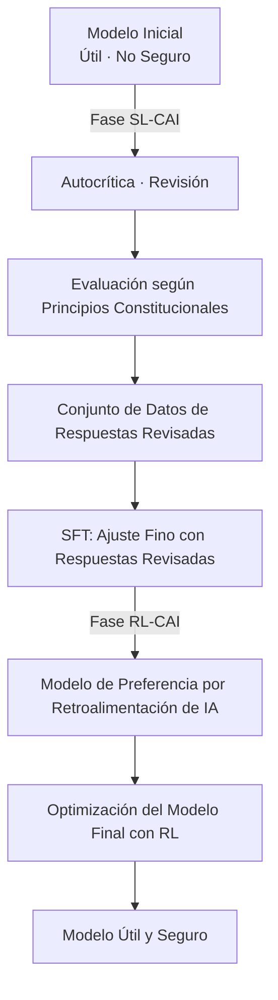

El 22 de enero de 2026, Anthropic publicó un documento conocido como "Claude's Constitution". Este documento, de aproximadamente 23.000 palabras, detalla los principios de comportamiento, valores y criterios de juicio de Claude, y se ha publicado en su totalidad bajo la licencia **Creative Commons CC0 1.0**, equivalente al dominio público.

La publicación CC0 significa "cualquiera puede usar, modificar y adoptar sin restricciones". Es la primera vez que una empresa de IA publica un documento constitucional central para el entrenamiento de sus modelos en el dominio público, un hito en la industria.

## ¿Qué es Constitutional AI?

### Una tecnología nacida del artículo original de 2022

El concepto de Constitutional AI se presentó por primera vez de forma sistemática en el artículo "Constitutional AI: Harmlessness from AI Feedback" (arXiv:2212.08073), publicado por Anthropic en diciembre de 2022. Los autores fueron Yuntao Bai y otros 50 coautores en un extenso estudio colaborativo.

El RLHF (Reinforcement Learning from Human Feedback) tradicional utilizaba grandes cantidades de retroalimentación humana para guiar a los modelos en una dirección segura. Sin embargo, este enfoque presentaba un problema fundamental: no escalaba. Cuanto más potente se volvía un modelo, mayor era la experiencia humana requerida para la evaluación, y los costos aumentaban exponencialmente.

La solución propuesta por Constitutional AI es "RLHF a partir de retroalimentación de IA", es decir, **RLAIF (Reinforcement Learning from AI Feedback)**.

### Flujo técnico de CAI



En la **fase SL-CAI (Aprendizaje Supervisado)**, el propio modelo critica y revisa sus respuestas perjudiciales basándose en los principios constitucionales. Por ejemplo, se autoevalúa diciendo "Esta respuesta contiene una suposición racista. Viola el Principio Constitucional X (trato igualitario)" y genera una versión revisada. Se realiza un ajuste fino con las respuestas revisadas.

En la **fase RL-CAI (Aprendizaje por Refuerzo)**, la IA evalúa cuál de varias respuestas candidatas se alinea mejor con los principios constitucionales y construye un conjunto de datos de preferencias. Con estos datos se entrena un modelo de recompensa, y se optimiza el modelo principal mediante RL.

La clave de este método es que "la supervisión humana necesaria para el etiquetado se ha comprimido en un único documento textual: la Constitución". En lugar de que los humanos evalúen directamente, la IA consulta la Constitución para realizar la evaluación. Esto alivia considerablemente el problema de escala de los costos de mano de obra.

### El problema que RLAIF resolvió

Los resultados experimentales del artículo original mostraron que los modelos que aplicaban Constitutional AI exhibían un nivel de seguridad igual o superior al de los modelos basados en RLHF tradicional. Cabe destacar su característica de "baja perjudicialidad y no evasividad".

Los filtros de seguridad tradicionales a menudo adoptaban un enfoque simple de "rechazar consultas peligrosas". Como resultado, tendían a ser excesivamente restrictivos (muchos falsos positivos) o demasiado permisivos (muchos falsos negativos). Con Constitutional AI, el modelo comprende "por qué algo es problemático" antes de responder, lo que permite un juicio adecuado contextual.

## Lo que "Claude's Constitution" de 2026 ha cambiado

### De lista de reglas a razonamiento basado en principios

Los primeros documentos de "Constitutional AI" publicados en 2023 se parecían en gran medida a una lista de reglas de "qué no hacer". Especificaban prohibiciones y la estructura permitía al modelo consultarlas y verificarlas.

La versión de 2026 tiene una arquitectura diferente. Está diseñada como un marco de razonamiento integral con cuatro niveles de prioridad.

| Prioridad | Elemento | Resumen |
|---------|------|------|
| 1 | **Seguridad (Amplia)** | Apoyar la supervisión humana adecuada de los sistemas de IA |
| 2 | **Ética (General)** | Honestidad y evitación de daños |
| 3 | **Cumplimiento de Directrices (Adherencia a los Principios de Anthropic)** | Seguir las políticas de la empresa |
| 4 | **Utilidad (Genuinamente Útil)** | Ayuda real al usuario/operador |

Lo importante son las implicaciones filosóficas de la prioridad. Que la seguridad tenga prioridad sobre la utilidad declara explícitamente el principio de "no sacrificar la seguridad por la utilidad". Sin embargo, en las operaciones normales, la utilidad del cuarto punto es el principal eje de evaluación: está diseñado para ser lo más útil posible, siempre que no se infrinjan los principios de orden superior.

Además, se siguen especificando restricciones duras (prohibiciones absolutas como la ayuda a la fabricación de armas biológicas), pero la mayoría de las directrices se centran en "fomentar el juicio".

### Enseñar el "por qué" al modelo

El cambio más notable en la versión de 2026 es la explicación detallada del "por qué" detrás de las reglas.

Por ejemplo, "no generar contenido violento" es una regla incluida en muchas directrices de seguridad de IA. Sin embargo, la Constitución de Claude de 2026 explica detalladamente los valores subyacentes a esta regla: el respeto a la dignidad humana, la prevención de daños en el mundo real y la tensión con la libertad de expresión.

El objetivo de Anthropic no es "un modelo que memoriza reglas", sino "un modelo que comprende los principios y puede aplicarlos a situaciones desconocidas". Esto es una respuesta a la realidad de que siempre surgen nuevas situaciones (nuevas tecnologías, nuevos problemas sociales, nuevos casos de uso) que las reglas no anticipan.

```
【Enfoque Tradicional】
SI la solicitud coincide con la lista de prohibiciones EN Rechazar
SI NO Responder

【Enfoque Basado en Principios】
1. ¿Cuál es la intención y el contexto de esta solicitud?
2. ¿Qué principios se aplican?
3. ¿Cómo se aplican cada uno de los principios a esta situación?
4. ¿Cómo resolver los conflictos entre principios?
5. ¿Cuál es la respuesta más ética en general?
```

### El significado de la publicación masiva de documentos

La extensión de 23.000 palabras también es notable. Equivale a la longitud de una novela corta. No es una lista superficial de reglas, sino una descripción detallada de valores, procesos de juicio y políticas para manejar casos difíciles.

Tal nivel de detalle tiene un efecto secundario: una mayor transparencia que permite a los responsables de la toma de decisiones de la empresa y a los usuarios comprender "por qué Claude se comporta de cierta manera". También puede considerarse una respuesta al problema de la "caja negra" de los sistemas de IA.

Anthropic reconoce francamente en el documento que "existe una brecha entre el comportamiento previsto y el comportamiento real del modelo", y se compromete a continuar las evaluaciones y ampliar la investigación sobre seguridad.

## Lo que la publicación CC0 plantea a la industria

### Un experimento de código abierto para la seguridad de la IA

La publicación de los documentos de la Constitución de Constitutional AI bajo CC0 tiene un gran significado desde la perspectiva de la apertura del código abierto en la investigación de seguridad de IA.

**Beneficios para la comunidad de investigación**: Universidades e instituciones de investigación pueden verificar, expandir y criticar el enfoque de Anthropic. Refleja la idea de que la investigación sobre seguridad, antes de ser un juego de "quién construye la IA más segura", debería ser un esfuerzo colaborativo para "comprender qué es la IA segura".

**Impacto en otras empresas de IA**: Competidores como OpenAI, Google y Meta pueden consultar, adoptar y modificar documentos similares. Aunque parezca una pérdida de ventaja competitiva a corto plazo, si el nivel de seguridad de IA de toda la industria mejora, toda la industria podrá ganarse la confianza de los reguladores y la sociedad.

**Impacto en la comunidad de desarrolladores**: Pequeñas y medianas empresas de IA y desarrolladores individuales pueden ahorrar el costo de diseñar un marco de seguridad desde cero.

### "Renuncia a la ventaja competitiva" o "estrategia para dominar el estándar"?

También existen puntos de vista críticos sobre la publicación CC0. Si los competidores adoptan la Constitución de Claude y el "marco de seguridad diseñado por Anthropic" se convierte en el estándar de la industria, esto situaría a Anthropic en una posición ventajosa.

La estandarización también significa "convertir la propia filosofía de diseño en el estándar de facto de la industria". Linux se abrió de código abierto para competir con las UNIX propietarias de IBM y Sun Microsystems, y como resultado, Linux se convirtió en la plataforma dominante. Si la publicación CC0 de Constitutional AI provoca una dinámica similar en el mundo de la seguridad de IA, Anthropic se convertiría en el líder no oficial del "marco de seguridad".

### Preguntas pendientes

Hay problemas que la publicación CC0 no resuelve.

**Brecha de implementación**: Incluso si se publica el documento constitucional, el conocimiento sobre cómo integrarlo en el proceso de entrenamiento no se divulga. Que otras empresas que lean la "Constitución" puedan lograr un nivel de seguridad comparable es otra cuestión.

**Dificultad de evaluación**: No se han publicado métricas para medir objetivamente si se cumple la Constitución de Claude. El "razonamiento basado en principios" es cualitativo y difícil de normalizar.

**Universalidad de los valores**: Los valores contenidos en el documento de 23.000 palabras se basan principalmente en un contexto angloparlante y occidental. La idoneidad de aplicar estos valores a sistemas de IA globales requiere una discusión continua.

## Posicionamiento en la estrategia de gobernanza de Anthropic

La publicación CC0 de Constitutional AI es parte de la estrategia más amplia de transparencia de Anthropic. La empresa cuenta con un mecanismo de gobernanza llamado "Long-Term Benefit Trust", y en enero de 2026 dio la bienvenida a Mariano-Florentino Cuéllar, ex juez de la Corte Suprema de California, como nuevo miembro. El compromiso de incorporar expertos en derecho y asuntos internacionales en el sistema de gobernanza es una elección estratégica en medio de la intensificación del debate sobre la regulación de la IA.

Anthropic persigue múltiples direcciones de investigación de seguridad en paralelo, con la interpretabilidad, la supervisión escalable, el aprendizaje orientado a procesos y la comprensión general como pilares principales. Dentro de estas investigaciones, Constitutional AI se sitúa en la parte "más cercana a la implementación".

El flujo de la publicación del artículo de Constitutional AI (2022) → publicación de la Constitución inicial (2023) → publicación CC0 de la Constitución revisada (enero de 2026) muestra un escenario de expansión gradual de la influencia: investigación → práctica → estandarización industrial.


## Resumen

La publicación CC0 de "Claude's Constitution" de Anthropic tiene un significado que va más allá de la simple divulgación de información.

Técnicamente, la transición de una lista de reglas a un marco de razonamiento basado en principios es un intento de actualizar la metodología de implementación de la seguridad de IA en sí misma. La combinación de Constitutional AI y RLAIF proporciona una respuesta realista al problema del costo de la supervisión humana.

Estratégicamente, la apertura del marco de seguridad de IA puede interpretarse como un movimiento para establecer el estándar de la industria liderado por Anthropic. La elección de la licencia CC0, la menos restrictiva, refleja la intención de maximizar la adopción y fomentar la adopción y el uso futuros.

Y socialmente, como respuesta pública de la empresa a la pregunta "¿Qué es la IA y cómo debería comportarse?", desempeña un papel en la promoción del diálogo con investigadores, responsables políticos y el público en general.

A medida que el debate sobre la seguridad de la IA pasa de ser "un problema de Anthropic" a "un problema de toda la industria y la sociedad", la publicación CC0 de Constitutional AI se convertirá en un hito que simbolice esa transición.

## Referencias

| Título | Fuente | Fecha | URL |
|:---------|:-------|:-----|:----|
| Constitutional AI: Harmlessness from AI Feedback | arXiv | 2022-12-15 | https://arxiv.org/abs/2212.08073 |
| Claude's new constitution | Anthropic | 2026-01-22 | https://www.anthropic.com/news/claude-new-constitution |
| Long-Term Benefit Trust 新メンバー就任 | Anthropic | 2026-01-21 | https://www.anthropic.com/news/mariano-florentino-long-term-benefit-trust |
| Constitutional AI: Anthropic's safety research | Anthropic Research | 2023 | https://www.anthropic.com/research/constitutional-ai-harmlessness-from-ai-feedback |
| Anthropic's core views on AI safety | Anthropic | 2023 | https://www.anthropic.com/news/core-views-on-ai-safety |
| Creative Commons CC0 1.0 Universal | Creative Commons | — | https://creativecommons.org/publicdomain/zero/1.0/ |
| Claude's Model Specification | Anthropic | 2024 | https://www.anthropic.com/news/anthropics-model-specification |

---

> Este artículo fue generado automáticamente por LLM. Puede contener errores.
