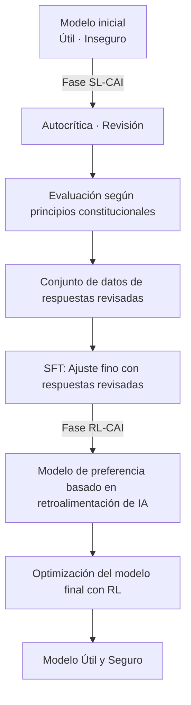
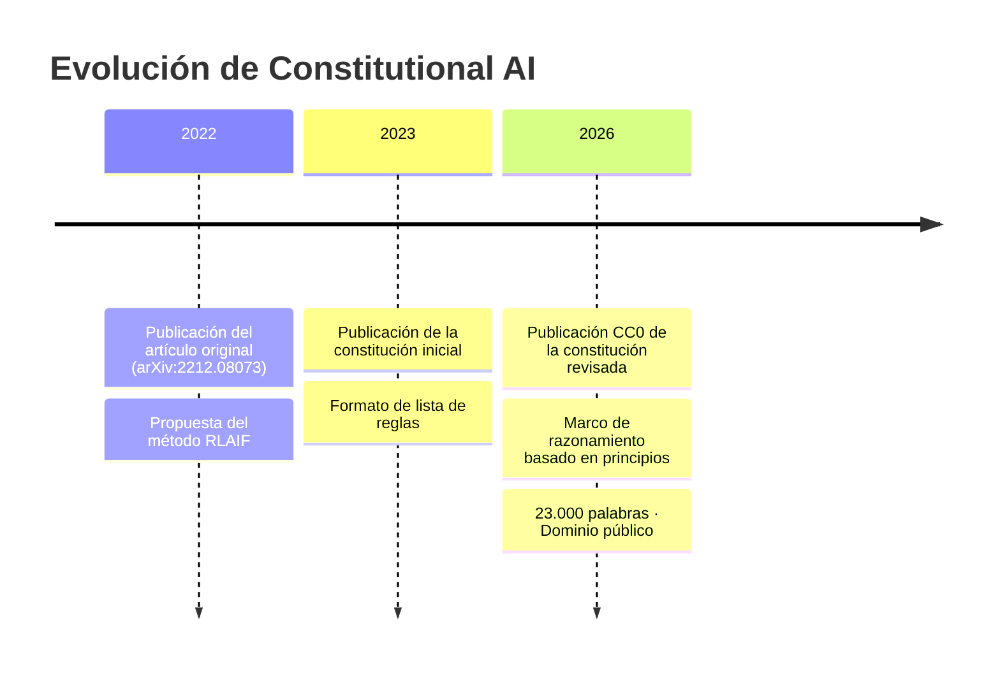

El 22 de enero de 2026, Anthropic publicó un documento conocido como "Claude's Constitution". Este documento de aproximadamente 23.000 palabras, que describe en detalle los principios de comportamiento, valores y criterios de juicio de Claude, se publicó en su totalidad bajo la licencia **Creative Commons CC0 1.0**, equivalente al dominio público.

La publicación CC0 significa "que cualquiera puede usarlo, modificarlo o adoptarlo sin restricciones". Es la primera vez que una empresa de IA publica un documento constitucional central utilizado para entrenar sus modelos en el dominio público, lo que marca un hito en la industria.

## ¿Qué es Constitutional AI?

### Una tecnología que comenzó con el artículo original de 2022

El concepto de Constitutional AI se presentó sistemáticamente por primera vez en el artículo "Constitutional AI: Harmlessness from AI Feedback" (arXiv:2212.08073), publicado por Anthropic en diciembre de 2022. Los autores son Yuntao Bai y otros 50 coautores en una extensa investigación colaborativa.

El RLHF (Reinforcement Learning from Human Feedback) tradicional utilizaba grandes cantidades de retroalimentación humana para guiar al modelo hacia un comportamiento seguro. Sin embargo, este enfoque tenía un problema fundamental: no escalaba. Cuanto más potente se volvía el modelo, mayor era la experiencia humana requerida para la evaluación, y los costos aumentaban exponencialmente.

La solución propuesta por Constitutional AI es **RLAIF (Reinforcement Learning from AI Feedback)**, es decir, RLHF a partir de la retroalimentación de la IA.

### Flujo técnico de CAI



En la **fase SL-CAI (aprendizaje supervisado)**, el propio modelo critica y revisa sus respuestas dañinas basándose en los principios constitucionales. Por ejemplo, se autoevalúa como "Esta respuesta contiene supuestos racistas. Va en contra del principio constitucional X (trato igualitario)" y genera una versión revisada. Se realiza un ajuste fino con las respuestas revisadas.

En la **fase RL-CAI (aprendizaje por refuerzo)**, la IA evalúa cuál de varias respuestas candidatas se ajusta mejor a los principios constitucionales, construyendo un conjunto de datos de preferencias. Estos datos se utilizan para entrenar un modelo de recompensa, que luego optimiza el modelo principal mediante RL.

La clave de este método es "comprimir la supervisión humana requerida para el etiquetado en un único documento de texto: la Constitución". En lugar de que los humanos evalúen directamente, la IA evalúa haciendo referencia a la Constitución. Esto puede mitigar significativamente los problemas de escalado de los costos laborales.

### Problemas resueltos por RLAIF

Los resultados experimentales del artículo original mostraron que los modelos aplicados con Constitutional AI exhibían un nivel de seguridad igual o superior al de los modelos basados en RLHF tradicional. Cabe destacar la característica de "baja toxicidad y no evasividad".

Los filtros de seguridad tradicionales a menudo adoptaban un enfoque simple de "rechazar consultas peligrosas". Como resultado, tendían a inclinarse hacia un rechazo excesivo (muchos falsos positivos) o a dejar pasar demasiadas consultas (muchos falsos negativos). Con Constitutional AI, el modelo entiende "por qué algo es problemático" y responde en consecuencia, permitiendo juicios adecuados en función del contexto.

## Lo que la "Claude's Constitution" de 2026 ha cambiado

### De una lista de reglas a un razonamiento basado en principios

Los primeros documentos de "Constitutional AI" publicados en 2023 se parecían en gran medida a una lista de reglas de "qué no hacer". Estructuraban las prohibiciones de manera explícita para que el modelo las consultara y verificara.

La versión de 2026 tiene una arquitectura diferente. Está diseñada como un marco de razonamiento integral con cuatro niveles de prioridad.

| Prioridad | Elemento | Resumen |
|---------|----------|---------|
| 1 | **Seguridad (Broadly Safe)** | Apoya la supervisión humana apropiada de los sistemas de IA |
| 2 | **Ética (Generally Ethical)** | Integridad y evitación de daños |
| 3 | **Cumplimiento de directrices (Adherent to Anthropic's Principles)** | Cumplimiento de las políticas de la empresa |
| 4 | **Utilidad (Genuinely Helpful)** | Asistencia genuina a los usuarios y operadores |

Lo importante son las implicaciones filosóficas de las prioridades. Que la seguridad tenga prioridad sobre la utilidad declara explícitamente el principio de que "la seguridad no debe sacrificarse en aras de la utilidad". Sin embargo, en las operaciones normales, la utilidad es el principal eje de evaluación: el diseño pretende maximizar la utilidad dentro de los límites de no infringir los principios de orden superior.

Además, si bien se siguen manteniendo las restricciones estrictas (prohibiciones absolutas como la asistencia en la fabricación de armas biológicas), la mayoría de las directrices se centran en "fomentar el juicio".

### Enseñar el "por qué" al modelo

El cambio más notable en la versión de 2026 es la explicación detallada del "por qué" detrás de las reglas.

Por ejemplo, la regla "no generar contenido violento" se incluye en muchas guías de seguridad de IA. Sin embargo, la constitución de Claude para 2026 explica meticulosamente los valores subyacentes a esta regla: el respeto a la dignidad humana, la prevención de daños en el mundo real y la tensión con la libertad de expresión.

El objetivo de Anthropic no es un modelo que "recuerde reglas", sino un modelo que "entienda los principios y pueda aplicarlos a situaciones desconocidas". Esto es una respuesta a la realidad de que siempre surgen nuevas situaciones (nuevas tecnologías, nuevos problemas sociales, nuevos casos de uso) que las reglas no prevén.

```
【Enfoque tradicional】
SI la solicitud coincide con la lista de prohibiciones ENTONCES rechazar
SI NO responder

【Enfoque basado en principios】
1. ¿Cuál es la intención y el contexto de esta solicitud?
2. ¿Qué principios se aplican?
3. ¿Cómo se aplican cada uno de los principios a esta situación?
4. ¿Cómo se resuelven los compromisos entre los principios?
5. ¿Cuál es la respuesta más ética en general?
```

### Significado de la publicación de un documento a gran escala

La extensión de 23.000 palabras también es digna de mención. Esta es la cantidad de texto equivalente a una novela corta. No es una lista superficial de reglas, sino que describe en detalle los valores, los procesos de toma de decisiones y los enfoques para tratar casos difíciles.

Esta granularidad tiene un efecto secundario: una mayor transparencia que permite a los responsables de la toma de decisiones empresariales y a los usuarios comprender "por qué Claude se comporta de esa manera". Puede considerarse una respuesta al problema de la "caja negra" de los sistemas de IA.

Anthropic reconoce francamente en el documento que "existe una brecha entre el comportamiento previsto y el comportamiento real del modelo", y se compromete a continuar la evaluación y ampliar la investigación sobre seguridad.

## Lo que la publicación CC0 pregunta a la industria

### Un experimento de código abierto para la seguridad de la IA

La publicación de los documentos constitucionales de Constitutional AI bajo CC0 tiene un gran significado desde la perspectiva del código abierto en la investigación de seguridad de IA.

**Beneficios para la comunidad de investigación**: Universidades e instituciones de investigación pueden verificar, ampliar y criticar el enfoque de Anthropic. Encarna la idea de que la investigación sobre seguridad, antes de ser un juego de "quién puede construir la IA más segura", debe ser un esfuerzo colaborativo para "comprender qué es la IA segura".

**Impacto en otras empresas de IA**: Competidores como OpenAI, Google y Meta pueden consultar, adoptar y modificar documentos similares. Aunque a corto plazo parezca una pérdida de ventaja competitiva, si el nivel general de seguridad de la IA en la industria mejora, la industria en su conjunto puede ganar la confianza de los reguladores y la sociedad.

**Impacto en la comunidad de desarrolladores**: Las PYMEs de IA y los desarrolladores individuales pueden ahorrar el costo de diseñar un marco de seguridad desde cero.

### ¿Un "abandono de la ventaja competitiva" o una "estrategia para dominar el estándar"?

También existen puntos de vista críticos sobre la publicación CC0. Si los competidores adoptan la constitución de Claude y el "marco de seguridad diseñado por Anthropic" se convierte efectivamente en el estándar de la industria, esto también sitúa a Anthropic en una posición ventajosa.

La estandarización también significa "convertir la propia filosofía de diseño en el facto de la industria". Linux se abrió para competir con las versiones propietarias de UNIX de IBM y Sun Microsystems, y como resultado, Linux se convirtió en la plataforma dominante. Si la publicación CC0 de Constitutional AI desencadenara una dinámica similar en el ámbito de la seguridad de la IA, Anthropic se convertiría en el líder silencioso del "marco de seguridad".

### Preguntas pendientes

Hay problemas que ni siquiera la publicación CC0 puede resolver.

**Brecha de implementación**: Incluso si se publican los documentos constitucionales, el conocimiento sobre cómo integrarlos en el proceso de entrenamiento no se publica. Que otras empresas que lean la "Constitución" puedan lograr un nivel de seguridad comparable es otra cuestión.

**Dificultad de evaluación**: No se publican métricas para medir objetivamente si un sistema cumple con la constitución de Claude. El "razonamiento basado en principios" es cualitativo y difícil de convertir en un benchmark.

**Universalidad de los valores**: Los valores contenidos en el documento de 23.000 palabras se basan principalmente en el contexto anglosajón y occidental. La aplicabilidad de estos valores a sistemas de IA globales requiere una discusión continua.

## Posición en la estrategia de gobernanza de Anthropic

La publicación CC0 de Constitutional AI es parte de la estrategia más amplia de transparencia de Anthropic. La empresa tiene un mecanismo de gobernanza llamado "Long-Term Benefit Trust" y en enero de 2026 dio la bienvenida a Mariano-Florentino Cuéllar, un exjuez de la Corte Suprema de California, como nuevo miembro. El hecho de incorporar expertos en derecho y asuntos internacionales en su estructura de gobernanza es una elección estratégica a medida que los debates sobre la regulación de la IA se intensifican.

Anthropic persigue simultáneamente varias direcciones de investigación en seguridad, con la interpretabilidad, la supervisión escalable, el aprendizaje orientado a procesos y la comprensión de generalización como pilares principales. Constitutional AI se sitúa en la parte "más cercana a la implementación" de estas investigaciones.

El flujo de la presentación del artículo de Constitutional AI (2022) → publicación de la constitución inicial (2023) → publicación CC0 de la constitución revisada (enero de 2026) muestra un escenario de expansión gradual de la influencia: investigación → práctica → estandarización de la industria.



## Resumen

La publicación CC0 de "Claude's Constitution" de Anthropic tiene un significado que va más allá de la simple divulgación de información.

Técnicamente, la transición de una lista de reglas a un marco de razonamiento basado en principios es un intento de actualizar la metodología de implementación de la seguridad de la IA. La combinación de Constitutional AI y RLAIF ofrece una respuesta práctica al problema del costo de la supervisión humana.

Estratégicamente, la apertura del marco de seguridad de IA puede interpretarse como un movimiento para establecer un estándar de la industria liderado por Anthropic. La elección de CC0, la licencia menos restrictiva, demuestra la intención de maximizar la adopción y fomentar futuras bifurcaciones y adopciones.

Y socialmente, actúa como una respuesta pública por parte de las empresas a la pregunta "¿qué es la IA y cómo debería comportarse?", fomentando el diálogo entre investigadores, responsables políticos y el público en general.

A medida que el debate sobre la seguridad de la IA pasa de ser un "problema de Anthropic" a ser un "problema de la industria y la sociedad en su conjunto", la publicación CC0 de Constitutional AI será un hito que simbolice esa transición.

## Referencias

| Título | Fuente | Fecha | URL |
|:-------|:-------|:-----|:----|
| Constitutional AI: Harmlessness from AI Feedback | arXiv | 2022-12-15 | https://arxiv.org/abs/2212.08073 |
| Claude's new constitution | Anthropic | 2026-01-22 | https://www.anthropic.com/news/claude-new-constitution |
| Long-Term Benefit Trust新メンバー就任 | Anthropic | 2026-01-21 | https://www.anthropic.com/news/mariano-florentino-long-term-benefit-trust |
| Constitutional AI: Anthropic's safety research | Anthropic Research | 2023 | https://www.anthropic.com/research/constitutional-ai-harmlessness-from-ai-feedback |
| Anthropic's core views on AI safety | Anthropic | 2023 | https://www.anthropic.com/news/core-views-on-ai-safety |
| Creative Commons CC0 1.0 Universal | Creative Commons | — | https://creativecommons.org/publicdomain/zero/1.0/ |
| Claude's Model Specification | Anthropic | 2024 | https://www.anthropic.com/news/anthropics-model-specification |

---

> Este artículo fue generado automáticamente por LLM. Puede contener errores.
