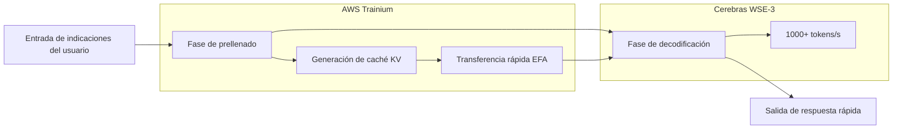

### Cerebras×OpenAI: El fin de la exclusividad de las GPU y la realidad de la diversificación de la infraestructura de IA

## Resumen
OpenAI adopta el chip a escala de oblea WSE-3 de Cerebras para lograr una inferencia ultrarrápida de más de 1000 tokens/s. El contrato de 10 mil millones de dólares desafía el dominio de NVIDIA, marcando un punto de inflexión histórico en el panorama de la infraestructura de IA.

## Etiquetas
["Cerebras","OpenAI","AI推論","AIインフラ","NVIDIA","GPUアーキテクチャ","ウェーハスケール"]

## Cuerpo

Principios de 2026 se recordará como un punto de inflexión en la historia de la infraestructura de IA. OpenAI firmó un acuerdo de más de 10 mil millones de dólares con Cerebras, introduciendo el primer acelerador de inferencia que no es una GPU de NVIDIA en un entorno de producción a gran escala. El símbolo de esto es "GPT-5.3-Codex-Spark", un modelo especializado en codificación que opera a velocidades superiores a 1000 tokens por segundo.

Este movimiento no es simplemente un cambio en el proveedor. Significa que se está introduciendo una competencia fundamental en el bastión de NVIDIA, que ha dominado el mercado de hardware de IA durante muchos años. Este artículo analizará en detalle los detalles técnicos de la arquitectura Cerebras WSE-3, los antecedentes del contrato con OpenAI y el impacto en toda la industria de la diversificación de la infraestructura de IA.

## Cerebras WSE-3: Innovación en el motor a escala de oblea

### Diferencias fundamentales con la arquitectura de GPU tradicional

Muchas de las GPU que impulsan la inferencia de IA moderna adoptan una arquitectura que corta las obleas de silicio en chips individuales (dicing) y los conecta en red para lograr el procesamiento paralelo. Las H100 y B200 de NVIDIA son ejemplos típicos de esto, y logran la expansión escalando múltiples chips a través de interconexiones de alta velocidad como NVLink.

El enfoque elegido por Cerebras subvierte este sentido común. El WSE (Wafer Scale Engine) opera toda la oblea como un único chip masivo. Dado que no se realiza ningún dicing físico, el overhead de comunicación entre chips no existe, en principio.

### Especificaciones clave del WSE-3

El WSE-3 se fabrica con el proceso 5nm de TSMC y cuenta con las siguientes especificaciones.

| Elemento de especificación | WSE-3 | NVIDIA H100 | Factor de comparación |
|:---------|:------|:------------|:---------|
| Número de transistores | 4 billones | Aproximadamente 80 mil millones | Aproximadamente 50x |
| Número de núcleos de IA | 900,000 núcleos | 17,408 núcleos | Aproximadamente 52x |
| SRAM en chip | 44 GB | 50 MB | Aproximadamente 880x |
| Ancho de banda de memoria | 21 PB/s | 3.35 TB/s | Aproximadamente 7,000x |
| Área del chip | 46,255 mm² | 814 mm² | Aproximadamente 57x |
| Rendimiento computacional pico | 125 PFLOPS | 3.958 PFLOPS | Aproximadamente 32x |

Cabe destacar la capacidad de la SRAM en chip. Los 44 GB del WSE-3 equivalen a 880 veces los de H100. El ancho de banda de la memoria a menudo se convierte en un cuello de botella en la inferencia de IA, y la carga de una gran cantidad de memoria en el chip puede minimizar el acceso a la memoria fuera del chip. Este es el factor fundamental de la inferencia de alta velocidad.

### Velocidad de inferencia habilitada por la escala de oblea

Los 900,000 núcleos del WSE-3 están todos conectados uniformemente en una topología de malla 2D. Esta arquitectura acelera drásticamente la fase de "decodificación" en la generación de tokens.

Cuando un clúster de GPU normal realiza inferencia de IA, es necesario transferir los datos de pesos del modelo entre múltiples GPU. En WSE-3, todos los pesos se despliegan en la SRAM en chip, lo que elimina la necesidad de acceso a memoria externa y permite un alto rendimiento de miles de tokens/segundo.

## Acuerdo de 10 mil millones de dólares entre OpenAI y Cerebras

### Descripción general del acuerdo

En enero de 2026, OpenAI y Cerebras firmaron un contrato multianual para proporcionar 750 megavatios de recursos de cómputo hasta 2028. El valor total del contrato superó los 10 mil millones de dólares, una transacción transformadora dado el tamaño del negocio de Cerebras.

Según el CEO de Cerebras, Andrew Feldman, la negociación comenzó en agosto del año anterior. Cerebras demostró que los modelos de código abierto de OpenAI podían ejecutarse de manera más eficiente en sus propios chips que en las GPU. Esta demostración técnica abrió la puerta a un gran contrato.

Para OpenAI, este contrato es central en su estrategia de diversificación de proveedores. OpenAI mantuvo sus pedidos existentes a NVIDIA, AMD y Broadcom, al tiempo que agregó una adquisición de cómputo dedicada a la inferencia de 10 mil millones de dólares con Cerebras. Esto refleja la decisión estratégica de "diversificar el riesgo de la infraestructura de IA".

### GPT-5.3-Codex-Spark: El primer resultado de producción en masa

En febrero de 2026, OpenAI lanzó "GPT-5.3-Codex-Spark" como el primer resultado de esta asociación. Diseñado como una versión ligera de GPT-5.3-Codex, este modelo está optimizado para la codificación en tiempo real y tiene las siguientes características:

- **Velocidad de inferencia**: Más de 1000 tokens/segundo (aproximadamente 15 veces más rápido que GPT-5.3-Codex)
- **Ventana de contexto**: 128k (solo texto)
- **Entornos compatibles**: ChatGPT Pro, aplicación Codex, CLI, extensión VS Code
- **Forma de entrega**: Vista previa de investigación (despliegue gradual)

La cifra de 1000 tokens por segundo es difícil de entender intuitivamente, pero en comparación con los 65-70 tokens por segundo que opera GPT-5.3-Codex, significa que la IA puede completar y generar código más rápido de lo que un desarrollador escribe. Esta es una velocidad que cambia fundamentalmente la "interactividad" de la codificación.

### ¿Por qué la codificación es el primer caso de uso?

Es estratégicamente sensato que OpenAI aplicara por primera vez los chips Cerebras al campo de la codificación (codificación basada en agentes).

La productividad de los asistentes de codificación depende en gran medida de la velocidad de respuesta. Cuando un desarrollador recibe autocompletado en tiempo real mientras escribe código, incluso un retraso de unos cientos de milisegundos puede interrumpir la concentración. Esta importancia de la velocidad aumenta aún más en flujos de trabajo agénticos donde los agentes de IA ejecutan pruebas, corrigen errores y refactorizan código.

La inferencia ultrarrápida proporcionada por los chips a escala de oblea de Cerebras aporta el valor más directo a esta área, por lo que fue elegida como el primer caso de uso.

## Antecedentes estructurales del colapso del dominio de NVIDIA

### Dominio de NVIDIA en la infraestructura de IA

Durante los últimos cinco años, NVIDIA ha dominado casi por completo el mercado de entrenamiento e inferencia de IA. Las GPU, centradas en H100 y A100, se han convertido en la infraestructura estándar para todos los principales proveedores de nube y laboratorios de IA grandes, y el fuerte bloqueo en el ecosistema CUDA ha dificultado la entrada de competidores.

Esta posición de monopolio también fue una limitación para OpenAI. La dependencia de un único proveedor conlleva los siguientes riesgos:

- **Pérdida de poder de negociación de precios**: NVIDIA tiene una fuerte ventaja en la fijación de precios.
- **Cuellos de botella en el suministro**: La escasez de GPU restringe la expansión de los servicios de IA.
- **Punto único de fallo**: Los problemas de fabricación y suministro de NVIDIA se convierten directamente en riesgos comerciales.

### Estrategia de diversificación de OpenAI

OpenAI comenzó a diversificar sus fuentes de suministro a gran escala a partir de 2025. Si bien mantuvo sus contratos existentes con NVIDIA, amplió sus pedidos a AMD, Broadcom y Cerebras. El contrato de 10 mil millones de dólares con Cerebras es una inversión estratégica particularmente centrada en las cargas de trabajo de inferencia.

Cabe destacar que la adopción de los chips Cerebras no es para "computación de propósito general", sino para "acelerar la inferencia". Según las previsiones de Deloitte, la inferencia representará aproximadamente dos tercios de todo el cálculo de IA en 2026 (aproximadamente el 50% en 2025), y la demanda de aceleradores de inferencia seguirá creciendo en el futuro.

### Asociación AWS y Cerebras: Repercusiones en la nube

Aproximadamente dos meses después del acuerdo con OpenAI, el 13 de marzo de 2026, AWS y Cerebras anunciaron una importante asociación. El despliegue de una "Arquitectura de Inferencia Desagregada" que introduce chips WSE-3 en AWS Bedrock.

Técnicamente, adopta una configuración híbrida donde el procesador Trainium de AWS se encarga de la fase de prellenado (procesamiento de indicaciones) y Cerebras CS-3 se encarga de la fase de decodificación (generación de salida). Se dice que esta división del trabajo permite lograr una capacidad de tokens 5 veces mayor con la misma huella de hardware.

El concepto de esta arquitectura de "inferencia desagregada" aprovecha las diferencias en las características computacionales de cada fase. Al asignar el prellenado a sistemas tipo GPU que son buenos en el procesamiento paralelo y la decodificación a WSE-3, que tiene una gran cantidad de memoria en chip, se maximiza el rendimiento general.

## Estrategia corporativa y salida a bolsa de Cerebras

### Crecimiento hasta una valoración de 2.200 millones de dólares

En 2024, Cerebras tenía una valoración de 8 mil millones de dólares, pero debido al contrato con OpenAI y la adquisición de varios clientes importantes (IBM, Departamento de Energía de EE. UU., etc.), a principios de 2026 se informó una valoración superior a los 22 mil millones de dólares. Las ventas estimadas en 2025 superaron los mil millones de dólares, y ha madurado de una startup en fase de investigación a una empresa de infraestructura con ingresos reales.

### Plan de salida a bolsa y circunstancias

Cerebras solicitó la salida a bolsa a finales de 2025, pero se vio obligada a retirarla temporalmente debido a la revisión de la CFIUS (Comité de Inversión Extranjera en EE. UU.) sobre la relación de capital con G42 de Abu Dhabi. Posteriormente, G42 fue retirado de la lista de inversores y obtuvo la aprobación de la CFIUS, y se está planeando una reaplicación con el objetivo del segundo trimestre de 2026.

Los grandes acuerdos con OpenAI y AWS proporcionan un excelente telón de fondo como historial comercial antes de la salida a bolsa.

## El futuro indicado por la multipolarización de la infraestructura de IA

### El estallido de la competencia por "la inferencia más rápida"

El lanzamiento de GPT-5.3-Codex-Spark ha introducido un nuevo eje de competencia en la industria de la IA. La "velocidad" se ha convertido en un factor de diferenciación destacado, además de la "inteligencia" del modelo.

Si la ventaja de velocidad de 20x que afirma Cerebras (en comparación con las GPU NVIDIA) se demuestra, las empresas de servicios de IA entrarán en una era de selección de hardware según la aplicación.

- **Tareas que requieren alta precisión**: GPU tradicionales (NVIDIA H100/B200, etc.)
- **Tareas que requieren latencia ultrabaja**: Cerebras WSE-3
- **Tareas con la máxima prioridad en la eficiencia de costos**: AMD MI300X, ASIC personalizados, etc.

### Impacto en NVIDIA

Si bien el dominio del mercado de NVIDIA no se verá sacudido, se están produciendo cambios importantes. En el mercado de la inferencia, NVIDIA se enfrenta a su primer escenario de competencia real con un competidor fuerte.

Particularmente digna de mención es la construcción de un "ecosistema" que se evidencia en la combinación de OpenAI, AWS y Cerebras. Al igual que CUDA ha sido durante mucho tiempo la razón de facto para elegir GPU, se está formando un nuevo ecosistema especializado en inferencia.

### Transformación de la experiencia del desarrollador

Los cambios provocados por la inferencia ultrarrápida van más allá de la simple mejora de las métricas de rendimiento. En Spotify, se informa que los ingenieros de primer nivel "dejaron de escribir código" debido a la propagación de herramientas de codificación de IA a partir de diciembre de 2025. Herramientas de codificación de IA ultrarrápidas como Claude Code y GPT-5.3-Codex-Spark acelerarán aún más esta transformación.

Una velocidad de inferencia de 1000 tokens por segundo puede ser un umbral que cambie fundamentalmente el estilo de colaboración entre desarrolladores e IA. Si la autocompletación en tiempo real, la revisión de código instantánea y las sugerencias de depuración instantáneas se proporcionan sin tiempo de espera, la productividad del desarrollo de software mejorará exponencialmente.

## Resumen

La asociación entre Cerebras WSE-3 y OpenAI ha traído tres importantes puntos de inflexión a la infraestructura de inferencia de IA.

Primero, como un punto de inflexión técnico, la arquitectura a escala de oblea ha establecido un nuevo estándar de rendimiento de "1000 tokens por segundo". Segundo, como un punto de inflexión en la estructura industrial, el cambio de un único polo NVIDIA a la multipolarización ha comenzado seriamente. Tercero, como un punto de inflexión en el eje de la competencia, la "velocidad" de inferencia se ha establecido como un elemento de diferenciación clave junto con la "inteligencia" del modelo.

La "arquitectura de inferencia desagregada" demostrada en la asociación con AWS sugiere una mayor difusión. Si los usuarios de la nube en general pueden beneficiarse de WSE-3 a través de Amazon Bedrock durante 2026, la inferencia rápida pasará de ser un privilegio solo de los laboratorios grandes a convertirse en un componente de los servicios de IA estándar.

Las barreras del ecosistema que NVIDIA ha tardado años en construir son altas. Sin embargo, cuando un contrato de 10 mil millones de dólares, una asociación estratégica con AWS y una ventaja de velocidad demostrable de 15 veces para los desarrolladores se combinan, el mapa de la competencia en la infraestructura de IA se está redibujando con certeza.

---

---

> Este artículo fue generado automáticamente por LLM. Puede contener errores.
