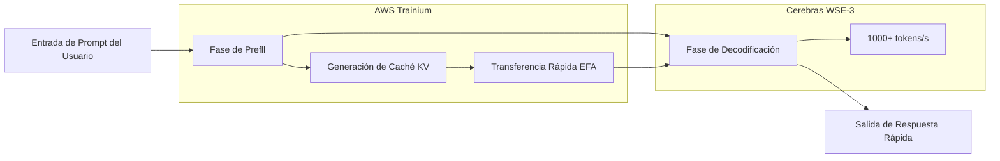

### Cerebras×OpenAI: Hacia la Diversificación de la Infraestructura de IA y el Fin de la Exclusividad de las GPU

**Resumen**

OpenAI adopta el chip WSE-3 de Cerebras para una inferencia ultra rápida (1000+ tokens/segundo). El contrato de $10 mil millones desafía el dominio de NVIDIA, marcando un punto de inflexión en la infraestructura de IA.

**Cuerpo**

Principios de 2026 quedarán grabados en la historia de la infraestructura de IA como un punto de inflexión. OpenAI ha firmado un contrato de más de 10.000 millones de dólares con Cerebras, marcando la primera implementación a gran escala de un acelerador de inferencia no NVIDIA en un entorno de producción. El símbolo de esto es "GPT-5.3-Codex-Spark", un modelo especializado en codificación que opera a más de 1.000 tokens por segundo.

Este movimiento no es simplemente un cambio de proveedor. Significa la introducción de una competencia sustancial en el bastión de NVIDIA, que ha dominado el mercado de hardware de IA durante años. Este artículo analiza en detalle los detalles técnicos de la arquitectura Cerebras WSE-3, el contexto del contrato con OpenAI y el impacto en toda la industria de la diversificación de la infraestructura de IA.

## Cerebras WSE-3: La Innovación del Motor a Escala de Oblea

### Diferencia Fundamental con la Arquitectura GPU Tradicional

Muchas de las GPU que soportan la inferencia de IA moderna adoptan una arquitectura donde las obleas de silicio se cortan en chips individuales (dicing) y luego se conectan en red para el procesamiento paralelo. Las H100 y B200 de NVIDIA son ejemplos típicos, que logran escalabilidad conectando múltiples chips a través de interconexiones de alta velocidad como NVLink.

El enfoque elegido por Cerebras subvierte esta convención. El WSE (Wafer Scale Engine) opera la oblea completa como un único chip masivo. Dado que no hay dicing físico, el overhead de comunicación entre chips está fundamentalmente ausente.

### Especificaciones Clave del WSE-3

El WSE-3 se fabrica con el proceso TSMC de 5nm y presume de las siguientes especificaciones:

| Elemento de Especificación | WSE-3 | NVIDIA H100 | Factor de Comparación |
|:--------------------------|:------|:------------|:---------------------|
| Número de Transistores | 4 billones | ~80 mil millones | ~50x |
| Número de Núcleos de IA | 900,000 | 17,408 | ~52x |
| SRAM On-Chip | 44 GB | 50 MB | ~880x |
| Ancho de Banda de Memoria | 21 PB/s | 3.35 TB/s | ~7,000x |
| Área del Chip | 46,255 mm² | 814 mm² | ~57x |
| Rendimiento Computacional Pico | 125 PFLOPS | 3.958 PFLOPS | ~32x |

Cabe destacar la capacidad de la SRAM on-chip. Los 44 GB del WSE-3 equivalen a 880 veces la H100. En la inferencia de IA, el ancho de banda de memoria tiende a ser un cuello de botella, y la inclusión de memoria de gran capacidad on-chip minimiza el acceso a la memoria externa. Este es el factor fundamental detrás de la inferencia de alta velocidad.

### Velocidad de Inferencia Lograda por la Escala de Oblea

Los 900.000 núcleos del WSE-3 están uniformemente conectados en una topología de malla 2D. Esta arquitectura acelera drásticamente la fase de "decodificación" en la generación de tokens.

Cuando un clúster de GPU típico realiza inferencia de IA, los datos de peso del modelo deben transferirse entre múltiples GPU. En el WSE-3, todos los pesos se cargan en la SRAM on-chip, eliminando la necesidad de acceso a memoria externa y logrando un alto rendimiento de miles de tokens/segundo.

## Contrato de 10.000 Millones de Dólares entre OpenAI y Cerebras

### Resumen del Contrato

En enero de 2026, OpenAI y Cerebras firmaron un contrato plurianual para proporcionar 750 megavatios de recursos computacionales hasta 2028. El valor total del contrato supera los 10.000 millones de dólares, una transacción transformadora dada la escala del negocio de Cerebras.

Según el CEO de Cerebras, Andrew Feldman, la negociación comenzó en agosto del año anterior, cuando Cerebras demostró que los modelos de código abierto de OpenAI funcionaban de manera más eficiente en sus chips que en las GPU. Esta demostración técnica abrió la puerta a un contrato a gran escala.

Para OpenAI, este contrato es fundamental para su estrategia de diversificación de proveedores. Si bien OpenAI mantiene sus pedidos existentes a NVIDIA, AMD y Broadcom, ha agregado adquisiciones de cómputo dedicadas a la inferencia por valor de 10.000 millones de dólares con Cerebras. Esto refleja una decisión estratégica de "diversificar el riesgo de la infraestructura de IA".

### GPT-5.3-Codex-Spark: El Primer Resultado de Producción Masiva

En febrero de 2026, OpenAI presentó "GPT-5.3-Codex-Spark" como el primer resultado de esta colaboración. Diseñado como una versión ligera de GPT-5.3-Codex, este modelo está optimizado para codificación en tiempo real y presenta las siguientes características:

*   **Velocidad de Inferencia**: Más de 1.000 tokens/segundo (aproximadamente 15 veces más rápido que GPT-5.3-Codex)
*   **Ventana de Contexto**: 128k (solo texto)
*   **Entornos Soportados**: ChatGPT Pro, Codex App, CLI, Extensión VS Code
*   **Forma de Provisión**: Vista previa de investigación (despliegue gradual)

Aunque la cifra de 1.000 tokens por segundo puede ser difícil de comprender intuitivamente, en comparación con los 65-70 tokens/segundo de GPT-5.3-Codex, significa que la IA puede completar y generar código más rápido de lo que un desarrollador puede escribir. Esto cambia fundamentalmente la "interactividad" de la codificación.

### ¿Por Qué la Codificación es el Primer Caso de Uso?

Que OpenAI haya aplicado los chips de Cerebras por primera vez al dominio de la codificación (codificación basada en agentes) tiene sentido estratégico.

La productividad de los asistentes de codificación depende en gran medida de la velocidad de respuesta. Cuando un desarrollador recibe completados en tiempo real mientras escribe código, incluso unos pocos cientos de milisegundos de latencia pueden interrumpir la concentración. La importancia de esta velocidad se magnifica en flujos de trabajo agénticos donde la IA ejecuta pruebas, corrige errores y refactoriza código.

La inferencia ultra rápida proporcionada por los chips a escala de oblea de Cerebras ofrece el valor más directo en este dominio, por lo que fue elegido como el primer caso de uso.

## Antecedentes Estructurales del Desmoronamiento del Dominio de NVIDIA

### Dominio de NVIDIA en la Infraestructura de IA

Durante los últimos cinco años, NVIDIA ha monopolizado en gran medida el mercado de entrenamiento e inferencia de IA. Las GPU como H100 y A100 se han convertido en la infraestructura estándar para todos los principales proveedores de nube y laboratorios de IA importantes, y el fuerte bloqueo en el ecosistema CUDA ha dificultado la entrada de competidores.

Esta posición dominante también ha sido una restricción para OpenAI. La dependencia de un único proveedor conlleva los siguientes riesgos:

*   **Pérdida de Poder de Negociación de Precios**: NVIDIA tiene una fuerte ventaja en la fijación de precios.
*   **Cuellos de Botella de Suministro**: La escasez de GPU restringe la expansión de los servicios de IA.
*   **Único Punto de Fallo**: Los problemas de fabricación y suministro de NVIDIA se convierten directamente en riesgos comerciales.

### Estrategia de Diversificación de OpenAI

OpenAI ha intensificado su estrategia de diversificación de proveedores a partir de 2025. Si bien mantiene su contrato existente con NVIDIA, ha ampliado sus pedidos a AMD, Broadcom y Cerebras. El contrato de 10.000 millones de dólares con Cerebras es una inversión estratégica particularmente enfocada en cargas de trabajo de inferencia.

Cabe destacar que la adopción de los chips de Cerebras se centra en "acelerar la inferencia", no en "computación de propósito general". Según las previsiones de Deloitte, la inferencia representará aproximadamente dos tercios de la computación total de IA en 2026 (frente a aproximadamente el 50% en 2025), y la demanda de aceleradores de inferencia seguirá creciendo.

### Asociación AWS y Cerebras: Propagación a la Nube

Aproximadamente dos meses después del contrato con OpenAI, el 13 de marzo de 2026, AWS y Cerebras anunciaron una importante asociación. El despliegue de una "Arquitectura de Inferencia Desagregada" que integra los chips WSE-3 en AWS Bedrock.

Técnicamente, se adopta una configuración híbrida donde el procesador Trainium de AWS se encarga de la fase de prefll (procesamiento de prompts), y el CS-3 de Cerebras se encarga de la fase de decodificación (generación de salida). Se dice que esta división de tareas permite 5 veces la capacidad de tokens con la misma huella de hardware.

El concepto de arquitectura de "inferencia desagregada" aprovecha las diferencias en las características computacionales de cada fase. Al asignar a las GPU el procesamiento de prefll, que es bueno para el procesamiento paralelo, y al WSE-3, con su memoria on-chip de gran capacidad, para la decodificación, se maximiza el rendimiento general.

## Estrategia Corporativa y IPO de Cerebras

### Crecimiento a una Valoración de 2.200 Millones de Dólares

Para 2024, Cerebras tenía una valoración de 8.000 millones de dólares, pero debido al contrato con OpenAI y la adquisición de múltiples clientes importantes (como IBM y el Departamento de Energía de EE. UU.), a principios de 2026 se reportó una valoración de más de 22.000 millones de dólares. Se espera que los ingresos estimados para 2025 superen los 1.000 millones de dólares, habiendo madurado de ser una startup en fase de investigación a una empresa de infraestructura con ingresos reales.

### Plan de IPO y su Proceso

Cerebras solicitó la IPO a finales de 2025, pero se vio obligada a retirarla temporalmente debido a la revisión del CFIUS (Comité de Inversión Extranjera en Estados Unidos) relacionada con la relación de capital con G42 de Abu Dhabi. Posteriormente, G42 fue retirado de la lista de inversores, se obtuvo la aprobación del CFIUS y se planea una nueva solicitud con el objetivo del segundo trimestre de 2026.

Los contratos a gran escala con OpenAI y AWS sirven como un sólido respaldo para el historial operativo antes de la IPO.

## El Futuro Indicado por la Multi-polarización de la Infraestructura de IA

### Estallido de la Competencia por la "Inferencia Más Rápida"

El lanzamiento de GPT-5.3-Codex-Spark ha introducido un nuevo eje de competencia en la industria de la IA. La "rapidez" se ha convertido en un factor de diferenciación prominente, además de la "inteligencia" del modelo.

Si la ventaja de velocidad de 20 veces de Cerebras (en comparación con las GPU NVIDIA) se demuestra, los proveedores de servicios de IA entrarán en una era de selección de hardware según el caso de uso:

*   **Tareas que requieren alta precisión**: GPU tradicionales (NVIDIA H100/B200, etc.)
*   **Tareas que requieren latencia ultra baja**: Cerebras WSE-3
*   **Tareas con prioridad en la eficiencia de costos**: AMD MI300X, ASIC personalizados, etc.

### Impacto en NVIDIA

Si bien el dominio del mercado de NVIDIA no se desmoronará, están ocurriendo cambios importantes. En el mercado de inferencia, NVIDIA se enfrenta a la primera fase de competencia real con un potente competidor.

Particularmente digna de mención es la tendencia de "construcción de ecosistemas" que muestra la combinación de OpenAI, AWS y Cerebras. Al igual que CUDA ha sido durante mucho tiempo la razón de facto para elegir GPU, se está formando un nuevo ecosistema especializado en inferencia.

### Transformación de la Experiencia del Desarrollador

El cambio provocado por la inferencia ultra rápida va más allá de la mejora de las métricas de rendimiento. Se informa que en Spotify, a partir de diciembre de 2025, ingenieros de primer nivel "han dejado de escribir código" debido a la proliferación de herramientas de codificación de IA. Herramientas de codificación de IA ultra rápidas como Claude Code y GPT-5.3-Codex-Spark acelerarán aún más esta transformación.

Una velocidad de inferencia de 1.000 tokens por segundo puede convertirse en un umbral que cambie fundamentalmente el estilo de colaboración entre desarrolladores y la IA. Si la completación de pensamiento en tiempo real, la revisión de código instantánea y las sugerencias de depuración en un instante se ofrecen sin tiempo de espera, la productividad del desarrollo de software mejorará drásticamente.

## Resumen

La asociación entre Cerebras WSE-3 y OpenAI ha introducido tres puntos de inflexión importantes en la infraestructura de inferencia de IA:

Primero, como punto de inflexión técnico, la arquitectura a escala de oblea ha establecido un nuevo estándar de rendimiento de "1.000 tokens por segundo". Segundo, como punto de inflexión en la estructura industrial, el cambio de la concentración unipolar en NVIDIA a la multi-polarización ha comenzado seriamente. Tercero, como punto de inflexión en el eje de competencia, la "velocidad" de inferencia se ha establecido como un factor de diferenciación clave, junto con la "inteligencia" del modelo.

La "arquitectura de inferencia desagregada" mostrada en la asociación con AWS sugiere una mayor adopción. Si los usuarios generales de la nube pueden beneficiarse del WSE-3 a través de Amazon Bedrock durante 2026, la inferencia de alta velocidad pasará de ser un privilegio exclusivo de los laboratorios grandes a un componente de los servicios de IA estándar.

Las barreras del ecosistema que NVIDIA ha construido durante muchos años son altas. Sin embargo, cuando el contrato de 10.000 millones de dólares, la asociación estratégica con AWS y una ventaja de velocidad demostrable de 15 veces se combinan, el panorama de la competencia en la infraestructura de IA se está redefiniendo con certeza.

---

## Referencias

| Título | Fuente | Fecha | URL |
|:-------|:-------|:-----|:----|
| OpenAI deploys Cerebras chips for 15x faster code generation | VentureBeat | 12 de febrero de 2026 | https://venturebeat.com/technology/openai-deploys-cerebras-chips-for-15x-faster-code-generation-in-first-major |
| Cerebras Inks Transformative \$10 Billion Inference Deal With OpenAI | NextPlatform | 15 de enero de 2026 | https://www.nextplatform.com/2026/01/15/cerebras-inks-transformative-10-billion-inference-deal-with-openai/ |
| OpenAI signs deal, worth \$10B, for compute from Cerebras | TechCrunch | 14 de enero de 2026 | https://techcrunch.com/2026/01/14/openai-signs-deal-reportedly-worth-10-billion-for-compute-from-cerebras/ |
| Introducing GPT-5.3-Codex-Spark | OpenAI Official | Febrero de 2026 | https://openai.com/index/introducing-gpt-5-3-codex-spark/ |
| OpenAI GPT-5.3-Codex-Spark Now Running at 1K Tokens Per Second | ServeTheHome | Febrero de 2026 | https://www.servethehome.com/openai-gpt-5-3-codex-spark-now-running-at-1k-tokens-per-second-on-big-cerebras-chips/ |
| Cerebras WSE-3 AI Chip Launched 56x Larger than NVIDIA H100 | ServeTheHome | Marzo de 2024 | https://www.servethehome.com/cerebras-wse-3-ai-chip-launched-56x-larger-than-nvidia-h100-vertiv-supermicro-hpe-qualcomm/ |
| AWS and Cerebras Collaboration Aims to Set a New Standard for AI Inference | BusinessWire | 13 de marzo de 2026 | https://www.businesswire.com/news/home/20260313406341/en/AWS-and-Cerebras-Collaboration-Aims-to-Set-a-New-Standard-for-AI-Inference-Speed-and-Performance-in-the-Cloud |
| Cerebras scores OpenAI deal worth over \$10 billion ahead of IPO | CNBC | 14 de enero de 2026 | https://www.cnbc.com/2026/01/14/cerebras-scores-openai-deal-worth-over-10-billion.html |
| OpenAI chip deal with Cerebras adds to roster of Nvidia, AMD, Broadcom | CNBC | 16 de enero de 2026 | https://www.cnbc.com/2026/01/16/openai-chip-deal-with-cerebras-adds-to-roster-of-nvidia-amd-broadcom.html |
| OpenAI Partners with Cerebras to Bring High-Speed Inference to the Mainstream | Cerebras Blog | Febrero de 2026 | https://www.cerebras.ai/blog/openai-partners-with-cerebras-to-bring-high-speed-inference-to-the-mainstream |
| A Comparison of the Cerebras Wafer-Scale Integration Technology with Nvidia GPU-based Systems | arXiv | Marzo de 2025 | https://arxiv.org/html/2503.11698v1 |
| Cerebras is coming to AWS | Cerebras Blog | Marzo de 2026 | https://www.cerebras.ai/blog/cerebras-is-coming-to-aws |
| 2026 IPO Alert: Nvidia Rival Cerebras Systems Targets Debut in Q2 | TipRanks | Enero de 2026 | https://www.tipranks.com/news/2026-ipo-alert-nvidia-rival-cerebras-targets-debut-in-q2 |

---

> Este artículo fue generado automáticamente por LLM. Puede contener errores.
