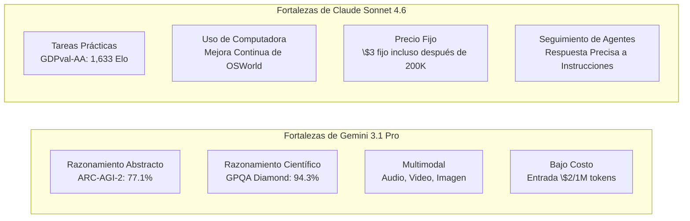

En la tercera semana de febrero de 2026, dos modelos de gran atención aparecieron casi al mismo tiempo en la industria de la IA. El **Claude Sonnet 4.6** lanzado por Anthropic el 17 de febrero y el **Gemini 3.1 Pro** publicado por Google DeepMind el 19 de febrero. Ambos se autodenominan "modelos fronterizos de vanguardia" y destacaron una ventana de contexto de un millón de tokens y una mejora significativa en la capacidad de razonamiento general.

La aparición simultánea de estos dos modelos no es una coincidencia. En un momento en que el eje de la competencia de los LLM está migrando de "el máximo rendimiento en tareas únicas" a "uso de agentes, procesamiento de contexto largo y eficiencia de costos", ambas partes apuntan al mismo público objetivo: desarrolladores empresariales y constructores de agentes de IA. Este artículo organizará las especificaciones, los números de benchmark y las diferencias de características prácticas de ambos modelos, y proporcionará una guía para que los desarrolladores tomen la mejor decisión.

## Contexto del Lanzamiento: El Marco de la Competencia

### Estrategia de Anthropic

El lanzamiento de Claude Sonnet 4.6 llama la atención por su velocidad, a solo 12 días del lanzamiento de Claude Opus 4.6 el 5 de febrero del mismo año. Anthropic posicionó la línea "Sonnet", que es rentable, como el modelo predeterminado para todos los usuarios, desplegándola en todos los niveles, incluido el plan gratuito. La estrategia es mejorar significativamente el rendimiento manteniendo el precio de entrada de 3\$/salida de 15\$ (por millón de tokens) para Sonnet, el mismo que Sonnet 4.5.

Lo que llama la atención es la evaluación en Claude Code. Se publicaron datos internos que indican que el 70% de los desarrolladores prefirieron Sonnet 4.6, y el 59% de los casos seleccionaron Sonnet en comparación con Opus 4.6. El posicionamiento de "Sonnet que supera a Opus" en términos de relación precio-rendimiento funciona eficazmente para atraer entornos de producción sensibles al costo de uso de la API.

Al mismo tiempo, Anthropic también anunció una asociación con Infosys (un gigante de TI de la India) (17 de febrero). Este es un esfuerzo para integrar el modelo Claude en la plataforma Topaz AI, con el objetivo de automatizar flujos de trabajo operativos complejos en industrias como banca, telecomunicaciones y fabricación, y también es una señal de la aceleración del despliegue empresarial.

### Estrategia de Google DeepMind

Google DeepMind anunció que había logrado "la puntuación más alta de la historia" en múltiples benchmarks con Gemini 3.1 Pro. En particular, el 77.1% en ARC-AGI-2 (benchmark de razonamiento abstracto) representa una mejora vertiginosa, aproximadamente el doble que la generación anterior Gemini 3 Pro. En comparación con el Claude Opus 4.6 del mismo período con 68.8% y el GPT-5.2 con 52.9%, Gemini muestra una clara ventaja en ARC-AGI-2.

Además, lanzaron una ofensiva en términos de precios. Para uso general por debajo de 200K tokens, el precio se fijó en 2\$/salida de 12\$ (por millón de tokens), lo que lo hace un 33-35% más barato que Sonnet 4.6. La postura de afirmar la superioridad tanto en "inteligencia" como en "eficiencia de costos" está clara.

Además, la ventana de contexto de 1M de tokens está disponible inmediatamente en entornos de producción sin necesidad de lista de espera, lo que es un diferenciador. A diferencia de la oferta escalonada de Sonnet 4.6 de 1M, que está en versión beta, Gemini tiene la ventaja para los desarrolladores que desean comenzar inmediatamente a analizar bases de código grandes o repositorios de archivos múltiples.

## Comparación de Especificaciones

Organizamos las especificaciones básicas de ambos modelos.

| Artículo | Claude Sonnet 4.6 | Gemini 3.1 Pro |
|:-----|:-----------------|:--------------|
| Fecha de lanzamiento | 17 de febrero de 2026 | 19 de febrero de 2026 |
| Longitud del contexto | 200K (1M en beta) | 1M (predeterminado) |
| Precio de entrada (1 millón de tokens) | \$3.00 | \$2.00 (≤200K) / \$4.00 (exceso) |
| Precio de salida (1 millón de tokens) | \$15.00 | \$12.00 (≤200K) / \$18.00 (exceso) |
| Soporte multimodal | Texto, imagen | Texto, imagen, audio, video |
| Tokens de salida máximos | 64K | 64K |
| Forma de entrega | API, Claude.ai, Claude Code | API, Gemini.google.com, Vertex AI |

Agregamos una nota sobre los precios. Gemini 3.1 Pro es más barato por debajo de 200K tokens, pero aumenta a \$4/\$18 si se excede. Dado que Sonnet 4.6 es un precio fijo de \$3/\$15 sin fluctuaciones, en algunos casos Sonnet puede ser más fácil de predecir el costo para cargas de trabajo que utilizan mucho contexto largo. Es importante comprender la distribución de la longitud del contexto en la etapa de estimación de costos del procesamiento por lotes.

## Comparación Detallada de Benchmarks

### Métricas Principales de Benchmarks

```
Comparación de Benchmarks (Datos publicados a febrero de 2026)

ARC-AGI-2 (Razonamiento Abstracto)
  Gemini 3.1 Pro  : 77.1%  ← Claude Opus 4.6 (68.8%), GPT-5.2 (52.9%)
  Claude Sonnet 4.6: 58.3%
  Diferencia: +18.8pt (Ventaja Gemini)

GPQA Diamond (Ciencia a Nivel de Posgrado)
  Gemini 3.1 Pro  : 94.3%  ← Puntuación líder en la industria
  Claude Sonnet 4.6: 74.1%
  Diferencia: +20.2pt (Ventaja Gemini)

SWE-Bench Pro (Ingeniería de Software)
  Gemini 3.1 Pro  : 54.2%
  Claude Sonnet 4.6: 42.7%
  Diferencia: +11.5pt (Ventaja Gemini)

SWE-Bench Verified (Benchmark oficial de Gemini)
  Gemini 3.1 Pro  : 80.6%

Terminal-Bench 2.0 (Operación de terminal)
  Gemini 3.1 Pro  : 68.5%

GDPval-AA Elo (Tarea de valor económico)
  Claude Sonnet 4.6: 1,633 Elo  ← Nivel que supera incluso a Opus 4.6
  Gemini 3.1 Pro  : 1,317 Elo
  Diferencia: +316pt (Ventaja Sonnet)

MMMLU (Comprensión multilingüe)
  Gemini 3.1 Pro  : 92.6%

Precisión de contexto largo (a 128K tokens)
  Gemini 3.1 Pro  : 84.9%
```

Al observar las cifras, Gemini 3.1 Pro supera consistentemente en los benchmarks de "razonamiento puro". Por otro lado, GDPval-AA mide la calificación Elo de "tareas prácticas que generan valor económico" como redacción de documentos comerciales, modelado financiero e investigación académica, donde Sonnet 4.6 tiene una ventaja abrumadora con 1,633 puntos. El "campeón de benchmarks" y el "campeón práctico" siendo diferentes ilustra vívidamente las diferencias de características de ambos modelos.

### Interpretación de Benchmarks

**GPQA Diamond (Graduate-Level Google-Proof Q&A)** es un conjunto de problemas a nivel de posgrado que mide la capacidad de resolver problemas difíciles en física, química y biología. Una puntuación de 94.3% es la puntuación más alta de la industria, acercándose a "resolver problemas al mismo nivel que biólogos, químicos y físicos".

**ARC-AGI-2** es un benchmark diseñado por investigadores de IA para "medir el razonamiento abstracto genuino que no puede resolverse con memorización". Evalúa la capacidad de abstraer reglas completamente nuevas a partir de unos pocos ejemplos. El 77.1% aquí es un nivel notable en toda la industria, registrando un logro en medio de Claude Opus 4.6 del mismo período en 68.8% y GPT-5.2 en 52.9%.

Por el contrario, **GDPval-AA** es una evaluación integral de "tareas prácticas que generan valor económico", que consta de un grupo de problemas similares a tareas del mundo real, como redacción de informes, análisis financieros y planificación de proyectos. El nivel de 1,633 Elo de Sonnet 4.6 se informa como superior incluso a Opus 4.6, lo que indica la destacada practicidad de Sonnet en la generación de "resultados utilizables".

## Diferencias Prácticas en Características

### Asistencia de Codificación

Aunque Gemini tiene ventaja en las cifras para tareas de codificación, la evaluación subjetiva de los desarrolladores muestra una tendencia diferente. Sonnet 4.6 es muy apreciado por "seguir instrucciones matizadas" y "revisión de código por etapas", y tiene una ventaja en la especificación del formato de revisión de código y la adaptación a las convenciones de codificación personalizadas.

La diferencia en las puntuaciones de SWE-Bench se debe a que muchos escenarios implican que los agentes manipulen archivos de forma autónoma y realicen refactorizaciones a gran escala. En aplicaciones de tipo "pair programming" donde los humanos dan instrucciones detalladas, la capacidad de seguimiento de Sonnet se convierte en una fortaleza.

```python
# Ejemplo de agente utilizando Claude Sonnet 4.6
import anthropic

client = anthropic.Anthropic()

# Análisis de la base de código completa con soporte de 1 millón de tokens
with open("large_codebase.txt", "r") as f:
    codebase_content = f.read()

message = client.messages.create(
    model="claude-sonnet-4-6-20260217",
    max_tokens=8192,
    messages=[
        {
            "role": "user",
            "content": (
                "Analice la siguiente base de código y enumere las vulnerabilidades de seguridad:\n\n" 
                + codebase_content
            )
        }
    ]
)
print(message.content[0].text)
```

### Procesamiento de Contexto Largo y Multimodalidad

Gemini 3.1 Pro registró una precisión del 84.9% en el benchmark de contexto largo a 128K tokens y es capaz de procesar contextos compuestos que incluyen PDFs largos, transcripciones de audio y transcripciones de video. El soporte nativo para audio y video es un elemento diferenciador que Sonnet 4.6 no tiene actualmente.

Sonnet 4.6 proporciona la función de "Uso de Computadora" a un nivel práctico, y tiene una alta afinidad con el ecosistema de Anthropic para flujos de trabajo de agentes que incluyen la operación de navegadores y aplicaciones GUI. Se están informando mejoras continuas en el benchmark OSWorld, y ha habido un historial de éxito constante en la construcción de pipelines de automatización.

### Brecha Abismal en el Trabajo de Conocimiento

La diferencia de puntuación de GDPval-AA (316 puntos Elo) no se puede pasar por alto. En tareas como "organizar conocimiento y transformarlo en resultados prácticos", como resumir informes financieros, crear actas de reuniones y generar informes analíticos que cruzan múltiples documentos, Sonnet 4.6 tiene una clara ventaja. Esto se considera un reflejo de la dirección de diseño de Anthropic, que enfatiza "profundidad de comprensión del contexto y planificación de agentes".

## Diferencias en el Pensamiento de Diseño de Arquitectura

Al examinar las diferencias en el pensamiento de diseño de ambos modelos a partir de la información pública, surgen varias comparaciones.

Gemini 3.1 Pro tiene una fuerte naturaleza de "motor de razonamiento general escalable". Su arquitectura parece estar orientada a procesar de manera unificada todas las modalidades de entrada, incluidos audio, video y repositorios de código, y a lograr el máximo rendimiento en tareas de razonamiento puro tipo ARC-AGI-2. Las tarjetas de modelo de Google DeepMind describen evaluaciones de seguridad detalladas basadas en el marco "frontier safety", lo que indica una postura de diseño que asume un despliegue a escala global.

Claude Sonnet 4.6 prioriza la finalización como "agente de ejecución confiable". La combinación de "Uso de Computadora", "razonamiento de contexto largo" y "planificación de agentes" es una selección de funciones consciente de la idoneidad para flujos de trabajo semi-autónomos en los que interviene un humano. El historial de acumulación de éxitos en la automatización de flujos de trabajo operativos complejos en banca, telecomunicaciones y fabricación a través de la asociación empresarial con Infosys está vinculado a la estrategia comercial de Anthropic.



## Tendencias de LLM en 2026 Indicadas por la Competencia

La aparición simultánea de Claude Sonnet 4.6 y Gemini 3.1 Pro es un buen punto de observación que muestra el estado actual de la competencia de LLM.

**"Predeterminación" del Procesamiento de Contexto Largo**: Ambos modelos ofrecen contexto de un millón de tokens por defecto o en beta, y esto ya no es un diferenciador sino una condición previa. Con 1 millón de tokens, es posible ingresar la base de código completa de un proyecto, la documentación relacionada y los informes de errores pasados a la vez.

**Aceleración de la Optimización para Agentes**: El uso de herramientas para agentes, la operación de computadoras y el razonamiento de varios pasos son áreas comunes en las que ambos se centran. Junto con la difusión de MCP, cuál de los dos modelos se convertirá en el estándar para los tiempos de ejecución de agentes también es un eje de competencia.

**Avance de la Competencia de Benchmarks**: Está ocurriendo una transición de la tasa de respuesta correcta en problemas únicos a métricas que miden "razonamiento inmemorizable" como ARC-AGI-2 y "valor económico" como GDPval-AA. Es un cambio de "respuestas precisas" a "resultados utilizables".

**Continuación de la Competencia de Precios**: El precio de entrada de Gemini de \$2/1M tokens es menos de una décima parte del precio de la clase GPT-4 en 2023. Si bien la competencia está acelerando la democratización de los modelos, también está aumentando la presión sobre la monetización.

## Guía de Uso para Desarrolladores

La elección dependerá de tres puntos: "naturaleza de la tarea", "distribución de la longitud del contexto" y "integración con el stack existente".

| Caso de Uso | Modelo Recomendado | Razón |
|:-----------|:---------|:----|
| Razonamiento científico, demostración matemática | Gemini 3.1 Pro | GPQA Diamond 94.3%, ARC-AGI-2 77.1% |
| Redacción de informes, análisis financiero | Claude Sonnet 4.6 | Más fuerte en tareas prácticas con GDPval-AA 1,633 Elo |
| Análisis de bases de código grandes (1M inmediato) | Gemini 3.1 Pro | 1M disponible inmediatamente en producción sin lista de espera |
| Agente de operación de computadora | Claude Sonnet 4.6 | Uso de computadora, mejora continua de OSWorld |
| Multimodalidad que incluye audio y video | Gemini 3.1 Pro | Soporte nativo (Sonnet no soporta) |
| Integración con Google Workspace | Gemini 3.1 Pro | Integración nativa |
| Uso frecuente de prompts largos de más de 200K | Claude Sonnet 4.6 | Sin fluctuación de costos al superar (fijo \$3) |
| Principalmente prompts de longitud media de menos de 200K | Gemini 3.1 Pro | 33% más barato con entrada de \$2 |

No se puede decir que uno "gane". Esa es la respuesta honesta de la competencia actual de LLM. Se requiere que los desarrolladores adopten un enfoque de evaluación para cada caso de uso específico, considerando los requisitos de la tarea, la estructura de costos y la dificultad de integración con el stack existente.

## Referencias

| Título | Fuente | Fecha | URL |
|:---------|:-------|:-----|:----|
| Anuncio de lanzamiento de Claude Sonnet 4.6 | Anthropic | 17/02/2026 | https://www.anthropic.com/news/claude-sonnet-4-6 |
| Anuncio de lanzamiento de Gemini 3.1 Pro | Google Blog | 19/02/2026 | https://blog.google/innovation-and-ai/models-and-research/gemini-models/gemini-3-1-pro/ |
| Gemini 3.1 Pro Model Card | Google DeepMind | 19/02/2026 | https://deepmind.google/models/model-cards/gemini-3-1-pro/ |
| Deep Comparison of Gemini 3.1 Pro and Claude Sonnet 4.6 | Apiyi.com Blog | Marzo 2026 | https://help.apiyi.com/en/gemini-3-1-pro-vs-claude-sonnet-4-6-comparison-en.html |
| Gemini 3.1 Pro vs Sonnet 4.6 vs Opus 4.6 vs GPT-5.2 (2026) | AceCloud AI | Marzo 2026 | https://acecloud.ai/blog/gemini-3-1-pro-vs-sonnet-4-6-vs-opus-4-6-vs-gpt-5-2/ |
| Gemini 3.1 Pro Complete Guide 2026: Benchmarks, Pricing, API | NxCode | Febrero 2026 | https://www.nxcode.io/en/resources/news/gemini-3-1-pro-complete-guide-benchmarks-pricing-api-2026 |
| Gemini 3.1 Pro Leads Most Benchmarks But Trails Claude Opus 4.6 in Some Tasks | Trending Topics EU | Febrero 2026 | https://www.trendingtopics.eu/gemini-3-1-pro-leads-most-benchmarks-but-trails-claude-opus-4-6-in-some-tasks/ |
| Gemini 3.1 Pro vs Claude Sonnet 4.6: 2026 Comparison, Benchmarks | AI.cc | Febrero 2026 | https://www.ai.cc/blogs/gemini-3-1-pro-vs-claude-sonnet-4-6-2026-comparison-benchmarks/ |
| Infosys × Anthropic Enterprise AI Agent Partnership | TechCrunch | 17/02/2026 | https://techcrunch.com/2026/02/17/as-ai-jitters-rattle-it-stocks-infosys-partners-with-anthropic-to-build-enterprise-grade-ai-agents/ |
| AI Weekly Digest February 3rd Week 2026 | Synapse AI Digest | 21/02/2026 | https://armes.ai/blog/frontier-model-explosion-february-2026 |

---

> Este artículo fue generado automáticamente por LLM. Puede contener errores.
