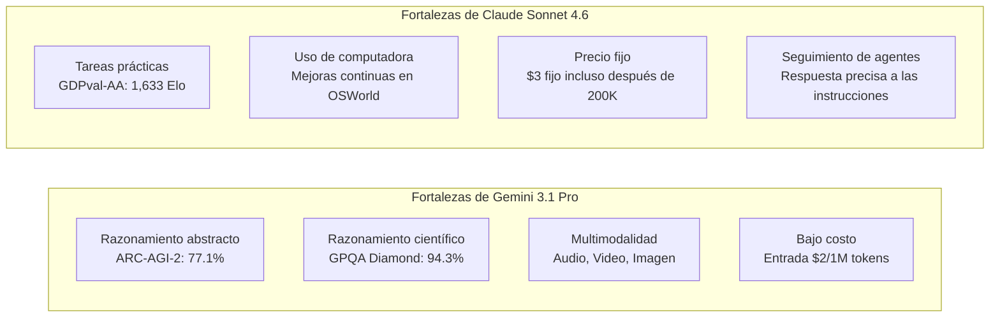

En la tercera semana de febrero de 2026, dos modelos de gran interés irrumpieron en la industria de la IA casi al mismo tiempo. El **Claude Sonnet 4.6** lanzado por Anthropic el 17 de febrero y el **Gemini 3.1 Pro** publicado por Google DeepMind el 19 de febrero. Ambos se autodenominan "modelos de frontera de última generación", destacando la compatibilidad con una ventana de contexto de 1 millón de tokens y una mejora significativa en la capacidad de razonamiento general.

La aparición simultánea de estos dos modelos no es una coincidencia. A medida que el eje de la competencia de los LLM transita de "máximo rendimiento en tareas únicas" a "uso de agentes, procesamiento de contextos largos y eficiencia de costos", ambos apuntan al mismo público objetivo: desarrolladores empresariales y constructores de agentes de IA. Este artículo organiza las especificaciones, cifras de benchmarks y diferencias en características prácticas de ambos modelos, ofreciendo una guía para que los desarrolladores tomen la mejor decisión.

## Antecedentes del lanzamiento: El contexto de la competencia

### Estrategia de Anthropic

El lanzamiento de Claude Sonnet 4.6 llama la atención por su rapidez, a solo 12 días del lanzamiento de Claude Opus 4.6 el 5 de febrero del mismo año. Anthropic ha posicionado la línea "Sonnet", que se distingue por su eficiencia de costos, como el modelo predeterminado para todos los usuarios, desplegándola en todos los niveles, incluidos los planes gratuitos. La estrategia consiste en mejorar significativamente el rendimiento manteniendo el mismo precio que Sonnet 4.5: $3 por entrada / $15 por salida (por millón de tokens).

La evaluación en Claude Code es digna de mención. Se han publicado datos internos que indican que los desarrolladores prefirieron Sonnet 4.6 con un 70% de probabilidad, y en comparación con Opus 4.6, Sonnet fue elegido en el 59% de los casos. El posicionamiento de "Sonnet superando a Opus" en términos de relación precio-rendimiento funciona eficazmente para atraer a entornos de producción sensibles al costo de uso de la API.

Simultáneamente, Anthropic anunció una asociación con Infosys (un gigante indio de TI) el 17 de febrero. El objetivo es integrar los modelos Claude en la plataforma Topaz AI para automatizar flujos de trabajo empresariales complejos en sectores como banca, telecomunicaciones y manufactura, lo cual es una señal de la aceleración de su despliegue empresarial.

### Estrategia de Google DeepMind

Google DeepMind anunció que Gemini 3.1 Pro alcanzó "la puntuación más alta de la historia" en varios benchmarks. En particular, el 77.1% en ARC-AGI-2 (benchmark de razonamiento abstracto) representa un salto cualitativo, casi duplicando el rendimiento de la generación anterior, Gemini 3 Pro. En comparación con Claude Opus 4.6 (68.8%) y GPT-5.2 (52.9%) de la misma época, Gemini demuestra una clara ventaja en ARC-AGI-2.

Además, ha lanzado una ofensiva en cuanto a precios. Para usos generales por debajo de 200K tokens, el precio es de $2 por entrada / $12 por salida (por millón de tokens), un 33-35% más económico que Sonnet 4.6. La postura de afirmar una ventaja tanto en "inteligencia × eficiencia de costos" es clara.

Además, la ventana de contexto de 1 millón de tokens está disponible de inmediato en entornos de producción sin lista de espera, lo que constituye un punto de diferenciación. A diferencia de la versión 1M de Sonnet 4.6, que se considera beta y se implementa gradualmente, Gemini ofrece una ventaja para los desarrolladores que desean comenzar inmediatamente con el análisis de grandes bases de código o repositorios de archivos múltiples.

## Comparación de especificaciones

Organicemos las especificaciones básicas de ambos modelos.

| Elemento | Claude Sonnet 4.6 | Gemini 3.1 Pro |
|:-----|:-----------------|:--------------|
| Fecha de lanzamiento | 17 de febrero de 2026 | 19 de febrero de 2026 |
| Longitud de contexto | 200K (1M en beta) | 1M (predeterminado) |
| Precio de entrada (1 millón de tokens) | $3.00 | $2.00 (≤200K) / $4.00 (excedente) |
| Precio de salida (1 millón de tokens) | $15.00 | $12.00 (≤200K) / $18.00 (excedente) |
| Soporte multimodal | Texto, Imagen | Texto, Imagen, Audio, Video |
| Tokens de salida máximos | 64K | 64K |
| Formato de entrega | API, Claude.ai, Claude Code | API, Gemini.google.com, Vertex AI |

Complementamos la información sobre precios. Gemini 3.1 Pro es más económico para menos de 200K tokens, pero salta a $4/$18 si se excede. Sonnet 4.6 mantiene un precio fijo de $3/$15, por lo que en cargas de trabajo que utilizan intensivamente contextos largos, Sonnet puede ser más predecible en términos de costos. Es importante comprender la distribución de la longitud del contexto durante la estimación de costos de procesamiento por lotes.

## Comparación detallada de benchmarks

### Cifras clave de benchmarks

```
Comparativa de benchmarks (datos públicos de febrero de 2026)

ARC-AGI-2 (Razonamiento abstracto)
  Gemini 3.1 Pro  : 77.1%  ← Claude Opus 4.6 (68.8%), GPT-5.2 (52.9%)
  Claude Sonnet 4.6: 58.3%
  Diferencia: +18.8pt (Ventaja Gemini)

GPQA Diamond (Ciencia a nivel de posgrado)
  Gemini 3.1 Pro  : 94.3%  ← Máxima puntuación de la industria
  Claude Sonnet 4.6: 74.1%
  Diferencia: +20.2pt (Ventaja Gemini)

SWE-Bench Pro (Ingeniería de software)
  Gemini 3.1 Pro  : 54.2%
  Claude Sonnet 4.6: 42.7%
  Diferencia: +11.5pt (Ventaja Gemini)

SWE-Bench Verified (Benchmark oficial de Gemini)
  Gemini 3.1 Pro  : 80.6%

Terminal-Bench 2.0 (Operación de terminal)
  Gemini 3.1 Pro  : 68.5%

GDPval-AA Elo (Tareas de valor económico)
  Claude Sonnet 4.6: 1,633 Elo  ← Nivel que supera incluso a Opus 4.6
  Gemini 3.1 Pro  : 1,317 Elo
  Diferencia: +316pt (Ventaja Sonnet)

MMMLU (Comprensión multilingüe)
  Gemini 3.1 Pro  : 92.6%

Precisión de contexto largo (a 128K tokens)
  Gemini 3.1 Pro  : 84.9%
```

Observando las cifras, Gemini 3.1 Pro supera consistentemente en "benchmarks de razonamiento puro". Por otro lado, GDPval-AA mide la clasificación Elo de "tareas prácticas de valor económico", como la redacción de documentos comerciales, modelado financiero e investigación académica, y aquí Sonnet 4.6 tiene una ventaja abrumadora. El escenario donde el "campeón de benchmarks" y el "campeón de la práctica" son diferentes ilustra de manera concisa la diferencia en las características de ambos modelos.

### Interpretación de los benchmarks

**GPQA Diamond (Graduate-Level Google-Proof Q&A)** es una colección de problemas de nivel de posgrado en ciencias, que mide la capacidad para resolver preguntas difíciles en física, química y biología. Una puntuación de 94.3% es la puntuación más alta de la industria, cercana a lograr "resolver problemas al nivel de un biólogo, químico o físico".

**ARC-AGI-2** es un benchmark diseñado por investigadores de IA para "medir el razonamiento abstracto genuino que no se puede resolver mediante la memorización". Pregunta por la capacidad de abstraer reglas completamente nuevas a partir de un pequeño número de ejemplos. El 77.1% en este benchmark es un nivel notable en toda la industria, un récord que supera a Claude Opus 4.6 (68.8%) y GPT-5.2 (52.9%) de la misma época.

Por otro lado, **GDPval-AA** es una evaluación integral de "tareas prácticas que generan valor económico", que consta de un conjunto de problemas similares a tareas reales como la redacción de informes, análisis financieros y planificación de proyectos. El Elo de 1,633 puntos de Sonnet 4.6 se considera un nivel que supera incluso a Opus 4.6, lo que indica la superioridad destacada de Sonnet en la usabilidad para generar "resultados utilizables".

## Diferencias prácticas

### Asistencia de codificación

Aunque Gemini tiene una ventaja numérica en tareas de codificación, la evaluación subjetiva de los desarrolladores muestra una tendencia diferente. Sonnet 4.6 es muy valorado por su "seguimiento de instrucciones matizadas" y "revisión de código por etapas", y tiene una ventaja en la especificación del formato de revisión de código y la adaptación a las convenciones de codificación personalizadas.

La diferencia en las puntuaciones de SWE-Bench se debe a que muchos escenarios implican que el agente manipule archivos de forma autónoma y realice refactorizaciones a gran escala; en usos de tipo pair programming donde los humanos dan instrucciones detalladas, la capacidad de seguimiento de Sonnet se convierte en una fortaleza.

```python
# Ejemplo de agente utilizando Claude Sonnet 4.6
import anthropic

client = anthropic.Anthropic()

# Analiza toda la base de código con soporte para 1 millón de tokens
with open("large_codebase.txt", "r") as f:
    codebase_content = f.read()

message = client.messages.create(
    model="claude-sonnet-4-6-20260217",
    max_tokens=8192,
    messages=[
        {
            "role": "user",
            "content": (
                "Analiza la siguiente base de código y enumera las vulnerabilidades de seguridad:\n\n"
                + codebase_content
            )
        }
    ]
)
print(message.content[0].text)
```

### Procesamiento de contexto largo y multimodalidad

Gemini 3.1 Pro registró una precisión del 84.9% en el benchmark de contexto largo a 128K tokens, y es capaz de procesar contextos compuestos que incluyen PDFs largos, transcripciones de audio y transcripciones de video. El soporte nativo para audio y video es un elemento diferenciador que Sonnet 4.6 no tiene en la actualidad.

Sonnet 4.6 ofrece funcionalidad de "Uso de Computadora" a nivel práctico, y tiene una alta afinidad con el ecosistema de Anthropic en flujos de trabajo de agentes que incluyen la operación de navegadores y aplicaciones GUI. Se informan mejoras continuas en el benchmark OSWorld, lo que demuestra un historial sólido en la construcción de pipelines de automatización.

### Brecha abrumadora en tareas de conocimiento

La diferencia de puntuación en GDPval-AA (316 puntos Elo) no puede pasarse por alto. En tareas que "convierten conocimiento en resultados prácticos", como el resumen de informes financieros, la redacción de actas de reuniones y la generación de informes analíticos que cruzan múltiples documentos, Sonnet 4.6 tiene una clara ventaja. Esto se considera un reflejo de la política de diseño de Anthropic de "profundizar la comprensión del contexto y mejorar la planificación de agentes".

## Diferencias en la filosofía de diseño de arquitectura

Al analizar las diferencias en la filosofía de diseño de ambos modelos a partir de la información pública, emergen varias comparaciones.

Gemini 3.1 Pro tiene un carácter más de "motor de razonamiento general escalable". Se percibe una dirección arquitectónica que busca el máximo rendimiento en tareas de razonamiento puro tipo ARC-AGI-2, procesando de manera unificada todas las modalidades de entrada, incluyendo audio, video y repositorios de código. El modelo card de Google DeepMind describe detalladamente la evaluación de seguridad basada en el marco "frontier safety", mostrando una postura de diseño preparada para el despliegue a escala global.

Claude Sonnet 4.6 prioriza la finalización de un "agente de ejecución confiable". La combinación de "Uso de Computadora", razonamiento de contexto largo y planificación de agentes son selecciones de funciones que tienen en cuenta la adaptación a flujos de trabajo semi-autónomos donde interviene el ser humano. El historial de automatización de flujos de trabajo complejos en banca, telecomunicaciones y manufactura, acumulado a través de la asociación empresarial con Infosys, se alinea con la estrategia de negocio de Anthropic.



## Tendencias de LLM en 2026 indicadas por la competencia

La aparición simultánea de Claude Sonnet 4.6 y Gemini 3.1 Pro es un buen punto de observación para el estado actual de la competencia de LLM.

**"Precondición" del procesamiento de contexto largo**: Ambos modelos ofrecen contexto de 1 millón de tokens por defecto o en beta, lo que está dejando de ser un elemento diferenciador para convertirse en un requisito previo. Con 1M de tokens, es posible ingresar la base de código completa de un proyecto, junto con documentos relacionados e informes de errores anteriores.

**Aceleración de la optimización para agentes**: El uso de herramientas para agentes, la operación de computadoras y el razonamiento en múltiples pasos son áreas comunes en las que ambos se están centrando. A medida que la adopción de MCP se expande, la competencia también se centra en qué modelo se convertirá en el estándar como tiempo de ejecución de agentes.

**Avance en la competencia de benchmarks**: Se está produciendo una transición de la tasa de respuesta correcta en problemas únicos a métricas que miden "razonamiento in-memorizable" como ARC-AGI-2 o "valor económico" como GDPval-AA. El cambio es de "respuestas precisas" a "resultados utilizables".

**Continuación de la competencia de precios**: El precio de entrada de Gemini de $2/1M es menos de una décima parte del precio de clase GPT-4 en 2023. Si bien la competencia está acelerando la democratización de los modelos, también está aumentando la presión sobre la monetización.

## Guía de uso para desarrolladores

La elección dependerá de "la naturaleza de la tarea", "la distribución de la longitud del contexto" y "la integración con el stack existente".

| Caso de uso | Modelo recomendado | Razón |
|:-----------|:---------|:----|
| Razonamiento científico, demostraciones matemáticas | Gemini 3.1 Pro | GPQA Diamond 94.3% · ARC-AGI-2 77.1% |
| Redacción de informes, análisis financieros | Claude Sonnet 4.6 | Más potente en tareas prácticas con GDPval-AA 1,633 Elo |
| Análisis de bases de código grandes (1M de inmediato) | Gemini 3.1 Pro | 1M disponible para uso en producción sin lista de espera |
| Agentes de operación de computadora | Claude Sonnet 4.6 | Uso de Computadora · Mejoras continuas en OSWorld |
| Multimodalidad que incluye audio y video | Gemini 3.1 Pro | Soporte nativo (Sonnet no lo soporta) |
| Integración con Google Workspace | Gemini 3.1 Pro | Integración nativa |
| Uso frecuente de prompts largos (>200K) | Claude Sonnet 4.6 | Sin variación de costos al exceder (fijo $3) |
| Uso principal de prompts de longitud media (<200K) | Gemini 3.1 Pro | 33% más barato con entrada de $2 |

No se puede afirmar definitivamente cuál "gana". Esa es la respuesta honesta a la competencia actual de LLM. Se requiere que los desarrolladores adopten un enfoque de evaluación para casos de uso específicos, considerando los requisitos de tareas específicas, la estructura de costos y la dificultad de integración con el stack existente.

## Referencias

| Título | Fuente | Fecha | URL |
|:---------|:-------|:-----|:----|
| Anuncio de lanzamiento de Claude Sonnet 4.6 | Anthropic | 2026/02/17 | https://www.anthropic.com/news/claude-sonnet-4-6 |
| Anuncio de lanzamiento de Gemini 3.1 Pro | Google Blog | 2026/02/19 | https://blog.google/innovation-and-ai/models-and-research/gemini-models/gemini-3-1-pro/ |
| Gemini 3.1 Pro Model Card | Google DeepMind | 2026/02/19 | https://deepmind.google/models/model-cards/gemini-3-1-pro/ |
| Deep Comparison of Gemini 3.1 Pro and Claude Sonnet 4.6 | Apiyi.com Blog | 2026/03 | https://help.apiyi.com/en/gemini-3-1-pro-vs-claude-sonnet-4-6-comparison-en.html |
| Gemini 3.1 Pro vs Sonnet 4.6 vs Opus 4.6 vs GPT-5.2 (2026) | AceCloud AI | 2026/03 | https://acecloud.ai/blog/gemini-3-1-pro-vs-sonnet-4-6-vs-opus-4-6-vs-gpt-5-2/ |
| Gemini 3.1 Pro Complete Guide 2026: Benchmarks, Pricing, API | NxCode | 2026/02 | https://www.nxcode.io/en/resources/news/gemini-3-1-pro-complete-guide-benchmarks-pricing-api-2026 |
| Gemini 3.1 Pro Leads Most Benchmarks But Trails Claude Opus 4.6 in Some Tasks | Trending Topics EU | 2026/02 | https://www.trendingtopics.eu/gemini-3-1-pro-leads-most-benchmarks-but-trails-claude-opus-4-6-in-some-tasks/ |
| Gemini 3.1 Pro vs Claude Sonnet 4.6: 2026 Comparison, Benchmarks | AI.cc | 2026/02 | https://www.ai.cc/blogs/gemini-3-1-pro-vs-claude-sonnet-4-6-2026-comparison-benchmarks/ |
| Infosys × Anthropic Partnership for Enterprise AI Agents | TechCrunch | 2026/02/17 | https://techcrunch.com/2026/02/17/as-ai-jitters-rattle-it-stocks-infosys-partners-with-anthropic-to-build-enterprise-grade-ai-agents/ |
| AI Weekly Digest - Week of February 2026 | Synapse AI Digest | 2026/02/21 | https://armes.ai/blog/frontier-model-explosion-february-2026 |

---

> Este artículo fue generado automáticamente por LLM. Puede contener errores.
