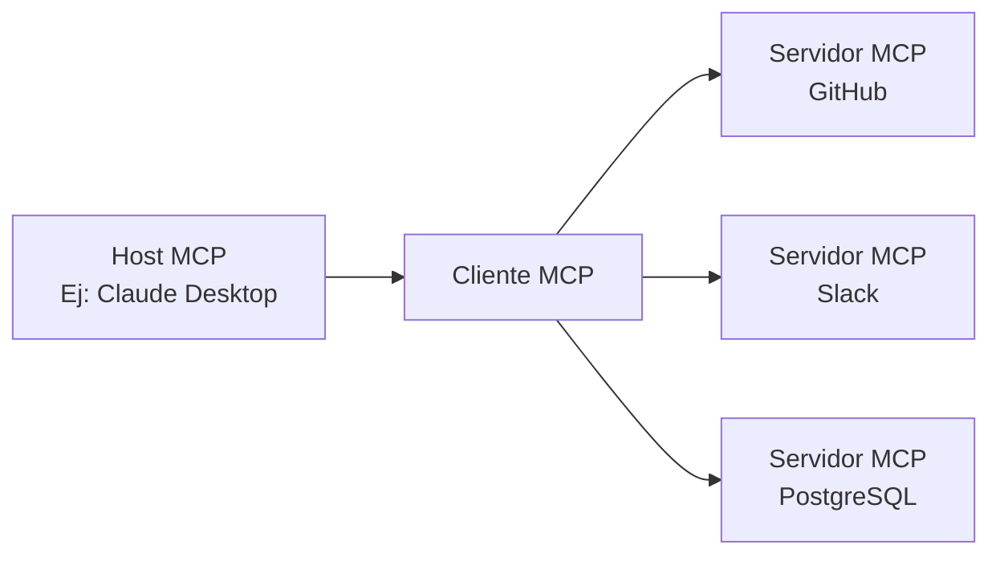

## Introducción

En noviembre de 2024, **Model Context Protocol (MCP)**, anunciado por Anthropic, ha logrado una adopción espectacular en poco más de un año como un nuevo estándar abierto para conectar agentes de IA con herramientas y fuentes de datos externas. Cifras como más de 97 millones de descargas de SDK al mes y más de 10,000 servidores MCP públicos demuestran que ha trascendido las especificaciones técnicas para establecerse como una infraestructura fundamental en la era de los agentes de IA.

Este artículo analiza en profundidad el funcionamiento técnico de MCP, el historial de adopción por parte de OpenAI, Google y Microsoft, el punto de inflexión crucial que supuso su donación a la Linux Foundation, y hasta los desafíos de seguridad que aún se debaten.

---

## MCP Resuelve el "Problema N×M"

### El Problema del Aislamiento de la Información en Sistemas de IA

Antes de la aparición de MCP, la interoperación entre aplicaciones de IA y fuentes de datos externas era sumamente ineficiente. Por ejemplo, para conectar Claude con Slack, GitHub, Google Drive y una base de datos Postgres, era necesario implementar conectores únicos para cada fuente de datos.

Anthropic denominó a esta situación el "**problema N×M**". Si N es el número de fuentes de datos y M es el número de aplicaciones de IA que las utilizan, teóricamente se requerirían N×M implementaciones individuales. El uso de 10 herramientas por 5 aplicaciones de IA implicaría 50 implementaciones personalizadas.

```
【Sin MCP】
Claude  ─── Implementación Única A ──→ GitHub
Claude  ─── Implementación Única B ──→ Slack
GPT-4   ─── Implementación Única C ──→ GitHub  （Casi idéntica a A）
GPT-4   ─── Implementación Única D ──→ Slack   （Casi idéntica a B）

【Con MCP】
Claude ─┐
GPT-4  ─┤── Cliente MCP ──→ Servidor MCP（GitHub）
Gemini ─┘                ──→ Servidor MCP（Slack）
```

MCP resuelve este problema con una estructura "1:N". Una vez implementado como servidor MCP, puede ser utilizado por todos los clientes MCP compatibles.

---

## Arquitectura Técnica de MCP

### Tres Componentes de Capa

MCP adopta una arquitectura cliente-servidor y se compone de tres roles.

| Rol | Descripción |
|:-----|:-----|
| **Host MCP** | La aplicación de IA principal. Gestiona y coordina uno o más Clientes MCP. |
| **Cliente MCP** | Mantiene la conexión con el Servidor MCP y proporciona el contexto al Host. |
| **Servidor MCP** | Proporciona acceso a herramientas externas y fuentes de datos. |



### Base del Protocolo: JSON-RPC 2.0

La capa de mensajería de MCP se basa en JSON-RPC 2.0. Los tipos de mensajes se clasifican en tres categorías:

- **Request**: Petición que requiere una respuesta.
- **Response**: Respuesta a una petición.
- **Notification**: Notificación unidireccional que no requiere respuesta.

### Capa de Transporte

MCP soporta dos métodos principales de transporte:

**stdio (Entrada/Salida Estándar)**
Ideal para la interoperación con recursos locales. Comunica a través de flujos de entrada/salida simples. Ampliamente utilizado para conectar aplicaciones de IA locales como Claude Desktop con servidores MCP locales.

**HTTP Transmitible (anteriormente SSE)**
Realiza la transmisión de mensajes del servidor al cliente a través de HTTP utilizando Server-Sent Events (SSE). Adecuado para tareas de larga ejecución y actualizaciones incrementales. En la actualización de especificaciones de 2025 (versión del 25-11-2025), el nombre del transporte se cambió de "SSE" a "HTTP Transmitible", permitiendo una comunicación bidireccional más flexible.

### Tres Primitivas

Las funcionalidades que un servidor MCP expone al exterior se definen mediante tres tipos de primitivas:

**Recursos (Resources)**
Proporcionan acceso de lectura a fuentes de datos. Ofrecen al sistema de IA datos como sistemas de archivos, bases de datos o respuestas de API de forma consultable.

**Herramientas (Tools)**
Permiten la ejecución de código arbitrario. Se utilizan cuando la IA necesita crear archivos, llamar a APIs o realizar cambios en sistemas externos. La ejecución de herramientas puede tener efectos secundarios, por lo que se requiere una gestión adecuada de permisos.

**Prompts**
Proporcionan plantillas de prompt predefinidas. Permiten comunicar a la IA de forma estructurada los campos necesarios, en lugar de instrucciones ambiguas como "Crea un issue de reporte de errores en GitHub".

---

## Adopción Explosiva: Un Año Después de su Publicación

### Crecimiento del Ecosistema en Números

En el momento de la publicación de MCP en noviembre de 2024, había solo unas 100 servidores MCP públicos. Sin embargo, la velocidad de crecimiento fue asombrosa.

| Momento | Número de Servidores Públicos | Descargas de SDK Mensuales |
|:-----|:---------------|:----------------------|
| Noviembre 2024 (Lanzamiento) | ~100 | — |
| Mayo 2025 | Más de 4,000 | — |
| Diciembre 2025 | Más de 10,000 | 97 millones |

Junto con el lanzamiento de MCP, Anthropic proporcionó servidores MCP de referencia para sistemas empresariales clave como GitHub, Slack, Google Drive, Git, PostgreSQL y Puppeteer. Esto redujo drásticamente la barrera de entrada para los desarrolladores y condujo a una rápida expansión del ecosistema.

### Adopción por las Principales Empresas de IA

MCP se consolidó rápidamente como un estándar de la industria.

**OpenAI (Marzo 2025)**
OpenAI anunció el soporte oficial de MCP en ChatGPT y su API. Aunque la empresa contaba con su propia función de Function Calling, la adopción de un estándar abierto como MCP le permitió integrarse en el vasto ecosistema MCP.

**Google (Abril 2025)**
MCP se integró en el modelo Gemini. El acceso a servidores MCP a través de Google AI Studio y Vertex AI permitió a los clientes empresariales de Google conectar Gemini con sus sistemas internos existentes.

**Microsoft (2025)**
Se añadió soporte para MCP en Copilot Studio y Azure OpenAI Service. La función de cliente MCP también se integró en Visual Studio Code, acelerando la integración entre los flujos de trabajo de desarrollo y la IA.

---

## Donación a la Linux Foundation y Establecimiento de la Agentic AI Foundation

### Un Punto de Inflexión Crucial

En diciembre de 2025, Anthropic tomó una de sus decisiones más importantes: donó MCP a un nuevo fondo bajo la égida de la Linux Foundation, la "**Agentic AI Foundation (AAIF)**".

Esta decisión no fue simplemente un cambio de gobernanza. Anthropic eligió posicionar a MCP no como un "elemento diferenciador de su producto", sino como una infraestructura abierta para la era de los agentes de IA.

### Resumen de la Agentic AI Foundation (AAIF)

AAIF se estableció como un Directed Fund bajo la Linux Foundation.

**Miembros Fundadores Conjuntos**
- Anthropic (Donación de MCP)
- Block (Donación de goose)
- OpenAI (Donación de AGENTS.md)

**Miembros Platino (Participación en la Gobernanza)**
Amazon Web Services, Anthropic, Block, Bloomberg, Cloudflare, Google, Microsoft, OpenAI

**Proyectos Fundadores**
- Model Context Protocol (MCP) — Proporcionado por Anthropic
- goose — Framework para agentes de IA proporcionado por Block
- AGENTS.md — Estándar de descripción de especificaciones de agentes proporcionado por OpenAI

Al unirse a la Linux Foundation, la gobernanza de MCP se volvió independiente de proveedores y dirigida por la comunidad. Esta es una estrategia similar a la que adoptaron Kubernetes (orquestación de contenedores) y NodeJS para convertirse en estándares de la industria bajo la égida de la Linux Foundation.

---

## Comparación entre MCP y REST API

### Diferencias en Filosofía de Diseño

MCP y REST API no son competidores, sino complementarios. Es importante comprender las diferencias en sus filosofías de diseño.

| Aspecto | REST API | MCP |
|:---|:---|:----|
| Cliente Previsto | Software tradicional | LLMs / Agentes de IA |
| Sesión | Sin estado | Con estado |
| Descubrimiento | Se describe por separado con OpenAPI, etc. | El servidor lo publica dinámicamente |
| Múltiples Pasos | Autenticación en cada petición | Eficiencia con mantenimiento de sesión |
| Streaming | Requiere WebSocket, etc. por separado | Soporte nativo con SSE/HTTP Transmitible |

### Por Qué MCP es Adecuado para Agentes de IA

Al considerar un escenario donde un agente de IA llama a múltiples herramientas de forma secuencial, las ventajas de diseño de MCP se vuelven evidentes.

```
【Tarea de revisión de código por un agente de IA】
1. Obtener la diferencia del PR de GitHub → Herramientas MCP
2. Leer los archivos de código relacionados → Recursos MCP
3. Obtener el prompt de revisión de seguridad → Prompts MCP
4. Publicar comentarios de revisión de código en GitHub → Herramientas MCP
```

Al usar REST API, cada paso requiere la adición de cabeceras de autenticación y la retransmisión de contexto. MCP mantiene la sesión, minimizando el costo de autenticación y permitiendo la ejecución eficiente de tareas de múltiples etapas.

Además, los agentes de IA a veces no saben de antemano qué herramientas están disponibles. Los servidores MCP publican dinámicamente las Herramientas, Recursos y Prompts que ofrecen, permitiendo que los agentes realicen descubrimientos en tiempo de ejecución y seleccionen/utilicen las herramientas apropiadas.

---

## Desafíos de Seguridad

### Riesgos de Seguridad de MCP

Frente a la velocidad de adopción de 97 millones de descargas mensuales, los investigadores de seguridad han expresado su preocupación por la rápida popularización de MCP. Los principales riesgos de seguridad son:

**Riesgo de Fuga de Tokens**
MCP adopta OAuth 2.1 como marco de autorización, pero si los tokens de acceso cacheados o registrados en logs son filtrados por el cliente o el servidor, un atacante podría acceder a recursos protegidos como si fuera una petición legítima.

**Ataque de Confused Deputy**
Cuando un servidor MCP actúa como un proxy OAuth, una verificación inadecuada del contexto de autorización podría permitir a un atacante ejecutar operaciones contra el servidor utilizando las credenciales de otro usuario.

**Gestión del Registro Dinámico de Clientes**
Utilizando el registro dinámico de clientes de OAuth, los clientes MCP pueden añadir dinámicamente configuraciones de cliente OAuth al servidor. Sin embargo, la gestión y eliminación de las configuraciones de cliente añadidas no están ampliamente soportadas por las RFCs, dejando problemas de gestión sin resolver.

### Respuesta en la Actualización de Especificaciones de Junio de 2025

La actualización de especificaciones de MCP de junio de 2025 tuvo como tema principal el refuerzo de la seguridad.

- **Requisito de PKCE (Proof Key for Code Exchange)**: Se hizo obligatorio implementar PKCE de acuerdo con la Sección 7.5.2 de OAuth 2.1. Esto previene ataques de interceptación e inyección de códigos de autorización.
- **Introducción de Indicadores de Recursos (RFC 8707)**: Para garantizar que los tokens solo sean válidos para el servidor MCP previsto, se hizo obligatorio incluir indicadores de recursos en las peticiones de token. Esto evita el "uso indebido de tokens" (token mis-redemption).
- **Prohibición de Token Passthrough**: Se especificó claramente que los servidores MCP no deben aceptar tokens emitidos explícitamente para su propio servidor.

---

## Ecosistema Actual y Perspectivas Futuras

### Ejemplos de Servidores MCP Principales

A partir de 2026, los servidores MCP se ofrecen ampliamente en las siguientes categorías:

**Herramientas de Desarrollo**
- Servidor MCP de GitHub (Gestión de PR, revisión de código)
- Servidor MCP de Git (Operaciones de repositorio local)
- Conjuntos de servidores MCP integrados en VS Code

**Datos e Infraestructura**
- Servidor MCP de PostgreSQL
- Servidor MCP de SQLite
- Servidor MCP de Cloudflare Workers

**Comunicación y Productividad**
- Servidor MCP de Slack
- Servidor MCP de Google Drive
- Servidor MCP de Notion

**IA e Investigación**
- Servidor MCP de Brave Search
- Servidor MCP de Puppeteer (Web scraping)
- Servidor MCP de Fetch

### Preparación para la Era de los Agentes Autónomos

El problema fundamental que MCP intenta resolver es crear un "entorno donde los agentes de IA puedan utilizar herramientas". La transición desde una fase en la que un único modelo de IA opera de forma independiente a sistemas multiagente donde múltiples agentes de IA comparten herramientas y colaboran está cobrando impulso, y la importancia de MCP como lenguaje común está creciendo.

Con la creación de AAIF, MCP ha abandonado su posición como un producto de Anthropic y ha comenzado su camino hacia la evolución como una infraestructura compartida por la industria. Al igual que Kubernetes y NodeJS se han consolidado como estándares de la industria bajo la protección de la Linux Foundation, la respuesta a si MCP puede convertirse en el "TCP/IP" de la era de los agentes de IA se revelará en los próximos dos o tres años.

---

## Resumen

MCP representa un cambio tecnológico crucial en tres aspectos:

**1. Resolución del Problema N×M**
La estandarización de la conexión entre sistemas de IA y herramientas externas ha reducido drásticamente los costos de desarrollo.

**2. Formación de Consenso en Toda la Industria**
Aunque es un protocolo originado por Anthropic, logró convertirse en un estándar de la industria con la participación de OpenAI, Google y Microsoft como miembros platino de AAIF, formando un consenso entre competidores.

**3. Neutralidad en la Gobernanza**
La donación a la Linux Foundation ha establecido un modelo de gobernanza abierta que elimina la dependencia de proveedores específicos.

A partir de 2026, cuando los agentes de IA se integren en la práctica profesional, MCP continuará funcionando como su infraestructura subyacente. Para los desarrolladores, comprender el funcionamiento de MCP y utilizar los servidores MCP apropiados se está convirtiendo en el punto de partida para la construcción de sistemas integrados de IA.

---

## Referencias

| Título | Fuente | Fecha | URL |
|:---------|:-------|:-----|:----|
| Introducing the Model Context Protocol | Anthropic | 2024-11-25 | https://www.anthropic.com/news/model-context-protocol |
| Donating the Model Context Protocol and establishing the Agentic AI Foundation | Anthropic | 2025-12-09 | https://www.anthropic.com/news/donating-the-model-context-protocol-and-establishing-of-the-agentic-ai-foundation |
| MCP joins the Agentic AI Foundation | MCP Blog | 2025-12-09 | http://blog.modelcontextprotocol.io/posts/2025-12-09-mcp-joins-agentic-ai-foundation/ |
| Linux Foundation Announces the Formation of the Agentic AI Foundation (AAIF) | Linux Foundation | 2025-12-09 | https://www.linuxfoundation.org/press/linux-foundation-announces-the-formation-of-the-agentic-ai-foundation |
| Model Context Protocol Specification 2025-11-25 | modelcontextprotocol.io | 2025-11-25 | https://modelcontextprotocol.io/specification/2025-11-25 |
| MCP joins the Linux Foundation: What this means for developers | GitHub Blog | 2025-12-09 | https://github.blog/open-source/maintainers/mcp-joins-the-linux-foundation-what-this-means-for-developers-building-the-next-era-of-ai-tools-and-agents/ |
| Model Context Protocol (MCP): Understanding security risks and controls | Red Hat | 2025 | https://www.redhat.com/en/blog/model-context-protocol-mcp-understanding-security-risks-and-controls |
| MCP Specs Update — All About Auth | Auth0 | 2025-06 | https://auth0.com/blog/mcp-specs-update-all-about-auth/ |
| Why the Model Context Protocol Won | The New Stack | 2025 | https://thenewstack.io/why-the-model-context-protocol-won/ |
| A Year of MCP: From Internal Experiment to Industry Standard | Pento | 2025-12 | https://www.pento.ai/blog/a-year-of-mcp-2025-review |
| Model Context Protocol - Wikipedia | Wikipedia | 2026 | https://en.wikipedia.org/wiki/Model_Context_Protocol |

---

> Este artículo fue generado automáticamente por LLM. Puede contener errores.
