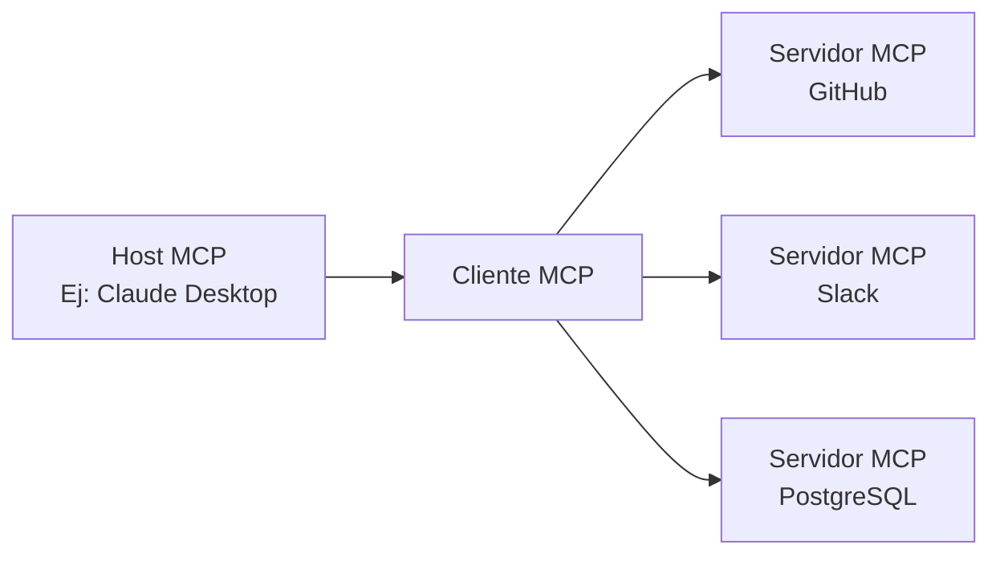

## Introducción

En noviembre de 2024, Anthropic anunció el **Model Context Protocol (MCP)**, un nuevo estándar abierto para conectar agentes de IA con herramientas y fuentes de datos externas que ha experimentado una adopción dramática en poco más de un año. Cifras como más de 97 millones de descargas mensuales de SDK y más de 10,000 servidores MCP públicos demuestran que ha trascendido el estatus de mera especificación técnica para afianzarse como la infraestructura fundamental de la era de los agentes de IA.

Este artículo proporciona una explicación exhaustiva, desde los mecanismos técnicos de MCP, pasando por la historia de su adopción por parte de OpenAI, Google y Microsoft, hasta el hito crucial de su donación a la Linux Foundation y los desafíos de seguridad que aún son objeto de debate.

---

## MCP Resuelve el "Problema N×M"

### El Problema del Aislamiento de la Información en Sistemas de IA

Antes de la aparición de MCP, la interconexión de aplicaciones de IA con fuentes de datos externas era ineficiente. Por ejemplo, para conectar Claude con Slack, GitHub, Google Drive y una base de datos Postgres, se requeriría implementar conectores específicos para cada fuente de datos.

Anthropic denominó a esta situación el "**problema N×M**". Si N es el número de fuentes de datos y M es el número de aplicaciones de IA que las utilizan, teóricamente se necesitarían N×M implementaciones individuales. Usar 10 herramientas con 5 aplicaciones de IA ya implicaría 50 implementaciones personalizadas.

```
【Sin MCP】
Claude  ─── Implementación Única A ──→ GitHub
Claude  ─── Implementación Única B ──→ Slack
GPT-4   ─── Implementación Única C ──→ GitHub  (Casi idéntica a A)
GPT-4   ─── Implementación Única D ──→ Slack   (Casi idéntica a B)

【Con MCP】
Claude ─┐
GPT-4  ─┤── Cliente MCP ──→ Servidor MCP (GitHub)
Gemini ─┘                ──→ Servidor MCP (Slack)
```

MCP resuelve este problema con una estructura "1:N". Una vez implementado como un servidor MCP, puede ser utilizado por todos los clientes de IA compatibles con MCP.

---

## Arquitectura Técnica de MCP

### Componentes de Tres Capas

MCP adopta una arquitectura cliente-servidor y se compone de tres roles:

| Rol | Descripción |
|:-----|:-----|
| **Host MCP** | La aplicación de IA principal. Gestiona y coordina uno o varios Clientes MCP. |
| **Cliente MCP** | Mantiene la conexión con el Servidor MCP y proporciona el contexto al Host. |
| **Servidor MCP** | Proporciona acceso a herramientas y fuentes de datos externas. |



### Base del Protocolo: JSON-RPC 2.0

La capa de mensajería de MCP se basa en JSON-RPC 2.0. Los tipos de mensajes se clasifican en tres categorías:

- **Request**: Una solicitud que espera una respuesta.
- **Response**: Una respuesta a una solicitud.
- **Notification**: Una notificación unidireccional que no requiere respuesta.

### Capa de Transporte

MCP admite dos métodos de transporte principales:

**stdio (Entrada/Salida Estándar)**
Ideal para la integración con recursos locales. La comunicación se realiza a través de flujos de entrada/salida simples. Se utiliza ampliamente para conectar aplicaciones de IA locales como Claude Desktop con servidores MCP locales.

**HTTP Transmitible (anteriormente SSE)**
Permite el envío de mensajes de transmisión de servidor a cliente a través de HTTP utilizando Server-Sent Events (SSE). Es adecuado para tareas de larga duración y actualizaciones incrementales. En la actualización de especificaciones de 2025 (versión del 25/11/2025), el nombre del transporte se cambió de "SSE" a "HTTP Transmitible", permitiendo una comunicación bidireccional más flexible.

### Tres Primitivas

Las funcionalidades que un servidor MCP expone externamente se definen mediante tres tipos de primitivas:

**Resources (Recursos)**
Proporciona acceso de lectura a fuentes de datos. Se presentan en un formato que la IA puede consultar, como sistemas de archivos, bases de datos o respuestas de API.

**Tools (Herramientas)**
Permite la ejecución de código arbitrario. Se utilizan cuando la IA necesita crear archivos, llamar a APIs o realizar cambios en sistemas externos. La ejecución de herramientas conlleva efectos secundarios, por lo que se requiere una gestión adecuada de permisos.

**Prompts (Indicaciones)**
Proporciona plantillas de indicaciones predefinidas. Permite transmitir a la IA información estructurada y necesaria en lugar de una instrucción ambigua como "Crea un issue para un informe de error en GitHub".

---

## Adopción Explosiva: Un Año Después de su Publicación

### Crecimiento del Ecosistema en Cifras

En noviembre de 2024, cuando se publicó MCP, solo había unos 100 servidores MCP públicos. Sin embargo, la velocidad de crecimiento fue asombrosa.

| Momento | Número de Servidores Públicos | Descargas Mensuales de SDK | 
|:-----|:---------------|:----------------------|
| Noviembre 2024 (Lanzamiento) | ~100 | — |
| Mayo 2025 | > 4,000 | — |
| Diciembre 2025 | > 10,000 | 97 millones |

Anthropic proporcionó servidores MCP de referencia para sistemas empresariales clave como GitHub, Slack, Google Drive, Git, PostgreSQL y Puppeteer junto con el lanzamiento de MCP. Esto redujo significativamente la barrera de entrada para los desarrolladores y condujo a una rápida expansión del ecosistema.

### Adopción por Empresas Líderes de IA

MCP se consolidó rápidamente como el estándar de la industria.

**OpenAI (Marzo de 2025)**
OpenAI anunció el soporte oficial de MCP en ChatGPT y su API. Aunque la empresa tenía su propia función de Function Calling desde hace tiempo, la adopción de MCP, un estándar abierto, le permitió integrarse en el vasto ecosistema de MCP.

**Google (Abril de 2025)**
MCP se integró en el modelo Gemini. El acceso a los servidores MCP estuvo disponible a través de Google AI Studio y Vertex AI, permitiendo a los clientes empresariales de Google conectar Gemini con sus sistemas internos existentes.

**Microsoft (2025)**
Se añadió soporte para MCP en Copilot Studio y Azure OpenAI Service. La funcionalidad de cliente MCP también se integró en Visual Studio Code, acelerando la integración del flujo de trabajo de desarrollo con la IA.

---

## Donación a la Linux Foundation y Establecimiento de la Agentic AI Foundation

### Un Hito Crucial

En diciembre de 2025, Anthropic tomó una de sus decisiones más importantes: donó MCP a un nuevo fondo bajo la Linux Foundation, la "**Agentic AI Foundation (AAIF)**".

Esta decisión no fue solo un cambio de gobernanza. Anthropic eligió posicionar MCP no como un "elemento diferenciador de su producto", sino como una infraestructura abierta para la era de los agentes de IA.

### Resumen de la Agentic AI Foundation (AAIF)

AAIF se estableció como un Fondo Dirigido (Directed Fund) bajo la Linux Foundation.

**Miembros Fundadores Conjuntos**
- Anthropic (donación de MCP)
- Block (donación de goose)
- OpenAI (donación de AGENTS.md)

**Miembros Platino (Participación en Gobernanza)**
Amazon Web Services, Anthropic, Block, Bloomberg, Cloudflare, Google, Microsoft, OpenAI

**Proyectos Fundadores**
- Model Context Protocol (MCP) — proporcionado por Anthropic
- goose — un framework de agentes de IA proporcionado por Block
- AGENTS.md — un estándar de descripción de especificaciones de agentes proporcionado por OpenAI

Al integrarse bajo la Linux Foundation, la gobernanza de MCP se volvió neutral para el proveedor y dirigida por la comunidad. Esta es una estrategia similar a la que hizo que Kubernetes (orquestación de contenedores) y NodeJS se establecieran como estándares de la industria bajo la Linux Foundation.

---

## Comparación entre MCP y REST API

### Diferencias en la Filosofía de Diseño

MCP y REST API no son competidores, sino que tienen una relación complementaria. Es importante comprender las diferencias en su filosofía de diseño.

| Aspecto | REST API | MCP |
|:---------|:---------|:----|
| Cliente Previsto | Software Tradicional | LLMs · Agentes de IA |
| Sesión | Sin Estado | Con Estado |
| Descubrimiento | Se describe por separado con OpenAPI, etc. | El servidor lo publica dinámicamente |
| Múltiples Pasos | Autenticación en cada solicitud | Eficiencia mediante el mantenimiento de sesiones |
| Transmisión | WebSocket, etc., requeridos por separado | Soporte nativo con SSE/HTTP Transmitible |

### Razones por las que MCP es Adecuado para Agentes de IA

Al considerar un escenario donde un agente de IA llama a múltiples herramientas de forma consecutiva, las ventajas del diseño de MCP se vuelven claras.

```
【Tarea de Revisión de Código por Agente de IA】
1. Obtener la diferencia de la PR de GitHub → Herramientas MCP
2. Leer los archivos de código relacionados → Recursos MCP
3. Obtener la indicación para la verificación de seguridad → Indicaciones MCP
4. Publicar comentarios de revisión de código en GitHub → Herramientas MCP
```

Usando REST API, cada paso requeriría la adición de encabezados de autenticación y la retransmisión del contexto. Con MCP, la sesión se mantiene, lo que permite una ejecución eficiente de tareas de múltiples pasos minimizando los costos de autenticación.

Además, los agentes de IA a veces no saben de antemano qué herramientas están disponibles. Dado que los servidores MCP publican dinámicamente las Herramientas, Recursos e Indicaciones que proporcionan, los agentes pueden descubrir y seleccionar/utilizar las herramientas adecuadas en tiempo de ejecución.

---

## Desafíos de Seguridad

### Riesgos de Seguridad de MCP

En respuesta a la velocidad de adopción de 97 millones de descargas mensuales, los investigadores de seguridad también han expresado su preocupación por la rápida difusión de MCP. Los principales riesgos de seguridad son los siguientes:

**Riesgo de Fuga de Tokens**
MCP utiliza OAuth 2.1 como marco de autorización, pero si los tokens de acceso almacenados en caché o registrados en logs se filtran en el lado del cliente o del servidor, un atacante podría acceder a recursos protegidos como si fuera una solicitud legítima.

**Ataque Confused Deputy**
Cuando un servidor MCP actúa como un proxy OAuth, una validación inadecuada del contexto de autorización podría permitir que un atacante ejecute operaciones en el servidor que abusen de las credenciales de otro usuario.

**Gestión del Registro Dinámico de Clientes**
Con el registro dinámico de clientes de OAuth, un cliente MCP puede añadir dinámicamente configuraciones de clientes OAuth en el servidor. Sin embargo, la RFC no admite ampliamente la gestión y eliminación de las configuraciones de clientes añadidas, dejando problemas de gestión sin resolver.

### Respuesta en la Actualización de Especificaciones de Junio de 2025

La actualización de las especificaciones de MCP de junio de 2025 tuvo como tema principal el fortalecimiento de la seguridad.

- **Obligatoriedad de PKCE (Proof Key for Code Exchange)**: La implementación de PKCE es obligatoria de acuerdo con la Sección 7.5.2 de OAuth 2.1. Esto previene ataques de interceptación e inyección de códigos de autorización.
- **Introducción de Indicadores de Recursos (RFC 8707)**: Para garantizar que los tokens sean válidos solo para el servidor MCP previsto, se hizo obligatorio incluir indicadores de recursos en las solicitudes de tokens. Esto previene el "uso indebido de tokens (token mis-redemption)".
- **Prohibición de Token Passthrough**: Se especificó claramente que los servidores MCP no deben aceptar tokens que no se hayan emitido explícitamente para su propio servidor.

---

## Ecosistema Actual y Perspectivas Futuras

### Ejemplos de Servidores MCP Principales

Actualmente, en 2026, los servidores MCP se ofrecen ampliamente en las siguientes categorías:

**Herramientas de Desarrollo**
- Servidor MCP de GitHub (gestión de PR, revisión de código)
- Servidor MCP de Git (operaciones de repositorio local)
- Conjunto de servidores MCP integrados en VS Code

**Datos e Infraestructura**
- Servidor MCP de PostgreSQL
- Servidor MCP de SQLite
- Servidor MCP de Cloudflare Workers

**Comunicación y Productividad**
- Servidor MCP de Slack
- Servidor MCP de Google Drive
- Servidor MCP de Notion

**IA e Investigación**
- Servidor MCP de Brave Search
- Servidor MCP de Puppeteer (web scraping)
- Servidor MCP de Fetch

### Un Paso Hacia la Era de los Agentes Autónomos

El problema que MCP busca resolver en esencia es crear un "entorno donde los agentes de IA puedan utilizar herramientas". A medida que avanza la transición de una fase donde modelos de IA individuales operan de forma independiente a sistemas de agentes múltiples donde múltiples agentes de IA comparten herramientas y colaboran, la importancia de MCP como lenguaje común está creciendo.

Con el establecimiento de AAIF, MCP ha pasado de ser un producto de Anthropic a evolucionar hacia una infraestructura industrial común. Al igual que Kubernetes y NodeJS, que se han convertido en estándares de la industria bajo la égida de la Linux Foundation, la respuesta a si MCP puede convertirse en el "TCP/IP" de la era de los agentes de IA se revelará en los próximos dos o tres años.

---

## Resumen

MCP representa un cambio tecnológico significativo en tres aspectos:

**1. Resolución del Problema N×M**
Al estandarizar la conexión entre sistemas de IA y herramientas externas, se ha reducido drásticamente el costo de desarrollo.

**2. Formación de Consenso en Toda la Industria**
Aunque es un protocolo iniciado por Anthropic, ha logrado formar un estándar de la industria que incluye a competidores, con OpenAI, Google y Microsoft participando como miembros platino de AAIF.

**3. Neutralidad de la Gobernanza**
Mediante la donación a la Linux Foundation, se ha establecido un modelo de gobernanza abierta que elimina la dependencia de proveedores específicos.

A partir de 2026, cuando los agentes de IA se integren en la práctica, MCP continuará funcionando como su infraestructura subyacente. Para los desarrolladores, comprender el funcionamiento de MCP y utilizar los servidores MCP apropiados se está convirtiendo en el punto de partida para la construcción de sistemas integrados de IA.

---

## Referencias

| Título | Fuente | Fecha | URL |
|:---------|:-------|:-----|:----|
| Introducing the Model Context Protocol | Anthropic | 2024-11-25 | https://www.anthropic.com/news/model-context-protocol |
| Donating the Model Context Protocol and establishing the Agentic AI Foundation | Anthropic | 2025-12-09 | https://www.anthropic.com/news/donating-the-model-context-protocol-and-establishing-of-the-agentic-ai-foundation |
| MCP joins the Agentic AI Foundation | Blog de MCP | 2025-12-09 | http://blog.modelcontextprotocol.io/posts/2025-12-09-mcp-joins-agentic-ai-foundation/ |
| Linux Foundation Announces the Formation of the Agentic AI Foundation (AAIF) | Linux Foundation | 2025-12-09 | https://www.linuxfoundation.org/press/linux-foundation-announces-the-formation-of-the-agentic-ai-foundation |
| Model Context Protocol Specification 2025-11-25 | modelcontextprotocol.io | 2025-11-25 | https://modelcontextprotocol.io/specification/2025-11-25 |
| MCP joins the Linux Foundation: What this means for developers | Blog de GitHub | 2025-12-09 | https://github.blog/open-source/maintainers/mcp-joins-the-linux-foundation-what-this-means-for-developers-building-the-next-era-of-ai-tools-and-agents/ |
| Model Context Protocol (MCP): Understanding security risks and controls | Red Hat | 2025 | https://www.redhat.com/en/blog/model-context-protocol-mcp-understanding-security-risks-and-controls |
| MCP Specs Update — All About Auth | Auth0 | 2025-06 | https://auth0.com/blog/mcp-specs-update-all-about-auth/ |
| Why the Model Context Protocol Won | The New Stack | 2025 | https://thenewstack.io/why-the-model-context-protocol-won/ |
| A Year of MCP: From Internal Experiment to Industry Standard | Pento | 2025-12 | https://www.pento.ai/blog/a-year-of-mcp-2025-review |
| Model Context Protocol - Wikipedia | Wikipedia | 2026 | https://en.wikipedia.org/wiki/Model_Context_Protocol |

---

> Este artículo fue generado automáticamente por LLM. Puede contener errores.
