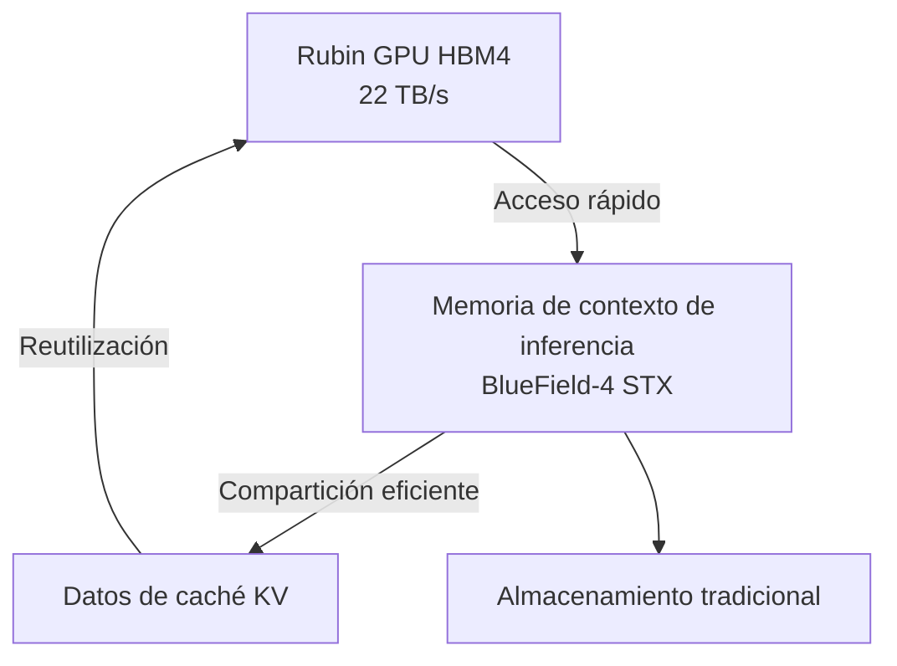
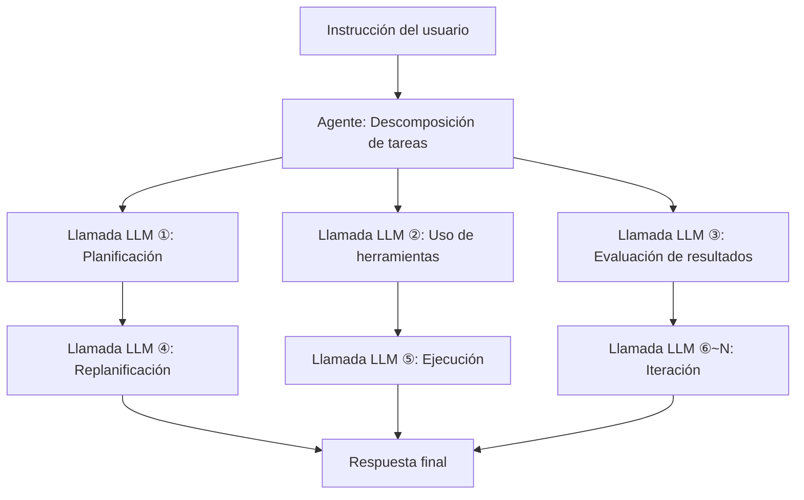

## Introducción: ¿Por qué el costo de inferencia es un problema ahora?

A medida que avanzamos en 2026, el debate en torno a la IA está cambiando rápidamente de "rendimiento del modelo" a "economía del costo de inferencia". La capacidad de los modelos de lenguaje grandes (LLM) ya no está en duda, pero el "costo de inferencia por token" se ha convertido en un obstáculo para la implementación empresarial real.

Particularmente, la IA de agentes requiere cientos o miles de llamadas a LLM para completar una sola tarea. Esto incurre en costos de un orden de magnitud diferente a las consultas simples, lo que dificulta la escalabilidad.

En la conferencia magistral GTC 2026 en marzo de 2026, el CEO de NVIDIA, Jensen Huang, resumió esta situación: "Si tienen más capacidad, pueden generar más tokens y aumentar los ingresos. Con las aplicaciones de IA de agentes que ahora generan otros agentes para realizar tareas sucesivas, el número de tokens generados está explotando". Hizo hincapié en la importancia de una infraestructura de inferencia rápida y de bajo costo.

La respuesta de NVIDIA a esto es la plataforma **Vera Rubin**. Revelada por primera vez en CES 2026 (enero de 2026) y detallada en GTC 2026 (marzo de 2026), esta infraestructura de IA de próxima generación promete reducir el costo de inferencia hasta 10 veces en comparación con Blackwell, atrayendo la atención de la industria.

En este artículo, profundizaremos técnicamente en la arquitectura de Vera Rubin, exploraremos por qué se puede lograr tal reducción de costos y consideraremos su impacto en el futuro de la IA de agentes.

---

## ¿Qué es Vera Rubin?: Un "supercomputador de IA" con 7 chips integrados

Vera Rubin no es un solo chip GPU, sino una **plataforma de IA integrada diseñada de forma extremadamente colaborativa (co-design) con 7 tipos de chips especializados**. NVIDIA lo llama "Extreme Co-Design". En GTC 2026, NVIDIA confirmó oficialmente la adquisición de Groq en diciembre de 2025 por aproximadamente $20 mil millones, y el Groq 3 LPU se añadió a la plataforma como el séptimo chip.

Los 7 chips que componen el sistema son los siguientes:

| Chip | Rol |
|---|---|
| **Vera CPU** | CPU personalizada para IA (88 núcleos Olympus) |
| **Rubin GPU** | Núcleo de cómputo de IA (50 PFLOPS NVFP4) |
| **NVLink 6 Switch** | Comunicación de alta velocidad entre GPUs (3.6 TB/s) |
| **ConnectX-9 SuperNIC** | Procesamiento de red |
| **BlueField-4 DPU** | Procesamiento de datos y memoria de contexto de inferencia |
| **Spectrum-6 Ethernet Switch** | Comunicación Ethernet |
| **Groq 3 LPU** | Acelerador de inferencia de baja latencia (añadido recientemente) |

Todo este sistema se integra a nivel de rack y se ofrece en el factor de forma **Vera Rubin NVL72**. Esta configuración integra 72 GPUs Rubin y 36 CPUs Vera en un solo rack. Para implementaciones aún más grandes, también se ofrece una configuración a escala de 40 racks llamada **Vera Rubin POD**, que proporciona una capacidad de cómputo de 60 exaFLOPS.

---

## Vera CPU: Un procesador propio diseñado para IA

Uno de los puntos de gran diferencia de Vera Rubin con respecto a las plataformas anteriores es la adopción de la **CPU personalizada "Vera" diseñada por NVIDIA**.

Vera está equipada con **88 núcleos Olympus**. Olympus es un núcleo diseñado por NVIDIA basado en el conjunto de instrucciones ARMv9.2, optimizado específicamente para cargas de trabajo de centros de datos de IA. Cada núcleo puede procesar 2 hilos en paralelo mediante la tecnología "Spatial Multithreading", proporcionando una capacidad de procesamiento total de **176 hilos**. La caché L3 se ha incrementado en un 40% a 162 MB, y el número de transistores ha alcanzado los 227 mil millones, 2.2 veces más que la generación anterior.

Cabe destacar el soporte para precisión FP8. Vera CPU es la primera CPU de la industria en admitir FP8 de forma nativa, lo que permite el procesamiento unificado de cargas de trabajo de IA completas en formatos numéricos de baja precisión.

En términos de memoria, cuenta con hasta **1.5 TB de memoria SOCAMM LPDDR5X** y ofrece un ancho de banda de memoria de **1.2 TB/s**. Al expandir el ancho del bus de memoria a 1024 bits y aumentar la velocidad a 9600 MT/s, se logra un ancho de banda 2.5 veces mayor que la generación anterior. Aún más importante es la conexión con la GPU Rubin. Mediante **NVLink-C2C de segunda generación (Chip-to-Chip)**, se logra un ancho de banda coherente de **1.8 TB/s** entre CPU y GPU. Esto es 7 veces más rápido que PCIe Gen 6.

### ¿Por qué se necesita una CPU personalizada?

Los servidores de IA tradicionales han utilizado CPUs de propósito general, pero las CPUs a menudo se convierten en cuellos de botella en la inferencia de LLM. Esto se debe a que el ancho de banda de memoria y la velocidad de conexión de la CPU host no pueden igualar la capacidad de procesamiento de la GPU.

Reconociendo que la inferencia de LLM está limitada por el ancho de banda de memoria y la interconexión, NVIDIA optimizó el sistema completo mediante el diseño personalizado de la CPU. El enlace coherente de alta velocidad entre CPU y GPU minimiza la sobrecarga de transferencia de datos y mejora la utilización de la GPU.

---

## Rubin GPU: El motor de cómputo de próxima generación especializado en inferencia

La GPU Rubin incorpora numerosas innovaciones especializadas en la inferencia de IA.

### Especificaciones principales

| Elemento | Valor |
|---|---|
| Rendimiento de inferencia NVFP4 | **50 PFLOPS** (5 veces Blackwell) |
| Rendimiento de entrenamiento NVFP4 | **35 PFLOPS** (3.5 veces Blackwell) |
| Memoria HBM4 | **288 GB** (por unidad) |
| Ancho de banda de memoria HBM4 | **22 TB/s** |
| Ancho de banda NVLink 6 | **3.6 TB/s** (por GPU) |
| Número de transistores | **336 mil millones** |

Particularmente destacable es la adopción de **HBM4**. En comparación con la generación anterior, HBM3, el ancho de banda de memoria ha mejorado aproximadamente 2.8 veces, abordando directamente el problema de que la inferencia de LLM está limitada por el ancho de banda de memoria.

### NVFP4 y el motor Transformer de tercera generación

La GPU Rubin está equipada con un **motor Transformer de tercera generación** que aprovecha un nuevo formato numérico de baja precisión llamado NVFP4. NVFP4 tiene una densidad aritmética aún mayor que NVFP8 adoptado por Blackwell, logrando una mejora significativa en el rendimiento manteniendo la precisión. NVIDIA logró una mejora en el rendimiento efectivo que va más allá del simple aumento de FLOPS al integrar profundamente esta ejecución de baja precisión tanto en la arquitectura como en la pila de software.

---

## NVLink 6: Infraestructura de comunicación que rompe el muro del ancho de banda

En la inferencia de LLM, especialmente en modelos Mixture-of-Experts (MoE) y entornos multi-GPU, el **ancho de banda de comunicación entre GPUs** determina el rendimiento.

NVLink 6 duplica el **ancho de banda** en comparación con la generación anterior (NVLink 5).

| Métrica | NVLink 5 | NVLink 6 |
|---|---|---|
| Ancho de banda por switch | 1,800 GB/s | **3,600 GB/s** |
| Ancho de banda por GPU | Aprox. 1.8 TB/s | **3.6 TB/s** |
| Rack NVL72 completo | — | **260 TB/s** |

El ancho de banda interno de 260 TB/s proporcionado por el rack NVL72 permite la inferencia eficiente de modelos MoE a gran escala.

---

## Groq 3 LPU: Acelerador de inferencia de baja latencia

Una de las mayores sorpresas de GTC 2026 fue la integración de la tecnología LPU (Language Processing Unit) de Groq en la plataforma Vera Rubin. NVIDIA adquirió Groq el 24 de diciembre de 2025 por aproximadamente $20 mil millones, asegurando al personal de alto nivel y obteniendo una licencia no exclusiva de la tecnología LPU de Groq.

### Reparto de roles entre GPU y LPU

En el sistema Vera Rubin, Rubin y Groq se reparten el proceso de inferencia.


- **Rubin GPU**: Responsable del procesamiento Prefill y la atención de decodificación.
- **Groq 3 LPU**: Responsable de la ejecución de la red Feed-Forward (FFN).

Este modelo de división del trabajo permite que cada chip se concentre en el procesamiento para el que es más adecuado.

### Especificaciones del rack Groq 3 LPX

El **rack Groq 3 LPX** anunciado en GTC 2026 está equipado con 256 LPU.

| Elemento | Valor |
|---|---|
| Capacidad SRAM (por chip) | **500 MB** |
| Ancho de banda SRAM (por chip) | **150 TB/s** |
| Ancho de banda de escalado (por chip) | **2.5 TB/s** |
| Capacidad total SRAM en chip (por rack) | **128 GB** |
| Ancho de banda de escalado (por rack) | **640 TB/s** |

Groq 3 está diseñado priorizando el ancho de banda sobre la capacidad, con un ancho de banda de aproximadamente 80 TB/s por chip. Este diseño centrado en SRAM de alto ancho de banda permite una baja latencia en el procesamiento FFN.

### Efecto de la integración

La combinación de Vera Rubin y Groq LPX permite que el **rendimiento de inferencia de modelos de billones de parámetros aumente hasta 35 veces** y que el **rendimiento por megavatio se incremente 35 veces** en comparación con la GPU Rubin sola. Esto se logra sin necesidad de cambios importantes en la plataforma CUDA, utilizando los LPU como aceleradores de decodificación altamente especializados.

---

## Almacenamiento de memoria de contexto de inferencia: Especialización en IA de agentes

Una característica importante que demuestra que Vera Rubin está diseñada como "una base para la IA de agentes" es su **plataforma de almacenamiento de memoria de contexto de inferencia**.

### Nueva jerarquía de memoria

NVIDIA utiliza BlueField-4 DPU para construir una nueva jerarquía de memoria entre las GPUs y el almacenamiento tradicional.



El rack de almacenamiento BlueField-4 STX funciona como una "memoria de contexto dedicada" para mantener la coherencia del contexto cuando los agentes de IA mantienen conversaciones multivuelta a gran escala. Al descargar los datos de caché KV al chip BlueField-4, los datos de caché se pueden compartir y reutilizar en toda la infraestructura de inferencia de IA, lo que **aumenta el rendimiento de inferencia hasta 5 veces**.

### Impacto en la IA de agentes

La IA de agentes tiene patrones de cálculo fundamentalmente diferentes a los de las consultas simples.



Para una sola instrucción, se realizan docenas o cientos de llamadas a LLM, cada una con un contexto largo. El almacenamiento de memoria de contexto de inferencia mejora el rendimiento general y la eficiencia de costos de la IA de agentes al gestionar de manera eficiente esta caché KV.

---

## El mecanismo de reducción de costos 10x: Una lectura precisa de las cifras

Es importante comprender con precisión bajo qué condiciones se logra la cifra de "reducción de 10x en el costo de inferencia" que afirma NVIDIA.

### Factores clave de mejora

La reducción de 10x en el costo se logra como un efecto combinado de múltiples innovaciones tecnológicas.

```
Mejora del ancho de banda de memoria HBM4: Aprox. 2.8x
Mejora del rendimiento de NVLink 6: Aprox. 2x
Mejora del rendimiento del Tensor Core NVFP4: Aprox. 5x
Optimización del procesamiento FNN mediante la integración de Groq LPU: Factor adicional
```

### Mejora drástica de la eficiencia energética

Jensen Huang presentó cifras impresionantes en la conferencia magistral: "Con la generación Blackwell, pudimos generar 22 millones de tokens por segundo desde un centro de datos de 1 GW. Con Vera Rubin, podemos generar 700 millones de tokens por segundo con la misma energía. Esto es una mejora de 350 veces en dos años".

| Métrica | Blackwell | Vera Rubin | Factor de mejora |
|---|---|---|---|
| Tokens/segundo por 1 GW | 22 millones | **700 millones** | **Aprox. 32x** |
| Costo por token (contexto largo) | Estándar | Hasta 1/10 | **Hasta 10x** |
| Rendimiento de inferencia/vatio | Estándar | 10x | **10x** |
| Número de GPUs de entrenamiento (MoE) | Estándar | 1/4 | **4x de eficiencia** |

### Expectativas realistas

Por otro lado, una evaluación realista es importante. La reducción de costos de 10x es un resultado de referencia en condiciones específicas de "contexto largo y salida larga", y **2-3x de mejora en la inferencia de modelos densos de contexto corto** es una expectativa realista.

---

## Rack NVL72: Rendimiento del sistema completo

Vera Rubin NVL72 es un sistema a escala de rack donde se integran todos los componentes.

### Resumen de especificaciones de NVL72

| Elemento | Especificación |
|---|---|
| Configuración de GPU | 72 x Rubin GPU |
| Configuración de CPU | 36 x Vera CPU |
| Rendimiento total de inferencia NVFP4 | **3.6 ExaFLOPS** |
| Capacidad total HBM4 | **20.7 TB** |
| Ancho de banda total HBM4 | **1.6 PB/s** (Petabytes por segundo) |
| Ancho de banda total NVLink 6 | **260 TB/s** |

### Vera Rubin POD: Implementación a escala de centro de datos

Además, para configuraciones aún más grandes, se ofrece **Vera Rubin POD**, que consta de 40 racks.

| Elemento | Especificación |
|---|---|
| Número total de GPUs | 2,880 |
| Rendimiento de cómputo total | **60 ExaFLOPS** |
| Componentes de configuración | Más de 1,300,000 |

El POD es la unidad básica de los centros de datos de próxima generación que NVIDIA denomina "fábricas de IA".

---

## Comparación con Blackwell: Evolución entre generaciones

Vera Rubin se sitúa después de Blackwell de NVIDIA. Resumimos las principales mejoras de cada generación.

| Elemento | Blackwell | Vera Rubin | Factor de mejora |
|---|---|---|---|
| Rendimiento de inferencia GPU (NVFP4) | 10 PFLOPS | **50 PFLOPS** | **5x** |
| Rendimiento de entrenamiento GPU | 10 PFLOPS | **35 PFLOPS** | **3.5x** |
| Ancho de banda entre GPUs | 1,800 GB/s | **3,600 GB/s** | **2x** |
| Generación HBM | HBM3 | **HBM4** | **Aprox. 2.8x** |
| CPU | Propósito general/Grace | **Vera (88 núcleos Olympus)** | — |
| Inferencia de baja latencia | — | **Integración de Groq 3 LPU** | — |
| Número de GPUs de entrenamiento (MoE) | Estándar | **Reducción a 1/4** | **4x** |
| Costo por token | Estándar | **Hasta 1/10** | **Hasta 10x** |

---

## Cronograma de implementación y socios clave

### Horario de entrega

NVIDIA planea **comenzar la producción en masa y el envío de Vera Rubin a partir de la segunda mitad de 2026**. En GTC 2026 (del 16 al 19 de marzo de 2026), se confirmó que Vera Rubin está en "estado de producción completa".

### Socios iniciales de implementación

Los siguientes socios han sido anunciados para ser los primeros en ofrecer servicios en la nube basados en Vera Rubin:

- **Hiperescaladores**: AWS, Google Cloud, Microsoft Azure, Oracle Cloud Infrastructure (OCI)
- **Nubes especializadas**: CoreWeave, Lambda, Nebius, Nscale

Jensen Huang declaró: "Los pedidos acumulados para Blackwell y Rubin superarán el billón de dólares a finales de 2027", lo que indica que Vera Rubin se posiciona como un pilar fundamental en la inversión en centros de datos.

---

## Desafíos técnicos y perspectivas futuras

### Consumo de energía e inversión en centros de datos

Si bien el rack NVL72 tiene una capacidad de cómputo inmensa, su consumo de energía también es considerable. En 2026, se prevé que la inversión total en infraestructura de centros de datos de los hiperescaladores supere los 65 mil millones de dólares, y la implementación de Vera Rubin requerirá una inversión masiva en infraestructura de energía y refrigeración.

### Desarrollo del ecosistema de software

Aunque NVIDIA afirma que la integración de Groq 3 LPU no requerirá cambios importantes en la plataforma CUDA, la optimización de la pila de software (bibliotecas CUDA, frameworks de inferencia) también es crucial. NVIDIA está avanzando en este aspecto con NIM (NVIDIA Inference Microservices).

### Próxima generación "Vera Rubin Ultra"

En GTC 2026, se anticipó aún más la próxima generación **Vera Rubin Ultra**, lo que sugiere que NVIDIA continuará evolucionando su plataforma en ciclos anuales.

---

## Resumen: Hacia la próxima etapa de la infraestructura de IA

NVIDIA Vera Rubin no es simplemente "una GPU más rápida". Es una plataforma de IA integrada donde 7 chips y sistemas relacionados están extremadamente diseñados de forma colaborativa: el procesador propietario Vera CPU, la mejora significativa del ancho de banda de memoria con HBM4, la comunicación entre GPUs duplicada con NVLink 6, la integración de inferencia de baja latencia con Groq 3 LPU y la gestión de caché KV con almacenamiento de memoria de contexto de inferencia.

La reducción de hasta 10x en el costo de inferencia (en condiciones de contexto largo), la cuarta parte de las GPUs necesarias para el entrenamiento de modelos MoE y 350 veces la capacidad de generación de tokens con la misma energía cambian fundamentalmente la viabilidad económica de la IA de agentes.

En 2026, a medida que la IA de agentes se implementa plenamente en la automatización de las operaciones empresariales, el costo de inferencia se convierte en un problema directamente relacionado con la rentabilidad del negocio. Cuando Vera Rubin comience su producción en masa en la segunda mitad de 2026, esta ecuación de costos se reescribirá. No solo la inteligencia de los modelos, sino también la economía de la infraestructura que los ejecuta, determinará la practicidad de la IA. Vera Rubin será, en este contexto, una innovación de infraestructura crucial que definirá 2026.

---

## Referencias

| Título | Fuente | Fecha | URL |
|---|---|---|---|
| NVIDIA Kicks Off the Next Generation of AI With Rubin — Six New Chips, One Incredible AI Supercomputer | NVIDIA Newsroom | 2026/03/16 | https://nvidianews.nvidia.com/news/rubin-platform-ai-supercomputer |
| NVIDIA Vera Rubin Opens Agentic AI Frontier | NVIDIA Newsroom | 2026/03/16 | https://nvidianews.nvidia.com/news/nvidia-vera-rubin-platform |
| Inside the NVIDIA Vera Rubin Platform: Six New Chips, One AI Supercomputer | NVIDIA Technical Blog | 2026/03/16 | https://developer.nvidia.com/blog/inside-the-nvidia-rubin-platform-six-new-chips-one-ai-supercomputer/ |
| Inside NVIDIA Groq 3 LPX: The Low-Latency Inference Accelerator for the NVIDIA Vera Rubin Platform | NVIDIA Technical Blog | 2026/03/16 | https://developer.nvidia.com/blog/inside-nvidia-groq-3-lpx-the-low-latency-inference-accelerator-for-the-nvidia-vera-rubin-platform/ |
| NVIDIA Vera Rubin POD: Seven Chips, Five Rack-Scale Systems, One AI Supercomputer | NVIDIA Technical Blog | 2026/03/16 | https://developer.nvidia.com/blog/nvidia-vera-rubin-pod-seven-chips-five-rack-scale-systems-one-ai-supercomputer/ |
| Infrastructure for Scalable AI Reasoning | NVIDIA Official | 2026/03 | https://www.nvidia.com/en-us/data-center/technologies/rubin/ |
| Nvidia launches Vera Rubin NVL72 AI supercomputer at CES | Tom's Hardware | 2026/01/06 | https://www.tomshardware.com/pc-components/gpus/nvidia-launches-vera-rubin-nvl72-ai-supercomputer-at-ces-promises-up-to-5x-greater-inference-performance-and-10x-lower-cost-per-token-than-blackwell-coming-2h-2026 |
| GTC 2026: Nvidia Unveils Vera Rubin AI Platform, Eyes \$1T by 2027 | Data Center Knowledge | 2026/03/16 | https://www.datacenterknowledge.com/data-center-chips/gtc-2026-nvidia-unveils-vera-rubin-ai-platform-eyes-1t-by-2027 |
| Nvidia GTC 2026: CEO Jensen Huang sees \$1 trillion in orders for Blackwell and Vera Rubin through '27 | CNBC | 2026/03/16 | https://www.cnbc.com/2026/03/16/nvidia-gtc-2026-ceo-jensen-huang-keynote-blackwell-vera-rubin.html |
| Nvidia's Rubin platform aims to cut AI training, inference costs | CIO Dive | 2026/03 | https://www.ciodive.com/news/nvidia-rubin-cut-ai-training-inference-costs/808915/ |
| NVIDIA Vera Rubin NVL72 Detailed: 72 GPUs, 36 CPUs, 260 TB/s Scale-Up Bandwidth | VideoCardz | 2026/01 | https://videocardz.com/newz/nvidia-vera-rubin-nvl72-detailed-72-gpus-36-cpus-260-tb-s-scale-up-bandwidth |
| Decoding the Future of Inference At NVIDIA: Groq LPUs Join Vera Rubin Platform | ServeTheHome | 2026/03/16 | https://www.servethehome.com/decoding-the-future-of-inference-at-nvidia-groq-lpus-join-vera-rubin-platform-for-low-latency-inference/ |
| Nvidia Boasts 7 Chips in Production for Vera Rubin Platform, Including Groq 3 LPU | HPCwire | 2026/03/16 | https://www.hpcwire.com/2026/03/16/nvidia-boasts-7-chips-in-production-for-vera-rubin-platform-including-groq-3-lpu/ |
| NVIDIA Launches New Vera CPU: 88 Olympus Cores Designed From Scratch for AI | Knowledge Hub Media | 2026/01 | https://knowledgehubmedia.com/nvidia-launches-new-vera-cpu-88-olympus-cores-designed-from-scratch-for-ai/ |
| NVIDIA GTC 2026: Rubin GPUs, Groq LPUs, Vera CPUs, and What NVIDIA Is Building for Trillion-Parameter Inference | StorageReview | 2026/03/16 | https://www.storagereview.com/news/nvidia-gtc-2026-rubin-gpus-groq-lpus-vera-cpus-and-what-nvidia-is-building-for-trillion-parameter-inference |

---

> Este artículo fue generado automáticamente por LLM. Puede contener errores.
