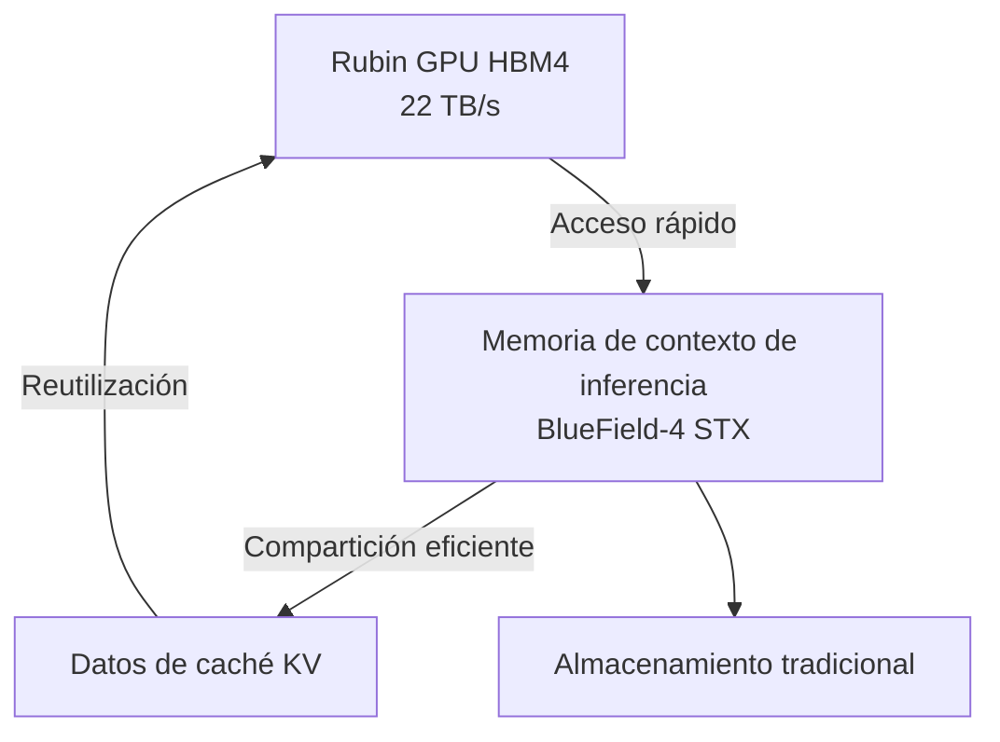
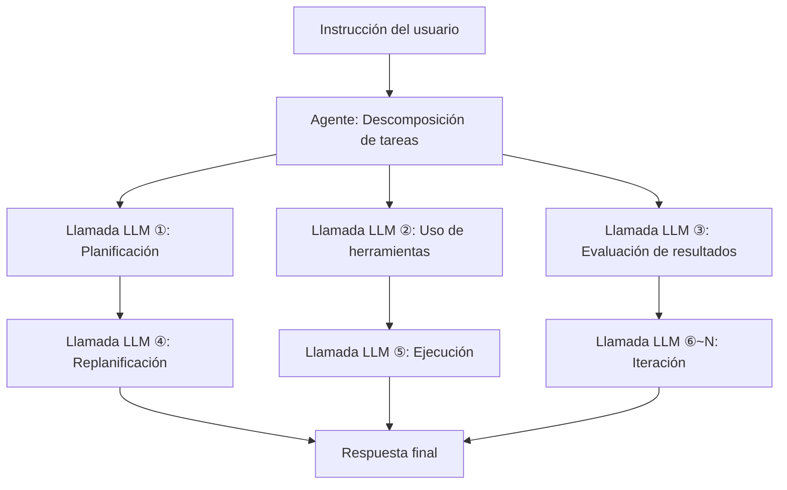

## Introducción: ¿Por qué el costo de inferencia es un problema ahora?

Al entrar en 2026, la discusión en torno a la IA está cambiando rápidamente de "rendimiento del modelo" a " economía del costo de inferencia". Si bien las capacidades de los modelos de lenguaje grandes (LLM) ya no están en duda, el "costo de inferencia por token" se ha convertido en un obstáculo para la implementación comercial real.

Especialmente la IA de agente realiza cientos o miles de llamadas a LLM para completar una sola tarea. Esto incurre en costos órdenes de magnitud mayores que las consultas simples, lo que dificulta la escalabilidad.

En su discurso de apertura de GTC 2026 en marzo de 2026, el CEO de NVIDIA, Jensen Huang, resumió concisamente esta situación. "Si tienen más capacidad, pueden generar más tokens y obtener más ingresos. Con las aplicaciones de IA de agente ahora generando otros agentes para realizar tareas una tras otra, la cantidad de tokens generados está aumentando exponencialmente", afirmó, enfatizando la importancia de una infraestructura de inferencia rápida y de bajo costo.

La respuesta de NVIDIA a esto es la plataforma **Vera Rubin**. Revelada por primera vez en CES 2026 (enero de 2026) y detallada en GTC 2026 (marzo de 2026), esta infraestructura de IA de próxima generación promete reducir el costo de inferencia hasta 10 veces en comparación con Blackwell, atrayendo la atención de la industria.

Este artículo profundiza en la arquitectura de Vera Rubin, explorando por qué se puede lograr tal reducción de costos y su impacto potencial en el futuro de la IA de agente.

---

## ¿Qué es Vera Rubin?: Un "Superordenador de IA" con 7 chips integrados

Vera Rubin no es un solo chip de GPU, sino una **plataforma de IA integrada con 7 tipos de chips especializados diseñados de manera extrema (co-diseño)**. NVIDIA llama a esto "Extreme Co-Design". En GTC 2026, NVIDIA confirmó oficialmente la adquisición de Groq en diciembre de 2025 por aproximadamente $20 mil millones, y el Groq 3 LPU se añadió como el séptimo chip a la plataforma.

Los 7 chips constituyentes son los siguientes:

| Chip | Rol |
|--------|------|
| **Vera CPU** | CPU personalizada para IA (88 núcleos Olympus) |
| **Rubin GPU** | Núcleo de cálculo de IA (50 PFLOPS NVFP4) |
| **NVLink 6 Switch** | Comunicación de alta velocidad entre GPUs (3.6 TB/s) |
| **ConnectX-9 SuperNIC** | Procesamiento de red |
| **BlueField-4 DPU** | Procesamiento de datos / Memoria de contexto de inferencia |
| **Spectrum-6 Ethernet Switch** | Comunicación Ethernet |
| **Groq 3 LPU** | Acelerador de inferencia de baja latencia (añadido recientemente) |

Todo este sistema está integrado a nivel de rack, proporcionado en el factor de forma **Vera Rubin NVL72**. Esta configuración integra 72 GPUs Rubin y 36 CPUs Vera en un solo rack. Para implementaciones aún más grandes, hay una configuración de escala de 40 racks llamada **Vera Rubin POD**, que ofrece 60 exaFLOPS de capacidad de cálculo.

---

## Vera CPU: Un procesador propietario diseñado para IA

Uno de los puntos que diferencian a Vera Rubin de las plataformas anteriores es la adopción de la **CPU personalizada de diseño propio de NVIDIA, "Vera"**.

Vera está equipada con **88 núcleos Olympus**. Olympus es un núcleo de diseño propio de NVIDIA basado en el conjunto de instrucciones ARMv9.2, optimizado específicamente para cargas de trabajo de centros de datos de IA. Cada núcleo procesa 2 hilos en paralelo utilizando la tecnología "Spatial Multithreading", proporcionando una capacidad de procesamiento total de **176 hilos**. La caché L3 ha aumentado un 40% a 162 MB, y el número de transistores ha alcanzado 227 mil millones, un aumento de 2.2 veces con respecto a la generación anterior.

Destaca el soporte para precisión FP8. La Vera CPU es la primera CPU en la industria en admitir FP8 de forma nativa, lo que permite procesar cargas de trabajo de IA completas con formatos numéricos de baja precisión.

En términos de memoria, admite hasta **1.5 TB de memoria SOCAMM LPDDR5X**, proporcionando un ancho de banda de memoria de **1.2 TB/s**. Al ampliar el bus de memoria a 1024 bits y aumentar la velocidad a 9600 MT/s, se logra un ancho de banda 2.5 veces mayor que la generación anterior. Aún más importante es la conexión con las GPUs Rubin. Mediante **NVLink-C2C (Chip-to-Chip) de segunda generación**, se logra un ancho de banda coherente de **1.8 TB/s** entre la CPU y la GPU. Esto es 7 veces más rápido que PCIe Gen 6.

### ¿Por qué se necesita una CPU personalizada?

Los servidores de IA tradicionales han utilizado CPUs de propósito general, pero las CPUs a menudo se convierten en un cuello de botella en la inferencia de LLM. El ancho de banda de memoria de la CPU host y la velocidad de conexión no pueden seguir el ritmo de la capacidad de procesamiento de la GPU.

NVIDIA reconoce que la inferencia de LLM está limitada por el ancho de banda de la memoria y la interconexión, y ha optimizado el sistema completo mediante el diseño de su propia CPU. El enlace coherente de alta velocidad entre la CPU y la GPU minimiza la sobrecarga de transferencia de datos, lo que mejora la utilización de la GPU.

---

## Rubin GPU: Un motor de cálculo de próxima generación especializado en inferencia

La GPU Rubin incorpora numerosas innovaciones especializadas para la inferencia de IA.

### Especificaciones clave

| Item | Value |
|------|-----|
| Rendimiento de inferencia NVFP4 | **50 PFLOPS** (5 veces Blackwell) |
| Rendimiento de entrenamiento NVFP4 | **35 PFLOPS** (3.5 veces Blackwell) |
| Memoria HBM4 | **288 GB** (por unidad) |
| Ancho de banda de memoria HBM4 | **22 TB/s** |
| Ancho de banda NVLink 6 | **3.6 TB/s** (por GPU) |
| Número de transistores | **336 mil millones** |

El punto especialmente digno de mención es la adopción de **HBM4**. En comparación con HBM3 de la generación anterior, el ancho de banda de la memoria ha mejorado aproximadamente 2.8 veces, abordando directamente el problema de que la inferencia de LLM está limitada por el ancho de banda de la memoria.

### NVFP4 y el motor Transformer de tercera generación

Las GPUs Rubin están equipadas con el **motor Transformer de tercera generación**, que utiliza el nuevo formato numérico de baja precisión llamado NVFP4. NVFP4 tiene una densidad aritmética aún mayor que NVFP8 adoptado por Blackwell, logrando una mejora significativa en el rendimiento manteniendo la precisión. NVIDIA ha logrado un aumento del rendimiento efectivo más allá del simple aumento de FLOPS al integrar profundamente esta ejecución de baja precisión tanto en la arquitectura como en la pila de software.

---

## NVLink 6: Infraestructura de comunicación que rompe el cuello de botella del ancho de banda

En la inferencia de LLM, especialmente en modelos Mixture-of-Experts (MoE) y entornos multijugador, el **ancho de banda de comunicación entre GPUs** es un factor determinante del rendimiento.

NVLink 6 ha duplicado el **ancho de banda** en comparación con la generación anterior (NVLink 5).

| Indicador | NVLink 5 | NVLink 6 |
|----------|----------|----------|
| Ancho de banda por switch | 1,800 GB/s | **3,600 GB/s** |
| Ancho de banda por GPU | ~1.8 TB/s | **3.6 TB/s** |
| Rack NVL72 completo | — | **260 TB/s** |

El ancho de banda interno de 260 TB/s proporcionado por el rack NVL72 permite la inferencia eficiente de modelos MoE a gran escala.

---

## Groq 3 LPU: Acelerador de inferencia de baja latencia

Una de las mayores sorpresas en GTC 2026 fue la integración de la tecnología LPU (Language Processing Unit) de Groq en la plataforma Vera Rubin. NVIDIA adquirió Groq el 24 de diciembre de 2025 por aproximadamente $20 mil millones, asegurando personal clave y una licencia no exclusiva de la tecnología LPU de Groq.

### División de roles entre GPU y LPU

En el sistema Vera Rubin, Rubin y Groq comparten el proceso de inferencia.


- **Rubin GPU**: Responsable del procesamiento de pre-relleno y atención de decodificación.
- **Groq 3 LPU**: Responsable de la ejecución de la red feed-forward (FFN).

Este modelo de división del trabajo permite que cada chip se concentre en la tarea para la que está mejor diseñado.

### Especificaciones del rack Groq 3 LPX

El **rack Groq 3 LPX** anunciado en GTC 2026 contiene 256 LPUs.

| Item | Value |
|------|-----|
| Capacidad de SRAM (por chip) | **500 MB** |
| Ancho de banda de SRAM (por chip) | **150 TB/s** |
| Ancho de banda de escalado (por chip) | **2.5 TB/s** |
| Capacidad total de SRAM en chip (rack) | **128 GB** |
| Ancho de banda de escalado (rack) | **640 TB/s** |

Groq 3 está diseñado para priorizar el ancho de banda sobre la capacidad, con un ancho de banda de aproximadamente 80 TB/s por chip. Este diseño centrado en SRAM de alto ancho de banda es lo que permite la baja latencia en el procesamiento FFN.

### Efecto de la integración

La combinación de Vera Rubin y Groq LPX resulta en un **aumento de hasta 35 veces en el rendimiento de inferencia para modelos de billones de parámetros** y un **aumento de 35 veces en el rendimiento por megavatio** en comparación con la GPU Rubin sola. Esto se logra sin necesidad de cambios significativos en la plataforma CUDA, utilizando el LPU como un acelerador de decodificación altamente especializado.

---

## Almacenamiento de memoria de contexto de inferencia: Especialización para IA de agente

Una característica clave que indica que Vera Rubin está diseñada como una "base para IA de agente" es su **plataforma de almacenamiento de memoria de contexto de inferencia**.

### Nueva jerarquía de memoria

NVIDIA utiliza la DPU BlueField-4 para construir una nueva jerarquía de memoria entre la GPU y el almacenamiento tradicional.



Los racks de almacenamiento BlueField-4 STX actúan como una "memoria de contexto dedicada" para mantener la coherencia del contexto cuando los agentes de IA mantienen conversaciones multivuelta a gran escala. Al descargar los datos de la caché KV a los chips BlueField-4, los datos de la caché se pueden compartir y reutilizar en toda la infraestructura de inferencia de IA, lo que mejora el rendimiento de inferencia **hasta 5 veces**.

### Impacto en la IA de agente

La IA de agente tiene patrones de cálculo fundamentalmente diferentes a los de las consultas simples.



Se producen decenas o cientos de llamadas a LLM por cada instrucción, y cada una tiene un contexto largo. El almacenamiento de memoria de contexto de inferencia mejora el rendimiento general y la eficiencia de costos de la IA de agente al administrar eficientemente esta caché KV.

---

## El mecanismo de "reducción de costo 10x": Cómo leer las cifras con precisión

Es importante comprender con precisión bajo qué condiciones se logra la cifra de "reducción de costo de inferencia 10x" afirmada por NVIDIA.

### Factores clave de mejora

La reducción de costos 10x se logra como un efecto combinado de múltiples innovaciones tecnológicas.

```
Aumento del ancho de banda de memoria HBM4: ~2.8x
Aumento del rendimiento NVLink 6: ~2x
Aumento del rendimiento del núcleo Tensor NVFP4: ~5x
Eficiencia mejorada del procesamiento FNN mediante la integración de Groq LPU: Factor adicional
```

### Mejora drástica de la eficiencia energética

Jensen Huang presentó una cifra impresionante en su discurso de apertura. "Con la generación Blackwell, podíamos generar 22 millones de tokens por segundo desde un centro de datos de 1 GW. Con Vera Rubin, podemos generar 700 millones de tokens por segundo con la misma energía. Esto es una mejora de 350 veces en dos años", afirmó.

| Indicador | Blackwell | Vera Rubin | Factor de Mejora |
|----------|-----------|------------|---------|
| Tokens/segundo por 1 GW | 22 millones | **700 millones** | **~32x** |
| Costo por token (contexto largo) | Base | Máximo 1/10 | **Máximo 10x** |
| Rendimiento de inferencia/vatio | Base | 10x | **10x** |
| Número de GPUs de entrenamiento MoE | Base | 1/4 | **4x de eficiencia** |

### Expectativas realistas

Por otro lado, una evaluación realista también es importante. La reducción de costos 10x es un resultado de referencia en condiciones específicas de "contexto largo y salida larga", y **2-3x de mejora en la inferencia de modelos densos de contexto corto** es una expectativa realista.

---

## Rack NVL72: Rendimiento del sistema completo

El Vera Rubin NVL72 es un sistema a escala de rack que integra cada componente.

### Resumen de especificaciones de NVL72

| Item | Especificación |
|------|------|
| Configuración de GPU | 72 x Rubin GPU |
| Configuración de CPU | 36 x Vera CPU |
| Rendimiento total de inferencia NVFP4 | **3.6 ExaFLOPS** |
| Capacidad total HBM4 | **20.7 TB** |
| Ancho de banda total HBM4 | **1.6 PB/s** (Petabytes por segundo) |
| Ancho de banda total NVLink 6 | **260 TB/s** |

### Vera Rubin POD: Implementación a escala de centro de datos

Una configuración aún más grande, **Vera Rubin POD**, está disponible, configurada en una escala de 40 racks.

| Item | Especificación |
|------|------|
| Número total de GPUs | 2,880 |
| Capacidad de cálculo total | **60 ExaFLOPS** |
| Componentes de configuración | Más de 1,300,000 |

El POD sirve como la unidad básica para los centros de datos de próxima generación que NVIDIA denomina "fábricas de IA".

---

## Comparación con Blackwell: Evolución generacional

Vera Rubin se sitúa después de Blackwell de NVIDIA. Resumimos las mejoras clave de cada generación.

| Item | Blackwell | Vera Rubin | Factor de Mejora |
|------|-----------|------------|---------|
| Rendimiento de inferencia de GPU (NVFP4) | 10 PFLOPS | **50 PFLOPS** | **5x** |
| Rendimiento de entrenamiento de GPU | 10 PFLOPS | **35 PFLOPS** | **3.5x** |
| Ancho de banda entre GPUs | 1,800 GB/s | **3,600 GB/s** | **2x** |
| Generación HBM | HBM3 | **HBM4** | **~2.8x** |
| CPU | Propósito general/Grace | **Vera (88 núcleos Olympus)** | — |
| Inferencia de baja latencia | — | **Integración Groq 3 LPU** | — |
| Número de GPUs de entrenamiento (MoE) | Base | **Reducido a 1/4** | **4x** |
| Costo por token | Base | **Máximo 1/10** | **Máximo 10x** |

---

## Cronograma de implementación y socios clave

### Horario de entrega

NVIDIA planea **iniciar la producción en masa y el envío de Vera Rubin a partir de la segunda mitad de 2026**. En el momento de GTC 2026 (16-19 de marzo de 2026), se confirmó que Vera Rubin está "en estado de producción completa".

### Socios de implementación iniciales

Los siguientes socios han sido anunciados como los primeros en ofrecer servicios en la nube basados en Vera Rubin:

- **Hiperescaladores**: AWS, Google Cloud, Microsoft Azure, Oracle Cloud Infrastructure (OCI)
- **Nubes especializadas**: CoreWeave, Lambda, Nebius, Nscale

Jensen Huang declaró: "Se espera que los pedidos acumulados de Blackwell y Rubin superen el billón de dólares para finales de 2027", lo que indica que Vera Rubin se está posicionando como un pilar central en la inversión en centros de datos.

---

## Desafíos técnicos y perspectivas futuras

### Consumo de energía e inversión en centros de datos

Si bien el rack NVL72 posee una capacidad de cálculo masiva, su consumo de energía también es considerable. En 2026, se proyecta que la inversión total en infraestructura de centros de datos de los hiperescaladores supere los $65 mil millones, y la implementación de Vera Rubin requerirá una inversión significativa en infraestructura de energía y refrigeración.

### Desarrollo del ecosistema de software

Aunque NVIDIA afirma que la integración de Groq 3 LPU no requiere cambios significativos en la plataforma CUDA, la optimización de la pila de software (bibliotecas CUDA, marcos de inferencia) sigue siendo crucial. NVIDIA está avanzando en esto a través de NIM (NVIDIA Inference Microservices) y otras iniciativas.

### Próxima generación "Vera Rubin Ultra"

En GTC 2026, se anticipó aún más la próxima generación **Vera Rubin Ultra**, lo que sugiere que NVIDIA continuará evolucionando su plataforma en ciclos anuales.

---

## Resumen: Hacia la próxima etapa de la infraestructura de IA

NVIDIA Vera Rubin no es simplemente "una GPU más rápida". Es una plataforma de IA integrada donde 7 chips y sistemas relacionados, que incluyen el procesador propietario Vera CPU, la mejora significativa del ancho de banda de memoria con HBM4, la comunicación entre GPUs 2x con NVLink 6, la integración de Groq 3 LPU para inferencia de baja latencia y la gestión de caché KV con almacenamiento de memoria de contexto de inferencia, están diseñados de manera extremadamente coordinada.

La reducción de hasta 10 veces en el costo de inferencia (en condiciones de contexto largo), la cuarta parte de las GPUs necesarias para el entrenamiento de modelos MoE y la capacidad de generar 350 veces más tokens con la misma energía, cambiarán fundamentalmente la viabilidad económica de la IA de agente.

En 2026, a medida que la IA de agente se implementa plenamente en la automatización de procesos empresariales, el costo de inferencia es una cuestión que afecta directamente la rentabilidad de los negocios. Cuando Vera Rubin comience la producción en masa en la segunda mitad de 2026, esta ecuación de costos se reescribirá. La viabilidad práctica de la IA depende no solo de la inteligencia del modelo, sino también de la economía de la infraestructura que lo impulsa. En este contexto, Vera Rubin será una innovación de infraestructura importante que definirá el año 2026.

---

## Referencias

| Título | Fuente | Fecha | URL |
|:---------|:-------|:-----|:----|
| NVIDIA Kicks Off the Next Generation of AI With Rubin — Six New Chips, One Incredible AI Supercomputer | NVIDIA Newsroom | 2026/03/16 | https://nvidianews.nvidia.com/news/rubin-platform-ai-supercomputer |
| NVIDIA Vera Rubin Opens Agentic AI Frontier | NVIDIA Newsroom | 2026/03/16 | https://nvidianews.nvidia.com/news/nvidia-vera-rubin-platform |
| Inside the NVIDIA Vera Rubin Platform: Six New Chips, One AI Supercomputer | NVIDIA Technical Blog | 2026/03/16 | https://developer.nvidia.com/blog/inside-the-nvidia-rubin-platform-six-new-chips-one-ai-supercomputer/ |
| Inside NVIDIA Groq 3 LPX: The Low-Latency Inference Accelerator for the NVIDIA Vera Rubin Platform | NVIDIA Technical Blog | 2026/03/16 | https://developer.nvidia.com/blog/inside-nvidia-groq-3-lpx-the-low-latency-inference-accelerator-for-the-nvidia-vera-rubin-platform/ |
| NVIDIA Vera Rubin POD: Seven Chips, Five Rack-Scale Systems, One AI Supercomputer | NVIDIA Technical Blog | 2026/03/16 | https://developer.nvidia.com/blog/nvidia-vera-rubin-pod-seven-chips-five-rack-scale-systems-one-ai-supercomputer/ |
| Infrastructure for Scalable AI Reasoning | NVIDIA Official | 2026/03 | https://www.nvidia.com/en-us/data-center/technologies/rubin/ |
| Nvidia launches Vera Rubin NVL72 AI supercomputer at CES | Tom's Hardware | 2026/01/06 | https://www.tomshardware.com/pc-components/gpus/nvidia-launches-vera-rubin-nvl72-ai-supercomputer-at-ces-promises-up-to-5x-greater-inference-performance-and-10x-lower-cost-per-token-than-blackwell-coming-2h-2026 |
| GTC 2026: Nvidia Unveils Vera Rubin AI Platform, Eyes \$1T by 2027 | Data Center Knowledge | 2026/03/16 | https://www.datacenterknowledge.com/data-center-chips/gtc-2026-nvidia-unveils-vera-rubin-ai-platform-eyes-1t-by-2027 |
| Nvidia GTC 2026: CEO Jensen Huang sees \$1 trillion in orders for Blackwell and Vera Rubin through '27 | CNBC | 2026/03/16 | https://www.cnbc.com/2026/03/16/nvidia-gtc-2026-ceo-jensen-huang-keynote-blackwell-vera-rubin.html |
| Nvidia's Rubin platform aims to cut AI training, inference costs | CIO Dive | 2026/03 | https://www.ciodive.com/news/nvidia-rubin-cut-ai-training-inference-costs/808915/ |
| NVIDIA Vera Rubin NVL72 Detailed: 72 GPUs, 36 CPUs, 260 TB/s Scale-Up Bandwidth | VideoCardz | 2026/01 | https://videocardz.com/newz/nvidia-vera-rubin-nvl72-detailed-72-gpus-36-cpus-260-tb-s-scale-up-bandwidth |
| Decoding the Future of Inference At NVIDIA: Groq LPUs Join Vera Rubin Platform | ServeTheHome | 2026/03/16 | https://www.servethehome.com/decoding-the-future-of-inference-at-nvidia-groq-lpus-join-vera-rubin-platform-for-low-latency-inference/ |
| Nvidia Boasts 7 Chips in Production for Vera Rubin Platform, Including Groq 3 LPU | HPCwire | 2026/03/16 | https://www.hpcwire.com/2026/03/16/nvidia-boasts-7-chips-in-production-for-vera-rubin-platform-including-groq-3-lpu/ |
| NVIDIA Launches New Vera CPU: 88 Olympus Cores Designed From Scratch for AI | Knowledge Hub Media | 2026/01 | https://knowledgehubmedia.com/nvidia-launches-new-vera-cpu-88-olympus-cores-designed-from-scratch-for-ai/ |
| NVIDIA GTC 2026: Rubin GPUs, Groq LPUs, Vera CPUs, and What NVIDIA Is Building for Trillion-Parameter Inference | StorageReview | 2026/03/16 | https://www.storagereview.com/news/nvidia-gtc-2026-rubin-gpus-groq-lpus-vera-cpus-and-what-nvidia-is-building-for-trillion-parameter-inference |

---

> Este artículo fue generado automáticamente por LLM. Puede contener errores.
