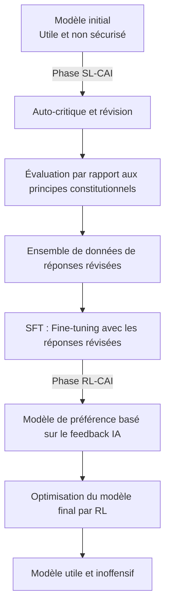

Le 22 janvier 2026, Anthropic a publié un document intitulé "Claude's Constitution". Ce document, qui compte environ 23 000 mots, décrit en détail les principes comportementaux, les valeurs et les critères de jugement de Claude. Il a été publié dans son intégralité sous la licence **Creative Commons CC0 1.0**, équivalente au domaine public.

La publication CC0 signifie "que chacun peut utiliser, modifier et adopter sans restriction". C'est une première dans l'industrie qu'une entreprise d'IA publie sous domaine public un document constitutionnel central utilisé pour l'entraînement de ses modèles.

## Qu'est-ce que la Constitutional AI ?

### Une technologie issue d'un article fondateur de 2022

Le concept de Constitutional AI a été présenté de manière systématique pour la première fois dans l'article "Constitutional AI: Harmlessness from AI Feedback" (arXiv:2212.08073) publié par Anthropic en décembre 2022. Les auteurs sont Yuntao Bai et 50 autres co-auteurs dans le cadre d'une recherche collaborative à grande échelle.

Le RLHF (Reinforcement Learning from Human Feedback) traditionnel collectait une grande quantité de retours humains pour orienter le modèle vers la sécurité. Cependant, cette approche présentait un problème fondamental : elle ne pouvait pas évoluer. Plus le modèle devenait puissant, plus l'expertise humaine requise pour l'évaluation augmentait, et les coûts augmentaient exponentiellement.

La solution proposée par la Constitutional AI est le "RLHF par feedback IA", c'est-à-dire le **RLAIF (Reinforcement Learning from AI Feedback)**.

### Le flux technique de la CAI



Dans la **phase SL-CAI (Apprentissage supervisé)**, le modèle critique ses propres réponses nuisibles à la lumière des principes constitutionnels et les révise. Par exemple, il s'auto-évalue en disant "Cette réponse contient des présupposés racistes. Elle contrevient au principe constitutionnel X (traitement équitable)" et génère une version révisée. Un fine-tuning est effectué sur les réponses révisées.

Dans la **phase RL-CAI (Apprentissage par renforcement)**, l'IA évalue quelle réponse parmi plusieurs candidats correspond le mieux aux principes constitutionnels et construit un ensemble de données de préférences. Ce jeu de données est utilisé pour entraîner un modèle de récompense, qui optimise ensuite le modèle principal via RL.

Le cœur de cette méthode réside dans le fait qu'elle "a compressé la supervision humaine nécessaire à l'étiquetage dans un simple document textuel : la Constitution". Au lieu que les humains évaluent directement, l'IA se réfère à la Constitution pour évaluer. Cela atténue considérablement le problème de la mise à l'échelle des coûts de main-d'œuvre.

### Les défis résolus par le RLAIF

Les résultats expérimentaux de l'article fondateur montrent que les modèles ayant appliqué la Constitutional AI ont fait preuve d'une sécurité égale ou supérieure à celle des modèles traditionnels basés sur le RLHF. Ce qui est particulièrement remarquable, c'est leur caractéristique "faible nocivité et non-évitement".

Les filtres de sécurité traditionnels adoptaient souvent une approche simple : "rejeter les requêtes dangereuses". Par conséquent, ils avaient tendance à rejeter excessivement (beaucoup de faux positifs) ou à laisser passer trop (beaucoup de faux négatifs).
Avec la Constitutional AI, le modèle comprend "pourquoi quelque chose est problématique" avant de répondre, ce qui permet une prise de décision appropriée en fonction du contexte.

## Ce que la "Constitution de Claude" de 2026 a changé

### Du listage de règles à un raisonnement basé sur des principes

La première version de la "Constitutional AI" publiée en 2023 ressemblait largement à une liste de règles "choses à ne pas faire". La structure était telle que les interdictions étaient explicitement énoncées et que le modèle s'y référait pour vérification.

La version de 2026 est architectuellement différente. Elle est conçue comme un cadre de raisonnement global avec quatre niveaux de priorité.

| Priorité | Élément | Description |
|---------|------|------|
| 1 | **Sécurité (Broadly Safe)** | Soutient une supervision humaine appropriée des systèmes d'IA |
| 2 | **Éthique (Generally Ethical)** | Honnêteté et évitement de la nuisance |
| 3 | **Conformité aux directives (Adherent to Anthropic's Principles)** | Conformité avec la politique de l'entreprise |
| 4 | **Utilité (Genuinely Helpful)** | Soutien réel à l'utilisateur et à l'opérateur |

L'implication philosophique de la priorité est importante. Le fait que la sécurité soit prioritaire par rapport à l'utilité est une déclaration explicite du principe "la sécurité ne doit pas être sacrifiée pour l'utilité". Cependant, dans les opérations normales, l'utilité est l'axe d'évaluation principal : la conception stipule "être aussi utile que possible dans les limites de la non-violation des principes supérieurs".

Bien que les contraintes absolues (comme l'aide à la fabrication d'armes biologiques) soient toujours explicitement énoncées, la majorité des directives se concentrent sur le "développement du jugement".

### Apprendre le "pourquoi" au modèle

Le changement le plus remarquable dans la version 2026 est l'explication détaillée du "pourquoi" derrière les règles.

Par exemple, la règle "ne pas générer de contenu violent" est incluse dans de nombreux guides de sécurité pour l'IA. Cependant, la Constitution de Claude de 2026 explique minutieusement les valeurs sous-jacentes à cette règle – le respect de la dignité humaine, la prévention des dommages dans le monde réel, et les tensions avec la liberté d'expression.

Anthropic vise un modèle qui "ne se contente pas de mémoriser les règles, mais qui comprend les principes et peut les appliquer à des situations inconnues". C'est une réponse à la réalité où de nouvelles situations (nouvelles technologies, nouveaux problèmes sociaux, nouveaux cas d'utilisation) émergent constamment et ne sont pas prévues par les règles.

```
【Approche traditionnelle】
SI la requête correspond à la liste des interdictions ALORS rejeter
SINON répondre

【Approche basée sur les principes】
1. Quelle est l'intention et le contexte de cette requête ?
2. Quels principes s'appliquent ?
3. Comment chaque principe s'applique-t-il à cette situation ?
4. Comment résoudre les compromis entre les principes ?
5. Quelle est la réponse globalement la plus éthique ?
```

### La signification de la publication d'une documentation à grande échelle

La taille de 23 000 mots est également remarquable. Il s'agit d'une quantité de texte équivalente à une nouvelle. Elle décrit en détail non seulement une liste superficielle de règles, mais aussi les valeurs, le processus de jugement et les stratégies de gestion des cas difficiles.

Cette profondeur offre un avantage secondaire : une transparence accrue permettant aux décideurs d'entreprise et aux utilisateurs de comprendre "pourquoi Claude se comporte comme il le fait". C'est une réponse au problème de la "boîte noire" des systèmes d'IA.

Anthropic reconnaît ouvertement dans le document qu'il "existe un écart entre le comportement prévu et le comportement réel du modèle", et s'engage à poursuivre l'évaluation et à élargir la recherche sur la sécurité.

## Ce que la publication CC0 pose comme questions à l'industrie

### Une expérience d'open-sourcing de la sécurité IA

La publication de la Constitution de Constitutional AI sous licence CC0 revêt une grande importance du point de vue de l'open-sourcing de la recherche sur la sécurité de l'IA.

**Bénéfices pour la communauté de recherche** : Les universités et les instituts de recherche peuvent vérifier, étendre et critiquer l'approche d'Anthropic. C'est la concrétisation de la philosophie selon laquelle la recherche sur la sécurité n'est pas une compétition pour "qui crée l'IA la plus sûre", mais d'abord un travail collaboratif pour "comprendre ce qu'est une IA sûre".

**Effet d'entraînement sur d'autres entreprises d'IA** : Les concurrents comme OpenAI, Google et Meta peuvent consulter, adopter et modifier des documents similaires. Bien que cela puisse sembler une perte d'avantage concurrentiel à court terme, une amélioration du niveau de sécurité de l'IA dans l'industrie pourrait permettre d'obtenir la confiance des régulateurs et de la société dans son ensemble.

**Impact sur la communauté des développeurs** : Les petites et moyennes entreprises d'IA et les développeurs individuels peuvent économiser le coût de conception d'un cadre de sécurité à partir de zéro.

### "Renonciation à l'avantage concurrentiel" ou "stratégie pour dominer la norme" ?

Il existe également des perspectives critiques sur la publication CC0. Si les concurrents adoptent la Constitution de Claude et que le "cadre de sécurité conçu par Anthropic" devient de facto la norme de l'industrie, cela pourrait être une situation avantageuse pour Anthropic.

La standardisation consiste également à "faire de sa philosophie de conception la norme de facto de l'industrie". Linux a été rendu open source pour contrer les UNIX propriétaires d'IBM et de Sun Microsystems, et le résultat a été que Linux est devenu une plateforme dominante. Si la publication CC0 de Constitutional AI déclenchait une dynamique similaire dans le monde de la sécurité de l'IA, Anthropic deviendrait un leader non officiel du "cadre de sécurité".

### Questions persistantes

Il existe des problèmes qui ne seront pas résolus même avec la publication CC0.

**Écart d'implémentation** : Même en publiant le document constitutionnel, le savoir-faire sur la manière de l'intégrer dans le processus d'entraînement n'est pas divulgué. Il est incertain si d'autres entreprises, après avoir lu la "Constitution", pourraient atteindre un niveau de sécurité équivalent.

**Difficulté d'évaluation** : Il n'existe pas d'indicateurs objectifs pour mesurer la conformité à la Constitution de Claude. Le "raisonnement basé sur des principes" est qualitatif et difficile à standardiser.

**Universalité des valeurs** : Les valeurs contenues dans le document de 23 000 mots sont principalement basées sur un contexte anglophone et occidental. L'applicabilité de ces valeurs aux systèmes d'IA mondiaux nécessite une discussion continue.

## Positionnement dans la stratégie de gouvernance d'Anthropic

La publication CC0 de Constitutional AI fait partie de la stratégie de transparence plus large d'Anthropic. L'entreprise possède un mécanisme de gouvernance appelé "Long-Term Benefit Trust" et en janvier 2026, elle a accueilli Mariano-Florentino Cuéllar, un ancien juge de la Cour suprême de Californie, comme nouveau membre. L'inclusion d'experts en droit et en affaires internationales dans le système de gouvernance est un choix stratégique alors que les discussions sur la réglementation de l'IA s'intensifient.

Anthropic poursuit plusieurs directions de recherche sur la sécurité en parallèle, dont l'interprétabilité, la surveillance évolutive, l'apprentissage orienté processus et la compréhension généralisée sont les principaux piliers. Constitutional AI est positionné comme la partie "la plus proche de l'implémentation" dans ces recherches.

Le flux de la publication de l'article Constitutional AI (2022) → publication de la constitution initiale (2023) → publication CC0 de la constitution révisée (janvier 2026) montre un scénario d'expansion progressive de l'influence : recherche → pratique → standardisation de l'industrie.


## Conclusion

La publication CC0 de "Claude's Constitution" par Anthropic a plus de signification qu'une simple divulgation d'informations.

Sur le plan technique, la transition d'une liste de règles à un cadre de raisonnement basé sur des principes est une tentative de mise à jour de la méthodologie d'implémentation de la sécurité de l'IA elle-même. La combinaison de Constitutional AI et de RLAIF offre une réponse réaliste au problème du coût de la supervision humaine.

Sur le plan stratégique, l'open-sourcing du cadre de sécurité de l'IA peut être considéré comme une initiative visant à établir une norme industrielle sous la direction d'Anthropic. Le choix de la licence CC0, la plus restrictive, témoigne de l'intention de maximiser la diffusion et de promouvoir l'adoption et les adaptations futures.

Et sur le plan sociétal, en tant que réponse publique de l'entreprise à la question "Qu'est-ce que l'IA et comment devrait-elle se comporter ?", elle joue un rôle dans la promotion du dialogue entre chercheurs, décideurs politiques et grand public.

Alors que le débat sur la sécurité de l'IA passe de "problème d'Anthropic uniquement" à "problème de l'industrie et de la société dans son ensemble", la publication CC0 de Constitutional AI deviendra probablement une étape symbolique de cette transition.

## Références

| Titre | Source | Date | URL |
|:---------|:-------|:-----|:----|
| Constitutional AI: Harmlessness from AI Feedback | arXiv | 2022-12-15 | https://arxiv.org/abs/2212.08073 |
| Claude's new constitution | Anthropic | 2026-01-22 | https://www.anthropic.com/news/claude-new-constitution |
| Long-Term Benefit Trust 新メンバー就任 | Anthropic | 2026-01-21 | https://www.anthropic.com/news/mariano-florentino-long-term-benefit-trust |
| Constitutional AI: Anthropic's safety research | Anthropic Research | 2023 | https://www.anthropic.com/research/constitutional-ai-harmlessness-from-ai-feedback |
| Anthropic's core views on AI safety | Anthropic | 2023 | https://www.anthropic.com/news/core-views-on-ai-safety |
| Creative Commons CC0 1.0 Universal | Creative Commons | — | https://creativecommons.org/publicdomain/zero/1.0/ |
| Claude's Model Specification | Anthropic | 2024 | https://www.anthropic.com/news/anthropics-model-specification |

---

> Cet article a été généré automatiquement par LLM. Il peut contenir des erreurs.
