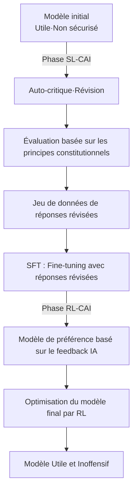
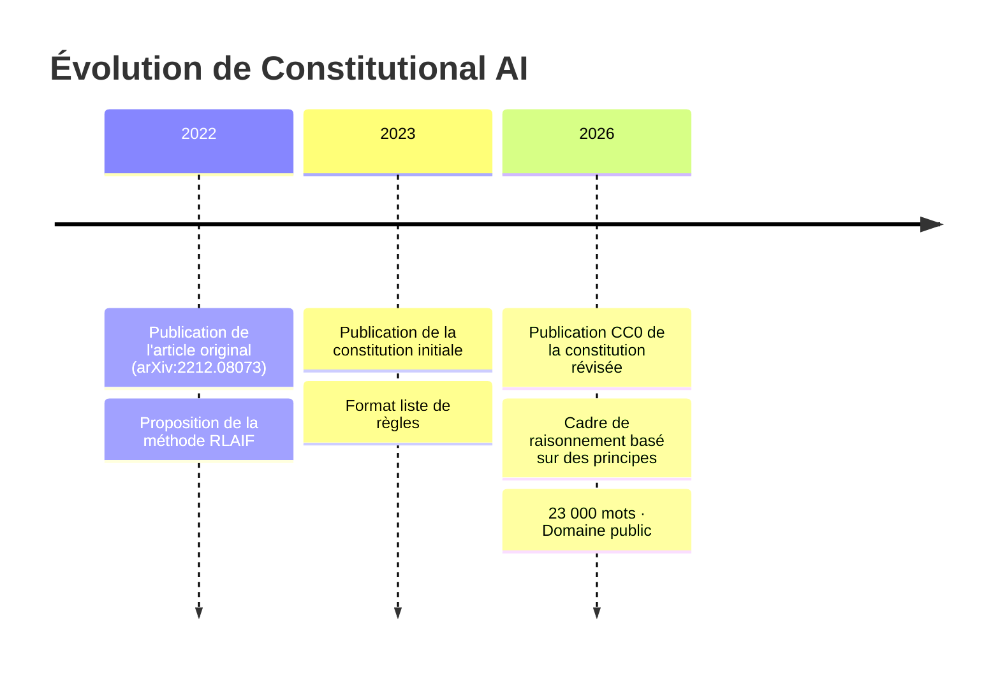

Le 22 janvier 2026, Anthropic a publié un document intitulé « Claude's Constitution ». Ce document de près de 23 000 mots décrit en détail les principes de comportement, les valeurs et les critères de jugement de Claude, et a été publié intégralement sous licence **Creative Commons CC0 1.0**, c'est-à-dire dans le domaine public.

La publication sous licence CC0 signifie que « toute personne peut l'utiliser, le modifier et l'adopter sans restriction ». Il s'agit d'une première dans l'industrie pour une entreprise d'IA de publier un document constitutionnel aussi fondamental pour l'entraînement de ses modèles dans le domaine public.

## Qu'est-ce que Constitutional AI ?

### Une technologie née d'un article de 2022

Le concept de Constitutional AI a été présenté de manière systématique pour la première fois en décembre 2022 dans l'article d'Anthropic « Constitutional AI: Harmlessness from AI Feedback » (arXiv:2212.08073). Les auteurs sont Yuntao Bai et 50 autres co-auteurs dans le cadre d'une vaste étude collaborative.

L'approche traditionnelle de RLHF (Reinforcement Learning from Human Feedback) utilisait la collecte de grandes quantités de retours humains pour orienter le modèle vers la sécurité. Cependant, cette approche présentait un problème fondamental : elle ne parvenait pas à passer à l'échelle. Plus le modèle devenait puissant, plus l'expertise humaine requise pour l'évaluation augmentait, entraînant une augmentation exponentielle des coûts.

La solution proposée par Constitutional AI est le « RLHF par feedback IA », c'est-à-dire **RLAIF (Reinforcement Learning from AI Feedback)**.

### Flux technique de CAI



**Phase SL-CAI (apprentissage supervisé)** : Le modèle critique ses propres réponses nuisibles à la lumière des principes constitutionnels et les révise. Par exemple, il s'auto-évalue en disant « Cette réponse contient des hypothémies racistes. Elle contrevient au principe constitutionnel X (traitement égal) » et génère une version révisée. Un fine-tuning est effectué avec les réponses révisées.

**Phase RL-CAI (apprentissage par renforcement)** : L'IA évalue laquelle de plusieurs réponses candidates correspond le mieux aux principes constitutionnels et construit un jeu de données de préférences. Ce jeu de données est utilisé pour entraîner un modèle de récompense, qui optimise ensuite le modèle principal via RL.

Le cœur de cette méthode réside dans le fait qu'elle « compresse la supervision humaine nécessaire à l'étiquetage dans un simple document textuel, la constitution ». Au lieu d'une évaluation humaine directe, l'IA se réfère à la constitution pour évaluer.

### Les problèmes résolus par RLAIF

Les résultats expérimentaux de l'article original montrent que les modèles appliquant Constitutional AI ont démontré une sécurité égale ou supérieure à celle des modèles traditionnels basés sur RLHF. Il convient de noter leur caractéristique « faible nocivité et non-évitement ». Les filtres de sécurité traditionnels consistaient souvent en une approche simple consistant à « refuser les requêtes dangereuses ». En conséquence, ils avaient tendance à soit refuser excessivement (beaucoup de faux positifs), soit laisser passer trop de choses (beaucoup de faux négatifs). Avec Constitutional AI, le modèle comprend « pourquoi quelque chose est problématique » et répond, permettant ainsi un jugement approprié en fonction du contexte.

## Ce que la « Constitution de Claude » de 2026 a changé

### Du listage de règles au raisonnement basé sur des principes

Les premiers documents de « Constitutional AI » publiés en 2023 ressemblaient largement à une liste de règles « à ne pas faire ». La structure impliquait la spécification des interdictions et la référence du modèle à cette liste pour vérification.

La version de 2026 est architecturale différente. Elle est conçue comme un cadre de raisonnement complet avec quatre niveaux de priorité.

| Priorité | Article | Description |
|---|---|---|
| 1 | **Sécurité (Broadly Safe)** | Soutenir la supervision humaine appropriée des systèmes d'IA |
| 2 | **Éthique (Generally Ethical)** | Intégrité et évitement de la nuisance |
| 3 | **Conformité aux directives (Adherent to Anthropic's Principles)** | Conformité aux politiques de l'entreprise |
| 4 | **Utilité (Genuinely Helpful)** | Véritable assistance aux utilisateurs et opérateurs |

Ce qui est important, ce sont les implications philosophiques de la priorité. Le fait que la sécurité soit prioritaire sur l'utilité déclare explicitement le principe « la sécurité ne doit pas être sacrifiée au profit de l'utilité ». Cependant, dans les opérations normales, l'utilité (le quatrième point) devient l'axe d'évaluation principal – la conception est telle que « soyez aussi utile que possible, sans enfreindre les principes supérieurs ».

En outre, bien que les contraintes absolues (comme l'assistance à la fabrication d'armes biologiques) restent explicitement interdites, la plupart des directives visent à « cultiver le jugement ».

### Apprendre le « pourquoi » au modèle

Le changement le plus remarquable dans la version 2026 est la description détaillée du « pourquoi » derrière les règles. Par exemple, « ne pas générer de contenu violent » est une règle incluse dans de nombreux guides de sécurité de l'IA. Cependant, la constitution de Claude, version 2026, explique méticuleusement les valeurs sous-jacentes à cette règle – le respect de la dignité humaine, la prévention des dommages dans le monde réel, la tension avec la liberté d'expression.

Anthropic vise un modèle qui « comprend les principes et peut les appliquer même dans des situations inconnues », plutôt qu'un modèle qui « mémorise les règles ». Il s'agit d'une réponse aux situations réelles où de nouvelles situations (nouvelles technologies, nouveaux problèmes sociaux, nouveaux cas d'utilisation) apparaissent constamment et ne sont pas prévues par les règles.

```
【Approche traditionnelle】
SI la demande correspond à la liste d'interdiction ALORS refuser
SINON répondre

【Approche basée sur les principes】
1. Quelle est l'intention et le contexte de cette demande ?
2. Quels principes sont pertinents ?
3. Comment chaque principe s'applique-t-il dans cette situation ?
4. Comment résoudre les compromis entre les principes ?
5. Quelle est la réponse la plus éthique dans l'ensemble ?
```

### La signification de la publication de documents à grande échelle

La taille de 23 000 mots est également remarquable. C'est une quantité de texte équivalente à une nouvelle. Il ne s'agit pas d'une simple liste de règles superficielles, mais d'une description détaillée des valeurs, des processus de jugement et des politiques de gestion des cas difficiles.

Une telle minutie a un effet secondaire : une transparence accrue qui permet aux décideurs d'entreprise et aux utilisateurs de comprendre « pourquoi Claude se comporte de cette manière ». C'est aussi une réponse au problème de la « boîte noire » des systèmes d'IA.

Anthropic reconnaît franchement dans son document « qu'il existe un décalage entre le comportement prévu et le comportement réel du modèle », et s'engage à poursuivre l'évaluation et à élargir la recherche sur la sécurité.

## Ce que la publication CC0 pose comme questions à l'industrie

### L'expérience de l'open-sourcing de la sécurité de l'IA

La publication de la constitution de Constitutional AI sous licence CC0 revêt une grande importance du point de vue de l'open-sourcing de la recherche sur la sécurité de l'IA.

**Avantages pour la communauté de recherche** : Les universités et les instituts de recherche peuvent vérifier, étendre et critiquer l'approche d'Anthropic. Elle incarne l'idée que la recherche sur la sécurité doit avant tout être un travail collaboratif pour comprendre « ce qu'est une IA sûre », avant d'être une compétition pour savoir « qui crée l'IA la plus sûre ».

**Impact sur d'autres entreprises d'IA** : Les concurrents tels qu'OpenAI, Google et Meta peuvent consulter, adopter et modifier des documents similaires. Bien que cela puisse sembler une perte d'avantage concurrentiel à court terme, une amélioration du niveau de sécurité de l'IA dans l'ensemble de l'industrie peut conduire à une confiance accrue de la part des régulateurs et de la société.

**Impact sur la communauté des développeurs** : Les petites et moyennes entreprises d'IA et les développeurs individuels peuvent économiser les coûts de conception d'un cadre de sécurité à partir de zéro.

### « Abandon de l'avantage concurrentiel » ou « stratégie pour dominer le standard » ?

Il existe également des points de vue critiques sur la publication CC0. Si les concurrents adoptent la constitution de Claude, le « cadre de sécurité conçu par Anthropic » deviendra effectivement le standard de l'industrie, ce qui constituerait une situation avantageuse pour Anthropic.

La standardisation consiste également à « faire de sa propre philosophie de conception le standard de facto de l'industrie ». Linux a été rendu open source pour contrer les UNIX propriétaires d'IBM et de Sun Microsystems, ce qui a conduit Linux à devenir la plateforme dominante. Si la publication CC0 de Constitutional AI déclenche une dynamique similaire dans le domaine de la sécurité de l'IA, Anthropic deviendra le leader silencieux du « cadre de sécurité ».

### Questions restantes

Il existe des problèmes que même la publication CC0 ne résout pas.

**Écart d'implémentation** : Même en publiant le document constitutionnel, le savoir-faire sur la manière de l'intégrer dans le processus d'entraînement n'est pas divulgué. Il n'est pas certain que d'autres entreprises, en lisant la « Constitution », puissent atteindre un niveau de sécurité équivalent.

**Difficulté d'évaluation** : Il n'existe aucun indicateur public permettant de mesurer objectivement si le modèle est conforme à la constitution de Claude. Le « raisonnement basé sur des principes » est qualitatif et difficile à étalonner.

**Universalité des valeurs** : Les valeurs contenues dans le document de 23 000 mots sont principalement basées sur un contexte anglophone et occidental. La pertinence de l'application de ces valeurs à des systèmes d'IA mondiaux nécessite une discussion continue.

## Position dans la stratégie de gouvernance d'Anthropic

La publication CC0 de Constitutional AI s'inscrit dans la stratégie de transparence plus large d'Anthropic. L'entreprise dispose d'un mécanisme de gouvernance appelé « Long-Term Benefit Trust », et en janvier 2026, elle a accueilli Mariano-Florentino Cuéllar, ancien juge de la Cour suprême de Californie, en tant que nouveau membre. L'intégration d'experts juridiques et en affaires internationales dans le système de gouvernance est un choix stratégique dans un contexte où les discussions sur la réglementation de l'IA s'intensifient.

Anthropic poursuit simultanément plusieurs axes de recherche sur la sécurité, dont l'interprétabilité, la surveillance évolutive, l'apprentissage orienté processus et la compréhension généralisée sont les piliers principaux. Constitutional AI se situe dans ces recherches « la plus proche de l'implémentation ».

Le flux – publication de l'article Constitutional AI (2022) → publication de la constitution initiale (2023) → publication CC0 de la constitution révisée (janvier 2026) – montre un scénario d'expansion progressive de l'influence : recherche → pratique → standardisation de l'industrie.



## Résumé

La publication CC0 de la « Constitution de Claude » par Anthropic a plus de sens qu'une simple divulgation d'informations.

Techniquement, le passage d'une liste de règles à un cadre de raisonnement basé sur des principes est une tentative de mettre à jour la méthodologie même de mise en œuvre de la sécurité de l'IA. La combinaison de Constitutional AI et de RLAIF offre une réponse concrète au problème du coût de la supervision humaine.

Stratégiquement, l'ouverture du cadre de sécurité de l'IA peut être interprétée comme une tentative d'établir un standard de l'industrie sous la direction d'Anthropic. Le choix de la licence CC0, la plus restrictive, témoigne de l'intention de maximiser la diffusion et de promouvoir l'adoption et les forks futurs.

Et socialement, en tant que réponse publique de l'entreprise à la question « Qu'est-ce qu'une IA et comment devrait-elle se comporter ? », elle joue un rôle dans la promotion du dialogue entre chercheurs, décideurs et citoyens.

Dans le processus de passage de la discussion sur la sécurité de l'IA de « problème d'Anthropic uniquement » à « problème de l'industrie et de la société dans son ensemble », la publication CC0 de Constitutional AI deviendra un jalon symbolisant cette transition.

---

> Cet article a été généré automatiquement par LLM. Il peut contenir des erreurs.
