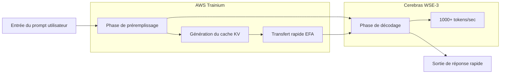

### Titre
Cerebras×OpenAI : Sortir de l'exclusivité GPU et diversifier l'infrastructure IA

### Résumé
OpenAI adopte les puces WSE-3 de Cerebras pour une inférence ultra-rapide à plus de 1000 tokens/sec. Ce contrat de 10 milliards de dollars défie le monopole de NVIDIA et redéfinit le paysage de la concurrence en matière d'infrastructure IA.

### Mots-clés
["Cerebras","OpenAI","AI inference","AI infrastructure","NVIDIA","GPU architecture","Wafer scale"]

### Corps

Dans l'histoire de l'infrastructure IA, le début de l'année 2026 restera gravé comme un tournant. OpenAI a conclu un accord de plus de 10 milliards de dollars avec Cerebras, marquant la première adoption à grande échelle d'accélérateurs d'inférence autres que les GPU NVIDIA en environnement de production. Le fleuron de cette initiative est le « GPT-5.3-Codex-Spark » – un modèle spécialisé dans le codage, fonctionnant à plus de 1 000 tokens par seconde.

Ce mouvement va au-delà d'un simple changement de fournisseur. Il signifie l'introduction d'une concurrence fondamentale dans le bastion de NVIDIA, qui a dominé le marché du matériel IA pendant de nombreuses années. Cet article détaillera les aspects techniques de l'architecture Cerebras WSE-3, le contexte de l'accord avec OpenAI, et l'impact sur l'ensemble de l'industrie grâce à la diversification de l'infrastructure IA.

## Cerebras WSE-3 : L'innovation du moteur à échelle de wafer

### Différences fondamentales avec l'architecture GPU traditionnelle

La plupart des GPU qui soutiennent l'inférence IA moderne adoptent une architecture où les wafers de silicium sont découpés en puces individuelles (dicing), puis connectées en réseau pour réaliser un traitement parallèle. Les H100 et B200 de NVIDIA en sont des exemples typiques, où la mise à l'échelle est réalisée en connectant plusieurs puces via des interconnexions rapides comme NVLink.

L'approche choisie par Cerebras bouleverse cette norme. Le WSE (Wafer Scale Engine) fait fonctionner l'ensemble du wafer comme une seule puce géante. Comme il n'y a pas de découpage physique, il n'y a intrinsèquement aucun surcoût de communication inter-puces.

### Spécifications clés du WSE-3

Le WSE-3 est fabriqué selon le procédé 5 nm de TSMC et affiche les spécifications suivantes :

| Spécification | WSE-3 | NVIDIA H100 | Facteur de comparaison |
|---|---|---|---|
| Nombre de transistors | 4 billions | ~80 milliards | ~50x |
| Nombre de cœurs IA | 900 000 cœurs | 17 408 cœurs | ~52x |
| SRAM sur puce | 44 Go | 50 Mo | ~880x |
| Bande passante mémoire | 21 PB/s | 3,35 To/s | ~7 000x |
| Surface de la puce | 46 255 mm² | 814 mm² | ~57x |
| Performances de calcul de pointe | 125 PFLOPS | 3,958 PFLOPS | ~32x |

La capacité de la SRAM sur puce est particulièrement remarquable. Les 44 Go du WSE-3 correspondent à 880 fois la capacité du H100. Dans l'inférence IA, la bande passante mémoire est souvent un goulot d'étranglement, et la présence d'une grande quantité de mémoire sur puce permet de minimiser les accès à la mémoire externe. C'est le facteur fondamental de l'inférence rapide.

### Vitesse d'inférence permise par l'échelle de wafer

Les 900 000 cœurs du WSE-3 sont tous connectés uniformément selon une topologie de maillage 2D. Cette architecture accélère considérablement la phase de « décodage » dans la génération de tokens.

Lorsqu'un cluster de GPU classique effectue une inférence IA, les données de poids du modèle doivent être transférées entre plusieurs GPU. Dans le WSE-3, tous les poids sont déployés sur la SRAM sur puce, ce qui élimine la nécessité d'accéder à la mémoire externe et permet d'atteindre un débit élevé de plusieurs milliers de tokens/seconde.

## Le contrat de 10 milliards de dollars entre OpenAI et Cerebras

### Aperçu du contrat

En janvier 2026, OpenAI et Cerebras ont conclu un contrat pluriannuel pour la fourniture de 750 mégawatts de ressources de calcul jusqu'en 2028. Le montant total du contrat dépasse les 10 milliards de dollars, ce qui représente une transaction transformatrice pour la taille des activités de Cerebras.

Selon le PDG de Cerebras, Andrew Feldman, la négociation a débuté en août de l'année précédente. Cerebras avait démontré que les modèles open source d'OpenAI fonctionnaient plus efficacement sur ses propres puces que sur des GPU. Cette démonstration technique a ouvert la voie à un contrat majeur.

Pour OpenAI, cet accord est au cœur de sa stratégie de diversification des fournisseurs. Tout en maintenant ses commandes existantes auprès de NVIDIA, AMD et Broadcom, OpenAI a ajouté un approvisionnement de calcul dédié à l'inférence d'une valeur de 10 milliards de dollars auprès de Cerebras. Cela reflète une décision stratégique de « répartir les risques de l'infrastructure IA ».

### GPT-5.3-Codex-Spark : Le premier succès en production

En février 2026, OpenAI a dévoilé « GPT-5.3-Codex-Spark » comme premier résultat de ce partenariat. Conçu comme une version allégée de GPT-5.3-Codex, ce modèle est optimisé pour le codage en temps réel et présente les caractéristiques suivantes :

*   **Vitesse d'inférence** : Plus de 1 000 tokens/sec (environ 15 fois plus rapide que GPT-5.3-Codex)
*   **Fenêtre de contexte** : 128k (texte uniquement)
*   **Environnements pris en charge** : ChatGPT Pro, application Codex, CLI, extension VS Code
*   **Forme de fourniture** : Préversion de recherche (déploiement progressif)

Le chiffre de 1 000 tokens par seconde peut être difficile à appréhender intuitivement, mais comparé aux 65 à 70 tokens/sec de GPT-5.3-Codex, cela signifie que l'IA peut compléter et générer du code plus rapidement que le développeur ne peut taper. C'est une vitesse qui transforme fondamentalement l'« interactivité » du codage.

### Pourquoi le codage est-il le premier cas d'utilisation ?

Le fait qu'OpenAI ait appliqué les puces Cerebras pour la première fois au domaine du codage (codage agentique) est stratégiquement judicieux.

La productivité d'un assistant de codage dépend fortement de la vitesse de réponse. Lorsqu'un développeur reçoit des complétions en temps réel tout en écrivant du code, même un délai de quelques centaines de millisecondes peut rompre la concentration. L'importance de cette vitesse est encore plus grande dans un flux de travail agentique où l'IA agent exécute des tests, corrige des bugs et refactorise du code.

L'inférence ultra-rapide fournie par les puces à échelle de wafer de Cerebras apporte la valeur la plus directe dans ce domaine, ce qui en fait le premier cas d'utilisation choisi.

## Contexte structurel de l'effondrement du monopole de NVIDIA

### La domination de NVIDIA dans l'infrastructure IA

Au cours des cinq dernières années, NVIDIA a quasiment monopolisé le marché de l'entraînement et de l'inférence IA. Les GPU, notamment les H100 et A100, sont devenus l'infrastructure standard de tous les principaux fournisseurs de cloud et des grands laboratoires d'IA, et le puissant verrouillage de l'écosystème CUDA a rendu difficile l'entrée des concurrents.

Cette position monopolistique a également été une contrainte pour OpenAI. La dépendance à un fournisseur unique comporte les risques suivants :

*   **Perte de pouvoir de négociation sur les prix** : NVIDIA détient un avantage significatif dans la fixation des prix.
*   **Goulots d'étranglement d'approvisionnement** : La pénurie de GPU freine l'expansion des services IA.
*   **Point de défaillance unique** : Les problèmes de fabrication et d'approvisionnement de NVIDIA deviennent un risque commercial direct.

### Stratégie de diversification d'OpenAI

OpenAI a commencé à sérieusement diversifier ses fournisseurs à partir de 2025. Tout en maintenant ses contrats existants avec NVIDIA, elle a augmenté ses commandes auprès d'AMD, de Broadcom et de Cerebras. Le contrat de 10 milliards de dollars avec Cerebras est un investissement stratégique particulièrement axé sur les charges de travail d'inférence.

Il est à noter que l'adoption des puces Cerebras est axée sur « l'accélération de l'inférence » et non sur le « calcul général ». Selon les prévisions de Deloitte, l'inférence représentera environ deux tiers des calculs IA totaux en 2026 (contre environ 50 % en 2025), et la demande d'accélérateurs d'inférence devrait encore augmenter à l'avenir.

### Le partenariat AWS et Cerebras : Répercussions sur le cloud

Environ deux mois après le contrat avec OpenAI, le 13 mars 2026, AWS et Cerebras ont annoncé un partenariat important. Il s'agit du déploiement d'une « Architecture d'Inférence Désagrégée » introduisant les puces WSE-3 sur AWS Bedrock.

Techniquement, il s'agit d'une configuration hybride où le processeur Trainium d'AWS est responsable de la phase de préremplissage (traitement du prompt), et le CS-3 de Cerebras est responsable de la phase de décodage (génération de la sortie). Cette répartition des tâches permettrait d'atteindre une capacité de tokens 5 fois supérieure avec la même empreinte matérielle.

Cette approche d'« inférence désagrégée » exploite les différences de caractéristiques de calcul de chaque phase. En confiant le préremplissage aux GPU, qui excellent dans le traitement parallèle, et le décodage au WSE-3, qui possède une grande mémoire sur puce, le débit global est maximisé.

## Stratégie d'entreprise et introduction en bourse de Cerebras

### Croissance vers une valorisation de 2,2 milliards de dollars

En 2024, Cerebras affichait une valorisation de 8 milliards de dollars, mais grâce au contrat avec OpenAI et à l'acquisition de plusieurs clients majeurs (IBM, le Département de l'Énergie américain, etc.), une valorisation de plus de 22 milliards de dollars a été rapportée début 2026. Les ventes estimées pour 2025 dépassent le milliard de dollars, marquant la transition d'une simple startup en phase de recherche à une entreprise d'infrastructure générant des revenus réels.

### Plan d'introduction en bourse et son historique

Cerebras a déposé une demande d'introduction en bourse fin 2025, mais a été contrainte de la retirer en raison de l'examen du CFIUS (Comité sur les investissements étrangers aux États-Unis) concernant la relation capitalistique avec G42 d'Abou Dhabi. Par la suite, G42 a été retiré de la liste des investisseurs, le CFIUS a donné son approbation, et une nouvelle demande visant le T2 2026 est prévue.

Les contrats majeurs avec OpenAI et AWS constituent un excellent contexte pour les performances commerciales précédant l'introduction en bourse.

## L'avenir indiqué par la multipolarisation de l'infrastructure IA

### L'émergence de la concurrence pour « l'inférence la plus rapide »

La sortie de GPT-5.3-Codex-Spark a apporté un nouvel axe de concurrence à l'industrie de l'IA. La « rapidité » devient un facteur de différenciation majeur, en plus de « l'intelligence » du modèle.

Si l'avantage de vitesse de 20x revendiqué par Cerebras (par rapport aux GPU NVIDIA) est prouvé, les fournisseurs de services IA entreront dans une ère où ils choisiront le matériel en fonction de l'application.

*   **Tâches nécessitant une haute précision** : GPU traditionnels (NVIDIA H100/B200, etc.)
*   **Tâches nécessitant une latence ultra-faible** : Cerebras WSE-3
*   **Tâches axées sur l'efficacité des coûts** : AMD MI300X, ASIC personnalisés, etc.

### Impact sur NVIDIA

Bien que la domination du marché de NVIDIA ne soit pas remise en cause, des changements importants se produisent. NVIDIA est confrontée à sa première véritable concurrence sur le marché de l'inférence. Il est particulièrement important de noter le mouvement de « construction d'écosystème » illustré par la combinaison OpenAI-AWS-Cerebras. Tout comme CUDA a longtemps été la raison factuelle du choix des GPU, un nouvel écosystème dédié à l'inférence est en train de se former.

### Transformation de l'expérience développeur

Les changements apportés par l'inférence ultra-rapide vont au-delà de la simple amélioration des indicateurs de performance. Chez Spotify, il est rapporté qu'en décembre 2025, la propagation des outils de codage IA a conduit les meilleurs ingénieurs à « ne plus écrire de code ». Des outils de codage IA ultra-rapides comme Claude Code et GPT-5.3-Codex-Spark accéléreront encore cette transformation.

Une vitesse d'inférence de 1 000 tokens par seconde pourrait devenir un seuil qui transforme fondamentalement le style de collaboration entre les développeurs et l'IA. La complétion de pensées en temps réel, les revues de code instantanées, les suggestions de débogage immédiates – si tout cela est fourni sans délai, la productivité du développement logiciel augmentera de manière exponentielle.

## Conclusion

Le partenariat entre Cerebras WSE-3 et OpenAI a apporté trois changements importants à l'infrastructure d'inférence IA.

Premièrement, en tant que changement technologique, l'architecture à échelle de wafer a établi une nouvelle norme de performance de « 1 000 tokens par seconde ». Deuxièmement, en tant que changement de structure industrielle, le passage d'une concentration sur NVIDIA à une multipolarisation a sérieusement commencé. Troisièmement, en tant que changement d'axe de concurrence, la « vitesse » d'inférence, aux côtés de « l'intelligence » du modèle, s'est établie comme un élément de différenciation clé.

L'« architecture d'inférence désagrégée » démontrée par le partenariat avec AWS suggère une adoption plus large. Si les utilisateurs de cloud ordinaires peuvent bénéficier du WSE-3 via Amazon Bedrock au cours de 2026, l'inférence rapide cessera d'être le privilège de quelques grands laboratoires pour devenir un composant standard des services IA.

Les murs de l'écosystème que NVIDIA a mis des années à construire sont élevés. Cependant, lorsqu'un contrat de 10 milliards de dollars, un partenariat stratégique avec AWS et un avantage de vitesse prouvé de 15x que les développeurs peuvent expérimenter se combinent, la carte de la concurrence de l'infrastructure IA est certainement en train d'être redessinée.

---

## Références

| Titre | Source | Date | URL |
|---|---|---|---|
| OpenAI deploys Cerebras chips for 15x faster code generation | VentureBeat | 12 février 2026 | https://venturebeat.com/technology/openai-deploys-cerebras-chips-for-15x-faster-code-generation-in-first-major |
| Cerebras Inks Transformative \$10 Billion Inference Deal With OpenAI | NextPlatform | 15 janvier 2026 | https://www.nextplatform.com/2026/01/15/cerebras-inks-transformative-10-billion-inference-deal-with-openai/ |
| OpenAI signs deal, worth \$10B, for compute from Cerebras | TechCrunch | 14 janvier 2026 | https://techcrunch.com/2026/01/14/openai-signs-deal-reportedly-worth-10-billion-for-compute-from-cerebras/ |
| Introducing GPT-5.3-Codex-Spark | OpenAI Official | février 2026 | https://openai.com/index/introducing-gpt-5-3-codex-spark/ |
| OpenAI GPT-5.3-Codex-Spark Now Running at 1K Tokens Per Second | ServeTheHome | février 2026 | https://www.servethehome.com/openai-gpt-5-3-codex-spark-now-running-at-1k-tokens-per-second-on-big-cerebras-chips/ |
| Cerebras WSE-3 AI Chip Launched 56x Larger than NVIDIA H100 | ServeTheHome | mars 2024 | https://www.servethehome.com/cerebras-wse-3-ai-chip-launched-56x-larger-than-nvidia-h100-vertiv-supermicro-hpe-qualcomm/ |
| AWS and Cerebras Collaboration Aims to Set a New Standard for AI Inference | BusinessWire | 13 mars 2026 | https://www.businesswire.com/news/home/20260313406341/en/AWS-and-Cerebras-Collaboration-Aims-to-Set-a-New-Standard-for-AI-Inference-Speed-and-Performance-in-the-Cloud |
| Cerebras scores OpenAI deal worth over \$10 billion ahead of IPO | CNBC | 14 janvier 2026 | https://www.cnbc.com/2026/01/14/cerebras-scores-openai-deal-worth-over-10-billion.html |
| OpenAI chip deal with Cerebras adds to roster of Nvidia, AMD, Broadcom | CNBC | 16 janvier 2026 | https://www.cnbc.com/2026/01/16/openai-chip-deal-with-cerebras-adds-to-roster-of-nvidia-amd-broadcom.html |
| OpenAI Partners with Cerebras to Bring High-Speed Inference to the Mainstream | Cerebras Blog | février 2026 | https://www.cerebras.ai/blog/openai-partners-with-cerebras-to-bring-high-speed-inference-to-the-mainstream |
| A Comparison of the Cerebras Wafer-Scale Integration Technology with Nvidia GPU-based Systems | arXiv | mars 2025 | https://arxiv.org/html/2503.11698v1 |
| Cerebras is coming to AWS | Cerebras Blog | mars 2026 | https://www.cerebras.ai/blog/cerebras-is-coming-to-aws |
| 2026 IPO Alert: Nvidia Rival Cerebras Systems Targets Debut in Q2 | TipRanks | janvier 2026 | https://www.tipranks.com/news/2026-ipo-alert-nvidia-rival-cerebras-targets-debut-in-q2 |

---

> Cet article a été généré automatiquement par LLM. Il peut contenir des erreurs.
