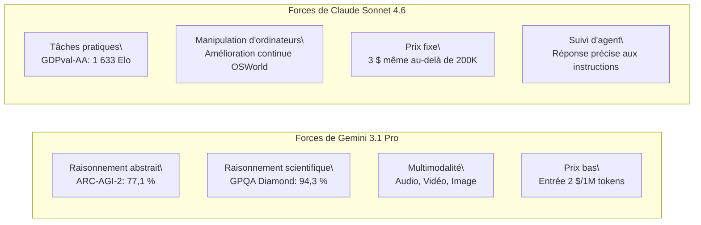

Au cours de la troisième semaine de février 2026, deux modèles très attendus ont fait leur apparition dans le secteur de l'IA, presque simultanément. Le **Claude Sonnet 4.6** d'Anthropic, lancé le 17 février, et le **Gemini 3.1 Pro** de Google DeepMind, dévoilé le 19 février. Tous deux se positionnent comme des "modèles de pointe avancés", promettant une prise en charge d'une fenêtre contextuelle d'un million de tokens et une amélioration significative des capacités de raisonnement généralistes.

La sortie simultanée de ces deux modèles n'est pas une coïncidence. Alors que l'axe de concurrence des LLM évolue du "meilleur rendement sur une seule tâche" vers "l'utilisation par agents, le traitement de longs contextes et l'efficacité des coûts", les deux entreprises ciblent le même segment : les développeurs d'entreprise et les constructeurs d'agents IA. Cet article examine les spécifications, les chiffres de benchmark et les différences de caractéristiques pratiques des deux modèles, afin de fournir aux développeurs des directives pour faire le choix optimal.

## Contexte de sortie : Le paysage concurrentiel

### La stratégie d'Anthropic

La sortie de Claude Sonnet 4.6, seulement 12 jours après celle de Claude Opus 4.6 le 5 février de la même année, témoigne d'une impressionnante rapidité. Anthropic a positionné sa gamme "Sonnet", réputée pour son efficacité en termes de coûts, comme modèle par défaut pour tous les utilisateurs, la déployant à tous les niveaux, y compris pour les plans gratuits. La stratégie consiste à améliorer considérablement les performances tout en maintenant le prix identique à celui de Sonnet 4.5 : 3 $/entrée et 15 $/sortie (par million de tokens).

L'évaluation sur Claude Code est particulièrement intéressante. Des données internes ont révélé que les développeurs préféraient Sonnet 4.6 dans 70 % des cas, et même dans 59 % des cas par rapport à Opus 4.6. Ce positionnement, "Sonnet surpassant Opus en termes de rapport prix/performance", fonctionne efficacement pour attirer les environnements de production sensibles aux coûts d'utilisation de l'API.

Parallèlement, Anthropic a annoncé un partenariat avec Infosys (un leader indien de l'informatique) le 17 février. Cet effort vise à intégrer les modèles Claude à la plateforme Topaz AI pour automatiser des flux de travail d'entreprise complexes dans des secteurs tels que la banque, les télécommunications et la fabrication, signalant ainsi une accélération du déploiement en entreprise.

### La stratégie de Google DeepMind

Google DeepMind a annoncé avoir atteint "les meilleurs scores jamais enregistrés" sur plusieurs benchmarks avec Gemini 3.1 Pro. Notamment, 77,1 % sur ARC-AGI-2 (benchmark de raisonnement abstrait), ce qui représente une amélioration spectaculaire d'environ deux fois par rapport à la génération précédente, Gemini 3 Pro. Par rapport à ses concurrents contemporains Claude Opus 4.6 (68,8 %) et GPT-5.2 (52,9 %), Gemini affiche un avantage clair sur ARC-AGI-2.

De plus, Google a également fait preuve d'agressivité sur le plan tarifaire. Pour une utilisation normale inférieure à 200 000 tokens, le prix est fixé à 2 $/entrée et 12 $/sortie (par million de tokens), soit 33 à 35 % de moins que Sonnet 4.6. L'entreprise affiche clairement sa volonté de dominer à la fois en "intelligence et en efficacité des coûts".

En outre, la disponibilité immédiate de la fenêtre contextuelle de 1 million de tokens dans un environnement de production sans liste d'attente constitue un point de différenciation. Contrairement à la fenêtre de 1 million de tokens de Sonnet 4.6, qui est considérée comme bêta et fournie progressivement, Gemini offre un avantage aux développeurs souhaitant démarrer immédiatement l'analyse de bases de code volumineuses ou de dépôts de fichiers multiples.

## Comparaison des spécifications

Voici un résumé des spécifications de base des deux modèles.

| Élément              | Claude Sonnet 4.6         | Gemini 3.1 Pro             |
| :------------------- | :------------------------ | :------------------------- |
| Date de sortie       | 17 février 2026           | 19 février 2026            |
| Longueur du contexte | 200K (1M en bêta)         | 1M (par défaut)            |
| Prix d'entrée (1M tokens) | 3,00 $                    | 2,00 $ (≤200K) / 4,00 $ (dépassement) |
| Prix de sortie (1M tokens) | 15,00 $                   | 12,00 $ (≤200K) / 18,00 $ (dépassement) |
| Prise en charge multimodale | Texte, Image              | Texte, Image, Audio, Vidéo |
| Tokens de sortie max. | 64K                       | 64K                        |
| Formes de distribution | API, Claude.ai, Claude Code | API, Gemini.google.com, Vertex AI |

Pour clarifier les prix : Gemini 3.1 Pro est moins cher pour moins de 200 000 tokens, mais le prix monte à 4 $/entrée et 18 $/sortie au-delà. Sonnet 4.6 a un prix fixe de 3 $/15 $ quelle que soit la longueur, ce qui peut rendre Sonnet plus prévisible en termes de coûts pour les charges de travail utilisant fréquemment de longs contextes. Il est important de comprendre la distribution de la longueur du contexte lors de l'estimation des coûts des traitements par lots.

## Comparaison détaillée des benchmarks

### Chiffres des benchmarks clés

```
Comparaison des benchmarks (données publiques de février 2026)

ARC-AGI-2 (Raisonnement abstrait)
  Gemini 3.1 Pro  : 77,1 %  ← Claude Opus 4.6 (68,8 %), GPT-5.2 (52,9 %)
  Claude Sonnet 4.6: 58,3 %
  Différence : +18,8 pts (Avantage Gemini)

GPQA Diamond (Sciences au niveau master)
  Gemini 3.1 Pro  : 94,3 %  ← Meilleur score de l'industrie
  Claude Sonnet 4.6: 74,1 %
  Différence : +20,2 pts (Avantage Gemini)

SWE-Bench Pro (Génie logiciel)
  Gemini 3.1 Pro  : 54,2 %
  Claude Sonnet 4.6: 42,7 %
  Différence : +11,5 pts (Avantage Gemini)

SWE-Bench Verified (Benchmark officiel Gemini)
  Gemini 3.1 Pro  : 80,6 %

Terminal-Bench 2.0 (Opérations de terminal)
  Gemini 3.1 Pro  : 68,5 %

GDPval-AA Elo (Tâches à valeur économique)
  Claude Sonnet 4.6: 1 633 Elo  ← Niveau supérieur à Opus 4.6
  Gemini 3.1 Pro  : 1 317 Elo
  Différence : +316 pts (Avantage Sonnet)

MMMLU (Compréhension multilingue)
  Gemini 3.1 Pro  : 92,6 %

Précision en long contexte (à 128K tokens)
  Gemini 3.1 Pro  : 84,9 %
```

Les chiffres montrent que Gemini 3.1 Pro surpasse systématiquement dans les "benchmarks de raisonnement pur". En revanche, GDPval-AA mesure le classement Elo de "tâches pratiques générant une valeur économique" telles que la rédaction de documents commerciaux, la modélisation financière et la recherche académique, où Sonnet 4.6 prend une avance décisive. La coexistence d'un "roi des benchmarks" et d'un "roi des tâches pratiques" illustre clairement la différence de caractéristiques entre les deux modèles.

### Interprétation des benchmarks

**GPQA Diamond (Graduate-Level Google-Proof Q&A)** est une collection de problèmes de niveau master en sciences, mesurant la capacité à résoudre des questions difficiles en physique, chimie et biologie. Le score de 94,3 % est le meilleur de l'industrie, indiquant une capacité à résoudre des problèmes proches du niveau d'un "biologiste, chimiste ou physicien".

**ARC-AGI-2** est un benchmark conçu par des chercheurs en IA pour "mesurer le véritable raisonnement abstrait qui ne peut être résolu par la mémorisation". Il teste la capacité à abstraire de nouvelles règles à partir d'un petit nombre d'exemples. Le score de 77,1 % est remarquable pour l'industrie, surpassant le Claude Opus 4.6 (68,8 %) et le GPT-5.2 (52,9 %) de la même période.

En revanche, **GDPval-AA** est une évaluation globale des "tâches pratiques créant de la valeur économique", composée de problèmes proches des tâches professionnelles réelles comme la rédaction de rapports, l'analyse financière et la planification de projets. Le score de 1 633 Elo de Sonnet 4.6, supérieur même à Opus 4.6, indique la supériorité de Sonnet en termes d'utilité pour la génération de "résultats exploitables".

## Différences pratiques dans les caractéristiques

### Assistance au codage

Bien que Gemini soit supérieur sur le papier pour les tâches de codage, les évaluations subjectives des développeurs montrent des tendances différentes. Sonnet 4.6 est très apprécié pour sa "capacité à suivre des instructions nuancées" et sa "revue de code progressive", surpassant dans la spécification du format de revue de code et l'adaptation aux conventions de codage personnalisées.

L'écart dans les scores SWE-Bench s'explique par le fait que de nombreux scénarios impliquent des agents manipulant des fichiers de manière autonome et effectuant des refactorisations à grande échelle ; dans les cas d'utilisation de type pair-programmation où des instructions détaillées sont données par un humain, la capacité de suivi de Sonnet constitue un atout.

```python
# Exemple d'agent utilisant Claude Sonnet 4.6
import anthropic

client = anthropic.Anthropic()

# Analyse l'ensemble de la base de code avec une prise en charge de 1 million de tokens
with open("large_codebase.txt", "r") as f:
    codebase_content = f.read()

message = client.messages.create(
    model="claude-sonnet-4-6-20260217",
    max_tokens=8192,
    messages=[
        {
            "role": "user",
            "content": (
                "Analysez la base de code suivante et listez les vulnérabilités de sécurité:\
\
"
                + codebase_content
            )
        }
    ]
)
print(message.content[0].text)
```

### Traitement de longs contextes et multimodalité

Gemini 3.1 Pro a atteint une précision de 84,9 % sur le benchmark de long contexte à 128 000 tokens, gérant des contextes composites incluant des PDF volumineux, des transcriptions audio et des transcrits vidéo. La prise en charge native de l'audio et de la vidéo est un élément de différenciation qui manque actuellement à Sonnet 4.6.

Sonnet 4.6 offre une fonctionnalité de "Computer Use" à un niveau pratique, et son affinité avec l'écosystème Anthropic est forte pour les flux de travail d'agents impliquant la manipulation de navigateurs et d'applications GUI. Des améliorations continues sont signalées sur le benchmark OSWorld, attestant de performances stables dans la construction de pipelines d'automatisation.

### Écart impressionnant dans les tâches de connaissance

La différence de score sur GDPval-AA (316 points Elo) ne doit pas être négligée. Sonnet 4.6 a une nette supériorité dans les tâches qui "transforment les connaissances en résultats pratiques", telles que le résumé de rapports financiers, la création de comptes rendus de réunions et la génération de rapports d'analyse transversale sur plusieurs documents. Ceci reflète l'orientation de conception d'Anthropic visant à renforcer "la profondeur de la compréhension contextuelle et la planification des agents".

## Différences dans les philosophies de conception d'architecture

En analysant les informations publiques, plusieurs contrastes émergent concernant les philosophies de conception des deux modèles.

Gemini 3.1 Pro a une nature plus proche d'un "moteur de raisonnement généraliste évolutif". Son architecture semble orientée vers le traitement unifié de toutes les modalités d'entrée, y compris l'audio, la vidéo et les dépôts de code, dans le but d'atteindre des performances maximales sur des tâches de raisonnement pur comme ARC-AGI-2. La carte du modèle de Google DeepMind décrit en détail des évaluations de sécurité basées sur le cadre "frontier safety", démontrant une approche de conception conçue pour un déploiement à l'échelle mondiale.

Claude Sonnet 4.6 privilégie la perfection en tant qu'"agent d'exécution fiable". La combinaison de la manipulation d'ordinateurs, du raisonnement sur de longs contextes et de la planification d'agents suggère une sélection de fonctionnalités visant à s'adapter aux flux de travail semi-autonomes où l'intervention humaine est possible. L'accumulation d'expériences dans l'automatisation des flux de travail d'entreprise complexes pour les banques, les télécommunications et la fabrication grâce au partenariat d'entreprise avec Infosys est alignée sur la stratégie commerciale d'Anthropic.



## Tendances LLM de 2026 indiquées par la concurrence

La sortie simultanée de Claude Sonnet 4.6 et Gemini 3.1 Pro offre un excellent point d'observation sur l'état actuel de la concurrence des LLM.

**Le traitement des longs contextes comme prérequis** : Les deux modèles fournissent une capacité de contexte de 1 million de tokens par défaut ou en bêta, ce qui n'est plus un élément de différenciation mais devient une exigence. Avec 1M de tokens, il est possible d'entrer l'ensemble de la base de code d'un projet, la documentation associée et les rapports de bugs passés en une seule fois.

**Accélération de l'optimisation pour les agents** : L'utilisation d'outils pour les agents, la manipulation d'ordinateurs et le raisonnement en plusieurs étapes sont des domaines d'intérêt communs pour les deux parties. Parallèlement à la diffusion de MCP, la question de savoir quel modèle deviendra la norme en tant que runtime d'agent est également un axe de compétition.

**Affinement de la compétition des benchmarks** : L'évolution va des taux de réponse corrects sur des problèmes isolés vers des métriques mesurant "le raisonnement impossible à mémoriser" comme ARC-AGI-2 ou "la valeur économique" comme GDPval-AA. Il s'agit d'un passage de la "réponse précise" à "un livrable utile".

**Poursuite de la concurrence sur les prix** : Le prix d'entrée de 2 $/1M tokens de Gemini est moins d'un dixième du prix de GPT-4 en 2023. Si la concurrence accélère la démocratisation des modèles, elle accroît également la pression sur la monétisation.

## Guide d'utilisation pour les développeurs

Le choix dépendra de "la nature de la tâche", "la distribution de la longueur du contexte" et "l'intégration avec la pile existante".

| Cas d'utilisation                                  | Modèle recommandé | Raison                                                                   |
| :------------------------------------------------ | :---------------- | :----------------------------------------------------------------------- |
| Raisonnement scientifique, preuves mathématiques | Gemini 3.1 Pro    | GPQA Diamond 94,3 % · ARC-AGI-2 77,1 %                                   |
| Rédaction de rapports, analyse financière        | Claude Sonnet 4.6 | Plus performant sur les tâches pratiques avec GDPval-AA 1 633 Elo      |
| Analyse de bases de code volumineuses (1M immédiat) | Gemini 3.1 Pro    | 1M disponible immédiatement en production sans liste d'attente            |
| Agents de manipulation d'ordinateurs              | Claude Sonnet 4.6 | Computer Use · Amélioration continue OSWorld                             |
| Multimodalité incluant audio/vidéo               | Gemini 3.1 Pro    | Prise en charge native (non prise en charge par Sonnet)                  |
| Intégration avec Google Workspace                 | Gemini 3.1 Pro    | Intégration native                                                       |
| Utilisation fréquente de prompts longs (>200K)     | Claude Sonnet 4.6 | Pas de fluctuation des coûts au-delà de 200K (fixe à 3 $)                  |
| Utilisation de prompts de taille moyenne (≤200K) | Gemini 3.1 Pro    | 33 % moins cher avec une entrée à 2 $                                    |

Il est impossible de déclarer un gagnant absolu. C'est la réponse honnête de la concurrence actuelle des LLM. Les développeurs doivent évaluer chaque cas d'utilisation spécifique en tenant compte des exigences de la tâche, de la structure des coûts et de la facilité d'intégration avec leur pile existante.

## Références

| Titre                                                                    | Source       | Date       | URL                                                                                                                               |
| :----------------------------------------------------------------------- | :----------- | :--------- | :-------------------------------------------------------------------------------------------------------------------------------- |
| Claude Sonnet 4.6 Release Announcement                                   | Anthropic    | 2026/02/17 | https://www.anthropic.com/news/claude-sonnet-4-6                                                                                    |
| Gemini 3.1 Pro Release Announcement                                      | Google Blog  | 2026/02/19 | https://blog.google/innovation-and-ai/models-and-research/gemini-models/gemini-3-1-pro/                                                |
| Gemini 3.1 Pro Model Card                                                | Google DeepMind | 2026/02/19 | https://deepmind.google/models/model-cards/gemini-3-1-pro/                                                                          |
| Deep Comparison of Gemini 3.1 Pro and Claude Sonnet 4.6                  | Apiyi.com Blog | 2026/03    | https://help.apiyi.com/en/gemini-3-1-pro-vs-claude-sonnet-4-6-comparison-en.html                                                  |
| Gemini 3.1 Pro vs Sonnet 4.6 vs Opus 4.6 vs GPT-5.2 (2026)                 | AceCloud AI  | 2026/03    | https://acecloud.ai/blog/gemini-3-1-pro-vs-sonnet-4-6-vs-opus-4-6-vs-gpt-5-2/                                                      |
| Gemini 3.1 Pro Complete Guide 2026: Benchmarks, Pricing, API             | NxCode       | 2026/02    | https://www.nxcode.io/en/resources/news/gemini-3-1-pro-complete-guide-benchmarks-pricing-api-2026                                   |
| Gemini 3.1 Pro Leads Most Benchmarks But Trails Claude Opus 4.6 in Some Tasks | Trending Topics EU | 2026/02    | https://www.trendingtopics.eu/gemini-3-1-pro-leads-most-benchmarks-but-trails-claude-opus-4-6-in-some-tasks/                        |
| Gemini 3.1 Pro vs Claude Sonnet 4.6: 2026 Comparison, Benchmarks         | AI.cc        | 2026/02    | https://www.ai.cc/blogs/gemini-3-1-pro-vs-claude-sonnet-4-6-2026-comparison-benchmarks/                                            |
| Infosys × Anthropic Enterprise AI Agent Partnership                      | TechCrunch   | 2026/02/17 | https://techcrunch.com/2026/02/17/as-ai-jitters-rattle-it-stocks-infosys-partners-with-anthropic-to-build-enterprise-grade-ai-agents/ |
| AI Weekly Digest February 3rd Week 2026                                  | Synapse AI Digest | 2026/02/21 | https://armes.ai/blog/frontier-model-explosion-february-2026                                                                      |

---

> Cet article a été généré automatiquement par LLM. Il peut contenir des erreurs.
