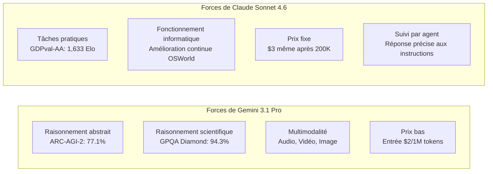

Au cours de la troisième semaine de février 2026, deux modèles remarquables ont fait leur apparition dans l'industrie de l'IA, quasi simultanément. **Claude Sonnet 4.6**, lancé par Anthropic le 17 février, et **Gemini 3.1 Pro**, publié par Google DeepMind le 19 février. Les deux se targuent d'être des « modèles de pointe » et annoncent une compatibilité avec une fenêtre contextuelle de 1 million de tokens ainsi qu'une amélioration significative de leurs capacités de raisonnement général.

La sortie simultanée de ces deux modèles n'est pas un hasard. Alors que l'axe de compétition des LLM évolue de la « meilleure performance sur une tâche unique » vers « l'utilisation par agent, le traitement de longs contextes et l'efficacité des coûts », les deux entreprises ciblent la même audience – les développeurs d'entreprise et les constructeurs d'agents IA. Cet article examine les spécifications, les chiffres des benchmarks et les différences en termes de caractéristiques pratiques des deux modèles, afin de fournir des directives aux développeurs pour faire le choix optimal.

## Contexte de lancement : Le paysage de la compétition

### La stratégie d'Anthropic

Le lancement de Claude Sonnet 4.6, seulement 12 jours après celui de Claude Opus 4.6 le 5 février de la même année, est remarquable par sa rapidité. Anthropic a positionné sa gamme « Sonnet », plus rentable, comme modèle par défaut pour tous les utilisateurs, la déployant auprès de toutes les couches, y compris les plans gratuits. La stratégie consiste à maintenir le prix du Sonnet 4.5 (3 $/entrée, 15 $/sortie par million de tokens) tout en améliorant considérablement les performances.

Les évaluations sur Claude Code sont particulièrement révélatrices. Des données internes ont montré que les développeurs choisissent Sonnet 4.6 dans 70 % des cas, et même dans 59 % des cas par rapport à Opus 4.6. Ce positionnement de « Sonnet surpassant Opus » en termes de rapport prix/performance s'avère efficace pour attirer les environnements de production sensibles au coût des API.

Parallèlement, Anthropic a annoncé un partenariat avec Infosys (un géant indien de l'IT) le 17 février. L'objectif est d'intégrer les modèles Claude à la plateforme Topaz AI pour automatiser des flux de travail complexes dans des secteurs tels que les banques, les télécommunications et l'industrie manufacturière, signalant ainsi une accélération du déploiement en entreprise.

### La stratégie de Google DeepMind

Google DeepMind a annoncé avoir atteint les « meilleurs scores historiques » sur plusieurs benchmarks avec Gemini 3.1 Pro. Notamment, 77,1 % sur ARC-AGI-2 (benchmark de raisonnement abstrait) représente une amélioration spectaculaire, environ le double de celle de la génération précédente Gemini 3 Pro. Comparé à Claude Opus 4.6 (68,8 %) et GPT-5.2 (52,9 %) lors de cette période, Gemini montre une avance claire sur ARC-AGI-2.

De plus, Google a également été agressif sur les prix. Pour une utilisation normale inférieure à 200K tokens, le prix est de 2 $/entrée et 12 $/sortie (par million de tokens), ce qui est 33 à 35 % moins cher que Sonnet 4.6. L'entreprise affiche clairement sa volonté de dominer à la fois sur « l'intelligence et l'efficacité des coûts ».

En outre, le fait que la fenêtre contextuelle de 1 million de tokens soit immédiatement disponible en production sans liste d'attente est un autre point de différenciation. Contrairement au 1M de Sonnet 4.6 qui est encore en version bêta et déployé progressivement, Gemini offre un avantage aux développeurs souhaitant analyser rapidement de grandes bases de code ou des dépôts contenant plusieurs fichiers.

## Comparaison des spécifications

Récapitulons les spécifications de base des deux modèles.

| Article | Claude Sonnet 4.6 | Gemini 3.1 Pro |
|:-----|:-----------------|:--------------|
| Date de sortie | 17 février 2026 | 19 février 2026 |
| Longueur du contexte | 200K (1M en bêta) | 1M (par défaut) |
| Prix d'entrée (1M tokens) | 3,00 $ | 2,00 $ (≤200K) / 4,00 $ (au-delà) |
| Prix de sortie (1M tokens) | 15,00 $ | 12,00 $ (≤200K) / 18,00 $ (au-delà) |
| Prise en charge multimodale | Texte, Image | Texte, Image, Audio, Vidéo |
| Tokens de sortie max. | 64K | 64K |
| Formes de distribution | API, Claude.ai, Claude Code | API, Gemini.google.com, Vertex AI |

Précision concernant les prix. Gemini 3.1 Pro est moins cher pour moins de 200K tokens, mais le prix augmente à 4 $/18 $ au-delà. Sonnet 4.6 a un prix fixe de 3 $/15 $, ce qui rend parfois Sonnet plus prévisible en termes de coûts pour les charges de travail utilisant fréquemment de longs contextes. Il est crucial de comprendre la distribution de la longueur du contexte lors de l'estimation des coûts des traitements par lots.

## Comparaison détaillée des benchmarks

### Chiffres clés des benchmarks

```
Comparaison des benchmarks (données publiques de février 2026)

ARC-AGI-2 (Raisonnement abstrait)
  Gemini 3.1 Pro  : 77.1%  ← Claude Opus 4.6 (68.8%), GPT-5.2 (52.9%)
  Claude Sonnet 4.6: 58.3%
  Différence : +18.8 pts (avantage Gemini)

GPQA Diamond (Sciences au niveau du troisième cycle)
  Gemini 3.1 Pro  : 94.3%  ← Meilleur score du secteur
  Claude Sonnet 4.6: 74.1%
  Différence : +20.2 pts (avantage Gemini)

SWE-Bench Pro (Ingénierie logicielle)
  Gemini 3.1 Pro  : 54.2%
  Claude Sonnet 4.6: 42.7%
  Différence : +11.5 pts (avantage Gemini)

SWE-Bench Verified (Benchmark officiel Gemini)
  Gemini 3.1 Pro  : 80.6%

Terminal-Bench 2.0 (Opérations de terminal)
  Gemini 3.1 Pro  : 68.5%

GDPval-AA Elo (Tâches à valeur économique)
  Claude Sonnet 4.6: 1,633 Elo  ← Niveau supérieur à Opus 4.6
  Gemini 3.1 Pro  : 1,317 Elo
  Différence : +316 pts (avantage Sonnet)

MMMLU (Compréhension multilingue)
  Gemini 3.1 Pro  : 92.6%

Précision en long contexte (à 128K tokens)
  Gemini 3.1 Pro  : 84.9%
```

Les chiffres montrent que Gemini 3.1 Pro surpasse systématiquement dans les benchmarks de « raisonnement pur ». En revanche, GDPval-AA mesure le classement Elo de « tâches pratiques générant de la valeur économique » telles que la rédaction de documents commerciaux, la modélisation financière et la recherche académique, et c'est là que Sonnet 4.6 prend une avance considérable avec 1 633 points. La situation où le « roi des benchmarks » et le « roi de la pratique » sont différents illustre clairement la divergence des caractéristiques des deux modèles.

### Interprétation des benchmarks

**GPQA Diamond (Graduate-Level Google-Proof Q&A)** est un ensemble de problèmes de niveau universitaire dans les domaines scientifiques, mesurant la capacité à résoudre des questions complexes en physique, chimie et biologie. Un score de 94,3 % est le meilleur score du secteur, ce qui équivaut à pouvoir résoudre des problèmes au niveau de « biologistes, chimistes et physiciens ». 

**ARC-AGI-2** a été conçu par des chercheurs en IA pour « mesurer un véritable raisonnement abstrait qui ne peut être résolu par la mémorisation ». Il teste la capacité à abstraire de nouvelles règles à partir d'un petit nombre d'exemples. Un score de 77,1 % est un niveau exceptionnel dans l'ensemble du secteur, réalisant une performance supérieure à Claude Opus 4.6 (68,8 %) et GPT-5.2 (52,9 %) à la même période. 

Par ailleurs, **GDPval-AA** est une évaluation complète des « tâches pratiques générant de la valeur économique », composée d'une série de problèmes proches du travail réel, tels que la rédaction de rapports, l'analyse financière et la planification de projets. Le score de 1 633 Elo de Sonnet 4.6 dépasse même celui d'Opus 4.6, démontrant la supériorité de Sonnet en termes de génération de « livrables utilisables ».

## Différences pratiques

### Assistance au codage

Bien que Gemini soit numériquement avantagé pour les tâches de codage, l'évaluation subjective des développeurs montre une tendance différente. Sonnet 4.6 est hautement apprécié pour « le suivi des instructions nuancées » et « la revue de code itérative », montrant une supériorité dans la spécification du format de revue de code et l'adaptation aux conventions de codage personnalisées.

La différence dans les scores SWE-Bench s'explique par le fait que de nombreux scénarios impliquent des agents manipulant des fichiers de manière autonome et effectuant des refactorisations à grande échelle. Dans les applications de type pair-programmation où un humain donne des instructions détaillées, la capacité de suivi de Sonnet devient un atout.

```python
# Exemple d'agent utilisant Claude Sonnet 4.6
import anthropic

client = anthropic.Anthropic()

# Analyse d'une base de code entière avec prise en charge de 1 million de tokens
with open("large_codebase.txt", "r") as f:
    codebase_content = f.read()

message = client.messages.create(
    model="claude-sonnet-4-6-20260217",
    max_tokens=8192,
    messages=[
        {
            "role": "user",
            "content": (
                "Analysez la base de code suivante et listez les vulnérabilités de sécurité:\n\n"
                + codebase_content
            )
        }
    ]
)
print(message.content[0].text)
```

### Traitement de longs contextes et multimodalité

Gemini 3.1 Pro a enregistré une précision de 84,9 % dans le benchmark de longs contextes à 128K tokens, et il prend en charge le traitement de contextes composites incluant des PDF volumineux, des transcriptions audio et des scripts vidéo. La prise en charge native de l'audio et de la vidéo est un élément différenciateur que Sonnet 4.6 ne possède pas actuellement.

Sonnet 4.6 fournit des fonctionnalités d'opération informatique (Computer Use) à un niveau pratique, et l'écosystème d'Anthropic est très compatible avec les flux de travail d'agents impliquant des opérations de navigateur ou d'applications GUI. Des améliorations continues sont signalées sur le benchmark OSWorld, démontrant des résultats stables dans la construction de pipelines d'automatisation.

### Avantage écrasant dans les tâches de connaissance

La différence de 316 points Elo sur GDPval-AA ne peut être négligée. Dans les tâches de « transformation de connaissances en résultats pratiques », telles que le résumé de rapports financiers, la création de comptes rendus de réunion ou la génération de rapports d'analyse transversale de plusieurs documents, Sonnet 4.6 a un avantage net. Cela reflète la stratégie de conception d'Anthropic axée sur le « renforcement de la compréhension du contexte et de la planification par agent ».

## Différences dans la philosophie de conception architecturale

En analysant les informations publiées, plusieurs contrastes émergent quant aux philosophies de conception des deux modèles.

Gemini 3.1 Pro a une forte identité de « moteur de raisonnement général évolutif ». Son architecture semble orientée vers le traitement unifié de toutes les modalités d'entrée, y compris l'audio, la vidéo et les dépôts de code, visant la meilleure performance sur les tâches de raisonnement pur de type ARC-AGI-2. Le modèle carte de Google DeepMind décrit en détail l'évaluation de la sécurité basée sur le framework « frontier safety », témoignant d'une approche de conception pensée pour un déploiement à l'échelle mondiale.

Claude Sonnet 4.6 privilégie la complétion d'un « agent d'exécution fiable ». La combinaison du fonctionnement informatique, du raisonnement sur de longs contextes et de la planification par agent reflète une sélection de fonctionnalités conçue pour s'adapter aux flux de travail semi-autonomes impliquant une intervention humaine. Les réalisations d'Anthropic dans l'automatisation des flux de travail complexes pour les secteurs bancaire, des télécommunications et de l'industrie manufacturière, grâce à son partenariat avec Infosys, sont alignées sur sa stratégie commerciale.



## Tendances des LLM en 2026 révélées par la compétition

La sortie simultanée de Claude Sonnet 4.6 et Gemini 3.1 Pro constitue un excellent point d'observation de l'état actuel de la compétition des LLM.

**Le traitement de longs contextes devient la norme** : Les deux modèles proposent une fenêtre contextuelle de 1 million de tokens par défaut ou en bêta, ce qui n'est plus un élément de différenciation mais une condition préalable. Avec 1M de tokens, il est possible d'entrer simultanément la base de code entière d'un projet, la documentation associée et les rapports de bogues passés.

**Optimisation accélérée pour les agents** : L'utilisation d'outils pour les agents, le fonctionnement informatique, le raisonnement en plusieurs étapes – ce sont des domaines sur lesquels les deux se concentrent. Avec la diffusion de MCP, la question de savoir quel modèle deviendra la norme pour les environnements d'exécution d'agents est également un axe de compétition.

**Avancement de la compétition des benchmarks** : Il y a une transition des taux de réussite sur des problèmes isolés vers des indicateurs mesurant le « raisonnement impossible à mémoriser » comme ARC-AGI-2, ou la « valeur économique » comme GDPval-AA. Il s'agit d'un passage de « réponses précises » à « livrables utilisables ».

**Poursuite de la guerre des prix** : Le prix d'entrée de 2 $/1M de Gemini est inférieur d'un ordre de grandeur au prix des modèles de classe GPT-4 en 2023. La compétition accélère la démocratisation des modèles, mais augmente également la pression sur la monétisation.

## Directives d'utilisation pour les développeurs

Le choix dépendra des «3 points : la nature de la tâche, la distribution de la longueur du contexte, et l'intégration avec les stacks existants ».

| Cas d'utilisation | Modèle recommandé | Raison |
|:-----------|:---------|:----|
| Raisonnement scientifique, preuves mathématiques | Gemini 3.1 Pro | GPQA Diamond 94.3%・ARC-AGI-2 77.1% |
| Rédaction de rapports, analyse financière | Claude Sonnet 4.6 | Le plus performant pour les tâches pratiques avec GDPval-AA 1,633 Elo |
| Analyse de bases de code volumineuses (1M immédiat) | Gemini 3.1 Pro | 1M disponible immédiatement en production sans liste d'attente |
| Agents d'opération informatique | Claude Sonnet 4.6 | Computer Use, amélioration continue OSWorld |
| Multimodalité incluant audio et vidéo | Gemini 3.1 Pro | Prise en charge native (non disponible sur Sonnet) |
| Intégration avec Google Workspace | Gemini 3.1 Pro | Intégration native |
| Utilisation fréquente de prompts longs (>200K) | Claude Sonnet 4.6 | Pas de variation de coût au-delà (tarif fixe de 3 $) |
| Utilisation principale de prompts de longueur moyenne (≤200K) | Gemini 3.1 Pro | 33% moins cher à 2 $/entrée |

Il est impossible de déclarer un « vainqueur » unique. C'est la réponse honnête à la compétition actuelle des LLM. Les développeurs doivent adopter une approche d'évaluation pour chaque cas d'utilisation spécifique, en tenant compte des exigences de la tâche, de la structure des coûts et de la difficulté d'intégration avec les stacks existants.

## Références

| Titre | Source | Date | URL |
|:---------|:-------|:-----|:----|
| Annonce du lancement de Claude Sonnet 4.6 | Anthropic | 2026/02/17 | https://www.anthropic.com/news/claude-sonnet-4-6 |
| Annonce du lancement de Gemini 3.1 Pro | Google Blog | 2026/02/19 | https://blog.google/innovation-and-ai/models-and-research/gemini-models/gemini-3-1-pro/ |
| Gemini 3.1 Pro Model Card | Google DeepMind | 2026/02/19 | https://deepmind.google/models/model-cards/gemini-3-1-pro/ |
| Deep Comparison of Gemini 3.1 Pro and Claude Sonnet 4.6 | Apiyi.com Blog | 2026/03 | https://help.apiyi.com/en/gemini-3-1-pro-vs-claude-sonnet-4-6-comparison-en.html |
| Gemini 3.1 Pro vs Sonnet 4.6 vs Opus 4.6 vs GPT-5.2 (2026) | AceCloud AI | 2026/03 | https://acecloud.ai/blog/gemini-3-1-pro-vs-sonnet-4-6-vs-opus-4-6-vs-gpt-5-2/ |
| Gemini 3.1 Pro Complete Guide 2026: Benchmarks, Pricing, API | NxCode | 2026/02 | https://www.nxcode.io/en/resources/news/gemini-3-1-pro-complete-guide-benchmarks-pricing-api-2026 |
| Gemini 3.1 Pro Leads Most Benchmarks But Trails Claude Opus 4.6 in Some Tasks | Trending Topics EU | 2026/02 | https://www.trendingtopics.eu/gemini-3-1-pro-leads-most-benchmarks-but-trails-claude-opus-4-6-in-some-tasks/ |
| Gemini 3.1 Pro vs Claude Sonnet 4.6: 2026 Comparison, Benchmarks | AI.cc | 2026/02 | https://www.ai.cc/blogs/gemini-3-1-pro-vs-claude-sonnet-4-6-2026-comparison-benchmarks/ |
| Infosys × Anthropic Enterprise AI Agent Partnership | TechCrunch | 2026/02/17 | https://techcrunch.com/2026/02/17/as-ai-jitters-rattle-it-stocks-infosys-partners-with-anthropic-to-build-enterprise-grade-ai-agents/ |
| AI Weekly Digest February 3rd Week 2026 | Synapse AI Digest | 2026/02/21 | https://armes.ai/blog/frontier-model-explosion-february-2026 |

---

> Cet article a été généré automatiquement par LLM. Il peut contenir des erreurs.
