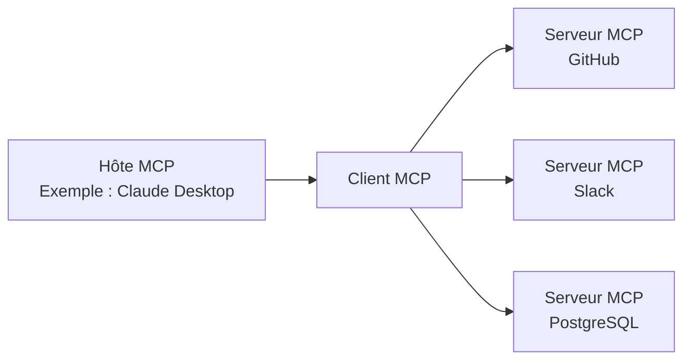

## Introduction

En novembre 2024, l'**Model Context Protocol (MCP)**, annoncé par Anthropic, a connu une adoption spectaculaire en un peu plus d'un an. Ce nouveau standard ouvert, conçu pour connecter les agents IA aux outils et sources de données externes, s'est rapidement imposé. Des chiffres tels que plus de 97 millions de téléchargements de SDK par mois et plus de 10 000 serveurs MCP publics témoignent de son statut, dépassant le cadre d'une simple spécification technique pour s'établir comme une infrastructure fondamentale de l'ère des agents IA.

Cet article propose une analyse complète du MCP : de son fonctionnement technique aux raisons de son adoption par OpenAI, Google et Microsoft, en passant par le point de basculement crucial de sa donation à la Linux Foundation, et enfin les défis de sécurité qui continuent de faire débat.

---

## Le MCP résout le "problème N×M"

### Le problème de l'isolement de l'information dans les systèmes IA

Avant l'avènement du MCP, l'interconnexion des applications IA avec des sources de données externes souffrait d'une inefficacité significative. Par exemple, pour connecter Claude à Slack, GitHub, Google Drive, et une base de données PostgreSQL, il fallait implémenter des connecteurs spécifiques pour chaque source de données.

Anthropic a désigné cette situation comme le "**problème N×M**". Si N représente le nombre de sources de données et M le nombre d'applications IA qui les utilisent, il faudrait théoriquement N×M implémentations distinctes. Utiliser dix outils avec cinq applications IA nécessiterait donc 50 implémentations personnalisées.

```
【Sans MCP】
Claude  ─── Implémentation unique A ──→ GitHub
Claude  ─── Implémentation unique B ──→ Slack
GPT-4   ─── Implémentation unique C ──→ GitHub  （Similaire à A）
GPT-4   ─── Implémentation unique D ──→ Slack   （Similaire à B）

【Avec MCP】
Claude ─┐
GPT-4  ─┤── Client MCP ──→ Serveur MCP（GitHub）
Gemini ─┘                ──→ Serveur MCP（Slack）
```

Le MCP résout ce problème grâce à une structure "1:N". Une fois implémenté comme serveur MCP, il devient accessible par tous les clients MCP compatibles.

---

## Architecture technique du MCP

### Trois composants principaux

Le MCP adopte une architecture client-serveur composée de trois rôles :

| Rôle | Description |
|:-----|:-----|
| **Hôte MCP (MCP Host)** | L'application IA principale. Il gère et coordonne un ou plusieurs Clients MCP. |
| **Client MCP (MCP Client)** | Maintient la connexion avec le Serveur MCP et lui fournit le contexte obtenu. |
| **Serveur MCP (MCP Server)** | Fournit l'accès aux outils et aux sources de données externes. |



### Base du protocole : JSON-RPC 2.0

La couche de messagerie du MCP est basée sur JSON-RPC 2.0. Les types de messages sont classés en trois catégories :

- **Request**: Requête nécessitant une réponse.
- **Response**: Réponse à une requête.
- **Notification**: Notification unidirectionnelle ne nécessitant pas de réponse.

### Couche de transport

Le MCP prend en charge deux méthodes de transport principales :

**stdio (Standard Input/Output)**
Idéal pour l'intégration avec les ressources locales. Communique via des flux d'entrée/sortie simples. Largement utilisé pour la connexion entre des applications IA locales comme Claude Desktop et des serveurs MCP locaux.

**HTTP Streamable (anciennement SSE)**
Permet la transmission de messages en flux du serveur vers le client via HTTP Server-Sent Events (SSE). Adapté aux tâches de longue durée et aux mises à jour incrémentielles. Lors de la mise à jour des spécifications en 2025 (version du 25-11-2025), le nom du transport a été modifié de "SSE" à "HTTP Streamable", permettant une communication bidirectionnelle plus flexible.

### Trois primitives

Les fonctionnalités exposées par un serveur MCP à l'extérieur sont définies par trois types de primitives :

**Ressources (Resources)**
Fournit un accès en lecture aux sources de données. Les fichiers, les bases de données, les réponses d'API, etc., sont rendus disponibles pour référence par l'IA.

**Outils (Tools)**
Permet l'exécution de n'importe quel code. L'IA peut être utilisée pour créer des fichiers, appeler des API ou modifier des systèmes externes. L'exécution des outils impliquant des effets de bord, une gestion appropriée des autorisations est requise.

**Prompts**
Fournit des modèles de prompts prédéfinis. Au lieu d'une instruction vague comme "Crée un ticket de bug sur GitHub", l'IA peut recevoir les champs nécessaires de manière structurée.

---

## Adoption exponentielle : 1 an après le lancement

### L'écosystème en chiffres

En novembre 2024, lors du lancement du MCP, on comptait environ 100 serveurs MCP publics. La croissance a été phénoménale.

| Période | Nombre de serveurs publics | Téléchargements mensuels de SDK | 
|:-----|:---------------|:----------------------|
| Nov 2024 (Lancement) | Environ 100 | — |
| Mai 2025 | Plus de 4 000 | — |
| Déc 2025 | Plus de 10 000 | 97 millions |

Anthropic a simultanément fourni des serveurs MCP de référence pour les principaux systèmes d'entreprise tels que GitHub, Slack, Google Drive, Git, PostgreSQL, et Puppeteer. Cela a considérablement abaissé la barrière à l'entrée pour les développeurs et a conduit à une expansion rapide de l'écosystème.

### Adoption par les principales entreprises d'IA

Le MCP s'est rapidement imposé comme un standard de l'industrie.

**OpenAI (Mars 2025)**
OpenAI a annoncé le support officiel du MCP dans ChatGPT et via son API. Bien que l'entreprise dispose depuis longtemps de sa propre fonctionnalité Function Calling, l'adoption d'un standard ouvert comme le MCP lui a permis de s'intégrer au vaste écosystème MCP.

**Google (Avril 2025)**
Le MCP a été intégré aux modèles Gemini. L'accès aux serveurs MCP est devenu disponible via Google AI Studio et Vertex AI, permettant aux clients d'entreprise de Google de connecter leurs systèmes internes existants via Gemini.

**Microsoft (2025)**
Microsoft a ajouté le support du MCP à Copilot Studio et Azure OpenAI Service. Une fonctionnalité client MCP a également été intégrée à Visual Studio Code, accélérant l'intégration du flux de travail de développement avec l'IA.

---

## Donation à la Linux Foundation et création de l'Agentic AI Foundation

### Un tournant décisif

En décembre 2025, Anthropic a pris l'une de ses décisions les plus importantes : la donation du MCP à un nouveau fonds sous l'égide de la Linux Foundation, l'"**Agentic AI Foundation (AAIF)**".

Cette décision n'était pas seulement un changement de gouvernance. Anthropic a choisi de positionner le MCP non pas comme un élément différenciateur de ses propres produits, mais comme une infrastructure ouverte pour l'ère des agents IA.

### Aperçu de l'Agentic AI Foundation (AAIF)

L'AAIF a été créée en tant que Directed Fund sous l'égide de la Linux Foundation.

**Membres fondateurs conjoints**
- Anthropic (donation du MCP)
- Block (donation de goose)
- OpenAI (donation d'AGENTS.md)

**Membres Platinum (participation à la gouvernance)**
Amazon Web Services, Anthropic, Block, Bloomberg, Cloudflare, Google, Microsoft, OpenAI.

**Projets fondateurs**
- Model Context Protocol (MCP) — Fourni par Anthropic
- goose — Framework d'agent IA fourni par Block
- AGENTS.md — Standard de description de spécification d'agent fourni par OpenAI

En rejoignant la Linux Foundation, la gouvernance du MCP est passée à un modèle neutre et piloté par la communauté. Il s'agit d'une stratégie similaire à celle qui a vu Kubernetes (orchestration de conteneurs) et NodeJS s'établir comme des standards de l'industrie sous l'égide de la Linux Foundation.

---

## Comparaison entre le MCP et les API REST

### Différences dans la philosophie de conception

Le MCP et les API REST ne sont pas en concurrence mais se complètent. Il est important de comprendre les différences de leurs philosophies de conception respectives.

| Point | API REST | MCP |
|:---|:---|:----|
| Client attendu | Logiciel traditionnel | LLM / Agents IA |
| Session | Sans état (stateless) | Avec état (stateful) |
| Découverte | Décrite séparément via OpenAPI, etc. | Le serveur publie dynamiquement |
| Multi-étapes | Authentification pour chaque requête | Efficacité grâce au maintien de la session |
| Streaming | Nécessite des WebSockets, etc. | Prise en charge native via SSE/HTTP Streamable |

### Pourquoi le MCP est adapté aux agents IA

Lorsque l'on considère un scénario où un agent IA doit appeler plusieurs outils de manière séquentielle, la supériorité de la conception du MCP devient évidente.

```
【Tâche d'examen de code par un agent IA】
1. Obtenir les différences du PR depuis GitHub → Outils MCP
2. Lire les fichiers de code associés → Ressources MCP
3. Obtenir le prompt pour la vérification de sécurité → Prompts MCP
4. Publier les commentaires d'examen de code sur GitHub → Outils MCP
```

Avec les API REST, chaque étape nécessiterait l'ajout d'en-têtes d'authentification et la retransmission du contexte. Le MCP, quant à lui, maintient la session, minimisant les coûts d'authentification tout en exécutant des tâches multi-étapes de manière efficace.

De plus, les agents IA ne savent pas toujours quels outils sont disponibles. Les serveurs MCP publient dynamiquement les Outils, Ressources et Prompts qu'ils fournissent, permettant à l'agent d'effectuer une découverte au moment de l'exécution et de sélectionner les outils appropriés.

---

## Enjeux de sécurité

### Risques de sécurité du MCP

Face à une adoption de 97 millions de téléchargements mensuels, des chercheurs en sécurité ont exprimé leurs préoccupations quant à la diffusion rapide du MCP. Les principaux risques de sécurité sont les suivants :

**Risque de fuite de jetons**
Le MCP utilise OAuth 2.1 comme cadre d'autorisation, mais si les jetons d'accès mis en cache ou enregistrés dans les journaux du client ou du serveur fuient, un attaquant pourrait accéder aux ressources protégées en se faisant passer pour une requête légitime.

**Attaque du "confused deputy"**
Lorsqu'un serveur MCP agit comme un proxy OAuth, une validation incorrecte du contexte d'autorisation peut permettre à un attaquant d'exécuter des opérations sur le serveur en exploitant les informations d'identification d'un autre utilisateur.

**Gestion de l'enregistrement dynamique des clients**
L'enregistrement dynamique des clients OAuth permet aux clients MCP d'ajouter dynamiquement des configurations de clients OAuth sur le serveur. Cependant, la gestion et la suppression des configurations de clients ajoutés ne sont pas largement prises en charge par les RFC, laissant des problèmes de gestion non résolus.

### Mesures prises dans la mise à jour des spécifications de juin 2025

Le renforcement de la sécurité a été l'un des principaux thèmes de la mise à jour de juin 2025 des spécifications du MCP.

- **Obligation du PKCE (Proof Key for Code Exchange)** : Conformément à la section 7.5.2 d'OAuth 2.1, l'implémentation du PKCE est devenue obligatoire. Cela empêche les attaques d'interception et d'injection de codes d'autorisation.
- **Introduction des indicateurs de ressources (RFC 8707)** : Pour garantir que les jetons ne sont valides que pour le serveur MCP visé, il est devenu obligatoire d'inclure des indicateurs de ressources dans les requêtes de jetons. Cela empêche la "réutilisation abusive de jetons (token mis-redemption)".
- **Interdiction du "Token Passthrough"** : Il est explicitement stipulé que les serveurs MCP ne doivent pas accepter de jetons qui n'ont pas été explicitement émis pour leur propre serveur.

---

## Écosystème actuel et perspectives d'avenir

### Exemples de serveurs MCP majeurs

En 2026, les serveurs MCP sont largement disponibles dans les catégories suivantes :

**Outils de développement**
- Serveur MCP GitHub (gestion des PR, révision de code)
- Serveur MCP Git (opérations sur le dépôt local)
- Suite de serveurs MCP intégrés à VS Code

**Données et infrastructure**
- Serveur MCP PostgreSQL
- Serveur MCP SQLite
- Serveur MCP Cloudflare Workers

**Communication et productivité**
- Serveur MCP Slack
- Serveur MCP Google Drive
- Serveur MCP Notion

**IA et recherche**
- Serveur MCP Brave Search
- Serveur MCP Puppeteer (web scraping)
- Serveur MCP Fetch

### Préambule à l'ère des agents autonomes

Le MCP vise fondamentalement à créer un environnement où les agents IA "peuvent maîtriser leurs outils". À mesure que la transition d'une phase de modèles IA uniques agissant indépendamment vers des systèmes multi-agents où plusieurs agents IA partagent des outils et collaborent s'accélère, l'importance du MCP en tant que langage commun ne cesse de croître.

Avec la création de l'AAIF, le MCP quitte son statut de produit d'Anthropic pour s'engager sur la voie de l'évolution vers une infrastructure commune à l'industrie. Tout comme Kubernetes et NodeJS sont devenus des standards de l'industrie sous l'égide de la Linux Foundation, la réponse à la question de savoir si le MCP peut devenir le "TCP/IP" de l'ère des agents IA se révélera dans les deux ou trois prochaines années.

---

## Conclusion

Le MCP représente un changement technologique majeur à trois égards :

**1. Résolution du problème N×M**
Il a considérablement réduit les coûts de développement en standardisant la connexion entre les systèmes IA et les outils externes.

**2. Formation d'un consensus industriel**
Bien qu'étant un protocole initié par Anthropic, il a réussi à établir une norme industrielle, notamment avec la participation d'OpenAI, de Google et de Microsoft en tant que membres Platinum de l'AAIF.

**3. Neutralité de la gouvernance**
La donation à la Linux Foundation a établi un cadre de gouvernance ouvert, éliminant la dépendance vis-à-vis d'un fournisseur spécifique.

Alors que les agents IA s'infiltrent dans les applications pratiques à partir de 2026, le MCP continuera de fonctionner comme une infrastructure sous-jacente. Pour les développeurs, comprendre le fonctionnement du MCP et utiliser les serveurs MCP appropriés devient le point de départ de la construction de systèmes intégrés à l'IA.

---

## Références

| Titre | Source | Date | URL |
|:-----|:-------|:-----|:----|
| Introducing the Model Context Protocol | Anthropic | 2024-11-25 | https://www.anthropic.com/news/model-context-protocol |
| Donating the Model Context Protocol and establishing the Agentic AI Foundation | Anthropic | 2025-12-09 | https://www.anthropic.com/news/donating-the-model-context-protocol-and-establishing-of-the-agentic-ai-foundation |
| MCP joins the Agentic AI Foundation | MCP Blog | 2025-12-09 | http://blog.modelcontextprotocol.io/posts/2025-12-09-mcp-joins-agentic-ai-foundation/ |
| Linux Foundation Announces the Formation of the Agentic AI Foundation (AAIF) | Linux Foundation | 2025-12-09 | https://www.linuxfoundation.org/press/linux-foundation-announces-the-formation-of-the-agentic-ai-foundation |
| Model Context Protocol Specification 2025-11-25 | modelcontextprotocol.io | 2025-11-25 | https://modelcontextprotocol.io/specification/2025-11-25 |
| MCP joins the Linux Foundation: What this means for developers | GitHub Blog | 2025-12-09 | https://github.blog/open-source/maintainers/mcp-joins-the-linux-foundation-what-this-means-for-developers-building-the-next-era-of-ai-tools-and-agents/ |
| Model Context Protocol (MCP): Understanding security risks and controls | Red Hat | 2025 | https://www.redhat.com/en/blog/model-context-protocol-mcp-understanding-security-risks-and-controls |
| MCP Specs Update — All About Auth | Auth0 | 2025-06 | https://auth0.com/blog/mcp-specs-update-all-about-auth/ |
| Why the Model Context Protocol Won | The New Stack | 2025 | https://thenewstack.io/why-the-model-context-protocol-won/ |
| A Year of MCP: From Internal Experiment to Industry Standard | Pento | 2025-12 | https://www.pento.ai/blog/a-year-of-mcp-2025-review |
| Model Context Protocol - Wikipedia | Wikipedia | 2026 | https://en.wikipedia.org/wiki/Model_Context_Protocol |

---

> Cet article a été généré automatiquement par LLM. Il peut contenir des erreurs.
