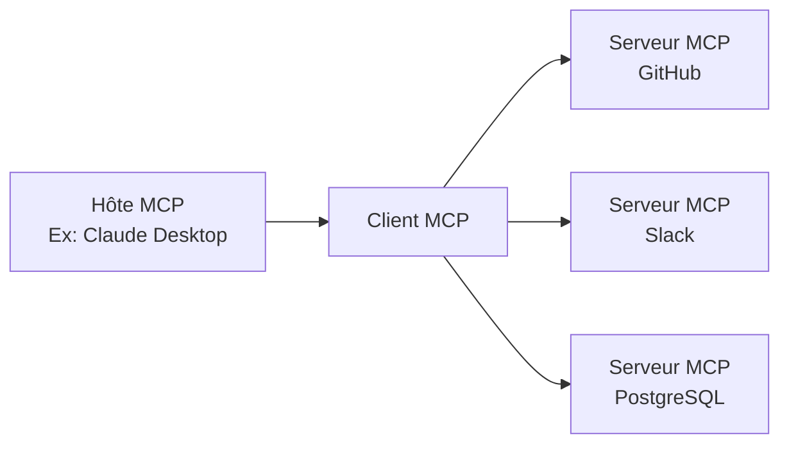

## Introduction

En novembre 2024, l'**Model Context Protocol (MCP)**, annoncé par Anthropic, est devenu une norme ouverte pour connecter les agents IA à des outils et sources de données externes. En à peine plus d'un an, il a connu une adoption spectaculaire. Les chiffres de plus de 97 millions de téléchargements mensuels du SDK et plus de 10 000 serveurs MCP publics dépassent le cadre d'une simple spécification technique, démontrant sa place en tant qu'infrastructure fondamentale de l'ère des agents IA.

Cet article offre une analyse complète du MCP : de ses mécanismes techniques à l'historique de son adoption par OpenAI, Google et Microsoft, en passant par le point de bascule crucial de sa donation à la Linux Foundation, jusqu'aux problèmes de sécurité encore en débat.

--- ## Le MCP résout le « problème N×M »

### L'isolement des informations dans les systèmes IA

Avant l'avènement du MCP, l'intégration des applications IA avec des sources de données externes était source d'une inefficacité notable. Par exemple, pour connecter Claude à Slack, GitHub, Google Drive et une base de données Postgres, il fallait implémenter des connecteurs spécifiques pour chaque source de données.

Anthropic a qualifié cette situation de « **problème N×M** ». Si N représente le nombre de sources de données et M le nombre d'applications IA qui les utilisent, alors N×M implémentations individuelles seraient théoriquement nécessaires. Il suffirait d'utiliser 10 outils avec 5 applications IA pour nécessiter 50 implémentations personnalisées.

```
【Sans MCP】
Claude  ─── Implémentation personnalisée A ──→ GitHub
Claude  ─── Implémentation personnalisée B ──→ Slack
GPT-4   ─── Implémentation personnalisée C ──→ GitHub  （Presque identique à A）
GPT-4   ─── Implémentation personnalisée D ──→ Slack   （Presque identique à B）

【Avec MCP】
Claude ─┐
GPT-4  ─┤── Client MCP ──→ Serveur MCP（GitHub）
Gemini ─┘                ──→ Serveur MCP（Slack）
```

Le MCP résout ce problème avec une structure « **1:N** ». Une fois implémenté en tant que serveur MCP, il peut être utilisé par tous les clients MCP compatibles.

--- ## Architecture technique du MCP

### Trois composants constitutifs

Le MCP adopte une architecture client-serveur composée de trois rôles.

| Rôle | Description |
|:-----|:-----|
| **Hôte MCP** | Application IA principale. Gère et orchestre un ou plusieurs Clients MCP |
| **Client MCP** | Maintient la connexion avec le Serveur MCP, récupère le contexte et le fournit à l'Hôte |
| **Serveur MCP** | Fournit l'accès aux outils et sources de données externes |



### Base du protocole : JSON-RPC 2.0

La couche de messagerie du MCP est basée sur JSON-RPC 2.0. Les types de messages sont classés en trois catégories.

- **Request**: Requête nécessitant une réponse
- **Response**: Réponse à une requête
- **Notification**: Notification unidirectionnelle sans réponse requise

### Couche de transport

Le MCP prend en charge deux modes de transport principaux.

**stdio (entrée/sortie standard)**
Idéal pour l'intégration avec des ressources locales. La communication se fait via des flux d'entrée/sortie simples. Largement utilisé pour connecter des applications IA locales comme Claude Desktop à des serveurs MCP locaux.

**HTTP Streamable (anciennement SSE)**
Permet la diffusion de messages du serveur vers le client sur HTTP via Server-Sent Events (SSE). Convient aux tâches de longue durée et aux mises à jour incrémentales. Dans la mise à jour des spécifications de 2025 (version du 2025-11-25), le nom du transport a été modifié de « SSE » à « HTTP Streamable », permettant une communication bidirectionnelle plus flexible.

### Trois primitives

Les fonctionnalités exposées par un serveur MCP à l'extérieur sont définies par trois types de primitives.

**Ressources**
Fournissent un accès en lecture aux sources de données. Elles sont présentées sous une forme que l'IA peut référencer, comme les systèmes de fichiers, les bases de données ou les réponses d'API.

**Outils**
Permettent l'exécution de n'importe quel code. L'IA peut les utiliser pour créer des fichiers, appeler des API, ou modifier des systèmes externes. L'exécution d'outils implique des effets de bord, nécessitant une gestion appropriée des autorisations.

**Prompts**
Fournissent des modèles de prompts prédéfinis. Ils permettent de communiquer des informations structurées à l'IA, plutôt qu'une instruction vague comme « Créez un ticket de bug sur GitHub ».

--- ## Adoption fulgurante : un an après sa publication

### La croissance de l'écosystème en chiffres

Au moment de la publication du MCP en novembre 2024, il n'y avait qu'environ 100 serveurs MCP publics. Cependant, la vitesse de croissance a été phénoménale.

| Période | Nombre de serveurs publics | Téléchargements mensuels du SDK |
|:-----|:---------------|:----------------------|
| Novembre 2024 (Publication) | ~100 | — |
| Mai 2025 | Plus de 4 000 | — |
| Décembre 2025 | Plus de 10 000 | 97 millions |

Anthropic a fourni des serveurs MCP de référence pour les principaux systèmes d'entreprise tels que GitHub, Slack, Google Drive, Git, PostgreSQL et Puppeteer dès la publication du MCP. Cela a considérablement abaissé la barrière à l'entrée pour les développeurs et a conduit à une expansion rapide de l'écosystème.

### Adoption par les grandes entreprises IA

Le MCP s'est rapidement imposé comme une norme de l'industrie.

**OpenAI (Mars 2025)**
OpenAI a annoncé le support officiel du MCP pour ChatGPT et son API. Bien que la société ait longtemps disposé de sa propre fonctionnalité de Function Calling, l'adoption du MCP, une norme ouverte, lui a permis de s'intégrer au vaste écosystème MCP.

**Google (Avril 2025)**
Le MCP a été intégré aux modèles Gemini. L'accès aux serveurs MCP via Google AI Studio et Vertex AI est devenu possible, permettant aux clients d'entreprise de Google de connecter leurs systèmes internes existants via Gemini.

**Microsoft (2025)**
Support du MCP ajouté à Copilot Studio et Azure OpenAI Service. La fonction de client MCP a également été intégrée à Visual Studio Code, accélérant l'intégration du flux de travail de développement et de l'IA.

--- ## Donation à la Linux Foundation et création de l'Agentic AI Foundation

### Un tournant décisif

En décembre 2025, Anthropic a pris l'une de ses décisions les plus importantes : elle a fait don du MCP à un nouveau fonds sous l'égide de la Linux Foundation, l'« **Agentic AI Foundation (AAIF)** ».

Cette décision n'était pas seulement un changement de gouvernance. Anthropic a choisi de positionner le MCP non pas comme un « élément de différenciation de ses produits », mais comme une infrastructure ouverte pour l'ère des agents IA.

### Aperçu de l'Agentic AI Foundation (AAIF)

L'AAIF a été créée en tant que Directed Fund sous l'égide de la Linux Foundation.

**Membres fondateurs conjoints**
- Anthropic (donation du MCP)
- Block (donation de goose)
- OpenAI (donation d'AGENTS.md)

**Membres Platine (Participation à la gouvernance)**
Amazon Web Services, Anthropic, Block, Bloomberg, Cloudflare, Google, Microsoft, OpenAI

**Projets fondateurs**
- Model Context Protocol (MCP) — Fourni par Anthropic
- goose — Framework d'agents IA fourni par Block
- AGENTS.md — Norme de description des spécifications d'agents fournie par OpenAI

En rejoignant la Linux Foundation, la gouvernance du MCP est devenue indépendante des fournisseurs et axée sur la communauté. C'est une stratégie similaire à celle qui a permis à Kubernetes (orchestration de conteneurs) et NodeJS de s'imposer comme normes industrielles sous l'égide de la Linux Foundation.

--- ## Comparaison du MCP avec les API REST

### Différences de conception

Le MCP et les API REST ne sont pas en concurrence mais sont complémentaires. Il est important de comprendre les différences de leur philosophie de conception.

| Aspect | API REST | MCP |
|:---------|:---------|:----|
| Client prévu | Logiciel traditionnel | LLM / Agents IA |
| Session | Sans état | Avec état |
| Découverte | Décrite séparément via OpenAPI, etc. | Le serveur expose dynamiquement |
| Multi-étapes | Authentification à chaque requête | Optimisation par maintien de session |
| Streaming | WebSocket, etc. requis séparément | Prise en charge native via SSE/HTTP Streamable |

### Pourquoi le MCP est adapté aux agents IA

En considérant un scénario où un agent IA appelle plusieurs outils en séquence, la supériorité de la conception du MCP devient évidente.

```
【Tâche de revue de code par un agent IA】
1. Obtenir la différence du PR depuis GitHub → Outils MCP
2. Lire les fichiers de code associés → Ressources MCP
3. Obtenir le prompt de vérification de sécurité → Prompts MCP
4. Publier le commentaire de revue de code sur GitHub → Outils MCP
```

Avec les API REST, chaque étape nécessite l'ajout d'en-têtes d'authentification et la retransmission du contexte. Dans le cas du MCP, la session est maintenue, ce qui permet d'exécuter des tâches multi-étapes efficacement tout en minimisant les coûts d'authentification.

De plus, un agent IA peut ne pas savoir quels outils sont disponibles à l'avance. Les serveurs MCP exposent dynamiquement les outils, ressources et prompts qu'ils fournissent, permettant à l'agent d'effectuer une découverte au moment de l'exécution et de sélectionner/utiliser les outils appropriés.

--- ## Enjeux de sécurité

### Risques de sécurité du MCP

Face à une adoption atteignant 97 millions de téléchargements mensuels, des chercheurs en sécurité ont exprimé des préoccupations quant à la diffusion rapide du MCP. Les principaux risques de sécurité sont les suivants :

**Risque de fuite de jetons**
Bien que le MCP utilise OAuth 2.1 comme framework d'autorisation, si les jetons d'accès mis en cache ou enregistrés dans les journaux par le client ou le serveur sont divulgués, un attaquant peut accéder aux ressources protégées comme s'il s'agissait de requêtes légitimes.

**Attaque « Confused Deputy »**
Lorsqu'un serveur MCP agit en tant que proxy OAuth, une validation inadéquate du contexte d'autorisation peut permettre à un attaquant d'exécuter des opérations en exploitant les informations d'identification d'un autre utilisateur sur le serveur.

**Gestion de l'enregistrement dynamique des clients**
Avec l'enregistrement dynamique des clients OAuth, un client MCP peut ajouter dynamiquement des configurations de clients OAuth sur le serveur. Cependant, la gestion et la suppression des configurations clients ajoutées ne sont pas largement prises en charge par les RFC, laissant des problèmes de gestion non résolus.

### Correspondance dans la mise à jour de spécification de juin 2025

La mise à jour de juin 2025 des spécifications MCP a fait de l'amélioration de la sécurité l'un de ses thèmes principaux.

- **Obligation de PKCE (Proof Key for Code Exchange)** : Conformément à la section 7.5.2 d'OAuth 2.1, l'implémentation de PKCE est devenue obligatoire. Cela empêche les attaques par interception et injection de codes d'autorisation.
- **Introduction des indicateurs de ressources (RFC 8707)** : Pour garantir que les jetons ne soient valides que pour le serveur MCP prévu, il est devenu obligatoire d'inclure des indicateurs de ressources dans les requêtes de jetons. Cela empêche le « détournement de jetons » (token mis-redemption).
- **Interdiction du transfert de jetons (Token Passthrough)** : Il a été précisé que les serveurs MCP ne doivent pas accepter les jetons qui ne sont pas explicitement émis pour leur propre serveur.

--- ## Écosystème actuel et perspectives futures

### Exemples de serveurs MCP majeurs

En 2026, les serveurs MCP sont largement disponibles dans les catégories suivantes.

**Outils de développement**
- Serveur MCP GitHub (gestion des PR, revue de code)
- Serveur MCP Git (manipulation des dépôts locaux)
- Série de serveurs MCP intégrés à VS Code

**Données et infrastructure**
- Serveur MCP PostgreSQL
- Serveur MCP SQLite
- Serveur MCP Cloudflare Workers

**Communication et productivité**
- Serveur MCP Slack
- Serveur MCP Google Drive
- Serveur MCP Notion

**IA et recherche**
- Serveur MCP Brave Search
- Serveur MCP Puppeteer (scraping web)
- Serveur MCP Fetch

### Préliminaires à l'ère des agents autonomes

Le problème fondamental que le MCP cherche à résoudre est de créer un environnement où les agents IA peuvent « maîtriser l'utilisation des outils ». À mesure que la transition s'accélère des phases où un seul modèle IA opère indépendamment vers des systèmes multi-agents où plusieurs agents IA partagent des outils et collaborent, l'importance du MCP en tant que langage commun ne cesse de croître.

Avec la création de l'AAIF, le MCP a transcendé son statut de produit d'Anthropic pour s'engager sur la voie de l'évolution vers une infrastructure commune à l'industrie. Tout comme Kubernetes et NodeJS, sous l'égide de la Linux Foundation, sont devenus des normes industrielles, le MCP pourrait devenir le « TCP/IP » de l'ère des agents IA — la réponse sera révélée au cours des deux ou trois prochaines années.

--- ## Résumé

Le MCP représente un changement technologique majeur à trois égards :

**1. Résolution du problème N×M**
Il a considérablement réduit les coûts de développement en standardisant la connexion entre les systèmes IA et les outils externes.

**2. Formation d'un consensus industriel global**
Bien qu'étant un protocole lancé par Anthropic, il a réussi à établir une norme industrielle impliquant des concurrents, OpenAI, Google et Microsoft participant en tant que membres platine de l'AAIF.

**3. Neutralité de la gouvernance**
La donation à la Linux Foundation a établi un cadre de gouvernance ouverte, éliminant la dépendance à l'égard d'un fournisseur spécifique.

Avec la généralisation des agents IA dans les applications pratiques à partir de 2026, le MCP continuera de fonctionner comme une infrastructure sous-jacente. Pour les développeurs, comprendre le fonctionnement du MCP et utiliser les serveurs MCP appropriés devient le point de départ de la construction de systèmes intégrant l'IA.

--- ## Références

| Titre | Source | Date | URL |
|:---------|:-------|:-----|:----|
| Introducing the Model Context Protocol | Anthropic | 2024-11-25 | https://www.anthropic.com/news/model-context-protocol |
| Donating the Model Context Protocol and establishing the Agentic AI Foundation | Anthropic | 2025-12-09 | https://www.anthropic.com/news/donating-the-model-context-protocol-and-establishing-of-the-agentic-ai-foundation |
| MCP joins the Agentic AI Foundation | MCP Blog | 2025-12-09 | http://blog.modelcontextprotocol.io/posts/2025-12-09-mcp-joins-agentic-ai-foundation/ |
| Linux Foundation Announces the Formation of the Agentic AI Foundation (AAIF) | Linux Foundation | 2025-12-09 | https://www.linuxfoundation.org/press/linux-foundation-announces-the-formation-of-the-agentic-ai-foundation |
| Model Context Protocol Specification 2025-11-25 | modelcontextprotocol.io | 2025-11-25 | https://modelcontextprotocol.io/specification/2025-11-25 |
| MCP joins the Linux Foundation: What this means for developers | GitHub Blog | 2025-12-09 | https://github.blog/open-source/maintainers/mcp-joins-the-linux-foundation-what-this-means-for-developers-building-the-next-era-of-ai-tools-and-agents/ |
| Model Context Protocol (MCP): Understanding security risks and controls | Red Hat | 2025 | https://www.redhat.com/en/blog/model-context-protocol-mcp-understanding-security-risks-and-controls |
| MCP Specs Update — All About Auth | Auth0 | 2025-06 | https://auth0.com/blog/mcp-specs-update-all-about-auth/ |
| Why the Model Context Protocol Won | The New Stack | 2025 | https://thenewstack.io/why-the-model-context-protocol-won/ |
| A Year of MCP: From Internal Experiment to Industry Standard | Pento | 2025-12 | https://www.pento.ai/blog/a-year-of-mcp-2025-review |
| Model Context Protocol - Wikipedia | Wikipedia | 2026 | https://en.wikipedia.org/wiki/Model_Context_Protocol |

---

> Cet article a été généré automatiquement par LLM. Il peut contenir des erreurs.
