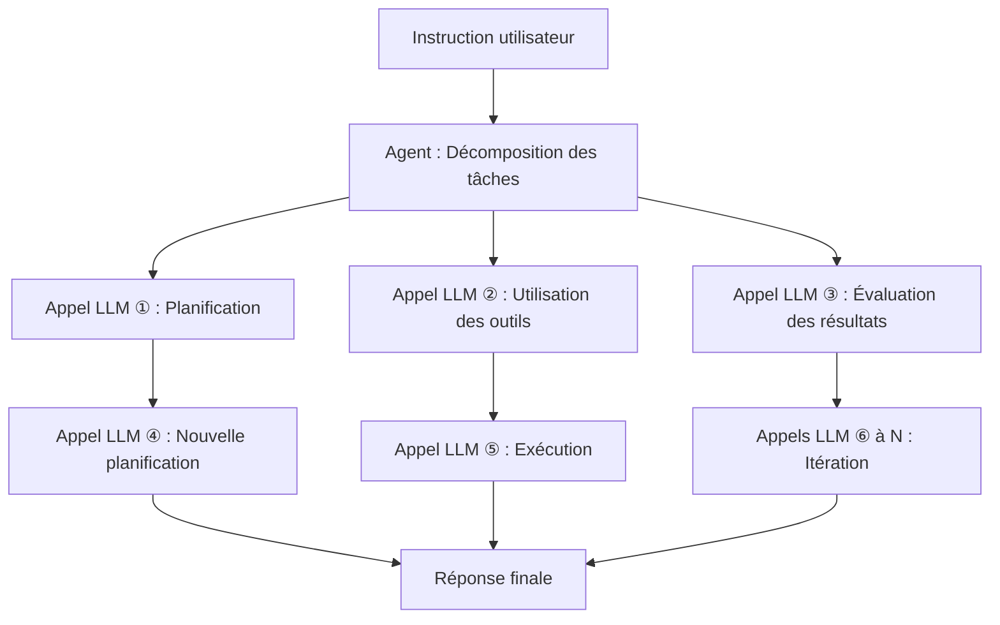

## Introduction : Pourquoi le coût d'inférence est-il un problème maintenant ?

En 2026, la discussion autour de l'IA s'est rapidement déplacée de la "performance des modèles" à "l'économie du coût d'inférence". La capacité des Large Language Models (LLM) n'est plus à prouver, mais le principal obstacle au déploiement commercial réel est "le coût d'inférence par token".

Les IA agents en particulier effectuent des centaines à des milliers d'appels LLM pour accomplir une seule tâche. Cela engendre des coûts d'un ordre de grandeur supérieur à ceux des requêtes simples, rendant la montée en charge difficile.

Dans son discours d'ouverture de la GTC 2026 en mars 2026, Jensen Huang, PDG de NVIDIA, a résumé cette situation : "S'ils avaient plus de capacité, ils pourraient générer plus de tokens et augmenter leurs revenus. Avec les applications agents qui génèrent d'autres agents pour accomplir des tâches les unes après les autres, le nombre de tokens générés explose", a-t-il déclaré, soulignant l'importance d'une infrastructure d'inférence rapide et peu coûteuse.

La réponse de NVIDIA à cette problématique est la plateforme **Vera Rubin**. Présentée pour la première fois au CES 2026 (janvier 2026) et détaillée lors de la GTC 2026 (mars 2026), cette infrastructure IA de nouvelle génération promet de réduire les coûts d'inférence jusqu'à 10 fois par rapport à l'architecture Blackwell, attirant ainsi l'attention de l'industrie.

Cet article explore l'architecture de Vera Rubin en détail, examine pourquoi une telle réduction des coûts est réalisable et analyse son impact futur sur le domaine de l'IA agents.

---

## Qu'est-ce que Vera Rubin : Un "supercalculateur IA" intégrant 7 puces

Vera Rubin n'est pas une seule puce GPU, mais une **plateforme IA intégrée avec une conception extrêmement coordonnée (co-design) de 7 types de puces dédiées**. NVIDIA appelle cela "Extreme Co-Design". Lors de la GTC 2026, NVIDIA a officiellement confirmé l'acquisition de Groq en décembre 2025 pour environ 20 milliards de dollars, et le LPU Groq 3 a été ajouté comme septième puce à la plateforme.

Les 7 puces constituant le système sont les suivantes :

| Puce | Rôle |
|---|---|
| **Vera CPU** | CPU personnalisés dédiés à l'IA (88 cœurs Olympus) |
| **Rubin GPU** | Noyau de calcul IA (50 PFLOPS NVFP4) |
| **NVLink 6 Switch** | Communication haute vitesse inter-GPU (3,6 To/s) |
| **ConnectX-9 SuperNIC** | Traitement réseau |
| **BlueField-4 DPU** | Traitement des données et mémoire de contexte d'inférence |
| **Spectrum-6 Ethernet Switch** | Communication Ethernet |
| **Groq 3 LPU** | Accélérateur d'inférence à faible latence (nouvel ajout) |

L'ensemble de ce système est intégré au niveau du rack, fourni sous le facteur de forme **Vera Rubin NVL72**. Il s'agit d'une configuration intégrant 72 GPU Rubin et 36 CPU Vera par rack. Pour des déploiements encore plus importants, une configuration de 40 racks appelée **Vera Rubin POD** est également disponible, offrant une puissance de calcul de 60 exaFLOPS.

---

## Vera CPU : Un processeur propriétaire conçu pour l'IA

L'un des points de divergence majeurs entre Vera Rubin et les plateformes précédentes est l'adoption du **processeur personnalisé "Vera" conçu par NVIDIA**.

Vera intègre **88 cœurs Olympus**. Olympus est un cœur conçu par NVIDIA basé sur l'ensemble d'instructions ARMv9.2, spécifiquement optimisé pour les charges de travail des centres de données IA. Chaque cœur peut traiter 2 threads en parallèle grâce à la technologie "Spatial Multithreading", offrant une capacité de traitement totale de **176 threads**. Le cache L3 a été augmenté de 40% pour atteindre 162 Mo, et le nombre de transistors a atteint 227 milliards, soit 2,2 fois plus que la génération précédente.

Un point notable est le support de la précision FP8. Le Vera CPU est le premier CPU de l'industrie à prendre en charge nativement le FP8, permettant un traitement unifié de l'ensemble des charges de travail IA dans un format numérique à faible précision.

En termes de mémoire, il peut accueillir jusqu'à **1,5 To de mémoire SOCAMM LPDDR5X**, offrant une bande passante mémoire de **1,2 To/s**. En élargissant le bus mémoire à 1024 bits et en augmentant la vitesse à 9600 MT/s, il atteint une bande passante 2,5 fois supérieure à celle de la génération précédente. Plus important encore, la connexion avec les GPU Rubin. Grâce à la **seconde génération de NVLink-C2C (Chip-to-Chip)**, une bande passante cohérente de **1,8 To/s** est réalisée entre les CPU et les GPU. Cela représente une vitesse 7 fois supérieure à celle du PCIe Gen 6.

### Pourquoi un CPU personnalisé est-il nécessaire ?

Les serveurs IA traditionnels utilisaient des CPU génériques, mais dans l'inférence LLM, le CPU devient souvent un goulot d'étranglement. La bande passante mémoire et la vitesse de connexion du CPU hôte ne parviennent pas à suivre la puissance de traitement du GPU.

NVIDIA a reconnu que l'inférence LLM est limitée par la bande passante mémoire et l'interconnexion, et a optimisé l'ensemble du système en concevant le CPU de manière personnalisée. Le lien cohérent haute vitesse entre le CPU et le GPU minimise la surcharge de transfert de données et améliore le taux d'utilisation du GPU.

---

## Rubin GPU : Le moteur de calcul de nouvelle génération spécialisé dans l'inférence

Le GPU Rubin intègre de nombreuses innovations spécialisées pour l'inférence IA.

### Spécifications clés

| Élément | Valeur |
|---|---|
| Performance d'inférence NVFP4 | **50 PFLOPS** (5x Blackwell) |
| Performance d'entraînement NVFP4 | **35 PFLOPS** (3,5x Blackwell) |
| Mémoire HBM4 | **288 Go** (par unité) |
| Bande passante mémoire HBM4 | **22 To/s** |
| Bande passante NVLink 6 | **3,6 To/s** (par GPU) |
| Nombre de transistors | **336 milliards** |

Ce qui mérite une attention particulière est l'adoption de **HBM4**. La bande passante mémoire est environ 2,8 fois supérieure à celle de HBM3 de la génération précédente, abordant directement le problème de la bande passante mémoire limitant l'inférence LLM.

### NVFP4 et le Transformer Engine de 3ème génération

Le GPU Rubin intègre le **Transformer Engine de 3ème génération** et utilise un nouveau format numérique à faible précision appelé NVFP4. NVFP4 a une densité arithmétique encore plus élevée que NVFP8 adopté par Blackwell, offrant une amélioration significative du débit tout en maintenant la précision. NVIDIA a obtenu une amélioration du débit effectif au-delà d'une simple augmentation des FLOPS en intégrant profondément cette exécution à faible précision à la fois dans l'architecture et la pile logicielle.

---

## NVLink 6 : L'infrastructure de communication qui dépasse le mur de la bande passante

Dans l'inférence LLM, en particulier avec les modèles Mixture-of-Experts (MoE) et les environnements multi-GPU, la **bande passante de communication inter-GPU** détermine la performance.

NVLink 6 double la **bande passante** par rapport à la génération précédente (NVLink 5).

| Indicateur | NVLink 5 | NVLink 6 |
|---|---|---|
| Bande passante par commutateur | 1 800 Go/s | **3 600 Go/s** |
| Bande passante par GPU | Environ 1,8 To/s | **3,6 To/s** |
| Bande passante totale pour le rack NVL72 | — | **260 To/s** |

La bande passante interne de 260 To/s offerte par le rack NVL72 permet l'inférence efficace de modèles MoE à grande échelle.

---

## Groq 3 LPU : L'accélérateur d'inférence à faible latence

L'une des plus grandes surprises de la GTC 2026 a été l'intégration de la technologie LPU (Language Processing Unit) de Groq dans la plateforme Vera Rubin. NVIDIA a acquis Groq le 24 décembre 2025 pour environ 20 milliards de dollars, embauché du personnel expérimenté et obtenu une licence non exclusive pour la technologie LPU de Groq.

### Répartition des rôles entre GPU et LPU

Dans le système Vera Rubin, Rubin et Groq se partagent le processus d'inférence.


- **Rubin GPU** : Responsable du traitement de pré-remplissage et de l'attention de décodage.
- **Groq 3 LPU** : Responsable de l'exécution du réseau Feed-Forward (FFN).

Ce système de division du travail permet à chaque puce de se concentrer sur les tâches où elle excelle.

### Spécifications du rack Groq 3 LPX

Le **rack Groq 3 LPX** annoncé à la GTC 2026 intègre 256 LPU.

| Élément | Valeur |
|---|---|
| Capacité SRAM (par puce) | **500 Mo** |
| Bande passante SRAM (par puce) | **150 To/s** |
| Bande passante de mise à l'échelle (par puce) | **2,5 To/s** |
| Capacité SRAM totale sur puce (rack) | **128 Go** |
| Bande passante de mise à l'échelle (rack) | **640 To/s** |

Groq 3 est conçu pour privilégier la bande passante à la capacité, avec une bande passante d'environ 80 To/s par puce. Cette conception axée sur le SRAM et à haute bande passante permet une faible latence pour le traitement FFN.

### Effets de l'intégration

La combinaison de Vera Rubin et de Groq LPX permet une **amélioration jusqu'à 35 fois du débit d'inférence pour les modèles à trillion de paramètres** par rapport au Rubin GPU seul, et une **augmentation de 35 fois du débit par mégawatt**. Ceci est réalisé sans nécessiter de modifications majeures de la plateforme CUDA, en utilisant le LPU comme un accélérateur de décodage hautement spécialisé.

---

## Stockage de mémoire de contexte d'inférence : Spécialisation pour l'IA agents

Une fonctionnalité importante démontrant que Vera Rubin est conçu comme une "base pour l'IA agents" est sa **plateforme de stockage de mémoire de contexte d'inférence**.

### Nouvelle hiérarchie mémoire

NVIDIA a utilisé le DPU BlueField-4 pour construire une nouvelle hiérarchie mémoire entre les GPU et le stockage traditionnel.


Le rack de stockage BlueField-4 STX fonctionne comme une "mémoire de contexte dédiée" pour maintenir la cohérence du contexte lorsque les agents IA gèrent de longues conversations multituits. En déchargeant les données du cache KV sur les puces BlueField-4, le partage et la réutilisation des données du cache au sein de l'infrastructure d'inférence IA deviennent possibles, augmentant le débit d'inférence **jusqu'à 5 fois**.

### Impact sur l'IA agents

Les IA agents possèdent des modèles de calcul fondamentalement différents de ceux des requêtes simples.



Une seule instruction peut entraîner des dizaines à des centaines d'appels LLM, chacun ayant un contexte long. La mémoire de contexte d'inférence améliore le débit global et l'efficacité des coûts des IA agents en gérant efficacement ces caches KV.

---

## Le mécanisme de réduction des coûts par 10 : Interprétation précise des chiffres

Il est crucial de comprendre précisément les conditions dans lesquelles NVIDIA revendique une "réduction de 10 fois des coûts d'inférence" pour l'interpréter correctement.

### Principaux facteurs d'amélioration

La réduction de 10 fois des coûts est le résultat combiné de plusieurs innovations technologiques.

```
Amélioration de la bande passante mémoire HBM4 : environ 2,8 fois
Amélioration du débit NVLink 6 : environ 2 fois
Amélioration des performances des Tensor Cores NVFP4 : environ 5 fois
Efficacité accrue du traitement FFN grâce à l'intégration du Groq LPU : facteur additionnel
```

### Amélioration spectaculaire de l'efficacité énergétique

Jensen Huang a présenté des chiffres impressionnants lors de son discours d'ouverture. "Avec la génération Blackwell, nous pouvions générer 22 millions de tokens par seconde à partir d'un centre de données de 1 GW. Avec Vera Rubin, nous pouvons générer 700 millions de tokens par seconde avec la même puissance. C'est une amélioration de 350 fois en deux ans."

| Indicateur | Blackwell | Vera Rubin | Facteur d'amélioration |
|---|---|---|---|
| Tokens/sec par 1 GW | 22 millions | **700 millions** | **Environ 32 fois** |
| Coût par token (contexte long) | Référence | Jusqu'à 1/10 | **Jusqu'à 10 fois** |
| Débit d'inférence/Watt | Référence | 10 fois | **10 fois** |
| Nombre de GPU pour entraînement MoE | Référence | 1/4 | **4 fois plus efficace** |

### Attentes réalistes

Cependant, une évaluation réaliste est également importante. La réduction de 10 fois des coûts correspond à des résultats de référence dans des conditions spécifiques de "contexte long et sortie longue". Pour l'inférence de modèles denses sur des contextes courts, une amélioration de 2 à 3 fois est une attente réaliste.

---

## Rack NVL72 : Performance de l'ensemble du système

Le Vera Rubin NVL72 est un système à l'échelle du rack où chaque composant est intégré.

### Résumé des spécifications du NVL72

| Élément | Spécifications |
|---|---|
| Configuration GPU | 72 GPU Rubin |
| Configuration CPU | 36 CPU Vera |
| Performance totale d'inférence NVFP4 | **3,6 exaFLOPS** |
| Capacité HBM4 totale | **20,7 To** |
| Bande passante HBM4 totale | **1,6 Po/s** (Pétaoctets par seconde) |
| Bande passante NVLink 6 totale | **260 To/s** |

### Vera Rubin POD : Déploiement à l'échelle du centre de données

Pour des configurations encore plus grandes, le **Vera Rubin POD** est disponible, composé de 40 racks.

| Élément | Spécifications |
|---|---|
| Nombre total de GPU | 2 880 |
| Puissance de calcul totale | **60 exaFLOPS** |
| Composants de la configuration | Plus de 1 300 000 |

Le POD est considéré par NVIDIA comme l'unité de base des centres de données de nouvelle génération, qu'ils appellent "AI Factories".

---

## Comparaison avec Blackwell : Évolution entre générations

Vera Rubin se positionne après l'architecture Blackwell de NVIDIA. Résumons les principales améliorations de chaque génération.

| Élément | Blackwell | Vera Rubin | Facteur d'amélioration |
|---|---|---|---|
| Performance d'inférence GPU (NVFP4) | 10 PFLOPS | **50 PFLOPS** | **5 fois** |
| Performance d'entraînement GPU | 10 PFLOPS | **35 PFLOPS** | **3,5 fois** |
| Bande passante inter-GPU | 1 800 Go/s | **3 600 Go/s** | **2 fois** |
| Génération HBM | HBM3 | **HBM4** | **Environ 2,8 fois** |
| CPU | Générique/Grace | **Vera (88 cœurs Olympus)** | — |
| Inférence à faible latence | — | **Intégration du Groq 3 LPU** | — |
| Nombre de GPU pour entraînement (MoE) | Référence | **Réduit à 1/4** | **4 fois** |
| Coût par token | Référence | **Jusqu'à 1/10** | **Jusqu'à 10 fois** |

---

## Calendrier de déploiement et partenaires clés

### Calendrier de fourniture

NVIDIA prévoit de **commencer la production de masse et la livraison** de Vera Rubin à partir du **deuxième semestre 2026**. Au moment de la GTC 2026 (16-19 mars 2026), Vera Rubin était confirmé comme étant en "état de production complète".

### Partenaires de déploiement initiaux

Les partenaires suivants ont été annoncés pour fournir des services cloud basés sur Vera Rubin en premier lieu :

- **Hyperscalers** : AWS, Google Cloud, Microsoft Azure, Oracle Cloud Infrastructure (OCI)
- **Cloud spécialisés** : CoreWeave, Lambda, Nebius, Nscale

Jensen Huang a déclaré : "Les commandes cumulées pour Blackwell et Rubin dépasseront 1 000 milliards de dollars d'ici fin 2027", soulignant que Vera Rubin est positionné comme un pilier des investissements dans les centres de données.

---

## Défis techniques et perspectives futures

### Consommation électrique et investissement dans les centres de données

Le rack NVL72, bien qu'offrant une puissance de calcul considérable, a une consommation électrique proportionnelle. En 2026, les dépenses d'investissement des hyperscalers dans les centres de données devraient dépasser 65 milliards de dollars au total, et l'adoption de Vera Rubin nécessitera des investissements massifs dans l'infrastructure électrique et de refroidissement.

### Amélioration de l'écosystème logiciel

Bien que NVIDIA affirme que l'intégration du Groq 3 LPU ne nécessite pas de modifications majeures de la plateforme CUDA, l'optimisation de la pile logicielle (bibliothèques CUDA, frameworks d'inférence) est également cruciale. NVIDIA progresse dans ce domaine avec des solutions telles que NIM (NVIDIA Inference Microservices).

### Prochaine génération "Vera Rubin Ultra"

Lors de la GTC 2026, une version encore plus avancée, **Vera Rubin Ultra**, a été annoncée, suggérant que NVIDIA poursuivra l'évolution de sa plateforme sur un cycle annuel.

---

## Conclusion : Vers la prochaine étape de l'infrastructure IA

NVIDIA Vera Rubin n'est pas simplement un "GPU plus rapide". C'est une plateforme IA intégrée dont les 7 puces et les systèmes associés ont été conçus de manière extrêmement coordonnée : processeur propriétaire Vera CPU, amélioration significative de la bande passante mémoire avec HBM4, communication inter-GPU doublée avec NVLink 6, intégration d'inférence à faible latence avec Groq 3 LPU, et gestion du cache KV avec le stockage de contexte d'inférence.

La réduction jusqu'à 10 fois des coûts d'inférence (dans des conditions de contexte long), la réduction par 4 du nombre de GPU nécessaires pour l'entraînement de modèles MoE, et une capacité de génération de tokens 350 fois supérieure pour la même consommation électrique, transforment radicalement la faisabilité économique de l'IA agents.

En 2026, alors que l'IA agents commence à être déployée activement pour automatiser les opérations des entreprises, le coût d'inférence est un problème directement lié à la rentabilité commerciale. Avec le début de la production de masse de Vera Rubin au second semestre 2026, cette équation des coûts sera réécrite. Ce ne sont pas seulement l'intelligence des modèles, mais aussi l'économie de l'infrastructure qui les fait fonctionner, qui détermineront la mise en œuvre de l'IA. Vera Rubin représente, dans ce contexte, une innovation infrastructurelle majeure caractéristique de 2026.

---

## Références

| Titre | Source | Date | URL |
|:---|:---|:---|:----|
| NVIDIA Kicks Off the Next Generation of AI With Rubin — Six New Chips, One Incredible AI Supercomputer | NVIDIA Newsroom | 2026/03/16 | https://nvidianews.nvidia.com/news/rubin-platform-ai-supercomputer |
| NVIDIA Vera Rubin Opens Agentic AI Frontier | NVIDIA Newsroom | 2026/03/16 | https://nvidianews.nvidia.com/news/nvidia-vera-rubin-platform |
| Inside the NVIDIA Vera Rubin Platform: Six New Chips, One AI Supercomputer | NVIDIA Technical Blog | 2026/03/16 | https://developer.nvidia.com/blog/inside-the-nvidia-rubin-platform-six-new-chips-one-ai-supercomputer/ |
| Inside NVIDIA Groq 3 LPX: The Low-Latency Inference Accelerator for the NVIDIA Vera Rubin Platform | NVIDIA Technical Blog | 2026/03/16 | https://developer.nvidia.com/blog/inside-nvidia-groq-3-lpx-the-low-latency-inference-accelerator-for-the-nvidia-vera-rubin-platform/ |
| NVIDIA Vera Rubin POD: Seven Chips, Five Rack-Scale Systems, One AI Supercomputer | NVIDIA Technical Blog | 2026/03/16 | https://developer.nvidia.com/blog/nvidia-vera-rubin-pod-seven-chips-five-rack-scale-systems-one-ai-supercomputer/ |
| Infrastructure for Scalable AI Reasoning | NVIDIA Official | 2026/03 | https://www.nvidia.com/en-us/data-center/technologies/rubin/ |
| Nvidia launches Vera Rubin NVL72 AI supercomputer at CES | Tom's Hardware | 2026/01/06 | https://www.tomshardware.com/pc-components/gpus/nvidia-launches-vera-rubin-nvl72-ai-supercomputer-at-ces-promises-up-to-5x-greater-inference-performance-and-10x-lower-cost-per-token-than-blackwell-coming-2h-2026 |
| GTC 2026: Nvidia Unveils Vera Rubin AI Platform, Eyes \$1T by 2027 | Data Center Knowledge | 2026/03/16 | https://www.datacenterknowledge.com/data-center-chips/gtc-2026-nvidia-unveils-vera-rubin-ai-platform-eyes-1t-by-2027 |
| Nvidia GTC 2026: CEO Jensen Huang sees \$1 trillion in orders for Blackwell and Vera Rubin through '27 | CNBC | 2026/03/16 | https://www.cnbc.com/2026/03/16/nvidia-gtc-2026-ceo-jensen-huang-keynote-blackwell-vera-rubin.html |
| Nvidia's Rubin platform aims to cut AI training, inference costs | CIO Dive | 2026/03 | https://www.ciodive.com/news/nvidia-rubin-cut-ai-training-inference-costs/808915/ |
| NVIDIA Vera Rubin NVL72 Detailed: 72 GPUs, 36 CPUs, 260 TB/s Scale-Up Bandwidth | VideoCardz | 2026/01 | https://videocardz.com/newz/nvidia-vera-rubin-nvl72-detailed-72-gpus-36-cpus-260-tb-s-scale-up-bandwidth |
| Decoding the Future of Inference At NVIDIA: Groq LPUs Join Vera Rubin Platform | ServeTheHome | 2026/03/16 | https://www.servethehome.com/decoding-the-future-of-inference-at-nvidia-groq-lpus-join-vera-rubin-platform-for-low-latency-inference/ |
| Nvidia Boasts 7 Chips in Production for Vera Rubin Platform, Including Groq 3 LPU | HPCwire | 2026/03/16 | https://www.hpcwire.com/2026/03/16/nvidia-boasts-7-chips-in-production-for-vera-rubin-platform-including-groq-3-lpu/ |
| NVIDIA Launches New Vera CPU: 88 Olympus Cores Designed From Scratch for AI | Knowledge Hub Media | 2026/01 | https://knowledgehubmedia.com/nvidia-launches-new-vera-cpu-88-olympus-cores-designed-from-scratch-for-ai/ |
| NVIDIA GTC 2026: Rubin GPUs, Groq LPUs, Vera CPUs, and What NVIDIA Is Building for Trillion-Parameter Inference | StorageReview | 2026/03/16 | https://www.storagereview.com/news/nvidia-gtc-2026-rubin-gpus-groq-lpus-vera-cpus-and-what-nvidia-is-building-for-trillion-parameter-inference |

---

> Cet article a été généré automatiquement par LLM. Il peut contenir des erreurs.
