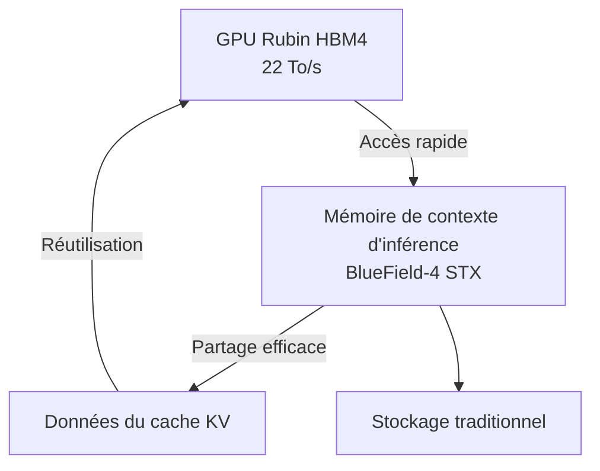
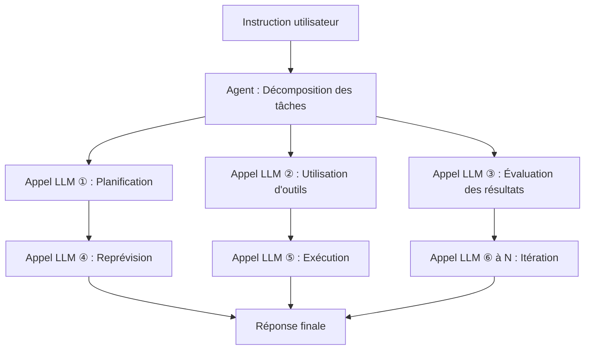

## Introduction : Pourquoi le coût d'inférence est-il un problème maintenant ?

En 2026, le débat autour de l'IA s'est rapidement déplacé des « performances des modèles » vers « l'économie du coût d'inférence ». Les capacités des grands modèles linguistiques (LLM) ne sont plus à prouver, mais le principal obstacle au déploiement commercial réel est le « coût d'inférence par token ».

Les IA agents en particulier effectuent des centaines, voire des milliers, d'appels LLM pour accomplir une seule tâche. Le coût est d'un ordre de grandeur différent de celui des requêtes simples, ce qui rend la mise à l'échelle difficile.

Lors de la conférence d'ouverture de la GTC 2026 en mars 2026, Jensen Huang, PDG de NVIDIA, a résumé cette situation : « S'ils ont plus de capacité, ils peuvent générer plus de tokens, et ils peuvent gagner plus d'argent. Alors que les applications agents créent maintenant d'autres agents pour faire des tâches en chaîne, nous avons une explosion du nombre de tokens générés », a-t-il déclaré, soulignant l'importance d'une infrastructure d'inférence rapide et peu coûteuse.

La réponse de NVIDIA à cette situation est la plateforme **Vera Rubin**. Présentée pour la première fois au CES 2026 (janvier 2026) et détaillée à la GTC 2026 (mars 2026), cette infrastructure IA de nouvelle génération promet de réduire les coûts d'inférence jusqu'à 10 fois par rapport à la génération Blackwell, attirant ainsi l'attention de l'industrie.

Cet article approfondira l'architecture de Vera Rubin d'un point de vue technique, expliquera pourquoi une telle réduction des coûts est possible, et examinera son impact futur sur le domaine des IA agents.

---

## Qu'est-ce que Vera Rubin : un « superordinateur IA » intégrant 7 puces

Vera Rubin n'est pas une seule puce GPU, mais une **plateforme IA intégrée avec une conception extrêmement coordonnée (co-design) de 7 puces dédiées** . NVIDIA appelle cela « Extreme Co-Design ». Lors de la GTC 2026, NVIDIA a officiellement confirmé l'acquisition de Groq en décembre 2025 pour environ 20 milliards de dollars, et le LPU 3 de Groq a été ajouté comme septième puce à la plateforme.

Les 7 puces qui la composent sont les suivantes :

| Puce | Rôle |
|------|------|
| **Vera CPU** | CPU personnalisé pour l'IA (88 cœurs Olympus) |
| **Rubin GPU** | Noyau de calcul IA (50 PFLOPS NVFP4) |
| **NVLink 6 Switch** | Communication rapide entre GPU (3,6 To/s) |
| **ConnectX-9 SuperNIC** | Traitement réseau |
| **BlueField-4 DPU** | Traitement des données et mémoire de contexte d'inférence |
| **Spectrum-6 Ethernet Switch** | Communication Ethernet |
| **Groq 3 LPU** | Accélérateur d'inférence à faible latence (ajout récent) |

L'ensemble du système est intégré au niveau du rack, fourni sous le facteur de forme **Vera Rubin NVL72**. Il s'agit d'une configuration intégrant 72 GPU Rubin et 36 CPU Vera par rack. Pour des déploiements encore plus importants, une configuration de 40 racks appelée **Vera Rubin POD** est également disponible, offrant une puissance de calcul de 60 exaFLOPS.

---

## Vera CPU : un processeur propriétaire conçu pour l'IA

L'une des principales différences de Vera Rubin par rapport aux plateformes précédentes est l'utilisation du **CPU personnalisé « Vera » conçu par NVIDIA** .

Vera est équipé de **88 cœurs Olympus** . Olympus est un cœur conçu par NVIDIA basé sur le jeu d'instructions ARMv9.2, spécifiquement optimisé pour les charges de travail des centres de données IA. Chaque cœur traite 2 threads en parallèle grâce à la technologie « Spatial Multithreading », offrant une capacité de traitement totale de **176 threads** . Le cache L3 a été augmenté de 40 % pour atteindre 162 Mo, et le nombre de transistors a atteint 227 milliards, soit 2,2 fois plus que la génération précédente.

Ce qui mérite d'être souligné, c'est la prise en charge de la précision FP8. Le Vera CPU est le premier CPU de l'industrie à prendre en charge nativement le FP8, permettant de traiter l'ensemble des charges de travail IA avec des formats numériques de faible précision.

En termes de mémoire, il peut embarquer jusqu'à **1,5 To de mémoire SOCAMM LPDDR5X** , offrant une bande passante mémoire de **1,2 To/s** . En élargissant le bus mémoire à 1024 bits et en augmentant la vitesse à 9600 MT/s, une bande passante 2,5 fois supérieure à celle de la génération précédente est obtenue. Ce qui est encore plus important, c'est la connexion au GPU Rubin. Grâce au **NVLink-C2C (Chip-to-Chip) de 2e génération** , une bande passante cohérente de **1,8 To/s** est réalisée entre le CPU et le GPU. C'est 7 fois plus rapide que le PCIe Gen 6.

### Pourquoi un CPU personnalisé est-il nécessaire ?

Les serveurs IA traditionnels utilisaient des CPU génériques, mais les CPU peuvent devenir un goulot d'étranglement dans l'inférence LLM. La bande passante mémoire et la vitesse de connexion du CPU hôte ne peuvent pas suivre la puissance de traitement du GPU.

NVIDIA a reconnu que l'inférence LLM est limitée par la bande passante mémoire et l'interconnexion, et a optimisé l'ensemble du système en concevant également le CPU de manière propriétaire. Les liens cohérents rapides entre CPU et GPU minimisent la surcharge de transfert de données, améliorant le taux d'utilisation des GPU.

---

## Rubin GPU : un moteur de calcul de nouvelle génération spécialisé pour l'inférence

Le GPU Rubin intègre de nombreuses innovations spécialisées pour l'inférence IA.

### Spécifications clés

| Élément | Valeur |
|------|-----|
| Performances d'inférence NVFP4 | **50 PFLOPS** (5 fois Blackwell) |
| Performances d'entraînement NVFP4 | **35 PFLOPS** (3,5 fois Blackwell) |
| Mémoire HBM4 | **288 Go** (par unité) |
| Bande passante mémoire HBM4 | **22 To/s** |
| Bande passante NVLink 6 | **3,6 To/s** (par GPU) |
| Nombre de transistors | **336 milliards** |

Ce qui mérite particulièrement l'attention, c'est l'utilisation de la **mémoire HBM4** . Par rapport à la génération précédente HBM3, la bande passante mémoire est environ 2,8 fois supérieure, répondant directement au problème de la contrainte de bande passante mémoire dans l'inférence LLM.

### NVFP4 et le moteur Transformer de 3e génération

Le GPU Rubin est équipé du **moteur Transformer de 3e génération** , qui utilise un nouveau format numérique de faible précision appelé NVFP4. Le NVFP4 a une densité arithmétique encore plus élevée que le NVFP8 utilisé par Blackwell, offrant une amélioration significative du débit tout en maintenant la précision. NVIDIA a obtenu une amélioration du débit effectif allant au-delà d'une simple augmentation des FLOPS en intégrant profondément cette exécution de faible précision dans l'architecture et la pile logicielle.

---

## NVLink 6 : une infrastructure de communication qui dépasse le mur de la bande passante

Dans l'inférence LLM, en particulier avec les modèles Mixture-of-Experts (MoE) et les environnements multi-GPU, la **bande passante de communication entre les GPU** est un facteur déterminant pour les performances.

NVLink 6 a **doublé la bande passante** par rapport à la génération précédente (NVLink 5).

| Indicateur | NVLink 5 | NVLink 6 |
|------|----------|----------|-
| Bande passante par switch | 1 800 Go/s | **3 600 Go/s** |
| Bande passante par GPU | Environ 1,8 To/s | **3,6 To/s** |
| Ensemble du rack NVL72 | — | **260 To/s** |

La bande passante interne de 260 To/s offerte par le rack NVL72 est suffisante pour permettre l'inférence efficace de modèles MoE à grande échelle.

---

## Groq 3 LPU : accélérateur d'inférence à faible latence

L'une des plus grandes surprises de la GTC 2026 a été l'intégration de la technologie LPU (Language Processing Unit) de Groq dans la plateforme Vera Rubin. NVIDIA a acquis Groq le 24 décembre 2025 pour environ 20 milliards de dollars, embauché du personnel supérieur et obtenu une licence non exclusive de la technologie LPU de Groq.

### Répartition des rôles entre GPU et LPU

Dans le système Vera Rubin, Rubin et Groq se partagent le processus d'inférence.


- **GPU Rubin** : Responsable du traitement préfill et du décodage de l'attention
- **Groq 3 LPU** : Responsable de l'exécution du réseau feed-forward (FFN)

Cette division du travail permet à chaque puce de se concentrer sur les tâches pour lesquelles elle est la plus performante.

### Spécifications du rack Groq 3 LPX

Le **rack Groq 3 LPX** annoncé lors de la GTC 2026 embarque 256 LPU.

| Élément | Valeur |
|------|-----|
| Capacité SRAM (par puce) | **500 Mo** |
| Bande passante SRAM (par puce) | **150 To/s** |
| Bande passante de mise à l'échelle (par puce) | **2,5 To/s** |
| Capacité SRAM totale sur puce (rack) | **128 Go** |
| Bande passante de mise à l'échelle (rack) | **640 To/s** |

Groq 3 est conçu en privilégiant la bande passante plutôt que la capacité, avec une bande passante d'environ 80 To/s par puce. Cette conception axée sur la SRAM et à haute bande passante permet une faible latence dans le traitement FFN.

### Effet de l'intégration

La combinaison de Vera Rubin et de Groq LPX permet une **augmentation du débit d'inférence des modèles à des trillions de paramètres jusqu'à 35 fois** et une **augmentation de 35 fois du débit par mégawatt** par rapport au GPU Rubin seul. Ceci est réalisé sans modification majeure de la plateforme CUDA, en utilisant le LPU comme accélérateur de décodage hautement spécialisé.

---

## Stockage mémoire de contexte d'inférence : spécialisation pour l'IA agent

Une fonctionnalité clé démontrant que Vera Rubin est conçu comme une « base pour l'IA agent » est sa **plateforme de stockage mémoire de contexte d'inférence** .

### Nouvelle hiérarchie mémoire

NVIDIA utilise le DPU BlueField-4 pour construire une nouvelle hiérarchie mémoire entre le GPU et le stockage traditionnel.



Le rack de stockage BlueField-4 STX fonctionne comme une « mémoire de contexte dédiée » pour maintenir la cohérence du contexte lorsque les agents IA gèrent des conversations multi-tours à grande échelle. En déchargeant les données du cache KV sur la puce BlueField-4, le partage et la réutilisation des données du cache dans l'ensemble de l'infrastructure d'inférence IA sont possibles, améliorant le débit d'inférence **jusqu'à 5 fois** .

### Impact sur l'IA agent

Les IA agents ont des modèles de calcul fondamentalement différents des requêtes simples.



Pour une seule instruction, des dizaines à des centaines d'appels LLM se produisent, chacun ayant un contexte long. Le stockage mémoire de contexte d'inférence améliore le débit global et l'efficacité des coûts des IA agents en gérant efficacement ce cache KV.

---

## Le mécanisme de réduction des coûts par 10 : une interprétation précise des chiffres

Il est important de comprendre exactement les conditions dans lesquelles le chiffre de « réduction du coût d'inférence par 10 » revendiqué par NVIDIA est atteint.

### Principaux facteurs d'amélioration

La réduction des coûts par 10 est le résultat d'un effet combiné de plusieurs innovations technologiques.

```
Amélioration de la bande passante mémoire HBM4 : environ 2,8 fois
Amélioration du débit NVLink 6 : environ 2 fois
Amélioration des performances du cœur Tensor NVFP4 : environ 5 fois
Efficacité du traitement FNN grâce à l'intégration du Groq LPU : facteur supplémentaire
```

### Amélioration spectaculaire de l'efficacité énergétique

Jensen Huang a présenté des chiffres impressionnants lors de sa conférence d'ouverture. « Avec la génération Blackwell, nous pouvions générer 22 millions de tokens par seconde à partir d'un centre de données de 1 GW. Avec Vera Rubin, nous pouvons générer 700 millions de tokens par seconde avec la même puissance. C'est une amélioration de 350 fois en deux ans », a-t-il déclaré.

| Indicateur | Blackwell | Vera Rubin | Facteur d'amélioration |
|------|-----------|------------|-----------------|-
| Tokens/seconde par 1 GW | 22 millions | **700 millions** | **Environ 32 fois** |
| Coût par token (contexte long) | Référence | Jusqu'à 1/10 | **Jusqu'à 10 fois** |
| Débit d'inférence/watt | Référence | 10 fois | **10 fois** |
| Nombre de GPU d'entraînement MoE | Référence | 1/4 | **4 fois plus efficace** |

### Attentes réalistes

Cependant, une évaluation réaliste est également importante. La réduction des coûts par 10 est un résultat de benchmark dans des conditions spécifiques de « contexte long et sortie longue », et **2 à 3 fois d'amélioration est une attente réaliste pour l'inférence de modèles denses à contexte court** .

---

## Le rack NVL72 : performances de l'ensemble du système

Le Vera Rubin NVL72 est un système à l'échelle du rack qui intègre chaque composant.

### Résumé des spécifications du NVL72

| Élément | Spécification |
|------|------|
| Configuration GPU | 72 x Rubin GPU |
| Configuration CPU | 36 x Vera CPU |
| Performance totale d'inférence NVFP4 | **3,6 exaFLOPS** |
| Capacité HBM4 totale | **20,7 To** |
| Bande passante HBM4 totale | **1,6 Po/s** (Pétaoctets par seconde) |
| Bande passante NVLink 6 totale | **260 To/s** |

### Vera Rubin POD : déploiement à l'échelle du centre de données

Une configuration encore plus grande, le **Vera Rubin POD** , est disponible, composée de 40 racks.

| Élément | Spécification |
|------|------|
| Nombre total de GPU | 2 880 |
| Puissance de calcul totale | **60 exaFLOPS** |
| Composants de configuration | Plus de 1 300 000 |

Les POD sont la principale unité des centres de données de nouvelle génération que NVIDIA appelle « usines IA ».

---

## Comparaison avec Blackwell : évolution générationnelle

Vera Rubin se situe après Blackwell de NVIDIA. Résumons les principales améliorations de chaque génération.

| Élément | Blackwell | Vera Rubin | Facteur d'amélioration |
|------|-----------|------------|-----------------|-
| Performance d'inférence GPU (NVFP4) | 10 PFLOPS | **50 PFLOPS** | **5x** |
| Performance d'entraînement GPU | 10 PFLOPS | **35 PFLOPS** | **3,5x** |
| Bande passante inter-GPU | 1 800 Go/s | **3 600 Go/s** | **2x** |
| Génération HBM | HBM3 | **HBM4** | **Environ 2,8x** |
| CPU | Générique/Grace | **Vera (88 cœurs Olympus)** | — |
| Inférence à faible latence | — | **Intégration Groq 3 LPU** | — |
| Nombre de GPU d'entraînement (MoE) | Référence | **Réduit à 1/4** | **4x** |
| Coût par token | Référence | **Jusqu'à 1/10** | **Jusqu'à 10x** |

---

## Calendrier de déploiement et principaux partenaires

### Calendrier de livraison

NVIDIA prévoit de **commencer la production de masse et l'expédition de Vera Rubin au second semestre 2026** . Au moment de la GTC 2026 (16-19 mars 2026), Vera Rubin était confirmé comme étant en « production complète ».

### Partenaires de déploiement initiaux

Les partenaires suivants ont été annoncés comme les premiers à proposer des services cloud basés sur Vera Rubin :

- **Hyperscalers** : AWS, Google Cloud, Microsoft Azure, Oracle Cloud Infrastructure (OCI)
- **Clouds spécialisés** : CoreWeave, Lambda, Nebius, Nscale

Jensen Huang a déclaré : « Les commandes cumulées pour Blackwell et Rubin dépasseront 1 000 milliards de dollars d'ici la fin de 2027 », indiquant que Vera Rubin est positionné comme un élément central des investissements dans les centres de données.

---

## Défis techniques et perspectives futures

### Consommation d'énergie et investissements dans les centres de données

Le rack NVL72 offre une puissance de calcul phénoménale, mais sa consommation d'énergie est proportionnelle. Alors que les investissements des hyperscalers dans les centres de données devraient dépasser 65 milliards de dollars en 2026, l'adoption de Vera Rubin nécessitera des investissements massifs dans les infrastructures électriques et de refroidissement.

### Développement de l'écosystème logiciel

Bien que NVIDIA affirme que l'intégration du Groq 3 LPU ne nécessite pas de modifications majeures de la plateforme CUDA, l'optimisation de la pile logicielle (bibliothèques CUDA, frameworks d'inférence) est également cruciale. NVIDIA progresse dans ce domaine avec des offres comme NIM (NVIDIA Inference Microservices).

### La prochaine génération « Vera Rubin Ultra »

La GTC 2026 a également annoncé la prochaine génération **Vera Rubin Ultra** , suggérant que NVIDIA continuera à faire évoluer sa plateforme sur un cycle annuel.

---

## Conclusion : vers la prochaine étape de l'infrastructure IA

NVIDIA Vera Rubin n'est pas simplement un « GPU plus rapide ». C'est une plateforme IA intégrée dont 7 puces et systèmes associés sont conçus de manière extrêmement coordonnée : un processeur propriétaire appelé Vera CPU, une bande passante mémoire considérablement améliorée grâce à HBM4, une communication inter-GPU doublée grâce à NVLink 6, une intégration d'inférence à faible latence avec Groq 3 LPU, et la gestion du cache KV grâce au stockage mémoire de contexte d'inférence.

La réduction maximale de 10 fois du coût d'inférence (en contexte long), le quart des GPU nécessaires pour l'entraînement des modèles MoE, et une capacité de génération de tokens 350 fois supérieure pour la même puissance, transforment fondamentalement la faisabilité économique des IA agents.

En 2026, alors que les IA agents commencent à être déployées à grande échelle pour l'automatisation des processus d'entreprise, le coût d'inférence est un enjeu direct pour la rentabilité des entreprises. Lorsque Vera Rubin entrera en production de masse au second semestre 2026, cette équation des coûts sera réécrite. Ce n'est pas seulement l'intelligence des modèles qui détermine la faisabilité de l'IA, mais aussi l'économie de l'infrastructure qui les fait fonctionner. Dans ce contexte, Vera Rubin sera une innovation d'infrastructure majeure représentant l'année 2026.

---

## Références

| Titre | Source | Date | URL |
|:---------|:-------|:-----|:----|
| NVIDIA Kicks Off the Next Generation of AI With Rubin — Six New Chips, One Incredible AI Supercomputer | NVIDIA Newsroom | 2026/03/16 | https://nvidianews.nvidia.com/news/rubin-platform-ai-supercomputer |
| NVIDIA Vera Rubin Opens Agentic AI Frontier | NVIDIA Newsroom | 2026/03/16 | https://nvidianews.nvidia.com/news/nvidia-vera-rubin-platform |
| Inside the NVIDIA Vera Rubin Platform: Six New Chips, One AI Supercomputer | NVIDIA Technical Blog | 2026/03/16 | https://developer.nvidia.com/blog/inside-the-nvidia-rubin-platform-six-new-chips-one-ai-supercomputer/ |
| Inside NVIDIA Groq 3 LPX: The Low-Latency Inference Accelerator for the NVIDIA Vera Rubin Platform | NVIDIA Technical Blog | 2026/03/16 | https://developer.nvidia.com/blog/inside-nvidia-groq-3-lpx-the-low-latency-inference-accelerator-for-the-nvidia-vera-rubin-platform/ |
| NVIDIA Vera Rubin POD: Seven Chips, Five Rack-Scale Systems, One AI Supercomputer | NVIDIA Technical Blog | 2026/03/16 | https://developer.nvidia.com/blog/nvidia-vera-rubin-pod-seven-chips-five-rack-scale-systems-one-ai-supercomputer/ |
| Infrastructure for Scalable AI Reasoning | NVIDIA officiel | 2026/03 | https://www.nvidia.com/en-us/data-center/technologies/rubin/ |
| Nvidia launches Vera Rubin NVL72 AI supercomputer at CES | Tom's Hardware | 2026/01/06 | https://www.tomshardware.com/pc-components/gpus/nvidia-launches-vera-rubin-nvl72-ai-supercomputer-at-ces-promises-up-to-5x-greater-inference-performance-and-10x-lower-cost-per-token-than-blackwell-coming-2h-2026 |
| GTC 2026: Nvidia Unveils Vera Rubin AI Platform, Eyes \$1T by 2027 | Data Center Knowledge | 2026/03/16 | https://www.datacenterknowledge.com/data-center-chips/gtc-2026-nvidia-unveils-vera-rubin-ai-platform-eyes-1t-by-2027 |
| Nvidia GTC 2026: CEO Jensen Huang sees \$1 trillion in orders for Blackwell and Vera Rubin through '27 | CNBC | 2026/03/16 | https://www.cnbc.com/2026/03/16/nvidia-gtc-2026-ceo-jensen-huang-keynote-blackwell-vera-rubin.html |
| Nvidia's Rubin platform aims to cut AI training, inference costs | CIO Dive | 2026/03 | https://www.ciodive.com/news/nvidia-rubin-cut-ai-training-inference-costs/808915/ |
| NVIDIA Vera Rubin NVL72 Detailed: 72 GPUs, 36 CPUs, 260 TB/s Scale-Up Bandwidth | VideoCardz | 2026/01 | https://videocardz.com/newz/nvidia-vera-rubin-nvl72-detailed-72-gpus-36-cpus-260-tb-s-scale-up-bandwidth |
| Decoding the Future of Inference At NVIDIA: Groq LPUs Join Vera Rubin Platform | ServeTheHome | 2026/03/16 | https://www.servethehome.com/decoding-the-future-of-inference-at-nvidia-groq-lpus-join-vera-rubin-platform-for-low-latency-inference/ |
| Nvidia Boasts 7 Chips in Production for Vera Rubin Platform, Including Groq 3 LPU | HPCwire | 2026/03/16 | https://www.hpcwire.com/2026/03/16/nvidia-boasts-7-chips-in-production-for-vera-rubin-platform-including-groq-3-lpu/ |
| NVIDIA Launches New Vera CPU: 88 Olympus Cores Designed From Scratch for AI | Knowledge Hub Media | 2026/01 | https://knowledgehubmedia.com/nvidia-launches-new-vera-cpu-88-olympus-cores-designed-from-scratch-for-ai/ |
| NVIDIA GTC 2026: Rubin GPUs, Groq LPUs, Vera CPUs, and What NVIDIA Is Building for Trillion-Parameter Inference | StorageReview | 2026/03/16 | https://www.storagereview.com/news/nvidia-gtc-2026-rubin-gpus-groq-lpus-vera-cpus-and-what-nvidia-is-building-for-trillion-parameter-inference |

---

> Cet article a été généré automatiquement par LLM. Il peut contenir des erreurs.
