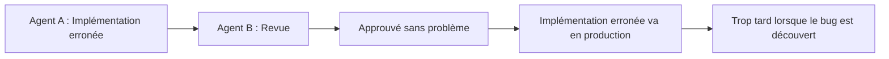

## Introduction — La fin de l'idylle du « Vibe Coding »

Début 2025, Andrej Karpathy, cofondateur d'OpenAI, a proposé le concept de « Vibe Coding », un style de développement qui consiste à soumettre des prompts intuitifs à l'IA et à accepter le code généré presque tel quel. Bien qu'accueilli initialement comme une révolution de productivité, cet optimisme n'a pas duré.

La réalité, telle que démontrée par les données de recherche, est rude. Une enquête Veracode de 2025 a révélé que **45 % du code généré par l'IA contient des vulnérabilités de sécurité**. Une analyse de 470 PR open source par CodeRabbit a montré que le code co-écrit par l'IA comportait **1,7 fois plus de « problèmes majeurs »** que le code écrit par des humains, avec 75 % de mauvaise configuration en plus et 2,74 fois plus de vulnérabilités de sécurité. De manière paradoxale, une étude a également révélé que les développeurs expérimentés voient leur productivité **diminuer de 19 %** lorsqu'ils utilisent des outils de codage IA (bien qu'ils s'attendaient à une amélioration de 24 %).

Quelle est la cause fondamentale de cette situation, parfois appelée la « gueule de bois du Vibe Coding » ? Et quel est le paradigme émergent de **Spec-Driven Development (SDD)** comme solution ? Cet article l'explique en détail, en combinant des articles, des études de cas d'entreprises et des savoir-faire pratiques.

---

## Les raisons structurelles de l'échec du Vibe Coding

### Le problème de l'« IA qui ne lit pas dans les pensées »

Le blog de GitHub exprime ce problème de manière concise : « **Les LLM sont excellents pour compléter des motifs, mais ils ne peuvent pas lire dans les pensées** ».

Si vous demandez à un assistant de codage IA de « créer une fonctionnalité de connexion », il générera une certaine forme de fonctionnalité de connexion. Mais utilise-t-il OAuth 2.0, comment la gestion des sessions est-elle gérée, est-ce compatible avec le schéma de base de données existant, comment les exigences de sécurité sont-elles satisfaites ? Sans spécifier cela explicitement, l'IA ne fera que compléter du « code qui semble correct ».

### Problème des « Shadow Bugs » et boucles d'hallucination

Les problèmes créés par le Vibe Coding peuvent être globalement divisés en deux catégories.

La première est les **Shadow Bugs** (code qui semble correct mais contient des vulnérabilités graves). Le code fonctionne, passe les tests. Mais il peut y avoir une injection SQL sous certaines conditions, ou la possibilité de contourner l'authentification. Les problèmes ne se manifestent souvent qu'une fois le code déployé en production.

L'autre est la **boucle d'hallucination**. Dans les systèmes multi-agents où plusieurs agents IA collaborent, un agent peut juger correctes les sorties erronées d'un autre agent, créant un cercle vicieux où leurs erreurs se renforcent mutuellement. Sans un « point de référence correct » sous la forme d'un cahier des charges, cette chaîne ne peut pas être rompue.



### Perte de contexte et incohérence architecturale

La conversation avec l'IA réinitialise le contexte à chaque session. L'IA de la session suivante ignore le fait que vous avez décidé d'implémenter l'authentification via JWT lors de la session précédente. Lorsque plusieurs conversations ou plusieurs agents IA sont impliqués, la conception architecturale globale devient fragmentée, et vous vous retrouvez avec un système incohérent où une partie utilise REST et une autre GraphQL.

---

## Qu'est-ce que le Spec-Driven Development ?

### Définition et principes fondamentaux

Le Spec-Driven Development (SDD) est un paradigme de développement qui consiste à **définir un cahier des charges (Spec) clair comme un « contrat » pour l'IA, et à générer du code basé sur ce contrat**.

Thoughtworks l'explique ainsi : « Le SDD utilise des spécifications d'exigences claires comme prompts pour générer du code exécutable par des agents IA. Le cahier des charges définit explicitement le comportement externe (mappage entrée/sortie, préconditions/postconditions, invariants, contraintes, types d'interface) ».

Le principe « **Investir une heure dans la planification peut économiser dix heures de reprises ultérieures** » (Thoughtworks) s'applique le plus fortement dans le développement piloté par l'IA.

### Comparaison Vibe Coding vs SDD

| Aspect | Vibe Coding | Spec-Driven Development |
|:-------|:------------|:------------------------|
| Porteur principal d'information | Conversation/Prompts | Fichier de spécifications |
| Persistance du contexte | Uniquement dans la session | Persistant (stocké sous forme de fichier) |
| Enregistrement des décisions de conception | Aucun (implicite) | Documenté explicitement |
| Instruction à l'IA | Prompt à chaque fois | Faire référence au cahier des charges |
| Objet de la revue | Code | Cahier des charges (d'abord) → Code (ensuite) |
| Échelle | Individu/Petite échelle | Équipe/Systèmes de production |

### Processus en 4 phases du SDD

Le **Spec Kit** (licence MIT), sorti par GitHub en septembre 2025, est une boîte à outils open source pour la mise en œuvre du SDD. Sa conception définit 4 phases :

**Specify (Définition des spécifications)** : Définir les parcours utilisateur et les critères de succès. L'IA génère un brouillon de requirements.md, mais un humain le révise et le finalise.

**Plan (Planification technique)** : Déclarer l'architecture, la pile technologique et les contraintes. L'IA propose un design.md, et un humain prend la décision.

**Tasks (Décomposition des tâches)** : Diviser en unités de travail petites et révisables. L'IA génère un tasks.md.

**Implement (Mise en œuvre)** : L'agent IA implémente la tâche, tandis qu'un humain vérifie à chaque point de contrôle.

L'élément clé de ce processus est la présence de **points de contrôle explicites** à chaque phase. Il s'agit d'un changement de flux de travail de « Prompter et prier » à « Spécifier et vérifier ».

---

## Ce que révèlent les articles

### Au-delà du prompt : Étude empirique des règles de curseur (arXiv:2512.18925)

Une étude menée par Shaokang Jiang et Daye Nam, chercheurs chez Microsoft et GitHub, est la première étude empirique à grande échelle analysant les fichiers `.cursorrules` dans 401 dépôts open source (présentation prévue à MSR 2026).

La classification établie par cette étude divise la fourniture de contexte aux assistants de codage IA en 5 thèmes :

| Thème | Contenu |
|:-------|:-----|
| Conventions | Style de code, conventions de nommage, format |
| Directives | Modèles d'architecture, meilleures pratiques |
| Informations sur le projet | Pile technologique, dépendances, structure des répertoires |
| Directives LLM | Instructions d'action directes pour l'IA (ce qu'il faut faire/ne pas faire) |
| Exemples | Exemples concrets de modèles de code attendus |

La découverte importante est « **Non seulement le prompt, mais aussi les directives permanentes lisibles par machine déterminent l'efficacité de l'IA** ». Ce ne sont pas les prompts temporaires, mais les fichiers de contexte permanents comme `.cursorrules` ou `CLAUDE.md` qui définissent la qualité des assistants de codage IA.

### Promptware Engineering : Gestion du cycle de vie des cahiers des charges (arXiv:2503.02400)

L'article « Promptware Engineering » souligne que le développement actuel de prompts est confronté à une « crise du promptware dépendante de l'essai-erreur » (accepté par ACM TOSEM).

La solution proposée est de traiter les prompts (cahiers des charges) comme des « artefacts logiciels » et de les gérer dans le cycle de vie suivant :

```
Définition des exigences → Conception → Implémentation → Test → Débogage → Évolution → Déploiement → Surveillance
```

Les cahiers des charges doivent être traités de la même manière que le code en termes de « contrôle de version, de tests et d'amélioration continue ».

### 10 directives pour les prompts de génération de code (arXiv:2601.13118)

Identifiée grâce à une enquête auprès de 50 praticiens, la découverte la plus intéressante de cette étude est que « **l'utilité perçue et la fréquence d'utilisation réelle ne correspondent pas** ».

Bien que les praticiens sachent que « la spécification de l'entrée/sortie » et « la définition des pré/postconditions » sont utiles, ils ne les utilisent pas en réalité. Le SDD tente de résoudre ce fossé « savoir mais ne pas faire » en l'intégrant dans le flux de travail.

### Décomposition des tâches multi-agents et protection de la cohérence (arXiv:2511.01149)

L'article « Modular Task Decomposition and Dynamic Collaboration in Multi-Agent Systems » propose des méthodes pour intégrer l'**analyse des contraintes et les mécanismes de protection de la cohérence** lors de la décomposition des tâches.

Il détecte à l'avance les contradictions entre les sous-tâches et empêche les « boucles d'hallucination » dans les environnements multi-agents. Cela correspond directement à l'approche préconisée par le SDD : « faire du cahier des charges le langage commun entre les agents ».

---

## Ingénierie du Contexte : Au-delà du Cahier des Charges

### De l'Ingénierie des Prompts à l'« Ingénierie du Contexte »

En septembre 2025, Anthropic a défini l'évolution de ce concept dans un article intitulé « Effective Context Engineering for AI Agents ».

L'**Ingénierie du Contexte** consiste à « maximiser la probabilité d'obtenir le résultat souhaité avec un minimum de tokens à haute valeur informative ». Si l'ingénierie des prompts est la technique qui « optimise une interaction ponctuelle entre un humain et un LLM », l'ingénierie du contexte est la technique qui « **conçoit le flux d'informations entre les agents et l'environnement global** ».

Anthropic met en garde contre le phénomène de « **corruption du contexte** » qui accompagne l'expansion des fenêtres de contexte. Plus le contexte est long, plus le risque que le LLM rappelle inexactement les informations ultérieures est élevé. Il ne suffit pas de dire à l'IA de « lire tout le cahier des charges » ; la conception qui **fournit les informations nécessaires au bon moment** est cruciale.

### 4 techniques recommandées

Les 4 techniques de gestion du contexte recommandées par Anthropic sont les suivantes :

**Récupération juste-à-temps** : Au lieu de fournir l'intégralité du cahier des charges en une seule fois, injecter dynamiquement uniquement les informations nécessaires pour la tâche.

**Compactage de l'historique de conversation** : Résumer et compresser les longues conversations pour maintenir la qualité du contexte.

**Prise de notes structurée** : Enregistrer les décisions et les découvertes importantes de manière structurée, afin qu'elles puissent être référencées lors des appels IA ultérieurs.

**Architecture à sous-agents** : Diviser en agents spécialisés, minimisant ainsi le contexte de chaque agent.

### Principes de conception de AGENTS.md / CLAUDE.md

Le document « How to Write a Great agents.md » de GitHub (basé sur l'analyse de plus de 2 500 dépôts) définit 6 domaines clés pour les fichiers de contexte efficaces :

```
1. Commandes — Commandes pour exécuter les builds, les tests, le linting
2. Tests — Méthodes d'exécution des tests et sorties attendues
3. Structure du projet — Organisation des répertoires et rôles de chaque fichier
4. Style de code — Conventions de formatage, règles de nommage
5. Flux de travail Git — Stratégie de branche, conventions de messages de commit
6. Lignes de démarcation — Toujours exécuter / Vérification préalable / Interdit
```

Cependant, il faut noter qu'une étude publiée par l'ETH Zurich en 2026 a indiqué que « les fichiers de contexte générés par LLM ont un léger effet négatif sur le taux de succès des tâches ». La meilleure pratique actuelle consiste à **limiter les fichiers de contexte aux informations qui ne peuvent pas être déduites des outils ou du code existant**.

---

## Mise en pratique : 6 éléments à inclure dans le cahier des charges du SDD

Le cahier des charges créé dans le SDD doit obligatoirement contenir les 6 éléments suivants :

**1. User Stories et parties prenantes**
Décrire clairement « qui » a besoin de « quoi », « pour quelle raison ».

**2. Critères de succès mesurables**
Définir de manière quantitative, par exemple « LCP inférieur à 2,5 secondes », plutôt que « de meilleures performances ».

**3. Exigences fonctionnelles et non fonctionnelles**
Décrire « ce qui sera fait » ainsi que « ce qui ne sera pas fait » (contraintes explicites).

**4. Contexte technique et points d'intégration**
Spécifier les interfaces avec les systèmes existants, les API et les bibliothèques à utiliser.

**5. Préconditions, postconditions et invariants**
Définir formellement les contraintes logiques que les fonctions, modules ou systèmes doivent satisfaire.

```markdown
## API d'enregistrement utilisateur (POST /api/users)

### Préconditions
- L'adresse e-mail n'est pas déjà enregistrée
- Le mot de passe a au moins 8 caractères

### Postconditions
- L'utilisateur est enregistré dans la base de données
- Un e-mail de confirmation est envoyé
- Le JWT est inclus dans la réponse

### Invariants
- Le mot de passe doit être haché avant d'être stocké (jamais en texte brut)
- L'adresse e-mail doit être normalisée en minuscules
```

**6. Tests d'acceptation**
Décrire de manière vérifiable « quand cela est considéré comme terminé ». L'IA utilisera cela comme référence pour le code de test.

### L'importance de spécifier les « interdictions »

Comme le souligne antirez, l'auteur de Redis, il est important d'inclure dans le cahier des charges des « indices sur les mauvaises solutions qui semblent bonnes ».

```markdown
## Schémas interdits
- Utilisation de variables globales (utiliser l'injection de dépendances à la place)
- Contrôle asynchrone avec setTimeout (utiliser les Promises)
- Conversion en type any (utiliser l'inférence de type ou les unions)
- Accès direct à la base de données (toujours passer par la couche de dépôt)
```

### Changement de paradigme du débogage

Dans le SDD, le débogage signifie **modifier le cahier des charges**, plutôt que de corriger le code. Un bug dans le code est un symptôme d'une lacune dans le cahier des charges, et la modification du cahier des charges se répercute sur tout le code généré pour une correction cohérente.

---

## L'avenir, tel que présenté dans le rapport de tendances 2026 d'Anthropic

Le rapport « 2026 Agentic Coding Trends Report » publié par Anthropic en janvier 2026 indique que le développement logiciel connaît « **la plus grande transformation depuis l'interface graphique** ».

Le rôle des ingénieurs évolue de celui de « personnes écrivant du code » à celui de « coordonnateurs d'agents IA ». Cependant, le rapport souligne un point important : **seulement 0 à 20 % des tâches sont entièrement déléguables** ; le reste nécessite une surveillance active, une vérification et un jugement humain.

Les priorités stratégiques pour 2026 incluent :
- Maîtriser la coordination multi-agents
- Mettre à l'échelle la supervision humaine-agent
- Intégrer l'architecture de sécurité

Ce que révèle ce rapport, c'est que le SDD n'est pas seulement une « façon d'écrire des cahiers des charges », mais une **infrastructure organisationnelle et technique pour la collaboration sûre entre les agents IA et les humains**.

---

## Conclusion : Le cahier des charges est-il plus important que le code ?

La proposition du SDD est provocatrice : **le cahier des charges est l'artefact d'ingénierie le plus important**.

Traditionnellement, « écrire du code » était le travail principal d'un ingénieur. Dans un monde où l'IA peut écrire du code, « définir ce qui doit être écrit » devient la valeur fondamentale d'un ingénieur.

« L'IA peut écrire du code. Mais définir « ce qu'il faut construire » reste le travail de l'humain ». Ce changement de perception est le premier pas pour réussir dans le développement piloté par l'IA.

Le principe « Investir une heure dans la planification peut économiser dix heures de reprises ultérieures » est l'un des investissements les plus rentables en 2026. Le plaisir intuitif du Vibe Coding peut disparaître. Mais le SDD permet de retrouver la **confiabilité et la prévisibilité** du code généré par l'IA.

---

## Références

| Titre | Source | Date | URL |
|:---------|:-------|:-----|:----|
| Beyond the Prompt: An Empirical Study of Cursor Rules | MSR 2026 / arXiv | 2025-12-21 | https://arxiv.org/abs/2512.18925 |
| Promptware Engineering: Software Engineering for Prompt-Enabled Systems | ACM TOSEM / arXiv | 2025-03-04 | https://arxiv.org/abs/2503.02400 |
| Guidelines to Prompt LLMs for Code Generation | arXiv | 2026-01-19 | https://arxiv.org/abs/2601.13118 |
| Modular Task Decomposition and Dynamic Collaboration in Multi-Agent Systems | arXiv | 2025-11-03 | https://arxiv.org/abs/2511.01149 |
| Context Engineering for AI Agents in Open-Source Software | arXiv | 2025-10-24 | https://arxiv.org/abs/2510.21413 |
| Effective Context Engineering for AI Agents | Anthropic Engineering | 2025-09-29 | https://www.anthropic.com/engineering/effective-context-engineering-for-ai-agents |
| 2026 Agentic Coding Trends Report | Anthropic | 2026-01-21 | https://resources.anthropic.com/hubfs/2026%20Agentic%20Coding%20Trends%20Report.pdf |
| Spec-Driven Development with AI: Get Started with a New Open Source Toolkit | GitHub Blog | 2025-09-02 | https://github.blog/ai-and-ml/generative-ai/spec-driven-development-with-ai-get-started-with-a-new-open-source-toolkit/ |
| How to Write a Great agents.md: Lessons from Over 2,500 Repositories | GitHub Blog | 2025-11-19 | https://github.blog/ai-and-ml/github-copilot/how-to-write-a-great-agents-md-lessons-from-over-2500-repositories/ |
| Spec-Driven Development: Unpacking One of 2025's Key New AI-Assisted Engineering Practices | Thoughtworks | 2025-11 | https://www.thoughtworks.com/en-us/insights/blog/agile-engineering-practices/spec-driven-development-unpacking-2025-new-engineering-practices |
| My LLM Coding Workflow Going into 2026 | Addy Osmani | 2025-12 | https://addyosmani.com/blog/ai-coding-workflow/ |
| How to Write a Good Spec for AI Agents | Addy Osmani | 2025-10 | https://addyosmani.com/blog/good-spec/ |
| Coding with LLMs in the Summer of 2025 | antirez | 2025-07 | https://antirez.com/news/154 |
| Vibe Coding: Pros, Cons, and 2026 Forecasts | PVS-Studio | 2025-12 | https://pvs-studio.com/en/blog/posts/1338/ |
| The Evidence Against Vibe Coding: What Research Reveals About AI Code Quality | SoftwareSeni | 2026 | https://www.softwareseni.com/the-evidence-against-vibe-coding-what-research-reveals-about-ai-code-quality/ |
| Spec-Driven Development with AI Coding Agents: The Workflow Replacing "Prompt and Pray" | Java Code Geeks | 2026-03 | https://www.javacodegeeks.com/2026/03/spec-driven-developmentwith-ai-coding-agents-the-workflow-replacingprompt-and-pray.html |

---

> Cet article a été généré automatiquement par LLM. Il peut contenir des erreurs.
