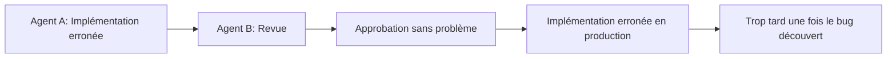

## Introduction — La fin de la lune de miel du « Vibe Coding »

Début 2025, Andrej Karpathy, cofondateur d'OpenAI, a proposé le concept de « Vibe Coding » : un style de développement où l'on soumet des prompts intuitifs à l'IA et où l'on accepte le code généré presque tel quel. Initialement salué comme une révolution de la productivité, cet optimisme n'a pas duré longtemps.

La réalité mise en évidence par les données de recherche est sévère. Une enquête Veracode de 2025 a révélé que **45 % du code généré par l'IA contenait des vulnérabilités de sécurité**. Une analyse de 470 pull requests open source par CodeRabbit a montré que le code co-écrit par l'IA avait **1,7 fois plus de « problèmes majeurs »**, 75 % de mauvaises configurations supplémentaires et 2,74 fois plus de vulnérabilités de sécurité que le code écrit par des humains. Paradoxalement, une étude a révélé que les développeurs expérimentés voient leur productivité **diminuer de 19 %** lorsqu'ils utilisent des outils de codage par IA (bien qu'ils aient initialement prévu une amélioration de 24 %).

Quelle est la cause profonde de cette situation, également appelée « gueule de bois du Vibe Coding » ? Et quel est le paradigme émergent comme solution : le **Spec-Driven Development (SDD)** ? Cet article l'explique en détail, en combinant des articles, des exemples d'entreprises et des connaissances pratiques.

---

## Raisons structurelles de l'échec du Vibe Coding

### Le problème de l'« IA qui ne lit pas dans les pensées »

Le blog de GitHub exprime ce problème de manière concise : « **Les LLM excellent dans la complétion de motifs, mais ils ne peuvent pas lire dans les pensées** ».

Si vous demandez à un assistant de codage IA de « créer une fonction de connexion », il générera une forme de fonction de connexion. Mais utilisera-t-elle OAuth 2.0, comment la gestion des sessions sera-t-elle effectuée, correspondra-t-elle au schéma de base de données existant, comment les exigences de sécurité seront-elles satisfaites ? Sans spécifier cela, l'IA ne fera que compléter un « code qui semble juste ».

### Problème des bugs cachés et boucle de hallucination

Les problèmes engendrés par le Vibe Coding peuvent être globalement classés en deux catégories.

La première est celle des **bugs cachés** (code qui semble correct mais contient des vulnérabilités critiques). Le code s'exécute et passe les tests. Cependant, dans certaines conditions, une injection SQL peut se produire ou un contournement d'authentification peut être possible. Les problèmes se manifestent souvent une fois qu'ils atteignent l'environnement de production.

L'autre est la **boucle de hallucination**. Dans les systèmes multi-agents où plusieurs agents IA collaborent, un agent peut juger correcte la sortie incorrecte d'un autre agent, créant un cercle vicieux où leurs erreurs respectives s'amplifient mutuellement. Sans un « point de référence correct » sous forme de cahier des charges, cette chaîne ne peut pas être brisée.



### Perte de contexte et incohérence architecturale

Le contexte d'une conversation avec l'IA est réinitialisé à chaque session. L'IA lors de la session suivante ne saura pas que vous aviez décidé lors de la session précédente d'« implémenter l'authentification avec JWT ». Si plusieurs conversations ou plusieurs agents IA sont impliqués, la conception globale de l'architecture devient fragmentée, résultant en un système incohérent où une partie utilise REST et une autre GraphQL.

---

## Qu'est-ce que le Spec-Driven Development ?

### Définition et principes fondamentaux

Le Spec-Driven Development (SDD) est un paradigme de développement qui consiste à **définir un cahier des charges clair (Spec) comme un « contrat » pour l'IA, et à laisser l'IA générer le code sur la base de ce contrat**.

Thoughtworks l'explique ainsi : « Le SDD utilise des spécifications de requirements claires comme prompts pour qu'un agent IA génère du code exécutable. Les spécifications définissent explicitement le comportement externe (mapping entrée-sortie, préconditions/postconditions, invariants, contraintes, types d'interface). »

Le principe « **Investir une heure dans la planification permet d'économiser 10 heures de refactorisation plus tard** » (Thoughtworks) s'applique le plus fortement dans le développement piloté par l'IA.

### Comparaison Vibe Coding vs SDD

| Aspect                | Vibe Coding                             | Spec-Driven Development                     |
| :-------------------- | :-------------------------------------- | :------------------------------------------ |
| Porteur principal d'information | Conversation / Prompts                  | Fichiers de spécifications                  |
| Persistance du contexte | Uniquement dans la session              | Persistant (sauvegardé sous forme de fichier) |
| Enregistrement des décisions de conception | Aucun (implicite)                       | Documenté explicitement                     |
| Instruction à l'IA    | Prompt à chaque fois                    | Référence au cahier des charges               |
| Objet de la revue      | Code                                    | Cahier des charges (d'abord) → Code (ensuite) |
| Échelle               | Individu / petite équipe                | Équipe / systèmes de production              |

### Processus en 4 phases du SDD

Le **Spec Kit** (licence MIT) sorti par GitHub en septembre 2025 est une boîte à outils open source pour pratiquer le SDD. Sa conception définit 4 phases :

**Specify (Définition des spécifications)** : Définir les parcours utilisateurs et les critères de succès. L'IA génère un brouillon de requirements.md, mais l'humain le révise et le finalise.

**Plan (Planification technique)** : Déclarer l'architecture, la pile technologique et les contraintes. L'IA propose un design.md, l'humain décide.

**Tasks (Décomposition des tâches)** : Diviser en petites unités de travail vérifiables. L'IA génère tasks.md.

**Implement (Implémentation)** : Les agents IA implémentent les tâches, tandis que l'humain vérifie à chaque point de contrôle.

Le point crucial de ce processus est la présence de **points de contrôle explicites** à chaque phase. C'est une conversion du flux de travail du « Prompt and Pray » (prompter et prier) vers le « Specify and Verify » (spécifier et vérifier).

---

## Ce que les articles révèlent

### Au-delà du prompt : Étude empirique des règles Cursor (arXiv:2512.18925)

Une étude menée par Shaokang Jiang et Daye Nam, chercheurs chez Microsoft et GitHub, est la première étude empirique à grande échelle analysant les fichiers `.cursorrules` dans 401 dépôts open source (présentation prévue à MSR 2026).

La taxonomie établie par cette étude classe la fourniture de contexte aux assistants de codage IA en 5 thèmes :

| Thème                | Contenu                                                         |
| :------------------- | :-------------------------------------------------------------- |
| Conventions          | Styles de code, conventions de nommage, formatage               |
| Directives           | Modèles architecturaux, meilleures pratiques                    |
| Informations sur le projet | Pile technologique, dépendances, structure de répertoires       |
| Directives LLM       | Instructions directes à l'IA (ce qu'il faut faire/ne pas faire) |
| Exemples             | Exemples concrets de motifs de code attendus                      |

La découverte importante est que « **les directives persistantes lisibles par machine, ainsi que les prompts, déterminent l'efficacité de l'IA** ». Ce sont les fichiers de contexte persistants, tels que `.cursorrules` ou `CLAUDE.md`, plutôt que les prompts temporaires, qui définissent la qualité des assistants de codage IA.

### Ingénierie Promptware : Gestion du cycle de vie du cahier des charges (arXiv:2503.02400)

L'article « Promptware Engineering » souligne que le développement actuel des prompts est dans une « crise du promptware dépendant de l'essai-erreur » (accepté par ACM TOSEM).

Il propose comme solution de traiter les prompts (cahier des charges) comme des « artefacts logiciels » et de les gérer selon le cycle de vie suivant :

```
Définition des exigences → Conception → Implémentation → Test → Débogage → Évolution → Déploiement → Surveillance
```

Les cahiers des charges doivent être traités de la même manière que le code en termes de « gestion de versions, de tests et d'amélioration continue ».

### 10 directives pour les prompts de génération de code (arXiv:2601.13118)

Identifiée grâce à une enquête auprès de 50 professionnels, la découverte la plus intéressante de cette étude est que « **l'utilité perçue et la fréquence d'utilisation réelle ne correspondent pas** ».

Bien que les professionnels sachent que « spécifier les entrées/sorties » et « définir les pré/postconditions » sont utiles, ils ne les utilisent pas en pratique. Le SDD vise à résoudre cet écart entre « savoir et ne pas faire » en l'intégrant dans le flux de travail.

### Décomposition de tâches multi-agents et protection de la cohérence (arXiv:2511.01149)

L'article « Modular Task Decomposition and Dynamic Collaboration in Multi-Agent Systems » propose une méthode qui intègre l'**analyse des contraintes et des mécanismes de protection de la cohérence** lors de la décomposition des tâches.

Il détecte les contradictions entre les sous-tâches à l'avance, empêchant les « boucles de hallucination » dans les environnements multi-agents. Cela correspond directement à l'approche du SDD qui préconise de « faire du cahier des charges un langage commun entre les agents ».

---

## Ingénierie de Contexte : Au-delà du Cahier des Charges

### De l'Ingénierie de Prompt à l'« Ingénierie de Contexte »

En septembre 2025, Anthropic a défini l'évolution de ce concept dans un article intitulé « Effective Context Engineering for AI Agents ».

L'**ingénierie de contexte** consiste à « maximiser la probabilité de résultats souhaitables avec un ensemble minimal de tokens à haut signal ». Si l'ingénierie de prompt est une technique qui « optimise les interactions ponctuelles entre humains et LLM », alors l'ingénierie de contexte est une technique qui « **conçoit le flux d'informations de l'agent et de l'environnement global** ».

Anthropic met en garde contre le phénomène de « **corruption de contexte** » qui accompagne l'augmentation de la fenêtre de contexte. Plus le contexte est long, plus le risque que le LLM se souvienne avec précision des informations tardives augmente. Il ne suffit pas de dire à l'IA de « lire tout le cahier des charges » ; une conception qui **fournit les informations nécessaires au moment opportun** est essentielle.

### 4 technologies recommandées

Les 4 techniques de gestion de contexte recommandées par Anthropic sont les suivantes :

**Récupération Juste-à-Temps** : Au lieu de fournir l'intégralité du cahier des charges en une seule fois, injecter dynamiquement uniquement les informations nécessaires à la tâche.

**Compactage de l'historique de conversation** : Résumer et compresser les conversations longues pour maintenir la qualité du contexte.

**Prise de notes structurée** : Enregistrer les décisions et découvertes importantes de manière structurée pour pouvoir y faire référence dans les appels IA ultérieurs.

**Architecture de sous-agents** : Diviser en agents spécialisés pour minimiser le contexte de chaque agent.

### Principes de conception AGENTS.md / CLAUDE.md

« How to Write a Great agents.md » de GitHub (analyse de plus de 2 500 dépôts) définit 6 domaines clés pour des fichiers de contexte efficaces :

```
1. Commandes — Commandes pour exécuter build, test, lint
2. Tests — Méthodes d'exécution des tests et sorties attendues
3. Structure du projet — Organisation des répertoires et rôles de chaque fichier
4. Styles de code — Conventions de formatage, règles de nommage
5. Workflow Git — Stratégie de branche, conventions de messages de commit
6. Lignes de démarcation — Toujours exécuter / Vérification préalable / Interdit
```

Il faut cependant noter que l'étude publiée par l'ETH Zurich en 2026 a souligné que « les fichiers de contexte générés par les LLM ont un effet légèrement négatif sur le taux de succès des tâches ». La meilleure pratique actuelle consiste à **limiter l'écriture dans les fichiers de contexte aux informations qui ne peuvent pas être déduites des outils ou du code existant**.

---

## Pratique : 6 éléments à inclure dans le cahier des charges du SDD

Le cahier des charges créé dans le cadre du SDD doit obligatoirement inclure les 6 éléments suivants :

**1. Historiques utilisateurs et parties prenantes**
Décrire clairement « qui » a besoin de « quoi » et « dans quel but ».

**2. Critères de succès mesurables**
Définir quantitativement, par exemple « LCP inférieur à 2,5 secondes », plutôt que « meilleures performances ».

**3. Exigences fonctionnelles et non fonctionnelles**
Décrire « ce que cela fait » ainsi que « ce que cela ne fait pas » (contraintes explicites).

**4. Contexte technique et points d'intégration**
Spécifier les interfaces avec les systèmes existants, les API et les bibliothèques à utiliser.

**5. Préconditions, Postconditions et Invariants**
Définir formellement les contraintes logiques que les fonctions, modules ou systèmes doivent satisfaire.

```markdown
## API d'enregistrement d'utilisateur (POST /api/users)

### Préconditions
- L'adresse e-mail n'est pas déjà enregistrée
- Le mot de passe a au moins 8 caractères

### Postconditions
- L'utilisateur est enregistré dans la base de données
- Un e-mail de confirmation est envoyé
- Le JWT est inclus dans la réponse

### Invariants
- Le mot de passe doit être haché avant d'être stocké (jamais en clair)
- L'adresse e-mail doit être normalisée en minuscules
```

**6. Tests d'acceptation**
Décrire de manière vérifiable « quand est-ce que c'est terminé ». L'IA l'utilise comme référence pour le code de test.

### L'importance de spécifier les « interdictions »

Comme le souligne antirez, l'auteur de Redis, il est important d'inclure dans le cahier des charges des « indices sur les solutions qui semblent bonnes mais sont mauvaises ».

```markdown
## Motifs interdits
- Utilisation de variables globales (utiliser l'injection de dépendances à la place)
- Contrôle asynchrone avec setTimeout (utiliser des Promises)
- Casting en type any (utiliser l'inférence de type ou union)
- Accès direct à la base de données (toujours passer par la couche dépôt)
```

### Changement de paradigme de débogage

Dans le SDD, le débogage signifie **modifier le cahier des charges**, plutôt que de corriger le code. Les bugs dans le code sont des symptômes d'écarts dans le cahier des charges, et la modification du cahier des charges se propagera à tout le code généré pour une correction cohérente.

---

## L'avenir tel que présenté dans le rapport de tendances 2026 d'Anthropic

Le « 2026 Agentic Coding Trends Report », publié par Anthropic en janvier 2026, rapporte que le développement logiciel connaît « **la plus grande transformation depuis l'interface graphique** ».

Le rôle de l'ingénieur évolue de « celui qui écrit du code » à « coordinateur d'agents IA ». Cependant, le rapport émet une remarque importante : **les tâches entièrement déléguables ne représentent qu'environ 0 à 20 % du total** ; le reste nécessite une supervision active, une vérification et un jugement humain.

Les priorités stratégiques pour 2026 sont :
- Maîtriser la coordination multi-agents
- Scaler la surveillance humain-agent
- Intégrer l'architecture de sécurité

Ce rapport indique que le SDD n'est pas simplement une « façon d'écrire des cahiers des charges », mais une **infrastructure organisationnelle et technique pour une collaboration sûre entre les agents IA et les humains**.

---

## Résumé : Le cahier des charges est-il plus important que le code ?

La proposition avancée par le SDD est provocatrice : **le cahier des charges est l'artefact d'ingénierie le plus important**.

Traditionnellement, « écrire du code » était le travail principal d'un ingénieur. Dans un monde où l'IA peut écrire du code, « définir ce qu'il faut écrire » devient la valeur fondamentale de l'ingénieur.

« L'IA peut écrire du code. Mais définir « ce qu'il faut construire » reste le travail humain » — Ce changement de perception est la première étape pour réussir dans le développement piloté par l'IA.

Le principe « Investir une heure dans la planification permet d'économiser 10 heures de refactorisation plus tard » est l'un des investissements les plus rentables en 2026. Le plaisir intuitif du Vibe Coding pourrait disparaître. Cependant, grâce au SDD, nous pouvons retrouver **la fiabilité et la prévisibilité** du code généré par l'IA.

---

## Références

| Titre                                                                                        | Source                          | Date       | URL                                                           |
| :------------------------------------------------------------------------------------------- | :------------------------------ | :--------- | :------------------------------------------------------------ |
| Beyond the Prompt: An Empirical Study of Cursor Rules                                        | MSR 2026 / arXiv                | 2025-12-21 | https://arxiv.org/abs/2512.18925                              |
| Promptware Engineering: Software Engineering for Prompt-Enabled Systems                      | ACM TOSEM / arXiv               | 2025-03-04 | https://arxiv.org/abs/2503.02400                              |
| Guidelines to Prompt LLMs for Code Generation                                                | arXiv                           | 2026-01-19 | https://arxiv.org/abs/2601.13118                              |
| Modular Task Decomposition and Dynamic Collaboration in Multi-Agent Systems                  | arXiv                           | 2025-11-03 | https://arxiv.org/abs/2511.01149                              |
| Context Engineering for AI Agents in Open-Source Software                                    | arXiv                           | 2025-10-24 | https://arxiv.org/abs/2510.21413                              |
| Effective Context Engineering for AI Agents                                                  | Anthropic Engineering           | 2025-09-29 | https://www.anthropic.com/engineering/effective-context-engineering-for-ai-agents |
| 2026 Agentic Coding Trends Report                                                            | Anthropic                       | 2026-01-21 | https://resources.anthropic.com/hubfs/2026%20Agentic%20Coding%20Trends%20Report.pdf |
| Spec-Driven Development with AI: Get Started with a New Open Source Toolkit                  | GitHub Blog                     | 2025-09-02 | https://github.blog/ai-and-ml/generative-ai/spec-driven-development-with-ai-get-started-with-a-new-open-source-toolkit/ |
| How to Write a Great agents.md: Lessons from Over 2,500 Repositories                         | GitHub Blog                     | 2025-11-19 | https://github.blog/ai-and-ml/github-copilot/how-to-write-a-great-agents-md-lessons-from-over-2500-repositories/ |
| Spec-Driven Development: Unpacking One of 2025's Key New AI-Assisted Engineering Practices     | Thoughtworks                    | 2025-11    | https://www.thoughtworks.com/en-us/insights/blog/agile-engineering-practices/spec-driven-development-unpacking-2025-new-engineering-practices |
| My LLM Coding Workflow Going into 2026                                                       | Addy Osmani                     | 2025-12    | https://addyosmani.com/blog/ai-coding-workflow/                               |
| How to Write a Good Spec for AI Agents                                                       | Addy Osmani                     | 2025-10    | https://addyosmani.com/blog/good-spec/                                        |
| Coding with LLMs in the Summer of 2025                                                       | antirez                         | 2025-07    | https://antirez.com/news/154                                                  |
| Vibe Coding: Pros, Cons, and 2026 Forecasts                                                  | PVS-Studio                      | 2025-12    | https://pvs-studio.com/en/blog/posts/1338/                                    |
| The Evidence Against Vibe Coding: What Research Reveals About AI Code Quality               | SoftwareSeni                    | 2026       | https://www.softwareseni.com/the-evidence-against-vibe-coding-what-research-reveals-about-ai-code-quality/ |
| Spec-Driven Development with AI Coding Agents: The Workflow Replacing "Prompt and Pray" | Java Code Geeks                 | 2026-03    | https://www.javacodegeeks.com/2026/03/spec-driven-developmentwith-ai-coding-agents-the-workflow-replacingprompt-and-pray.html |

---

> Cet article a été généré automatiquement par LLM. Il peut contenir des erreurs.
