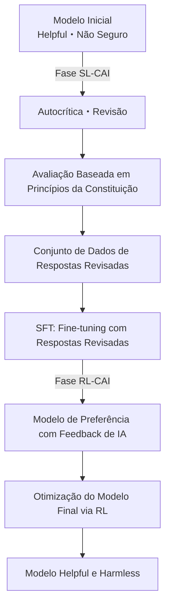
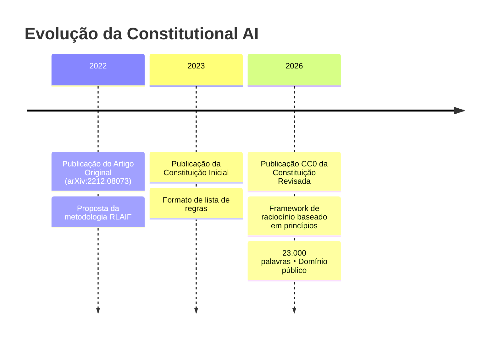

Em 22 de janeiro de 2026, a Anthropic publicou um documento conhecido como "Claude's Constitution" (A Constituição do Claude). Este documento, com aproximadamente 23.000 palavras, descreve detalhadamente os princípios de conduta, valores e critérios de julgamento do Claude, e foi divulgado na íntegra sob a licença **Creative Commons CC0 1.0**, equivalente ao domínio público.

A publicação CC0 significa "que qualquer pessoa pode usar, modificar e adotar sem restrições". Esta é a primeira vez que uma empresa de IA divulga em domínio público o documento central de sua constituição para o treinamento de seus modelos.

## O Que é Constitutional AI

### Uma Tecnologia Iniciada em um Artigo de 2022

O conceito de Constitutional AI foi apresentado sistematicamente pela primeira vez em dezembro de 2022, no artigo da Anthropic "Constitutional AI: Harmlessness from AI Feedback" (arXiv:2212.08073). Os autores foram Yuntao Bai e outros 50 coautores em uma extensa pesquisa colaborativa.

O RLHF (Reinforcement Learning from Human Feedback) tradicional induzia modelos em direção à segurança coletando uma grande quantidade de feedback humano. No entanto, essa abordagem tinha um problema fundamental: a falta de escalabilidade. Quanto mais poderoso o modelo se tornava, maior a expertise humana necessária para a avaliação, e o custo aumentava exponencialmente.

A solução proposta pela Constitutional AI é o "RLHF a partir de Feedback de IA", ou seja, **RLAIF (Reinforcement Learning from AI Feedback)**.

### Fluxo Técnico da CAI



Na **fase SL-CAI (Supervised Learning)**, o próprio modelo critica e revisa suas respostas prejudiciais com base nos princípios da constituição. Por exemplo, ele se autoavalia dizendo "Esta resposta contém premissas racistas. Viola o Princípio Constitucional X (Tratamento Igualitário)" e gera uma versão revisada. É feito um fine-tuning com as respostas revisadas.

Na **fase RL-CAI (Reinforcement Learning)**, a IA avalia qual de várias respostas candidatas está mais alinhada com os princípios da constituição e constrói um conjunto de dados de preferência. Este conjunto de dados é usado para treinar um modelo de recompensa, que otimiza o modelo principal via RL.

O cerne dessa metodologia é que "a supervisão humana necessária para a rotulagem foi comprimida em um único documento textual: a constituição". Em vez de humanos avaliarem diretamente, a IA avalia referenciando a constituição. Isso alivia significativamente o problema de escalabilidade do custo de mão de obra.

### Desafios Resolvidos pelo RLAIF

Os resultados experimentais do artigo original mostraram que modelos aplicados com Constitutional AI apresentaram segurança igual ou superior a modelos baseados em RLHF tradicional. Notavelmente, a característica "baixo teor de prejudicalidade e não evasividade" se destacou.

Filtros de segurança tradicionais muitas vezes adotavam uma abordagem simplista de "recusar consultas perigosas". Como resultado, tendiam a pender para a recusa excessiva (muitos falsos positivos) ou para permitir a passagem excessiva (muitos falsos negativos). Com a Constitutional AI, o modelo entende "por que isso é um problema" antes de responder, permitindo um julgamento apropriado contextualizado.

## O Que a "Claude's Constitution" de 2026 Mudou

### De Lista de Regras para Inferência Baseada em Princípios

A versão inicial da "Constitutional AI" publicada em 2023 era, em grande parte, semelhante a uma lista de regras do tipo "coisas a não fazer". Era uma estrutura que listava proibições explícitas e fazia o modelo referenciá-las para checagem.

A versão de 2026 é arquiteturalmente diferente. É projetada como um framework de raciocínio abrangente com quatro níveis de prioridade.

| Prioridade | Item | Resumo |
|---------|------|------|
| 1 | **Segurança (Broadly Safe)** | Apoia a supervisão humana apropriada para sistemas de IA |
| 2 | **Ética (Generally Ethical)** | Integridade e Evitação de Prejuízos |
| 3 | **Conformidade com Diretrizes (Adherent to Anthropic's Principles)** | Segue as políticas da empresa |
| 4 | **Utilidade (Genuinely Helpful)** | Suporte genuíno ao usuário/operador |

O ponto crucial são as implicações filosóficas da prioridade. A segurança sendo priorizada sobre a utilidade declara explicitamente o princípio "não devemos sacrificar a segurança em prol da utilidade". No entanto, na operação normal, a utilidade no quarto item se torna o principal eixo de avaliação - é projetado para ser o mais útil possível, desde que não infrinja os princípios de prioridade superior.

Além disso, embora os hard constraints (proibições absolutas, como auxiliar na fabricação de armas biológicas) continuem explícitos, a maioria das diretrizes se concentra em "cultivar o julgamento".

### Ensinando "Porquês" ao Modelo

A mudança mais notável na versão de 2026 é a explicação detalhada dos "porquês" por trás das regras.

Por exemplo, "não gerar conteúdo violento" é uma regra incluída em muitas diretrizes de segurança de IA. No entanto, a constituição de Claude na versão 2026 explica cuidadosamente os valores por trás dessa regra - o respeito pela dignidade humana, a prevenção de danos no mundo real e a tensão com a liberdade de expressão.

O objetivo da Anthropic não é "um modelo que memorize regras", mas "um modelo que entenda os princípios e possa aplicá-los a situações desconhecidas". Isso é uma resposta à realidade onde novas situações (novas tecnologias, novos problemas sociais, novos casos de uso) que as regras não preveem estão sempre surgindo.

```
【Abordagem Legada】
SE a solicitação corresponde à lista de proibições ENTÃO Recusar
SENÃO Responder

【Abordagem Baseada em Princípios】
1. Qual é a intenção e o contexto desta solicitação?
2. Quais princípios são relevantes?
3. Como cada princípio se aplica a esta situação?
4. Como resolver os trade-offs entre os princípios?
5. Qual é a resposta mais ética no geral?
```

### O Significado da Divulgação de Documentação em Larga Escala

A escala de 23.000 palavras também é notável. Isso equivale à extensão de uma novela. Não é uma lista superficial de regras, mas descreve detalhadamente valores, processos de decisão e abordagens para lidar com casos difíceis de decisão.

Essa granularidade tem um efeito secundário: aumenta a transparência, permitindo que tomadores de decisão corporativos e usuários entendam "por que Claude se comporta de determinada maneira". Pode ser visto como uma resposta ao problema da "caixa preta" dos sistemas de IA.

A Anthropic admite francamente em seus documentos que "existe uma lacuna entre o comportamento pretendido e o comportamento real do modelo", e se compromete com a avaliação contínua e a expansão da pesquisa em segurança.

## O Que a Publicação CC0 Levanta para a Indústria

### Um Experimento de Código Aberto em Segurança de IA

Publicar o documento da constituição de Constitutional AI sob CC0 tem um grande significado do ponto de vista da abertura da pesquisa em segurança de IA.

**Benefícios para a Comunidade de Pesquisa**: Universidades e instituições de pesquisa podem verificar, expandir e criticar a abordagem da Anthropic. É uma personificação da ideologia de que a pesquisa em segurança, antes de ser um jogo de "quem cria a IA mais segura", deve ser um trabalho colaborativo para "entender o que é IA segura".

**Impacto em Outras Empresas de IA**: Concorrentes como OpenAI, Google e Meta podem referenciar, adotar e modificar documentos semelhantes. Embora possa parecer uma perda de vantagem competitiva no curto prazo, se o nível geral de segurança de IA na indústria aumentar, a indústria como um todo poderá ganhar a confiança de reguladores e da sociedade.

**Impacto na Comunidade de Desenvolvedores**: Pequenas e médias empresas de IA e desenvolvedores individuais podem economizar o custo de projetar frameworks de segurança do zero.

### "Renúncia à Vantagem Competitiva" ou "Estratégia para Dominar Padrões"?

Existem também perspectivas críticas sobre a publicação CC0. Se concorrentes adotarem a constituição de Claude e, na prática, o "framework de segurança projetado pela Anthropic" se tornar o padrão da indústria, isso também é uma situação vantajosa para a Anthropic.

Padronização também significa "tornar a própria filosofia de design o padrão de fato da indústria". O Linux foi disponibilizado em código aberto para competir com os UNIX proprietários da IBM e Sun Microsystems, e o resultado foi que o Linux se tornou a plataforma dominante. Se a publicação CC0 da Constitutional AI provocar uma dinâmica semelhante no mundo da segurança de IA, a Anthropic se tornaria uma líder sem nome no "framework de segurança".

### Questões Restantes

Existem problemas que nem mesmo a publicação CC0 resolve.

**Lacuna de Implementação**: Mesmo que o documento da constituição seja publicado, o know-how sobre como integrá-lo ao processo de treinamento não é divulgado. Se outras empresas lerem a "Constituição", elas serão capazes de alcançar segurança comparável é outra questão.

**Dificuldade de Avaliação**: Não existem métricas objetivas publicadas para medir a conformidade com a constituição de Claude. O "raciocínio baseado em princípios" é qualitativo e difícil de benchmarkar.

**Universalidade de Valores**: Os valores contidos no documento de 23.000 palavras são baseados principalmente no contexto anglo-saxão e ocidental. A adequação da aplicação desses valores a sistemas globais de IA requer discussão contínua.

## Posição na Estratégia de Governança da Anthropic

A publicação CC0 da Constitutional AI faz parte da estratégia mais ampla de transparência da Anthropic. A empresa possui um mecanismo de governança chamado "Long-Term Benefit Trust" e, em janeiro de 2026, deu as boas-vindas à ex-juíza da Suprema Corte da Califórnia, Mariano-Florentino Cuéllar, como novo membro. A abordagem de incorporar especialistas em direito e questões internacionais no sistema de governança é uma escolha estratégica à medida que as discussões sobre regulamentação de IA se intensificam.

A Anthropic persegue várias direções de pesquisa em segurança em paralelo, com interpretabilidade, supervisão escalável, aprendizado orientado a processos e compreensão generalizada como pilares principais. A Constitutional AI se posiciona como a parte "mais próxima da implementação" dentro dessas pesquisas.

O fluxo da publicação do artigo de Constitutional AI (2022) → publicação da constituição inicial (2023) → publicação CC0 da constituição revisada (janeiro de 2026) mostra um cenário de expansão gradual de influência: pesquisa → prática → padronização da indústria.



## Conclusão

A publicação CC0 da "Claude's Constitution" da Anthropic tem um significado que vai além da simples divulgação de informações.

Tecnicamente, a transição de uma lista de regras para um framework de raciocínio baseado em princípios é uma tentativa de atualizar a própria metodologia de implementação da segurança de IA. A combinação de Constitutional AI e RLAIF fornece uma resposta prática ao problema de custo da supervisão humana.

Estrategicamente, a abertura do framework de segurança de IA pode ser lida como um movimento para formar um padrão da indústria liderado pela Anthropic. A escolha da licença menos restritiva, CC0, demonstra a intenção de maximizar a adoção e promover forks e adoções futuras.

E socialmente, como uma resposta aberta do lado corporativo à pergunta "o que é IA e como ela deve se comportar", ela desempenha um papel em promover o diálogo com pesquisadores, formuladores de políticas e o público em geral.

À medida que a discussão sobre segurança de IA transita de "apenas um problema da Anthropic" para "um problema da indústria e da sociedade como um todo", a publicação CC0 da Constitutional AI se tornará um marco que simboliza essa transição.

## Referências

| Título | Fonte | Data | URL |
|:---------|:-------|:-----|:----|
| Constitutional AI: Harmlessness from AI Feedback | arXiv | 2022-12-15 | https://arxiv.org/abs/2212.08073 |
| Claude's new constitution | Anthropic | 2026-01-22 | https://www.anthropic.com/news/claude-new-constitution |
| Long-Term Benefit Trust Adds New Member | Anthropic | 2026-01-21 | https://www.anthropic.com/news/mariano-florentino-long-term-benefit-trust |
| Constitutional AI: Anthropic's approach to AI safety | Anthropic Research | 2023 | https://www.anthropic.com/research/constitutional-ai-harmlessness-from-ai-feedback |
| Anthropic's core views on AI safety | Anthropic | 2023 | https://www.anthropic.com/news/core-views-on-ai-safety |
| Creative Commons CC0 1.0 Universal | Creative Commons | — | https://creativecommons.org/publicdomain/zero/1.0/ |
| Claude's Model Specification | Anthropic | 2024 | https://www.anthropic.com/news/anthropics-model-specification |

---

> Este artigo foi gerado automaticamente por LLM. Pode conter erros.
