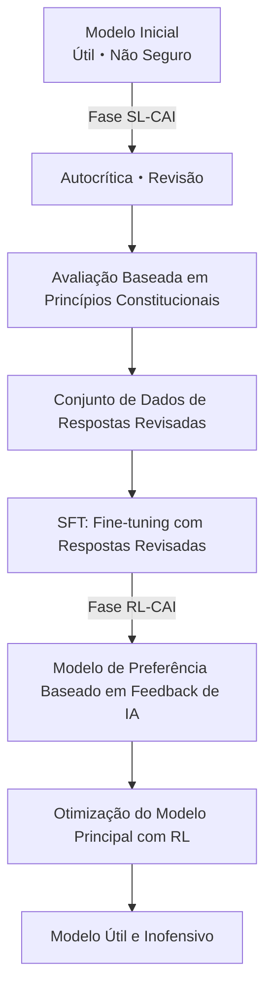
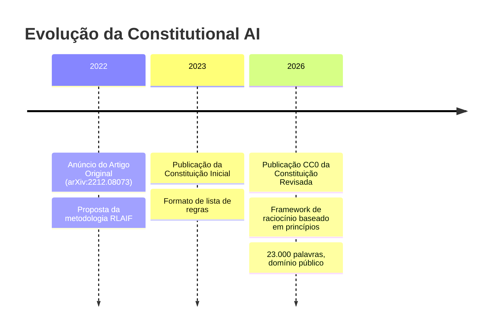

### Título
Constitutional AI CC0 Pública — O Que a Abertura da Segurança de IA Pergunta à Indústria

### Resumo
A Anthropic publicou a "Constituição" do Claude sob licença CC0. Exploramos o significado técnico da transição de listas de regras para raciocínio baseado em princípios e as questões levantadas pela abertura da segurança de IA.

---

Em 22 de janeiro de 2026, a Anthropic publicou um documento conhecido como "Claude's Constitution" (A Constituição do Claude). Com aproximadamente 23.000 palavras, este documento descreve detalhadamente os princípios de conduta, valores e critérios de decisão do Claude e foi publicado integralmente sob a licença **Creative Commons CC0 1.0**, equivalente ao domínio público.

A publicação CC0 significa que "qualquer pessoa pode usar, modificar e adotar sem restrições". Esta é a primeira vez que uma empresa de IA disponibiliza publicamente um documento constitucional central usado para treinar seus modelos.

## O Que é Constitutional AI

### Uma Tecnologia Iniciada pelo Artigo de 2022

O conceito de Constitutional AI foi apresentado pela primeira vez de forma sistemática em dezembro de 2022, em um artigo da Anthropic intitulado "Constitutional AI: Harmlessness from AI Feedback" (arXiv:2212.08073). Os autores são Yuntao Bai e outros 50 coautores em uma extensa pesquisa colaborativa.

O RLHF tradicional (Reinforcement Learning from Human Feedback) coletava feedback humano em grande escala para guiar o modelo em direção à segurança. No entanto, essa abordagem tinha um problema fundamental: não escalava. Quanto mais poderoso o modelo se tornava, mais a expertise humana necessária para avaliação aumentava, e os custos cresciam exponencialmente.

A solução proposta pela Constitutional AI é o "RLHF de Feedback de IA", ou seja, **RLAIF (Reinforcement Learning from AI Feedback)**.

### Fluxo Técnico da CAI



Na **fase SL-CAI (Supervised Learning)**, o próprio modelo critica e revisa suas respostas prejudiciais com base nos princípios constitucionais. Por exemplo, ele se autoavalia como "Esta resposta contém premissas racistas. Viola o Princípio Constitucional X (Tratamento Igualitário)" e gera uma versão revisada. Um fine-tuning é realizado com as respostas revisadas.

Na **fase RL-CAI (Reinforcement Learning)**, a IA avalia qual de várias respostas candidatas adere mais aos princípios constitucionais e constrói um conjunto de dados de preferência. Este conjunto de dados é usado para treinar um modelo de recompensa, que otimiza o modelo principal via RL.

A essência desta abordagem é que "a supervisão humana necessária para a rotulagem foi comprimida em apenas um documento de texto, a constituição". Em vez de humanos avaliarem diretamente, a IA consulta a constituição para fazer a avaliação. Isso alivia significativamente o problema de escalabilidade de custos de mão de obra.

### Desafios Resolvidos pelo RLAIF

Os resultados experimentais do artigo original mostram que o modelo aplicado com Constitutional AI apresentou segurança igual ou superior aos modelos tradicionais baseados em RLHF. Notavelmente, ele exibiu a característica de "ser inofensivo e não evitativo".

Filtros de segurança tradicionais frequentemente adotavam uma abordagem simples de "recusar consultas perigosas". Como resultado, tendiam a pender para a recusa excessiva (muitos falsos positivos) ou para a permissão excessiva (muitos falsos negativos). Com a Constitutional AI, o modelo responde após entender "por que isso é um problema", permitindo julgamentos apropriados baseados no contexto.

## O Que a "Constituição do Claude" de 2026 Mudou

### De Listas de Regras para Raciocínio Baseado em Princípios

Os documentos iniciais de "Constitutional AI" publicados em 2023 eram em grande parte semelhantes a listas de regras sobre "o que não fazer". A estrutura era de especificar proibições e fazer com que o modelo as consultasse e verificasse.

A versão de 2026 é arquiteturalmente diferente. Foi projetada como um framework de raciocínio abrangente com quatro níveis de prioridade.

| Prioridade | Item | Resumo |
|---------|------|------|
| 1 | **Segurança (Broadly Safe)** | Apoia a supervisão humana apropriada sobre sistemas de IA |
| 2 | **Ética (Generally Ethical)** | Integridade e evitação de danos |
| 3 | **Conformidade com Diretrizes (Adherent to Anthropic's Principles)** | Conformidade com as políticas da empresa |
| 4 | **Utilidade (Genuinely Helpful)** | Auxílio genuíno ao usuário/operador |

O ponto crucial são as implicações filosóficas da prioridade. A prioridade da segurança sobre a utilidade declara explicitamente o princípio de que "a segurança não deve ser sacrificada em nome da utilidade". No entanto, em operações normais, a utilidade (item 4) é o principal eixo de avaliação — projetado para ser o mais útil possível, desde que não infrinja os princípios de prioridade superior.

Além disso, embora os hard constraints (proibições absolutas como auxiliar na fabricação de armas biológicas) continuem explicitados, a maioria das diretrizes foca em "cultivar o discernimento".

### Ensinando o "Porquê" ao Modelo

A mudança mais notável na versão de 2026 é a explicação detalhada do "porquê" por trás das regras.

Por exemplo, "não gerar conteúdo violento" é uma regra incluída em muitas diretrizes de segurança de IA. No entanto, a constituição do Claude de 2026 explica detalhadamente os valores subjacentes a essa regra — respeito à dignidade humana, prevenção de danos no mundo real e a tensão com a liberdade de expressão.

O que a Anthropic visa é um modelo que "compreenda princípios e possa aplicá-los a situações desconhecidas", não um modelo que "memorize regras". Esta é uma resposta à realidade de que novas situações (novas tecnologias, novos problemas sociais, novos casos de uso) que as regras não previram estão sempre surgindo.

```
【Abordagem Tradicional】
SE a solicitação corresponde à lista de proibidos EN TÃO rejeitar
SENÃO responder

【Abordagem Baseada em Princípios】
1. Qual a intenção e contexto desta solicitação?
2. Quais princípios se aplicam?
3. Como cada princípio se aplica a esta situação?
4. Como resolver os trade-offs entre os princípios?
5. Qual é a resposta mais ética no geral?
```

### O Significado da Publicação Abrangente de Documentos

A escala de 23.000 palavras também é notável. Isso corresponde ao volume de um conto. Não é uma lista superficial de regras, mas descreve em detalhes os valores, processos de decisão e planos de ação para casos difíceis de decidir.

Tal nível de detalhe tem um efeito secundário — aumenta a transparência, permitindo que tomadores de decisão corporativos e usuários entendam "por que o Claude se comporta de determinada maneira". Isso pode ser visto como uma resposta ao problema da "caixa preta" dos sistemas de IA.

A Anthropic reconhece francamente no documento que "existe uma lacuna entre o comportamento pretendido e o comportamento real do modelo", e se compromete com a avaliação contínua e a expansão da pesquisa de segurança.

## O Que a Publicação CC0 Pergunta à Indústria

### Um Experimento de Código Aberto em Segurança de IA

A publicação da constituição do Constitutional AI sob CC0 tem um grande significado do ponto de vista da abertura da pesquisa em segurança de IA.

**Benefícios para a Comunidade de Pesquisa**: Universidades e instituições de pesquisa podem verificar, expandir e criticar a abordagem da Anthropic. É uma personificação da ideia de que a pesquisa em segurança, antes de ser um jogo de "quem constrói a IA mais segura", deve ser um trabalho colaborativo para "entender o que é IA segura".

**Impacto em Outras Empresas de IA**: Concorrentes como OpenAI, Google e Meta podem consultar, adotar e modificar documentos semelhantes. Embora pareça uma perda de vantagem competitiva no curto prazo, se o nível geral de segurança de IA na indústria aumentar, a indústria como um todo poderá ganhar a confiança de reguladores e da sociedade.

**Impacto na Comunidade de Desenvolvedores**: Pequenas e médias empresas de IA e desenvolvedores individuais podem economizar o custo de projetar frameworks de segurança do zero.

### "Renúncia de Vantagem Competitiva" ou "Estratégia para Dominar o Padrão"?

Existem também perspectivas críticas sobre a publicação CC0. Se concorrentes adotarem a constituição do Claude e, na prática, o "framework de segurança projetado pela Anthropic" se tornar o padrão da indústria, isso também seria uma situação vantajosa para a Anthropic.

Padronização também significa "tornar a própria filosofia de design o padrão de fato da indústria". O Linux foi tornado de código aberto para competir com os sistemas UNIX proprietários da IBM e Sun Microsystems, mas o resultado foi que o Linux se tornou uma plataforma dominante. Se a publicação CC0 da Constitutional AI desencadear uma dinâmica semelhante no mundo da segurança de IA, a Anthropic se tornaria a líder não declarada de "frameworks de segurança".

### Questões Restantes

Existem problemas que não são resolvidos nem mesmo com a publicação CC0.

**Lacuna de Implementação**: Mesmo que o documento constitucional seja publicado, o know-how sobre como integrá-lo ao processo de treinamento não é divulgado. Se outras empresas lerem a "constituição", isso não significa que elas podem alcançar segurança equivalente. A questão de saber se elas podem alcançar segurança equivalente é outra história.

**Dificuldade de Avaliação**: Métricas objetivas para medir a conformidade com a constituição do Claude não são divulgadas. "Raciocínio baseado em princípios" é qualitativo e difícil de benchmark.

**Universalidade dos Valores**: Os valores contidos no documento de 23.000 palavras são principalmente baseados no contexto anglófono e ocidental. A adequação da aplicação desses valores a sistemas globais de IA requer discussão contínua.

## Posição na Estratégia de Governança da Anthropic

A publicação CC0 da Constitutional AI faz parte da estratégia mais ampla de transparência da Anthropic. A empresa possui um mecanismo de governança chamado "Long-Term Benefit Trust" e, em janeiro de 2026, adicionou Mariano-Florentino Cuéllar, ex-juiz da Suprema Corte da Califórnia, como novo membro. A postura de incorporar especialistas em direito e relações internacionais ao sistema de governança é uma escolha estratégica em meio a discussões intensas sobre regulamentação de IA.

A Anthropic persegue várias direções de pesquisa em segurança em paralelo, com explicabilidade (Interpretability), vigilância escalável, aprendizado orientado a processos e compreensão generalizada como pilares principais. A Constitutional AI é posicionada como a parte "mais próxima da implementação" dentro dessas pesquisas.

O fluxo de Anúncio do artigo Constitutional AI (2022) → Publicação da constituição inicial (2023) → Publicação CC0 da constituição revisada (Janeiro de 2026) mostra um cenário de expansão gradual de influência: pesquisa → prática → padronização da indústria.



## Resumo

A publicação CC0 da "Constituição do Claude" pela Anthropic tem um significado maior do que a simples divulgação de informações.

Tecnicamente, a transição de listas de regras para um framework de raciocínio baseado em princípios é uma tentativa de atualizar a própria metodologia de implementação da segurança de IA. A combinação de Constitutional AI e RLAIF oferece uma resposta realista ao problema do custo da supervisão humana.

Estrategicamente, a abertura do framework de segurança de IA pode ser vista como um movimento para formar um padrão da indústria liderado pela Anthropic. A escolha da CC0, a licença mais permissiva, demonstra a intenção de maximizar a adoção e promover forks e adoções futuras.

E socialmente, como uma resposta pública da empresa sobre "o que é IA e como ela deve se comportar", ela promove o diálogo entre pesquisadores, formuladores de políticas e o público em geral.

No processo de transição da discussão sobre segurança de IA de "um problema apenas da Anthropic" para "um problema de toda a indústria e sociedade", a publicação CC0 da Constitutional AI será um marco emblemático dessa transição.

## Referências

| Título | Fonte | Data | URL |
|:---------|:-------|:-----|:----|
| Constitutional AI: Harmlessness from AI Feedback | arXiv | 2022-12-15 | https://arxiv.org/abs/2212.08073 |
| Claude's new constitution | Anthropic | 2026-01-22 | https://www.anthropic.com/news/claude-new-constitution |
| Long-Term Benefit Trust appoints new member | Anthropic | 2026-01-21 | https://www.anthropic.com/news/mariano-florentino-long-term-benefit-trust |
| Constitutional AI: Anthropic's safety research | Anthropic Research | 2023 | https://www.anthropic.com/research/constitutional-ai-harmlessness-from-ai-feedback |
| Anthropic's core views on AI safety | Anthropic | 2023 | https://www.anthropic.com/news/core-views-on-ai-safety |
| Creative Commons CC0 1.0 Universal | Creative Commons | — | https://creativecommons.org/publicdomain/zero/1.0/ |
| Claude's Model Specification | Anthropic | 2024 | https://www.anthropic.com/news/anthropics-model-specification |

---

> Este artigo foi gerado automaticamente por LLM. Pode conter erros.
