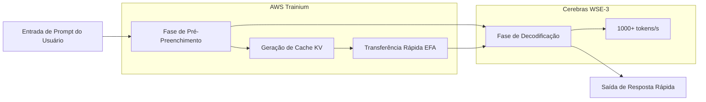

### O Início de 2026: Um Ponto de Virada na Infraestrutura de IA

O início de 2026 será lembrado como um ponto de inflexão na história da infraestrutura de IA. A OpenAI fechou um acordo de mais de US$10 bilhões com a Cerebras, marcando a primeira introdução em larga escala de aceleradores de inferência que não são GPUs NVIDIA em ambientes de produção. O carro-chefe é o "GPT-5.3-Codex-Spark" — um modelo especializado em codificação que opera a velocidades superiores a 1.000 tokens por segundo.

Este movimento vai além de uma simples mudança de fornecedor. Significa a introdução de concorrência genuína no bastião da NVIDIA, que tem dominado o mercado de hardware de IA por anos. Este artigo detalha os aspectos técnicos da arquitetura Cerebras WSE-3, o contexto por trás do acordo com a OpenAI e o impacto de longo alcance da diversificação da infraestrutura de IA na indústria como um todo.

## Cerebras WSE-3: A Inovação do Wafer Scale Engine

### Diferenças Fundamentais da Arquitetura de GPU Tradicional

As GPUs que sustentam a inferência de IA moderna frequentemente empregam uma arquitetura onde wafers de silício são cortados em chips individuais (diced), e múltiplos chips são conectados em rede para processamento paralelo. A NVIDIA H100 e B200 são exemplos típicos, buscando escalabilidade através da conexão de múltiplos chips usando interconexões de alta velocidade como NVLink.

A abordagem da Cerebras desafia essa norma. O WSE (Wafer Scale Engine) opera o wafer inteiro como um único chip massivo. Como não há corte físico (dicing), não há sobrecarga de comunicação entre chips em princípio.

### Principais Especificações do WSE-3

O WSE-3 é fabricado com o processo 5nm da TSMC e ostenta as seguintes especificações:

| Especificação | WSE-3 | NVIDIA H100 | Fator de Ampliação |
|:-----------------|:------|:------------|:---------|
| Número de Transistores | 4 trilhões | Aproximadamente 80 bilhões | Aproximadamente 50x |
| Número de Núcleos de IA | 900.000 | 17.408 | Aproximadamente 52x |
| SRAM On-Chip | 44 GB | 50 MB | Aproximadamente 880x |
| Largura de Banda de Memória | 21 PB/s | 3.35 TB/s | Aproximadamente 7.000x |
| Área do Chip | 46.255 mm² | 814 mm² | Aproximadamente 57x |
| Desempenho de Pico | 125 PFLOPS | 3.958 PFLOPS | Aproximadamente 32x |

A capacidade de SRAM on-chip é notável. Os 44 GB do WSE-3 equivalem a 880 vezes os da H100. Em inferência de IA, a largura de banda da memória tende a ser um gargalo, e ter grande capacidade de memória on-chip minimiza acessos à memória externa. Este é o fator fundamental para inferência de alta velocidade.

### Velocidade de Inferência Possibilitada pela Escala de Wafer

Os 900.000 núcleos do WSE-3 são todos conectados uniformemente em uma topologia de malha 2D. Essa arquitetura acelera dramaticamente a fase de "decodificação" na geração de tokens.

Quando clusters de GPUs convencionais realizam inferência de IA, dados de peso do modelo precisam ser transferidos entre várias GPUs. No WSE-3, todos os pesos são desdobrados na SRAM on-chip, eliminando a necessidade de acesso à memória externa e permitindo alto throughput de milhares de tokens/segundo.

## O Contrato de US$10 Bilhões entre OpenAI e Cerebras

### Visão Geral do Contrato

Em janeiro de 2026, OpenAI e Cerebras fecharam um contrato plurianual para fornecer 750 megawatts de capacidade computacional até 2028. O valor total do contrato excede US$10 bilhões, uma transação transformadora para a escala de negócios da Cerebras.

Segundo o CEO da Cerebras, Andrew Feldman, a negociação começou em agosto do ano anterior, quando a Cerebras demonstrou que modelos open-source da OpenAI rodavam mais eficientemente em seus chips do que em GPUs. Essa demonstração tecnológica abriu as portas para o grande contrato.

Para a OpenAI, este contrato é central para sua estratégia de diversificação de fornecedores. Mantendo pedidos existentes de NVIDIA, AMD e Broadcom, a OpenAI adicionou mais US$10 bilhões em capacidade computacional dedicada à inferência com a Cerebras. Isso reflete a decisão estratégica de "distribuir o risco da infraestrutura de IA".

### GPT-5.3-Codex-Spark: O Primeiro Resultado de Produção

Em fevereiro de 2026, a OpenAI revelou o "GPT-5.3-Codex-Spark" como o primeiro resultado dessa parceria. Projetado como uma versão leve do GPT-5.3-Codex, este modelo é otimizado para codificação em tempo real e possui os seguintes recursos:

*   **Velocidade de Inferência**: Mais de 1.000 tokens/segundo (aproximadamente 15x mais rápido que o GPT-5.3-Codex)
*   **Janela de Contexto**: 128k (apenas texto)
*   **Ambientes Suportados**: ChatGPT Pro, Codex app, CLI, VS Code extension
*   **Disponibilidade**: Pesquisa em pré-visualização (implantação gradual)

Embora o número de 1.000 tokens por segundo possa ser difícil de visualizar, em comparação com os 65-70 tokens/segundo do GPT-5.3-Codex, significa que a IA pode completar e gerar código mais rápido do que um desenvolvedor pode digitar. Isso muda fundamentalmente a "interatividade" da codificação.

### Por Que Codificação é o Primeiro Caso de Uso?

A escolha da OpenAI de aplicar chips Cerebras primeiramente na área de codificação (codificação agente) faz sentido estratégico.

A produtividade de um assistente de codificação é fortemente dependente da velocidade de resposta. Ao receber completações em tempo real enquanto digita código, mesmo um atraso de centenas de milissegundos pode quebrar a concentração de um desenvolvedor. A importância da velocidade é ainda maior em fluxos de trabalho agênticos onde o agente de IA executa testes, corrige bugs e refatora código.

A inferência ultrarrápida oferecida pelos chips de escala de wafer da Cerebras traz valor mais direto a esta área, tornando-a o caso de uso inicial escolhido.

## O Contexto Estrutural por Trás do Colapso do Domínio da NVIDIA

### O Domínio da NVIDIA na Infraestrutura de IA

Nos últimos cinco anos, a NVIDIA dominou quase inteiramente o mercado de treinamento e inferência de IA. GPUs como a H100 e A100 tornaram-se a infraestrutura padrão para todos os principais provedores de nuvem e grandes laboratórios de IA, com o forte bloqueio no ecossistema CUDA dificultando a entrada de concorrentes.

Essa posição de monopólio também representou uma restrição para a OpenAI. A dependência de um único fornecedor carrega os seguintes riscos:

*   **Perda de Poder de Negociação de Preços**: O fornecedor da NVIDIA tem uma forte vantagem na definição de preços.
*   **Gargalos de Fornecimento**: A escassez de GPUs pode restringir a expansão dos serviços de IA.
*   **Ponto Único de Falha**: Problemas de fabricação ou fornecimento da NVIDIA tornam-se riscos de negócio diretos.

### Estratégia de Diversificação da OpenAI

A OpenAI começou a diversificar seus fornecedores em 2025. Mantendo seu contrato existente com a NVIDIA, eles expandiram os pedidos para AMD, Broadcom e, agora, Cerebras. O contrato de US$10 bilhões com a Cerebras é um investimento estratégico particularmente focado em cargas de trabalho de inferência.

O ponto a ser notado é que a adoção dos chips Cerebras não é para "computação de propósito geral", mas sim para "acelerar a inferência". A Deloitte prevê que a inferência representará cerca de dois terços do cálculo total de IA em 2026 (atualmente cerca de 50% em 2025), e a demanda por aceleradores de inferência só deve aumentar.

### Parceria AWS e Cerebras: O Impacto na Nuvem

Cerca de dois meses após o contrato com a OpenAI, em 13 de março de 2026, AWS e Cerebras anunciaram uma parceria importante. A implantação de uma "Arquitetura de Inferência Desagregada" (Disaggregated Inference Architecture) que introduz chips WSE-3 na AWS Bedrock.

Tecnicamente, ele emprega uma configuração híbrida onde o processador Trainium da AWS é responsável pela fase de pré-preenchimento (processamento de prompt), e o CS-3 da Cerebras é responsável pela fase de decodificação (geração de saída). Essa divisão de trabalho permite uma capacidade de token 5x maior com a mesma pegada de hardware.

A ideia de arquitetura de "inferência desagregada" aproveita as diferenças nas características computacionais de cada fase. A fase de pré-preenchimento, que é boa em processamento paralelo, é atribuída a sistemas baseados em GPU, enquanto a fase de decodificação, com sua grande memória on-chip, é atribuída ao WSE-3 para maximizar o throughput geral.

## Estratégia Corporativa e IPO da Cerebras

### Crescimento para uma Avaliação de US$2,2 Bilhões

Em 2024, a Cerebras tinha uma avaliação de US$8 bilhões, mas graças ao contrato da OpenAI e à aquisição de vários clientes de grande porte (IBM, Departamento de Energia dos EUA, etc.), sua avaliação relatada no início de 2026 ultrapassou os US$22 bilhões. As vendas estimadas para 2025 ultrapassaram US$1 bilhão, marcando sua maturidade de uma startup em fase de pesquisa para uma empresa de infraestrutura com receita real.

### Plano de IPO e Contexto

A Cerebras solicitou seu IPO no final de 2025, mas foi forçada a retirá-lo devido à revisão do CFIUS (Comitê de Investimento Estrangeiro nos EUA) relacionada à sua relação de capital com a G42 de Abu Dhabi. Posteriormente, a G42 foi removida da lista de investidores e a aprovação do CFIUS foi obtida, com um novo pedido planejado para o segundo trimestre de 2026.

Grandes contratos com OpenAI e AWS servem como um histórico impecável para o desempenho de negócios antes do IPO.

## O Futuro Indicado pela Multipolarização da Infraestrutura de IA

### A Explosão da Concorrência por "Inferência Mais Rápida"

O lançamento do GPT-5.3-Codex-Spark introduziu um novo eixo de concorrência na indústria de IA. "Velocidade" emergiu como um fator de diferenciação, além da "inteligência" do modelo.

Se a vantagem de velocidade declarada pela Cerebras (20x em relação às GPUs NVIDIA) for comprovada, os provedores de serviços de IA entrarão na era de seleção de hardware com base no caso de uso.

*   **Tarefas que exigem alta precisão**: GPUs convencionais (NVIDIA H100/B200, etc.)
*   **Tarefas que exigem latência ultrabaixa**: Cerebras WSE-3
*   **Tarefas com prioridade de custo**: AMD MI300X, ASICs personalizados, etc.

### Impacto na NVIDIA

Embora o domínio de mercado da NVIDIA não esteja em risco imediato, uma mudança importante está ocorrendo. No mercado de inferência, a NVIDIA está enfrentando sua primeira rodada de concorrência real com concorrentes poderosos.

Particularmente notável é o movimento de "construção de ecossistema" demonstrado pela combinação OpenAI-AWS-Cerebras. Assim como CUDA tem sido o motivo de fato para a seleção de GPUs por anos, um novo ecossistema dedicado à inferência está sendo formado.

### Transformação da Experiência do Desenvolvedor

A inferência ultrarrápida traz mudanças que vão além de meras melhorias nas métricas de desempenho. Há relatos de que, após a adoção de ferramentas de codificação de IA em dezembro de 2025, engenheiros de ponta no Spotify "deixaram de escrever código". Ferramentas de codificação de IA ultrarrápidas como Claude Code e GPT-5.3-Codex-Spark acelerarão ainda mais essa transformação.

Uma velocidade de inferência de 1.000 tokens por segundo pode ser o limiar para mudar fundamentalmente o estilo de colaboração entre desenvolvedores e IA. Se completações de pensamento em tempo real, revisões de código instantâneas e sugestões de depuração imediatas forem entregues sem tempo de espera, a produtividade do desenvolvimento de software aumentará exponencialmente.

## Conclusão

A parceria entre Cerebras WSE-3 e OpenAI trouxe três transições importantes para a infraestrutura de inferência de IA.

Primeiro, como uma transição tecnológica, a arquitetura de escala de wafer estabeleceu um novo padrão de desempenho de "1.000 tokens por segundo". Segundo, como uma transição estrutural da indústria, o deslocamento de um centro único (NVIDIA) para uma multipolarização começou em pleno andamento. Terceiro, como uma transição no eixo de concorrência, a "velocidade" de inferência foi estabelecida como um fator de diferenciação chave, lado a lado com a "inteligência" do modelo.

A "arquitetura de inferência desagregada" demonstrada na parceria com a AWS sugere uma adoção ainda maior. Se os usuários de nuvem comuns puderem se beneficiar do WSE-3 através do Amazon Bedrock ao longo de 2026, a inferência rápida deixará de ser um privilégio de alguns laboratórios de grande porte e se tornará um componente de serviços de IA padrão.

As barreiras do ecossistema construído pela NVIDIA ao longo dos anos são altas. No entanto, quando um contrato de US$10 bilhões, uma parceria estratégica com a AWS e uma vantagem de velocidade comprovada de 15x para os desenvolvedores se alinham, o mapa competitivo da infraestrutura de IA está inegavelmente sendo redesenhado.

---

> Este artigo foi gerado automaticamente por LLM. Pode conter erros.
