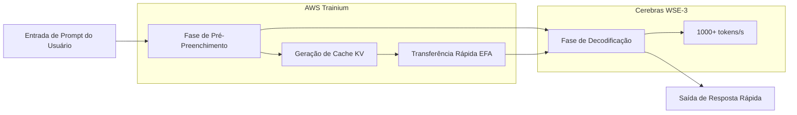

### Cerebras×OpenAI: A Diversificação da Infraestrutura de IA e o Fim da Dominação da GPU

### Resumo
OpenAI adota chip WSE-3 da Cerebras para inferência ultrarrápida (>1000 tokens/s). Contrato de US$ 10 bilhões desafia a hegemonia da NVIDIA, reescrevendo o cenário da infraestrutura de IA.

## Cerebras×OpenAI: A Diversificação da Infraestrutura de IA e o Fim da Dominação da GPU

### O Início de 2026: Um Ponto de Virada na Infraestrutura de IA

O início de 2026 será lembrado como um ponto de virada na história da infraestrutura de IA. A OpenAI assinou um contrato de mais de US$ 10 bilhões com a Cerebras, marcando a primeira implantação em larga escala de aceleradores de inferência fora dos ecossistemas da NVIDIA em ambientes de produção. O destaque é o "GPT-5.3-Codex-Spark" - um modelo especializado em codificação que opera a velocidades superiores a 1.000 tokens por segundo.

Este movimento não é apenas uma mudança de fornecedor. Ele introduz uma concorrência fundamental contra o domínio de longa data da NVIDIA no mercado de hardware de IA. Este artigo detalha os aspectos técnicos da arquitetura Cerebras WSE-3, o contexto por trás do acordo com a OpenAI e o impacto na indústria da diversificação da infraestrutura de IA.

## Cerebras WSE-3: Inovação em Motores de Escala de Wafer

### Diferenças Fundamentais em Relação à Arquitetura de GPU Tradicional

A maioria das GPUs que sustentam a inferência de IA moderna adota uma arquitetura onde o wafer de silício é cortado em chips individuais (dicing) e múltiplos chips são conectados em rede para processamento paralelo. Exemplos típicos são o H100 e o B200 da NVIDIA, que escalam conectando múltiplos chips através de interconexões de alta velocidade como NVLink.

A abordagem da Cerebras subverte essa norma. O WSE (Wafer Scale Engine) opera com todo o wafer como um único chip gigante. Como não há corte físico, a sobrecarga de comunicação inter-chip é inerentemente inexistente.

### Principais Especificações do WSE-3

O WSE-3 é fabricado no processo de 5nm da TSMC e ostenta as seguintes especificações:

| Item de Especificação | WSE-3 | NVIDIA H100 | Fator de Ampliação |
|:----------------------|:------|:------------|:-------------------|
| Número de Transistores | 4 trilhões | ~80 bilhões | ~50x |
| Número de Núcleos de IA | 900.000 núcleos | 17.408 núcleos | ~52x |
| SRAM On-Chip | 44 GB | 50 MB | ~880x |
| Largura de Banda da Memória | 21 PB/s | 3,35 TB/s | ~7.000x |
| Área do Chip | 46.255 mm² | 814 mm² | ~57x |
| Desempenho de Pico de Computação | 125 PFLOPS | 3,958 PFLOPS | ~32x |

Notavelmente, a capacidade da SRAM on-chip é impressionante. Os 44 GB do WSE-3 equivalem a 880 vezes mais do que o H100. A largura de banda da memória é frequentemente um gargalo na inferência de IA, e ter uma grande quantidade de memória on-chip minimiza o acesso à memória externa. Este é o fator fundamental por trás da inferência de alta velocidade.

### Velocidade de Inferência Alcançada pela Escala de Wafer

Os 900.000 núcleos do WSE-3 são todos conectados uniformemente em uma topologia de malha 2D. Essa arquitetura acelera drasticamente a fase de "decodificação" na geração de tokens.

Quando um cluster de GPU tradicional realiza inferência de IA, os pesos do modelo precisam ser transferidos entre múltiplas GPUs. No WSE-3, todos os pesos são implantados na SRAM on-chip, eliminando a necessidade de acesso à memória externa e permitindo um alto throughput de milhares de tokens/segundo.

## O Contrato de US$ 10 Bilhões entre OpenAI e Cerebras

### Visão Geral do Contrato

Em janeiro de 2026, OpenAI e Cerebras assinaram um contrato plurianual para fornecer 750 megawatts de recursos computacionais até 2028. O valor total do contrato, superior a US$ 10 bilhões, é um acordo transformador para a escala de negócios da Cerebras.

Segundo o CEO da Cerebras, Andrew Feldman, a negociação começou em agosto do ano anterior, quando a Cerebras demonstrou a execução eficiente de modelos de código aberto da OpenAI em seus chips, superando o desempenho das GPUs. Essa demonstração tecnológica abriu caminho para o grande contrato.

Para a OpenAI, este contrato é central para sua estratégia de diversificação de fornecedores. Embora mantenha seus pedidos existentes para NVIDIA, AMD e Broadcom, a OpenAI adicionou um fornecimento de computação dedicado à inferência de US$ 10 bilhões com a Cerebras. Isso reflete uma decisão estratégica de "diversificar os riscos da infraestrutura de IA".

### GPT-5.3-Codex-Spark: O Primeiro Resultado de Produção

Em fevereiro de 2026, a OpenAI lançou o "GPT-5.3-Codex-Spark" como o primeiro resultado dessa parceria. Projetado como uma versão leve do GPT-5.3-Codex, este modelo é otimizado para codificação em tempo real e possui as seguintes características:

*   **Velocidade de Inferência**: Mais de 1.000 tokens/segundo (aproximadamente 15x mais rápido que o GPT-5.3-Codex)
*   **Janela de Contexto**: 128k (apenas texto)
*   **Ambientes Suportados**: ChatGPT Pro, aplicativo Codex, CLI, extensão VS Code
*   **Forma de Fornecimento**: Prévia de pesquisa (implantação em fases)

Embora o número de 1.000 tokens por segundo possa ser difícil de entender intuitivamente, quando comparado com o GPT-5.3-Codex operando a 65-70 tokens/segundo, significa que a IA pode completar e gerar código mais rápido do que um desenvolvedor pode digitar. Essa é uma velocidade que muda fundamentalmente a "interatividade" da codificação.

### Por que a Codificação é o Primeiro Caso de Uso?

A escolha da codificação (codificação baseada em agente) como a primeira área de aplicação dos chips da Cerebras pela OpenAI é estrategicamente sensata.

A produtividade de um assistente de codificação depende fortemente da velocidade de resposta. Quando um desenvolvedor recebe sugestões em tempo real enquanto codifica, mesmo um atraso de centenas de milissegundos pode interromper o fluxo de concentração. Essa importância da velocidade aumenta ainda mais em fluxos de trabalho agenciados onde um agente de IA executa testes, corrige bugs e refatora código.

A inferência ultrarrápida oferecida pelos chips de escala de wafer da Cerebras traz o valor mais direto para esta área, tornando-a o primeiro caso de uso escolhido.

## O Contexto Estrutural do Colapso do Domínio da NVIDIA

### O Domínio da NVIDIA na Infraestrutura de IA

Nos últimos cinco anos, o mercado de treinamento e inferência de IA tem sido quase exclusivamente dominado pela NVIDIA. As GPUs, lideradas pelo H100 e A100, tornaram-se a infraestrutura padrão para todos os principais provedores de nuvem e grandes laboratórios de IA, e o forte lock-in no ecossistema CUDA dificultou a entrada de concorrentes.

Essa posição de domínio representou uma restrição para a OpenAI também. A dependência de um único fornecedor acarreta os seguintes riscos:

*   **Perda de Poder de Negociação de Preços**: A NVIDIA detém uma vantagem significativa na definição de preços.
*   **Gargalos de Fornecimento**: A escassez de GPUs restringe a expansão dos serviços de IA.
*   **Ponto Único de Falha**: Problemas de fabricação ou fornecimento da NVIDIA tornam-se riscos de negócios diretos.

### A Estratégia de Diversificação da OpenAI

A OpenAI começou a diversificar seus fornecedores em larga escala a partir de 2025. Mantendo seus contratos existentes com a NVIDIA, eles expandiram seus pedidos para AMD, Broadcom e Cerebras. O contrato de US$ 10 bilhões com a Cerebras é um investimento estratégico focado em cargas de trabalho de inferência.

O ponto notável é que a adoção dos chips da Cerebras é focada na "aceleração da inferência", não em "computação de propósito geral". A Deloitte prevê que a inferência representará cerca de dois terços de toda a computação de IA em 2026 (em 2025, era cerca de 50%), e a demanda por aceleradores de inferência deve aumentar ainda mais.

### A Parceria AWS e Cerebras: Propagação para a Nuvem

Aproximadamente dois meses após o contrato com a OpenAI, em 13 de março de 2026, a AWS e a Cerebras anunciaram uma parceria significativa. A implantação da "Arquitetura de Inferência Desagregada" com a introdução de chips WSE-3 no AWS Bedrock.

Tecnicamente, é uma configuração híbrida onde o processador Trainium da AWS lida com a fase de pré-preenchimento (processamento de prompt), e o CS-3 da Cerebras lida com a fase de decodificação (geração de saída). Essa divisão de trabalho permite obter uma capacidade de token 5 vezes maior com a mesma pegada de hardware.

A ideia da arquitetura de "inferência desagregada" aproveita as diferenças nas características computacionais de cada fase. O pré-preenchimento é atribuído a GPUs adequadas para processamento paralelo, enquanto a decodificação é atribuída ao WSE-3 com sua grande memória on-chip, maximizando o throughput geral.

## Estratégia Corporativa e IPO da Cerebras

### Crescimento para uma Avaliação de US$ 2,2 Bilhões

A Cerebras, com uma avaliação de US$ 8 bilhões em 2024, viu sua avaliação atingir mais de US$ 22 bilhões no início de 2026, impulsionada pelo contrato com a OpenAI e a aquisição de vários outros clientes importantes (IBM, Departamento de Energia dos EUA, etc.). As vendas projetadas para 2025 excederam US$ 1 bilhão, marcando sua transição de uma startup em fase de pesquisa para uma empresa de infraestrutura com receita real.

### Plano de IPO e seu Histórico

A Cerebras solicitou seu IPO no final de 2025, mas foi forçada a retirar o pedido devido à revisão do CFIUS (Comitê de Investimento Estrangeiro nos EUA) relacionada à sua relação de capital com a G42 de Abu Dhabi. Posteriormente, após a G42 ser removida da lista de investidores e obter a aprovação do CFIUS, eles planejaram uma nova solicitação com meta para o Q2 de 2026.

Os grandes contratos com OpenAI e AWS servem como um histórico impressionante para o desempenho de negócios antes do IPO.

## O Futuro Indicado pela Multipolação da Infraestrutura de IA

### O Início da Competição de "Inferência Mais Rápida"

O lançamento do GPT-5.3-Codex-Spark introduziu um novo eixo de competição na indústria de IA. "Velocidade" emergiu como um fator de diferenciação, além da "inteligência" do modelo.

Se a vantagem de velocidade de 20x da Cerebras (em comparação com GPUs NVIDIA) for comprovada, os provedores de serviços de IA entrarão na era de selecionar hardware com base na aplicação.

*   **Tarefas que exigem alta precisão**: GPUs tradicionais (NVIDIA H100/B200, etc.)
*   **Tarefas que exigem latência ultrabaixa**: Cerebras WSE-3
*   **Tarefas com prioridade máxima de custo**: AMD MI300X, ASICs personalizados, etc.

### Impacto na NVIDIA

Embora o domínio de mercado da NVIDIA não esteja em risco iminente, uma mudança importante está ocorrendo. No mercado de inferência, a NVIDIA está enfrentando sua primeira rodada de concorrência real contra rivais fortes.

Particularmente notável é o movimento em direção à "construção de ecossistemas" demonstrado pela combinação OpenAI-AWS-Cerebras. Assim como CUDA tem sido o motivo prático para a escolha de GPUs por anos, um novo ecossistema focado em inferência está sendo formado.

### Transformação da Experiência do Desenvolvedor

A mudança trazida pela inferência ultrarrápida não se limita a melhorias nos indicadores de desempenho. Há relatos de que, na Spotify, os engenheiros de melhor desempenho "pararam de escrever código" devido à disseminação de ferramentas de codificação de IA desde dezembro de 2025. Ferramentas de codificação de IA ultrarrápidas como Claude Code e GPT-5.3-Codex-Spark acelerarão ainda mais essa transformação.

A velocidade de inferência de 1.000 tokens por segundo pode ser um limiar que muda fundamentalmente o estilo de colaboração entre desenvolvedores e IA. Se a complementação de pensamento em tempo real, revisão de código instantânea e sugestões de depuração em tempo real forem fornecidas sem tempo de espera, a produtividade do desenvolvimento de software aumentará exponencialmente.

## Conclusão

A parceria entre Cerebras WSE-3 e OpenAI trouxe três transições importantes para a infraestrutura de inferência de IA.

Primeiro, como uma transição tecnológica, a arquitetura de escala de wafer estabeleceu um novo padrão de desempenho de "1.000 tokens por segundo". Segundo, como uma transição estrutural industrial, a mudança do domínio de um único ponto (NVIDIA) para a multipolação começou em larga escala. Terceiro, como uma transição de eixo de competição, a "velocidade" de inferência, juntamente com a "inteligência" do modelo, foi estabelecida como um principal fator de diferenciação.

A "arquitetura de inferência desagregada" demonstrada na parceria com a AWS sugere uma disseminação ainda maior. Se a inferência de alta velocidade estiver disponível para usuários de nuvem comuns através do Amazon Bedrock ainda em 2026, a inferência de alta velocidade passará de um privilégio de laboratórios grandes e isolados para um componente de serviços de IA padrão.

As barreiras do ecossistema que a NVIDIA construiu ao longo de anos são altas. No entanto, quando um contrato de US$ 10 bilhões, uma parceria estratégica com a AWS e uma vantagem de velocidade de 15x que os desenvolvedores podem experimentar se combinam, o mapa competitivo da infraestrutura de IA está inegavelmente sendo reescrito.

---

---

> Este artigo foi gerado automaticamente por LLM. Pode conter erros.
