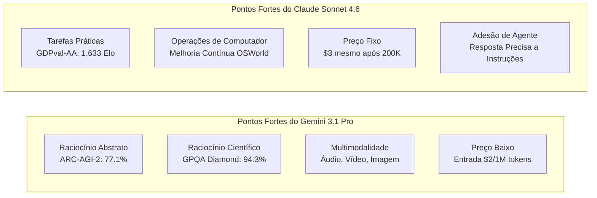

### O Contexto do Lançamento: A Corrida Competitiva

Na terceira semana de fevereiro de 2026, dois modelos notáveis surgiram quase simultaneamente na indústria de IA. O **Claude Sonnet 4.6**, lançado pela Anthropic em 17 de fevereiro, e o **Gemini 3.1 Pro**, divulgado pelo Google DeepMind em 19 de fevereiro. Ambos se autodenominam "modelos de fronteira de ponta", prometendo janelas de contexto de um milhão de tokens e aprimoramentos significativos na capacidade de raciocínio geral.

O surgimento simultâneo desses dois modelos não é coincidência. À medida que o eixo da competição em LLMs muda de "melhor desempenho em tarefas únicas" para "uso como agente, processamento de contexto longo e eficiência de custos", ambos visam o mesmo público-alvo: desenvolvedores corporativos e construtores de agentes de IA. Este artigo organiza as especificações, dados de benchmark e diferenças nas características práticas de ambos os modelos e oferece diretrizes para que os desenvolvedores façam a escolha ideal.

## Contexto do Lançamento: O Cenário da Competição

### A Estratégia da Anthropic

O lançamento do Claude Sonnet 4.6 impressiona pela velocidade, ocorrendo apenas 12 dias após o Claude Opus 4.6 em 5 de fevereiro do mesmo ano. A Anthropic posicionou a linha "Sonnet", conhecida por sua eficiência de custos, como o modelo padrão para todos os usuários, disponibilizando-o para todas as camadas, incluindo o plano gratuito. A estratégia é aumentar drasticamente o desempenho, mantendo o mesmo preço do Sonnet 4.5: \$3 de entrada / \$15 de saída (por milhão de tokens).

Um ponto notável é a avaliação no Claude Code. Dados internos revelam que os desenvolvedores preferiram o Sonnet 4.6 em 70% dos casos, e mesmo em comparação com o Opus 4.6, o Sonnet foi escolhido em 59% dos casos. O posicionamento de "Sonnet superando Opus" em termos de relação preço-desempenho funciona de forma eficaz para atrair ambientes de produção sensíveis ao custo de uso da API.

Simultaneamente, a Anthropic anunciou uma parceria com a Infosys (uma grande empresa de TI indiana) em 17 de fevereiro. O objetivo é integrar os modelos Claude na plataforma Topaz AI e automatizar fluxos de trabalho complexos de negócios em setores como bancos, telecomunicações e manufatura, o que também sinaliza uma aceleração na implantação empresarial.

### A Estratégia do Google DeepMind

O Google DeepMind anunciou que o Gemini 3.1 Pro alcançou "pontuações recordes" em vários benchmarks. Notavelmente, 77,1% no ARC-AGI-2 (um benchmark de raciocínio abstrato) representa uma melhoria saltadora de aproximadamente o dobro em relação à geração anterior, Gemini 3 Pro. Comparado com o Claude Opus 4.6 (68,8%) e o GPT-5.2 (52,9%) do mesmo período, demonstra uma liderança clara no ARC-AGI-2.

Além disso, a empresa lançou uma ofensiva em termos de preços. Para uso geral com menos de 200K tokens, o preço é de \$2 de entrada / \$12 de saída (por milhão de tokens), o que é 33-35% mais barato que o Sonnet 4.6. A postura de afirmar vantagem em ambos os aspectos - "inteligência x eficiência de custos" - está clara.

Além disso, o fato de a janela de contexto de 1 milhão de tokens estar imediatamente disponível em ambientes de produção sem necessidade de lista de espera é um diferencial. Em contraste com o 1 milhão de tokens do Sonnet 4.6 que está em beta e sendo fornecido gradualmente, o Gemini oferece uma vantagem para desenvolvedores que desejam começar imediatamente a analisar grandes bases de código ou repositórios com vários arquivos.

## Comparação de Especificações

Vamos organizar as especificações básicas de ambos os modelos.

| Item | Claude Sonnet 4.6 | Gemini 3.1 Pro |
|:-----|:-----------------|:--------------|
| Data de Lançamento | 17 de fevereiro de 2026 | 19 de fevereiro de 2026 |
| Comprimento do Contexto | 200K (1M em beta) | 1M (padrão) |
| Preço de Entrada (1M tokens) | \$3.00 | \$2.00 (≤200K) / \$4.00 (acima) |
| Preço de Saída (1M tokens) | \$15.00 | \$12.00 (≤200K) / \$18.00 (acima) |
| Suporte Multimodal | Texto, Imagem | Texto, Imagem, Áudio, Vídeo |
| Tokens Máximos de Saída | 64K | 64K |
| Formas de Fornecimento | API, Claude.ai, Claude Code | API, Gemini.google.com, Vertex AI |

Um adendo sobre os preços. O Gemini 3.1 Pro é mais barato para menos de 200K tokens, mas o preço sobe para \$4/\$18 quando excede esse limite. Como o Sonnet 4.6 tem um preço fixo de \$3/\$15 sem variação, em cargas de trabalho que usam muito contexto longo, o Sonnet pode ser mais fácil de prever os custos. É importante entender a distribuição do comprimento do contexto durante a fase de estimativa de custos de processamento em lote.

## Comparação Detalhada de Benchmarks

### Números Principais de Benchmarks

```
Comparação de Benchmarks (Dados públicos em fevereiro de 2026)

ARC-AGI-2 (Raciocínio Abstrato)
  Gemini 3.1 Pro  : 77.1%  ← Claude Opus 4.6 (68.8%), GPT-5.2 (52.9%)
  Claude Sonnet 4.6: 58.3%
  Diferença: +18.8pt (Vantagem Gemini)

GPQA Diamond (Ciência Nível Pós-Graduação)
  Gemini 3.1 Pro  : 94.3%  ← Pontuação mais alta da indústria
  Claude Sonnet 4.6: 74.1%
  Diferença: +20.2pt (Vantagem Gemini)

SWE-Bench Pro (Engenharia de Software)
  Gemini 3.1 Pro  : 54.2%
  Claude Sonnet 4.6: 42.7%
  Diferença: +11.5pt (Vantagem Gemini)

SWE-Bench Verified (Benchmark Oficial Gemini)
  Gemini 3.1 Pro  : 80.6%

Terminal-Bench 2.0 (Operação de Terminal)
  Gemini 3.1 Pro  : 68.5%

GDPval-AA Elo (Tarefas de Valor Econômico)
  Claude Sonnet 4.6: 1,633 Elo  ← Nível que supera até Opus 4.6
  Gemini 3.1 Pro  : 1,317 Elo
  Diferença: +316pt (Vantagem Sonnet)

MMMLU (Compreensão Multilíngue)
  Gemini 3.1 Pro  : 92.6%

Precisão de Contexto Longo (com 128K tokens)
  Gemini 3.1 Pro  : 84.9%
```

Analisando os números, o Gemini 3.1 Pro supera consistentemente em "benchmarks de raciocínio puro". Por outro lado, GDPval-AA mede a classificação Elo de "tarefas práticas que geram valor econômico", como criação de documentos de negócios, modelagem financeira e pesquisa acadêmica. Aqui, o Sonnet 4.6 tem uma vantagem esmagadora de 1.633 pontos. A estrutura em que o "campeão de benchmark" e o "campeão prático" são diferentes ilustra o contraste nas características de ambos os modelos.

### Como Ler os Benchmarks

**GPQA Diamond (Graduate-Level Google-Proof Q&A)** é um conjunto de problemas de nível universitário em ciências exatas, que mede a capacidade de resolver problemas difíceis em física, química e biologia. Uma pontuação de 94,3% é a pontuação mais alta da indústria, aproximando-se da capacidade de "resolver problemas em um nível comparável ao de um biólogo, químico ou físico".

**ARC-AGI-2** é um benchmark projetado por pesquisadores de IA para "medir o raciocínio abstrato genuíno que não pode ser resolvido por memorização". Ele testa a capacidade de abstrair regras completamente novas a partir de poucos exemplos. Uma pontuação de 77,1% aqui é um nível notável na indústria como um todo, registrando um feito em meio a 68,8% do Claude Opus 4.6 e 52,9% do GPT-5.2 no mesmo período.

Por outro lado, **GDPval-AA** é uma avaliação abrangente de "tarefas práticas que geram valor econômico", composta por um conjunto de problemas semelhantes a tarefas de negócios reais, como redação de relatórios, análise financeira e planejamento de projetos. O Elo de 1.633 do Sonnet 4.6, que se diz superar até mesmo o Opus 4.6, demonstra a superioridade do Sonnet em usabilidade para gerar "resultados utilizáveis".

## Diferenças Práticas de Características

### Suporte à Codificação

Embora os números indiquem vantagem para o Gemini em tarefas de codificação, a avaliação subjetiva dos desenvolvedores mostra uma tendência diferente. O Sonnet 4.6 é altamente avaliado por sua "adesão a instruções com nuances" e "revisão de código em etapas", superando na especificação do formato de revisão de código e na conformidade com convenções de codificação personalizadas.

A diferença nos scores SWE-Bench se deve a muitos cenários onde agentes manipulam arquivos autonomamente e realizam refatorações em larga escala. Para usos do tipo pair programming, onde humanos dão instruções detalhadas, a capacidade de acompanhamento do Sonnet se torna uma vantagem.

```python
# Exemplo de agente usando Claude Sonnet 4.6
import anthropic

client = anthropic.Anthropic()

# Analisa toda a base de código com suporte a 1 milhão de tokens
with open("large_codebase.txt", "r") as f:
    codebase_content = f.read()

message = client.messages.create(
    model="claude-sonnet-4-6-20260217",
    max_tokens=8192,
    messages=[
        {
            "role": "user",
            "content": (
                "Analise a seguinte base de código e liste as vulnerabilidades de segurança:\n\n"
                + codebase_content
            )
        }
    ]
)
print(message.content[0].text)
```

### Processamento de Contexto Longo e Multimodalidade

O Gemini 3.1 Pro registrou uma precisão de 84,9% no benchmark de contexto longo em 128K tokens, lidando com contextos compostos que incluem PDFs longos, transcrições de áudio e transcrições de vídeo. O suporte nativo a áudio e vídeo é um diferencial em relação ao Sonnet 4.6 neste momento.

O Sonnet 4.6 oferece funcionalidade de "Uso de Computador" (Computer Use) em nível prático, e sua afinidade com o ecossistema Anthropic é alta em fluxos de trabalho de agentes que incluem operações de navegador e aplicativos GUI. Melhorias contínuas também são relatadas no benchmark OSWorld, fornecendo um histórico de desempenho estável na construção de pipelines de automação.

### Diferença Esmagadora em Tarefas de Conhecimento

A diferença nos números do GDPval-AA (316 pontos Elo) não pode ser ignorada. Em tarefas como resumir relatórios financeiros, criar atas de reuniões e gerar relatórios de análise cruzada de múltiplos documentos, onde "o conhecimento é organizado e transformado em resultados práticos", o Sonnet 4.6 tem uma vantagem clara. Isso pode ser um reflexo da orientação de design da Anthropic, que fortaleceu o "entendimento de contexto e o planejamento de agentes".

## Diferenças na Filosofia de Design da Arquitetura

Ao analisar as informações publicadas, algumas contraposições surgem das diferenças nas filosofias de design de ambos os modelos.

O Gemini 3.1 Pro tem um caráter mais de "motor de raciocínio geral escalável". Sua arquitetura parece direcionada a processar de forma unificada todas as modalidades de entrada, incluindo áudio, vídeo e repositórios de código, visando o desempenho máximo em tarefas de raciocínio puro como o ARC-AGI-2. O model card do Google DeepMind descreve detalhadamente a avaliação de segurança com base na estrutura "frontier safety", mostrando uma postura de design voltada para a implantação em escala global.

O Claude Sonnet 4.6 prioriza a conclusão de um "agente de execução confiável". A combinação de operações de computador, raciocínio de contexto longo e planejamento de agentes reflete uma seleção de recursos voltada para a adaptação a fluxos de trabalho semi-autônomos que envolvem intervenção humana. O acúmulo de experiência na automação de fluxos de trabalho complexos em bancos, telecomunicações e manufatura com a parceria empresarial com a Infosys está alinhado com a estratégia de negócios da Anthropic.



## Tendências de LLMs em 2026 Indicadas pela Competição

O surgimento simultâneo do Claude Sonnet 4.6 e Gemini 3.1 Pro serve como um bom ponto de observação do estado atual da competição em LLMs.

**Processamento de Contexto Longo como "Pré-requisito"**: Ambos os modelos oferecem contexto de um milhão de tokens por padrão ou em beta, o que está se tornando um pré-requisito em vez de um diferencial. Com 1 milhão de tokens, é possível inserir a base de código completa de um projeto, documentos relacionados e relatórios de bugs anteriores de uma vez.

**Aceleração da Otimização para Agentes**: O uso de ferramentas para agentes, operações de computador e raciocínio em várias etapas são áreas comuns de foco para ambos. À medida que os MCPs (Modelos de Compreensão de Linguagem) se popularizam, qual modelo se tornará o padrão como tempo de execução de agente também é um eixo de competição.

**Aprimoramento da Competição de Benchmarks**: A transição de taxas de acerto em problemas únicos para métricas que medem "raciocínio não memorizável" como ARC-AGI-2 ou "valor econômico" como GDPval-AA está ocorrendo. A mudança é de "respostas precisas" para "resultados utilizáveis".

**Continuidade da Competição de Preços**: O preço de entrada de \$2/1M do Gemini é inferior a um décimo do preço da classe GPT-4 em 2023. Enquanto a competição acelera a democratização dos modelos, a pressão pela monetização também aumenta.

## Diretrizes de Uso para Desenvolvedores

A escolha dependerá de "natureza da tarefa", "distribuição do comprimento do contexto" e "integração com o stack existente".

| Casos de Uso | Modelo Recomendado | Razão |
|:-----------|:---------|:----|
| Raciocínio Científico, Provas Matemáticas | Gemini 3.1 Pro | GPQA Diamond 94.3%, ARC-AGI-2 77.1% |
| Redação de Relatórios, Análise Financeira | Claude Sonnet 4.6 | Mais forte em tarefas práticas com GDPval-AA 1,633 Elo |
| Análise de Grandes Bases de Código (1M imediato) | Gemini 3.1 Pro | 1M disponível imediatamente em produção sem lista de espera |
| Agentes de Operação de Computador | Claude Sonnet 4.6 | Computer Use, Melhoria Contínua OSWorld |
| Multimodalidade incluindo Áudio e Vídeo | Gemini 3.1 Pro | Suporte Nativo (Sonnet não suporta) |
| Integração com Google Workspace | Gemini 3.1 Pro | Integração Nativa |
| Uso Frequente de Prompts Longos (>200K) | Claude Sonnet 4.6 | Sem Variação de Custo Após Exceder (fixo em \$3) |
| Foco em Prompts de Comprimento Médio (≤200K) | Gemini 3.1 Pro | 33% mais barato com entrada de \$2 |

Não é possível afirmar quem "venceu". Essa é a resposta honesta da atual competição de LLMs. Os desenvolvedores são solicitados a avaliar com base em requisitos de tarefas específicas, estrutura de custos e dificuldade de integração com o stack existente, considerando cada caso de uso concreto.

## Referências

| Título | Fonte | Data | URL |
|:---------|:-------|:-----|:----|
| Claude Sonnet 4.6 Release Announcement | Anthropic | 2026/02/17 | https://www.anthropic.com/news/claude-sonnet-4-6 |
| Gemini 3.1 Pro Release Announcement | Google Blog | 2026/02/19 | https://blog.google/innovation-and-ai/models-and-research/gemini-models/gemini-3-1-pro/ |
| Gemini 3.1 Pro Model Card | Google DeepMind | 2026/02/19 | https://deepmind.google/models/model-cards/gemini-3-1-pro/ |
| Deep Comparison of Gemini 3.1 Pro and Claude Sonnet 4.6 | Apiyi.com Blog | 2026/03 | https://help.apiyi.com/en/gemini-3-1-pro-vs-claude-sonnet-4-6-comparison-en.html |
| Gemini 3.1 Pro vs Sonnet 4.6 vs Opus 4.6 vs GPT-5.2 (2026) | AceCloud AI | 2026/03 | https://acecloud.ai/blog/gemini-3-1-pro-vs-sonnet-4-6-vs-opus-4-6-vs-gpt-5-2/ |
| Gemini 3.1 Pro Complete Guide 2026: Benchmarks, Pricing, API | NxCode | 2026/02 | https://www.nxcode.io/en/resources/news/gemini-3-1-pro-complete-guide-benchmarks-pricing-api-2026 |
| Gemini 3.1 Pro Leads Most Benchmarks But Trails Claude Opus 4.6 in Some Tasks | Trending Topics EU | 2026/02 | https://www.trendingtopics.eu/gemini-3-1-pro-leads-most-benchmarks-but-trails-claude-opus-4-6-in-some-tasks/ |
| Gemini 3.1 Pro vs Claude Sonnet 4.6: 2026 Comparison, Benchmarks | AI.cc | 2026/02 | https://www.ai.cc/blogs/gemini-3-1-pro-vs-claude-sonnet-4-6-2026-comparison-benchmarks/ |
| Infosys × Anthropic Enterprise AI Agent Partnership | TechCrunch | 2026/02/17 | https://techcrunch.com/2026/02/17/as-ai-jitters-rattle-it-stocks-infosys-partners-with-anthropic-to-build-enterprise-grade-ai-agents/ |
| AI Weekly Digest, 3rd Week of February 2026 | Synapse AI Digest | 2026/02/21 | https://armes.ai/blog/frontier-model-explosion-february-2026 |

---

> Este artigo foi gerado automaticamente por LLM. Pode conter erros.
