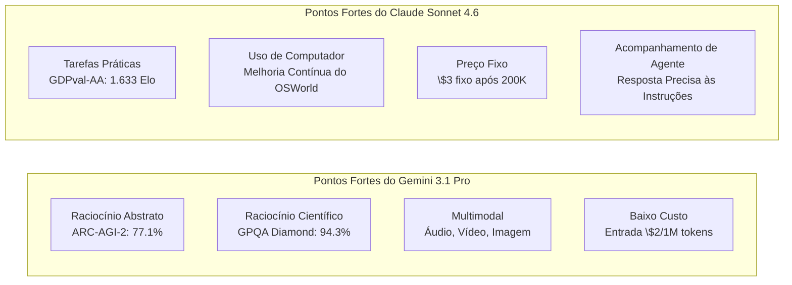

Na terceira semana de fevereiro de 2026, dois modelos notáveis surgiram quase simultaneamente na indústria de IA. **Claude Sonnet 4.6**, lançado pela Anthropic em 17 de fevereiro, e **Gemini 3.1 Pro**, divulgado pelo Google DeepMind em 19 de fevereiro. Ambos se autodenominam "modelos de ponta de fronteira" e anunciaram uma janela de contexto de 1 milhão de tokens e um aprimoramento significativo na capacidade de raciocínio geral.

A coincidência no lançamento desses dois modelos não é acidental. À medida que o eixo da competição de LLMs se desloca de "melhor desempenho em tarefas únicas" para "uso de agentes, processamento de contexto longo e eficiência de custo", ambos os modelos visam o mesmo público-alvo: desenvolvedores corporativos e construtores de agentes de IA. Este artigo organiza as especificações, números de benchmark e diferenças de características práticas de ambos os modelos, fornecendo diretrizes para os desenvolvedores fazerem a escolha ideal.

## Contexto de Lançamento: O Contexto da Competição

### A Estratégia da Anthropic

O lançamento do Claude Sonnet 4.6, apenas 12 dias após o Claude Opus 4.6 em 5 de fevereiro do mesmo ano, impressiona pela velocidade. A Anthropic posicionou a linha "Sonnet", que se destaca pela eficiência de custo, como o modelo padrão para todos os usuários, expandindo-a para todas as camadas, incluindo o plano gratuito. A estratégia é manter o preço do Sonnet 4.5 de entrada \$3/saída \$15 (por 1 milhão de tokens), ao mesmo tempo em que melhora significativamente o desempenho.

O que chama a atenção é a avaliação no Claude Code. Dados internos revelaram que os desenvolvedores preferiram o Sonnet 4.6 em 70% das vezes, e mesmo em comparação com o Opus 4.6, o Sonnet foi escolhido em 59% dos casos. O posicionamento de "Sonnet superando Opus" em termos de relação custo-desempenho está funcionando efetivamente para atrair ambientes de produção sensíveis ao custo da API.

Simultaneamente, a Anthropic também anunciou uma parceria com a Infosys (uma grande empresa de TI indiana) em 17 de fevereiro. O objetivo é integrar os modelos Claude à plataforma Topaz AI para automatizar fluxos de trabalho complexos em setores como bancos, telecomunicações e manufatura, sinalizando uma aceleração na implantação corporativa.

### A Estratégia do Google DeepMind

O Google DeepMind anunciou que o Gemini 3.1 Pro alcançou "o melhor score da história" em vários benchmarks. Notavelmente, 77,1% no ARC-AGI-2 (benchmark de raciocínio abstrato) representa um salto significativo em relação ao dobro do desempenho da geração anterior, Gemini 3 Pro. Em comparação com o Claude Opus 4.6 (68,8%) e o GPT-5.2 (52,9%), que competiram no mesmo período, o Gemini demonstra uma liderança clara no ARC-AGI-2.

Além disso, eles fizeram uma ofensiva em termos de preço. Para uso geral abaixo de 200K tokens, o preço foi definido em entrada \$2/saída \$12 (por 1 milhão de tokens), 33-35% mais barato que o Sonnet 4.6. A postura de afirmar vantagem em ambos os aspectos, "inteligência × eficiência de custo", é clara.

Além disso, a disponibilidade imediata da janela de contexto de 1 milhão de tokens em ambientes de produção sem necessidade de lista de espera é um diferencial. Em contraste com o 1 milhão de tokens do Sonnet 4.6, que ainda está em beta e sendo fornecido gradualmente, o Gemini oferece uma vantagem para desenvolvedores que desejam começar imediatamente a analisar grandes bases de código ou repositórios com múltiplos arquivos.

## Comparação de Especificações

Vamos organizar as especificações básicas de ambos os modelos.

| Item | Claude Sonnet 4.6 | Gemini 3.1 Pro |
|:-----|:-----------------|:--------------|
| Data de Lançamento | 17 de fevereiro de 2026 | 19 de fevereiro de 2026 |
| Comprimento do Contexto | 200K (1M em beta) | 1M (padrão) |
| Preço de Entrada (1 milhão de tokens) | \$3.00 | \$2.00 (≤200K) / \$4.00 (excedente) |
| Preço de Saída (1 milhão de tokens) | \$15.00 | \$12.00 (≤200K) / \$18.00 (excedente) |
| Suporte Multimodal | Texto, Imagem | Texto, Imagem, Áudio, Vídeo |
| Tokens Máximos de Saída | 64K | 64K |
| Formato de Fornecimento | API, Claude.ai, Claude Code | API, Gemini.google.com, Vertex AI |

Observações adicionais sobre preços. O Gemini 3.1 Pro é mais barato para até 200K tokens, mas aumenta para \$4/\$18 quando excedido. O Sonnet 4.6 tem um preço fixo de \$3/\$15, sem variação, então em cargas de trabalho que usam extensivamente contexto longo, o Sonnet pode ser mais previsível em termos de custo. É importante entender a distribuição do comprimento do contexto durante a estimativa de custo do processamento em lote.

## Comparação Detalhada de Benchmarks

### Números Principais de Benchmark

```
Comparação de Benchmarks (dados públicos de fevereiro de 2026)

ARC-AGI-2 (Raciocínio Abstrato)
  Gemini 3.1 Pro  : 77.1%  ← Claude Opus 4.6 (68.8%), GPT-5.2 (52.9%)
  Claude Sonnet 4.6: 58.3%
  Diferença: +18.8pt (Vantagem Gemini)

GPQA Diamond (Ciência em Nível de Pós-Graduação)
  Gemini 3.1 Pro  : 94.3%  ← Melhor score da indústria
  Claude Sonnet 4.6: 74.1%
  Diferença: +20.2pt (Vantagem Gemini)

SWE-Bench Pro (Engenharia de Software)
  Gemini 3.1 Pro  : 54.2%
  Claude Sonnet 4.6: 42.7%
  Diferença: +11.5pt (Vantagem Gemini)

SWE-Bench Verified (Benchmark Oficial Gemini)
  Gemini 3.1 Pro  : 80.6%

Terminal-Bench 2.0 (Operação de Terminal)
  Gemini 3.1 Pro  : 68.5%

GDPval-AA Elo (Tarefas de Valor Econômico)
  Claude Sonnet 4.6: 1,633 Elo  ← Nível que supera até mesmo o Opus 4.6
  Gemini 3.1 Pro  : 1,317 Elo
  Diferença: +316pt (Vantagem Sonnet)

MMMLU (Compreensão Multilíngue)
  Gemini 3.1 Pro  : 92.6%

Precisão de Contexto Longo (em 128K tokens)
  Gemini 3.1 Pro  : 84.9%
```

Observando os números, o Gemini 3.1 Pro consistentemente supera em "benchmarks de raciocínio" puros. Por outro lado, o GDPval-AA mede o rating Elo de "tarefas práticas que geram valor econômico", como criação de documentos comerciais, modelagem financeira e pesquisa acadêmica, e aqui o Sonnet 4.6 tem uma vantagem esmagadora. O cenário onde "o rei dos benchmarks" e "o rei das práticas" são diferentes demonstra claramente a diferença de características entre os dois modelos.

### Interpretação dos Benchmarks

**GPQA Diamond (Graduate-Level Google-Proof Q&A)** é um conjunto de problemas de nível de pós-graduação, medindo a capacidade de resolver problemas difíceis de física, química e biologia. Um score de 94,3% é o melhor da indústria e representa um feito próximo de "resolver problemas em um nível comparável ao de biólogos, químicos e físicos".

**ARC-AGI-2** é um benchmark projetado por pesquisadores de IA para "medir o raciocínio abstrato genuíno que não pode ser resolvido apenas por memorização". Ele avalia a capacidade de abstrair novas regras a partir de poucos exemplos. Um score de 77,1% aqui é um nível notável em toda a indústria, especialmente considerando que o Claude Opus 4.6 (68,8%) e o GPT-5.2 (52,9%) do mesmo período ficaram aquém.

Em contraste, **GDPval-AA** é uma avaliação abrangente de "tarefas práticas que criam valor econômico", composta por problemas próximos a tarefas reais, como redação de relatórios, análise financeira e planejamento de projetos. O rating Elo de 1.633 do Sonnet 4.6 é considerado um nível que supera até mesmo o Opus 4.6, indicando que o Sonnet se destaca em praticidade, gerando "resultados úteis".

## Diferenças Práticas nas Características

### Suporte a Codificação

Embora o Gemini tenha uma vantagem numérica em tarefas de codificação, as avaliações subjetivas dos desenvolvedores mostram uma tendência diferente. O Sonnet 4.6 é altamente elogiado por "seguir instruções sutis" e "revisão gradual de código", e se destaca na especificação do formato de revisão de código e na conformidade com as convenções de codificação personalizadas.

A diferença nos scores SWE-Bench se deve a muitos cenários onde agentes manipulam arquivos autonomamente e realizam refatorações em larga escala. Em aplicações do tipo pair programming, onde humanos fornecem instruções detalhadas, a capacidade de acompanhamento do Sonnet se torna uma força.

```python
# Exemplo de agente usando Claude Sonnet 4.6
import anthropic

client = anthropic.Anthropic()

# Analisa toda a base de código com 1 milhão de tokens
with open("large_codebase.txt", "r") as f:
    codebase_content = f.read()

message = client.messages.create(
    model="claude-sonnet-4-6-20260217",
    max_tokens=8192,
    messages=[
        {
            "role": "user",
            "content": (
                "Analise a seguinte base de código e liste as vulnerabilidades de segurança:\n\n"
                + codebase_content
            )
        }
    ]
)
print(message.content[0].text)
```

### Processamento de Contexto Longo e Multimodalidade

O Gemini 3.1 Pro registrou uma precisão de 84,9% no benchmark de contexto longo em 128K tokens, sendo capaz de processar contextos compostos que incluem PDFs longos, transcrições de áudio e transcrições de vídeo. O suporte nativo a áudio e vídeo é um diferencial que o Sonnet 4.6 não possui no momento.

O Sonnet 4.6 oferece funcionalidade de Uso de Computador (Computer Use) em um nível prático e tem alta afinidade com o ecossistema da Anthropic em fluxos de trabalho de agentes que incluem interação com navegadores e aplicativos GUI. Melhorias contínuas também são relatadas no benchmark OSWorld, demonstrando um histórico estável na construção de pipelines de automação.

### Vantagem Esmagadora em Tarefas de Conhecimento

A diferença de 316 pontos Elo no GDPval-AA não pode ser ignorada. Em tarefas como "converter conhecimento em resultados práticos", como resumir relatórios financeiros, criar atas de reuniões e gerar relatórios de análise cruzada de múltiplos documentos, o Sonnet 4.6 tem uma vantagem clara. Isso reflete a direção de design da Anthropic, que fortaleceu o "profundidade de compreensão de contexto e planejamento de agentes".

## Diferenças na Filosofia de Design da Arquitetura

Ao analisar as informações publicadas, várias contrastes emergem nas filosofias de design de ambos os modelos.

O Gemini 3.1 Pro tem um caráter mais de "motor de raciocínio geral escalável". Ele processa uniformemente todas as modalidades de entrada, incluindo áudio, vídeo e repositórios de código, e sua direção arquitetônica parece visar o melhor desempenho em tarefas de raciocínio puras como o ARC-AGI-2. O modelo do Google DeepMind descreve extensivamente as avaliações de segurança baseadas no framework "frontier safety", mostrando uma postura de design voltada para implantação em escala global.

O Claude Sonnet 4.6 prioriza a completude como um "agente de execução confiável". A combinação de uso de computador, raciocínio de contexto longo e planejamento de agente reflete uma escolha de funcionalidade voltada para adequação em fluxos de trabalho semi-autônomos com intervenção humana. O acúmulo de resultados na automação de fluxos de trabalho complexos em setores como bancos, telecomunicações e manufatura, através da parceria corporativa com a Infosys, está alinhado com a estratégia de negócios da Anthropic.



## Tendências de LLMs em 2026 Indicadas pela Competição

O lançamento simultâneo do Claude Sonnet 4.6 e Gemini 3.1 Pro é um bom ponto de observação sobre o estado atual da competição de LLMs.

**Processamento de Contexto Longo "Generalizado"**: Ambos os modelos oferecem contexto de 1 milhão de tokens como padrão ou em beta, indicando que isso está se tornando uma pré-condição em vez de um diferencial. Com 1 milhão de tokens, é possível inserir toda a base de código de um projeto, documentos relacionados e relatórios de bugs anteriores de uma vez.

**Aceleração da Otimização para Agentes**: O uso de ferramentas para agentes, operação de computador e raciocínio em múltiplos passos são áreas comuns de foco para ambos. À medida que a adoção de MCP (Multi-turn Conversational Processing) aumenta, qual modelo se tornará o padrão para tempo de execução de agentes também é um eixo de competição.

**Avanço na Competição de Benchmarks**: Está ocorrendo uma transição de acertos em problemas únicos para métricas que medem "raciocínio não memorizável" como o ARC-AGI-2, e "valor econômico" como o GDPval-AA. O foco está mudando de "respostas precisas" para "artefatos úteis".

**Continuação da Competição de Preços**: O preço de entrada de \$2/1M do Gemini é menos de um décimo do preço de classe GPT-4 em 2023. Embora a competição esteja acelerando a democratização dos modelos, a pressão pela monetização também está aumentando.

## Diretrizes de Uso para Desenvolvedores

A escolha dependerá de "natureza da tarefa", "distribuição do comprimento do contexto" e "integração com o stack existente".

| Caso de Uso | Modelo Recomendado | Razão |
|:-----------|:---------|:----|
| Raciocínio Científico, Provas Matemáticas | Gemini 3.1 Pro | GPQA Diamond 94.3%, ARC-AGI-2 77.1% |
| Redação de Relatórios, Análise Financeira | Claude Sonnet 4.6 | Mais forte em tarefas práticas com GDPval-AA 1.633 Elo |
| Análise de Base de Código Grande (1M imediato) | Gemini 3.1 Pro | 1M disponível para uso em produção sem lista de espera |
| Agente de Operação de Computador | Claude Sonnet 4.6 | Uso de Computador, Melhoria Contínua do OSWorld |
| Multimodalidade incluindo Áudio/Vídeo | Gemini 3.1 Pro | Suporte nativo (Sonnet não suporta) |
| Integração com Google Workspace | Gemini 3.1 Pro | Integração nativa |
| Uso frequente de prompts longos (>200K) | Claude Sonnet 4.6 | Sem variação de custo ao exceder (fixo em \$3) |
| Uso predominante de prompts de comprimento médio (≤200K) | Gemini 3.1 Pro | 33% mais barato com entrada \$2 |

Não é possível afirmar categoricamente qual "vence". Essa é a resposta honesta da atual competição de LLMs. Os desenvolvedores são solicitados a avaliar com base nas necessidades específicas da tarefa, estrutura de custos e dificuldade de integração com o stack existente.

## Referências

| Título | Fonte | Data | URL |
|:---------|:-------|:-----|:----|
| Claude Sonnet 4.6 Release Announcement | Anthropic | 2026/02/17 | https://www.anthropic.com/news/claude-sonnet-4-6 |
| Gemini 3.1 Pro Release Announcement | Google Blog | 2026/02/19 | https://blog.google/innovation-and-ai/models-and-research/gemini-models/gemini-3-1-pro/ |
| Gemini 3.1 Pro Model Card | Google DeepMind | 2026/02/19 | https://deepmind.google/models/model-cards/gemini-3-1-pro/ |
| Deep Comparison of Gemini 3.1 Pro and Claude Sonnet 4.6 | Apiyi.com Blog | 2026/03 | https://help.apiyi.com/en/gemini-3-1-pro-vs-claude-sonnet-4-6-comparison-en.html |
| Gemini 3.1 Pro vs Sonnet 4.6 vs Opus 4.6 vs GPT-5.2 (2026) | AceCloud AI | 2026/03 | https://acecloud.ai/blog/gemini-3-1-pro-vs-sonnet-4-6-vs-opus-4-6-vs-gpt-5-2/ |
| Gemini 3.1 Pro Complete Guide 2026: Benchmarks, Pricing, API | NxCode | 2026/02 | https://www.nxcode.io/en/resources/news/gemini-3-1-pro-complete-guide-benchmarks-pricing-api-2026 |
| Gemini 3.1 Pro Leads Most Benchmarks But Trails Claude Opus 4.6 in Some Tasks | Trending Topics EU | 2026/02 | https://www.trendingtopics.eu/gemini-3-1-pro-leads-most-benchmarks-but-trails-claude-opus-4-6-in-some-tasks/ |
| Gemini 3.1 Pro vs Claude Sonnet 4.6: 2026 Comparison, Benchmarks | AI.cc | 2026/02 | https://www.ai.cc/blogs/gemini-3-1-pro-vs-claude-sonnet-4-6-2026-comparison-benchmarks/ |
| Infosys × Anthropic Enterprise AI Agent Partnership | TechCrunch | 2026/02/17 | https://techcrunch.com/2026/02/17/as-ai-jitters-rattle-it-stocks-infosys-partners-with-anthropic-to-build-enterprise-grade-ai-agents/ |
| AI Weekly Digest February Week 3, 2026 | Synapse AI Digest | 2026/02/21 | https://armes.ai/blog/frontier-model-explosion-february-2026 |

---

> Este artigo foi gerado automaticamente por LLM. Pode conter erros.
