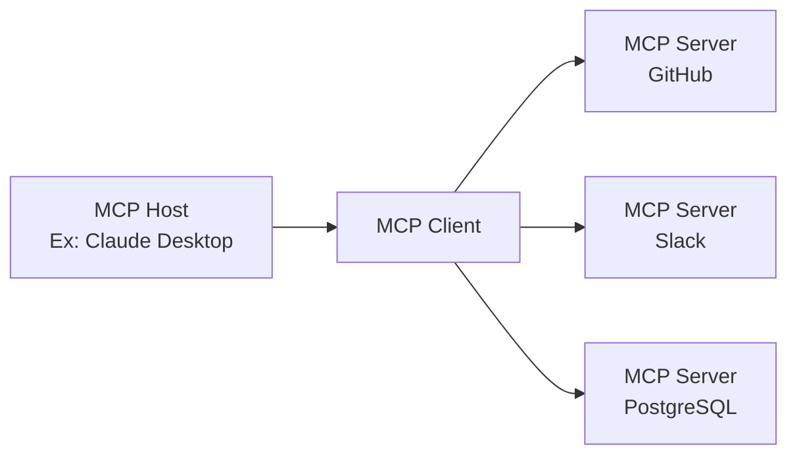

## Introdução

Em novembro de 2024, o **Model Context Protocol (MCP)**, anunciado pela Anthropic, alcançou uma adoção dramática em pouco mais de um ano como um novo padrão aberto para conectar agentes de IA a ferramentas e fontes de dados externas. Números como mais de 97 milhões de downloads mensais de SDK e mais de 10.000 servidores MCP públicos indicam que ele está se estabelecendo como uma infraestrutura fundamental para a era dos agentes de IA, transcendendo o escopo de uma simples especificação técnica.

Este artigo fornecerá uma análise abrangente, desde os mecanismos técnicos do MCP até o histórico de adoção pela OpenAI, Google e Microsoft, o ponto de virada crucial de sua doação para a Linux Foundation, e os desafios de segurança que continuam em debate.

---

## O MCP Resolve o "Problema N×M"

### O Problema do Isolamento da Informação em Sistemas de IA

Antes do surgimento do MCP, a integração de aplicações de IA com fontes de dados externas apresentava uma ineficiência significativa. Por exemplo, para conectar Claude ao Slack, GitHub, Google Drive e um banco de dados Postgres, seria necessário implementar um conector exclusivo para cada fonte de dados.

Essa situação foi denominada "**Problema N×M**" pela Anthropic. Se N é o número de fontes de dados e M é o número de aplicações de IA que as utilizam, teoricamente seriam necessárias N×M implementações individuais. Apenas usar 10 tipos de ferramentas com 5 aplicações de IA resultaria em 50 implementações personalizadas.

```
【Sem MCP】
Claude  ─── Implementação Personalizada A ──→ GitHub
Claude  ─── Implementação Personalizada B ──→ Slack
GPT-4   ─── Implementação Personalizada C ──→ GitHub  （Quase idêntica a A）
GPT-4   ─── Implementação Personalizada D ──→ Slack   （Quase idêntica a B）

【Com MCP】
Claude ─┐
GPT-4  ─┤── Cliente MCP ──→ Servidor MCP（GitHub）
Gemini ─┘                ──→ Servidor MCP（Slack）
```

O MCP resolve este problema com uma estrutura "1:N". Uma vez implementado como um servidor MCP, ele pode ser utilizado por todos os clientes MCP compatíveis.

---

## Arquitetura Técnica do MCP

### Componentes de 3 Camadas

O MCP adota uma arquitetura cliente-servidor, composta por três papéis:

| Papel        | Descrição                                                 |
|--------------|-----------------------------------------------------------|
| **MCP Host** | A aplicação de IA principal. Gerencia e coordena um ou mais Clientes MCP. |
| **MCP Client** | Mantém a conexão com o Servidor MCP e fornece o contexto ao Host. |
| **MCP Server** | Fornece acesso a ferramentas e fontes de dados externas.     |



### Base do Protocolo: JSON-RPC 2.0

A camada de mensagens do MCP é baseada em JSON-RPC 2.0. Os tipos de mensagem são classificados em três categorias:

- **Request**: Uma requisição que necessita de uma resposta.
- **Response**: Uma resposta a uma requisição.
- **Notification**: Uma notificação unidirecional sem necessidade de resposta.

### Camada de Transporte

O MCP suporta dois métodos de transporte principais:

**stdio (Standard Input/Output)**
Ideal para interagir com recursos locais. Comunica-se através de fluxos de entrada e saída simples. Amplamente utilizado para conectar aplicações de IA locais como Claude Desktop a servidores MCP locais.

**Streamable HTTP (anteriormente SSE)**
Permite o envio de mensagens em streaming do servidor para o cliente via HTTP usando Server-Sent Events (SSE). Adequado para tarefas de longa duração e atualizações incrementais. Na atualização da especificação de 2025 (versão de 2025-11-25), o nome do transporte foi alterado de "SSE" para "Streamable HTTP", permitindo uma comunicação bidirecional mais flexível.

### Três Primitivas

As funcionalidades que um servidor MCP expõe externamente são definidas por três tipos de primitivas:

**Resources (Recursos)**
Fornece acesso de leitura a fontes de dados. Apresenta o sistema de arquivos, bancos de dados, respostas de API, etc., de forma que a IA possa consultá-los.

**Tools (Ferramentas)**
Permite a execução de qualquer código. É usado quando a IA cria arquivos, chama APIs ou faz alterações em sistemas externos. A execução de ferramentas pode ter efeitos colaterais, exigindo gerenciamento adequado de permissões.

**Prompts (Prompts)**
Fornece modelos de prompt pré-definidos. Em vez de uma instrução ambígua como "Crie um issue de relatório de bug no GitHub", ele permite comunicar à IA, de forma estruturada, os campos necessários.

---

## Adoção Explosiva: 1 Ano Após o Lançamento

### O Crescimento do Ecossistema em Números

Na época do lançamento do MCP em novembro de 2024, havia apenas cerca de 100 servidores MCP públicos. No entanto, a taxa de crescimento foi surpreendente.

| Período                   | Número de Servidores Públicos | Downloads Mensais de SDK | 
| ------------------------- | ----------------------------- | ------------------------ |
| Novembro de 2024 (Lançamento) | Aproximadamente 100         | —                        |
| Maio de 2025              | Mais de 4.000               | —                        |
| Dezembro de 2025          | Mais de 10.000              | 97 milhões               |

Juntamente com o lançamento do MCP, a Anthropic disponibilizou servidores MCP de referência para sistemas corporativos importantes como GitHub, Slack, Google Drive, Git, PostgreSQL e Puppeteer. Isso reduziu significativamente a barreira de entrada para os desenvolvedores e levou à rápida expansão do ecossistema.

### Adoção pelas Principais Empresas de IA

O MCP estabeleceu-se rapidamente como um padrão da indústria.

**OpenAI (Março de 2025)**
A OpenAI anunciou suporte oficial ao MCP no ChatGPT e na API. Embora a empresa possuísse há muito tempo sua funcionalidade de Function Calling, a adoção do padrão aberto MCP permitiu que ela integrasse o vasto ecossistema MCP.

**Google (Abril de 2025)**
O MCP foi integrado aos modelos Gemini. O acesso a servidores MCP tornou-se possível através do Google AI Studio e Vertex AI, permitindo que os clientes corporativos do Google conectassem seus sistemas internos existentes através do Gemini.

**Microsoft (2025)**
Adicionou suporte ao MCP no Copilot Studio e Azure OpenAI Service. A funcionalidade de cliente MCP também foi incorporada ao Visual Studio Code, acelerando a integração entre o fluxo de trabalho de desenvolvimento e a IA.

---

## Doação para a Linux Foundation e Estabelecimento da Agentic AI Foundation

### Um Ponto de Virada Crucial

Em dezembro de 2025, a Anthropic tomou uma de suas decisões mais importantes: doou o MCP para um novo fundo sob a égide da Linux Foundation, a "**Agentic AI Foundation (AAIF)**".

Essa decisão não foi apenas uma mudança de governança. A Anthropic escolheu posicionar o MCP não como um "diferencial de seu produto", mas como uma infraestrutura aberta para a era dos agentes de IA.

### Visão Geral da Agentic AI Foundation (AAIF)

A AAIF foi estabelecida como um Directed Fund sob a Linux Foundation.

**Membros Fundadores Conjuntos**
- Anthropic (Doação do MCP)
- Block (Doação de goose)
- OpenAI (Doação de AGENTS.md)

**Membros Platina (Participação na Governança)**
Amazon Web Services, Anthropic, Block, Bloomberg, Cloudflare, Google, Microsoft, OpenAI

**Projetos Fundadores**
- Model Context Protocol (MCP) — Fornecido pela Anthropic
- goose — Framework de agente de IA fornecido pela Block
- AGENTS.md — Padrão de descrição de especificação de agente fornecido pela OpenAI

Ao ingressar sob a égide da Linux Foundation, a governança do MCP tornou-se independente de fornecedores e orientada pela comunidade. Esta é uma estratégia semelhante àquela que levou ao estabelecimento do Kubernetes (orquestração de contêineres) e NodeJS como padrões da indústria sob a Linux Foundation.

---

## Comparação entre MCP e REST API

### Diferenças na Filosofia de Design

MCP e REST API não são concorrentes, mas sim complementares. É importante entender as diferenças em suas filosofias de design.

| Aspecto         | REST API                                  | MCP                                                |
|-----------------|-------------------------------------------|----------------------------------------------------|
| Cliente Esperado| Software Tradicional                    | LLMs / Agentes de IA                               |
| Sessão          | Stateless (Sem Estado)                    | Stateful (Com Estado)                              |
| Descoberta      | Descrito separadamente com OpenAPI, etc.  | O servidor expõe dinamicamente                     |
| Múltiplas Etapas| Autenticação em cada requisição           | Eficiência com manutenção de sessão                |
| Streaming       | Requer WebSocket, etc. separadamente      | Suporte nativo com SSE/Streamable HTTP             |

### Por que o MCP é Adequado para Agentes de IA

Considerando um cenário em que um agente de IA chama várias ferramentas em sequência, a superioridade do design do MCP torna-se clara.

```
【Tarefa de Revisão de Código por um Agente de IA】
1. Obter as diferenças do PR do GitHub → MCP Tools
2. Ler os arquivos de código relevantes → MCP Resources
3. Obter o prompt de verificação de segurança → MCP Prompts
4. Publicar comentários de revisão de código no GitHub → MCP Tools
```

Ao usar REST API, cada etapa exigiria a adição de cabeçalhos de autenticação e o reenvio de contexto. Com o MCP, a sessão é mantida, permitindo a execução eficiente de tarefas de várias etapas com custo de autenticação minimizado.

Além disso, um agente de IA pode não saber quais ferramentas estão disponíveis. Como os servidores MCP expõem dinamicamente suas Tools, Resources e Prompts, o agente pode realizar a descoberta no momento da execução e selecionar/usar a ferramenta apropriada.

---

## Desafios de Segurança

### Riscos de Segurança do MCP

Em relação à velocidade de adoção, com 97 milhões de downloads mensais, preocupações sobre a rápida adoção do MCP também foram expressas por pesquisadores de segurança. Os principais riscos de segurança são os seguintes:

**Risco de Vazamento de Token**
O MCP adota OAuth 2.1 como framework de autorização. No entanto, se os tokens de acesso armazenados em cache ou log no lado do cliente ou servidor vazarem, um atacante poderá acessar recursos protegidos como requisições legítimas.

**Ataque Confused Deputy**
Quando um servidor MCP atua como um proxy OAuth, uma validação inadequada do contexto de autorização pode permitir que um atacante execute operações no servidor explorando credenciais de outro usuário.

**Gerenciamento de Registro Dinâmico de Clientes**
O registro dinâmico de clientes OAuth permite que um cliente MCP adicione dinamicamente configurações de cliente OAuth no servidor. No entanto, a RFC para gerenciamento e exclusão de configurações de cliente adicionadas não é amplamente suportada, deixando questões de gerenciamento não resolvidas.

### Resposta na Atualização da Especificação de Junho de 2025

A atualização da especificação do MCP de junho de 2025 teve o aprimoramento da segurança como um de seus temas principais.

- **Obrigação de PKCE (Proof Key for Code Exchange)**: A implementação de PKCE é agora obrigatória, de acordo com a Seção 7.5.2 do OAuth 2.1. Isso impede ataques de interceptação e injeção de código de autorização.
- **Introdução de Indicadores de Recurso (RFC 8707)**: Para garantir que os tokens sejam válidos apenas para o servidor MCP pretendido, a inclusão de indicadores de recurso em requisições de token tornou-se obrigatória. Isso previne o "uso indevido de tokens (token mis-redemption)".
- **Proibição de Token Passthrough**: Foi explicitamente declarado que os servidores MCP não devem aceitar tokens que não foram emitidos explicitamente para o próprio servidor.

---

## Ecossistema Atual e Perspectivas Futuras

### Exemplos Principais de Servidores MCP

Atualmente (início de 2026), servidores MCP são amplamente fornecidos nas seguintes categorias:

**Ferramentas de Desenvolvimento**
- Servidor MCP GitHub (Gerenciamento de PR, Revisão de Código)
- Servidor MCP Git (Operações de repositório local)
- Conjunto de Servidores MCP integrados ao VS Code

**Dados e Infraestrutura**
- Servidor MCP PostgreSQL
- Servidor MCP SQLite
- Servidor MCP Cloudflare Workers

**Comunicação e Produtividade**
- Servidor MCP Slack
- Servidor MCP Google Drive
- Servidor MCP Notion

**IA e Pesquisa**
- Servidor MCP Brave Search
- Servidor MCP Puppeteer (Web Scraping)
- Servidor MCP Fetch

### Preparação para a Era dos Agentes Autônomos

O problema que o MCP busca resolver essencialmente é criar um "ambiente onde os agentes de IA possam usar ferramentas". À medida que a transição de uma fase de modelos de IA únicos operando independentemente para sistemas multiagentes onde múltiplos agentes de IA compartilham e colaboram em ferramentas acelera, a importância do MCP como uma linguagem comum aumenta.

Com o estabelecimento da AAIF, o MCP deixou de ser um produto da Anthropic e iniciou seu caminho para evoluir para uma infraestrutura comum da indústria. Assim como o Kubernetes e o NodeJS se tornaram padrões da indústria sob a égide da Linux Foundation, a resposta para se o MCP pode se tornar o "TCP/IP" da era dos agentes de IA — essa resposta se tornará clara nos próximos 2 a 3 anos.

---

## Conclusão

O MCP representa uma mudança tecnológica importante nos seguintes três aspectos:

**1. Resolução do Problema N×M**
Padronizou a conexão entre sistemas de IA e ferramentas externas, reduzindo drasticamente os custos de desenvolvimento.

**2. Formação de Consenso em Toda a Indústria**
Embora seja um protocolo originado pela Anthropic, o sucesso na formação de um padrão da indústria, incluindo concorrentes, é evidente com a participação da OpenAI, Google e Microsoft como membros platina da AAIF.

**3. Neutralidade da Governança**
Através da doação para a Linux Foundation, estabeleceu um modelo de governança aberta que elimina a dependência de fornecedores específicos.

A partir de 2026, com a penetração dos agentes de IA no mundo prático, o MCP continuará a funcionar como sua infraestrutura subjacente. Para os desenvolvedores, compreender o mecanismo do MCP e utilizar servidores MCP adequados está se tornando o ponto de partida para a construção de sistemas integrados de IA.

---

## Referências

| Título                                                                               | Fonte                      | Data       | URL                                                                                                  |
| ------------------------------------------------------------------------------------ | -------------------------- | ---------- | ---------------------------------------------------------------------------------------------------- |
| Introducing the Model Context Protocol                                               | Anthropic                  | 2024-11-25 | https://www.anthropic.com/news/model-context-protocol                                                |
| Donating the Model Context Protocol and establishing the Agentic AI Foundation         | Anthropic                  | 2025-12-09 | https://www.anthropic.com/news/donating-the-model-context-protocol-and-establishing-of-the-agentic-ai-foundation |
| MCP joins the Agentic AI Foundation                                                  | MCP Blog                   | 2025-12-09 | http://blog.modelcontextprotocol.io/posts/2025-12-09-mcp-joins-agentic-ai-foundation/                |
| Linux Foundation Announces the Formation of the Agentic AI Foundation (AAIF)       | Linux Foundation           | 2025-12-09 | https://www.linuxfoundation.org/press/linux-foundation-announces-the-formation-of-the-agentic-ai-foundation |
| Model Context Protocol Specification 2025-11-25                                        | modelcontextprotocol.io    | 2025-11-25 | https://modelcontextprotocol.io/specification/2025-11-25                                             |
| MCP joins the Linux Foundation: What this means for developers                     | GitHub Blog                | 2025-12-09 | https://github.blog/open-source/maintainers/mcp-joins-the-linux-foundation-what-this-means-for-developers-building-the-next-era-of-ai-tools-and-agents/ |
| Model Context Protocol (MCP): Understanding security risks and controls              | Red Hat                    | 2025       | https://www.redhat.com/en/blog/model-context-protocol-mcp-understanding-security-risks-and-controls   |
| MCP Specs Update — All About Auth                                                    | Auth0                      | 2025-06    | https://auth0.com/blog/mcp-specs-update-all-about-auth/                                              |
| Why the Model Context Protocol Won                                                   | The New Stack              | 2025       | https://thenewstack.io/why-the-model-context-protocol-won/                                           |
| A Year of MCP: From Internal Experiment to Industry Standard                         | Pento                      | 2025-12    | https://www.pento.ai/blog/a-year-of-mcp-2025-review                                                  |
| Model Context Protocol - Wikipedia                                                   | Wikipedia                  | 2026       | https://en.wikipedia.org/wiki/Model_Context_Protocol                                                 |

---

> Este artigo foi gerado automaticamente por LLM. Pode conter erros.
