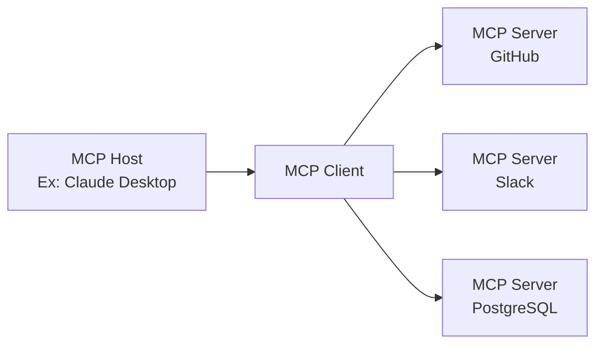

## Introdução

Em novembro de 2024, o **Model Context Protocol (MCP)**, anunciado pela Anthropic, alcançou uma adoção dramática em pouco mais de um ano como um novo padrão aberto para conectar agentes de IA a ferramentas e fontes de dados externas. Números como mais de 97 milhões de downloads de SDK por mês e mais de 10.000 servidores MCP públicos indicam que ele está se estabelecendo não apenas como uma especificação técnica, mas como uma infraestrutura fundamental para a era dos agentes de IA.

Este artigo oferece uma análise abrangente do MCP, desde seus mecanismos técnicos e o histórico de adoção por OpenAI, Google e Microsoft, até sua doação para a Linux Foundation e os desafios de segurança que ainda estão em debate.

---

## O MCP Resolve o "Problema N×M"

### O Problema do Isolamento da Informação em Sistemas de IA

Antes do surgimento do MCP, a integração de aplicações de IA com fontes de dados externas apresentava uma ineficiência significativa. Por exemplo, conectar Claude ao Slack, GitHub, Google Drive, e um banco de dados Postgres exigiria a implementação de conectores específicos para cada fonte de dados.

Essa situação foi descrita pela Anthropic como o "**problema N×M**". Se N é o número de fontes de dados e M é o número de aplicações de IA que as utilizam, teoricamente seriam necessárias N×M implementações individuais. Utilizar 10 ferramentas com 5 aplicações de IA resultaria em 50 implementações personalizadas.

```
【Sem MCP】
Claude  ─── Implementação Customizada A ──→ GitHub
Claude  ─── Implementação Customizada B ──→ Slack
GPT-4   ─── Implementação Customizada C ──→ GitHub  （Similar a A）
GPT-4   ─── Implementação Customizada D ──→ Slack   （Similar a B）

【Com MCP】
Claude ─┐
GPT-4  ─┤── MCP Client ──→ MCP Server（GitHub）
Gemini ─┘                ──→ MCP Server（Slack）
```

O MCP resolve esse problema com uma estrutura "1:N". Uma vez implementado como um servidor MCP, ele pode ser utilizado por todos os clientes MCP compatíveis.

---

## Arquitetura Técnica do MCP

### Componentes de 3 Camadas

O MCP adota uma arquitetura cliente-servidor e é composto por três papéis:

| Papel         | Descrição                                                               | 
|---------------|-------------------------------------------------------------------------|
| **MCP Host**  | A aplicação de IA principal. Gerencia e orquestra um ou mais MCP Clients. |
| **MCP Client**| Mantém a conexão com o MCP Server e fornece o contexto para o Host.     |
| **MCP Server**| Fornece acesso a ferramentas e fontes de dados externas.                  |



### Base do Protocolo: JSON-RPC 2.0

A camada de mensagens do MCP é baseada no JSON-RPC 2.0. Os tipos de mensagem são classificados em três categorias:

- **Request**: Uma solicitação que requer uma resposta.
- **Response**: A resposta a uma solicitação.
- **Notification**: Uma notificação unidirecional que não requer resposta.

### Camada de Transporte

O MCP suporta dois métodos principais de transporte:

**stdio (Standard Input/Output)**
Ideal para integração com recursos locais. Comunica-se através de um fluxo simples de entrada/saída. Amplamente utilizado para conectar aplicações de IA locais como Claude Desktop a servidores MCP locais.

**Streamable HTTP (anteriormente SSE)**
Permite o envio de mensagens de streaming do servidor para o cliente via Server-Sent Events (SSE) sobre HTTP. Adequado para tarefas de longa duração e atualizações incrementais. Na atualização da especificação de 2025 (versão 2025-11-25), o nome do transporte foi alterado de "SSE" para "Streamable HTTP", permitindo comunicação bidirecional mais flexível.

### Três Primitivas

As funcionalidades que um MCP Server expõe externamente são definidas por três tipos de primitivas:

**Resources (Recursos)**
Fornece acesso de leitura a fontes de dados. Oferece dados como sistemas de arquivos, bancos de dados e respostas de API em um formato que a IA pode consultar.

**Tools (Ferramentas)**
Permite a execução de qualquer código. Utilizado quando a IA precisa criar arquivos, chamar APIs ou fazer alterações em sistemas externos. A execução de ferramentas envolve efeitos colaterais, exigindo gerenciamento adequado de permissões.

**Prompts (Prompts)**
Fornece modelos de prompt pré-definidos. Permite comunicar à IA instruções estruturadas, em vez de comandos ambíguos como "crie um issue de relatório de bug no GitHub", com os campos necessários definidos.

---

## Adoção Explosiva: Um Ano Após o Lançamento Público

### Crescimento do Ecossistema em Números

Em novembro de 2024, quando o MCP foi lançado publicamente, havia apenas cerca de 100 servidores MCP públicos. No entanto, a taxa de crescimento foi surpreendente.

| Período                   | Número de Servidores Públicos | Downloads Mensais de SDK | 
|---------------------------|-------------------------------|--------------------------|
| Nov. 2024 (Lançamento)    | ~100                          | —                        |
| Maio 2025                 | > 4.000                       | —                        |
| Dez. 2025                 | > 10.000                      | 97 milhões               |

Na época do lançamento, a Anthropic disponibilizou servidores MCP de referência para sistemas corporativos importantes como GitHub, Slack, Google Drive, Git, PostgreSQL e Puppeteer. Isso reduziu significativamente a barreira de entrada para os desenvolvedores, levando a uma rápida expansão do ecossistema.

### Adoção por Grandes Empresas de IA

O MCP rapidamente se estabeleceu como um padrão da indústria.

**OpenAI (Março de 2025)**
A OpenAI anunciou suporte oficial ao MCP no ChatGPT e em sua API. Embora a empresa já possuísse sua própria funcionalidade de Function Calling, a adoção do padrão aberto MCP permitiu que ela se integrasse ao vasto ecossistema MCP.

**Google (Abril de 2025)**
O MCP foi integrado aos modelos Gemini. O acesso a servidores MCP tornou-se possível através do Google AI Studio e Vertex AI, permitindo que os clientes corporativos do Google conectassem o Gemini aos seus sistemas internos existentes.

**Microsoft (2025)**
Adicionou suporte ao MCP no Copilot Studio e Azure OpenAI Service. A funcionalidade de cliente MCP também foi incorporada ao Visual Studio Code, acelerando a integração do fluxo de trabalho de desenvolvimento com a IA.

---

## Doação para a Linux Foundation e Criação da Agentic AI Foundation

### Um Ponto de Virada Crucial

Em dezembro de 2025, a Anthropic anunciou uma de suas decisões mais importantes: a doação do MCP para um novo fundo sob a égide da Linux Foundation, a **Agentic AI Foundation (AAIF)**.

Esta decisão não foi apenas uma mudança de governança. A Anthropic escolheu posicionar o MCP como uma infraestrutura aberta para a era dos agentes de IA, em vez de um diferencial de produto próprio.

### Visão Geral da Agentic AI Foundation (AAIF)

A AAIF foi estabelecida como um Directed Fund sob a Linux Foundation.

**Membros Fundadores Conjuntos**
- Anthropic (Doação do MCP)
- Block (Doação do goose)
- OpenAI (Doação do AGENTS.md)

**Membros Platina (Participação na Governança)**
Amazon Web Services, Anthropic, Block, Bloomberg, Cloudflare, Google, Microsoft, OpenAI

**Projetos Fundadores**
- Model Context Protocol (MCP) — Fornecido pela Anthropic
- goose — Framework de agente de IA fornecido pela Block
- AGENTS.md — Padrão de descrição de especificação de agentes fornecido pela OpenAI

Ao se juntar à Linux Foundation, a governança do MCP tornou-se independente de fornecedores e orientada pela comunidade. Esta é uma estratégia semelhante à que permitiu que Kubernetes e NodeJS se tornassem padrões da indústria sob a égide da Linux Foundation.

---

## Comparação entre MCP e REST API

### Diferenças de Filosofia de Design

MCP e REST API não são concorrentes, mas sim complementares. É importante entender as diferenças em suas filosofias de design.

| Aspecto       | REST API                               | MCP                                                     |
|---------------|----------------------------------------|---------------------------------------------------------|
| Cliente Esperado | Software tradicional                  | LLMs, Agentes de IA                                     |
| Sessão        | Stateless                              | Stateful                                                |
| Descoberta    | Descrito separadamente via OpenAPI, etc. | Servidor expõe dinamicamente                            |
| Múltiplas Etapas | Autenticação em cada requisição        | Eficiência através da manutenção de sessão              |
| Streaming     | Requer WebSocket, etc.                 | Suporte nativo via SSE/Streamable HTTP                  |

### Por que o MCP é Adequado para Agentes de IA

Considerando um cenário em que um agente de IA chama várias ferramentas em sequência, a superioridade do design do MCP se torna clara.

```
【Tarefa de Revisão de Código por um Agente de IA】
1. Obter diferenças de PR do GitHub → MCP Tools
2. Ler arquivos de código relacionados → MCP Resources
3. Obter prompt para verificação de segurança → MCP Prompts
4. Postar comentários de revisão de código no GitHub → MCP Tools
```

Ao usar REST APIs, cada etapa exigiria a inclusão de cabeçalhos de autenticação e o reenvio de contexto. Com o MCP, a sessão é mantida, minimizando custos de autenticação e permitindo a execução eficiente de tarefas multi-etapas.

Além disso, um agente de IA pode não saber de antemão quais ferramentas estão disponíveis. Como os servidores MCP expõem dinamicamente os Tools, Resources e Prompts que oferecem, os agentes podem realizar a descoberta no tempo de execução e selecionar/usar ferramentas apropriadas.

---

## Desafios de Segurança

### Riscos de Segurança do MCP

Em resposta à sua rápida adoção com 97 milhões de downloads mensais, pesquisadores de segurança expressaram preocupações sobre a propagação apressada do MCP. Os principais riscos de segurança incluem:

**Risco de Vazamento de Tokens**
O MCP adota o OAuth 2.1 como framework de autorização, mas se os tokens de acesso armazenados em cache ou registrados em logs no lado do cliente ou servidor vazarem, um invasor poderá acessar recursos protegidos como se fossem requisições legítimas.

**Ataque "Confused Deputy"**
Quando um MCP Server atua como um proxy OAuth, se a validação do contexto de autorização for inadequada, um invasor poderá explorar credenciais de outro usuário para executar operações no servidor.

**Gerenciamento de Registro Dinâmico de Clientes**
Com o registro dinâmico de clientes OAuth, clientes MCP podem adicionar dinamicamente configurações de cliente OAuth no lado do servidor. No entanto, o gerenciamento e a exclusão das configurações de cliente adicionadas não são amplamente suportados pelas RFCs, deixando desafios de gerenciamento não resolvidos.

### Abordagens na Atualização de Junho de 2025

A atualização da especificação do MCP de junho de 2025 teve o aprimoramento da segurança como um de seus temas principais.

- **Obrigatório PKCE (Proof Key for Code Exchange)**: Seguindo a Seção 7.5.2 do OAuth 2.1, a implementação de PKCE tornou-se obrigatória. Isso previne ataques de interceptação e injeção de código de autorização.
- **Introdução de Resource Indicators (RFC 8707)**: Para garantir que os tokens sejam válidos apenas para o MCP Server pretendido, a inclusão de indicadores de recurso em requisições de token tornou-se obrigatória. Isso previne o "uso indevido de tokens (token mis-redemption)".
- **Proibição de Token Passthrough**: Foi explicitado que os MCP Servers não devem aceitar tokens que não foram explicitamente emitidos para o seu próprio servidor.

---

## Ecossistema Atual e Perspectivas Futuras

### Exemplos de Principais Servidores MCP

Em 2026, servidores MCP são amplamente oferecidos nas seguintes categorias:

**Ferramentas de Desenvolvimento**
- GitHub MCP Server (Gerenciamento de PRs, revisão de código)
- Git MCP Server (Operações de repositório local)
- Conjunto de servidores MCP integrados ao VS Code

**Dados e Infraestrutura**
- PostgreSQL MCP Server
- SQLite MCP Server
- Cloudflare Workers MCP Server

**Comunicação e Produtividade**
- Slack MCP Server
- Google Drive MCP Server
- Notion MCP Server

**IA e Pesquisa**
- Brave Search MCP Server
- Puppeteer MCP Server (Web scraping)
- Fetch MCP Server

### Pedra Fundamental para a Era dos Agentes Autônomos

O MCP busca essencialmente resolver o problema de criar um "ambiente onde os agentes de IA possam usar ferramentas". À medida que a transição de um único modelo de IA operando de forma independente para sistemas multi-agente onde múltiplos agentes de IA compartilham ferramentas e colaboram se acelera, a importância do MCP como uma linguagem comum aumenta.

Com a criação da AAIF, o MCP deixou de ser um produto da Anthropic e iniciou um caminho para se tornar uma infraestrutura comum da indústria. Assim como o Kubernetes e o NodeJS se estabeleceram como padrões da indústria sob a Linux Foundation, a resposta para saber se o MCP pode se tornar o "TCP/IP" da era dos agentes de IA – isso será revelado nos próximos 2 a 3 anos.

---

## Resumo

O MCP representa uma mudança tecnológica significativa em três aspectos:

**1. Resolução do Problema N×M**
Padronizou a conexão entre sistemas de IA e ferramentas externas, reduzindo drasticamente os custos de desenvolvimento.

**2. Formação de Consenso em Toda a Indústria**
Embora originado como um protocolo da Anthropic, obteve sucesso na formação de um padrão da indústria que inclui concorrentes, com OpenAI, Google e Microsoft participando como membros platina da AAIF.

**3. Neutralidade na Governança**
Através da doação para a Linux Foundation, estabeleceu um modelo de governança aberta que elimina a dependência de fornecedores específicos.

A partir de 2026, com a imersão dos agentes de IA na prática profissional, o MCP continuará a funcionar como uma infraestrutura fundamental. Para os desenvolvedores, entender o funcionamento do MCP e utilizar servidores MCP apropriados está se tornando o ponto de partida para a construção de sistemas integrados de IA.

---

## Referências

| Título                                                                                                         | Fonte         | Data       | URL                                                                                                                                    |
|----------------------------------------------------------------------------------------------------------------|---------------|------------|----------------------------------------------------------------------------------------------------------------------------------------|
| Introducing the Model Context Protocol                                                                         | Anthropic     | 2024-11-25 | https://www.anthropic.com/news/model-context-protocol                                                                                  |
| Donating the Model Context Protocol and establishing the Agentic AI Foundation                                 | Anthropic     | 2025-12-09 | https://www.anthropic.com/news/donating-the-model-context-protocol-and-establishing-of-the-agentic-ai-foundation                         |
| MCP joins the Agentic AI Foundation                                                                            | MCP Blog      | 2025-12-09 | http://blog.modelcontextprotocol.io/posts/2025-12-09-mcp-joins-agentic-ai-foundation/                                                    |
| Linux Foundation Announces the Formation of the Agentic AI Foundation (AAIF)                                 | Linux Foundation | 2025-12-09 | https://www.linuxfoundation.org/press/linux-foundation-announces-the-formation-of-the-agentic-ai-foundation                          |
| Model Context Protocol Specification 2025-11-25                                                                | modelcontextprotocol.io | 2025-11-25 | https://modelcontextprotocol.io/specification/2025-11-25                                                                             |
| MCP joins the Linux Foundation: What this means for developers                                                 | GitHub Blog   | 2025-12-09 | https://github.blog/open-source/maintainers/mcp-joins-the-linux-foundation-what-this-means-for-developers-building-the-next-era-of-ai-tools-and-agents/ |
| Model Context Protocol (MCP): Understanding security risks and controls                                        | Red Hat       | 2025       | https://www.redhat.com/en/blog/model-context-protocol-mcp-understanding-security-risks-and-controls                                    |
| MCP Specs Update — All About Auth                                                                              | Auth0         | 2025-06    | https://auth0.com/blog/mcp-specs-update-all-about-auth/                                                                                |
| Why the Model Context Protocol Won                                                                             | The New Stack | 2025       | https://thenewstack.io/why-the-model-context-protocol-won/                                                                             |
| A Year of MCP: From Internal Experiment to Industry Standard                                                   | Pento         | 2025-12    | https://www.pento.ai/blog/a-year-of-mcp-2025-review                                                                                    |
| Model Context Protocol - Wikipedia                                                                             | Wikipedia     | 2026       | https://en.wikipedia.org/wiki/Model_Context_Protocol                                                                                   |

---

> Este artigo foi gerado automaticamente por LLM. Pode conter erros.
