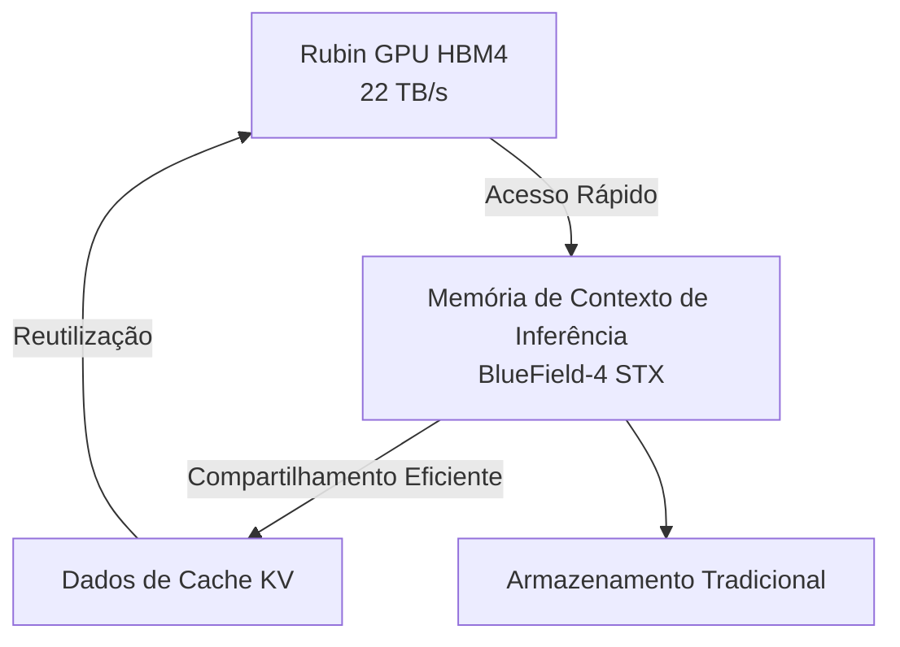
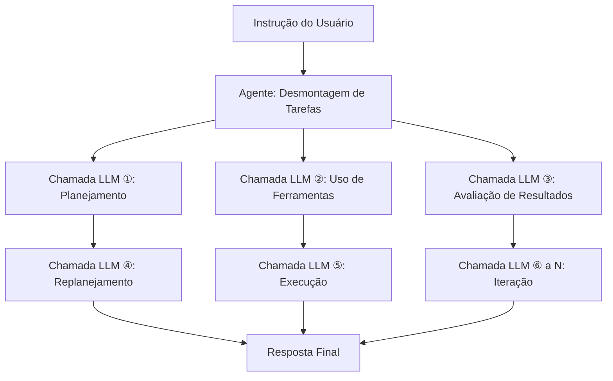

## Introdução: Por Que o Custo de Inferência é um Problema Agora

Em 2026, as discussões em torno da IA migraram rapidamente de "desempenho do modelo" para "economia do custo de inferência". A capacidade dos Modelos de Linguagem Grandes (LLMs) não está mais em questão, mas o que se tornou um obstáculo para a implementação prática nos negócios é o "custo de inferência por token".

Especialmente a IA de agentes, que realiza centenas a milhares de chamadas de LLM para executar uma única tarefa. Isso incorre em um custo várias ordens de magnitude maior do que consultas simples, dificultando o escalonamento.

Jensen Huang, CEO da NVIDIA, resumiu sucintamente essa situação em sua palestra de abertura da GTC 2026 em março de 2026. "Se eles tiverem mais capacidade, eles podem gerar mais tokens e aumentar a receita. Com aplicativos de IA de agentes gerando outros agentes e realizando tarefas sucessivamente, o número de tokens gerados está explodindo", disse ele, enfatizando a importância de uma infraestrutura de inferência rápida e de baixo custo.

A resposta da NVIDIA a essa situação é a plataforma **Vera Rubin**. Revelada pela primeira vez na CES 2026 (janeiro de 2026) e detalhada na GTC 2026 (março de 2026), esta infraestrutura de IA de próxima geração promete reduzir os custos de inferência em até 10 vezes em comparação com a geração Blackwell anterior, atraindo a atenção da indústria.

Neste artigo, exploraremos a arquitetura da Vera Rubin tecnicamente, para entender por que essa redução de custo é possível e qual será seu impacto no futuro da IA de agentes.

---

## O Que é Vera Rubin: Um "Supercomputador de IA" Integrado com 7 Chips

Vera Rubin não é um único chip de GPU, mas sim uma **plataforma de IA integrada com design extremo de 7 tipos de chips dedicados**.
NVIDIA chama isso de "Extreme Co-Design". Na GTC 2026, a NVIDIA confirmou oficialmente a aquisição da Groq em dezembro de 2025 por aproximadamente US$ 20 bilhões, e o LPU Groq 3 foi adicionado à plataforma como o sétimo chip.

Os 7 chips que compõem o sistema são:

| Chip | Função |
|---|---|
| **Vera CPU** | CPU personalizada dedicada à IA (88 núcleos Olympus) |
| **Rubin GPU** | Núcleo de computação de IA (50 PFLOPS NVFP4) |
| **NVLink 6 Switch** | Comunicação de alta velocidade entre GPUs (3.6 TB/s) |
| **ConnectX-9 SuperNIC** | Processamento de rede |
| **BlueField-4 DPU** | Processamento de dados e memória de contexto de inferência |
| **Spectrum-6 Ethernet Switch** | Comunicação Ethernet |
| **Groq 3 LPU** | Acelerador de inferência de baixa latência (adicionado recentemente) |

Todo este sistema é integrado em unidades de rack e fornecido no fator de forma **Vera Rubin NVL72**. Esta configuração integra 72 GPUs Rubin e 36 CPUs Vera em um único rack. Para implantações ainda maiores, existe a configuração **Vera Rubin POD**, com 40 racks, oferecendo 60 exaFLOPS de poder computacional.

---

## Vera CPU: Processador Proprietário Projetado para IA

Um dos pontos que diferenciam a Vera Rubin das plataformas anteriores é a adoção da **CPU personalizada "Vera", projetada pela NVIDIA**.

Vera é equipada com **88 núcleos Olympus**. Olympus é um núcleo proprietário da NVIDIA baseado no conjunto de instruções ARMv9.2, otimizado especificamente para cargas de trabalho de data centers de IA. Cada núcleo pode processar 2 threads em paralelo através da tecnologia "Spatial Multithreading", totalizando **176 threads** de capacidade de processamento. O cache L3 foi aumentado em 40% para 162 MB, e o número de transistores atingiu 227 bilhões, um aumento de 2.2 vezes em relação à geração anterior.

O suporte para precisão FP8 é notável. A Vera CPU é a primeira CPU do setor a suportar nativamente FP8, permitindo o processamento unificado de todas as cargas de trabalho de IA em formatos numéricos de baixa precisão.

Em termos de memória, ela suporta até **1.5 TB de memória SOCAMM LPDDR5X**, oferecendo uma largura de banda de memória de **1.2 TB/s**. Ao aumentar a largura do barramento de memória para 1024 bits e a velocidade para 9600 MT/s, uma largura de banda 2.5 vezes maior que a geração anterior foi alcançada. Mais importante ainda é a conexão com a Rubin GPU. Através do **NVLink-C2C (Chip-to-Chip) de 2ª geração**, uma largura de banda coerente de **1.8 TB/s** é alcançada entre a CPU e a GPU. Isso é 7 vezes mais rápido que o PCIe Gen 6.

### Por Que uma CPU Personalizada é Necessária

Servidores de IA tradicionais utilizam CPUs de propósito geral, mas as CPUs frequentemente se tornam um gargalo na inferência de LLM. A largura de banda de memória do host e a velocidade de conexão não acompanham o poder de processamento da GPU.

A NVIDIA reconheceu que a inferência de LLM é limitada pela largura de banda de memória e interconexão, e otimizou todo o sistema projetando a CPU de forma proprietária. O link coerente de alta velocidade entre CPU e GPU minimiza o overhead de transferência de dados, aumentando a utilização da GPU.

---

## Rubin GPU: O Próximo Motor de Computação Dedicado à Inferência

A Rubin GPU incorpora várias inovações focadas na inferência de IA.

### Especificações Principais

| Item | Valor |
|---|---|
| Desempenho de Inferência NVFP4 | **50 PFLOPS** (5x Blackwell) |
| Desempenho de Treinamento NVFP4 | **35 PFLOPS** (3.5x Blackwell) |
| Memória HBM4 | **288 GB** (por unidade) |
| Largura de Banda de Memória HBM4 | **22 TB/s** |
| Largura de Banda NVLink 6 | **3.6 TB/s** (por GPU) |
| Número de Transistores | **336 bilhões** |

O uso de **HBM4** é particularmente notável. Em comparação com a geração anterior HBM3, a largura de banda da memória aumentou cerca de 2.8 vezes, abordando diretamente o problema de que a inferência de LLM é limitada pela largura de banda da memória.

### NVFP4 e o Motor Transformer de 3ª Geração

A Rubin GPU possui o **Motor Transformer de 3ª Geração**, que utiliza um novo formato numérico de baixa precisão chamado NVFP4. O NVFP4 tem uma densidade aritmética ainda maior que o NVFP8 usado pela Blackwell, alcançando um aumento significativo de throughput com precisão preservada. A NVIDIA alcançou um aumento real de throughput além de um simples aumento de FLOPS, integrando profundamente essa execução de baixa precisão tanto na arquitetura quanto na pilha de software.

---

## NVLink 6: Infraestrutura de Comunicação que Rompe o Gargalo de Largura de Banda

Na inferência de LLM, especialmente em modelos Mixture-of-Experts (MoE) e em ambientes multi-GPU, a **largura de banda de comunicação entre GPUs** é um fator determinante de desempenho.

O NVLink 6 dobrou a largura de banda em comparação com a geração anterior (NVLink 5).

| Indicador | NVLink 5 | NVLink 6 |
|---|---|---|
| Largura de Banda por Switch | 1.800 GB/s | **3.600 GB/s** |
| Largura de Banda por GPU | ~1.8 TB/s | **3.6 TB/s** |
| Largura de Banda Total do Rack NVL72 | — | **260 TB/s** |

A largura de banda interna de 260 TB/s oferecida pelo rack NVL72 permite inferência eficiente de modelos MoE em larga escala.

---

## Groq 3 LPU: Acelerador de Inferência de Baixa Latência

Uma das maiores surpresas da GTC 2026 foi a integração da tecnologia LPU (Language Processing Unit) da Groq na plataforma Vera Rubin. A NVIDIA adquiriu a Groq em 24 de dezembro de 2025 por aproximadamente US$ 20 bilhões, contratando pessoal sênior e obtendo uma licença não exclusiva da tecnologia LPU da Groq.

### Divisão de Tarefas entre GPU e LPU

No sistema Vera Rubin, Rubin e Groq dividem o processo de inferência.


- **Rubin GPU**: Responsável pelo processamento de prefill e decodificação de atenção.
- **Groq 3 LPU**: Responsável pela execução da Rede Feed-Forward (FFN).

Este sistema de divisão de trabalho permite que cada chip se concentre nas tarefas em que é mais especializado.

### Especificações do Rack Groq 3 LPX

O **Groq 3 LPX Rack**, anunciado na GTC 2026, possui 256 LPUs.

| Item | Valor |
|---|---|
| Capacidade SRAM (por chip) | **500 MB** |
| Largura de Banda SRAM (por chip) | **150 TB/s** |
| Largura de Banda de Escalabilidade (por chip) | **2.5 TB/s** |
| Capacidade Total de SRAM On-Chip (Rack) | **128 GB** |
| Largura de Banda de Escalabilidade (Rack) | **640 TB/s** |

O Groq 3 prioriza a largura de banda em detrimento da capacidade, com uma largura de banda de aproximadamente 80 TB/s por chip. Este design centrado em SRAM com alta largura de banda permite baixa latência no processamento FFN.

### Efeito da Integração

A combinação da Vera Rubin e do Groq LPX permite um **aumento de até 35 vezes no throughput de inferência para modelos de trilhões de parâmetros** e um **aumento de 35 vezes no throughput por megawatt**, em comparação com a Rubin GPU sozinha. Isso é alcançado utilizando o LPU como um acelerador de decodificação altamente especializado, sem exigir mudanças significativas na plataforma CUDA.

---

## Armazenamento de Memória de Contexto de Inferência: Especialização para IA de Agentes

A Vera Rubin é projetada como uma "base para IA de agentes", e uma característica importante que demonstra isso é a **plataforma de armazenamento de memória de contexto de inferência**.

### Nova Hierarquia de Memória

A NVIDIA utiliza o BlueField-4 DPU para construir uma nova hierarquia de memória entre a GPU e o armazenamento tradicional.



O rack de armazenamento BlueField-4 STX funciona como uma "memória de contexto dedicada" para manter a consistência do contexto quando os agentes de IA mantêm diálogos multi-turn em larga escala. Ao descarregar dados de cache KV para o chip BlueField-4, os dados de cache podem ser compartilhados e reutilizados em toda a infraestrutura de inferência de IA, aumentando o throughput de inferência em **até 5 vezes**.

### Impacto na IA de Agentes

A IA de agentes possui padrões de computação fundamentalmente diferentes das consultas simples.



Para uma única instrução, ocorrem dezenas a centenas de chamadas de LLM, cada uma com um contexto longo. O armazenamento de memória de contexto de inferência melhora o throughput geral e a eficiência de custo da IA de agentes gerenciando eficientemente esses caches KV.

---

## O Mecanismo de Redução de Custo de 10x: Interpretando os Números Corretamente

É crucial entender precisamente sob quais condições o número de "redução de custo de inferência de 10x" afirmado pela NVIDIA é alcançado.

### Principais Fatores de Melhoria

A redução de custo de 10x é o resultado combinado de várias inovações tecnológicas.

```
Aumento da largura de banda da memória HBM4: ~2.8x
Aumento do throughput NVLink 6: ~2x
Aumento do desempenho do núcleo Tensor NVFP4: ~5x
Eficiência do processamento FFN aprimorada pela integração do Groq LPU: Fator adicional
```

### Melhoria Dramática na Eficiência Energética

Jensen Huang apresentou números impressionantes em sua palestra. "Na geração Blackwell, podíamos gerar 22 milhões de tokens por segundo de um data center de 1 GW. Com Vera Rubin, podemos gerar 700 milhões de tokens por segundo com a mesma energia. Isso é um aumento de 350 vezes em dois anos", disse ele.

| Indicador | Blackwell | Vera Rubin | Fator de Melhoria |
|---|---|---|---|
| Tokens/segundo por 1 GW | 22 milhões | **700 milhões** | **~32x** |
| Custo por Token (contexto longo) | Base | Máximo 1/10 | **Máximo 10x** |
| Throughput de Inferência/Watt | Base | 10x | **10x** |
| Número de GPUs de Treinamento MoE | Base | 1/4 | **4x mais eficiente** |

### Expectativas Realistas

Por outro lado, uma avaliação realista é importante. A redução de custo de 10x é um resultado de benchmark em condições específicas de "contexto longo e saída longa". Para inferência de modelos densos com contexto curto, uma melhoria de 2 a 3 vezes é uma expectativa realista.

---

## Rack NVL72: Desempenho do Sistema Completo

O Vera Rubin NVL72 é um sistema em escala de rack onde cada componente é integrado.

### Resumo das Especificações NVL72

| Item | Especificação |
|---|---|
| Configuração de GPU | 72x Rubin GPUs |
| Configuração de CPU | 36x Vera CPUs |
| Desempenho Total de Inferência NVFP4 | **3.6 ExaFLOPS** |
| Capacidade Total de HBM4 | **20.7 TB** |
| Largura de Banda Total de HBM4 | **1.6 PB/s** (Petabytes por segundo) |
| Largura de Banda Total NVLink 6 | **260 TB/s** |

### Vera Rubin POD: Implantação em Escala de Data Center

Uma configuração ainda maior, o **Vera Rubin POD**, está disponível e é composta por 40 racks.

| Item | Especificação |
|---|---|
| Número Total de GPUs | 2.880 |
| Poder Computacional Total | **60 ExaFLOPS** |
| Componentes de Configuração | Mais de 1.300.000 |

O POD é a unidade básica dos data centers de próxima geração que a própria NVIDIA chama de "Fábricas de IA".

---

## Comparação com Blackwell: Evolução entre Gerações

Vera Rubin sucede a Blackwell da NVIDIA. Vamos organizar as principais melhorias de cada geração.

| Item | Blackwell | Vera Rubin | Fator de Melhoria |
|---|---|---|---|
| Desempenho de Inferência de GPU (NVFP4) | 10 PFLOPS | **50 PFLOPS** | **5x** |
| Desempenho de Treinamento de GPU | 10 PFLOPS | **35 PFLOPS** | **3.5x** |
| Largura de Banda Inter-GPU | 1.800 GB/s | **3.600 GB/s** | **2x** |
| Geração HBM | HBM3 | **HBM4** | **~2.8x** |
| CPU | Uso Geral/Grace | **Vera (Olympus 88 núcleos)** | — |
| Inferência de Baixa Latência | — | **Integração Groq 3 LPU** | — |
| Número de GPUs de Treinamento (MoE) | Base | **Reduzido para 1/4** | **4x** |
| Custo por Token | Base | **Máximo 1/10** | **Máximo 10x** |

---

## Cronograma de Implantação e Principais Parceiros

### Cronograma de Fornecimento

A NVIDIA planeja **iniciar a produção em massa e o envio da Vera Rubin no segundo semestre de 2026**.
Na GTC 2026 (16 a 19 de março de 2026), a Vera Rubin foi confirmada como estando "em pleno estado de produção".

### Parceiros de Implantação Inicial

Os seguintes parceiros foram anunciados para fornecer serviços de nuvem baseados em Vera Rubin inicialmente:

- **Hiperescaladores**: AWS, Google Cloud, Microsoft Azure, Oracle Cloud Infrastructure (OCI)
- **Nuvens Especializadas**: CoreWeave, Lambda, Nebius, Nscale

Jensen Huang declarou: "Os pedidos acumulados para Blackwell e Rubin excederão US$ 1 trilhão até o final de 2027", indicando que a Vera Rubin é central para o investimento em data centers.

---

## Desafios Técnicos e Perspectivas Futuras

### Consumo de Energia e Investimento em Data Center

Embora o rack NVL72 possua um poder computacional imenso, seu consumo de energia também é considerável. Em 2026, o investimento total em infraestrutura de data center para hiperescaladores deverá exceder US$ 65 bilhões. A adoção da Vera Rubin exigirá investimentos em larga escala em infraestrutura de energia e resfriamento.

### Desenvolvimento do Ecossistema de Software

Embora a NVIDIA afirme que a integração do Groq 3 LPU não exigirá grandes alterações na plataforma CUDA, a otimização da pilha de software (bibliotecas CUDA, frameworks de inferência) também é importante. A NVIDIA está progredindo com soluções como NIM (NVIDIA Inference Microservices).

### Próxima Geração "Vera Rubin Ultra"

Na GTC 2026, uma próxima geração, a **Vera Rubin Ultra**, também foi anunciada, sugerindo que a NVIDIA continuará a evoluir sua plataforma em ciclos anuais.

---

## Conclusão: Rumo ao Próximo Estágio da Infraestrutura de IA

A NVIDIA Vera Rubin não é apenas "uma GPU mais rápida". É uma plataforma de IA integrada onde 7 chips – a CPU proprietária Vera, o aumento significativo na largura de banda de memória com HBM4, o dobro da comunicação entre GPUs com NVLink 6, a integração de baixa latência com o Groq 3 LPU para inferência, e o gerenciamento de cache KV com o armazenamento de memória de contexto de inferência – são projetados com extrema cooperação.

A redução de custo de inferência de até 10x (em condições de contexto longo), a redução de 4x no número de GPUs de treinamento para modelos MoE, e a capacidade de gerar 350 vezes mais tokens com a mesma energia mudarão fundamentalmente a viabilidade econômica da IA de agentes.

Em 2026, à medida que a IA de agentes começa a ser implementada em larga escala para automação de processos empresariais, o custo de inferência torna-se uma questão direta de lucratividade para os negócios. Quando a Vera Rubin iniciar sua produção em massa no segundo semestre de 2026, essa equação de custo será reescrita. O que determina a adoção da IA não é apenas a inteligência do modelo, mas também a economia de sua infraestrutura operacional. Nesse contexto, a Vera Rubin será uma inovação de infraestrutura crucial que definirá 2026.

---

## Referências

| Título | Fonte | Data | URL |
|:---------|:-------|:-----|:----|
| NVIDIA Kicks Off the Next Generation of AI With Rubin — Six New Chips, One Incredible AI Supercomputer | NVIDIA Newsroom | 2026/03/16 | https://nvidianews.nvidia.com/news/rubin-platform-ai-supercomputer |
| NVIDIA Vera Rubin Opens Agentic AI Frontier | NVIDIA Newsroom | 2026/03/16 | https://nvidianews.nvidia.com/news/nvidia-vera-rubin-platform |
| Inside the NVIDIA Vera Rubin Platform: Six New Chips, One AI Supercomputer | NVIDIA Technical Blog | 2026/03/16 | https://developer.nvidia.com/blog/inside-the-nvidia-rubin-platform-six-new-chips-one-ai-supercomputer/ |
| Inside NVIDIA Groq 3 LPX: The Low-Latency Inference Accelerator for the NVIDIA Vera Rubin Platform | NVIDIA Technical Blog | 2026/03/16 | https://developer.nvidia.com/blog/inside-nvidia-groq-3-lpx-the-low-latency-inference-accelerator-for-the-nvidia-vera-rubin-platform/ |
| NVIDIA Vera Rubin POD: Seven Chips, Five Rack-Scale Systems, One AI Supercomputer | NVIDIA Technical Blog | 2026/03/16 | https://developer.nvidia.com/blog/nvidia-vera-rubin-pod-seven-chips-five-rack-scale-systems-one-ai-supercomputer/ |
| Infrastructure for Scalable AI Reasoning | NVIDIA Oficial | 2026/03 | https://www.nvidia.com/en-us/data-center/technologies/rubin/ |
| Nvidia launches Vera Rubin NVL72 AI supercomputer at CES | Tom's Hardware | 2026/01/06 | https://www.tomshardware.com/pc-components/gpus/nvidia-launches-vera-rubin-nvl72-ai-supercomputer-at-ces-promises-up-to-5x-greater-inference-performance-and-10x-lower-cost-per-token-than-blackwell-coming-2h-2026 |
| GTC 2026: Nvidia Unveils Vera Rubin AI Platform, Eyes \$1T by 2027 | Data Center Knowledge | 2026/03/16 | https://www.datacenterknowledge.com/data-center-chips/gtc-2026-nvidia-unveils-vera-rubin-ai-platform-eyes-1t-by-2027 |
| Nvidia GTC 2026: CEO Jensen Huang sees \$1 trillion in orders for Blackwell and Vera Rubin through '27 | CNBC | 2026/03/16 | https://www.cnbc.com/2026/03/16/nvidia-gtc-2026-ceo-jensen-huang-keynote-blackwell-vera-rubin.html |
| Nvidia's Rubin platform aims to cut AI training, inference costs | CIO Dive | 2026/03 | https://www.ciodive.com/news/nvidia-rubin-cut-ai-training-inference-costs/808915/ |
| NVIDIA Vera Rubin NVL72 Detailed: 72 GPUs, 36 CPUs, 260 TB/s Scale-Up Bandwidth | VideoCardz | 2026/01 | https://videocardz.com/newz/nvidia-vera-rubin-nvl72-detailed-72-gpus-36-cpus-260-tb-s-scale-up-bandwidth |
| Decoding the Future of Inference At NVIDIA: Groq LPUs Join Vera Rubin Platform | ServeTheHome | 2026/03/16 | https://www.servethehome.com/decoding-the-future-of-inference-at-nvidia-groq-lpus-join-vera-rubin-platform-for-low-latency-inference/ |
| Nvidia Boasts 7 Chips in Production for Vera Rubin Platform, Including Groq 3 LPU | HPCwire | 2026/03/16 | https://www.hpcwire.com/2026/03/16/nvidia-boasts-7-chips-in-production-for-vera-rubin-platform-including-groq-3-lpu/ |
| NVIDIA Launches New Vera CPU: 88 Olympus Cores Designed From Scratch for AI | Knowledge Hub Media | 2026/01 | https://knowledgehubmedia.com/nvidia-launches-new-vera-cpu-88-olympus-cores-designed-from-scratch-for-ai/ |
| NVIDIA GTC 2026: Rubin GPUs, Groq LPUs, Vera CPUs, and What NVIDIA Is Building for Trillion-Parameter Inference | StorageReview | 2026/03/16 | https://www.storagereview.com/news/nvidia-gtc-2026-rubin-gpus-groq-lpus-vera-cpus-and-what-nvidia-is-building-for-trillion-parameter-inference |

---

> Este artigo foi gerado automaticamente por LLM. Pode conter erros.
