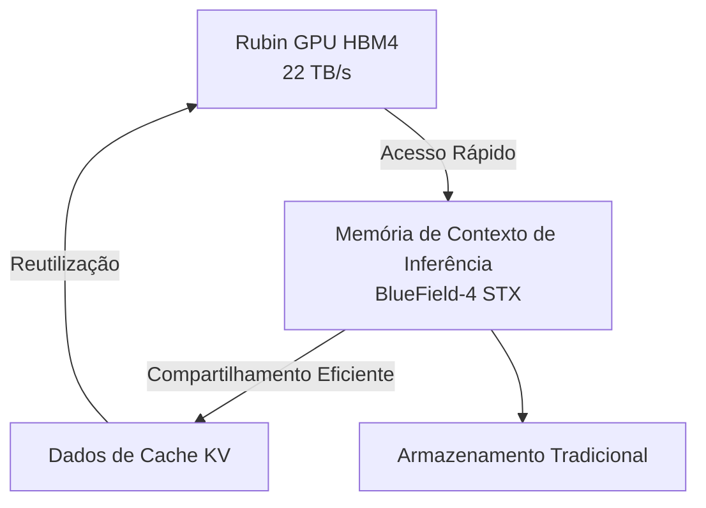
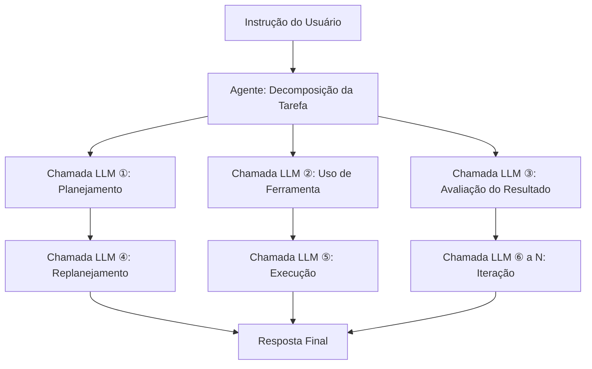

## Introdução: Por que o Custo de Inferência é um Problema Agora?

Em 2026, a discussão em torno da IA mudou rapidamente de "desempenho do modelo" para "economia do custo de inferência". A capacidade dos Modelos de Linguagem Grandes (LLMs) não é mais questionada, mas o que se tornou uma barreira para a implantação real nos negócios é o "custo de inferência por token".

Particularmente a IA de agentes realiza centenas a milhares de chamadas de LLM para executar uma única tarefa. Como o custo é ordens de magnitude maior do que consultas simples, a escalabilidade tem sido difícil.

Na conferência magna da GTC 2026 em março de 2026, o CEO da NVIDIA, Jensen Huang, resumiu essa situação: "Se eles tiverem mais capacidade, eles podem gerar mais tokens e obter mais receita. Com aplicativos de agentes agora gerando outros agentes para concluir tarefas em sucessão, o número de tokens gerados está explodindo". Ele enfatizou a importância de uma infraestrutura de inferência rápida e de baixo custo.

A resposta da NVIDIA a essa situação é a plataforma **Vera Rubin**. Revelada pela primeira vez na CES 2026 (janeiro de 2026) e detalhada na GTC 2026 (março de 2026), esta infraestrutura de IA de próxima geração promete reduzir os custos de inferência em até 10 vezes em comparação com a Blackwell anterior, atraindo a atenção da indústria.

Este artigo explora a arquitetura da Vera Rubin tecnicamente, investigando por que essa redução de custos é possível e qual seu impacto no futuro da IA de agentes.

---

## O que é Vera Rubin: Um "Supercomputador de IA" com 7 Chips Integrados

Vera Rubin não é um único chip de GPU, mas uma **plataforma de IA integrada com 7 tipos de chips dedicados projetados em extrema coordenação (co-design)**. A NVIDIA chama isso de "Extreme Co-Design". Na GTC 2026, a NVIDIA confirmou oficialmente a aquisição da Groq em dezembro de 2025 por aproximadamente US$ 20 bilhões, e o Groq 3 LPU foi adicionado como o sétimo chip à plataforma.

Os 7 chips que compõem o sistema são os seguintes:

| Chip                  | Função                                       |
| --------------------- | -------------------------------------------- |
| **Vera CPU**          | CPU customizada para IA (88 núcleos Olympus) |
| **Rubin GPU**         | Núcleo de computação de IA (50 PFLOPS NVFP4) |
| **NVLink 6 Switch**   | Comunicação de alta velocidade entre GPUs (3.6 TB/s) |
| **ConnectX-9 SuperNIC** | Processamento de rede                         |
| **BlueField-4 DPU**   | Processamento de dados e memória de contexto de inferência |
| **Spectrum-6 Ethernet Switch** | Comunicação Ethernet                          |
| **Groq 3 LPU**        | Acelerador de inferência de baixa latência (novo) |

Todo o sistema é integrado por rack, fornecido no fator de forma **Vera Rubin NVL72**. Esta configuração integra 72 GPUs Rubin e 36 CPUs Vera em um único rack. Para implantações ainda maiores, uma configuração de 40 racks chamada **Vera Rubin POD** também está disponível, oferecendo 60 ExaFLOPS de poder computacional.

---

## Vera CPU: Processador Proprietário Projetado para IA

Um dos principais diferenciais da Vera Rubin em relação às plataformas anteriores é a adoção da **CPU customizada "Vera", projetada internamente pela NVIDIA**.

A Vera possui **88 núcleos Olympus**. Olympus é um núcleo projetado pela NVIDIA com base no conjunto de instruções ARMv9.2, otimizado especificamente para cargas de trabalho de data centers de IA. Cada núcleo processa 2 threads em paralelo usando a tecnologia "Spatial Multithreading", resultando em uma capacidade de processamento total de **176 threads**. O cache L3 aumentou em 40% para 162 MB, e o número de transistores atingiu 227 bilhões, um aumento de 2.2 vezes em relação à geração anterior.

Notavelmente, ela suporta precisão FP8. A Vera CPU é a primeira CPU do setor a suportar FP8 nativamente, permitindo o processamento unificado de todas as cargas de trabalho de IA em formatos numéricos de baixa precisão.

Em termos de memória, ela suporta até **1.5 TB de memória SOCAMM LPDDR5X**, oferecendo uma largura de banda de memória de **1.2 TB/s**. Ao aumentar a largura do barramento de memória para 1024 bits e a velocidade para 9600 MT/s, ela alcança uma largura de banda 2.5 vezes maior que a geração anterior. Mais importante ainda é a conexão com as GPUs Rubin. Através da **NVLink-C2C (Chip-to-Chip) de 2ª geração**, ela alcança uma largura de banda coerente de **1.8 TB/s** entre CPU e GPU. Isso é 7 vezes mais rápido que o PCIe Gen 6.

### Por que uma CPU Customizada é Necessária?

Servidores de IA tradicionais utilizam CPUs de uso geral, mas em inferência de LLM, a CPU frequentemente se torna um gargalo. A largura de banda da memória da CPU host e a velocidade de conexão não acompanham o poder de processamento da GPU.

A NVIDIA reconheceu que a inferência de LLM é limitada pela largura de banda da memória e pela interconexão, e otimizou o sistema como um todo, projetando a CPU internamente. O link rápido e coerente entre CPU e GPU minimiza a sobrecarga de transferência de dados, aumentando a utilização da GPU.

---

## Rubin GPU: O Motor de Computação de Próxima Geração Otimizado para Inferência

A GPU Rubin incorpora várias inovações focadas em inferência de IA.

### Especificações Principais

| Item                     | Valor         |
| ------------------------ | ------------- |
| Desempenho de Inferência NVFP4 | **50 PFLOPS** (5x Blackwell) |
| Desempenho de Treinamento NVFP4 | **35 PFLOPS** (3.5x Blackwell) |
| Memória HBM4             | **288 GB** (por unidade) |
| Largura de Banda da Memória HBM4 | **22 TB/s**   |
| Largura de Banda NVLink 6 | **3.6 TB/s** (por GPU) |
| Número de Transistores   | **336 bilhões** |

Notavelmente, a adoção do **HBM4** é significativa. Em comparação com o HBM3 da geração anterior, a largura de banda da memória aumentou aproximadamente 2.8 vezes, abordando diretamente o problema de inferência de LLM limitada pela largura de banda da memória.

### NVFP4 e o Motor Transformer de 3ª Geração

A GPU Rubin está equipada com o **Motor Transformer de 3ª Geração**, que utiliza um novo formato numérico de baixa precisão chamado NVFP4. O NVFP4 tem uma densidade aritmética ainda maior que o NVFP8 adotado pelo Blackwell, alcançando um aumento de throughput substancial enquanto mantém a precisão. A NVIDIA alcançou um aumento de throughput efetivo além do simples aumento de FLOPS, integrando profundamente essa execução de baixa precisão em sua arquitetura e pilha de software.

---

## NVLink 6: Infraestrutura de Comunicação que Quebra o Gargalo da Largura de Banda

Na inferência de LLM, especialmente em modelos Mixture-of-Experts (MoE) e ambientes multi-GPU, a **largura de banda de comunicação entre GPUs** dita o desempenho.

O NVLink 6 dobra a **largura de banda** em comparação com a geração anterior (NVLink 5).

| Indicador                | NVLink 5       | NVLink 6       |
| ------------------------ | -------------- | -------------- |
| Largura de Banda por Switch | 1.800 GB/s     | **3.600 GB/s** |
| Largura de Banda por GPU    | Aprox. 1.8 TB/s | **3.6 TB/s**   |
| Largura de Banda Total do Rack NVL72 | —              | **260 TB/s**   |

A largura de banda interna de 260 TB/s fornecida pelo rack NVL72 permite a inferência eficiente de modelos MoE em larga escala.

---

## Groq 3 LPU: Acelerador de Inferência de Baixa Latência

Uma das maiores surpresas na GTC 2026 foi a integração da tecnologia LPU (Language Processing Unit) da Groq à plataforma Vera Rubin. A NVIDIA adquiriu a Groq em 24 de dezembro de 2025 por aproximadamente US$ 20 bilhões, obtendo a contratação de pessoal sênior e uma licença não exclusiva para a tecnologia LPU da Groq.

### Divisão de Tarefas entre GPU e LPU

No sistema Vera Rubin, Rubin e Groq compartilham o processo de inferência.


- **GPU Rubin**: Responsável pelo processamento de prefill e atenção de decodificação.
- **Groq 3 LPU**: Responsável pela execução da rede feed-forward (FFN).

Essa divisão de trabalho permite que cada chip se concentre no processamento em que é mais eficiente.

### Especificações do Rack Groq 3 LPX

O **Groq 3 LPX Rack**, anunciado na GTC 2026, acomoda 256 LPUs.

| Item                     | Valor         |
| ------------------------ | ------------- |
| Capacidade de SRAM (por chip) | **500 MB**    |
| Largura de Banda de SRAM (por chip) | **150 TB/s**  |
| Largura de Banda de Scale-up (por chip) | **2.5 TB/s**  |
| Capacidade Total de SRAM On-Chip (Rack) | **128 GB**    |
| Largura de Banda de Scale-up (Rack) | **640 TB/s**  |

O Groq 3 prioriza a largura de banda em vez da capacidade, com cerca de 80 TB/s de largura de banda por chip. Esse design de alta largura de banda centrado em SRAM é o que permite a baixa latência no processamento FFN.

### Efeito da Integração

A combinação de Vera Rubin e Groq LPX resulta em um **aumento de até 35x no throughput de inferência de modelos de trilhões de parâmetros** e um **aumento de 35x no throughput por megawatt** em comparação com as GPUs Rubin sozinhas. Isso é alcançado aproveitando o LPU como um acelerador de decodificação altamente especializado, sem exigir alterações significativas na plataforma CUDA.

---

## Armazenamento de Memória de Contexto de Inferência: Especializado para IA de Agentes

Uma característica importante que demonstra o design da Vera Rubin como uma "base para IA de agentes" é sua **plataforma de armazenamento de memória de contexto de inferência**.

### Nova Hierarquia de Memória

A NVIDIA utiliza a BlueField-4 DPU para construir uma nova hierarquia de memória entre as GPUs e o armazenamento tradicional.



Os racks de armazenamento BlueField-4 STX funcionam como "memória de contexto dedicada" para manter a consistência do contexto quando agentes de IA mantêm diálogos multi-turn em larga escala. Ao descarregar os dados do cache KV para os chips BlueField-4, os dados do cache podem ser compartilhados e reutilizados em toda a infraestrutura de inferência de IA, **aumentando o throughput de inferência em até 5 vezes**.

### Impacto na IA de Agentes

A IA de agentes possui padrões computacionais fundamentalmente diferentes das consultas simples.



Para uma única instrução, ocorrem dezenas a centenas de chamadas LLM, cada uma com um contexto longo. A plataforma de armazenamento de memória de contexto de inferência melhora o throughput geral e a eficiência de custo da IA de agentes, gerenciando o cache KV de forma eficiente.

---

## O Mecanismo de Redução de Custo de 10x: Lendo os Números Corretamente

É crucial entender precisamente sob quais condições o número de "redução de custo de inferência de 10 vezes" da NVIDIA é alcançado.

### Principais Fatores de Melhoria

A redução de custo de 10 vezes é alcançada como um efeito composto de múltiplas inovações tecnológicas.

```
Aumento da largura de banda da memória HBM4: Aprox. 2.8x
Aumento do throughput NVLink 6: Aprox. 2x
Aumento do desempenho do Tensor Core NVFP4: Aprox. 5x
Eficiência do processamento FNN com a integração do Groq LPU: Fator adicional
```

### Melhoria Dramática na Eficiência Energética

Jensen Huang apresentou números impressionantes em sua conferência magna. "Com a geração Blackwell, podíamos gerar 22 milhões de tokens por segundo a partir de um data center de 1 GW. Com a Vera Rubin, podemos gerar 700 milhões de tokens por segundo com a mesma energia. Isso é um aumento de 350 vezes em dois anos." Ele declarou.

| Indicador                 | Blackwell      | Vera Rubin      | Fator de Melhoria |
| ------------------------- | -------------- | --------------- | ----------------- |
| Tokens/segundo por 1 GW   | 22 milhões     | **700 milhões** | **Aprox. 32x**    |
| Custo por Token (Contexto Longo) | Base           | Máx. 1/10       | **Máx. 10x**      |
| Throughput de Inferência/Watt | Base           | 10x             | **10x**           |
| Número de GPUs para Treinamento MoE | Base           | 1/4             | **4x de Eficiência** |

### Expectativa Realista

Por outro lado, uma avaliação realista é importante. A redução de custo de 10 vezes é um resultado de benchmark sob condições específicas de "contexto longo e saída longa", e para a inferência de modelos densos com contexto curto, uma melhoria de 2 a 3 vezes é a expectativa realista.

---

## Rack NVL72: Desempenho do Sistema Completo

O Vera Rubin NVL72 é um sistema em escala de rack que integra cada componente.

### Resumo das Especificações do NVL72

| Item                    | Especificação          |
| ----------------------- | ---------------------- |
| Configuração de GPU     | Rubin GPU × 72 unidades |
| Configuração de CPU     | Vera CPU × 36 unidades  |
| Desempenho Total de Inferência NVFP4 | **3.6 ExaFLOPS**       |
| Capacidade Total HBM4   | **20.7 TB**            |
| Largura de Banda Total HBM4 | **1.6 PB/s** (Petabytes por segundo) |
| Largura de Banda Total NVLink 6 | **260 TB/s**           |

### Vera Rubin POD: Implantação em Escala de Data Center

Para configurações ainda maiores, o **Vera Rubin POD** está disponível, composto por 40 racks.

| Item              | Especificação     |
| ----------------- | ----------------- |
| Número Total de GPUs | 2.880 unidades    |
| Desempenho Computacional Total | **60 ExaFLOPS**   |
| Componentes de Configuração | Mais de 1.300.000 |

O POD é a unidade básica dos data centers de próxima geração que a própria NVIDIA chama de "fábricas de IA".

---

## Comparação com Blackwell: Evolução entre Gerações

A Vera Rubin sucede a Blackwell da NVIDIA. Vamos organizar as principais melhorias de cada geração.

| Item                  | Blackwell           | Vera Rubin          | Fator de Melhoria |
| --------------------- | ------------------- | ------------------- | ----------------- |
| Desempenho de Inferência da GPU (NVFP4) | 10 PFLOPS           | **50 PFLOPS**       | **5x**            |
| Desempenho de Treinamento da GPU | 10 PFLOPS           | **35 PFLOPS**       | **3.5x**          |
| Largura de Banda Inter-GPU | 1.800 GB/s          | **3.600 GB/s**      | **2x**            |
| Geração HBM           | HBM3                | **HBM4**            | **Aprox. 2.8x**   |
| CPU                   | Uso Geral/Grace     | **Vera (88 núcleos Olympus)** | —                 |
| Inferência de Baixa Latência | —                   | **Integração Groq 3 LPU** | —                 |
| Número de GPUs para Treinamento (MoE) | Base                | **Redução para 1/4** | **4x**            |
| Custo por Token       | Base                | **Máx. 1/10**       | **Máx. 10x**      |

---

## Cronograma de Implantação e Principais Parceiros

### Cronograma de Fornecimento

A NVIDIA planeja **iniciar a produção em massa e o envio da Vera Rubin no segundo semestre de 2026**. Na GTC 2026 (16 a 19 de março de 2026), confirmou-se que a Vera Rubin estava "em produção total".

### Parceiros de Implantação Inicial

Os seguintes parceiros foram anunciados para oferecer serviços de nuvem baseados em Vera Rubin inicialmente:

- **Hiperescaladores**: AWS, Google Cloud, Microsoft Azure, Oracle Cloud Infrastructure (OCI)
- **Nuvens Especializadas**: CoreWeave, Lambda, Nebius, Nscale

Jensen Huang declarou: "As ordens acumuladas para Blackwell e Rubin devem ultrapassar US$ 1 trilhão até o final de 2027", indicando que a Vera Rubin está posicionada como um pilar para investimentos em data centers.

---

## Desafios Técnicos e Perspectivas Futuras

### Consumo de Energia e Investimento em Data Centers

Embora o rack NVL72 possua uma capacidade computacional imensa, seu consumo de energia também é considerável. Em 2026, prevê-se que o investimento total em infraestrutura de data centers por hiperescaladores ultrapasse US$ 65 bilhões, e a adoção da Vera Rubin exigirá investimentos substanciais em infraestrutura de energia e refrigeração.

### Desenvolvimento do Ecossistema de Software

Embora a NVIDIA afirme que a integração do Groq 3 LPU não requer alterações significativas na plataforma CUDA, a otimização da pilha de software (bibliotecas CUDA, frameworks de inferência) também é importante. A NVIDIA está avançando nisso com o NIM (NVIDIA Inference Microservices), entre outros.

### Próxima Geração "Vera Rubin Ultra"

Na GTC 2026, uma próxima geração, a **Vera Rubin Ultra**, também foi anunciada, sugerindo que a NVIDIA continuará a evoluir sua plataforma em ciclos anuais.

---

## Resumo: Para o Próximo Estágio da Infraestrutura de IA

A NVIDIA Vera Rubin não é apenas "uma GPU mais rápida". É uma plataforma de IA integrada onde 7 chips e sistemas relacionados foram projetados em extrema coordenação: um processador proprietário chamado Vera CPU, um aumento significativo na largura de banda de memória com HBM4, comunicação inter-GPU duplicada com NVLink 6, integração de inferência de baixa latência com Groq 3 LPU, e gerenciamento de cache KV com armazenamento de memória de contexto de inferência.

A redução de custo de inferência de até 10 vezes (em condições de contexto longo), a redução de 4 vezes no número de GPUs necessárias para treinamento de modelos MoE, e a capacidade de geração de 350 vezes mais tokens com a mesma energia, mudarão fundamentalmente a viabilidade econômica da IA de agentes.

Em 2026, à medida que a IA de agentes começa a ser implantada em larga escala para automação de processos de negócios, o custo de inferência se torna um desafio diretamente ligado à lucratividade do negócio. Quando a Vera Rubin iniciar a produção em massa no segundo semestre de 2026, essa equação de custo será reescrita. Não é apenas a inteligência do modelo que determinará a aplicabilidade da IA, mas também a economia de sua infraestrutura operacional. Nesse contexto, a Vera Rubin será uma inovação crucial em infraestrutura que representa 2026.

---

## Referências

| Título                                                                                                   | Fonte             | Data       | URL                                                                                                                                             |
| :------------------------------------------------------------------------------------------------------- | :---------------- | :--------- | :---------------------------------------------------------------------------------------------------------------------------------------------- |
| NVIDIA Kicks Off the Next Generation of AI With Rubin — Six New Chips, One Incredible AI Supercomputer     | NVIDIA Newsroom   | 2026/03/16 | https://nvidianews.nvidia.com/news/rubin-platform-ai-supercomputer                                                                               |
| NVIDIA Vera Rubin Opens Agentic AI Frontier                                                              | NVIDIA Newsroom   | 2026/03/16 | https://nvidianews.nvidia.com/news/nvidia-vera-rubin-platform                                                                                    |
| Inside the NVIDIA Vera Rubin Platform: Six New Chips, One AI Supercomputer                               | NVIDIA Technical Blog | 2026/03/16 | https://developer.nvidia.com/blog/inside-the-nvidia-rubin-platform-six-new-chips-one-ai-supercomputer/                                               |
| Inside NVIDIA Groq 3 LPX: The Low-Latency Inference Accelerator for the NVIDIA Vera Rubin Platform       | NVIDIA Technical Blog | 2026/03/16 | https://developer.nvidia.com/blog/inside-nvidia-groq-3-lpx-the-low-latency-inference-accelerator-for-the-nvidia-vera-rubin-platform/                 |
| NVIDIA Vera Rubin POD: Seven Chips, Five Rack-Scale Systems, One AI Supercomputer                        | NVIDIA Technical Blog | 2026/03/16 | https://developer.nvidia.com/blog/nvidia-vera-rubin-pod-seven-chips-five-rack-scale-systems-one-ai-supercomputer/                                  |
| Infrastructure for Scalable AI Reasoning                                                                 | NVIDIA Official   | 2026/03    | https://www.nvidia.com/en-us/data-center/technologies/rubin/                                                                                     |
| Nvidia launches Vera Rubin NVL72 AI supercomputer at CES                                                  | Tom's Hardware    | 2026/01/06 | https://www.tomshardware.com/pc-components/gpus/nvidia-launches-vera-rubin-nvl72-ai-supercomputer-at-ces-promises-up-to-5x-greater-inference-performance-and-10x-lower-cost-per-token-than-blackwell-coming-2h-2026 |
| GTC 2026: Nvidia Unveils Vera Rubin AI Platform, Eyes \$1T by 2027                                       | Data Center Knowledge | 2026/03/16 | https://www.datacenterknowledge.com/data-center-chips/gtc-2026-nvidia-unveils-vera-rubin-ai-platform-eyes-1t-by-2027                               |
| Nvidia GTC 2026: CEO Jensen Huang sees \$1 trillion in orders for Blackwell and Vera Rubin through '27 | CNBC              | 2026/03/16 | https://www.cnbc.com/2026/03/16/nvidia-gtc-2026-ceo-jensen-huang-keynote-blackwell-vera-rubin.html                                                  |
| Nvidia's Rubin platform aims to cut AI training, inference costs                                         | CIO Dive          | 2026/03    | https://www.ciodive.com/news/nvidia-rubin-cut-ai-training-inference-costs/808915/                                                                 |
| NVIDIA Vera Rubin NVL72 Detailed: 72 GPUs, 36 CPUs, 260 TB/s Scale-Up Bandwidth                          | VideoCardz        | 2026/01    | https://videocardz.com/newz/nvidia-vera-rubin-nvl72-detailed-72-gpus-36-cpus-260-tb-s-scale-up-bandwidth                                           |
| Decoding the Future of Inference At NVIDIA: Groq LPUs Join Vera Rubin Platform                             | ServeTheHome      | 2026/03/16 | https://www.servethehome.com/decoding-the-future-of-inference-at-nvidia-groq-lpus-join-vera-rubin-platform-for-low-latency-inference/                 |
| Nvidia Boasts 7 Chips in Production for Vera Rubin Platform, Including Groq 3 LPU                       | HPCwire           | 2026/03/16 | https://www.hpcwire.com/2026/03/16/nvidia-boasts-7-chips-in-production-for-vera-rubin-platform-including-groq-3-lpu/                               |
| NVIDIA Launches New Vera CPU: 88 Olympus Cores Designed From Scratch for AI                              | Knowledge Hub Media | 2026/01    | https://knowledgehubmedia.com/nvidia-launches-new-vera-cpu-88-olympus-cores-designed-from-scratch-for-ai/                                          |
| NVIDIA GTC 2026: Rubin GPUs, Groq LPUs, Vera CPUs, and What NVIDIA Is Building for Trillion-Parameter Inference | StorageReview     | 2026/03/16 | https://www.storagereview.com/news/nvidia-gtc-2026-rubin-gpus-groq-lpus-vera-cpus-and-what-nvidia-is-building-for-trillion-parameter-inference |

---

> Este artigo foi gerado automaticamente por LLM. Pode conter erros.
